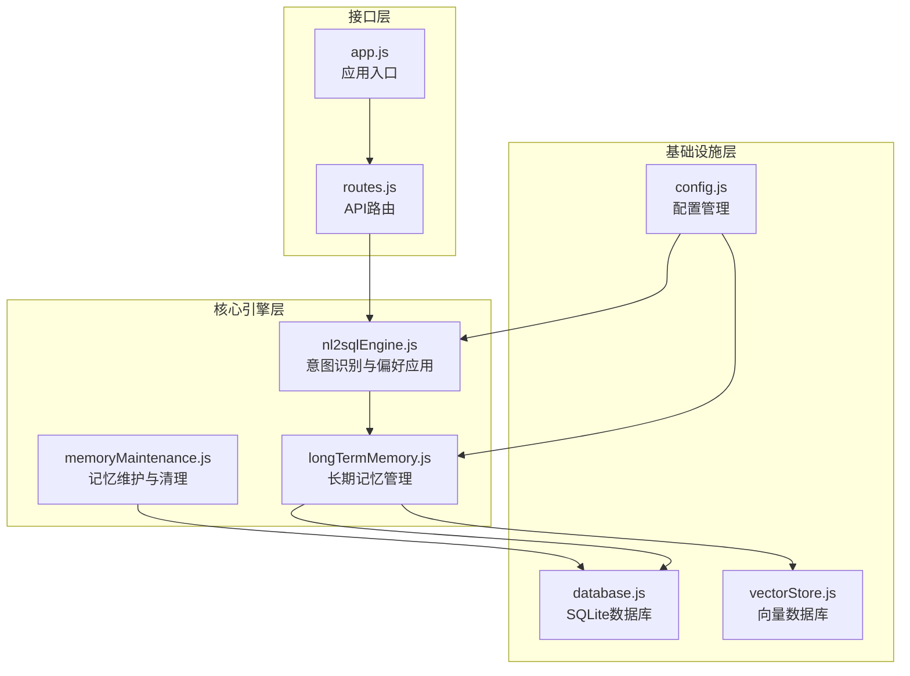
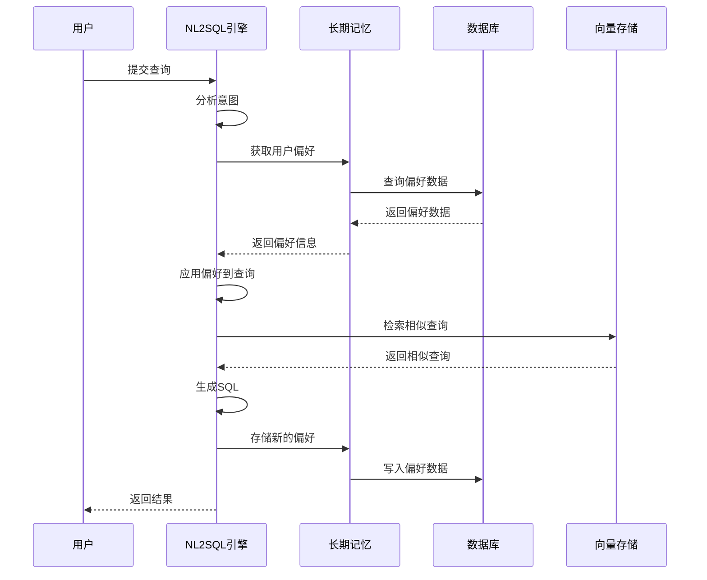
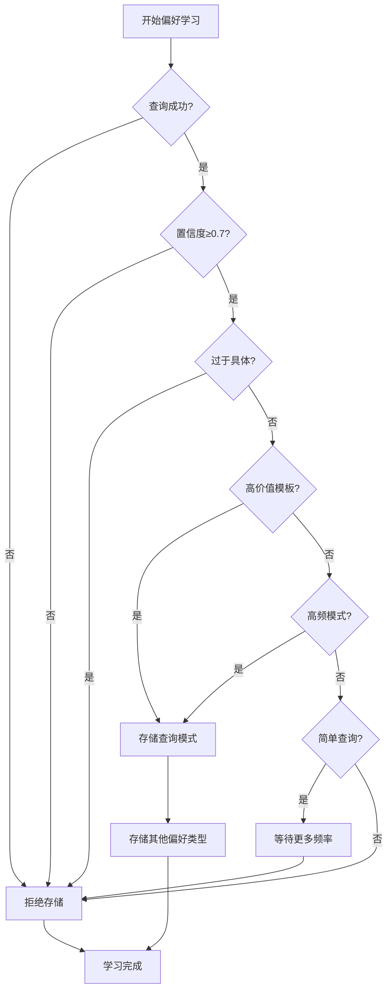
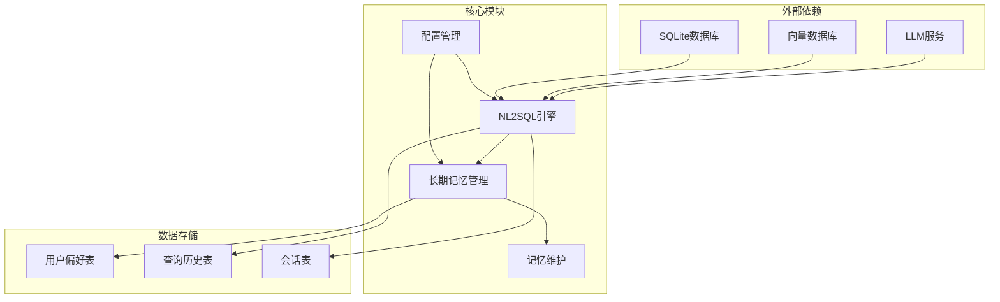

# 偏好学习机制

<cite>
**本文档引用的文件**
- [app.js](file://backend/src/app.js)
- [nl2sqlEngine.js](file://backend/src/core/nl2sqlEngine.js)
- [longTermMemory.js](file://backend/src/memory/longTermMemory.js)
- [memoryMaintenance.js](file://backend/src/memory/memoryMaintenance.js)
- [config.js](file://backend/src/core/config.js)
- [database.js](file://backend/src/core/database.js)
- [vectorStore.js](file://backend/src/memory/vectorStore.js)
- [routes.js](file://backend/src/core/routes.js)
</cite>

## 目录
1. [简介](#简介)
2. [项目结构](#项目结构)
3. [核心组件](#核心组件)
4. [架构概览](#架构概览)
5. [详细组件分析](#详细组件分析)
6. [依赖关系分析](#依赖关系分析)
7. [性能考虑](#性能考虑)
8. [故障排除指南](#故障排除指南)
9. [结论](#结论)
10. [附录](#附录)

## 简介

偏好学习机制是NL2SQL系统中一个重要的智能化功能，它能够自动学习和记忆用户的查询习惯、业务术语和数据偏好。该机制通过分析用户的自然语言查询，自动提取并存储用户的个性化偏好，从而在后续交互中提供更加智能化和个性化的查询体验。

系统实现了多层次的偏好学习策略，包括查询模式识别、字段别名映射、指标偏好提取和维度偏好学习。通过长期记忆管理，系统能够持续优化用户的查询体验，减少重复澄清，提高查询准确性和效率。

## 项目结构

NL2SQL项目的偏好学习机制分布在多个核心模块中，形成了完整的偏好学习生态系统：



**图表来源**
- [nl2sqlEngine.js:1-800](file://backend/src/core/nl2sqlEngine.js#L1-L800)
- [longTermMemory.js:1-1134](file://backend/src/memory/longTermMemory.js#L1-L1134)
- [database.js:1-850](file://backend/src/core/database.js#L1-L850)

**章节来源**
- [app.js:1-238](file://backend/src/app.js#L1-L238)
- [config.js:1-372](file://backend/src/core/config.js#L1-L372)

## 核心组件

偏好学习机制由以下几个核心组件构成：

### 1. 长期记忆管理器 (LongTermMemory)
负责用户长期记忆的提取、存储、检索和维护，包括查询模式、字段别名、常用指标/维度偏好。

### 2. 偏好提取与存储引擎
实现智能筛选判断，决定哪些查询应该被存储为长期偏好，以及如何存储不同类型的学习内容。

### 3. 记忆维护系统
负责长期记忆的定期压缩、清理和维护，实现分级保留策略。

### 4. 数据存储层
基于SQLite的用户偏好表，支持复杂的JSON内容存储和高效查询。

**章节来源**
- [longTermMemory.js:1-800](file://backend/src/memory/longTermMemory.js#L1-L800)
- [memoryMaintenance.js:1-415](file://backend/src/memory/memoryMaintenance.js#L1-L415)
- [database.js:137-189](file://backend/src/core/database.js#L137-L189)

## 架构概览

偏好学习机制采用分层架构设计，确保了系统的可扩展性和维护性：



**图表来源**
- [nl2sqlEngine.js:497-780](file://backend/src/core/nl2sqlEngine.js#L497-L780)
- [longTermMemory.js:311-484](file://backend/src/memory/longTermMemory.js#L311-L484)

## 详细组件分析

### 偏好类型分类体系

系统定义了四种主要的偏好类型，每种类型都有其特定的存储格式和应用场景：

#### 1. 查询模式偏好 (query_pattern)
- **用途**：存储用户常用的查询模板和模式
- **存储格式**：
  ```json
  {
    "name": "最近7天_渠道_收入金额",
    "dimensions": ["渠道"],
    "metrics": ["收入金额"],
    "default_time_range": {"type": "relative", "value": "最近7天"},
    "filter_pattern": [],
    "sample_query": "查一下最近7天的收入"
  }
  ```
- **应用场景**：快速生成类似查询，减少用户输入

#### 2. 字段别名偏好 (field_alias)
- **用途**：存储用户习惯使用的业务术语与其真实字段的映射
- **存储格式**：
  ```json
  {
    "user_term": "青木",
    "schema_field": "game_id",
    "field_type": "game",
    "mapping_value": "30"
  }
  ```
- **应用场景**：自动实体解析，支持多语言查询

#### 3. 指标偏好 (metric_preference)
- **用途**：记录用户经常使用的指标
- **存储格式**：
  ```json
  {
    "field_name": "收入金额",
    "last_query": "查一下今天的收入"
  }
  ```
- **应用场景**：智能补全和默认选择

#### 4. 维度偏好 (dimension_preference)
- **用途**：记录用户经常使用的维度
- **存储格式**：
  ```json
  {
    "field_name": "渠道",
    "last_query": "按渠道查看收入"
  }
  ```
- **应用场景**：查询模板生成和智能推荐

**章节来源**
- [longTermMemory.js:35-41](file://backend/src/memory/longTermMemory.js#L35-L41)
- [database.js:137-157](file://backend/src/core/database.js#L137-L157)

### 偏好学习触发条件

偏好学习机制通过多种方式触发学习过程：

#### 1. 查询成功且置信度达标
- **条件**：查询必须成功执行，且意图置信度≥0.7
- **目的**：确保学习的内容是高质量的

#### 2. 高价值模板识别
- **条件**：维度≥2且指标≥1的查询模式
- **目的**：存储有价值的查询模板

#### 3. 高频模式检测
- **条件**：7天内相似查询≥2次
- **目的**：识别用户的常用查询模式

#### 4. 单次查询优化
- **条件**：至少1个维度或1个指标的简单查询
- **目的**：为简单查询建立基础偏好

**章节来源**
- [longTermMemory.js:251-295](file://backend/src/memory/longTermMemory.js#L251-L295)

### 智能筛选机制

系统实现了多层次的智能筛选机制来判断查询的价值：



**图表来源**
- [longTermMemory.js:311-484](file://backend/src/memory/longTermMemory.js#L311-L484)

### 字段别名学习机制

字段别名学习是偏好学习的核心功能之一，支持多种学习场景：

#### 1. 实体解析学习
当用户在澄清轮中提供实体映射关系时，系统自动学习：
- **示例**："青木是游戏名称，对应game_id=30"
- **处理**：存储用户术语→实体ID的映射关系

#### 2. 平台术语学习
支持平台/数据源术语的学习：
- **示例**："新平台对应new_tzpingtai"
- **处理**：存储平台术语→数据源标识的映射

#### 3. 即时学习功能
系统能够从用户文本中自动提取映射关系：
- **支持格式**：Markdown表格、键值对、显式声明
- **应用场景**：批量学习业务字典

**章节来源**
- [nl2sqlEngine.js:114-186](file://backend/src/core/nl2sqlEngine.js#L114-L186)
- [longTermMemory.js:844-965](file://backend/src/memory/longTermMemory.js#L844-L965)

### 记忆维护策略

系统实现了智能的记忆维护策略，确保长期记忆的有效性和性能：

#### 1. 分级保留策略
- **高频偏好**：使用次数≥10，永久保留
- **中频偏好**：使用次数3-9，90天未用清理
- **低频偏好**：使用次数<3，30天未用清理
- **字段别名**：365天未用清理

#### 2. 相似模式合并
系统能够自动识别和合并相似的查询模式，减少冗余存储。

#### 3. 定期清理机制
通过记忆维护模块定期清理过期和低价值的偏好数据。

**章节来源**
- [memoryMaintenance.js:24-46](file://backend/src/memory/memoryMaintenance.js#L24-L46)
- [memoryMaintenance.js:195-309](file://backend/src/memory/memoryMaintenance.js#L195-L309)

## 依赖关系分析

偏好学习机制的依赖关系体现了清晰的分层架构：



**图表来源**
- [nl2sqlEngine.js:16-30](file://backend/src/core/nl2sqlEngine.js#L16-L30)
- [longTermMemory.js:17-21](file://backend/src/memory/longTermMemory.js#L17-L21)

**章节来源**
- [config.js:248-288](file://backend/src/core/config.js#L248-L288)
- [database.js:39-189](file://backend/src/core/database.js#L39-L189)

## 性能考虑

偏好学习机制在设计时充分考虑了性能优化：

### 1. 存储优化
- **索引策略**：为user_id、preference_type和复合索引建立索引
- **JSON存储**：使用JSON格式存储复杂内容，支持灵活查询
- **分区存储**：按偏好类型分区存储，提高查询效率

### 2. 查询优化
- **缓存机制**：用户偏好数据在内存中缓存
- **批量操作**：支持批量偏好查询和更新
- **延迟加载**：非关键数据采用延迟加载策略

### 3. 内存管理
- **连接池**：数据库连接采用连接池管理
- **垃圾回收**：及时释放不再使用的内存
- **监控机制**：实时监控内存使用情况

## 故障排除指南

### 常见问题及解决方案

#### 1. 偏好学习不生效
**症状**：用户反馈偏好没有被记住
**排查步骤**：
1. 检查查询是否成功执行
2. 验证意图置信度是否≥0.7
3. 确认用户ID是否正确传递
4. 查看日志中的存储决策原因

#### 2. 存储空间不足
**症状**：系统提示存储空间不足
**解决方案**：
1. 启动记忆维护任务清理过期偏好
2. 检查配置中的保留策略设置
3. 定期执行手动清理操作

#### 3. 查询性能下降
**症状**：偏好查询响应缓慢
**排查步骤**：
1. 检查数据库索引是否完整
2. 监控查询执行计划
3. 考虑增加硬件资源

**章节来源**
- [longTermMemory.js:481-483](file://backend/src/memory/longTermMemory.js#L481-L483)
- [memoryMaintenance.js:117-119](file://backend/src/memory/memoryMaintenance.js#L117-L119)

## 结论

NL2SQL系统的偏好学习机制通过多层次的设计和智能算法，实现了高效的用户偏好学习和管理。该机制不仅提高了查询的准确性和效率，还为用户提供了更加智能化和个性化的查询体验。

系统的核心优势包括：
- **智能筛选**：通过置信度和价值评估确保学习质量
- **多层存储**：支持多种偏好类型的灵活存储
- **自动维护**：智能清理和合并机制保证系统性能
- **扩展性强**：模块化设计便于功能扩展和维护

随着系统的持续使用和优化，偏好学习机制将不断改进，为用户提供更加精准和高效的查询服务。

## 附录

### 配置参数说明

#### 长期记忆配置
| 参数名 | 默认值 | 描述 |
|--------|--------|------|
| longTermMemory.enabled | true | 是否启用长期记忆功能 |
| longTermMemory.useLLMForExtraction | false | 是否使用LLM进行智能提炼 |
| thresholds.minConfidence | 0.7 | 最小置信度阈值 |
| thresholds.minDimensionsForTemplate | 2 | 高价值模板最小维度数 |
| thresholds.minMetricsForTemplate | 1 | 高价值模板最小指标数 |
| thresholds.recentDaysForFrequency | 7 | 频率判断天数 |
| thresholds.minFrequencyForSimple | 2 | 简单查询最小频率 |

#### 记忆保留策略
| 策略类型 | 使用次数 | 保留天数 |
|----------|----------|----------|
| 高频偏好 | ≥10 | 永久保留 |
| 中频偏好 | 3-9 | 90天 |
| 低频偏好 | <3 | 30天 |
| 字段别名 | - | 365天 |

### API接口说明

#### 获取用户偏好
- **端点**：`GET /api/preferences/:userId`
- **功能**：获取用户的查询偏好汇总
- **参数**：`type`（可选，偏好类型）、`limit`（可选，返回数量）

#### 学习字段别名
- **端点**：`POST /api/preferences/:userId/learn-alias`
- **功能**：手动学习字段别名映射
- **请求体**：`user_term`、`schema_field`、`field_type`

#### 存储查询模板
- **端点**：`POST /api/preferences/:userId/templates`
- **功能**：手动添加查询模板
- **请求体**：模板名称、维度、指标、时间范围等

**章节来源**
- [config.js:254-288](file://backend/src/core/config.js#L254-L288)
- [routes.js:551-714](file://backend/src/core/routes.js#L551-L714)