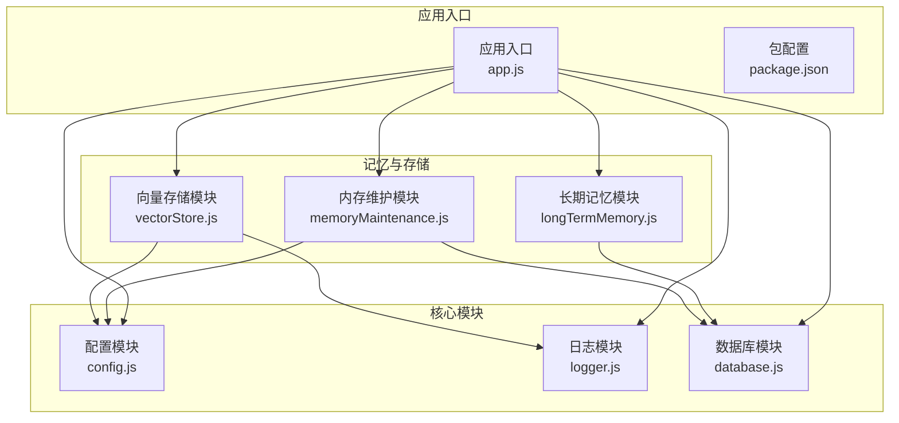
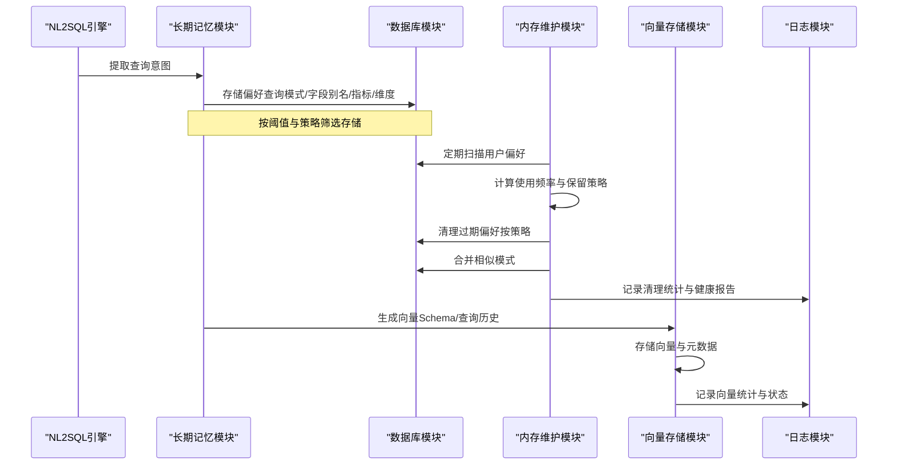
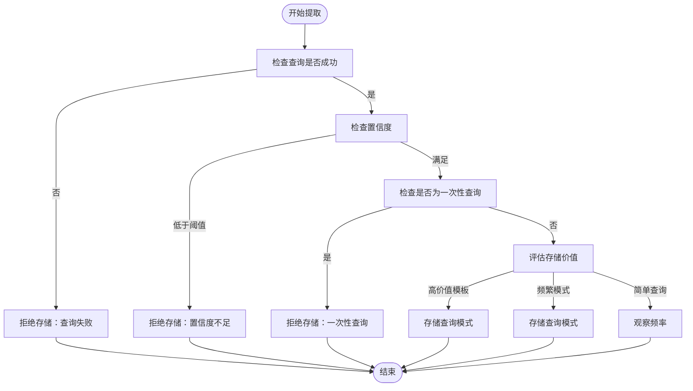
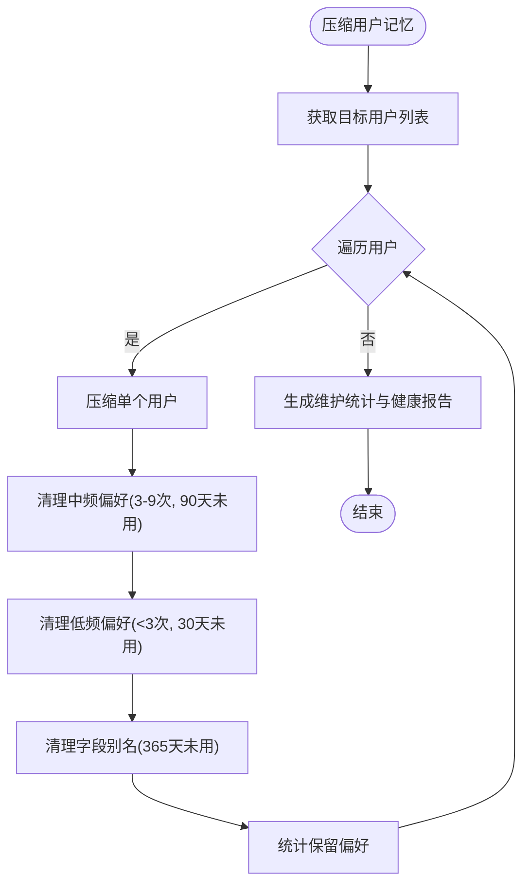
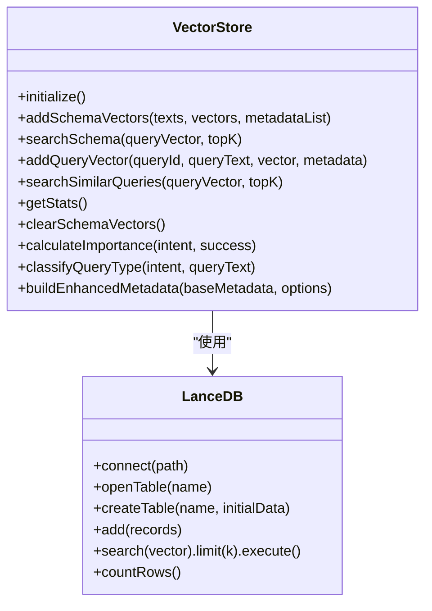
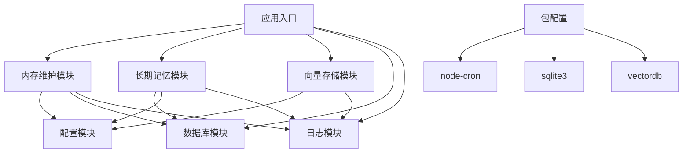

# 内存维护策略

<cite>
**本文引用的文件**
- [memoryMaintenance.js](file://backend/src/memory/memoryMaintenance.js)
- [longTermMemory.js](file://backend/src/memory/longTermMemory.js)
- [vectorStore.js](file://backend/src/memory/vectorStore.js)
- [config.js](file://backend/src/core/config.js)
- [database.js](file://backend/src/core/database.js)
- [logger.js](file://backend/src/utils/logger.js)
- [app.js](file://backend/src/app.js)
- [package.json](file://backend/package.json)
</cite>

## 目录
1. [简介](#简介)
2. [项目结构](#项目结构)
3. [核心组件](#核心组件)
4. [架构概览](#架构概览)
5. [详细组件分析](#详细组件分析)
6. [依赖分析](#依赖分析)
7. [性能考虑](#性能考虑)
8. [故障排查指南](#故障排查指南)
9. [结论](#结论)
10. [附录](#附录)

## 简介
本文件系统性阐述NL2SQL项目中的“内存维护策略”，重点围绕长期记忆的数据清理机制、存储空间优化、性能监控策略，以及定时任务配置、数据质量保证措施、配置参数说明与最佳实践。文档旨在帮助开发者与运维人员理解并有效实施长期记忆的维护工作，平衡存储效率与数据完整性，并在维护过程中最小化对系统性能的影响。

## 项目结构
NL2SQL后端采用模块化设计，长期记忆与向量存储分别由独立模块负责：
- 长期记忆模块：负责用户偏好提取、存储与维护（清理、合并、统计）
- 向量存储模块：负责Schema与查询历史的向量表示与语义检索
- 配置模块：集中管理长期记忆、向量数据库、日志等配置
- 数据库模块：提供SQLite持久化能力，支撑长期记忆表结构
- 日志模块：统一日志输出，支持文件轮转与级别控制

图表来源
- [app.js:97-166](file://backend/src/app.js#L97-L166)
- [config.js:248-288](file://backend/src/core/config.js#L248-L288)
- [memoryMaintenance.js:16-18](file://backend/src/memory/memoryMaintenance.js#L16-L18)
- [longTermMemory.js:17-21](file://backend/src/memory/longTermMemory.js#L17-L21)
- [vectorStore.js:14-20](file://backend/src/memory/vectorStore.js#L14-L20)

章节来源
- [app.js:97-166](file://backend/src/app.js#L97-L166)
- [package.json:10-27](file://backend/package.json#L10-L27)

## 核心组件
- 长期记忆模块（Layer 2）：负责从查询意图中提取用户偏好（查询模式、字段别名、指标/维度偏好），并进行存储与筛选。
- 内存维护模块：负责长期记忆的定期压缩、清理、相似模式合并与统计报告。
- 向量存储模块：基于LanceDB实现Schema与查询历史的向量存储与语义检索。
- 配置模块：集中管理长期记忆的阈值、保留策略、向量维度等配置。
- 数据库模块：提供SQLite持久化，支撑长期记忆表结构与查询。
- 日志模块：统一日志输出，支持文件轮转与级别控制。

章节来源
- [longTermMemory.js:1-11](file://backend/src/memory/longTermMemory.js#L1-L11)
- [memoryMaintenance.js:1-10](file://backend/src/memory/memoryMaintenance.js#L1-L10)
- [vectorStore.js:1-9](file://backend/src/memory/vectorStore.js#L1-L9)
- [config.js:248-288](file://backend/src/core/config.js#L248-L288)
- [database.js:137-189](file://backend/src/core/database.js#L137-L189)
- [logger.js:25-41](file://backend/src/utils/logger.js#L25-L41)

## 架构概览
长期记忆维护贯穿“提取—存储—维护—清理—合并—统计”的闭环流程。系统通过配置模块动态调整保留策略与阈值，通过数据库模块持久化偏好，通过内存维护模块定期清理与合并，通过向量存储模块提供语义检索能力，通过日志模块记录维护过程与异常。

图表来源
- [longTermMemory.js:311-484](file://backend/src/memory/longTermMemory.js#L311-L484)
- [memoryMaintenance.js:69-189](file://backend/src/memory/memoryMaintenance.js#L69-L189)
- [vectorStore.js:229-320](file://backend/src/memory/vectorStore.js#L229-L320)
- [database.js:609-781](file://backend/src/core/database.js#L609-L781)

## 详细组件分析

### 长期记忆提取与存储
- 存储筛选阈值：
  - 最小置信度：低于阈值的查询不存储
  - 高价值模板：维度≥2且指标≥1的查询优先存储
  - 频繁模式：7天内相似查询≥2次的简单查询也存储
  - 排除一次性查询：同时具备具体筛选、绝对时间范围、单一维度/指标的查询不存储
- LLM智能分析：可启用LLM对查询进行价值判断，区分个人偏好与通用知识，提取字段别名、维度习惯、指标组合、过滤逻辑等偏好类型
- 偏好类型：
  - 查询模式（query_pattern）
  - 字段别名（field_alias）
  - 指标偏好（metric_preference）
  - 维度偏好（dimension_preference）

图表来源
- [longTermMemory.js:320-484](file://backend/src/memory/longTermMemory.js#L320-L484)
- [longTermMemory.js:251-295](file://backend/src/memory/longTermMemory.js#L251-L295)
- [longTermMemory.js:218-243](file://backend/src/memory/longTermMemory.js#L218-L243)

章节来源
- [longTermMemory.js:26-33](file://backend/src/memory/longTermMemory.js#L26-L33)
- [longTermMemory.js:251-295](file://backend/src/memory/longTermMemory.js#L251-L295)
- [longTermMemory.js:311-484](file://backend/src/memory/longTermMemory.js#L311-L484)

### 内存维护：清理与合并
- 清理策略（按使用频率与类型）：
  - 高频（≥10次）：永久保留（不清理）
  - 中频（3-9次）：90天未用清理
  - 低频（<3次）：30天未用清理
  - 字段别名：365天未用清理
- 批量处理逻辑：
  - 按用户维度进行清理，避免全量扫描
  - 统计清理数量与保留数量，生成维护报告
- 相似模式合并：
  - 基于维度重合度、指标重合度与时间范围类型判断相似性
  - 合并后去重维度与指标，累加使用次数，删除重复记录

图表来源
- [memoryMaintenance.js:69-189](file://backend/src/memory/memoryMaintenance.js#L69-L189)
- [memoryMaintenance.js:201-309](file://backend/src/memory/memoryMaintenance.js#L201-L309)

章节来源
- [memoryMaintenance.js:24-46](file://backend/src/memory/memoryMaintenance.js#L24-L46)
- [memoryMaintenance.js:69-189](file://backend/src/memory/memoryMaintenance.js#L69-L189)
- [memoryMaintenance.js:201-309](file://backend/src/memory/memoryMaintenance.js#L201-L309)

### 向量存储与语义检索
- 初始化：连接LanceDB，创建schema_vectors与query_vectors表
- 元数据增强：计算重要性评分、分类查询类型、构建复杂度指标
- 操作接口：添加向量、搜索相似、统计信息、状态检查
- 注意事项：LanceDB当前不支持直接删除，维护时通过重新创建表实现“清空”效果

图表来源
- [vectorStore.js:229-320](file://backend/src/memory/vectorStore.js#L229-L320)
- [vectorStore.js:334-481](file://backend/src/memory/vectorStore.js#L334-L481)
- [vectorStore.js:516-546](file://backend/src/memory/vectorStore.js#L516-L546)

章节来源
- [vectorStore.js:14-20](file://backend/src/memory/vectorStore.js#L14-L20)
- [vectorStore.js:229-320](file://backend/src/memory/vectorStore.js#L229-L320)
- [vectorStore.js:334-481](file://backend/src/memory/vectorStore.js#L334-L481)
- [vectorStore.js:516-546](file://backend/src/memory/vectorStore.js#L516-L546)

### 配置参数说明
- 长期记忆开关与阈值：
  - enabled：是否启用长期记忆
  - useLLMForExtraction：是否启用LLM智能分析
  - thresholds：minConfidence、minDimensionsForTemplate、minMetricsForTemplate、recentDaysForFrequency、minFrequencyForSimple
- 保留策略（天数）：
  - highUsage：高频永久保留（null）
  - mediumUsage：中频90天
  - lowUsage：低频30天
  - fieldAlias：字段别名365天
- 向量维度与路径：
  - embedding.dimension：向量维度
  - vectorDb.path：向量数据库目录
- 日志与性能：
  - log.level、log.file、log.maxSize、log.maxFiles
  - selfRepair.dailyCheckCron、selfRepair.sessionCheckInterval、selfRepair.slowQueryThreshold

章节来源
- [config.js:254-288](file://backend/src/core/config.js#L254-L288)
- [config.js:80-87](file://backend/src/core/config.js#L80-L87)
- [config.js:106-109](file://backend/src/core/config.js#L106-L109)
- [config.js:195-208](file://backend/src/core/config.js#L195-L208)
- [config.js:217-226](file://backend/src/core/config.js#L217-L226)

### 数据质量保证措施
- 重复数据检测与清理：
  - 相似模式合并：维度与指标重合度>70%，时间范围类型一致即判定相似
  - 字段别名冲突检测：若同一用户术语映射到不同Schema字段，记录冲突并更新使用次数
- 无效映射清理：
  - 字段别名与查询模式均按保留策略清理，避免无效或过期映射占用空间
- 存储冗余优化：
  - 合并相似模式，减少重复记录
  - 清理低频与过期偏好，降低表规模
  - 向量表清空通过重建表实现，避免碎片化

章节来源
- [memoryMaintenance.js:253-270](file://backend/src/memory/memoryMaintenance.js#L253-L270)
- [memoryMaintenance.js:789-800](file://backend/src/memory/memoryMaintenance.js#L789-L800)
- [vectorStore.js:582-594](file://backend/src/memory/vectorStore.js#L582-L594)

## 依赖分析
- 模块耦合：
  - 内存维护模块依赖配置模块（保留策略）、数据库模块（偏好表）、日志模块（维护统计）
  - 长期记忆模块依赖数据库模块（偏好表）、LLM服务（可选）、配置模块（阈值）
  - 向量存储模块依赖配置模块（路径与维度）、日志模块（状态记录）
- 外部依赖：
  - node-cron：定时任务调度（自修复调度器）
  - sqlite3：SQLite数据库驱动
  - vectordb：LanceDB客户端

图表来源
- [memoryMaintenance.js:16-18](file://backend/src/memory/memoryMaintenance.js#L16-L18)
- [longTermMemory.js:17-21](file://backend/src/memory/longTermMemory.js#L17-L21)
- [vectorStore.js:14-20](file://backend/src/memory/vectorStore.js#L14-L20)
- [app.js:49-50](file://backend/src/app.js#L49-L50)
- [package.json:19](file://backend/package.json#L19)

章节来源
- [package.json:10-27](file://backend/package.json#L10-L27)
- [app.js:49-50](file://backend/src/app.js#L49-L50)

## 性能考虑
- 清理周期与批量处理：
  - 按用户维度扫描，避免全量扫描带来的I/O压力
  - 清理阈值与保留策略可调，平衡存储效率与数据完整性
- 相似模式合并：
  - 合并前先解析JSON内容，相似性判断基于集合运算，复杂度与模式数量线性相关
- 向量存储：
  - 初始化阶段创建表，避免运行时频繁DDL
  - 向量搜索通过LanceDB执行，topK限制结果集大小
- 日志与监控：
  - 日志模块支持文件轮转，避免日志文件过大
  - 维护统计与健康报告可用于监控存储规模与清理效果

[本节为通用性能讨论，不直接分析具体文件]

## 故障排查指南
- 长期记忆未生效：
  - 检查配置项enabled与useLLMForExtraction是否正确设置
  - 确认阈值（minConfidence、minDimensionsForTemplate等）是否合理
- 偏好未存储：
  - 查询是否成功、置信度是否达标、是否为一次性查询
  - LLM分析失败时会回退到逻辑判断，确认LLM服务可用性
- 维护清理异常：
  - 查看日志模块输出，定位SQL执行错误或权限问题
  - 检查用户偏好表索引是否完整（迁移后需重建索引）
- 向量存储异常：
  - 确认LanceDB路径与权限
  - 若出现“删除向量”需求，通过清空Schema向量表实现重建

章节来源
- [config.js:254-288](file://backend/src/core/config.js#L254-L288)
- [longTermMemory.js:320-484](file://backend/src/memory/longTermMemory.js#L320-L484)
- [memoryMaintenance.js:116-119](file://backend/src/memory/memoryMaintenance.js#L116-L119)
- [database.js:271-336](file://backend/src/core/database.js#L271-L336)
- [vectorStore.js:582-594](file://backend/src/memory/vectorStore.js#L582-L594)

## 结论
本项目的长期记忆维护策略通过“阈值筛选—智能提取—分级保留—定期清理—相似合并—统计报告”的闭环机制，实现了对用户偏好的高效管理。配置模块提供了灵活的参数化控制，数据库模块保障了数据一致性，向量存储模块增强了语义检索能力。通过合理的清理周期与批量处理逻辑，系统在保证数据完整性的同时，有效控制了存储成本与维护开销。

[本节为总结性内容，不直接分析具体文件]

## 附录

### 定时任务与维护周期
- 自修复调度器（node-cron）：
  - dailyCheckCron：每日自检（默认凌晨2点）
  - sessionCheckInterval：会话健康检查间隔（默认30分钟）
  - slowQueryThreshold：慢查询阈值（默认5000ms）
- 内存维护：
  - 建议结合自修复调度器，按周/月执行压缩与清理
  - 清理阈值与保留策略可根据业务增长动态调整

章节来源
- [config.js:217-226](file://backend/src/core/config.js#L217-L226)
- [app.js:138-142](file://backend/src/app.js#L138-L142)

### 最佳实践
- 平衡存储效率与数据完整性：
  - 适度提高高频保留策略，降低误删概率
  - 合理设置低频清理阈值，避免过度清理
- 维护过程中的性能影响：
  - 在业务低峰时段执行大规模清理
  - 分批处理用户偏好，避免长时间锁表
- 告警与监控：
  - 基于维护统计与健康报告设置阈值告警
  - 监控日志级别与文件轮转，防止磁盘空间不足

[本节为通用最佳实践，不直接分析具体文件]