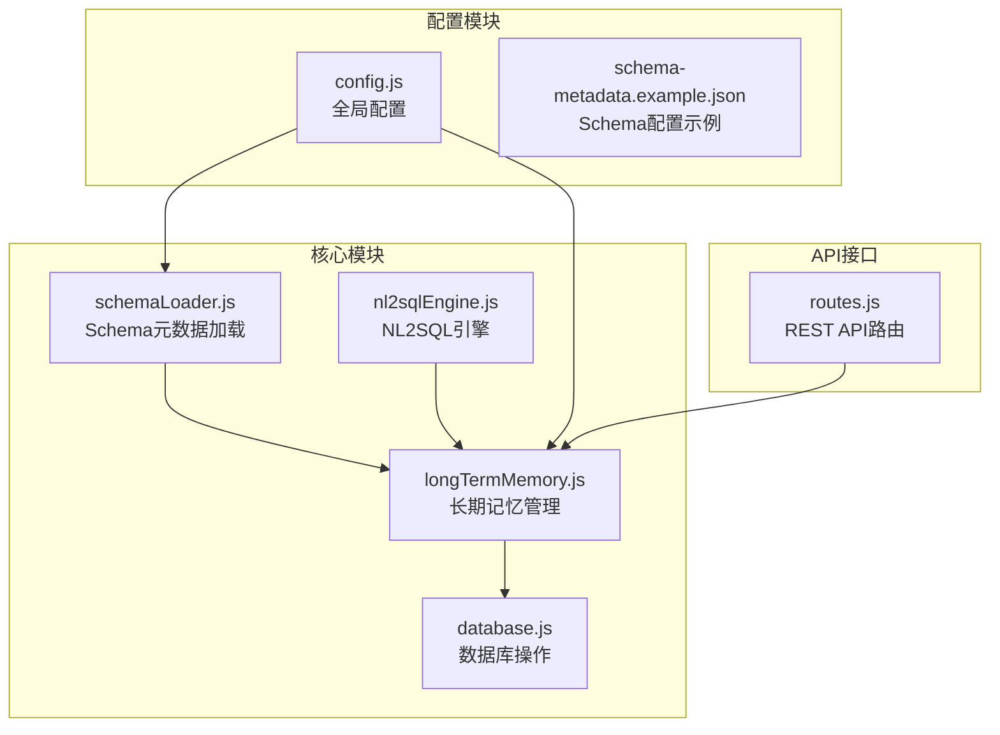
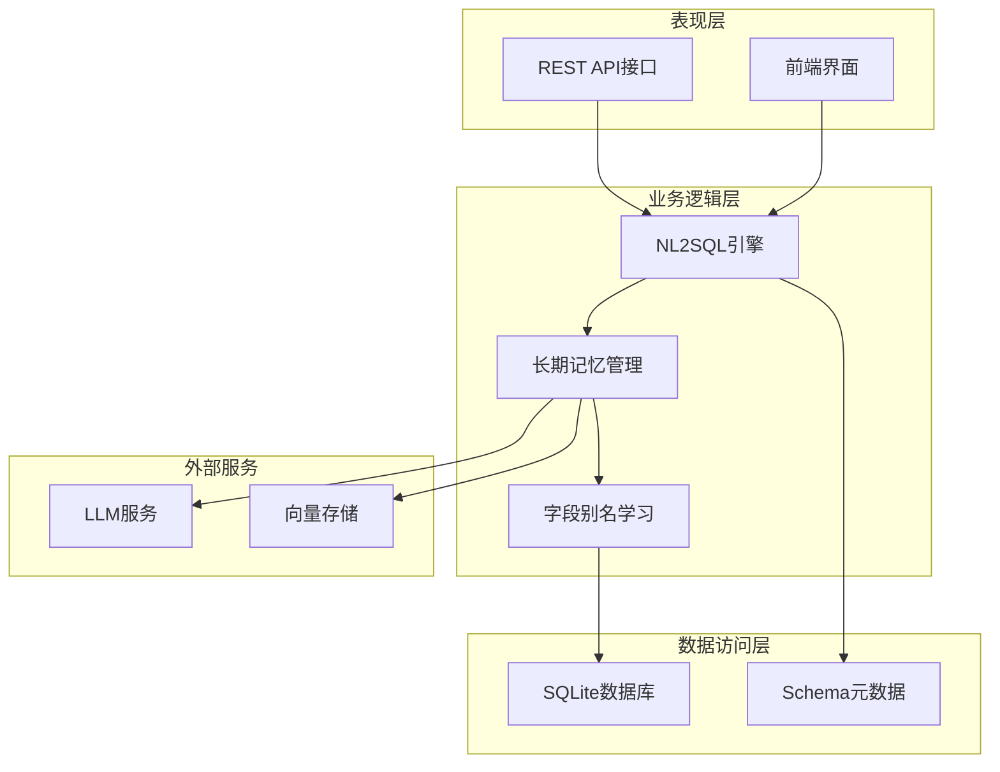
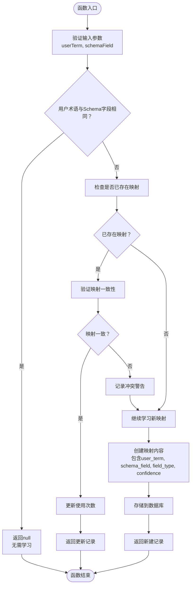
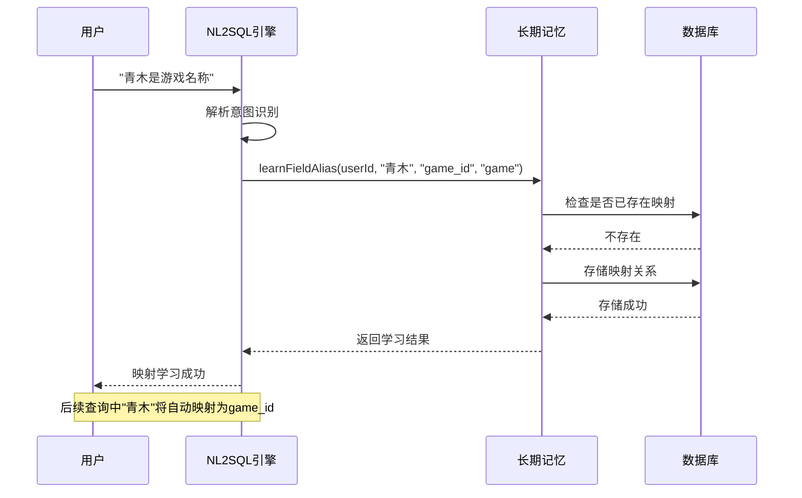
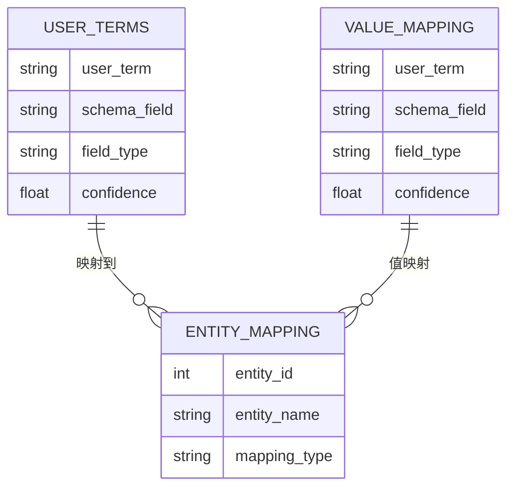
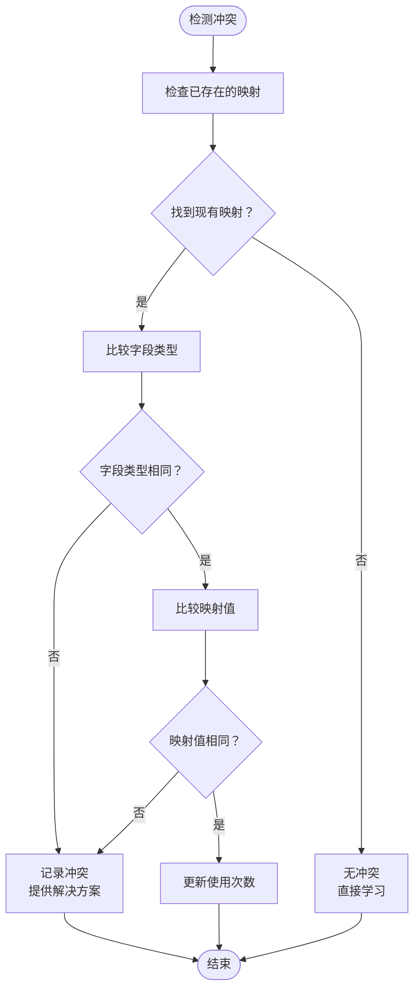
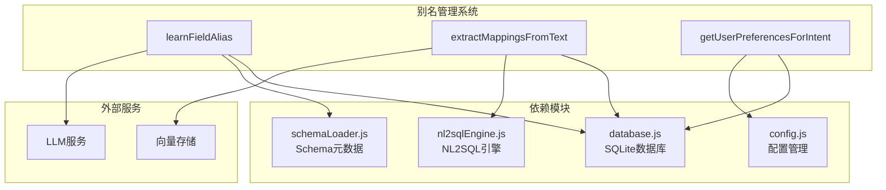

# 别名管理系统

<cite>
**本文档引用的文件**
- [schemaLoader.js](file://backend/src/core/schemaLoader.js)
- [nl2sqlEngine.js](file://backend/src/core/nl2sqlEngine.js)
- [longTermMemory.js](file://backend/src/memory/longTermMemory.js)
- [database.js](file://backend/src/core/database.js)
- [routes.js](file://backend/src/core/routes.js)
- [config.js](file://backend/src/core/config.js)
- [schema-metadata.example.json](file://backend/config/schema-metadata.example.json)
</cite>

## 目录
1. [简介](#简介)
2. [项目结构](#项目结构)
3. [核心组件](#核心组件)
4. [架构概览](#架构概览)
5. [详细组件分析](#详细组件分析)
6. [依赖关系分析](#依赖关系分析)
7. [性能考虑](#性能考虑)
8. [故障排除指南](#故障排除指南)
9. [结论](#结论)
10. [附录](#附录)

## 简介

别名管理系统是NL2SQL系统中的核心组件，负责管理用户术语到数据库字段的映射关系。该系统实现了智能化的字段别名学习机制，能够自动识别用户在自然语言查询中使用的非标准术语，并将其映射到相应的数据库字段或值。

系统支持多种字段类型，包括指标(metric)、维度(dimension)、过滤器(filter)、游戏(game)、数据源(datasource)等，并具备完善的冲突处理和验证机制。通过长期记忆功能，系统能够记住用户的个性化偏好，提供更加智能化的查询体验。

## 项目结构

NL2SQL项目采用模块化架构设计，别名管理系统主要分布在以下几个核心模块中：



**图表来源**
- [schemaLoader.js:1-732](file://backend/src/core/schemaLoader.js#L1-L732)
- [nl2sqlEngine.js:1-800](file://backend/src/core/nl2sqlEngine.js#L1-L800)
- [longTermMemory.js:1-1134](file://backend/src/memory/longTermMemory.js#L1-L1134)

**章节来源**
- [schemaLoader.js:1-732](file://backend/src/core/schemaLoader.js#L1-L732)
- [nl2sqlEngine.js:1-800](file://backend/src/core/nl2sqlEngine.js#L1-L800)
- [longTermMemory.js:1-1134](file://backend/src/memory/longTermMemory.js#L1-L1134)

## 核心组件

### 1. 字段别名学习引擎

字段别名学习引擎是系统的核心功能模块，负责：
- **用户术语识别**：从用户输入中提取非标准术语
- **Schema字段匹配**：将用户术语映射到数据库字段
- **冲突检测与处理**：处理重复或矛盾的映射关系
- **持久化存储**：将学习到的映射关系保存到数据库

### 2. 多类型字段支持

系统支持以下字段类型：
- **metric**：指标字段，如收入金额、付费订单数
- **dimension**：维度字段，如时间、地区、用户类型
- **filter**：过滤器字段，如game_id、channel_id
- **game**：游戏实体，支持游戏名称到ID的映射
- **datasource**：数据源标识，支持平台术语到数据库标识的映射

### 3. 智能学习机制

系统具备以下智能学习能力：
- **上下文学习**：从对话历史中学习用户偏好
- **即时学习**：在澄清轮中实时提取映射关系
- **冲突解决**：当出现矛盾映射时提供解决方案
- **置信度评估**：为每个映射关系分配置信度评分

**章节来源**
- [longTermMemory.js:771-825](file://backend/src/memory/longTermMemory.js#L771-L825)
- [nl2sqlEngine.js:122-186](file://backend/src/core/nl2sqlEngine.js#L122-L186)

## 架构概览

别名管理系统采用分层架构设计，各层职责清晰分离：



**图表来源**
- [routes.js:680-714](file://backend/src/core/routes.js#L680-L714)
- [nl2sqlEngine.js:497-780](file://backend/src/core/nl2sqlEngine.js#L497-L780)
- [longTermMemory.js:1114-1133](file://backend/src/memory/longTermMemory.js#L1114-L1133)

## 详细组件分析

### learnFieldAlias函数深度分析

`learnFieldAlias`函数是别名管理系统的核心实现，负责字段别名的学习和管理。

#### 函数工作原理



**图表来源**
- [longTermMemory.js:771-825](file://backend/src/memory/longTermMemory.js#L771-L825)

#### 参数说明

| 参数名 | 类型 | 描述 | 默认值 |
|--------|------|------|--------|
| userId | string | 用户标识符 | 必填 |
| userTerm | string | 用户使用的术语 | 必填 |
| schemaField | string | 对应的Schema字段 | 必填 |
| fieldType | string | 字段类型 | 'metric' |

#### 字段类型支持

系统支持以下字段类型及其特殊处理：

| 字段类型 | 描述 | 特殊处理 |
|----------|------|----------|
| metric | 指标字段 | 标准字段映射 |
| dimension | 维度字段 | 标准字段映射 |
| filter | 过滤器字段 | 标准字段映射 |
| game | 游戏实体 | 支持游戏名称到ID映射 |
| datasource | 数据源标识 | 支持平台术语到数据库标识映射 |
| game_value | 游戏值映射 | 用于存储具体的游戏ID值 |

**章节来源**
- [longTermMemory.js:771-825](file://backend/src/memory/longTermMemory.js#L771-L825)
- [longTermMemory.js:504-542](file://backend/src/memory/longTermMemory.js#L504-L542)

### 实体映射功能

系统具备强大的实体映射能力，特别是对游戏实体的支持：

#### 游戏实体映射流程



**图表来源**
- [nl2sqlEngine.js:148-180](file://backend/src/core/nl2sqlEngine.js#L148-L180)
- [longTermMemory.js:520-542](file://backend/src/memory/longTermMemory.js#L520-L542)

#### 数据源映射功能

系统支持平台术语到数据库标识的映射：

| 平台术语 | 数据库标识 | 字段类型 |
|----------|------------|----------|
| 新平台 | new_tzpingtai | datasource |
| 老平台 | new_tzpingtaiold | datasource |

**章节来源**
- [nl2sqlEngine.js:309-383](file://backend/src/core/nl2sqlEngine.js#L309-L383)
- [longTermMemory.js:897-919](file://backend/src/memory/longTermMemory.js#L897-L919)

### 值映射机制

系统支持双记录格式的值映射，特别适用于实体映射：

#### 双记录映射格式



**图表来源**
- [longTermMemory.js:527-542](file://backend/src/memory/longTermMemory.js#L527-L542)
- [longTermMemory.js:933-948](file://backend/src/memory/longTermMemory.js#L933-L948)

**章节来源**
- [longTermMemory.js:527-542](file://backend/src/memory/longTermMemory.js#L527-L542)
- [longTermMemory.js:933-948](file://backend/src/memory/longTermMemory.js#L933-L948)

### 冲突处理机制

系统具备完善的冲突检测和处理机制：

#### 冲突检测流程



**图表来源**
- [longTermMemory.js:789-803](file://backend/src/memory/longTermMemory.js#L789-L803)

**章节来源**
- [longTermMemory.js:789-803](file://backend/src/memory/longTermMemory.js#L789-L803)

## 依赖关系分析

别名管理系统与其他模块的依赖关系如下：



**图表来源**
- [longTermMemory.js:1114-1133](file://backend/src/memory/longTermMemory.js#L1114-L1133)
- [database.js:609-751](file://backend/src/core/database.js#L609-L751)

### 数据库结构

别名管理系统使用SQLite数据库存储用户偏好信息：

| 表名 | 字段 | 描述 |
|------|------|------|
| user_preferences | id | 主键 |
| user_preferences | user_id | 用户标识 |
| user_preferences | preference_type | 偏好类型 |
| user_preferences | content | JSON格式的偏好内容 |
| user_preferences | usage_count | 使用次数 |
| user_preferences | last_used_at | 最后使用时间 |

**章节来源**
- [database.js:140-157](file://backend/src/core/database.js#L140-L157)
- [database.js:695-715](file://backend/src/core/database.js#L695-L715)

## 性能考虑

### 缓存策略

系统采用多层缓存机制：
- **Schema缓存**：Schema元数据缓存，支持过期时间控制
- **向量缓存**：向量存储缓存，支持重新向量化
- **内存缓存**：短期查询结果缓存

### 查询优化

- **索引优化**：为user_id和preference_type建立复合索引
- **批量操作**：支持批量学习和查询
- **延迟加载**：按需加载用户偏好数据

### 内存管理

- **连接池**：数据库连接池管理
- **垃圾回收**：定期清理过期的缓存数据
- **内存监控**：监控内存使用情况

## 故障排除指南

### 常见问题及解决方案

#### 1. 字段别名学习失败

**症状**：learnFieldAlias返回null或抛出异常

**可能原因**：
- 输入参数为空
- 用户术语与Schema字段相同
- 数据库连接失败

**解决方案**：
- 检查输入参数的有效性
- 确认用户术语确实需要映射
- 验证数据库连接状态

#### 2. 映射冲突警告

**症状**：系统记录映射冲突警告

**可能原因**：
- 用户重复学习相同的映射
- 不同用户对同一术语有不同的映射
- 系统升级导致字段类型变化

**解决方案**：
- 检查现有映射关系
- 人工干预冲突解决
- 清理历史冲突数据

#### 3. 查询性能问题

**症状**：别名查询响应缓慢

**可能原因**：
- 数据库索引缺失
- 缓存未生效
- 查询过于复杂

**解决方案**：
- 检查并优化数据库索引
- 调整缓存配置
- 简化查询逻辑

**章节来源**
- [longTermMemory.js:821-824](file://backend/src/memory/longTermMemory.js#L821-L824)
- [database.js:758-763](file://backend/src/core/database.js#L758-L763)

## 结论

别名管理系统通过智能化的字段别名学习机制，为NL2SQL系统提供了强大的自然语言处理能力。系统不仅支持多种字段类型的映射，还具备完善的冲突处理、验证和优化机制。

主要优势包括：
- **智能化学习**：自动识别和学习用户偏好
- **多类型支持**：全面支持各种字段类型的映射
- **冲突处理**：完善的冲突检测和解决机制
- **性能优化**：多层缓存和索引优化
- **扩展性强**：模块化设计便于功能扩展

该系统为用户提供更加自然、便捷的查询体验，是NL2SQL系统的重要组成部分。

## 附录

### 配置选项详解

#### 长期记忆配置

| 配置项 | 类型 | 默认值 | 描述 |
|--------|------|--------|------|
| longTermMemory.enabled | boolean | true | 是否启用长期记忆功能 |
| longTermMemory.useLLMForExtraction | boolean | false | 是否使用LLM进行智能提取 |
| thresholds.minConfidence | number | 0.7 | 最小置信度阈值 |
| thresholds.minDimensionsForTemplate | number | 2 | 高价值模板最小维度数 |
| thresholds.minMetricsForTemplate | number | 1 | 高价值模板最小指标数 |
| retention.fieldAlias | number | 365 | 字段别名保留天数 |

#### Schema配置

| 配置项 | 类型 | 默认值 | 描述 |
|--------|------|--------|------|
| schema.configPath | string | ./config/schema-metadata.json | Schema配置文件路径 |
| schema.enableCache | boolean | true | 是否启用Schema缓存 |
| schema.cacheExpireTime | number | 3600000 | 缓存过期时间(毫秒) |
| schema.revectorize | boolean | false | 是否强制重新向量化 |

**章节来源**
- [config.js:254-288](file://backend/src/core/config.js#L254-L288)
- [config.js:235-245](file://backend/src/core/config.js#L235-L245)

### API使用示例

#### 学习字段别名

```javascript
// 基本用法
await longTermMemory.learnFieldAlias(
  userId,
  "青木",
  "game_id",
  "game"
);

// 学习数据源映射
await longTermMemory.learnFieldAlias(
  userId,
  "新平台",
  "new_tzpingtai",
  "datasource"
);
```

#### 从文本提取映射

```javascript
// 从澄清文本中提取映射
const result = await longTermMemory.extractMappingsFromText(
  userId,
  "游戏ID映射表：\n| 30 | 青木 |\n| 1 | 王者荣耀 |\n| 2 | 和平精英 |"
);
```

**章节来源**
- [routes.js:687-714](file://backend/src/core/routes.js#L687-L714)
- [longTermMemory.js:844-965](file://backend/src/memory/longTermMemory.js#L844-L965)