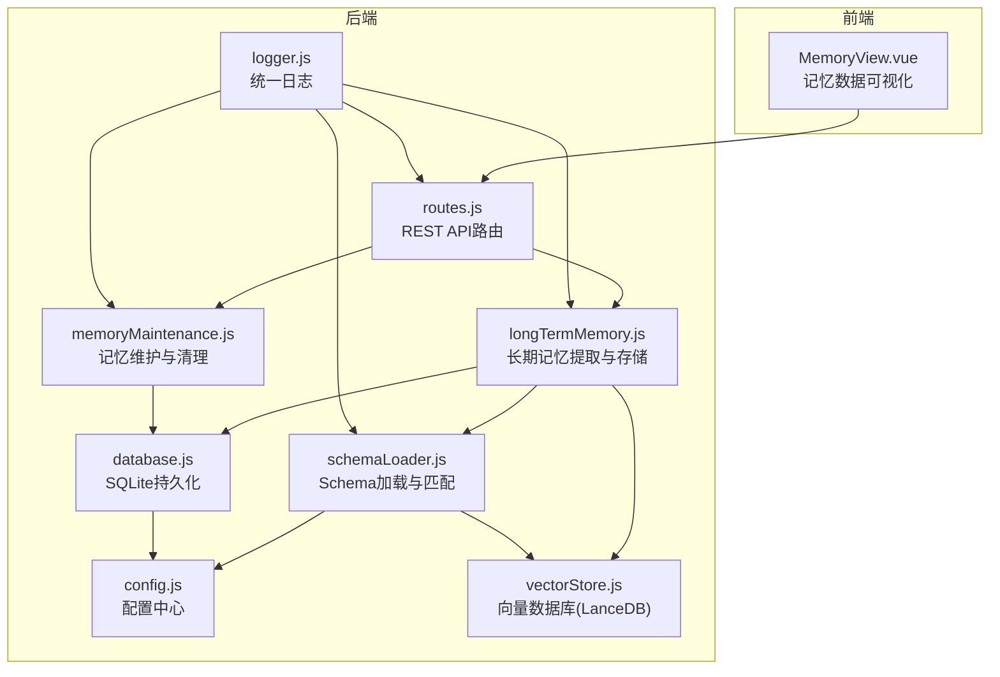
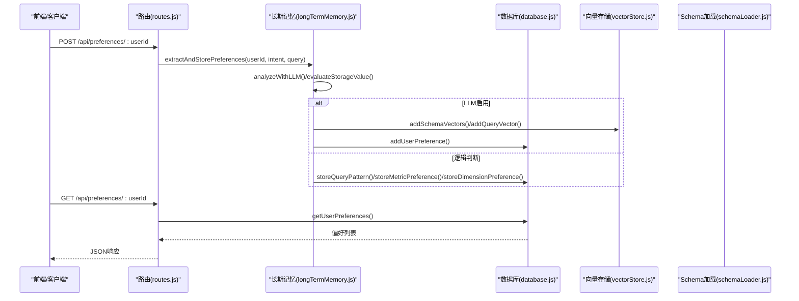
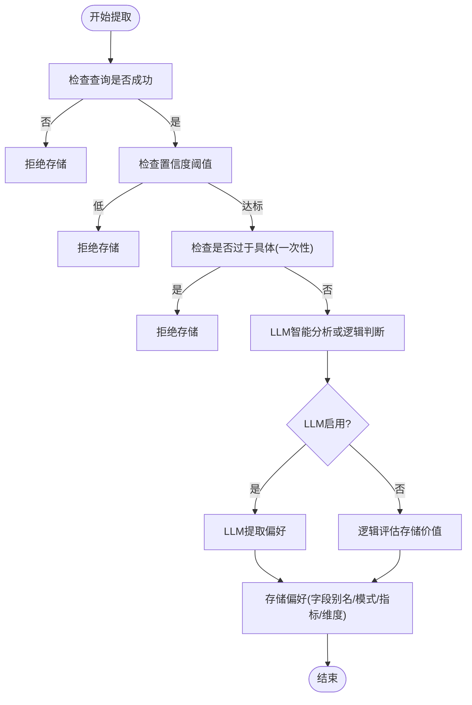
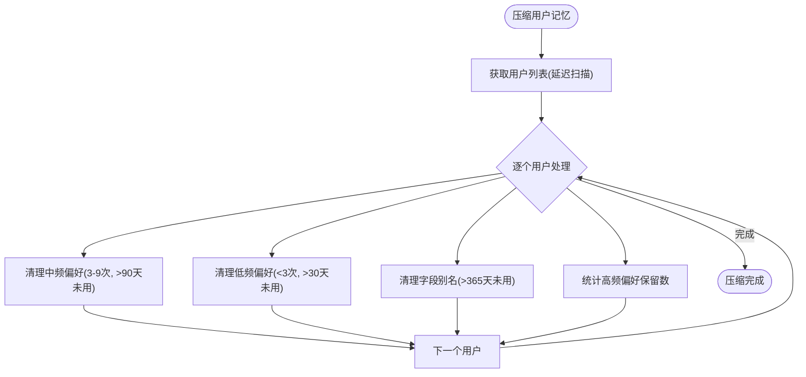
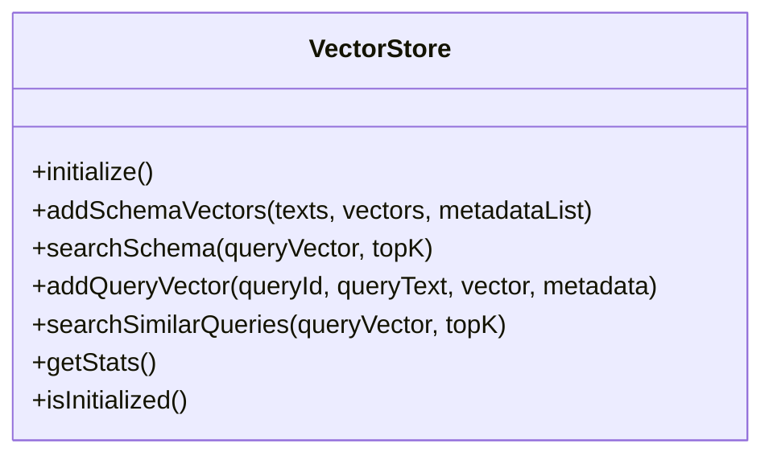
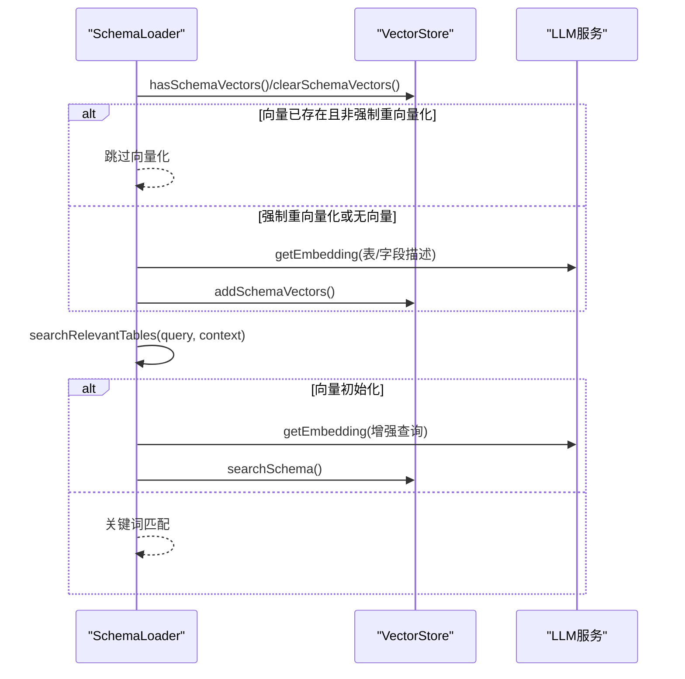
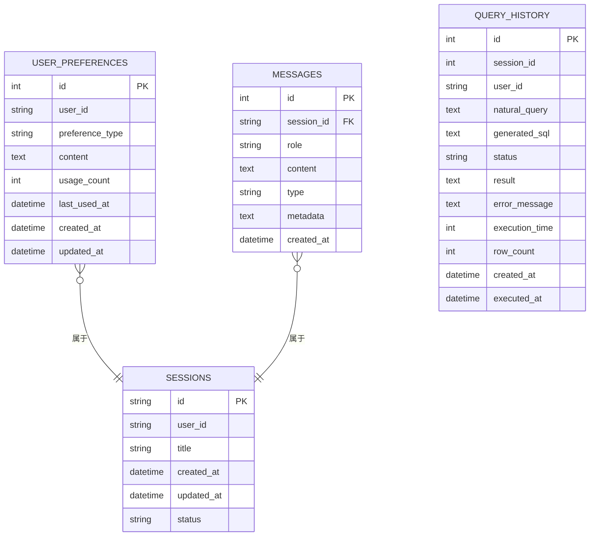
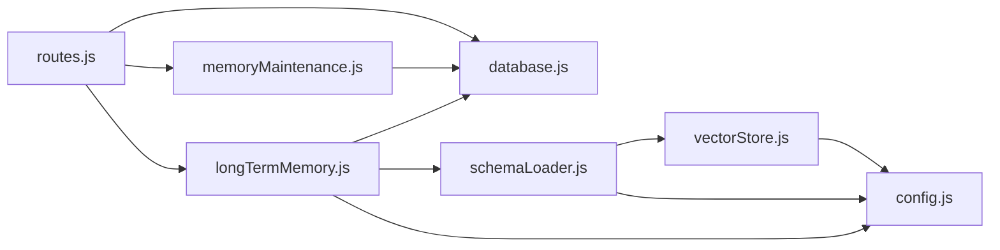

# 用户记忆系统

<cite>
**本文引用的文件**
- [longTermMemory.js](file://backend/src/memory/longTermMemory.js)
- [memoryMaintenance.js](file://backend/src/memory/memoryMaintenance.js)
- [vectorStore.js](file://backend/src/memory/vectorStore.js)
- [schemaLoader.js](file://backend/src/core/schemaLoader.js)
- [config.js](file://backend/src/core/config.js)
- [database.js](file://backend/src/core/database.js)
- [routes.js](file://backend/src/core/routes.js)
- [schema-metadata.json](file://backend/config/schema-metadata.json)
- [MemoryView.vue](file://frontend/src/views/MemoryView.vue)
- [logger.js](file://backend/src/utils/logger.js)
- [package.json](file://backend/package.json)
</cite>

## 目录
1. [简介](#简介)
2. [项目结构](#项目结构)
3. [核心组件](#核心组件)
4. [架构总览](#架构总览)
5. [详细组件分析](#详细组件分析)
6. [依赖关系分析](#依赖关系分析)
7. [性能考虑](#性能考虑)
8. [故障排查指南](#故障排查指南)
9. [结论](#结论)
10. [附录](#附录)

## 简介
本文件为用户记忆系统的综合性技术文档，面向开发者与运维人员，系统性阐述长期记忆架构设计与实现细节。重点涵盖：
- 用户偏好存储与检索：字段别名、查询模式、指标/维度偏好
- 偏好学习机制：字段别名映射、指标偏好的自动学习、用户行为模式识别
- 别名管理功能：用户术语到数据库字段的映射、多语言支持、动态更新机制
- 内存维护策略：数据清理、存储优化、性能监控
- 配置示例与使用指南：如何扩展与自定义记忆功能
- 数据模型、API接口与最佳实践建议

## 项目结构
后端采用模块化分层设计：
- memory 层：长期记忆与向量存储
- core 层：配置、数据库、Schema加载、路由等核心能力
- utils 层：日志等通用工具
- config：Schema元数据配置
- frontend：Vue前端界面，提供记忆数据可视化与管理

**图表来源**
- [routes.js:1-895](file://backend/src/core/routes.js#L1-L895)
- [longTermMemory.js:1-1134](file://backend/src/memory/longTermMemory.js#L1-L1134)
- [memoryMaintenance.js:1-415](file://backend/src/memory/memoryMaintenance.js#L1-L415)
- [vectorStore.js:1-442](file://backend/src/memory/vectorStore.js#L1-L442)
- [schemaLoader.js:1-732](file://backend/src/core/schemaLoader.js#L1-L732)
- [database.js:1-850](file://backend/src/core/database.js#L1-L850)
- [config.js:1-332](file://backend/src/core/config.js#L1-L332)
- [MemoryView.vue:1-511](file://frontend/src/views/MemoryView.vue#L1-L511)

**章节来源**
- [routes.js:1-895](file://backend/src/core/routes.js#L1-L895)
- [config.js:1-332](file://backend/src/core/config.js#L1-L332)
- [package.json:1-28](file://backend/package.json#L1-L28)

## 核心组件
- 长期记忆模块（Layer 2）：负责用户偏好提取、存储、检索与维护，包含字段别名、查询模式、指标/维度偏好三大类。
- 记忆维护模块：实现分级保留策略与相似模式合并，保障长期记忆的存储效率与质量。
- 向量存储模块：基于LanceDB实现Schema与查询历史的向量化存储与语义检索。
- Schema加载模块：加载配置文件中的表结构元数据，提供语义搜索与匹配能力。
- 数据库模块：SQLite持久化用户偏好、会话与查询历史，提供事务与迁移能力。
- 路由模块：暴露记忆相关的REST API，支持前端交互与调试。
- 日志模块：统一日志输出，支持文件轮转与结构化日志。

**章节来源**
- [longTermMemory.js:1-1134](file://backend/src/memory/longTermMemory.js#L1-L1134)
- [memoryMaintenance.js:1-415](file://backend/src/memory/memoryMaintenance.js#L1-L415)
- [vectorStore.js:1-442](file://backend/src/memory/vectorStore.js#L1-L442)
- [schemaLoader.js:1-732](file://backend/src/core/schemaLoader.js#L1-L732)
- [database.js:1-850](file://backend/src/core/database.js#L1-L850)
- [routes.js:1-895](file://backend/src/core/routes.js#L1-L895)
- [logger.js:1-318](file://backend/src/utils/logger.js#L1-L318)

## 架构总览
长期记忆系统围绕“偏好提取—存储—检索—维护”闭环展开，结合向量数据库实现语义增强与跨表匹配。

**图表来源**
- [routes.js:450-714](file://backend/src/core/routes.js#L450-L714)
- [longTermMemory.js:311-484](file://backend/src/memory/longTermMemory.js#L311-L484)
- [database.js:609-715](file://backend/src/core/database.js#L609-L715)
- [vectorStore.js:160-307](file://backend/src/memory/vectorStore.js#L160-L307)

## 详细组件分析

### 长期记忆模块（Layer 2）
- 功能职责
  - 从查询意图中提取用户偏好，包括字段别名、查询模式、指标偏好、维度偏好
  - 基于阈值与频率策略筛选是否存储，避免一次性查询污染记忆
  - 支持LLM智能提炼，区分个人偏好与通用知识
- 关键机制
  - 存储筛选阈值：置信度、维度/指标数量、最近天数频率
  - LLM提示词工程：优先抽取字段别名、分析习惯、业务逻辑定义
  - 学习字段别名：支持用户术语到Schema字段的映射，含实体值映射
  - 查询模式：按维度/指标组合生成模式名称，支持相似模式合并
- 数据模型
  - user_preferences 表：记录偏好类型、内容、使用次数与时间

**图表来源**
- [longTermMemory.js:311-484](file://backend/src/memory/longTermMemory.js#L311-L484)
- [longTermMemory.js:56-188](file://backend/src/memory/longTermMemory.js#L56-L188)
- [longTermMemory.js:251-295](file://backend/src/memory/longTermMemory.js#L251-L295)

**章节来源**
- [longTermMemory.js:1-1134](file://backend/src/memory/longTermMemory.js#L1-L1134)
- [database.js:609-751](file://backend/src/core/database.js#L609-L751)

### 记忆维护模块
- 功能职责
  - 分级保留策略：高频(≥10次)永久保留，中频(3-9次)90天未用清理，低频(<3次)30天未用清理，字段别名365天未用清理
  - 相似模式合并：维度/指标重合度>70%且时间范围类型一致时合并
  - 统计与报告：用户记忆统计、系统健康报告
- 性能与存储优化
  - 延迟扫描：仅扫描最近更新的用户，降低全库扫描成本
  - 批量清理：按类型与使用次数批量删除，减少事务开销

**图表来源**
- [memoryMaintenance.js:69-189](file://backend/src/memory/memoryMaintenance.js#L69-L189)
- [memoryMaintenance.js:201-309](file://backend/src/memory/memoryMaintenance.js#L201-L309)

**章节来源**
- [memoryMaintenance.js:1-415](file://backend/src/memory/memoryMaintenance.js#L1-L415)

### 向量存储模块（LanceDB）
- 功能职责
  - Schema向量：将表/字段描述向量化，支持语义搜索
  - 查询历史向量：将用户查询向量化，支持相似查询检索
  - 统计与状态：表行数统计、初始化状态检查
- 集成策略
  - Schema加载完成后自动向量化（可配置强制重向量化）
  - 语义搜索增强表匹配，结合上下文（game_id、datasource）提升准确性

**图表来源**
- [vectorStore.js:1-442](file://backend/src/memory/vectorStore.js#L1-L442)
- [schemaLoader.js:195-290](file://backend/src/core/schemaLoader.js#L195-L290)

**章节来源**
- [vectorStore.js:1-442](file://backend/src/memory/vectorStore.js#L1-L442)
- [schemaLoader.js:195-507](file://backend/src/core/schemaLoader.js#L195-L507)

### Schema加载与匹配
- 功能职责
  - 加载schema-metadata.json，构建表/字段映射，支持中英文名
  - 语义搜索相关表：结合上下文增强查询，优先匹配对应数据源或平台类型
  - 关键词匹配回退：向量搜索失败时使用关键词匹配
- 多语言支持
  - 表/字段支持name与name_cn，向量描述同时包含中英文名
- 安全与验证
  - SQL白名单与禁止关键字校验，防止注入与越权

**图表来源**
- [schemaLoader.js:195-290](file://backend/src/core/schemaLoader.js#L195-L290)
- [schemaLoader.js:420-507](file://backend/src/core/schemaLoader.js#L420-L507)

**章节来源**
- [schemaLoader.js:1-732](file://backend/src/core/schemaLoader.js#L1-L732)
- [schema-metadata.json:1-800](file://backend/config/schema-metadata.json#L1-L800)

### 数据库与API接口
- 数据模型
  - user_preferences：偏好类型、内容、使用统计与时间戳
  - sessions/messages/query_history：会话与查询历史
- API接口
  - 获取用户偏好、原始数据、统计
  - 手动添加模板、学习别名、删除偏好
  - 健康检查与统计

**图表来源**
- [database.js:39-189](file://backend/src/core/database.js#L39-L189)
- [database.js:609-751](file://backend/src/core/database.js#L609-L751)

**章节来源**
- [database.js:1-850](file://backend/src/core/database.js#L1-L850)
- [routes.js:450-714](file://backend/src/core/routes.js#L450-L714)

## 依赖关系分析
- 模块耦合
  - longTermMemory 依赖 database、schemaLoader、llmService、config
  - memoryMaintenance 依赖 database、config
  - schemaLoader 依赖 vectorStore、llmService、config
  - routes 依赖 database、memoryMaintenance、longTermMemory
- 外部依赖
  - LanceDB(vectordb)：向量存储
  - sqlite3：本地数据库
  - dotenv/cors/body-parser/uuid/dayjs/node-cron：通用支撑

**图表来源**
- [longTermMemory.js:17-21](file://backend/src/memory/longTermMemory.js#L17-L21)
- [memoryMaintenance.js:16-18](file://backend/src/memory/memoryMaintenance.js#L16-L18)
- [schemaLoader.js:15-26](file://backend/src/core/schemaLoader.js#L15-L26)
- [routes.js:16-27](file://backend/src/core/routes.js#L16-L27)

**章节来源**
- [package.json:10-20](file://backend/package.json#L10-L20)

## 性能考虑
- 存储与检索
  - SQLite索引：user_preferences(user_id, preference_type)、sessions/status等
  - 向量搜索：topK限制、批量嵌入、延迟扫描清理
- 计算开销
  - LLM调用：超时与重试配置，Embedding分批处理
  - Schema向量化：可配置强制重向量化，避免重复计算
- 运维监控
  - 日志级别与文件轮转，结构化日志便于分析
  - 健康检查接口与统计API，便于观测系统状态

[本节为通用指导，无需特定文件引用]

## 故障排查指南
- 常见问题
  - 向量数据库未初始化：检查LanceDB路径与权限，确认初始化日志
  - LLM API失败：核对API密钥与超时配置，查看回退逻辑
  - SQLite迁移失败：检查表结构与权限，关注UNIQUE约束迁移
  - 记忆未生效：确认阈值配置、LLM开关、查询成功与置信度
- 调试手段
  - 健康检查：GET /api/health、/api/health/detail
  - 原始数据：GET /api/preferences/:userId/raw
  - 日志：调整LOG_LEVEL，查看结构化日志

**章节来源**
- [routes.js:58-135](file://backend/src/core/routes.js#L58-L135)
- [database.js:271-336](file://backend/src/core/database.js#L271-L336)
- [logger.js:227-293](file://backend/src/utils/logger.js#L227-L293)

## 结论
用户记忆系统通过“偏好提取—存储—检索—维护”的闭环设计，结合向量数据库与LLM智能提炼，实现了对用户行为模式的持续学习与优化。系统具备良好的扩展性与可维护性，支持多语言、多数据源场景，并提供完善的监控与清理策略，适合在生产环境中稳定运行。

[本节为总结，无需特定文件引用]

## 附录

### 配置示例与使用指南
- 长期记忆配置（config.js）
  - LTM开关与阈值：minConfidence、minDimensionsForTemplate、minMetricsForTemplate、recentDaysForFrequency、minFrequencyForSimple
  - 保留策略：highUsage、mediumUsage、lowUsage、fieldAlias（天数）
  - LLM开关：LTM_USE_LLM
- 环境变量
  - LLM_API_BASE、LLM_API_KEY、LLM_MODEL、LLM_TIMEOUT
  - EMBEDDING_MODEL、EMBEDDING_TIMEOUT
  - VECTOR_DB_PATH、DB_PATH
  - ALLOWED_TABLES、MAX_QUERY_ROWS、QUERY_TIMEOUT
  - SCHEMA_CONFIG_PATH、SCHEMA_REVECTORIZE
  - LTM_ENABLED、LTM_USE_LLM

**章节来源**
- [config.js:55-288](file://backend/src/core/config.js#L55-L288)

### API接口清单
- 获取用户偏好：GET /api/preferences/:userId
- 获取原始数据：GET /api/preferences/:userId/raw
- 获取统计：GET /api/preferences/:userId/stats
- 手动添加模板：POST /api/preferences/:userId/templates
- 学习字段别名：POST /api/preferences/:userId/learn-alias
- 删除偏好：DELETE /api/preferences/:preferenceId
- 健康检查：GET /api/health、/api/health/detail

**章节来源**
- [routes.js:450-714](file://backend/src/core/routes.js#L450-L714)

### 最佳实践建议
- 启用LLM智能提炼时，合理设置阈值与提示词，避免过度学习
- 定期执行记忆维护，保持偏好表整洁与高效
- 结合上下文增强Schema搜索，提升匹配准确率
- 使用前端MemoryView进行调试与可视化，便于发现异常偏好
- 严格控制ALLOWED_TABLES与禁止关键字，确保安全

**章节来源**
- [MemoryView.vue:1-511](file://frontend/src/views/MemoryView.vue#L1-L511)
- [schemaLoader.js:560-606](file://backend/src/core/schemaLoader.js#L560-L606)