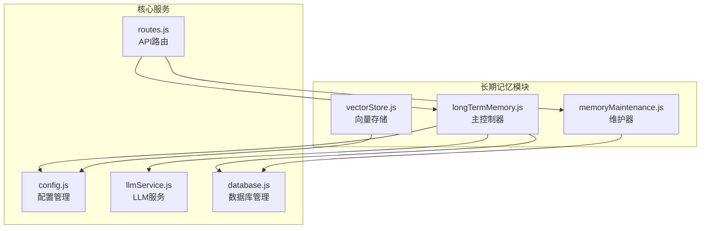
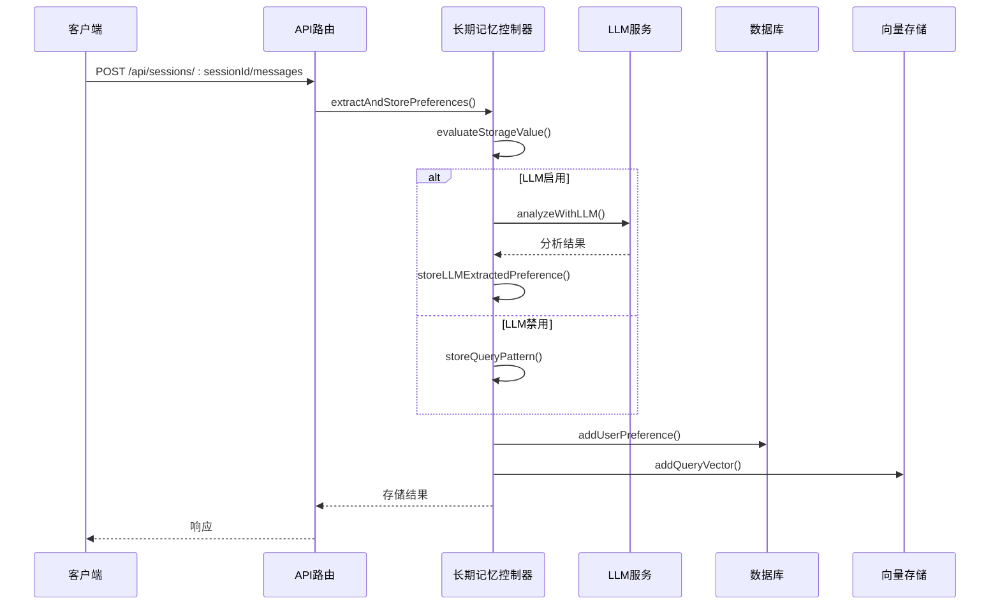
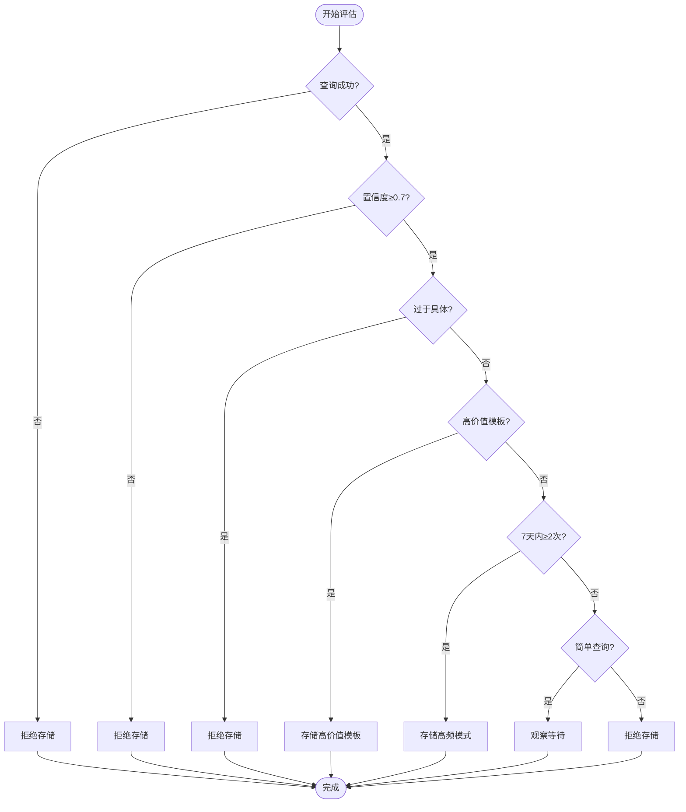
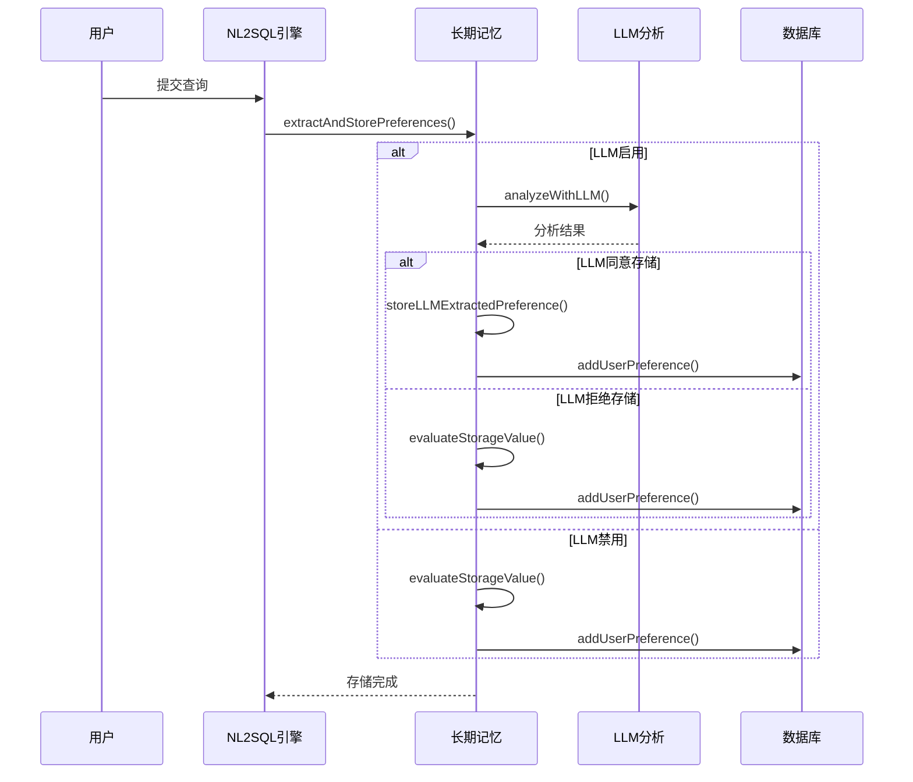
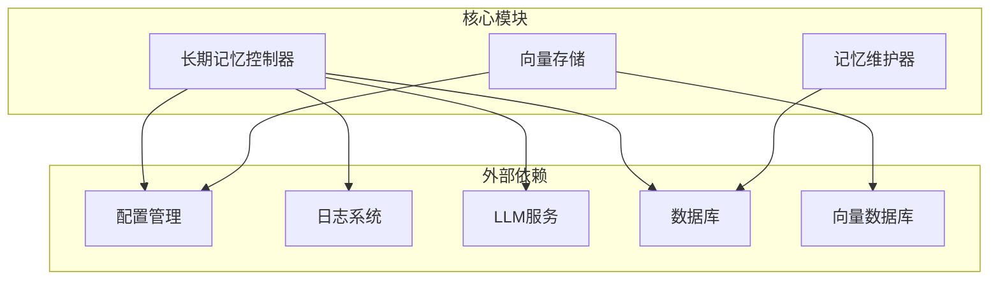
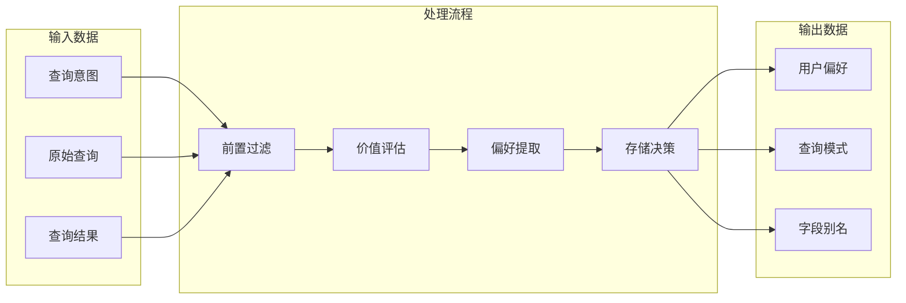

# 长期记忆管理

<cite>
**本文引用的文件**
- [longTermMemory.js](file://backend/src/memory/longTermMemory.js)
- [memoryMaintenance.js](file://backend/src/memory/memoryMaintenance.js)
- [vectorStore.js](file://backend/src/memory/vectorStore.js)
- [llmService.js](file://backend/src/core/llmService.js)
- [config.js](file://backend/src/core/config.js)
- [database.js](file://backend/src/core/database.js)
- [routes.js](file://backend/src/core/routes.js)
</cite>

## 目录
1. [简介](#简介)
2. [项目结构](#项目结构)
3. [核心组件](#核心组件)
4. [架构概览](#架构概览)
5. [详细组件分析](#详细组件分析)
6. [依赖分析](#依赖分析)
7. [性能考虑](#性能考虑)
8. [故障排除指南](#故障排除指南)
9. [结论](#结论)
10. [附录](#附录)

## 简介
长期记忆管理模块是NL2SQL系统中的核心智能增强组件，负责用户长期记忆的提取、存储、检索和维护。该模块通过机器学习智能分析用户查询，识别有价值的偏好模式，包括查询模式、字段别名、常用指标和维度偏好，并通过分级保留策略进行智能维护。

该模块采用"层2"架构设计，与底层的NL2SQL引擎深度集成，为用户提供个性化的查询体验。模块支持LLM智能分析、智能筛选策略、向量存储和自动维护等功能。

## 项目结构
长期记忆管理模块位于`backend/src/memory/`目录下，包含以下核心文件：

**图表来源**
- [longTermMemory.js:1-1134](file://backend/src/memory/longTermMemory.js#L1-L1134)
- [memoryMaintenance.js:1-415](file://backend/src/memory/memoryMaintenance.js#L1-L415)
- [vectorStore.js:1-621](file://backend/src/memory/vectorStore.js#L1-L621)

**章节来源**
- [longTermMemory.js:1-1134](file://backend/src/memory/longTermMemory.js#L1-L1134)
- [memoryMaintenance.js:1-415](file://backend/src/memory/memoryMaintenance.js#L1-L415)
- [vectorStore.js:1-621](file://backend/src/memory/vectorStore.js#L1-L621)

## 核心组件
长期记忆管理模块包含以下核心组件：

### 1. 主控制器组件
- **extractAndStorePreferences**: 主要入口函数，负责提取和存储用户偏好
- **analyzeWithLLM**: LLM智能分析功能，判断查询价值
- **evaluateStorageValue**: 存储价值评估算法
- **isTooSpecific**: 查询具体性判断

### 2. 维护组件
- **compressUserMemory**: 用户记忆压缩与清理
- **mergeSimilarPatterns**: 相似模式合并
- **getUserMemoryStats**: 用户记忆统计

### 3. 向量存储组件
- **addSchemaVectors**: Schema向量添加
- **searchSchema**: Schema向量搜索
- **addQueryVector**: 查询向量添加
- **searchSimilarQueries**: 相似查询搜索

### 4. 数据库组件
- **user_preferences表**: 存储用户偏好数据
- **偏好类型**: 查询模式、字段别名、指标偏好、维度偏好
- **使用统计**: usage_count和last_used_at字段

**章节来源**
- [longTermMemory.js:25-41](file://backend/src/memory/longTermMemory.js#L25-L41)
- [memoryMaintenance.js:24-46](file://backend/src/memory/memoryMaintenance.js#L24-L46)
- [database.js:140-157](file://backend/src/core/database.js#L140-L157)

## 架构概览
长期记忆管理模块采用分层架构设计，实现了智能筛选、存储决策和维护管理的完整闭环：

**图表来源**
- [longTermMemory.js:311-484](file://backend/src/memory/longTermMemory.js#L311-L484)
- [llmService.js:287-311](file://backend/src/core/llmService.js#L287-L311)
- [database.js:609-618](file://backend/src/core/database.js#L609-L618)

## 详细组件分析

### 存储阈值配置
长期记忆模块采用严格的存储阈值配置，确保只存储高质量的用户偏好：

| 阈值类型 | 默认值 | 描述 | 配置路径 |
|---------|--------|------|----------|
| 最小置信度 | 0.7 | 查询意图识别的最低置信度要求 | `longTermMemory.thresholds.minConfidence` |
| 最小维度数 | 2 | 高价值模板的最小维度数 | `longTermMemory.thresholds.minDimensionsForTemplate` |
| 最小指标数 | 1 | 高价值模板的最小指标数 | `longTermMemory.thresholds.minMetricsForTemplate` |
| 最近天数 | 7 | 频率判断的时间范围 | `longTermMemory.thresholds.recentDaysForFrequency` |
| 最小频率 | 2 | 简单查询的最低存储频率 | `longTermMemory.thresholds.minFrequencyForSimple` |

### 查询价值评估算法
存储价值评估算法采用多层次判断机制：

**图表来源**
- [longTermMemory.js:251-295](file://backend/src/memory/longTermMemory.js#L251-L295)

### LLM智能分析功能
LLM智能分析功能通过专门的提示词工程实现：

#### 字段别名提取
- **游戏实体映射**: 识别"青木是指game_id=30"等映射关系
- **数据源映射**: 识别平台标识符映射
- **字段别名**: 识别用户自定义的字段别名

#### 分析习惯识别
- **维度习惯**: 识别用户习惯查看的维度组合
- **指标捆绑**: 识别特定指标的关联维度
- **触发信号**: 识别"我习惯..."、"以后都..."等表达

#### 过滤逻辑判断
- **通用规则**: 识别可复用的过滤逻辑
- **排除条件**: 排除临时查询和具体筛选条件
- **置信度评估**: 基于用户表达明确程度评估置信度

**章节来源**
- [longTermMemory.js:47-188](file://backend/src/memory/longTermMemory.js#L47-L188)

### 存储决策流程
存储决策采用"LLM智能分析 + 逻辑判断"的双重保障机制：

**图表来源**
- [longTermMemory.js:355-421](file://backend/src/memory/longTermMemory.js#L355-L421)

### 维护策略
长期记忆维护采用分级保留策略：

| 使用频率 | 保留策略 | 清理条件 |
|---------|----------|----------|
| ≥10次 | 永久保留 | 不清理 |
| 3-9次 | 90天未用清理 | 90天未使用 |
| <3次 | 30天未用清理 | 30天未使用 |
| 字段别名 | 365天未用清理 | 365天未使用 |

**章节来源**
- [memoryMaintenance.js:24-46](file://backend/src/memory/memoryMaintenance.js#L24-L46)
- [memoryMaintenance.js:69-189](file://backend/src/memory/memoryMaintenance.js#L69-L189)

## 依赖分析

### 组件耦合关系
长期记忆模块的组件间依赖关系如下：

**图表来源**
- [longTermMemory.js:17-20](file://backend/src/memory/longTermMemory.js#L17-L20)
- [memoryMaintenance.js:16-18](file://backend/src/memory/memoryMaintenance.js#L16-L18)
- [vectorStore.js:14-19](file://backend/src/memory/vectorStore.js#L14-L19)

### 数据流分析
长期记忆模块的数据流遵循以下模式：

**图表来源**
- [longTermMemory.js:311-484](file://backend/src/memory/longTermMemory.js#L311-L484)

**章节来源**
- [longTermMemory.js:17-20](file://backend/src/memory/longTermMemory.js#L17-L20)
- [memoryMaintenance.js:16-18](file://backend/src/memory/memoryMaintenance.js#L16-L18)

## 性能考虑
长期记忆管理模块在设计时充分考虑了性能优化：

### 存储优化
- **索引优化**: user_preferences表建立了多索引以加速查询
- **JSON存储**: 使用JSON格式存储复杂内容，便于扩展
- **批量操作**: 支持批量向量添加和查询

### 查询优化
- **早期过滤**: 在存储前进行多重过滤减少无效操作
- **缓存策略**: 配置化的阈值和策略便于调整
- **异步处理**: LLM调用采用异步方式避免阻塞

### 维护优化
- **分批清理**: 定期分批清理过期数据
- **智能合并**: 合并相似查询模式减少冗余
- **统计报告**: 提供维护统计便于监控

## 故障排除指南

### 常见问题及解决方案

#### LLM分析失败
**症状**: LLM分析返回null，回退到逻辑判断
**原因**: API密钥配置错误、网络连接问题、模型调用失败
**解决方案**: 
1. 检查LLM配置项
2. 验证API密钥有效性
3. 确认网络连接正常

#### 存储阈值过高
**症状**: 用户偏好无法存储
**原因**: 置信度过高、查询过于具体、频率不足
**解决方案**:
1. 调整阈值配置
2. 检查查询质量
3. 提供更多类似查询

#### 数据库连接问题
**症状**: 偏好无法保存到数据库
**原因**: SQLite连接失败、表结构问题
**解决方案**:
1. 检查数据库文件权限
2. 运行数据库迁移
3. 重启数据库服务

#### 向量存储异常
**症状**: 向量搜索功能不可用
**原因**: LanceDB初始化失败、路径配置错误
**解决方案**:
1. 检查向量数据库路径
2. 验证目录权限
3. 重新初始化向量数据库

**章节来源**
- [config.js:300-332](file://backend/src/core/config.js#L300-L332)
- [longTermMemory.js:184-187](file://backend/src/memory/longTermMemory.js#L184-L187)

## 结论
长期记忆管理模块通过智能化的设计和严格的阈值控制，实现了对用户偏好的精准识别和高效管理。模块采用LLM智能分析与传统逻辑判断相结合的方式，既保证了存储质量，又提供了灵活的回退机制。

通过分级保留策略和智能维护功能，模块有效平衡了存储成本和用户体验。完善的API接口和监控机制为系统的稳定运行提供了保障。

该模块的成功实施显著提升了NL2SQL系统的个性化水平，为用户提供了更加智能和高效的查询体验。

## 附录

### API接口说明

#### 核心方法
- **extractAndStorePreferences(userId, intent, originalQuery, options)**
  - 功能: 提取并存储用户偏好
  - 参数: 用户ID、意图分析结果、原始查询、选项对象
  - 返回: 存储结果和原因

- **evaluateStorageValue(userId, intent)**
  - 功能: 评估查询存储价值
  - 参数: 用户ID、意图分析结果
  - 返回: 存储决策和理由

#### 配置选项
- **longTermMemory.enabled**: 启用长期记忆功能
- **longTermMemory.useLLMForExtraction**: 启用LLM智能分析
- **longTermMemory.thresholds**: 存储阈值配置
- **longTermMemory.retention**: 保留策略配置

#### 性能优化建议
1. 合理设置存储阈值以平衡存储成本和效果
2. 定期运行记忆维护任务
3. 监控LLM调用成本和响应时间
4. 优化数据库索引和查询性能