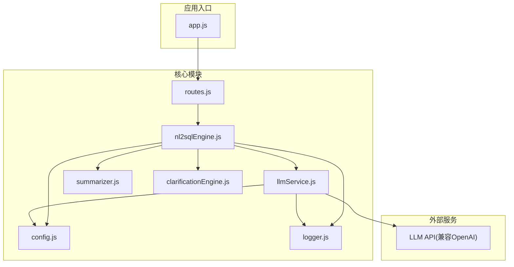
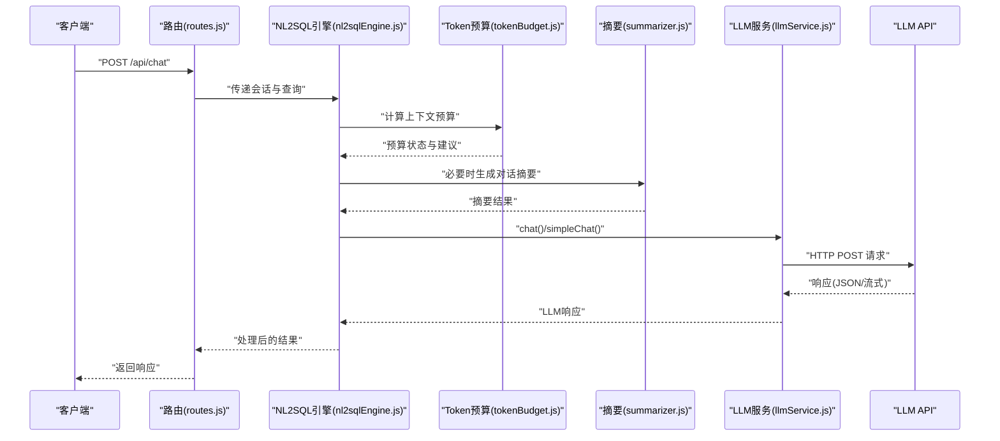
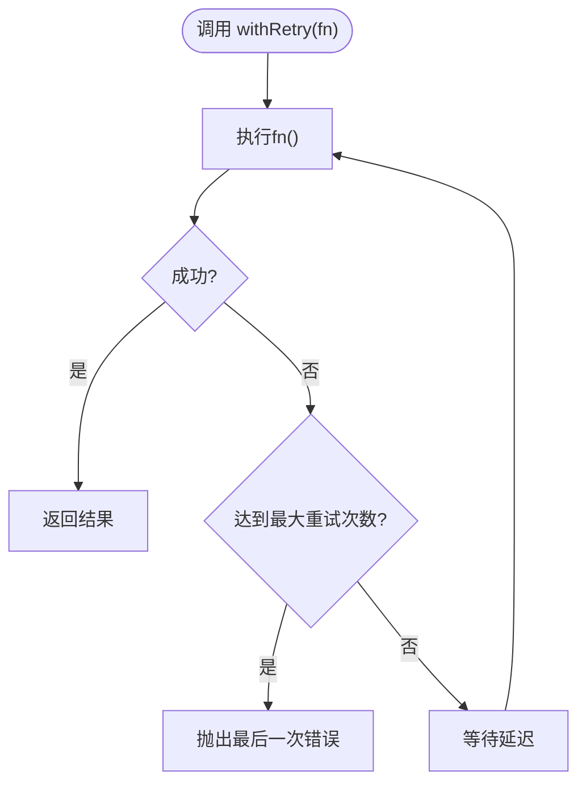
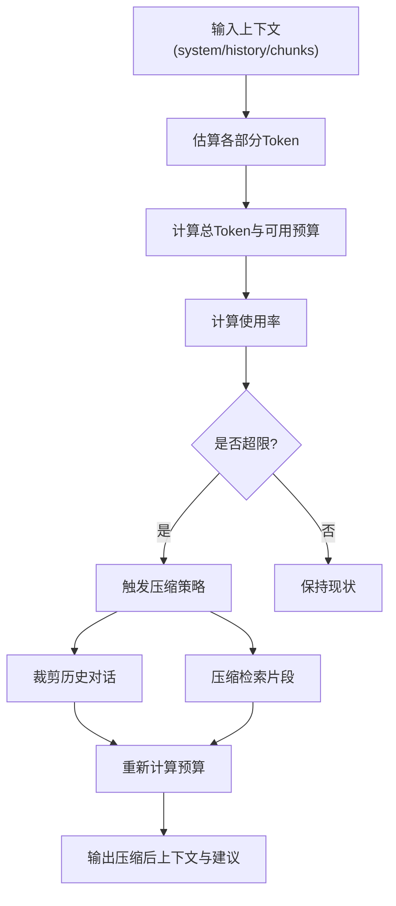
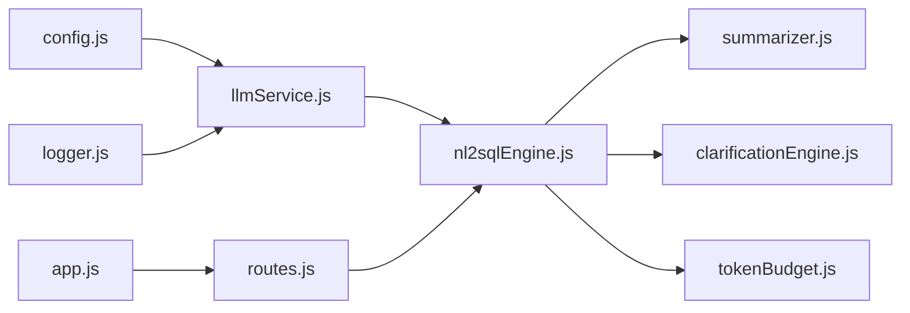

# LLM服务集成

<cite>
**本文引用的文件**
- [llmService.js](file://backend/src/core/llmService.js)
- [tokenBudget.js](file://backend/src/utils/tokenBudget.js)
- [config.js](file://backend/src/core/config.js)
- [logger.js](file://backend/src/utils/logger.js)
- [routes.js](file://backend/src/core/routes.js)
- [app.js](file://backend/src/app.js)
- [nl2sqlEngine.js](file://backend/src/core/nl2sqlEngine.js)
- [summarizer.js](file://backend/src/memory/summarizer.js)
- [clarificationEngine.js](file://backend/src/core/clarificationEngine.js)
- [package.json](file://backend/package.json)
</cite>

## 目录
1. [简介](#简介)
2. [项目结构](#项目结构)
3. [核心组件](#核心组件)
4. [架构总览](#架构总览)
5. [详细组件分析](#详细组件分析)
6. [依赖分析](#依赖分析)
7. [性能考量](#性能考量)
8. [故障排查指南](#故障排查指南)
9. [结论](#结论)
10. [附录](#附录)

## 简介
本技术文档聚焦于NL2SQL后端中的LLM服务集成模块，系统阐述其调用策略、API集成方式、Token预算管理、请求优化与响应处理机制，并给出针对不同LLM提供商的适配方案与配置方法。文档还解释了错误处理、重试机制与性能优化策略，并通过序列图与流程图展示关键交互过程，帮助开发者快速理解与实现。

## 项目结构
后端采用模块化设计，LLM服务集成位于核心模块与工具模块之间，围绕配置中心、日志系统、路由与引擎模块协同工作。关键文件分布如下：
- 核心LLM服务：backend/src/core/llmService.js
- Token预算管理：backend/src/utils/tokenBudget.js
- 配置中心：backend/src/core/config.js
- 日志系统：backend/src/utils/logger.js
- 路由与API：backend/src/core/routes.js
- 应用入口：backend/src/app.js
- NL2SQL引擎：backend/src/core/nl2sqlEngine.js
- 对话摘要：backend/src/memory/summarizer.js
- 澄清引擎：backend/src/core/clarificationEngine.js
- 依赖声明：backend/package.json

图表来源
- [app.js:1-260](file://backend/src/app.js#L1-L260)
- [routes.js:1-800](file://backend/src/core/routes.js#L1-L800)
- [llmService.js:1-477](file://backend/src/core/llmService.js#L1-L477)
- [config.js:1-398](file://backend/src/core/config.js#L1-L398)
- [logger.js:1-442](file://backend/src/utils/logger.js#L1-L442)
- [nl2sqlEngine.js:1-200](file://backend/src/core/nl2sqlEngine.js#L1-L200)
- [summarizer.js:1-200](file://backend/src/memory/summarizer.js#L1-L200)
- [clarificationEngine.js:1-200](file://backend/src/core/clarificationEngine.js#L1-L200)

章节来源
- [app.js:1-260](file://backend/src/app.js#L1-L260)
- [routes.js:1-800](file://backend/src/core/routes.js#L1-L800)

## 核心组件
- LLM服务模块：封装HTTP请求、重试机制、流式响应、Embedding调用与工具定义辅助函数。
- Token预算管理：估算Token、计算上下文预算、生成压缩建议、裁剪历史与检索片段。
- 配置中心：集中管理LLM API基础地址、模型、超时、重试、Embedding维度等。
- 日志系统：统一日志级别、文件轮转、结构化输出与执行流程追踪。
- NL2SQL引擎：整合LLM、Token预算、摘要与澄清机制，驱动自然语言到SQL的转换。
- 对话摘要：对长对话历史进行摘要压缩，降低Token占用。
- 澄清引擎：在置信度不足或歧义场景下生成澄清问题，提升理解准确性。

章节来源
- [llmService.js:1-477](file://backend/src/core/llmService.js#L1-L477)
- [tokenBudget.js:1-435](file://backend/src/utils/tokenBudget.js#L1-L435)
- [config.js:1-398](file://backend/src/core/config.js#L1-L398)
- [logger.js:1-442](file://backend/src/utils/logger.js#L1-L442)
- [nl2sqlEngine.js:1-200](file://backend/src/core/nl2sqlEngine.js#L1-L200)
- [summarizer.js:1-200](file://backend/src/memory/summarizer.js#L1-L200)
- [clarificationEngine.js:1-200](file://backend/src/core/clarificationEngine.js#L1-L200)

## 架构总览
LLM服务集成遵循“配置驱动 + 统一日志 + 可插拔适配”的设计原则。核心调用链路如下：
- 应用启动时加载环境变量与配置，初始化数据库与向量库。
- 路由层接收请求，交由NL2SQL引擎处理。
- NL2SQL引擎根据上下文与预算策略决定是否进行摘要、裁剪或澄清。
- LLM服务模块负责与外部LLM API通信，支持普通与流式响应、Embedding向量获取。
- 日志系统贯穿全流程，提供结构化日志与追踪能力。

图表来源
- [routes.js:1-800](file://backend/src/core/routes.js#L1-L800)
- [nl2sqlEngine.js:1-200](file://backend/src/core/nl2sqlEngine.js#L1-L200)
- [tokenBudget.js:1-435](file://backend/src/utils/tokenBudget.js#L1-L435)
- [summarizer.js:1-200](file://backend/src/memory/summarizer.js#L1-L200)
- [llmService.js:1-477](file://backend/src/core/llmService.js#L1-L477)

## 详细组件分析

### LLM服务模块（llmService.js）
- HTTP请求封装：支持JSON请求体、超时控制、响应解析与异常处理。
- 重试机制：withRetry提供指数退避风格的重试策略，可配置最大重试次数与延迟。
- 聊天接口：支持普通与流式响应，自动拼装Authorization头与模型参数。
- Embedding接口：支持单条与批量文本向量化，自动处理响应格式。
- 工具定义辅助：createToolDefinition用于构造函数调用工具定义。
- 错误处理：统一捕获网络错误、超时、HTTP状态码异常与JSON解析失败。

图表来源
- [llmService.js:167-195](file://backend/src/core/llmService.js#L167-L195)

章节来源
- [llmService.js:1-477](file://backend/src/core/llmService.js#L1-L477)

### Token预算管理（tokenBudget.js）
- 估算策略：基于字符数的经验比率估算Token，支持批量与对象估算。
- 预算计算：综合系统提示词、历史对话、检索片段，计算可用预算与使用率。
- 压缩策略：当接近临界值时，优先裁剪历史对话与压缩检索片段，必要时进一步激进裁剪。
- 快捷检查：提供上下文安全检查与状态摘要，便于快速决策。

图表来源
- [tokenBudget.js:115-181](file://backend/src/utils/tokenBudget.js#L115-L181)
- [tokenBudget.js:315-372](file://backend/src/utils/tokenBudget.js#L315-L372)

章节来源
- [tokenBudget.js:1-435](file://backend/src/utils/tokenBudget.js#L1-L435)

### 配置中心（config.js）
- LLM配置：apiBase、apiKey、model、timeout、maxRetries、retryDelay。
- Embedding配置：model、dimension、timeout。
- 上下文管理：enableTokenBudget、enableSummarizer、tokenBudget阈值、摘要配置。
- 安全与会话：allowedTables、dryRun、maxQueryRows、queryTimeout、session配置等。
- 配置校验：启动时验证必要配置项，缺失时抛出错误。

章节来源
- [config.js:1-398](file://backend/src/core/config.js#L1-L398)

### 日志系统（logger.js）
- 多级别日志：TRACE、DEBUG、INFO、WARN、ERROR。
- 文件轮转：按大小轮转，保留历史文件。
- 结构化输出：支持元数据JSON序列化。
- 执行追踪：提供trace、traceStep、endTrace，便于端到端流程追踪。

章节来源
- [logger.js:1-442](file://backend/src/utils/logger.js#L1-L442)

### NL2SQL引擎（nl2sqlEngine.js）
- 与LLM服务集成：在SQL生成、澄清与摘要阶段调用LLM服务。
- Token预算与摘要：结合tokenBudget与summarizer，控制上下文长度。
- 澄清机制：在歧义或低置信度场景触发澄清问题生成与回答应用。
- 模块化设计：通过动态require实现可选功能（如语义层、功能开关）。

章节来源
- [nl2sqlEngine.js:1-200](file://backend/src/core/nl2sqlEngine.js#L1-L200)

### 对话摘要（summarizer.js）
- 历史分割：将早期对话压缩为摘要，保留近期对话原文。
- 摘要生成：调用LLM生成简洁摘要，控制长度并进行缓存。
- 增量更新：在新对话加入后对摘要进行增量更新。

章节来源
- [summarizer.js:1-200](file://backend/src/memory/summarizer.js#L1-L200)

### 澄清引擎（clarificationEngine.js）
- 触发条件：数据单元无匹配表、表选择歧义、聚合来源不确定、时间粒度不明确、低置信度。
- 问题生成：根据不同场景生成友好澄清问题，引导用户提供更多信息。

章节来源
- [clarificationEngine.js:1-200](file://backend/src/core/clarificationEngine.js#L1-L200)

## 依赖分析
- LLM服务模块依赖配置中心与日志系统，对外提供chat、simpleChat、getEmbedding与工具定义辅助函数。
- NL2SQL引擎依赖LLM服务、Token预算、摘要与澄清模块，形成闭环的上下文管理与LLM调用。
- 路由层通过Express暴露REST接口，将请求转发给NL2SQL引擎处理。
- 应用入口负责初始化数据库、向量库、Schema与自修复调度器，并启动HTTP服务器。

图表来源
- [llmService.js:1-477](file://backend/src/core/llmService.js#L1-L477)
- [config.js:1-398](file://backend/src/core/config.js#L1-L398)
- [logger.js:1-442](file://backend/src/utils/logger.js#L1-L442)
- [nl2sqlEngine.js:1-200](file://backend/src/core/nl2sqlEngine.js#L1-L200)
- [summarizer.js:1-200](file://backend/src/memory/summarizer.js#L1-L200)
- [clarificationEngine.js:1-200](file://backend/src/core/clarificationEngine.js#L1-L200)
- [routes.js:1-800](file://backend/src/core/routes.js#L1-L800)
- [app.js:1-260](file://backend/src/app.js#L1-L260)

章节来源
- [package.json:1-28](file://backend/package.json#L1-L28)

## 性能考量
- 超时与重试：合理设置LLM与Embedding超时，配合重试机制提升稳定性。
- Token预算：通过估算与压缩策略控制上下文长度，避免超限导致的失败与昂贵调用。
- 流式响应：在支持的场景下启用流式响应，改善用户体验并降低首字节延迟。
- 日志级别：生产环境建议降低日志级别，避免过多IO影响性能。
- 缓存与摘要：对长对话进行摘要与缓存，减少重复Token消耗。

## 故障排查指南
- API鉴权失败：检查LLM API密钥配置与Authorization头是否正确。
- 超时与重试：查看重试日志与超时配置，适当增大timeout或调整maxRetries。
- 响应解析失败：关注JSON解析错误与“truncated”标记，检查API端点响应大小限制。
- 上下文超限：启用Token预算检查，观察压缩建议并实施裁剪策略。
- 日志追踪：利用trace、traceStep与endTrace定位问题环节，结合日志文件定位根因。

章节来源
- [llmService.js:135-151](file://backend/src/core/llmService.js#L135-L151)
- [llmService.js:167-195](file://backend/src/core/llmService.js#L167-L195)
- [tokenBudget.js:189-214](file://backend/src/utils/tokenBudget.js#L189-L214)
- [logger.js:311-408](file://backend/src/utils/logger.js#L311-L408)

## 结论
本LLM服务集成模块以配置为中心、以日志为支撑、以预算为约束，实现了对多场景的稳健适配。通过与NL2SQL引擎、摘要与澄清模块的协同，能够在保证质量的同时控制成本与延迟。建议在生产环境中启用Token预算与摘要、合理配置超时与重试，并持续监控日志与性能指标。

## 附录

### 不同LLM提供商适配方案
- OpenAI兼容：直接使用apiBase与apiKey，模型名称与参数按OpenAI格式配置。
- Azure OpenAI：将apiBase指向Azure端点，确保Authorization头与模型名称符合Azure规范。
- 其他兼容服务：仅需替换apiBase与认证方式，其余调用逻辑保持一致。

章节来源
- [config.js:55-87](file://backend/src/core/config.js#L55-L87)
- [llmService.js:268-275](file://backend/src/core/llmService.js#L268-L275)

### 配置清单与建议
- LLM API基础地址与密钥：LLM_API_BASE、LLM_API_KEY。
- 模型与超时：LLM_MODEL、LLM_TIMEOUT、EMBEDDING_TIMEOUT。
- Token预算：ENABLE_TOKEN_BUDGET、MAX_CONTEXT_TOKENS、RESERVED_OUTPUT_TOKENS。
- 摘要配置：ENABLE_SUMMARIZER、SUMMARIZER_*系列参数。
- 日志级别与文件：LOG_LEVEL、LOG_FILE、LOG_FILE_OUTPUT。

章节来源
- [config.js:21-354](file://backend/src/core/config.js#L21-L354)