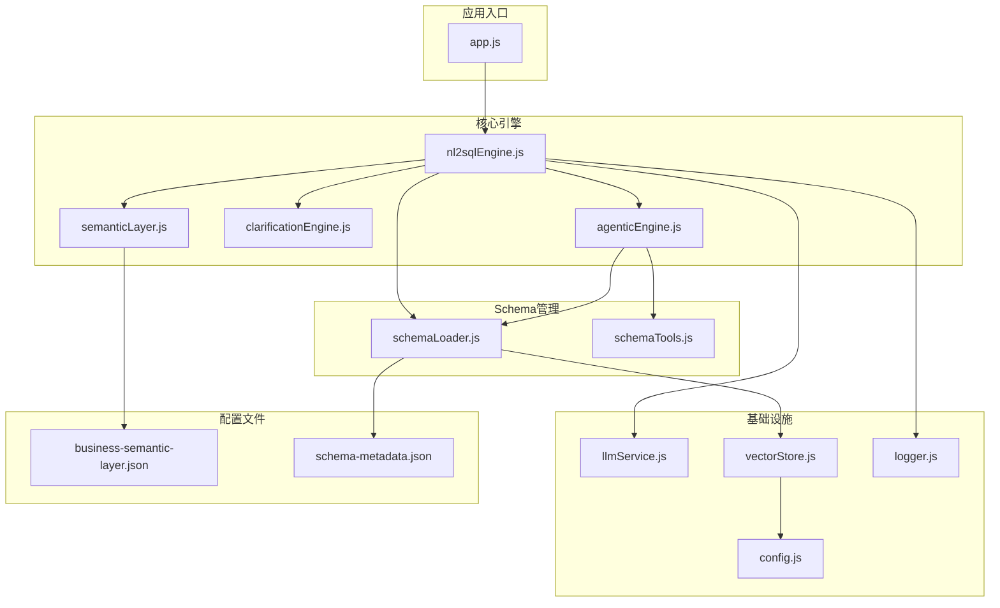
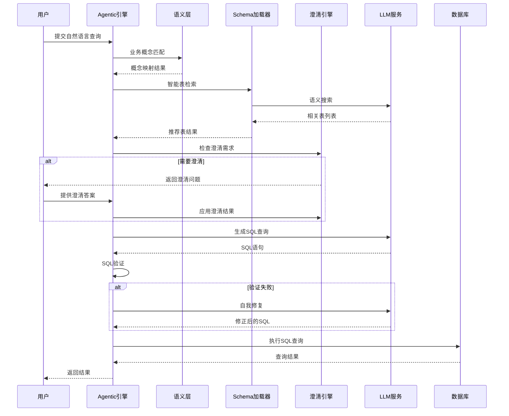
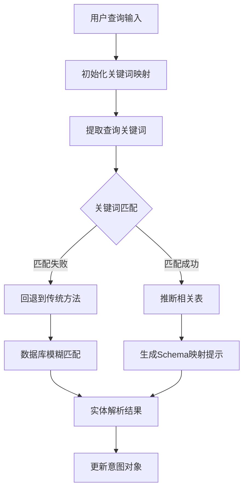
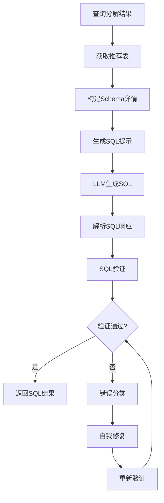
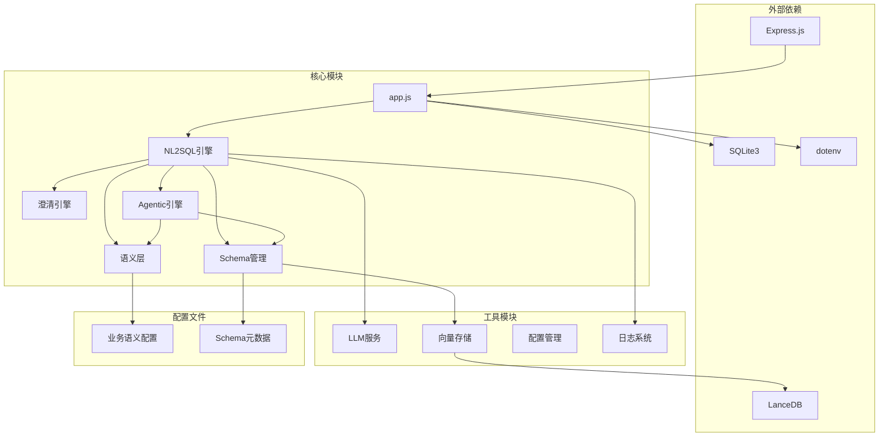

# NL2SQL核心引擎

<cite>
**本文档引用的文件**
- [app.js](file://backend/src/app.js)
- [nl2sqlEngine.js](file://backend/src/core/nl2sqlEngine.js)
- [semanticLayer.js](file://backend/src/core/semanticLayer.js)
- [schemaLoader.js](file://backend/src/core/schemaLoader.js)
- [schemaTools.js](file://backend/src/core/schemaTools.js)
- [llmService.js](file://backend/src/core/llmService.js)
- [config.js](file://backend/src/core/config.js)
- [vectorStore.js](file://backend/src/memory/vectorStore.js)
- [clarificationEngine.js](file://backend/src/core/clarificationEngine.js)
- [agenticEngine.js](file://backend/src/core/agenticEngine.js)
- [logger.js](file://backend/src/utils/logger.js)
- [business-semantic-layer.json](file://backend/config/business-semantic-layer.json)
- [schema-metadata.json](file://backend/config/schema-metadata.json)
- [package.json](file://backend/package.json)
</cite>

## 目录
1. [简介](#简介)
2. [项目结构](#项目结构)
3. [核心组件](#核心组件)
4. [架构概览](#架构概览)
5. [详细组件分析](#详细组件分析)
6. [依赖关系分析](#依赖关系分析)
7. [性能考虑](#性能考虑)
8. [故障排除指南](#故障排除指南)
9. [结论](#结论)

## 简介

NL2SQL核心引擎是一个基于人工智能的自然语言到SQL转换系统，专为游戏数据分析场景设计。该引擎实现了四阶段的智能工作流，能够将自然语言查询转换为精确的SQL语句，支持复杂的业务概念识别、实体解析、表推断和智能澄清。

该系统采用模块化架构设计，集成了多种先进技术：
- **业务语义层**：将业务概念映射到物理表结构
- **多模态Schema发现**：结合关键词匹配和语义搜索
- **智能澄清机制**：处理歧义查询和信息不足的情况
- **自我修复能力**：自动检测和纠正SQL错误
- **向量化检索**：基于LanceDB的语义相似度搜索

## 项目结构

NL2SQL后端采用清晰的分层架构，主要包含以下核心目录：

**图表来源**
- [app.js:1-260](file://backend/src/app.js#L1-L260)
- [nl2sqlEngine.js:1-800](file://backend/src/core/nl2sqlEngine.js#L1-L800)
- [semanticLayer.js:1-532](file://backend/src/core/semanticLayer.js#L1-L532)

**章节来源**
- [package.json:1-28](file://backend/package.json#L1-L28)
- [app.js:1-260](file://backend/src/app.js#L1-L260)

## 核心组件

### NL2SQL核心引擎

NL2SQL核心引擎是整个系统的大脑，负责协调各个组件的工作流程。它实现了以下关键功能：

#### 1. 意图识别与实体解析
- **业务关键词映射**：基于配置文件动态构建业务术语到表的映射
- **实体解析**：将模糊描述（如游戏名称）映射到具体ID
- **平台识别**：识别"老平台"、"新平台"等业务概念

#### 2. 表推断与Schema映射
- **智能表检索**：根据查询内容推断可能需要的表
- **Schema向量化**：将表结构转换为向量表示用于语义搜索
- **映射提示生成**：为LLM提供业务术语到技术字段的映射

#### 3. 错误处理与统一错误类
- **NL2SQLError类**：提供结构化的错误信息
- **可恢复错误**：支持通过澄清等方式解决的错误类型
- **详细日志记录**：完整的错误追踪和诊断信息

**章节来源**
- [nl2sqlEngine.js:166-240](file://backend/src/core/nl2sqlEngine.js#L166-L240)
- [nl2sqlEngine.js:60-160](file://backend/src/core/nl2sqlEngine.js#L60-L160)

### 业务语义层

业务语义层是NL2SQL系统的核心创新之一，它建立了业务概念到物理表结构的桥梁：

#### 1. 概念映射系统
- **多层级映射**：支持概念到表、字段、数据源的多层次映射
- **别名识别**：支持业务术语的多种表达方式
- **优先级机制**：为不同概念设置处理优先级

#### 2. 表推荐算法
- **智能排序**：基于匹配分数和优先级对表进行排序
- **上下文感知**：根据查询上下文调整推荐结果
- **类型分类**：区分平台表、游戏表、汇总表等不同类型

**章节来源**
- [semanticLayer.js:124-306](file://backend/src/core/semanticLayer.js#L124-L306)
- [business-semantic-layer.json:1-189](file://backend/config/business-semantic-layer.json#L1-L189)

### Schema管理系统

Schema管理系统负责管理和维护数据库表结构信息：

#### 1. 动态Schema加载
- **JSON配置驱动**：从schema-metadata.json加载表结构定义
- **缓存机制**：提高Schema查询性能
- **验证系统**：确保Schema数据格式正确性

#### 2. 语义搜索功能
- **向量化存储**：使用LanceDB存储表向量表示
- **智能检索**：基于查询意图的表推荐
- **增量更新**：支持Schema的动态更新

**章节来源**
- [schemaLoader.js:69-122](file://backend/src/core/schemaLoader.js#L69-L122)
- [schemaLoader.js:201-276](file://backend/src/core/schemaLoader.js#L201-L276)

## 架构概览

NL2SQL核心引擎采用四阶段Agentic工作流架构：

**图表来源**
- [agenticEngine.js:68-178](file://backend/src/core/agenticEngine.js#L68-L178)
- [clarificationEngine.js:196-232](file://backend/src/core/clarificationEngine.js#L196-L232)

## 详细组件分析

### 意图识别与实体解析

#### 业务关键词映射机制

**图表来源**
- [nl2sqlEngine.js:104-160](file://backend/src/core/nl2sqlEngine.js#L104-L160)
- [nl2sqlEngine.js:254-308](file://backend/src/core/nl2sqlEngine.js#L254-L308)

#### 实体解析算法

实体解析是NL2SQL系统的关键功能，它能够将模糊的业务描述转换为精确的数据库标识：

**章节来源**
- [nl2sqlEngine.js:254-308](file://backend/src/core/nl2sqlEngine.js#L254-L308)
- [nl2sqlEngine.js:461-572](file://backend/src/core/nl2sqlEngine.js#L461-L572)

### 澄清机制

澄清引擎负责处理查询中的歧义和不确定性：

#### 澄清触发条件

| 触发类型 | 条件描述 | 严重程度 | 优先级 |
|---------|----------|----------|--------|
| 数据单元无匹配表 | 查询需求无法匹配到具体表 | HIGH | 1 |
| 表选择歧义 | 同类型数据匹配到多个表 | MEDIUM | 2 |
| 聚合指标来源不明确 | 原始表和汇总表同时存在 | LOW | 3 |
| 时间粒度不明确 | 时间统计维度缺少粒度信息 | LOW | 4 |
| 置信度过低 | 整体理解置信度低于阈值 | HIGH/MEDIUM | 1 |

**章节来源**
- [clarificationEngine.js:26-182](file://backend/src/core/clarificationEngine.js#L26-L182)

### SQL生成与验证

#### SQL生成流程

**图表来源**
- [agenticEngine.js:345-435](file://backend/src/core/agenticEngine.js#L345-L435)

**章节来源**
- [agenticEngine.js:440-513](file://backend/src/core/agenticEngine.js#L440-L513)

### 向量存储与语义搜索

#### 智能搜索算法

向量存储系统实现了高级的语义搜索功能：

**章节来源**
- [vectorStore.js:452-537](file://backend/src/memory/vectorStore.js#L452-L537)
- [schemaLoader.js:562-652](file://backend/src/core/schemaLoader.js#L562-L652)

## 依赖关系分析

NL2SQL核心引擎的依赖关系体现了清晰的分层架构：

**图表来源**
- [package.json:10-20](file://backend/package.json#L10-L20)
- [app.js:22-50](file://backend/src/app.js#L22-L50)

**章节来源**
- [package.json:10-28](file://backend/package.json#L10-L28)
- [config.js:16-398](file://backend/src/core/config.js#L16-L398)

## 性能考虑

NL2SQL核心引擎在设计时充分考虑了性能优化：

### 缓存策略
- **Schema缓存**：避免重复解析Schema元数据
- **向量缓存**：减少Embedding计算开销
- **查询历史缓存**：支持相似查询的快速响应

### 异步处理
- **并发查询**：支持多用户并发处理
- **流式响应**：SSE支持实时结果传输
- **渐进式反馈**：提供处理进度更新

### 资源管理
- **连接池管理**：优化数据库连接使用
- **内存监控**：防止内存泄漏
- **超时控制**：避免长时间阻塞

## 故障排除指南

### 常见错误类型

| 错误类型 | 描述 | 解决方案 |
|---------|------|----------|
| ENTITY_RESOLUTION | 实体解析失败 | 检查数据库连接，验证实体名称 |
| VALIDATION | SQL验证失败 | 检查表名和字段名，确认权限 |
| SQL_GENERATION | SQL生成错误 | 简化查询，提供更多信息 |
| CLARIFICATION | 需要澄清的信息 | 提供具体的选择或示例 |

### 调试技巧

1. **启用详细日志**：设置LOG_LEVEL=debug查看详细流程
2. **追踪执行过程**：使用trace功能监控处理步骤
3. **检查配置**：验证LLM API密钥和数据库连接
4. **监控性能**：关注向量搜索和查询执行时间

**章节来源**
- [nl2sqlEngine.js:170-240](file://backend/src/core/nl2sqlEngine.js#L170-L240)
- [logger.js:263-309](file://backend/src/utils/logger.js#L263-L309)

## 结论

NL2SQL核心引擎通过创新的四阶段Agentic工作流，实现了自然语言到SQL的高效转换。该系统的主要优势包括：

1. **智能化的业务理解**：通过业务语义层实现复杂的概念映射
2. **灵活的错误处理**：支持自我修复和用户澄清机制
3. **高性能的架构设计**：结合缓存、向量化和异步处理
4. **可扩展的模块化设计**：便于功能扩展和维护

该引擎为游戏数据分析场景提供了强大的自然语言查询能力，能够处理复杂的业务逻辑和多变的查询需求。通过持续的优化和扩展，NL2SQL系统将继续为用户提供更好的自然语言查询体验。