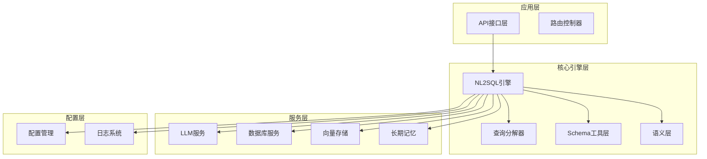
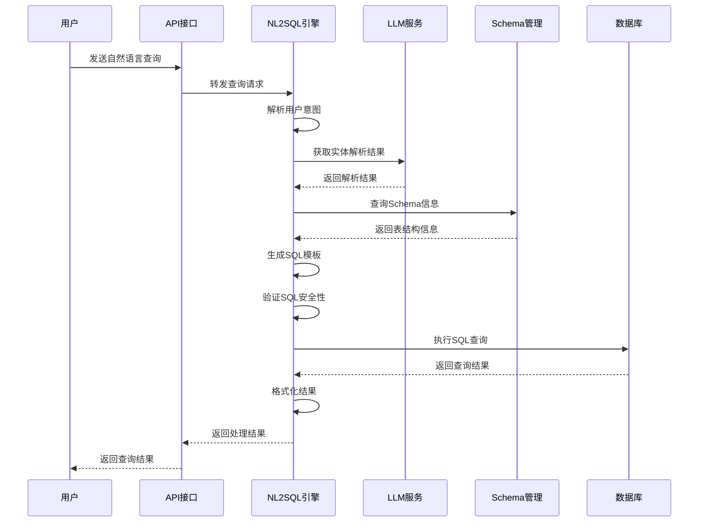
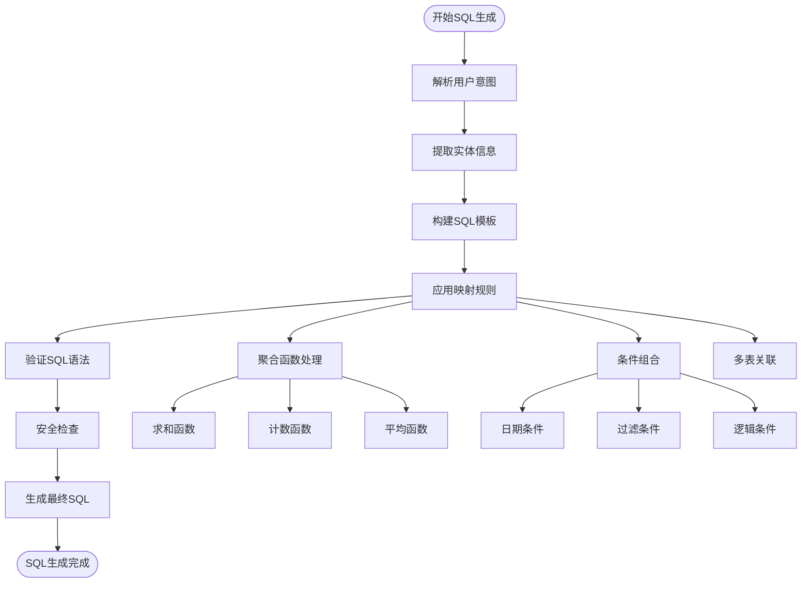
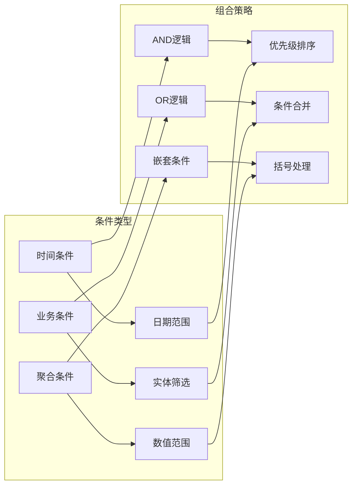
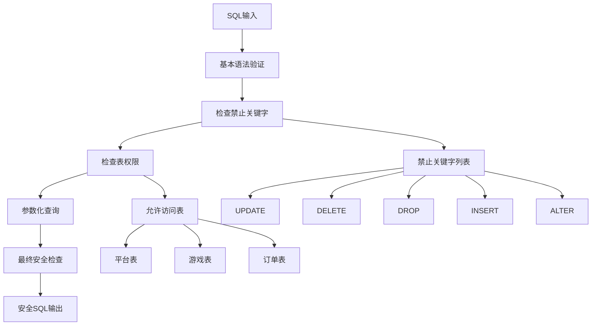
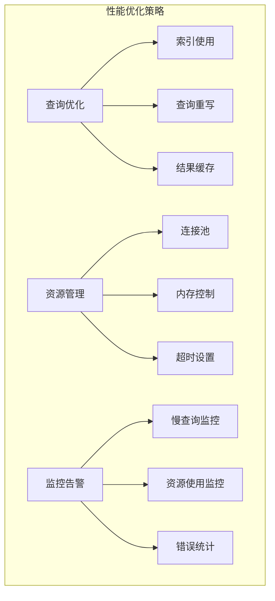
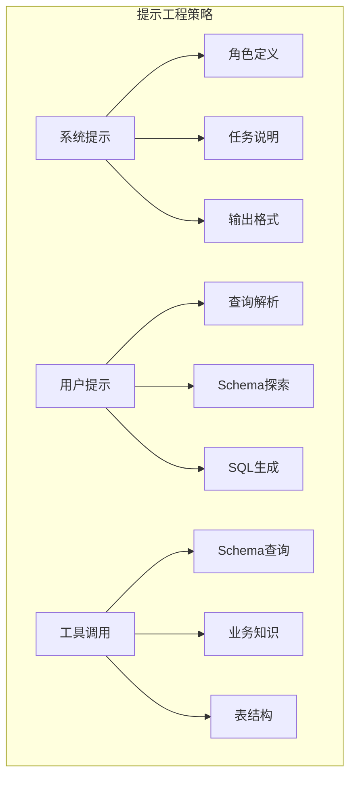
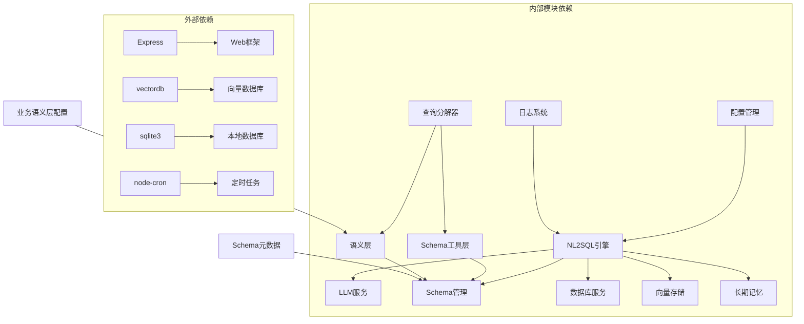
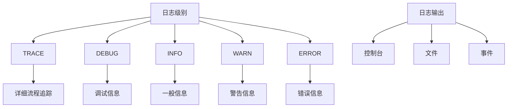

# SQL生成与验证

<cite>
**本文档引用的文件**
- [nl2sqlEngine.js](file://backend/src/core/nl2sqlEngine.js)
- [schemaTools.js](file://backend/src/core/schemaTools.js)
- [semanticLayer.js](file://backend/src/core/semanticLayer.js)
- [queryDecomposer.js](file://backend/src/core/queryDecomposer.js)
- [database.js](file://backend/src/core/database.js)
- [llmService.js](file://backend/src/core/llmService.js)
- [schemaLoader.js](file://backend/src/core/schemaLoader.js)
- [config.js](file://backend/src/core/config.js)
- [logger.js](file://backend/src/utils/logger.js)
- [longTermMemory.js](file://backend/src/memory/longTermMemory.js)
- [vectorStore.js](file://backend/src/memory/vectorStore.js)
- [business-semantic-layer.json](file://backend/config/business-semantic-layer.json)
- [schema-metadata.json](file://backend/config/schema-metadata.json)
</cite>

## 目录
1. [简介](#简介)
2. [项目结构](#项目结构)
3. [核心组件](#核心组件)
4. [架构概览](#架构概览)
5. [详细组件分析](#详细组件分析)
6. [依赖关系分析](#依赖关系分析)
7. [性能考虑](#性能考虑)
8. [故障排除指南](#故障排除指南)
9. [结论](#结论)
10. [附录](#附录)

## 简介

NL2SQL引擎是一个智能化的自然语言到SQL转换系统，专注于为游戏数据分析场景提供准确、安全的SQL生成与验证功能。该系统通过多层架构设计，结合LLM服务、语义层、Schema管理、长期记忆等核心技术，实现了从解析后的意图和实体信息到最终SQL语句的完整转换流程。

系统的主要目标包括：
- **智能SQL生成**：基于解析后的用户意图和实体信息生成准确的SQL语句
- **安全验证**：实施多层次的安全检查和SQL注入防护
- **语义理解**：通过业务语义层理解和映射业务概念
- **模板系统**：建立灵活的SQL模板和字段映射规则
- **聚合函数**：支持复杂的聚合查询和条件组合
- **LLM集成**：与大型语言模型无缝集成，实现智能提示工程

## 项目结构

NL2SQL引擎采用模块化架构设计，主要分为以下几个核心层次：



**图表来源**
- [nl2sqlEngine.js:1-800](file://backend/src/core/nl2sqlEngine.js#L1-L800)
- [schemaTools.js:1-632](file://backend/src/core/schemaTools.js#L1-L632)
- [semanticLayer.js:1-532](file://backend/src/core/semanticLayer.js#L1-L532)

**章节来源**
- [nl2sqlEngine.js:1-800](file://backend/src/core/nl2sqlEngine.js#L1-L800)
- [schemaTools.js:1-632](file://backend/src/core/schemaTools.js#L1-L632)
- [semanticLayer.js:1-532](file://backend/src/core/semanticLayer.js#L1-L532)

## 核心组件

### NL2SQL引擎核心模块

NL2SQL引擎是整个系统的核心，负责协调各个组件的工作流程。其主要功能包括：

1. **意图识别与澄清**：解析用户查询，识别业务意图和实体
2. **实体解析**：将模糊描述映射到具体的数据实体
3. **SQL生成**：基于解析结果生成标准SQL语句
4. **SQL验证**：实施安全性和语法检查
5. **结果格式化**：将查询结果转换为自然语言

### Schema工具层

Schema工具层提供LLM可调用的Schema探索工具，实现"按需索取"的Schema发现机制：

- **search_tables**：根据关键词搜索相关表
- **describe_table**：获取指定表的详细字段信息
- **search_knowledge**：查询业务概念的定义和映射
- **peek_table**：查看表的前N行样例数据

### 语义层模块

语义层模块建立业务概念到物理表/字段的映射关系：

- **业务概念匹配**：识别和匹配业务术语
- **表推荐**：基于匹配结果推荐相关表
- **数据源映射**：处理平台类型和数据源映射
- **字段值映射**：处理字段值的业务语义映射

### 查询分解器

查询分解器将复杂查询拆解为可独立检索的数据需求单元：

- **动态拆解**：将复杂查询拆解为数据单元
- **表检索**：基于数据单元检索相关表
- **候选合并**：合并和排序表候选结果

**章节来源**
- [nl2sqlEngine.js:1-800](file://backend/src/core/nl2sqlEngine.js#L1-L800)
- [schemaTools.js:1-632](file://backend/src/core/schemaTools.js#L1-L632)
- [semanticLayer.js:1-532](file://backend/src/core/semanticLayer.js#L1-L532)
- [queryDecomposer.js:1-406](file://backend/src/core/queryDecomposer.js#L1-L406)

## 架构概览

NL2SQL引擎采用分层架构设计，各层之间职责清晰，耦合度低：



**图表来源**
- [nl2sqlEngine.js:1-800](file://backend/src/core/nl2sqlEngine.js#L1-L800)
- [llmService.js:1-477](file://backend/src/core/llmService.js#L1-L477)
- [schemaLoader.js:1-1172](file://backend/src/core/schemaLoader.js#L1-L1172)

## 详细组件分析

### SQL生成系统

SQL生成系统是NL2SQL引擎的核心功能模块，负责将解析后的意图转换为准确的SQL语句。

#### SQL模板系统

系统采用灵活的模板系统，支持多种查询类型的SQL生成：



**图表来源**
- [nl2sqlEngine.js:1-800](file://backend/src/core/nl2sqlEngine.js#L1-L800)
- [schemaLoader.js:1-1172](file://backend/src/core/schemaLoader.js#L1-L1172)

#### 字段映射规则

系统建立了完善的字段映射规则体系：

1. **业务术语映射**：将业务概念映射到具体字段
2. **实体解析映射**：处理游戏名称、渠道名称等实体映射
3. **平台类型映射**：区分新平台和老平台的数据源
4. **聚合字段映射**：处理SUM、COUNT、AVG等聚合函数

#### 聚合函数生成

系统支持多种聚合函数的自动生成：

| 聚合类型 | SQL函数 | 业务含义 |
|---------|---------|----------|
| 求和 | SUM(amount) | 累计金额、总充值 |
| 计数 | COUNT(*) | 用户数量、订单数量 |
| 平均值 | AVG(amount) | 平均消费、平均时长 |
| 最大值 | MAX(amount) | 最高充值、最高分数 |
| 最小值 | MIN(amount) | 最低消费、最低等级 |

#### 条件组合逻辑

系统采用智能的条件组合逻辑：



**图表来源**
- [nl2sqlEngine.js:1-800](file://backend/src/core/nl2sqlEngine.js#L1-L800)
- [semanticLayer.js:1-532](file://backend/src/core/semanticLayer.js#L1-L532)

### SQL安全验证系统

SQL安全验证系统实施多层次的安全检查：

#### SQL注入防护



**图表来源**
- [schemaLoader.js:712-758](file://backend/src/core/schemaLoader.js#L712-L758)
- [config.js:140-170](file://backend/src/core/config.js#L140-L170)

#### 查询合法性检查

系统实施全面的查询合法性检查：

1. **关键字过滤**：阻止DDL和DML操作
2. **表权限验证**：确保只访问授权表
3. **参数验证**：验证查询参数的合法性
4. **结果限制**：防止大数据量查询

#### 性能优化建议



**图表来源**
- [config.js:220-231](file://backend/src/core/config.js#L220-L231)
- [database.js:1-800](file://backend/src/core/database.js#L1-L800)

### LLM服务集成

NL2SQL引擎与LLM服务的集成采用了多种策略：

#### 提示工程

系统使用精心设计的提示模板：



**图表来源**
- [llmService.js:1-477](file://backend/src/core/llmService.js#L1-L477)
- [schemaTools.js:1-632](file://backend/src/core/schemaTools.js#L1-L632)

#### 上下文构建

系统采用多层上下文构建策略：

1. **用户上下文**：用户ID、历史查询、偏好设置
2. **查询上下文**：当前查询意图、实体信息、时间范围
3. **Schema上下文**：表结构信息、字段定义、关系映射
4. **业务上下文**：业务规则、平台类型、数据源标识

#### 结果后处理

LLM服务的响应经过多层处理：

1. **JSON解析**：提取结构化数据
2. **错误处理**：处理LLM响应异常
3. **格式转换**：将LLM输出转换为内部格式
4. **质量评估**：评估LLM输出的质量和可靠性

**章节来源**
- [nl2sqlEngine.js:1-800](file://backend/src/core/nl2sqlEngine.js#L1-L800)
- [llmService.js:1-477](file://backend/src/core/llmService.js#L1-L477)
- [schemaTools.js:1-632](file://backend/src/core/schemaTools.js#L1-L632)
- [semanticLayer.js:1-532](file://backend/src/core/semanticLayer.js#L1-L532)

## 依赖关系分析

NL2SQL引擎的依赖关系呈现清晰的分层结构：



**图表来源**
- [package.json:1-28](file://backend/package.json#L1-L28)
- [nl2sqlEngine.js:1-800](file://backend/src/core/nl2sqlEngine.js#L1-L800)

### 组件耦合度分析

系统采用松耦合设计，主要体现在：

1. **接口抽象**：各模块通过明确定义的接口交互
2. **配置驱动**：通过配置文件控制模块行为
3. **事件机制**：使用事件机制实现模块间通信
4. **中间件模式**：通过中间件实现横切关注点

### 循环依赖检测

系统通过模块化设计避免了循环依赖：

- 核心引擎模块不依赖具体实现细节
- 工具层提供抽象接口，不直接依赖具体服务
- 配置模块集中管理所有配置，避免分散配置

**章节来源**
- [package.json:1-28](file://backend/package.json#L1-L28)
- [nl2sqlEngine.js:1-800](file://backend/src/core/nl2sqlEngine.js#L1-L800)

## 性能考虑

NL2SQL引擎在设计时充分考虑了性能优化：

### 查询性能优化

1. **索引优化**：合理使用数据库索引提高查询速度
2. **查询重写**：优化复杂查询的执行计划
3. **结果缓存**：缓存常用查询结果减少重复计算
4. **批量处理**：支持批量查询提高吞吐量

### 内存管理

1. **连接池**：使用连接池管理数据库连接
2. **内存限制**：设置查询结果大小限制防止内存溢出
3. **垃圾回收**：合理管理JavaScript对象生命周期
4. **流式处理**：对大数据量查询采用流式处理

### 并发处理

1. **异步处理**：使用Promise和async/await处理异步操作
2. **队列管理**：使用内存队列处理长期记忆存储
3. **限流控制**：防止系统过载
4. **超时管理**：设置合理的查询超时时间

## 故障排除指南

### 常见问题诊断

#### SQL生成失败

**症状**：SQL生成过程中出现错误

**排查步骤**：
1. 检查用户意图解析是否正确
2. 验证实体映射是否准确
3. 确认Schema信息是否完整
4. 检查LLM服务状态

**解决方案**：
- 重新训练LLM模型
- 更新Schema元数据
- 调整实体解析规则
- 增加重试机制

#### SQL验证失败

**症状**：SQL生成后被安全检查拒绝

**排查步骤**：
1. 检查禁止关键字列表
2. 验证表权限配置
3. 确认参数绑定
4. 检查SQL语法

**解决方案**：
- 更新安全配置
- 修正SQL模板
- 添加参数验证
- 实施SQL重写

#### LLM服务异常

**症状**：LLM服务调用失败或响应异常

**排查步骤**：
1. 检查API密钥配置
2. 验证网络连接
3. 确认模型可用性
4. 检查请求格式

**解决方案**：
- 更新API配置
- 实施重试机制
- 添加降级策略
- 监控服务状态

### 日志分析

系统提供详细的日志记录功能：



**图表来源**
- [logger.js:1-442](file://backend/src/utils/logger.js#L1-L442)

**章节来源**
- [logger.js:1-442](file://backend/src/utils/logger.js#L1-L442)
- [nl2sqlEngine.js:1-800](file://backend/src/core/nl2sqlEngine.js#L1-L800)

## 结论

NL2SQL引擎通过模块化架构设计和多层技术实现，成功解决了自然语言到SQL转换的复杂挑战。系统的主要优势包括：

1. **智能化程度高**：通过LLM服务和语义层实现智能理解
2. **安全性强**：实施多层次的安全检查和防护机制
3. **扩展性强**：模块化设计支持功能扩展和定制
4. **性能优异**：优化的查询处理和缓存机制
5. **易维护**：清晰的架构和完善的日志系统

未来发展方向：
- 进一步优化LLM集成效果
- 增强多语言支持能力
- 扩展更多业务场景支持
- 提升实时查询处理能力

## 附录

### SQL生成示例

#### 简单查询
**用户查询**：查询2024年1月1日注册的用户
**生成SQL**：
```sql
SELECT * FROM tzpingtai_tz_sdk_log_pf_reg 
WHERE DATE(create_time) = '2024-01-01'
```

#### 聚合查询
**用户查询**：统计各渠道的充值金额
**生成SQL**：
```sql
SELECT channel_id, SUM(real_amount) as total_amount, COUNT(*) as order_count
FROM tzpingtai_tz_sdk_log_pf_order 
GROUP BY channel_id
ORDER BY total_amount DESC
```

#### 多表关联
**用户查询**：查询注册用户的登录行为
**生成SQL**：
```sql
SELECT r.tz_account_id, r.create_time as register_time, l.create_time as login_time
FROM tzpingtai_tz_sdk_log_pf_reg r
LEFT JOIN tzpingtai_tz_sdk_log_pf_login l ON r.tz_account_id = l.tz_account_id
WHERE DATE(r.create_time) = '2024-01-01'
```

#### 复杂条件
**用户查询**：查询2024年1月活跃且充值超过1000的用户
**生成SQL**：
```sql
SELECT DISTINCT r.tz_account_id
FROM tzpingtai_tz_sdk_log_pf_reg r
INNER JOIN tzpingtai_tz_sdk_log_pf_login l ON r.tz_account_id = l.tz_account_id
INNER JOIN (
    SELECT tz_account_id, SUM(real_amount) as total_amount
    FROM tzpingtai_tz_sdk_log_pf_order
    WHERE DATE(create_time) = '2024-01-01'
    GROUP BY tz_account_id
    HAVING SUM(real_amount) > 1000
) o ON r.tz_account_id = o.tz_account_id
WHERE DATE(l.create_time) = '2024-01-01'
```

### 最佳实践

1. **提示工程**：设计清晰、具体的提示模板
2. **实体解析**：建立完善的实体映射规则
3. **安全检查**：实施多层次的安全验证
4. **性能优化**：合理使用缓存和索引
5. **错误处理**：建立完善的错误处理机制
6. **监控告警**：实时监控系统状态和性能指标

### 常见陷阱避免

1. **SQL注入**：始终使用参数化查询
2. **性能问题**：避免全表扫描和复杂嵌套查询
3. **数据准确性**：确保实体映射的准确性
4. **资源泄漏**：及时释放数据库连接和内存
5. **配置错误**：定期检查和更新配置信息