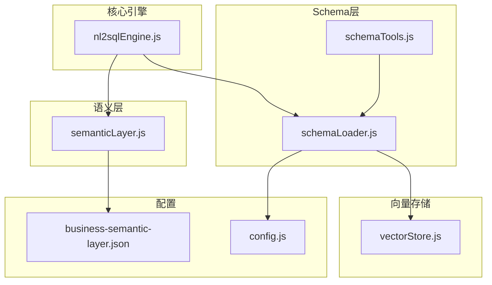
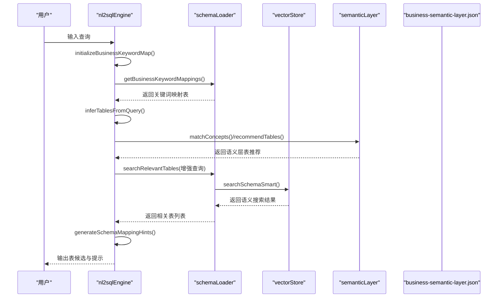
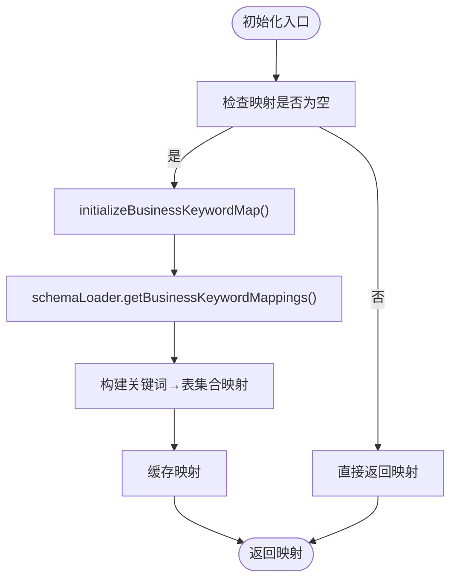
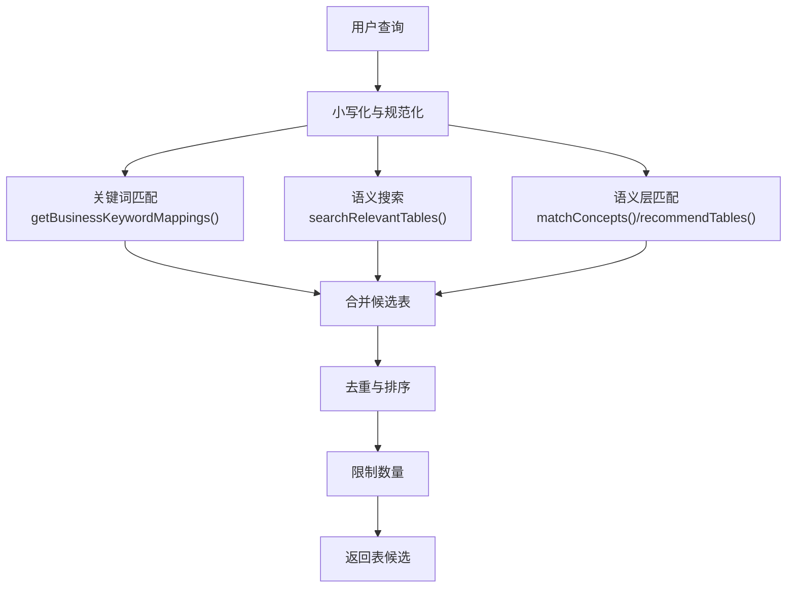
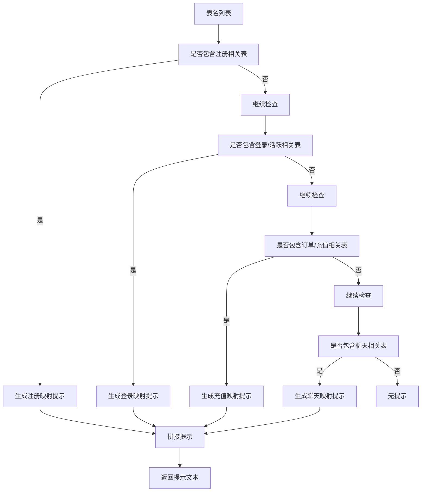
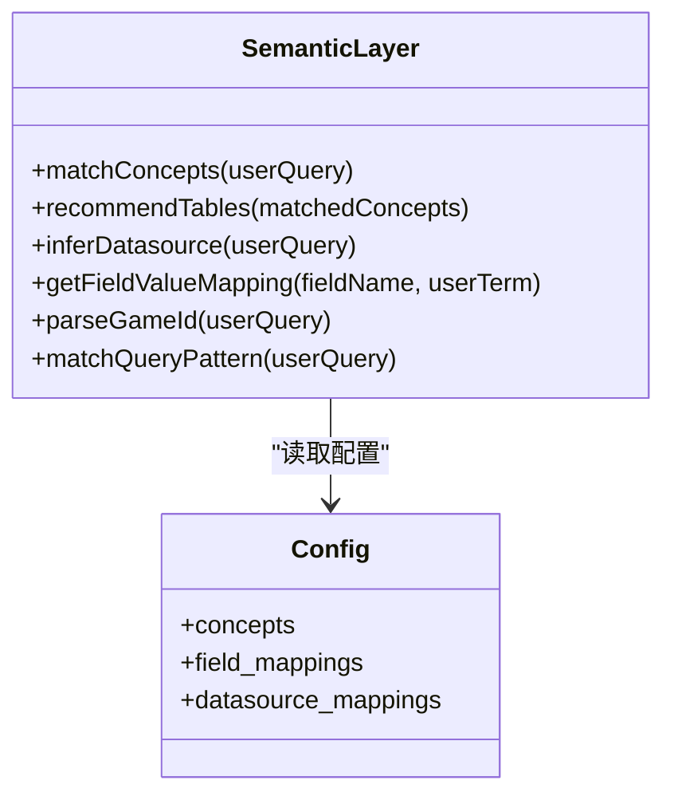
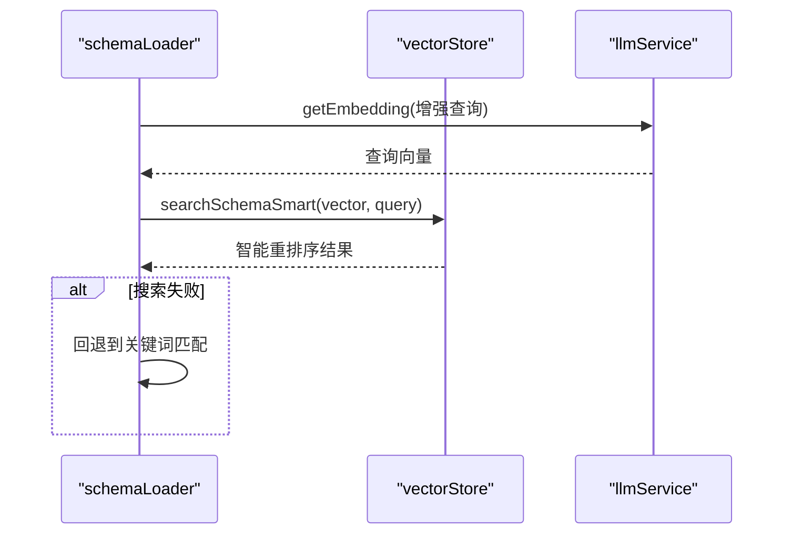
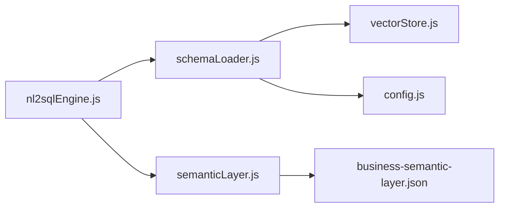

# 业务关键词映射

<cite>
**本文档引用的文件**
- [schemaLoader.js](file://backend/src/core/schemaLoader.js)
- [semanticLayer.js](file://backend/src/core/semanticLayer.js)
- [nl2sqlEngine.js](file://backend/src/core/nl2sqlEngine.js)
- [business-semantic-layer.json](file://backend/config/business-semantic-layer.json)
- [vectorStore.js](file://backend/src/memory/vectorStore.js)
- [schemaTools.js](file://backend/src/core/schemaTools.js)
- [config.js](file://backend/src/core/config.js)
</cite>

## 目录
1. [简介](#简介)
2. [项目结构](#项目结构)
3. [核心组件](#核心组件)
4. [架构总览](#架构总览)
5. [详细组件分析](#详细组件分析)
6. [依赖关系分析](#依赖关系分析)
7. [性能考量](#性能考量)
8. [故障排查指南](#故障排查指南)
9. [结论](#结论)
10. [附录](#附录)

## 简介
本文件面向NL2SQL引擎的“业务关键词映射”能力，系统性阐述如何建立业务术语与数据库表/字段之间的智能映射关系，涵盖以下要点：
- 业务关键词映射表的构建过程与动态更新机制
- 热更新支持与缓存策略
- 基于关键词的表推断算法（查询文本预处理、关键词匹配策略、表名推断逻辑）
- Schema映射提示的生成机制（业务规则提取、提示模板构建、上下文感知）
- 关键词映射配置示例、表推断算法的代码实现位置、性能优化策略
- 业务术语标准化与扩展的最佳实践

## 项目结构
围绕业务关键词映射功能，相关模块分布如下：
- 核心引擎：nl2sqlEngine.js 负责业务关键词映射的初始化、热更新与表推断
- Schema加载：schemaLoader.js 负责Schema元数据加载、关键词映射构建、表搜索与匹配
- 语义层：semanticLayer.js 负责业务概念匹配、数据源映射与表推荐
- 向量存储：vectorStore.js 提供语义搜索与智能重排序能力
- 配置：business-semantic-layer.json 定义业务概念、字段映射与数据源映射
- 工具层：schemaTools.js 提供LLM可调用的Schema探索工具

图表来源
- [nl2sqlEngine.js:69-120](file://backend/src/core/nl2sqlEngine.js#L69-L120)
- [schemaLoader.js:69-122](file://backend/src/core/schemaLoader.js#L69-L122)
- [semanticLayer.js:48-73](file://backend/src/core/semanticLayer.js#L48-L73)
- [vectorStore.js:233-263](file://backend/src/memory/vectorStore.js#L233-L263)
- [business-semantic-layer.json:1-189](file://backend/config/business-semantic-layer.json#L1-L189)
- [config.js:240-250](file://backend/src/core/config.js#L240-L250)

章节来源
- [nl2sqlEngine.js:69-120](file://backend/src/core/nl2sqlEngine.js#L69-L120)
- [schemaLoader.js:69-122](file://backend/src/core/schemaLoader.js#L69-L122)
- [semanticLayer.js:48-73](file://backend/src/core/semanticLayer.js#L48-L73)
- [vectorStore.js:233-263](file://backend/src/memory/vectorStore.js#L233-L263)
- [business-semantic-layer.json:1-189](file://backend/config/business-semantic-layer.json#L1-L189)
- [config.js:240-250](file://backend/src/core/config.js#L240-L250)

## 核心组件
- 业务关键词映射表构建与热更新
  - nl2sqlEngine.js 维护BUSINESS_KEYWORD_TABLE_MAP，提供初始化与热更新接口
  - schemaLoader.js 提供 getBusinessKeywordMappings 动态构建关键词映射
- 表推断算法
  - nl2sqlEngine.js inferTablesFromQuery 基于关键词匹配推断表
  - schemaLoader.js searchRelevantTables 支持语义搜索与关键词匹配双通道
- Schema映射提示生成
  - nl2sqlEngine.js generateSchemaMappingHints 基于表名生成业务映射提示
- 语义层与配置
  - semanticLayer.js 提供业务概念匹配、数据源映射与表推荐
  - business-semantic-layer.json 定义业务概念、字段映射与数据源映射
- 向量存储与智能搜索
  - vectorStore.js 提供语义搜索、智能重排序与缓存策略

章节来源
- [nl2sqlEngine.js:69-120](file://backend/src/core/nl2sqlEngine.js#L69-L120)
- [schemaLoader.js:975-1032](file://backend/src/core/schemaLoader.js#L975-L1032)
- [schemaLoader.js:562-709](file://backend/src/core/schemaLoader.js#L562-L709)
- [nl2sqlEngine.js:129-160](file://backend/src/core/nl2sqlEngine.js#L129-L160)
- [semanticLayer.js:48-73](file://backend/src/core/semanticLayer.js#L48-L73)
- [business-semantic-layer.json:1-189](file://backend/config/business-semantic-layer.json#L1-L189)
- [vectorStore.js:452-538](file://backend/src/memory/vectorStore.js#L452-L538)

## 架构总览
业务关键词映射贯穿“查询输入—关键词匹配—表推断—Schema提示—SQL生成”的链路，核心交互如下：

图表来源
- [nl2sqlEngine.js:75-120](file://backend/src/core/nl2sqlEngine.js#L75-L120)
- [schemaLoader.js:562-652](file://backend/src/core/schemaLoader.js#L562-L652)
- [semanticLayer.js:134-306](file://backend/src/core/semanticLayer.js#L134-L306)
- [vectorStore.js:452-538](file://backend/src/memory/vectorStore.js#L452-L538)
- [business-semantic-layer.json:1-189](file://backend/config/business-semantic-layer.json#L1-L189)

## 详细组件分析

### 业务关键词映射表构建与热更新
- 构建过程
  - schemaLoader.js 的 getBusinessKeywordMappings 从表名、中文名、描述与字段信息中抽取关键词，形成“关键词→表名集合”的映射
  - 同义词自动扩展：同一关键词模式下的其他同义词也会指向相同表集合
- 热更新机制
  - nl2sqlEngine.js 维护全局映射表 BUSINESS_KEYWORD_TABLE_MAP
  - getBusinessKeywordMap 在映射为空时触发 initializeBusinessKeywordMap，后者调用 schemaLoader.getBusinessKeywordMappings
  - 通过懒加载与按需初始化，实现热更新支持
- 性能与缓存
  - 采用懒加载策略，避免启动时的重复计算
  - schemaLoader 内部提供缓存检查与重新加载能力（isCacheExpired/reload）

图表来源
- [nl2sqlEngine.js:75-97](file://backend/src/core/nl2sqlEngine.js#L75-L97)
- [schemaLoader.js:975-1032](file://backend/src/core/schemaLoader.js#L975-L1032)

章节来源
- [nl2sqlEngine.js:75-97](file://backend/src/core/nl2sqlEngine.js#L75-L97)
- [schemaLoader.js:975-1032](file://backend/src/core/schemaLoader.js#L975-L1032)

### 表推断算法
- 查询文本预处理
  - nl2sqlEngine.js inferTablesFromQuery 将查询转为小写，使用 getBusinessKeywordMap 获取映射
- 关键词匹配策略
  - 基于关键词包含关系匹配，命中即加入候选集
  - 同义词扩展：同一关键词模式下的其他同义词也会触发匹配
- 表名推断逻辑
  - 合并三类来源：
    - 语义搜索：schemaLoader.searchRelevantTables
    - 业务关键词：inferTablesFromQuery
    - 语义层：semanticLayer.matchConcepts/recommendTables
  - 去重与截断：限制最大表数量，避免Prompt过大
- 上下文增强
  - searchRelevantTables 支持传入上下文（如gameId、datasource），增强查询文本并优先匹配对应数据源或平台

图表来源
- [nl2sqlEngine.js:104-120](file://backend/src/core/nl2sqlEngine.js#L104-L120)
- [schemaLoader.js:562-652](file://backend/src/core/schemaLoader.js#L562-L652)
- [semanticLayer.js:134-306](file://backend/src/core/semanticLayer.js#L134-L306)

章节来源
- [nl2sqlEngine.js:104-120](file://backend/src/core/nl2sqlEngine.js#L104-L120)
- [schemaLoader.js:562-652](file://backend/src/core/schemaLoader.js#L562-L652)
- [semanticLayer.js:134-306](file://backend/src/core/semanticLayer.js#L134-L306)

### Schema映射提示生成
- 生成逻辑
  - nl2sqlEngine.js generateSchemaMappingHints 根据表名列表生成业务术语到表/字段的映射提示
  - 针对注册、登录、充值、聊天等典型场景生成示例映射
- 上下文感知
  - 与表推断结合：在获取表候选后生成针对性提示，提升LLM对字段选择的准确性
- 与工具层协同
  - schemaTools.js 提供 describe_table/peek_table 等工具，支持按需获取表结构细节，进一步细化提示

图表来源
- [nl2sqlEngine.js:129-160](file://backend/src/core/nl2sqlEngine.js#L129-L160)
- [schemaTools.js:266-306](file://backend/src/core/schemaTools.js#L266-L306)

章节来源
- [nl2sqlEngine.js:129-160](file://backend/src/core/nl2sqlEngine.js#L129-L160)
- [schemaTools.js:266-306](file://backend/src/core/schemaTools.js#L266-L306)

### 语义层与配置
- 业务概念匹配
  - semanticLayer.js matchConcepts 支持精确匹配、别名匹配与模糊匹配，返回匹配概念及其置信度
- 数据源映射与表推荐
  - getDatasourceMapping/inferDatasource 基于概念映射推断数据源
  - recommendTables 将匹配到的概念映射到表，综合优先级与分数排序
- 配置驱动
  - business-semantic-layer.json 定义 concepts、field_mappings、datasource_mappings 等，支撑上述能力

图表来源
- [semanticLayer.js:134-386](file://backend/src/core/semanticLayer.js#L134-L386)
- [business-semantic-layer.json:1-189](file://backend/config/business-semantic-layer.json#L1-L189)

章节来源
- [semanticLayer.js:134-386](file://backend/src/core/semanticLayer.js#L134-L386)
- [business-semantic-layer.json:1-189](file://backend/config/business-semantic-layer.json#L1-L189)

### 向量存储与智能搜索
- 语义搜索
  - schemaLoader.js vectorizeSchema 将表级表征向量化并存储，支持增量更新
  - searchRelevantTables 在向量存储可用时，使用 llmService.getEmbedding 获取查询向量，调用 vectorStore.searchSchemaSmart
- 智能重排序
  - vectorStore.js searchSchemaSmart 根据查询意图识别（是否提及具体游戏）进行策略性重排序：
    - 提及游戏：优先对应游戏表
    - 未提及游戏：优先平台通用表
    - 原始日志表优先于聚合报表
- 缓存与回退
  - 语义搜索失败时回退到关键词匹配，保证鲁棒性

图表来源
- [schemaLoader.js:586-652](file://backend/src/core/schemaLoader.js#L586-L652)
- [vectorStore.js:452-538](file://backend/src/memory/vectorStore.js#L452-L538)

章节来源
- [schemaLoader.js:586-652](file://backend/src/core/schemaLoader.js#L586-L652)
- [vectorStore.js:452-538](file://backend/src/memory/vectorStore.js#L452-L538)

## 依赖关系分析
- 模块耦合
  - nl2sqlEngine 依赖 schemaLoader（关键词映射与表搜索）、semanticLayer（概念匹配与表推荐）
  - schemaLoader 依赖 vectorStore（语义搜索）、config（缓存与重向量化开关）
  - semanticLayer 依赖 business-semantic-layer.json（配置）
- 外部依赖
  - 向量存储基于 LanceDB（vectordb），提供高效语义检索
  - LLM服务用于Embedding生成与提示工程

图表来源
- [nl2sqlEngine.js:69-120](file://backend/src/core/nl2sqlEngine.js#L69-L120)
- [schemaLoader.js:69-122](file://backend/src/core/schemaLoader.js#L69-L122)
- [semanticLayer.js:48-73](file://backend/src/core/semanticLayer.js#L48-L73)
- [vectorStore.js:233-263](file://backend/src/memory/vectorStore.js#L233-L263)
- [business-semantic-layer.json:1-189](file://backend/config/business-semantic-layer.json#L1-L189)
- [config.js:240-250](file://backend/src/core/config.js#L240-L250)

章节来源
- [nl2sqlEngine.js:69-120](file://backend/src/core/nl2sqlEngine.js#L69-L120)
- [schemaLoader.js:69-122](file://backend/src/core/schemaLoader.js#L69-L122)
- [semanticLayer.js:48-73](file://backend/src/core/semanticLayer.js#L48-L73)
- [vectorStore.js:233-263](file://backend/src/memory/vectorStore.js#L233-L263)
- [business-semantic-layer.json:1-189](file://backend/config/business-semantic-layer.json#L1-L189)
- [config.js:240-250](file://backend/src/core/config.js#L240-L250)

## 性能考量
- 懒加载与缓存
  - 业务关键词映射按需初始化，避免启动时的重复计算
  - schemaLoader 提供 isCacheExpired/reload，支持缓存失效与重新加载
- 语义搜索优化
  - 向量存储支持增量更新与智能重排序，减少无关表干扰
  - 语义搜索失败时回退关键词匹配，保证稳定性
- Prompt控制
  - 限制表候选数量与使用精简版Schema输出，降低Token消耗
- 配置开关
  - SCHEMA_REVECTORIZE 控制是否强制重新向量化，平衡准确性与成本

章节来源
- [nl2sqlEngine.js:75-97](file://backend/src/core/nl2sqlEngine.js#L75-L97)
- [schemaLoader.js:948-967](file://backend/src/core/schemaLoader.js#L948-L967)
- [schemaLoader.js:586-652](file://backend/src/core/schemaLoader.js#L586-L652)
- [vectorStore.js:452-538](file://backend/src/memory/vectorStore.js#L452-L538)
- [config.js:247-249](file://backend/src/core/config.js#L247-L249)

## 故障排查指南
- 业务关键词映射为空
  - 检查 schemaLoader.getBusinessKeywordMappings 是否正常返回
  - 确认 schemaLoader.load 是否成功加载配置文件
- 语义搜索异常
  - 检查 vectorStore 初始化状态与表是否存在
  - 若 searchSchemaSmart 失败，系统会回退到关键词匹配
- 表推断结果不准确
  - 检查 business-semantic-layer.json 中 concepts/field_mappings 配置是否覆盖目标业务场景
  - 确认 inferTablesFromQuery 的关键词是否与表描述一致
- 性能问题
  - 启用缓存（enableCache）并合理设置 cacheExpireTime
  - 调整 topK 与表候选上限，避免Prompt过大

章节来源
- [schemaLoader.js:69-122](file://backend/src/core/schemaLoader.js#L69-L122)
- [vectorStore.js:233-263](file://backend/src/memory/vectorStore.js#L233-L263)
- [semanticLayer.js:48-73](file://backend/src/core/semanticLayer.js#L48-L73)
- [config.js:240-250](file://backend/src/core/config.js#L240-L250)

## 结论
业务关键词映射通过“动态构建—热更新—多通道表推断—智能提示”的闭环，实现了业务术语与数据库结构的高效对齐。结合语义层与向量存储，系统在准确性与性能间取得平衡，适合在多业务场景下持续演进与扩展。

## 附录

### 关键词映射配置示例
- concepts：定义业务概念、别名、映射与优先级
- field_mappings：定义字段值映射（如游戏ID、平台类型）
- datasource_mappings：定义数据源标识与表前缀

章节来源
- [business-semantic-layer.json:1-189](file://backend/config/business-semantic-layer.json#L1-L189)

### 表推断算法代码实现位置
- 业务关键词映射初始化与热更新：[nl2sqlEngine.js:75-97](file://backend/src/core/nl2sqlEngine.js#L75-L97)
- 表推断（关键词匹配）：[nl2sqlEngine.js:104-120](file://backend/src/core/nl2sqlEngine.js#L104-L120)
- 语义搜索与关键词混合：[schemaLoader.js:562-652](file://backend/src/core/schemaLoader.js#L562-L652)
- 向量智能重排序：[vectorStore.js:452-538](file://backend/src/memory/vectorStore.js#L452-L538)

### 性能优化策略清单
- 启用缓存与合理设置过期时间
- 限制表候选数量与Prompt长度
- 使用智能重排序减少无关表干扰
- 配置开关控制向量化策略

章节来源
- [config.js:240-250](file://backend/src/core/config.js#L240-L250)
- [schemaLoader.js:948-967](file://backend/src/core/schemaLoader.js#L948-L967)
- [vectorStore.js:452-538](file://backend/src/memory/vectorStore.js#L452-L538)