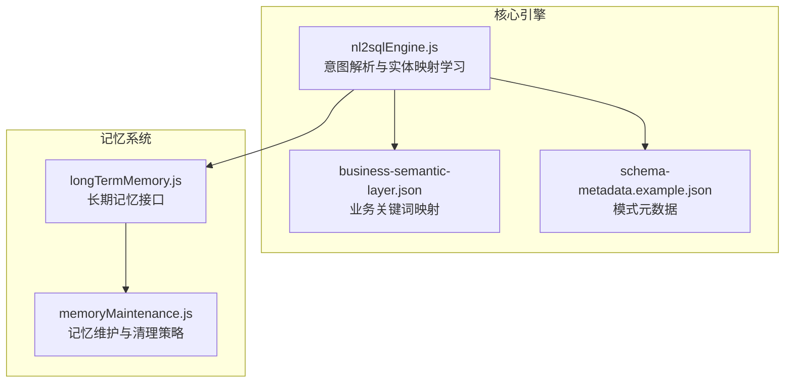
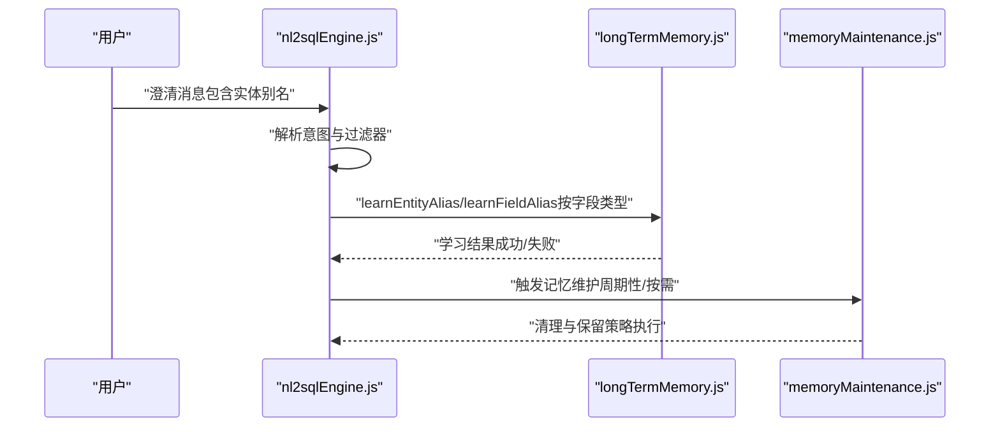
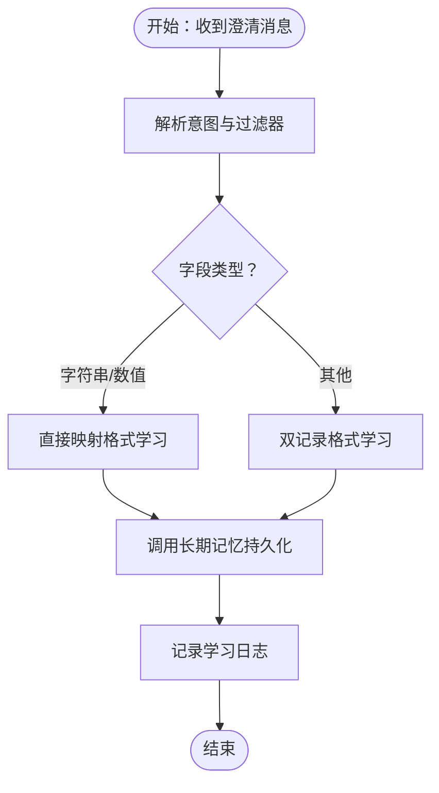
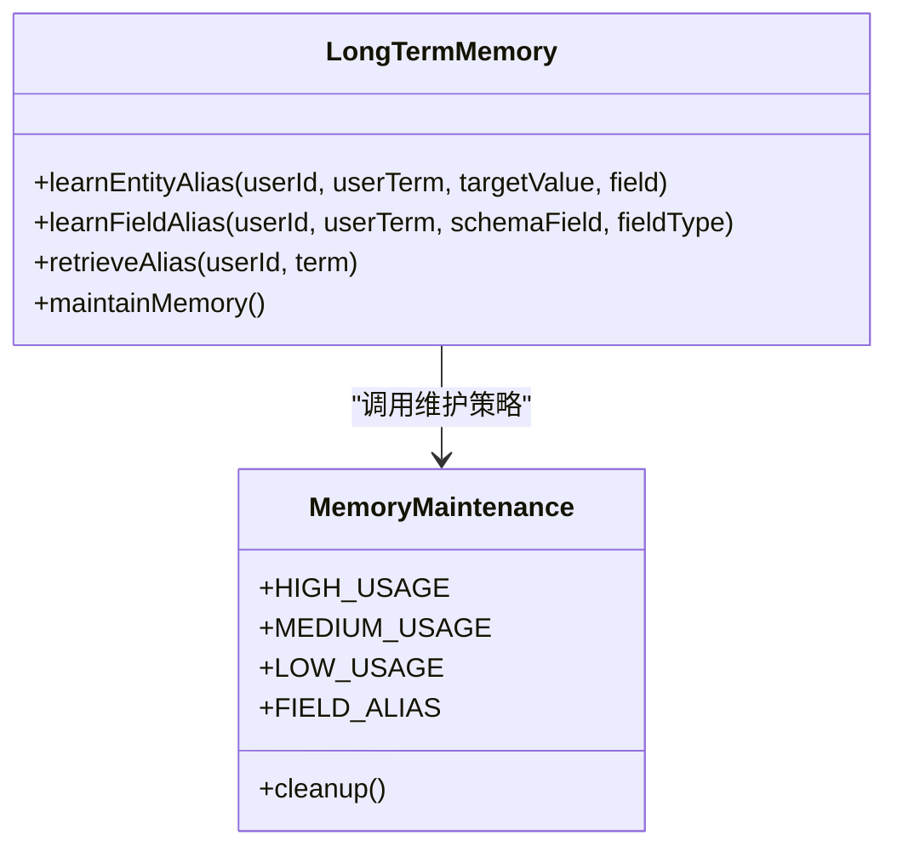
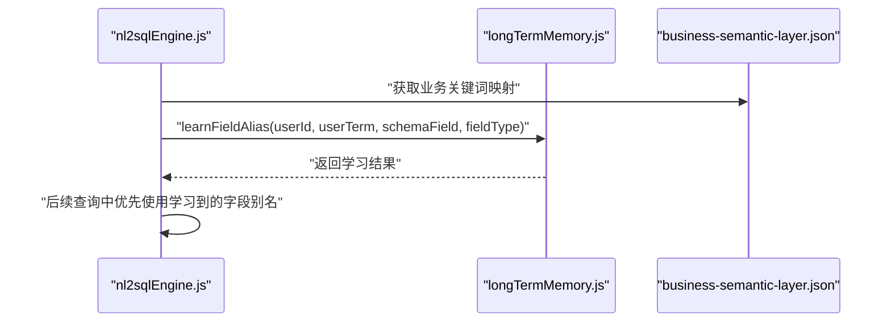
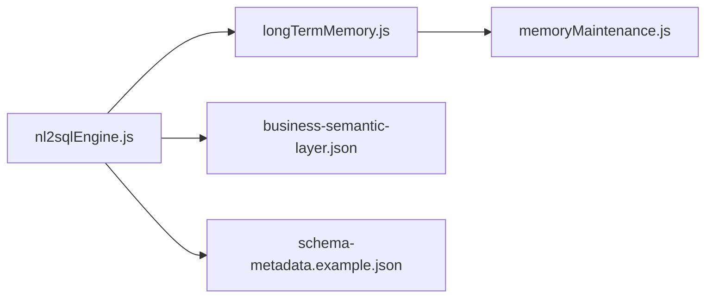

# 别名学习与映射

<cite>
**本文引用的文件**
- [nl2sqlEngine.js](file://backend/src/core/nl2sqlEngine.js)
- [longTermMemory.js](file://backend/src/memory/longTermMemory.js)
- [memoryMaintenance.js](file://backend/src/memory/memoryMaintenance.js)
- [business-semantic-layer.json](file://backend/config/business-semantic-layer.json)
- [schema-metadata.example.json](file://backend/config/schema-metadata.example.json)
</cite>

## 目录
1. [简介](#简介)
2. [项目结构](#项目结构)
3. [核心组件](#核心组件)
4. [架构总览](#架构总览)
5. [详细组件分析](#详细组件分析)
6. [依赖关系分析](#依赖关系分析)
7. [性能考虑](#性能考虑)
8. [故障排查指南](#故障排查指南)
9. [结论](#结论)
10. [附录](#附录)

## 简介
本文件围绕“别名学习与映射”能力进行系统化说明，重点阐述以下内容：
- 用户在澄清对话中提供的实体别名如何被学习并持久化
- 两种存储格式的差异与适用场景：双记录格式（青木 -> game_id, 青木_value -> 30）与直接映射格式（青木 -> 30）
- 长期记忆系统如何存储与检索用户学习的实体映射
- 数据库层面的字段别名学习机制
- 提供使用示例与最佳实践，帮助开发者有效利用用户学习的实体映射提升查询准确性

## 项目结构
后端采用分层架构，核心与记忆模块如下：
- 核心引擎：负责意图解析、实体映射学习、业务关键词映射等
- 记忆模块：负责长期记忆的写入、检索与维护
- 配置层：提供业务语义层与模式元数据配置

**图表来源**
- [nl2sqlEngine.js](file://backend/src/core/nl2sqlEngine.js)
- [longTermMemory.js](file://backend/src/memory/longTermMemory.js)
- [memoryMaintenance.js](file://backend/src/memory/memoryMaintenance.js)
- [business-semantic-layer.json](file://backend/config/business-semantic-layer.json)
- [schema-metadata.example.json](file://backend/config/schema-metadata.example.json)

**章节来源**
- [nl2sqlEngine.js](file://backend/src/core/nl2sqlEngine.js)
- [longTermMemory.js](file://backend/src/memory/longTermMemory.js)
- [memoryMaintenance.js](file://backend/src/memory/memoryMaintenance.js)
- [business-semantic-layer.json](file://backend/config/business-semantic-layer.json)
- [schema-metadata.example.json](file://backend/config/schema-metadata.example.json)

## 核心组件
- 别名学习入口：learnEntityAliasFromContext 函数，接收用户查询、意图与最后一条助手消息，从澄清中抽取实体别名并调用长期记忆进行学习
- 长期记忆接口：longTermMemory.js 提供 learnEntityAlias、learnFieldAlias 等方法，用于持久化用户学习的实体与字段别名
- 记忆维护策略：memoryMaintenance.js 定义不同偏好类型的保留策略（高频、中频、低频、字段别名），确保长期记忆的高效与整洁
- 业务关键词映射：business-semantic-layer.json 提供业务关键词到表的映射，辅助实体识别与过滤

**章节来源**
- [nl2sqlEngine.js](file://backend/src/core/nl2sqlEngine.js)
- [longTermMemory.js](file://backend/src/memory/longTermMemory.js)
- [memoryMaintenance.js](file://backend/src/memory/memoryMaintenance.js)
- [business-semantic-layer.json](file://backend/config/business-semantic-layer.json)

## 架构总览
下图展示了从用户澄清到别名学习与存储的关键流程：

**图表来源**
- [nl2sqlEngine.js](file://backend/src/core/nl2sqlEngine.js)
- [longTermMemory.js](file://backend/src/memory/longTermMemory.js)
- [memoryMaintenance.js](file://backend/src/memory/memoryMaintenance.js)

## 详细组件分析

### 组件A：别名学习入口与流程
- 入口函数：learnEntityAliasFromContext
- 功能要点：
  - 从澄清消息中提取用户提供的实体别名
  - 对不同字段类型采取差异化学习策略：直接映射格式或双记录格式
  - 调用长期记忆接口进行持久化
  - 记录学习日志，便于问题定位与审计

**图表来源**
- [nl2sqlEngine.js](file://backend/src/core/nl2sqlEngine.js)

**章节来源**
- [nl2sqlEngine.js](file://backend/src/core/nl2sqlEngine.js)

### 组件B：长期记忆接口与存储格式
- 接口职责：
  - learnEntityAlias：学习实体别名（如“青木” -> “game_id”）
  - learnFieldAlias：学习字段别名（如“青木_value” -> 30）
- 存储格式对比：
  - 双记录格式：将实体与值拆分为两个字段（game_id、game_id_value），适合需要同时记录实体标识与对应值的场景
  - 直接映射格式：直接建立实体到值的映射，简洁直观，适合单一值映射
- 选择建议：
  - 当需要区分“实体标识字段”和“实体值字段”时使用双记录格式
  - 当仅需记录实体到值的直接映射时使用直接映射格式

**图表来源**
- [longTermMemory.js](file://backend/src/memory/longTermMemory.js)
- [memoryMaintenance.js](file://backend/src/memory/memoryMaintenance.js)

**章节来源**
- [longTermMemory.js](file://backend/src/memory/longTermMemory.js)
- [memoryMaintenance.js](file://backend/src/memory/memoryMaintenance.js)

### 组件C：数据库层面的字段别名学习机制
- 字段别名学习：针对非实体类字段（如数值、日期等）进行别名学习，统一用户口语化表达与标准字段名
- 学习触发点：当过滤器中的字段类型为非实体类型时，走通用字段别名学习路径
- 存储策略：结合长期记忆与业务关键词映射，实现跨会话一致的字段别名识别

**图表来源**
- [nl2sqlEngine.js](file://backend/src/core/nl2sqlEngine.js)
- [longTermMemory.js](file://backend/src/memory/longTermMemory.js)
- [business-semantic-layer.json](file://backend/config/business-semantic-layer.json)

**章节来源**
- [nl2sqlEngine.js](file://backend/src/core/nl2sqlEngine.js)
- [longTermMemory.js](file://backend/src/memory/longTermMemory.js)
- [business-semantic-layer.json](file://backend/config/business-semantic-layer.json)

## 依赖关系分析
- nl2sqlEngine.js 依赖：
  - 配置层：business-semantic-layer.json 提供业务关键词映射
  - 记忆层：longTermMemory.js 提供学习与检索能力
  - 维护层：memoryMaintenance.js 提供清理与保留策略
- 配置层与模式元数据：
  - schema-metadata.example.json 作为模式元数据示例，指导字段类型识别与映射

**图表来源**
- [nl2sqlEngine.js](file://backend/src/core/nl2sqlEngine.js)
- [longTermMemory.js](file://backend/src/memory/longTermMemory.js)
- [memoryMaintenance.js](file://backend/src/memory/memoryMaintenance.js)
- [business-semantic-layer.json](file://backend/config/business-semantic-layer.json)
- [schema-metadata.example.json](file://backend/config/schema-metadata.example.json)

**章节来源**
- [nl2sqlEngine.js](file://backend/src/core/nl2sqlEngine.js)
- [longTermMemory.js](file://backend/src/memory/longTermMemory.js)
- [memoryMaintenance.js](file://backend/src/memory/memoryMaintenance.js)
- [business-semantic-layer.json](file://backend/config/business-semantic-layer.json)
- [schema-metadata.example.json](file://backend/config/schema-metadata.example.json)

## 性能考虑
- 学习频率控制：通过记忆维护策略对高频、中频、低频与字段别名设置不同的保留期限，避免长期记忆膨胀
- 批量学习：在澄清阶段集中处理多个别名，减少重复学习开销
- 缓存命中：优先使用已学习的别名，减少重复解析与映射成本

## 故障排查指南
- 学习失败日志：关注 learnEntityAliasFromContext 的错误日志，定位学习失败原因（如字段类型不匹配、用户术语为空等）
- 记忆清理影响：若发现别名失效，检查 memoryMaintenance 的清理策略是否过短或误删
- 配置缺失：确认 business-semantic-layer.json 是否正确加载，避免业务关键词映射缺失导致实体识别不准

**章节来源**
- [nl2sqlEngine.js](file://backend/src/core/nl2sqlEngine.js)
- [memoryMaintenance.js](file://backend/src/memory/memoryMaintenance.js)

## 结论
通过将用户在澄清中的实体别名学习纳入长期记忆，并结合双记录与直接映射两种存储格式，系统能够更准确地理解用户表达，提升后续查询的准确性。配合记忆维护策略与配置层的业务关键词映射，可实现稳定、可扩展的别名学习与映射体系。

## 附录

### 使用示例与最佳实践
- 示例场景
  - 用户说“青木的分数是30”，系统应学习“青木_value -> 30”
  - 用户说“青木的游戏ID是123”，系统应学习“青木 -> game_id”
- 最佳实践
  - 明确字段类型：字符串/数值字段优先使用直接映射；需要区分实体标识与值时使用双记录格式
  - 合理命名：用户术语尽量简洁明确，避免歧义
  - 定期维护：根据业务场景调整记忆保留策略，平衡准确性与性能