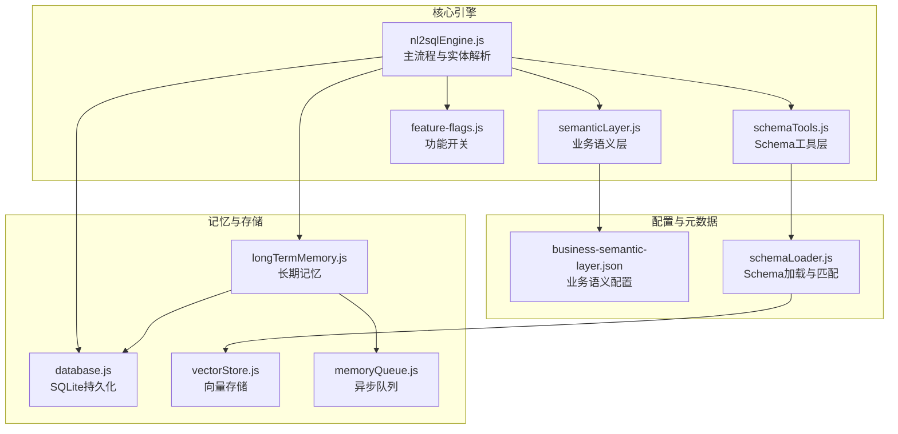
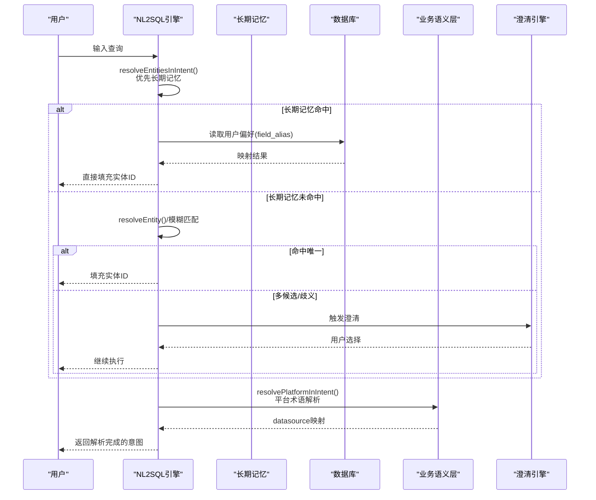
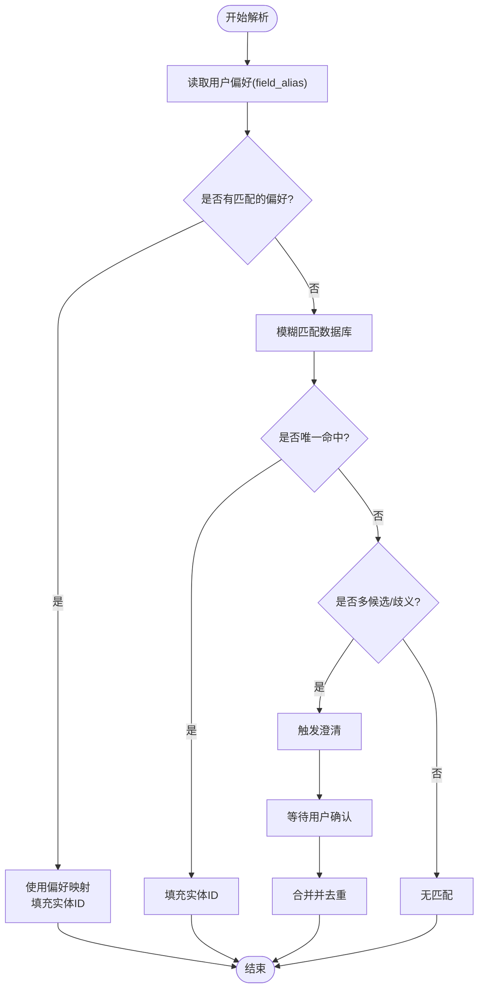
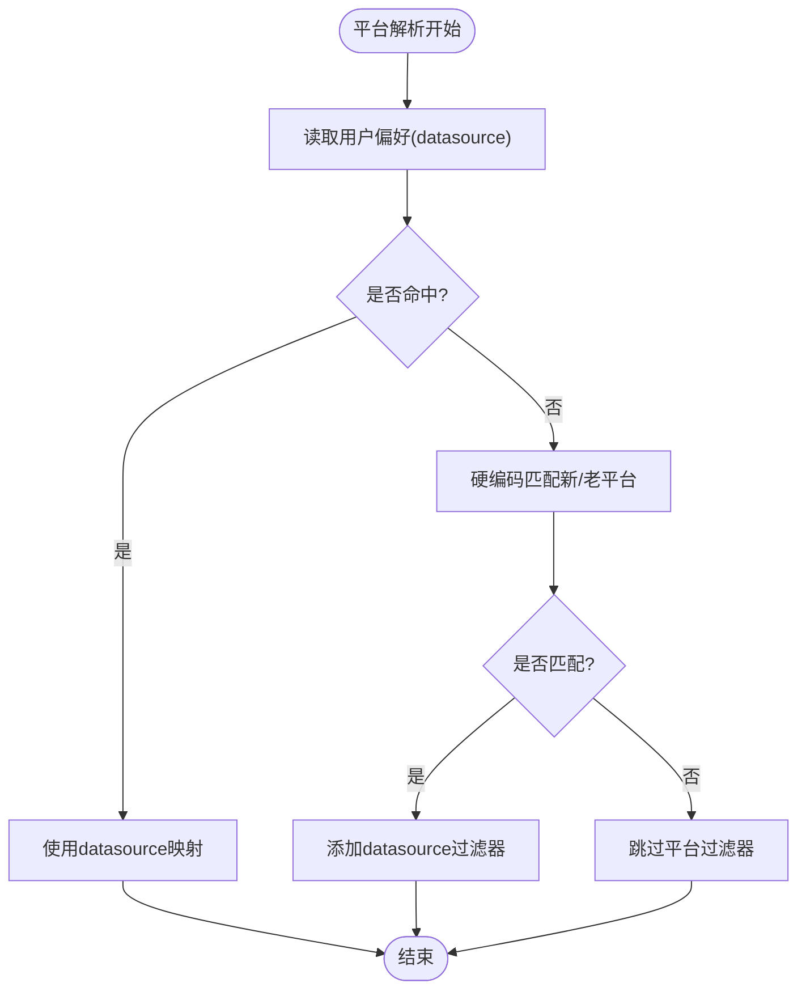
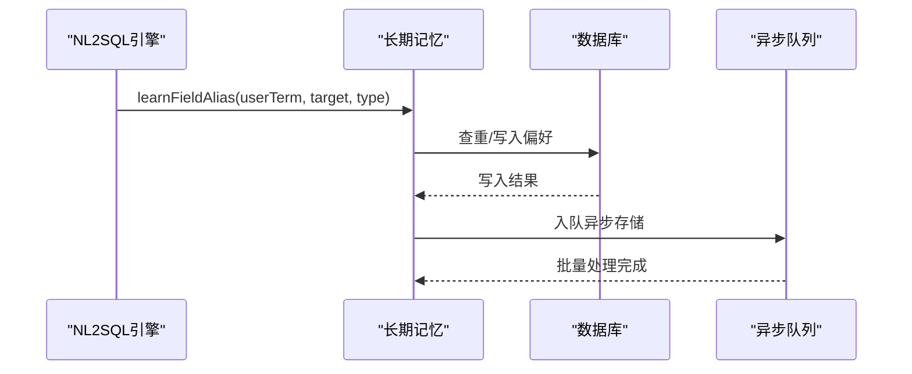
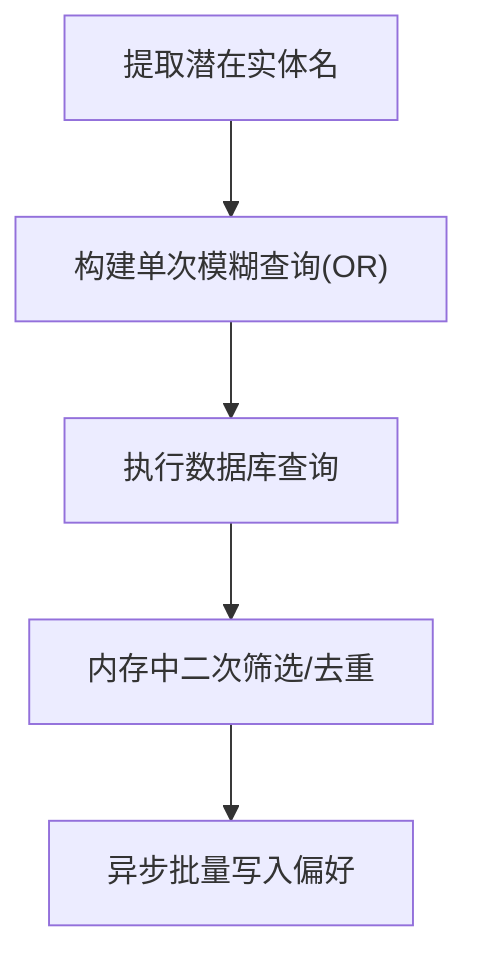
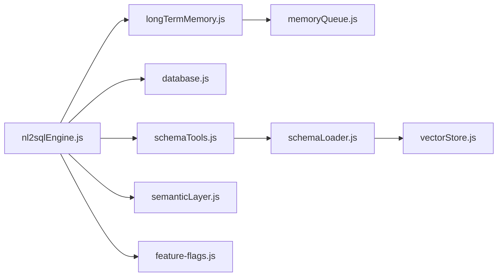

# 实体解析与映射

<cite>
**本文引用的文件**
- [nl2sqlEngine.js](file://backend/src/core/nl2sqlEngine.js)
- [longTermMemory.js](file://backend/src/memory/longTermMemory.js)
- [database.js](file://backend/src/core/database.js)
- [business-semantic-layer.json](file://backend/config/business-semantic-layer.json)
- [schemaTools.js](file://backend/src/core/schemaTools.js)
- [semanticLayer.js](file://backend/src/core/semanticLayer.js)
- [vectorStore.js](file://backend/src/memory/vectorStore.js)
- [schemaLoader.js](file://backend/src/core/schemaLoader.js)
- [feature-flags.js](file://backend/config/feature-flags.js)
- [memoryQueue.js](file://backend/src/memory/memoryQueue.js)
</cite>

## 目录
1. [简介](#简介)
2. [项目结构](#项目结构)
3. [核心组件](#核心组件)
4. [架构总览](#架构总览)
5. [详细组件分析](#详细组件分析)
6. [依赖关系分析](#依赖关系分析)
7. [性能考量](#性能考量)
8. [故障排查指南](#故障排查指南)
9. [结论](#结论)
10. [附录](#附录)

## 简介
本文件面向NL2SQL引擎的实体解析与映射能力，系统性阐述如何将模糊的业务实体（如游戏名称、渠道名称、平台术语）解析为数据库中的具体ID值。文档重点覆盖以下方面：
- 多层次解析策略：优先长期记忆中的用户学习映射，其次数据库模糊匹配，最后歧义处理与澄清机制
- 平台术语解析的特殊处理：对“新平台/老平台”的识别与映射
- 实体别名学习机制：用户在澄清过程中提供的映射关系会被学习并持久化
- 用户自定义映射的存储与检索：基于SQLite的用户偏好表
- 性能优化的批量查询策略：单次查询合并多条件、内存中匹配候选、异步存储等
- 使用模式与代码示例路径：帮助开发者快速理解端到端流程

## 项目结构
NL2SQL引擎围绕“意图识别—实体解析—SQL生成—结果格式化”主线组织，实体解析位于核心流程中间层，向上承接意图识别，向下驱动SQL生成。

**图表来源**
- [nl2sqlEngine.js:1-2652](file://backend/src/core/nl2sqlEngine.js#L1-L2652)
- [longTermMemory.js:1-1127](file://backend/src/memory/longTermMemory.js#L1-L1127)
- [database.js:1-859](file://backend/src/core/database.js#L1-L859)
- [schemaTools.js:1-632](file://backend/src/core/schemaTools.js#L1-L632)
- [semanticLayer.js:1-532](file://backend/src/core/semanticLayer.js#L1-L532)
- [vectorStore.js:1-881](file://backend/src/memory/vectorStore.js#L1-L881)
- [schemaLoader.js:1-1172](file://backend/src/core/schemaLoader.js#L1-L1172)
- [business-semantic-layer.json:1-189](file://backend/config/business-semantic-layer.json#L1-L189)
- [feature-flags.js:1-249](file://backend/config/feature-flags.js#L1-L249)
- [memoryQueue.js:1-217](file://backend/src/memory/memoryQueue.js#L1-L217)

**章节来源**
- [nl2sqlEngine.js:1-2652](file://backend/src/core/nl2sqlEngine.js#L1-L2652)
- [longTermMemory.js:1-1127](file://backend/src/memory/longTermMemory.js#L1-L1127)
- [database.js:1-859](file://backend/src/core/database.js#L1-L859)
- [schemaTools.js:1-632](file://backend/src/core/schemaTools.js#L1-L632)
- [semanticLayer.js:1-532](file://backend/src/core/semanticLayer.js#L1-L532)
- [vectorStore.js:1-881](file://backend/src/memory/vectorStore.js#L1-L881)
- [schemaLoader.js:1-1172](file://backend/src/core/schemaLoader.js#L1-L1172)
- [business-semantic-layer.json:1-189](file://backend/config/business-semantic-layer.json#L1-L189)
- [feature-flags.js:1-249](file://backend/config/feature-flags.js#L1-L249)
- [memoryQueue.js:1-217](file://backend/src/memory/memoryQueue.js#L1-L217)

## 核心组件
- 实体解析器（resolveEntitiesInIntent/resolvePlatformInIntent/resolveEntity）：负责将用户输入中的实体映射为数据库ID，并在需要时触发澄清
- 长期记忆（learnFieldAlias/extractAndStorePreferences）：学习并存储用户自定义映射，支持游戏ID、渠道ID、平台术语等
- 数据库适配层（getFieldAliases/addUserPreference）：提供用户偏好表的读写接口
- 业务语义层（semanticLayer.js）：提供“新平台/老平台”等业务概念的映射
- 向量存储（vectorStore.js）：支撑Schema向量化与智能搜索，间接提升实体解析的召回质量
- 功能开关（feature-flags.js）：控制是否启用语义层、澄清机制等

**章节来源**
- [nl2sqlEngine.js:244-693](file://backend/src/core/nl2sqlEngine.js#L244-L693)
- [longTermMemory.js:748-800](file://backend/src/memory/longTermMemory.js#L748-L800)
- [database.js:699-724](file://backend/src/core/database.js#L699-L724)
- [semanticLayer.js:1-532](file://backend/src/core/semanticLayer.js#L1-L532)
- [vectorStore.js:1-881](file://backend/src/memory/vectorStore.js#L1-L881)
- [feature-flags.js:1-249](file://backend/config/feature-flags.js#L1-L249)

## 架构总览
实体解析的端到端流程如下：

**图表来源**
- [nl2sqlEngine.js:393-572](file://backend/src/core/nl2sqlEngine.js#L393-L572)
- [nl2sqlEngine.js:621-693](file://backend/src/core/nl2sqlEngine.js#L621-L693)
- [longTermMemory.js:758-800](file://backend/src/memory/longTermMemory.js#L758-L800)
- [database.js:704-724](file://backend/src/core/database.js#L704-L724)
- [semanticLayer.js:367-386](file://backend/src/core/semanticLayer.js#L367-L386)

## 详细组件分析

### 实体解析器：resolveEntitiesInIntent
- 优先策略：从用户偏好表读取field_alias映射，支持游戏ID、渠道ID等
- 回退策略：若无偏好映射，则对查询中的潜在实体名进行数据库模糊匹配
- 多候选处理：当出现歧义时，向澄清引擎提交澄清问题，等待用户确认
- 去重与合并：避免重复添加同一实体ID

**图表来源**
- [nl2sqlEngine.js:393-572](file://backend/src/core/nl2sqlEngine.js#L393-L572)

**章节来源**
- [nl2sqlEngine.js:393-572](file://backend/src/core/nl2sqlEngine.js#L393-L572)

### 平台术语解析：resolvePlatformInIntent
- 优先：从用户偏好表读取datasource映射
- 回退：硬编码识别“新平台/老平台”到具体datasource值
- 作用：将用户口语化的平台术语标准化为数据库标识

**图表来源**
- [nl2sqlEngine.js:621-693](file://backend/src/core/nl2sqlEngine.js#L621-L693)

**章节来源**
- [nl2sqlEngine.js:621-693](file://backend/src/core/nl2sqlEngine.js#L621-L693)

### 实体别名学习机制：learnFieldAlias
- 触发时机：在澄清对话中，用户明确给出“X是Y”、“X对应Z”等映射
- 存储内容：用户术语、目标字段/值、字段类型（如game/channel/datasource）
- 冲突处理：若已有映射但不一致，记录告警
- 异步存储：通过memoryQueue批量异步写入，避免阻塞

**图表来源**
- [longTermMemory.js:758-800](file://backend/src/memory/longTermMemory.js#L758-L800)
- [database.js:618-627](file://backend/src/core/database.js#L618-L627)
- [memoryQueue.js:46-118](file://backend/src/memory/memoryQueue.js#L46-L118)

**章节来源**
- [longTermMemory.js:758-800](file://backend/src/memory/longTermMemory.js#L758-L800)
- [database.js:618-627](file://backend/src/core/database.js#L618-L627)
- [memoryQueue.js:46-118](file://backend/src/memory/memoryQueue.js#L46-L118)

### 用户自定义映射的存储与检索
- 存储：偏好类型为field_alias，内容包含user_term、schema_field、field_type、confidence等
- 检索：按用户ID查询，支持按字段名过滤
- 使用：在实体解析阶段直接命中，减少数据库模糊匹配压力

**章节来源**
- [database.js:699-724](file://backend/src/core/database.js#L699-L724)
- [longTermMemory.js:758-800](file://backend/src/memory/longTermMemory.js#L758-L800)

### 性能优化的批量查询策略
- 单次模糊匹配：将多个潜在实体名拼接为单条SQL的OR条件，减少多次往返
- 内存匹配：在内存中对候选集进行二次筛选与去重，避免多次数据库查询
- 异步存储：对偏好写入采用队列批量处理，降低写入延迟

**图表来源**
- [nl2sqlEngine.js:461-542](file://backend/src/core/nl2sqlEngine.js#L461-L542)
- [memoryQueue.js:72-118](file://backend/src/memory/memoryQueue.js#L72-L118)

**章节来源**
- [nl2sqlEngine.js:461-542](file://backend/src/core/nl2sqlEngine.js#L461-L542)
- [memoryQueue.js:72-118](file://backend/src/memory/memoryQueue.js#L72-L118)

### 业务语义层与平台映射
- 业务语义层配置：集中定义“新平台/老平台”等概念与其映射关系
- 语义层模块：提供概念匹配、表推荐、数据源推断等功能
- 与引擎集成：在平台解析阶段优先使用语义层映射，提升准确性

**章节来源**
- [business-semantic-layer.json:1-189](file://backend/config/business-semantic-layer.json#L1-L189)
- [semanticLayer.js:1-532](file://backend/src/core/semanticLayer.js#L1-L532)

## 依赖关系分析
- nl2sqlEngine依赖：
  - longTermMemory：学习与读取用户偏好
  - database：读写用户偏好表
  - schemaTools/semanticLayer：业务概念与平台映射
  - feature-flags：控制是否启用语义层/澄清等
- memoryQueue为异步存储提供保障，避免阻塞主流程
- vectorStore与schemaLoader共同提升Schema检索质量，间接改善实体解析召回

**图表来源**
- [nl2sqlEngine.js:1-2652](file://backend/src/core/nl2sqlEngine.js#L1-L2652)
- [longTermMemory.js:1-1127](file://backend/src/memory/longTermMemory.js#L1-L1127)
- [database.js:1-859](file://backend/src/core/database.js#L1-L859)
- [schemaTools.js:1-632](file://backend/src/core/schemaTools.js#L1-L632)
- [semanticLayer.js:1-532](file://backend/src/core/semanticLayer.js#L1-L532)
- [vectorStore.js:1-881](file://backend/src/memory/vectorStore.js#L1-L881)
- [schemaLoader.js:1-1172](file://backend/src/core/schemaLoader.js#L1-L1172)
- [feature-flags.js:1-249](file://backend/config/feature-flags.js#L1-L249)
- [memoryQueue.js:1-217](file://backend/src/memory/memoryQueue.js#L1-L217)

**章节来源**
- [nl2sqlEngine.js:1-2652](file://backend/src/core/nl2sqlEngine.js#L1-L2652)
- [longTermMemory.js:1-1127](file://backend/src/memory/longTermMemory.js#L1-L1127)
- [database.js:1-859](file://backend/src/core/database.js#L1-L859)
- [schemaTools.js:1-632](file://backend/src/core/schemaTools.js#L1-L632)
- [semanticLayer.js:1-532](file://backend/src/core/semanticLayer.js#L1-L532)
- [vectorStore.js:1-881](file://backend/src/memory/vectorStore.js#L1-L881)
- [schemaLoader.js:1-1172](file://backend/src/core/schemaLoader.js#L1-L1172)
- [feature-flags.js:1-249](file://backend/config/feature-flags.js#L1-L249)
- [memoryQueue.js:1-217](file://backend/src/memory/memoryQueue.js#L1-L217)

## 性能考量
- 单次模糊匹配：将多个LIKE条件合并为一次查询，显著降低往返次数
- 内存二次筛选：在候选集较小的情况下，内存匹配比多次数据库查询更高效
- 异步存储：通过队列批量写入，避免阻塞主流程，提升吞吐
- 向量检索：Schema向量化与智能搜索提升表级召回质量，间接减少歧义

[本节为通用指导，无需特定文件引用]

## 故障排查指南
- 实体解析失败
  - 检查数据库连接是否可用
  - 查看是否触发了澄清机制，确认用户是否提供了澄清回答
  - 核对用户偏好表中是否存在正确的field_alias映射
- 平台解析异常
  - 确认business-semantic-layer.json配置是否正确
  - 检查语义层是否启用（feature-flags）
- 学习映射未生效
  - 确认learnFieldAlias是否被调用
  - 检查memoryQueue队列状态与异步处理结果

**章节来源**
- [nl2sqlEngine.js:268-308](file://backend/src/core/nl2sqlEngine.js#L268-L308)
- [longTermMemory.js:758-800](file://backend/src/memory/longTermMemory.js#L758-L800)
- [memoryQueue.js:72-118](file://backend/src/memory/memoryQueue.js#L72-L118)
- [feature-flags.js:1-249](file://backend/config/feature-flags.js#L1-L249)

## 结论
NL2SQL引擎的实体解析通过“长期记忆优先、数据库回退、歧义澄清”的三层策略，实现了对模糊业务实体的稳健映射。平台术语解析与业务语义层的结合进一步提升了跨平台与跨业务场景的准确性。配套的批量查询与异步存储策略保证了在高并发下的性能表现。开发者可基于本文档提供的使用模式与代码示例路径，快速集成并扩展实体解析能力。

[本节为总结，无需特定文件引用]

## 附录
- 使用模式建议
  - 在澄清阶段收集用户映射，调用learnFieldAlias进行学习
  - 在实体解析前先查询用户偏好，减少数据库模糊匹配
  - 对平台术语统一走resolvePlatformInIntent，确保datasource一致性
- 相关代码示例路径（仅路径，不含代码内容）
  - 实体解析入口：[nl2sqlEngine.js:393-572](file://backend/src/core/nl2sqlEngine.js#L393-L572)
  - 平台解析入口：[nl2sqlEngine.js:621-693](file://backend/src/core/nl2sqlEngine.js#L621-L693)
  - 别名学习入口：[longTermMemory.js:758-800](file://backend/src/memory/longTermMemory.js#L758-L800)
  - 用户偏好读取：[database.js:704-724](file://backend/src/core/database.js#L704-L724)
  - 业务语义配置：[business-semantic-layer.json:1-189](file://backend/config/business-semantic-layer.json#L1-L189)
  - 功能开关控制：[feature-flags.js:1-249](file://backend/config/feature-flags.js#L1-L249)
  - 异步队列处理：[memoryQueue.js:72-118](file://backend/src/memory/memoryQueue.js#L72-L118)

[本节为附录，无需特定文件引用]