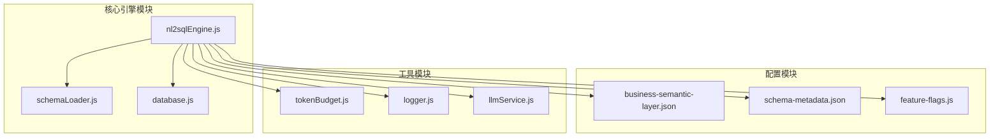
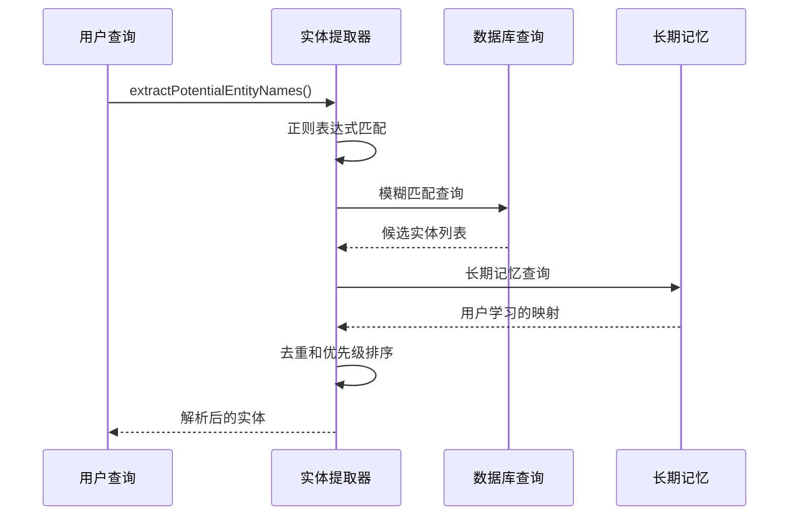
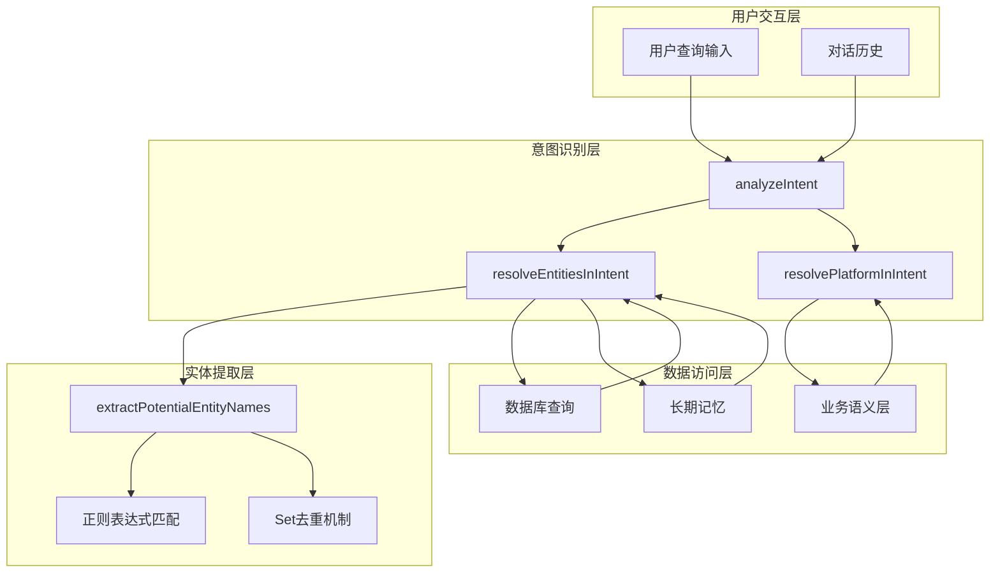
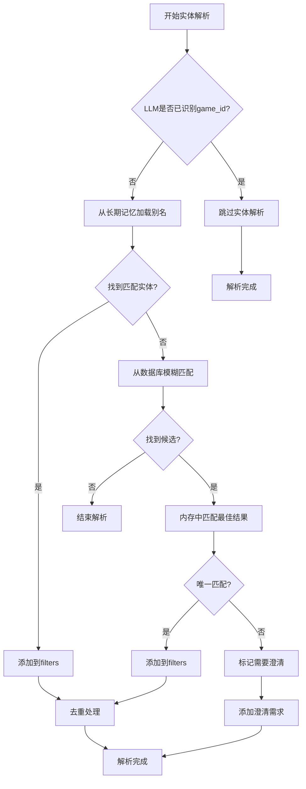
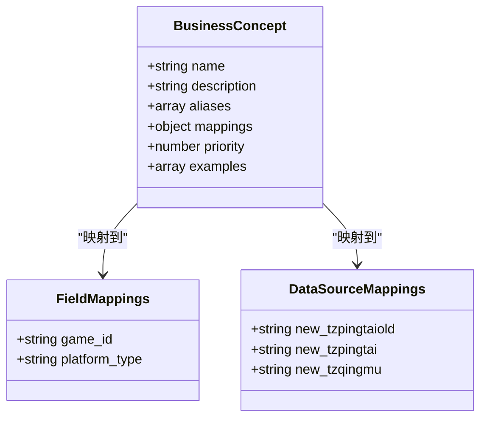
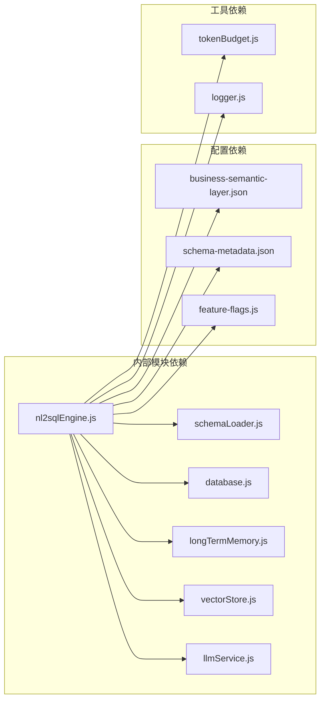

# 实体识别与提取

<cite>
**本文档引用的文件**
- [nl2sqlEngine.js](file://backend/src/core/nl2sqlEngine.js)
- [business-semantic-layer.json](file://backend/config/business-semantic-layer.json)
- [schema-metadata.json](file://backend/config/schema-metadata.json)
- [feature-flags.js](file://backend/config/feature-flags.js)
- [schemaLoader.js](file://backend/src/core/schemaLoader.js)
</cite>

## 目录
1. [简介](#简介)
2. [项目结构](#项目结构)
3. [核心组件](#核心组件)
4. [架构概览](#架构概览)
5. [详细组件分析](#详细组件分析)
6. [依赖分析](#依赖分析)
7. [性能考虑](#性能考虑)
8. [故障排除指南](#故障排除指南)
9. [结论](#结论)

## 简介
本文档详细阐述了NL2SQL系统中的实体识别与提取功能，重点解释extractPotentialEntityNames函数的工作原理及其在整个查询处理流程中的作用。该功能旨在从用户查询中准确识别和提取潜在的业务实体名称，包括中文字符、英文单词、引号标注等内容的提取策略。文档还说明了实体提取的优先级规则和去重机制，并提供了具体的代码示例展示不同查询场景下的实体提取效果。

## 项目结构
NL2SQL系统采用模块化设计，实体识别功能位于核心引擎模块中，与其他组件协同工作：



**图表来源**
- [nl2sqlEngine.js:1-50](file://backend/src/core/nl2sqlEngine.js#L1-L50)
- [schemaLoader.js:1-50](file://backend/src/core/schemaLoader.js#L1-L50)

**章节来源**
- [nl2sqlEngine.js:1-50](file://backend/src/core/nl2sqlEngine.js#L1-L50)
- [schemaLoader.js:1-50](file://backend/src/core/schemaLoader.js#L1-L50)

## 核心组件
实体识别与提取功能的核心组件包括：

### extractPotentialEntityNames函数
这是实体提取的核心函数，负责从用户查询中提取潜在的业务实体名称。该函数实现了三种主要的提取策略：

1. **中文连续字符提取**：匹配2-10个连续的中文字符
2. **英文单词提取**：匹配2-15个连续的英文字母
3. **引号内容提取**：提取被引号包围的内容

### 实体解析流程
系统通过resolveEntitiesInIntent函数协调多种实体解析策略：



**图表来源**
- [nl2sqlEngine.js:466-580](file://backend/src/core/nl2sqlEngine.js#L466-L580)

**章节来源**
- [nl2sqlEngine.js:574-612](file://backend/src/core/nl2sqlEngine.js#L574-L612)
- [nl2sqlEngine.js:393-572](file://backend/src/core/nl2sqlEngine.js#L393-L572)

## 架构概览
实体识别系统在整个NL2SQL架构中扮演着关键角色，连接自然语言理解与数据库查询：



**图表来源**
- [nl2sqlEngine.js:829-1166](file://backend/src/core/nl2sqlEngine.js#L829-L1166)
- [nl2sqlEngine.js:574-612](file://backend/src/core/nl2sqlEngine.js#L574-L612)

## 详细组件分析

### extractPotentialEntityNames函数详解

#### 函数签名与参数
```javascript
function extractPotentialEntityNames(query) {
    if (!query) return [];
    // 实体提取逻辑...
}
```

#### 提取策略实现

**1. 中文字符提取策略**
- 使用正则表达式`/[\u4e00-\u9fa5]{2,10}/g`匹配2-10个连续中文字符
- 适用于游戏名称、渠道名称等中文实体
- 示例：匹配"青木"、"华夏"、"游戏67"等

**2. 英文单词提取策略**
- 使用正则表达式`/[a-zA-Z]{2,15}/g`匹配2-15个连续英文字母
- 适用于英文游戏名称或技术术语
- 自动转换为小写以统一格式

**3. 引号内容提取策略**
- 使用正则表达式`/["'"]([^"'"]{1,20})["'"]/g`提取引号内容
- 支持双引号和单引号
- 优先级最高的提取策略，提取的内容会额外添加一次

#### 优先级规则
1. **引号内容优先级最高**：提取的引号内容会添加两次
2. **中文字符次之**：2-10个字符的中文连续匹配
3. **英文单词最后**：2-15个字符的英文单词匹配

#### 去重机制
使用JavaScript的Set数据结构实现自动去重：
- 所有提取的实体名称存储在Set中
- 自动消除重复项
- 最终转换为数组返回

**章节来源**
- [nl2sqlEngine.js:581-612](file://backend/src/core/nl2sqlEngine.js#L581-L612)

### 实体解析流程

#### resolveEntitiesInIntent函数
该函数协调多种实体解析策略：



**图表来源**
- [nl2sqlEngine.js:393-572](file://backend/src/core/nl2sqlEngine.js#L393-L572)

#### 去重机制实现
```javascript
// 去重：避免同一game_id被添加多次
const existingGameIds = new Set(
    intent.filters
        .filter(f => f.field === 'game_id')
        .map(f => f.value)
);
```

**章节来源**
- [nl2sqlEngine.js:466-572](file://backend/src/core/nl2sqlEngine.js#L466-L572)

### 业务语义层集成

#### 业务概念映射
系统支持业务语义层配置，将业务概念映射到物理表和字段：



**图表来源**
- [business-semantic-layer.json:1-189](file://backend/config/business-semantic-layer.json#L1-L189)

**章节来源**
- [business-semantic-layer.json:150-187](file://backend/config/business-semantic-layer.json#L150-L187)

## 依赖分析

### 外部依赖关系



**图表来源**
- [nl2sqlEngine.js:15-34](file://backend/src/core/nl2sqlEngine.js#L15-L34)

### 功能开关影响
业务语义层功能通过特性开关控制：

| 功能开关 | 环境变量 | 默认值 | 影响范围 |
|---------|---------|--------|----------|
| BUSINESS_SEMANTIC_LAYER | FF_BUSINESS_SEMANTIC_LAYER | false | 业务概念映射 |
| TOOL_AUGMENTED_SCHEMA | FF_TOOL_AUGMENTED_SCHEMA | false | Schema探索 |
| SCHEMA_LAYERED_LOADING | FF_SCHEMA_LAYERED_LOADING | false | 分层加载 |

**章节来源**
- [feature-flags.js:16-96](file://backend/config/feature-flags.js#L16-L96)

## 性能考虑

### 正则表达式优化
- 中文字符匹配使用预编译的正则表达式
- 英文单词匹配限制长度避免过度匹配
- 引号内容提取限制最大长度防止内存溢出

### 内存管理
- 使用Set数据结构进行自动去重
- 限制模糊匹配结果数量
- 及时清理临时数据结构

### 缓存策略
- 长期记忆中的实体映射缓存
- Schema元数据缓存
- 向量存储缓存

## 故障排除指南

### 常见问题及解决方案

**问题1：实体提取结果不准确**
- 检查正则表达式匹配规则
- 验证输入查询的格式
- 确认业务语义层配置正确

**问题2：性能问题**
- 监控正则表达式执行时间
- 检查Set去重效率
- 优化模糊匹配查询

**问题3：去重失效**
- 确认实体值的标准化处理
- 检查filters数组的结构
- 验证去重逻辑的正确性

**章节来源**
- [nl2sqlEngine.js:581-612](file://backend/src/core/nl2sqlEngine.js#L581-L612)
- [nl2sqlEngine.js:550-562](file://backend/src/core/nl2sqlEngine.js#L550-L562)

## 结论
NL2SQL系统的实体识别与提取功能通过多策略的正则表达式匹配、智能的优先级排序和高效的去重机制，实现了对用户查询中业务实体的准确识别。该功能不仅支持中文和英文实体的提取，还能处理引号标注的明确实体，为后续的数据库查询提供了可靠的基础。通过与业务语义层、长期记忆和数据库查询的深度集成，系统能够处理复杂的查询场景，为用户提供准确的自然语言到SQL转换服务。