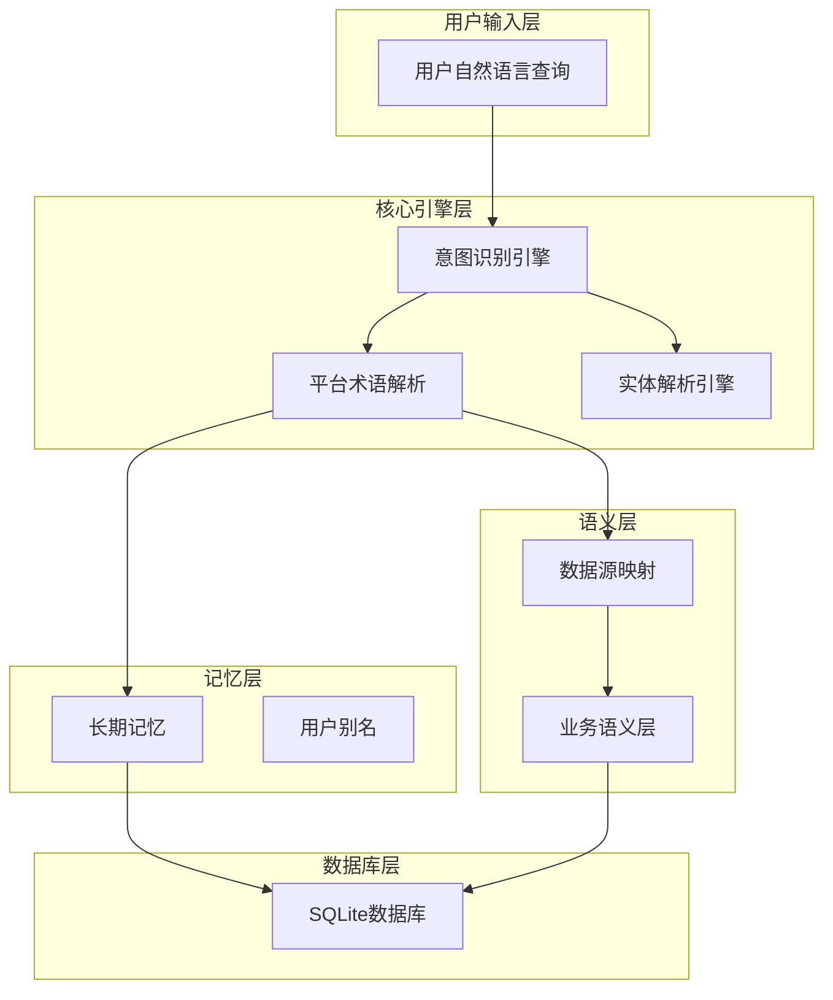
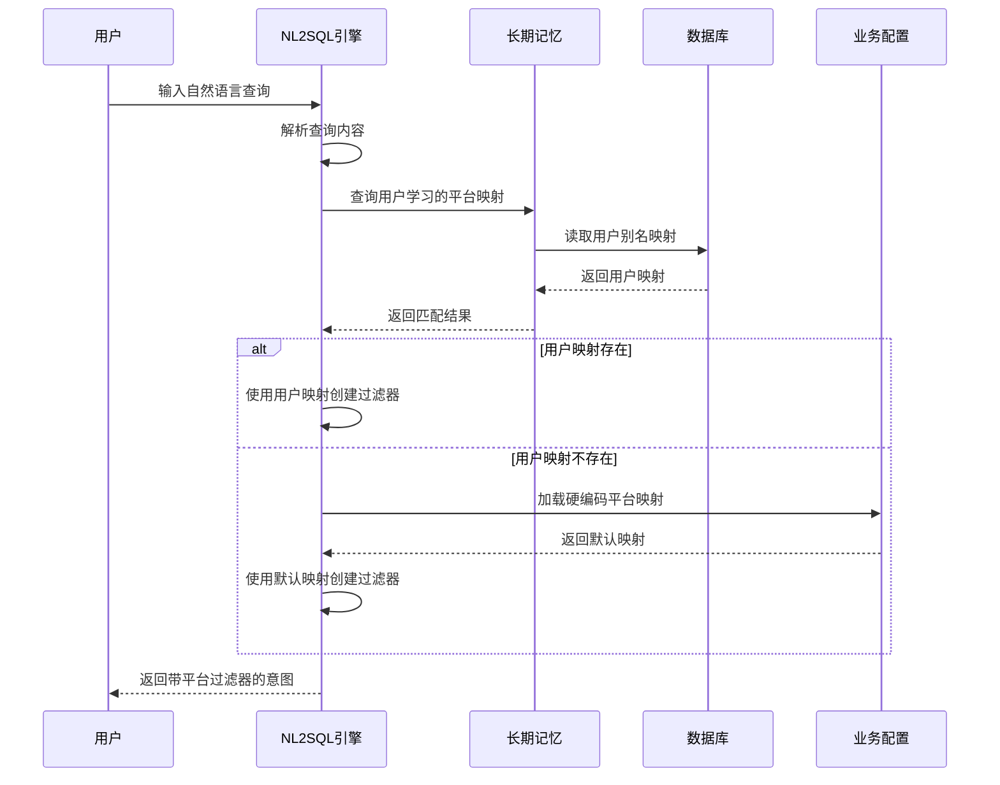
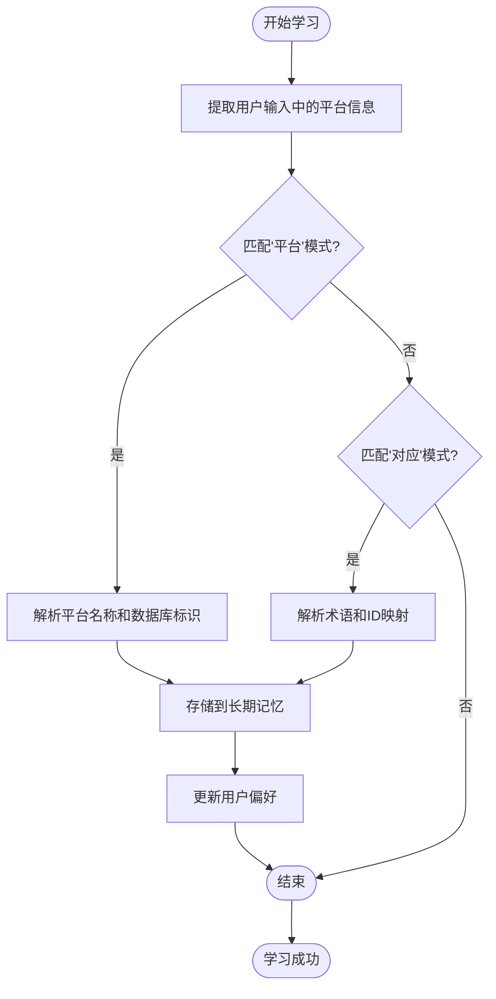
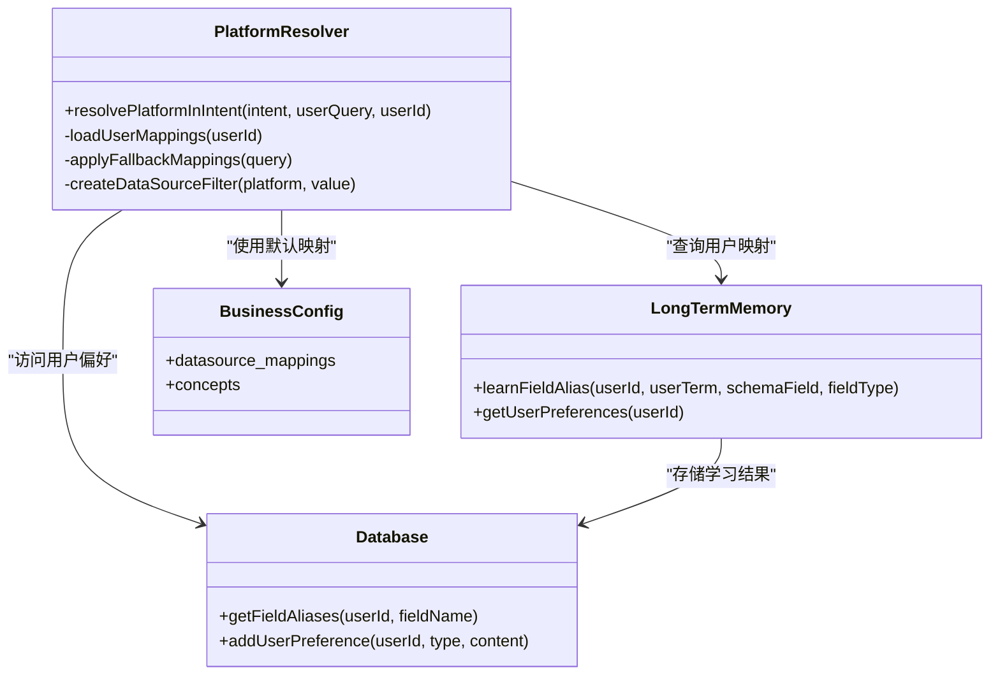
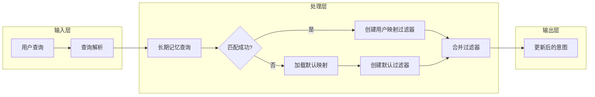

# 平台术语解析

<cite>
**本文引用的文件**
- [nl2sqlEngine.js](file://backend/src/core/nl2sqlEngine.js)
- [business-semantic-layer.json](file://backend/config/business-semantic-layer.json)
- [longTermMemory.js](file://backend/src/memory/longTermMemory.js)
- [database.js](file://backend/src/core/database.js)
- [semanticLayer.js](file://backend/src/core/semanticLayer.js)
</cite>

## 目录
1. [简介](#简介)
2. [项目结构](#项目结构)
3. [核心组件](#核心组件)
4. [架构概览](#架构概览)
5. [详细组件分析](#详细组件分析)
6. [依赖分析](#依赖分析)
7. [性能考虑](#性能考虑)
8. [故障排除指南](#故障排除指南)
9. [结论](#结论)

## 简介
本文档详细阐述了NL2SQL系统中的平台术语解析功能，重点解释如何识别和解析"新平台"、"老平台"等特殊业务术语，并将其映射到数据库的datasource标识符。该功能通过两层机制实现：首先从长期记忆中查找用户学习的datasource映射，如果不存在则使用硬编码的兜底映射规则。平台术语解析在游戏数据分析中具有重要意义，它能够帮助系统准确识别用户查询中的平台语义，从而生成正确的SQL查询。

## 项目结构
平台术语解析功能位于NL2SQL系统的意图识别和语义层之间，作为查询理解的重要环节。整个系统采用分层架构设计，包括：

- **核心引擎层**：负责意图识别和查询理解
- **语义层**：提供业务概念映射和数据源配置
- **记忆层**：存储用户学习的别名映射
- **数据库层**：持久化用户偏好和映射关系



**图表来源**
- [nl2sqlEngine.js:615-693](file://backend/src/core/nl2sqlEngine.js#L615-L693)
- [business-semantic-layer.json:171-187](file://backend/config/business-semantic-layer.json#L171-L187)

## 核心组件
平台术语解析功能由以下核心组件构成：

### 1. resolvePlatformInIntent函数
这是平台术语解析的核心实现，负责从用户查询中识别平台术语并进行映射。

### 2. 长期记忆集成
系统能够从用户的历史交互中学习平台术语映射关系，实现个性化识别。

### 3. 硬编码兜底规则
当用户未提供特定映射时，系统使用预定义的平台术语映射规则。

### 4. 业务语义层配置
提供标准的平台概念映射和数据源配置信息。

**章节来源**
- [nl2sqlEngine.js:615-693](file://backend/src/core/nl2sqlEngine.js#L615-L693)
- [business-semantic-layer.json:6-27](file://backend/config/business-semantic-layer.json#L6-L27)

## 架构概览
平台术语解析在整个NL2SQL系统中的位置和作用如下：



**图表来源**
- [nl2sqlEngine.js:621-693](file://backend/src/core/nl2sqlEngine.js#L621-L693)
- [longTermMemory.js:890-905](file://backend/src/memory/longTermMemory.js#L890-L905)

## 详细组件分析

### resolvePlatformInIntent函数实现
该函数实现了完整的平台术语解析流程：

#### 1. 长期记忆查询阶段
函数首先尝试从用户的长期记忆中查找已学习的平台映射关系。这包括：
- 调用数据库查询用户的所有字段别名
- 过滤出类型为'datasource'的映射
- 检查用户查询中是否包含对应的术语
- 如果匹配成功，创建相应的datasource过滤器

#### 2. 硬编码兜底阶段
如果在长期记忆中没有找到匹配的映射，系统使用预定义的平台术语映射：
- "老平台" → new_tzpingtaiold
- "新平台" → new_tzpingtai

#### 3. 过滤器创建
无论通过哪种方式获得映射，系统都会创建标准的过滤器格式：
```javascript
{
  field: 'datasource',
  op: '=',
  value: 'new_tzpingtaiold',
  original_name: '老平台'
}
```

### 平台术语学习机制
系统支持用户通过自然语言交互学习新的平台术语映射：



**图表来源**
- [longTermMemory.js:890-905](file://backend/src/memory/longTermMemory.js#L890-L905)

### 业务语义层配置
系统提供了标准化的平台概念映射配置：

| 平台概念 | 数据源标识 | 平台字段 | 平台值 |
|---------|-----------|----------|--------|
| 老平台 | new_tzpingtaiold | platform_type | 1,2,old |
| 新平台 | new_tzpingtai | platform_type | 0,new |

**章节来源**
- [business-semantic-layer.json:6-27](file://backend/config/business-semantic-layer.json#L6-L27)
- [business-semantic-layer.json:171-187](file://backend/config/business-semantic-layer.json#L171-L187)

## 依赖分析

### 组件间依赖关系
平台术语解析功能涉及多个组件的协作：



**图表来源**
- [nl2sqlEngine.js:621-693](file://backend/src/core/nl2sqlEngine.js#L621-L693)
- [longTermMemory.js:757-760](file://backend/src/memory/longTermMemory.js#L757-L760)
- [database.js:703-724](file://backend/src/core/database.js#L703-L724)

### 数据流分析
平台术语解析的数据流遵循以下模式：



**图表来源**
- [nl2sqlEngine.js:621-693](file://backend/src/core/nl2sqlEngine.js#L621-L693)

**章节来源**
- [nl2sqlEngine.js:1146-1147](file://backend/src/core/nl2sqlEngine.js#L1146-L1147)
- [database.js:703-724](file://backend/src/core/database.js#L703-L724)

## 性能考虑
平台术语解析功能在设计时充分考虑了性能优化：

### 1. 查询优化
- 使用索引优化用户偏好查询
- 限制查询结果数量避免过度扫描
- 缓存常用的映射关系

### 2. 内存管理
- 异步处理避免阻塞主线程
- 及时释放临时变量和中间结果
- 控制日志输出避免性能影响

### 3. 算法效率
- 早期退出机制：一旦找到匹配立即停止
- 字符串匹配优化：使用toLowerCase()统一转换
- 过滤器去重：避免重复添加相同的过滤器

## 故障排除指南

### 常见问题及解决方案

#### 1. 平台术语未被识别
**症状**：用户输入"老平台"或"新平台"但系统未创建相应的datasource过滤器

**排查步骤**：
1. 检查用户是否已在长期记忆中学习过该术语
2. 验证查询中是否包含正确的平台术语
3. 确认系统日志中是否有解析错误信息

**解决方案**：
- 引导用户重新表达平台术语
- 检查业务配置文件中的映射关系
- 验证数据库连接和权限

#### 2. 用户自定义映射未生效
**症状**：用户学习了新的平台术语映射但系统仍然使用默认映射

**排查步骤**：
1. 检查用户偏好表中是否存在该映射
2. 验证映射内容的JSON格式是否正确
3. 确认用户ID是否正确传递

**解决方案**：
- 重新学习映射关系
- 检查数据库连接状态
- 清理缓存后重试

#### 3. 性能问题
**症状**：平台术语解析响应时间过长

**排查步骤**：
1. 检查数据库索引是否正常
2. 监控查询执行计划
3. 分析日志中的性能瓶颈

**解决方案**：
- 优化数据库查询
- 增加适当的索引
- 实施查询缓存机制

**章节来源**
- [nl2sqlEngine.js:690-692](file://backend/src/core/nl2sqlEngine.js#L690-L692)
- [database.js:703-724](file://backend/src/core/database.js#L703-L724)

## 结论
平台术语解析功能通过"长期记忆学习 + 硬编码兜底"的双层机制，实现了对"新平台"、"老平台"等业务术语的准确识别和映射。该功能不仅提高了NL2SQL系统的智能化水平，还为用户提供了一种自然的交互方式来表达复杂的业务概念。

通过用户学习机制，系统能够适应不同组织的命名习惯，实现真正的个性化平台识别。同时，标准化的业务语义层配置确保了系统在缺乏用户学习的情况下仍能提供可靠的默认行为。

未来可以进一步优化的方向包括：
- 增加更多的平台术语变体支持
- 实现更智能的模糊匹配算法
- 提供更好的用户反馈机制
- 增强跨平台查询的处理能力