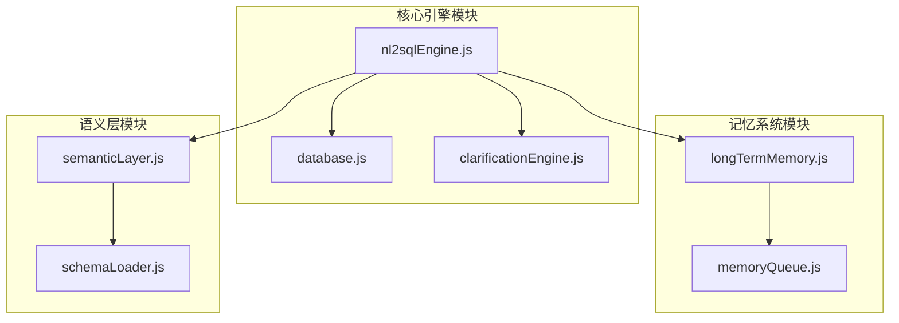
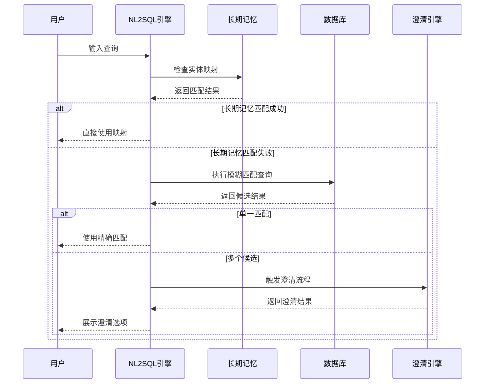
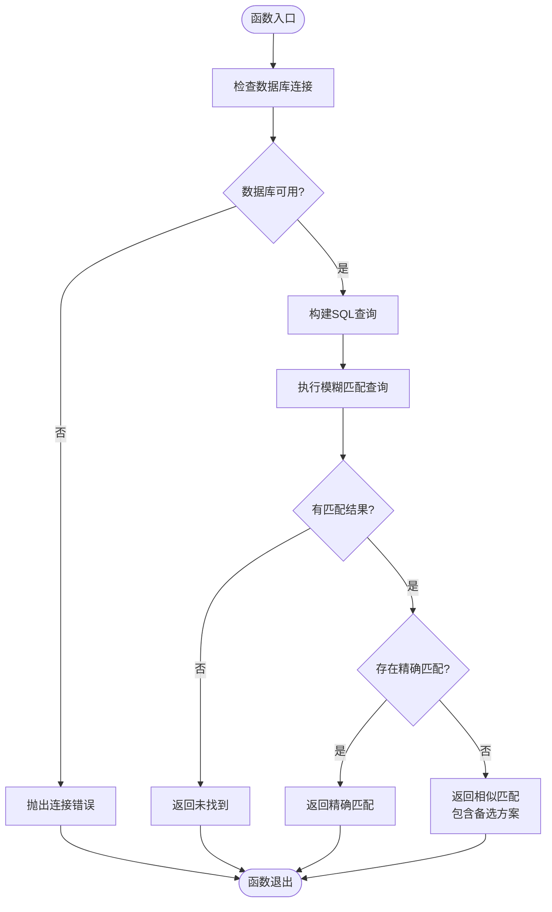
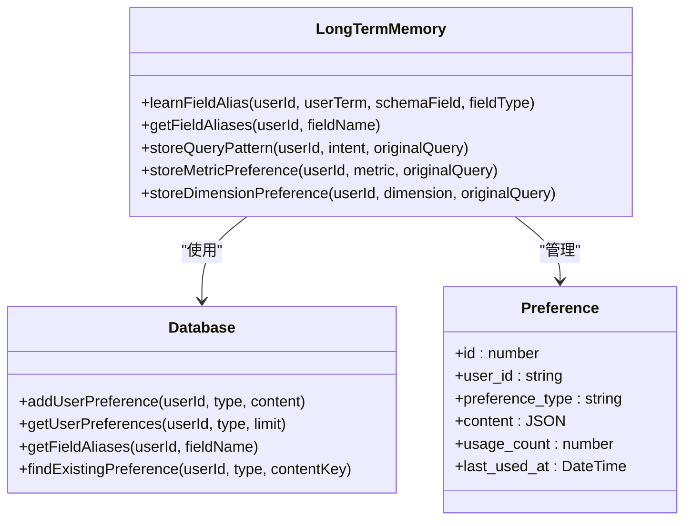
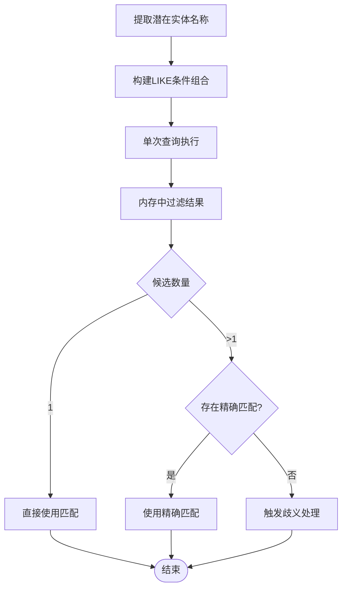
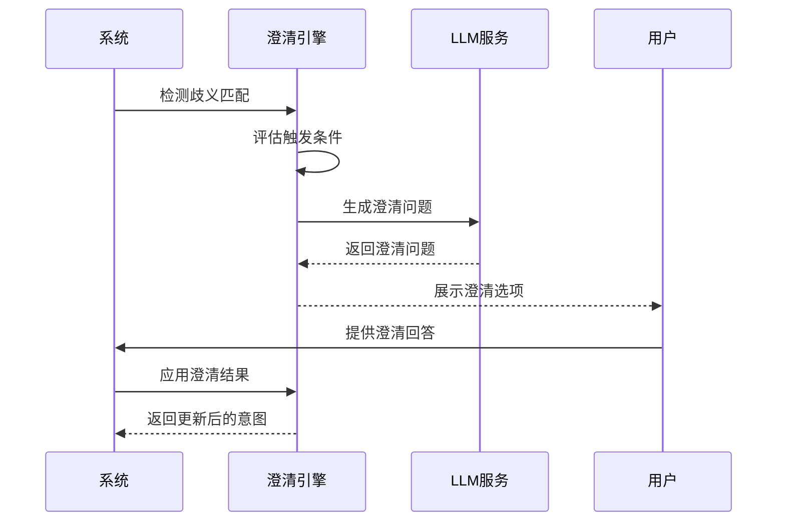
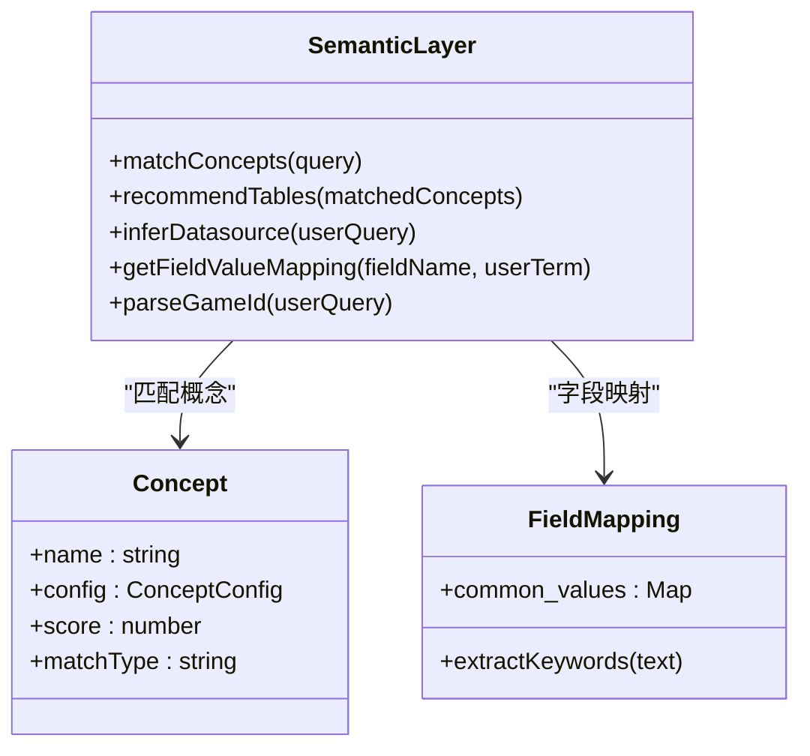
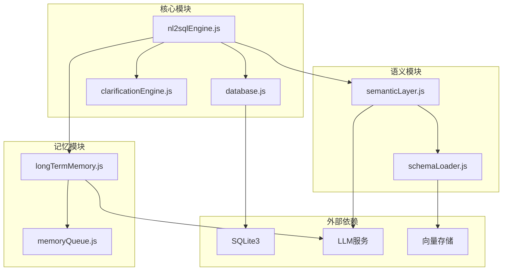

# 数据库模糊匹配

<cite>
**本文档引用的文件**
- [nl2sqlEngine.js](file://backend/src/core/nl2sqlEngine.js)
- [database.js](file://backend/src/core/database.js)
- [clarificationEngine.js](file://backend/src/core/clarificationEngine.js)
- [longTermMemory.js](file://backend/src/memory/longTermMemory.js)
- [semanticLayer.js](file://backend/src/core/semanticLayer.js)
- [schemaLoader.js](file://backend/src/core/schemaLoader.js)
</cite>

## 目录
1. [简介](#简介)
2. [项目结构](#项目结构)
3. [核心组件](#核心组件)
4. [架构概览](#架构概览)
5. [详细组件分析](#详细组件分析)
6. [依赖关系分析](#依赖关系分析)
7. [性能考虑](#性能考虑)
8. [故障排除指南](#故障排除指南)
9. [结论](#结论)

## 简介

本文档深入分析NL2SQL项目中的数据库模糊匹配功能，重点解释resolveEntity函数的多层次匹配策略。该系统采用三层匹配机制：优先使用长期记忆中的用户学习映射、其次使用数据库模糊匹配、最后提供歧义处理机制。文档详细描述了模糊匹配的SQL查询优化策略，包括使用单次查询替代多次循环查询、构建LIKE条件组合、限制匹配数量等性能优化技术。

## 项目结构

NL2SQL项目采用模块化架构设计，核心功能分布在以下关键模块中：

**图表来源**
- [nl2sqlEngine.js:1-50](file://backend/src/core/nl2sqlEngine.js#L1-L50)
- [database.js:1-50](file://backend/src/core/database.js#L1-L50)
- [clarificationEngine.js:1-50](file://backend/src/core/clarificationEngine.js#L1-L50)

**章节来源**
- [nl2sqlEngine.js:1-100](file://backend/src/core/nl2sqlEngine.js#L1-L100)
- [database.js:1-100](file://backend/src/core/database.js#L1-L100)

## 核心组件

### 实体解析引擎

实体解析引擎是数据库模糊匹配的核心组件，负责将用户输入的实体名称映射到数据库中的具体ID值。该引擎实现了完整的三层匹配策略：

1. **长期记忆匹配**：优先使用用户历史学习的实体映射
2. **数据库模糊匹配**：使用优化的SQL查询进行模糊匹配
3. **歧义处理机制**：识别多个候选匹配并触发澄清流程

### 数据库连接管理

数据库模块提供了统一的SQLite连接管理和查询执行接口，支持事务处理和错误恢复机制。

### 澄清引擎

澄清引擎负责检测匹配不确定性并生成友好的澄清问题，确保系统能够在置信度不足时主动寻求用户帮助。

**章节来源**
- [nl2sqlEngine.js:254-308](file://backend/src/core/nl2sqlEngine.js#L254-L308)
- [database.js:356-454](file://backend/src/core/database.js#L356-L454)
- [clarificationEngine.js:196-232](file://backend/src/core/clarificationEngine.js#L196-L232)

## 架构概览

系统采用分层架构设计，各组件职责清晰分离：

**图表来源**
- [nl2sqlEngine.js:393-572](file://backend/src/core/nl2sqlEngine.js#L393-L572)
- [clarificationEngine.js:246-272](file://backend/src/core/clarificationEngine.js#L246-L272)

## 详细组件分析

### resolveEntity函数实现

resolveEntity函数是实体解析的核心实现，采用了简洁高效的匹配策略：

**图表来源**
- [nl2sqlEngine.js:254-308](file://backend/src/core/nl2sqlEngine.js#L254-L308)

#### 性能优化策略

resolveEntity函数采用了多项性能优化措施：

1. **限制查询数量**：使用LIMIT 5限制返回结果数量
2. **精确匹配优先**：先检查精确匹配，避免不必要的模糊处理
3. **智能置信度评估**：为不同匹配类型分配不同的置信度分数

**章节来源**
- [nl2sqlEngine.js:254-308](file://backend/src/core/nl2sqlEngine.js#L254-L308)

### 长期记忆匹配机制

长期记忆系统提供了最高效的实体解析方式，通过学习用户的历史映射关系来避免数据库查询：

**图表来源**
- [longTermMemory.js:758-800](file://backend/src/memory/longTermMemory.js#L758-L800)
- [database.js:704-724](file://backend/src/core/database.js#L704-L724)

#### 学习机制特点

1. **双向映射学习**：支持实体名称到ID值的直接映射
2. **异步存储**：使用内存队列避免阻塞主线程
3. **智能筛选**：只有高价值的映射才会被存储

**章节来源**
- [longTermMemory.js:480-592](file://backend/src/memory/longTermMemory.js#L480-L592)
- [longTermMemory.js:758-800](file://backend/src/memory/longTermMemory.js#L758-L800)

### 数据库模糊匹配优化

数据库模糊匹配实现了多项查询优化技术：

**图表来源**
- [nl2sqlEngine.js:461-542](file://backend/src/core/nl2sqlEngine.js#L461-L542)

#### 查询优化技术

1. **单次查询优化**：使用多个LIKE条件在一个查询中完成
2. **参数化查询**：防止SQL注入攻击
3. **结果限制**：使用LIMIT 20限制返回数量
4. **内存过滤**：在应用层进行精确匹配和歧义处理

**章节来源**
- [nl2sqlEngine.js:470-542](file://backend/src/core/nl2sqlEngine.js#L470-L542)

### 澄清机制实现

当遇到歧义匹配时，系统会触发澄清流程：

**图表来源**
- [clarificationEngine.js:246-272](file://backend/src/core/clarificationEngine.js#L246-L272)
- [clarificationEngine.js:388-426](file://backend/src/core/clarificationEngine.js#L388-L426)

#### 触发条件分析

澄清机制基于多种触发条件：

1. **低置信度**：置信度低于阈值(0.6)
2. **表选择歧义**：同一类型数据匹配到多个表
3. **聚合指标来源不明确**：同时存在原始表和汇总表
4. **时间粒度不明确**：时间统计维度不明确

**章节来源**
- [clarificationEngine.js:26-182](file://backend/src/core/clarificationEngine.js#L26-L182)
- [clarificationEngine.js:196-232](file://backend/src/core/clarificationEngine.js#L196-L232)

### 语义层集成

系统还集成了语义层来增强实体解析能力：

**图表来源**
- [semanticLayer.js:188-214](file://backend/src/core/semanticLayer.js#L188-L214)
- [semanticLayer.js:399-433](file://backend/src/core/semanticLayer.js#L399-L433)

**章节来源**
- [semanticLayer.js:188-214](file://backend/src/core/semanticLayer.js#L188-L214)
- [semanticLayer.js:399-433](file://backend/src/core/semanticLayer.js#L399-L433)

## 依赖关系分析

系统各组件之间的依赖关系如下：

**图表来源**
- [nl2sqlEngine.js:16-33](file://backend/src/core/nl2sqlEngine.js#L16-L33)
- [longTermMemory.js:17-22](file://backend/src/memory/longTermMemory.js#L17-L22)

**章节来源**
- [nl2sqlEngine.js:16-33](file://backend/src/core/nl2sqlEngine.js#L16-L33)
- [longTermMemory.js:17-22](file://backend/src/memory/longTermMemory.js#L17-L22)

## 性能考虑

### 查询性能优化

系统在多个层面实现了性能优化：

1. **数据库查询优化**
   - 使用单次查询替代多次循环查询
   - 限制查询结果数量(LIMIT 5/20)
   - 参数化查询防止重复编译

2. **内存处理优化**
   - 在应用层进行结果过滤和匹配
   - 使用Set和Map进行高效查找
   - 避免不必要的对象创建

3. **异步处理优化**
   - 长期记忆存储使用队列异步处理
   - LLM调用异步执行避免阻塞

### 缓存策略

系统实现了多层次的缓存机制：

1. **短期缓存**：内存中的实体映射缓存
2. **长期缓存**：数据库中的用户偏好存储
3. **向量缓存**：语义搜索的结果缓存

## 故障排除指南

### 常见问题及解决方案

#### 数据库连接问题
- **症状**：resolveEntity函数抛出连接错误
- **原因**：数据库未正确初始化
- **解决方案**：检查数据库初始化过程，确认连接参数正确

#### 模糊匹配性能问题
- **症状**：模糊匹配查询响应缓慢
- **原因**：LIKE查询在大数据集上执行效率低
- **解决方案**：增加数据库索引，优化查询条件

#### 澄清流程异常
- **症状**：歧义处理触发但澄清问题生成失败
- **原因**：LLM服务不可用或响应超时
- **解决方案**：检查LLM服务状态，增加超时重试机制

**章节来源**
- [nl2sqlEngine.js:260-267](file://backend/src/core/nl2sqlEngine.js#L260-L267)
- [clarificationEngine.js:266-271](file://backend/src/core/clarificationEngine.js#L266-L271)

## 结论

NL2SQL项目的数据库模糊匹配系统展现了优秀的工程实践，通过多层次的匹配策略和全面的性能优化，实现了高效准确的实体解析功能。系统的核心优势包括：

1. **智能匹配策略**：从长期记忆到数据库模糊匹配的渐进式处理
2. **性能优化**：单次查询、内存过滤、异步处理等多重优化技术
3. **用户体验**：完善的歧义处理和澄清机制
4. **扩展性**：模块化设计支持功能扩展和性能优化

该系统为自然语言到SQL转换提供了坚实的基础，能够有效处理复杂的实体解析场景，为用户提供准确可靠的查询服务。