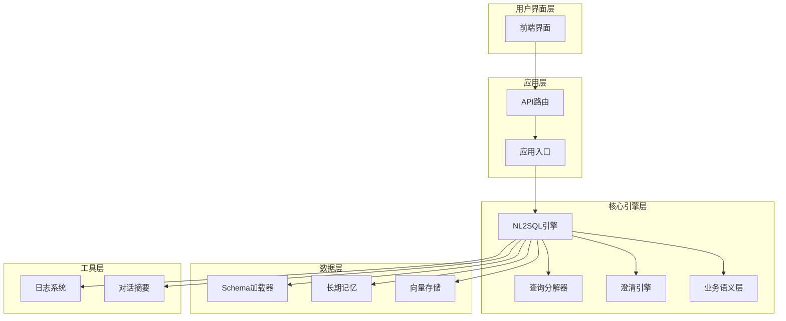
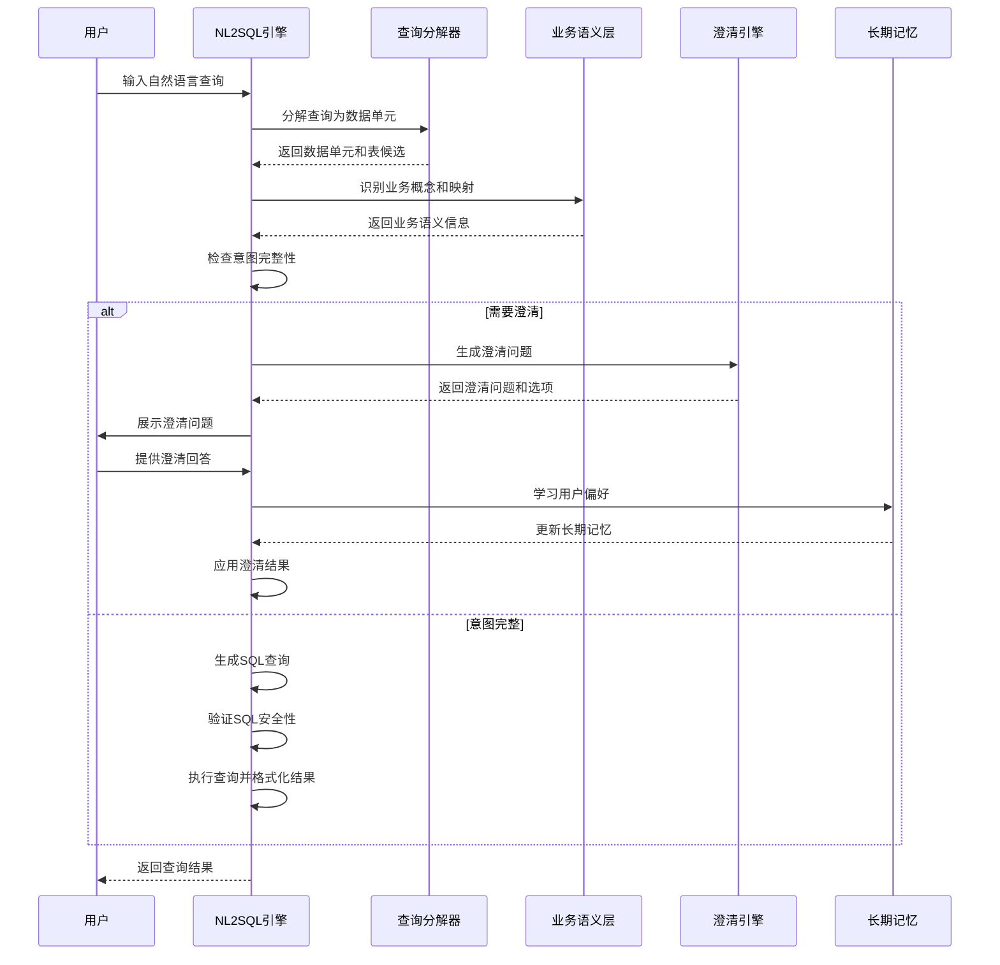
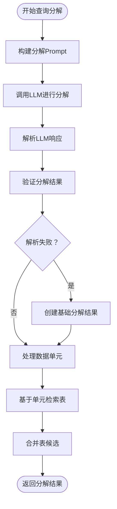
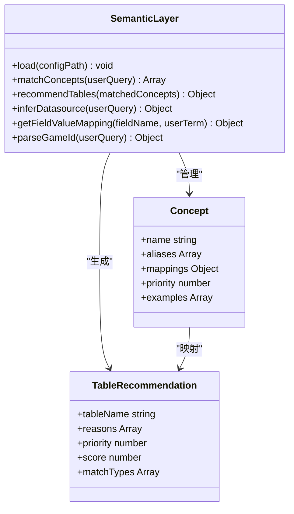
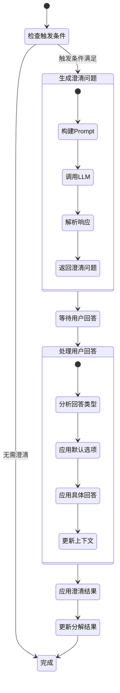
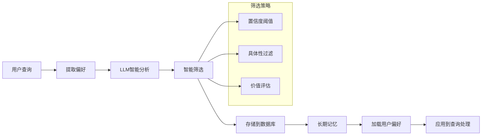
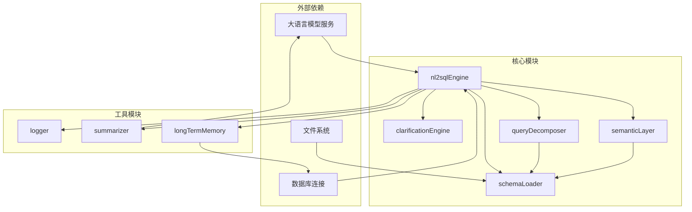

# 意图识别与澄清机制

<cite>
**本文档引用的文件**
- [clarificationEngine.js](file://backend/src/core/clarificationEngine.js)
- [nl2sqlEngine.js](file://backend/src/core/nl2sqlEngine.js)
- [queryDecomposer.js](file://backend/src/core/queryDecomposer.js)
- [semanticLayer.js](file://backend/src/core/semanticLayer.js)
- [schemaLoader.js](file://backend/src/core/schemaLoader.js)
- [longTermMemory.js](file://backend/src/memory/longTermMemory.js)
- [summarizer.js](file://backend/src/memory/summarizer.js)
- [logger.js](file://backend/src/utils/logger.js)
- [business-semantic-layer.json](file://backend/config/business-semantic-layer.json)
- [app.js](file://backend/src/app.js)
</cite>

## 目录
1. [简介](#简介)
2. [项目结构](#项目结构)
3. [核心组件](#核心组件)
4. [架构概览](#架构概览)
5. [详细组件分析](#详细组件分析)
6. [依赖分析](#依赖分析)
7. [性能考虑](#性能考虑)
8. [故障排除指南](#故障排除指南)
9. [结论](#结论)

## 简介

NL2SQL引擎的意图识别与澄清机制是一个多层次的自然语言理解系统，旨在将用户的自然语言查询准确转换为SQL语句。该系统通过三个核心阶段实现完整的意图理解：查询分解、业务语义识别和澄清交互。

系统的核心目标是：
- **准确理解用户查询的真实意图**
- **自动识别业务概念和数据需求**
- **在信息不足时主动发起澄清**
- **有效利用对话历史上下文**
- **提供智能的默认选项建议**

## 项目结构

NL2SQL引擎采用模块化架构设计，主要分为以下几个层次：

**图表来源**
- [app.js:1-260](file://backend/src/app.js#L1-L260)
- [nl2sqlEngine.js:1-800](file://backend/src/core/nl2sqlEngine.js#L1-L800)

**章节来源**
- [app.js:1-260](file://backend/src/app.js#L1-L260)
- [nl2sqlEngine.js:1-800](file://backend/src/core/nl2sqlEngine.js#L1-L800)

## 核心组件

### 1. 查询分解器（QueryDecomposer）

查询分解器负责将复杂的自然语言查询拆解为可独立处理的数据需求单元。它采用动态分解策略，不预设固定的子意图类型，能够适应各种复杂的查询场景。

**核心功能**：
- 动态查询拆解
- 数据需求单元识别
- 表候选检索
- 复杂度评估

### 2. 业务语义层（SemanticLayer）

业务语义层建立业务概念到物理表/字段的映射关系，解决业务术语识别问题，如"老平台"、"累计充值"等。

**核心功能**：
- 业务概念匹配
- 字段值映射
- 数据源推断
- 查询模式识别

### 3. 澄清引擎（ClarificationEngine）

澄清引擎是系统的核心交互组件，负责在理解不足时主动发起澄清，生成友好的澄清问题，并应用用户的澄清回答。

**核心功能**：
- 澄清触发条件检测
- 澄清问题生成
- 用户回答处理
- 默认选项提取

### 4. 长期记忆系统

长期记忆系统负责存储用户的偏好设置、实体映射和查询模式，通过机器学习算法智能提取有价值的知识。

**核心功能**：
- 用户偏好提取
- 字段别名学习
- 查询模式存储
- 智能筛选判断

**章节来源**
- [queryDecomposer.js:1-406](file://backend/src/core/queryDecomposer.js#L1-L406)
- [semanticLayer.js:1-532](file://backend/src/core/semanticLayer.js#L1-L532)
- [clarificationEngine.js:1-489](file://backend/src/core/clarificationEngine.js#L1-L489)
- [longTermMemory.js:1-1127](file://backend/src/memory/longTermMemory.js#L1-L1127)

## 架构概览

NL2SQL引擎采用分层架构设计，实现了高度模块化的系统结构：

**图表来源**
- [nl2sqlEngine.js:2250-2652](file://backend/src/core/nl2sqlEngine.js#L2250-L2652)
- [clarificationEngine.js:188-232](file://backend/src/core/clarificationEngine.js#L188-L232)

## 详细组件分析

### 查询分解器深度分析

查询分解器采用先进的自然语言处理技术，将复杂查询拆解为可独立处理的数据需求单元：

**图表来源**
- [queryDecomposer.js:38-70](file://backend/src/core/queryDecomposer.js#L38-L70)
- [queryDecomposer.js:152-175](file://backend/src/core/queryDecomposer.js#L152-L175)

**核心算法特点**：
- **动态类型识别**：不预设固定类型，根据上下文动态确定
- **多粒度处理**：支持从简单筛选到复杂聚合的全方位处理
- **智能合并**：通过覆盖率和频率评分合并表候选

**章节来源**
- [queryDecomposer.js:1-406](file://backend/src/core/queryDecomposer.js#L1-L406)

### 业务语义层深度分析

业务语义层通过配置化的映射关系，实现业务概念到技术实现的无缝转换：

**图表来源**
- [semanticLayer.js:26-33](file://backend/src/core/semanticLayer.js#L26-L33)
- [semanticLayer.js:134-167](file://backend/src/core/semanticLayer.js#L134-L167)

**业务概念映射示例**：
- "老平台" → `new_tzpingtaiold` 数据库标识
- "累计充值" → `tzpingtai_tz_sdk_log_pf_order` 表的 SUM(real_amount)
- "注册用户" → `tzpingtai_tz_sdk_log_pf_reg` 表的用户注册记录

**章节来源**
- [semanticLayer.js:1-532](file://backend/src/core/semanticLayer.js#L1-L532)
- [business-semantic-layer.json:1-189](file://backend/config/business-semantic-layer.json#L1-L189)

### 澄清引擎深度分析

澄清引擎是系统中最复杂的交互组件，负责在理解不足时主动发起澄清：

**图表来源**
- [clarificationEngine.js:188-232](file://backend/src/core/clarificationEngine.js#L188-L232)
- [clarificationEngine.js:388-426](file://backend/src/core/clarificationEngine.js#L388-L426)

**触发条件检测**：

| 触发条件类型 | 描述 | 触发场景 | 严重程度 |
|------------|------|----------|----------|
| 无匹配表 | 数据单元无法匹配到具体表 | 查询涉及未知业务概念 | HIGH |
| 表选择歧义 | 同类型数据匹配到多个表 | 业务术语存在多种解释 | MEDIUM |
| 指标来源不明确 | 聚合指标同时存在原始表和汇总表 | 需要选择数据源 | LOW |
| 时间粒度不明确 | 时间统计维度缺少粒度信息 | 需要确定统计周期 | LOW |
| 置信度过低 | 整体理解置信度不足 | 无法确定用户真实意图 | MEDIUM |

**章节来源**
- [clarificationEngine.js:1-489](file://backend/src/core/clarificationEngine.js#L1-L489)

### 长期记忆系统深度分析

长期记忆系统通过机器学习算法智能提取用户偏好和业务知识：

**图表来源**
- [longTermMemory.js:313-471](file://backend/src/memory/longTermMemory.js#L313-L471)

**偏好提取规则**：

1. **字段别名学习**：用户明确声明的术语映射
2. **查询模式识别**：高频查询的模式提取
3. **指标偏好存储**：用户常用的指标组合
4. **维度习惯记录**：用户偏好的维度组合

**章节来源**
- [longTermMemory.js:1-1127](file://backend/src/memory/longTermMemory.js#L1-L1127)

## 依赖分析

NL2SQL引擎的依赖关系体现了清晰的分层架构：

**图表来源**
- [nl2sqlEngine.js:16-34](file://backend/src/core/nl2sqlEngine.js#L16-L34)
- [clarificationEngine.js:14-16](file://backend/src/core/clarificationEngine.js#L14-L16)

**核心依赖关系**：
- **LLM服务**：用于查询分解、澄清问题生成和SQL验证
- **数据库连接**：用于实体解析和偏好存储
- **文件系统**：用于Schema配置文件和日志文件
- **向量存储**：用于语义搜索和查询向量存储

**章节来源**
- [nl2sqlEngine.js:1-800](file://backend/src/core/nl2sqlEngine.js#L1-L800)
- [clarificationEngine.js:1-489](file://backend/src/core/clarificationEngine.js#L1-L489)

## 性能考虑

### 1. 查询分解性能优化

- **向量化搜索**：使用表级向量替代字段级向量，提升搜索效率
- **增量更新**：只更新变化的表向量，避免全量重建
- **智能截断**：限制表候选数量，控制Prompt长度

### 2. 澄清交互优化

- **触发条件优先级**：按严重程度排序，避免一次性提出过多问题
- **默认选项机制**：提供合理的默认选项，减少用户思考成本
- **上下文压缩**：使用对话摘要减少历史对话长度

### 3. 内存管理优化

- **缓存策略**：合理设置缓存过期时间，平衡内存使用和性能
- **异步处理**：长期记忆存储采用异步方式，不阻塞主流程
- **资源清理**：定期清理过期缓存，释放内存资源

## 故障排除指南

### 常见问题及解决方案

**1. 查询分解失败**
- **症状**：查询无法正确分解为数据单元
- **原因**：LLM响应格式错误或Schema配置缺失
- **解决方案**：检查LLM服务状态，验证Schema配置文件

**2. 澄清问题质量差**
- **症状**：生成的澄清问题不友好或不相关
- **原因**：触发条件配置不当或Prompt设计问题
- **解决方案**：调整触发条件权重，优化Prompt模板

**3. 长期记忆学习失败**
- **症状**：用户偏好无法正确存储
- **原因**：置信度阈值过高或筛选规则过于严格
- **解决方案**：调整阈值配置，检查用户权限

**4. SQL生成错误**
- **症状**：生成的SQL语法错误或逻辑错误
- **原因**：Schema映射错误或业务规则理解偏差
- **解决方案**：检查Schema配置，验证业务语义映射

**章节来源**
- [logger.js:1-442](file://backend/src/utils/logger.js#L1-L442)
- [nl2sqlEngine.js:2575-2595](file://backend/src/core/nl2sqlEngine.js#L2575-L2595)

## 结论

NL2SQL引擎的意图识别与澄清机制通过多层次的设计实现了高效的自然语言理解。系统的核心优势包括：

1. **多层次理解**：从查询分解到业务语义识别，再到智能澄清，形成完整的理解链条
2. **智能交互**：主动识别信息不足并发起澄清，提供友好的用户体验
3. **持续学习**：通过长期记忆系统不断优化理解能力
4. **性能优化**：采用多种优化策略确保系统响应速度

该系统为开发者提供了完整的NL2SQL解决方案，既保证了准确性，又提升了用户体验。通过合理的架构设计和丰富的功能特性，能够满足企业级应用的需求。

对于开发者而言，理解这些机制的工作原理有助于更好地扩展和优化系统功能，提升NL2SQL引擎的整体性能和用户体验。