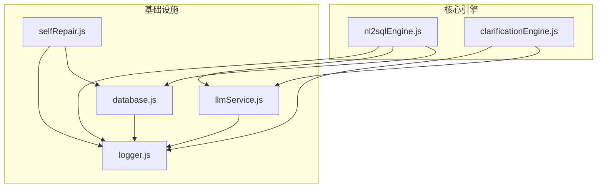
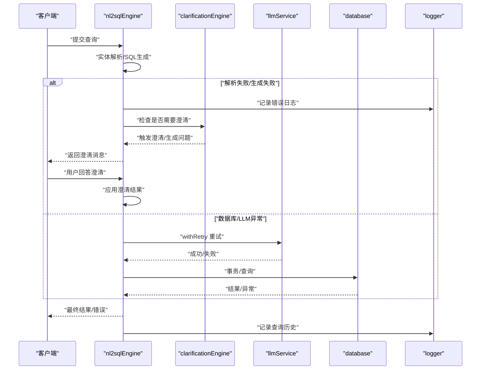
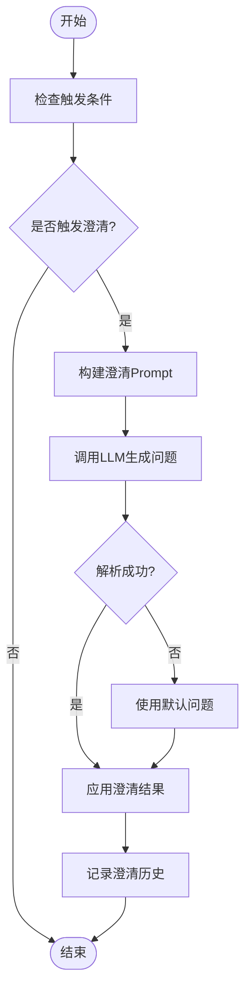
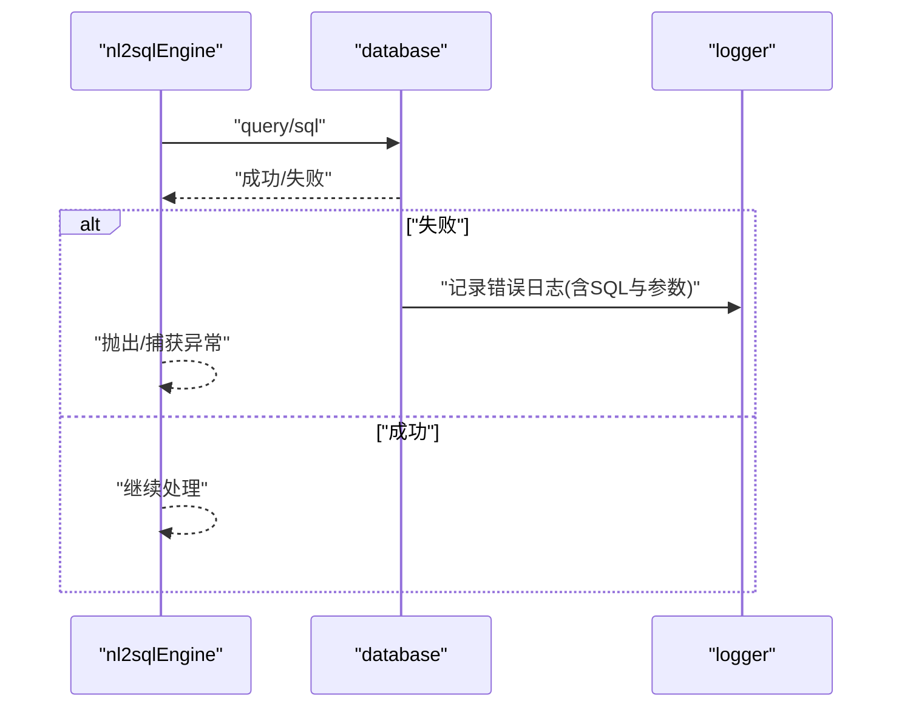
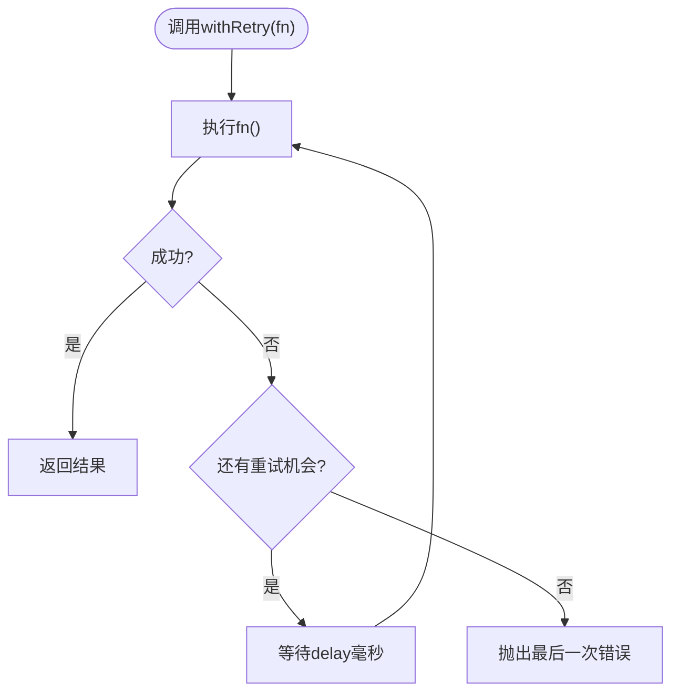
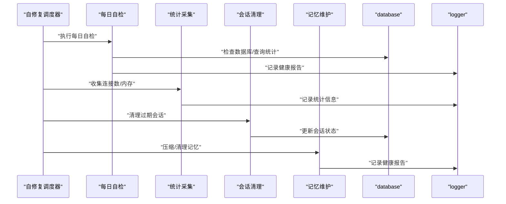
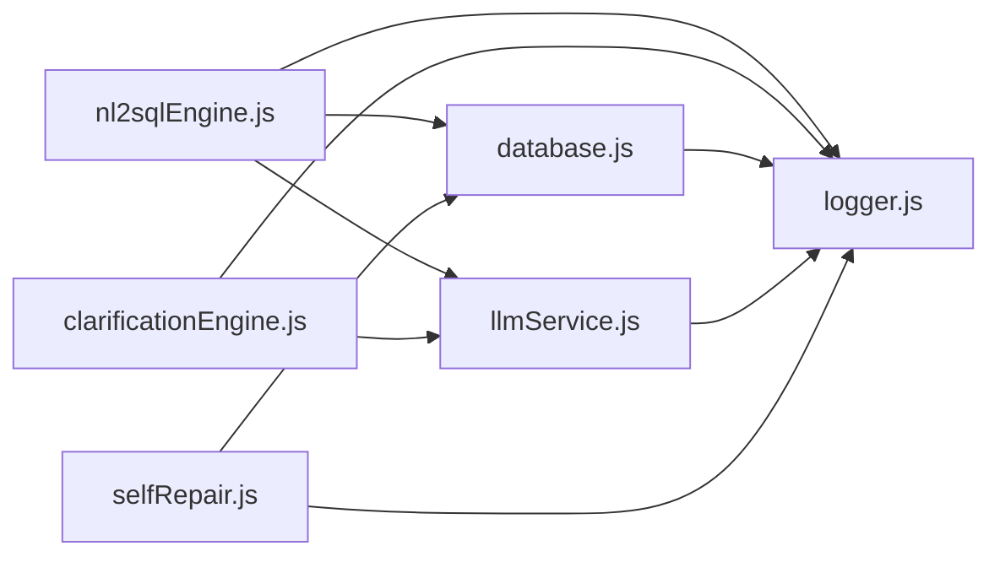

# 错误处理与恢复

<cite>
**本文引用的文件**
- [nl2sqlEngine.js](file://backend/src/core/nl2sqlEngine.js)
- [clarificationEngine.js](file://backend/src/core/clarificationEngine.js)
- [database.js](file://backend/src/core/database.js)
- [llmService.js](file://backend/src/core/llmService.js)
- [selfRepair.js](file://backend/src/core/selfRepair.js)
- [logger.js](file://backend/src/utils/logger.js)
</cite>

## 目录
1. [简介](#简介)
2. [项目结构](#项目结构)
3. [核心组件](#核心组件)
4. [架构总览](#架构总览)
5. [详细组件分析](#详细组件分析)
6. [依赖分析](#依赖分析)
7. [性能考虑](#性能考虑)
8. [故障排查指南](#故障排查指南)
9. [结论](#结论)
10. [附录](#附录)

## 简介
本文件聚焦NL2SQL引擎的错误处理与恢复机制，围绕统一错误类NL2SQLError的设计理念与使用方法展开，系统阐述错误类型分类、错误信息结构、恢复能力标记等；并结合实体解析失败、SQL生成错误、数据库执行异常、澄清循环等典型场景，给出处理策略与自我修复机制（自动重试、降级策略、用户引导）。同时覆盖错误日志记录、监控告警、调试信息收集等运维要点，并提供最佳实践与参考路径，帮助开发者构建健壮的错误处理系统。

## 项目结构
NL2SQL后端采用分层设计，核心错误处理与恢复涉及如下模块：
- 核心引擎：负责意图识别、实体解析、SQL生成、验证与结果格式化，内置统一错误类NL2SQLError。
- 澄清引擎：在置信度不足或歧义场景下生成澄清问题，驱动用户交互以提升准确性。
- 数据库模块：提供SQLite持久化能力，封装查询、事务、迁移等操作，统一错误日志。
- LLM服务：封装HTTP请求、重试机制、流式响应与错误处理，保障外部接口稳定性。
- 自修复模块：定时任务驱动的系统自检、会话清理、统计采集与记忆维护，实现系统级自我修复。
- 日志模块：统一日志格式、级别与追踪能力，支撑错误定位与审计。

图表来源
- [nl2sqlEngine.js:1-800](file://backend/src/core/nl2sqlEngine.js#L1-L800)
- [clarificationEngine.js:1-489](file://backend/src/core/clarificationEngine.js#L1-L489)
- [database.js:1-859](file://backend/src/core/database.js#L1-L859)
- [llmService.js:1-477](file://backend/src/core/llmService.js#L1-L477)
- [selfRepair.js:1-489](file://backend/src/core/selfRepair.js#L1-L489)
- [logger.js:1-442](file://backend/src/utils/logger.js#L1-L442)

章节来源
- [nl2sqlEngine.js:166-240](file://backend/src/core/nl2sqlEngine.js#L166-L240)
- [clarificationEngine.js:188-232](file://backend/src/core/clarificationEngine.js#L188-L232)
- [database.js:370-454](file://backend/src/core/database.js#L370-L454)
- [llmService.js:158-206](file://backend/src/core/llmService.js#L158-L206)
- [selfRepair.js:60-125](file://backend/src/core/selfRepair.js#L60-L125)
- [logger.js:233-310](file://backend/src/utils/logger.js#L233-L310)

## 核心组件
- 统一错误类NL2SQLError：提供结构化错误信息，包含类型、详情、可恢复标记与时间戳，便于日志记录与分支处理。
- 澄清引擎：在实体歧义、表选择不确定、聚合来源不明确、时间粒度不明确、置信度过低等场景触发澄清，生成友好问题并应用用户回答。
- 数据库模块：封装SQLite访问，提供查询、单行查询、执行、事务与迁移，统一错误日志与异常传播。
- LLM服务：封装HTTP请求、JSON解析、超时与重试，记录调用耗时与响应详情，增强外部接口稳定性。
- 自修复模块：定时任务驱动的系统自检、会话清理、统计采集与记忆维护，实现系统级自我修复。
- 日志模块：统一日志级别、格式化输出、文件轮转与追踪能力，支持trace、debug、info、warn、error五级日志。

章节来源
- [nl2sqlEngine.js:170-240](file://backend/src/core/nl2sqlEngine.js#L170-L240)
- [clarificationEngine.js:26-182](file://backend/src/core/clarificationEngine.js#L26-L182)
- [database.js:370-454](file://backend/src/core/database.js#L370-L454)
- [llmService.js:158-206](file://backend/src/core/llmService.js#L158-L206)
- [selfRepair.js:60-125](file://backend/src/core/selfRepair.js#L60-L125)
- [logger.js:299-310](file://backend/src/utils/logger.js#L299-L310)

## 架构总览
NL2SQL引擎的错误处理与恢复贯穿“感知—评估—修复—反馈”闭环：
- 感知：统一错误类与日志模块捕获错误与异常。
- 评估：根据错误类型与可恢复标记决定策略（澄清、重试、降级、记录）。
- 修复：通过澄清引擎引导用户、通过LLM重试机制提升成功率、通过自修复模块进行系统维护。
- 反馈：记录查询历史与系统日志，生成健康报告与统计信息，支持监控告警。

图表来源
- [nl2sqlEngine.js:254-308](file://backend/src/core/nl2sqlEngine.js#L254-L308)
- [clarificationEngine.js:196-272](file://backend/src/core/clarificationEngine.js#L196-L272)
- [llmService.js:167-195](file://backend/src/core/llmService.js#L167-L195)
- [database.js:440-454](file://backend/src/core/database.js#L440-L454)
- [logger.js:233-310](file://backend/src/utils/logger.js#L233-L310)

## 详细组件分析

### 统一错误类 NL2SQLError
设计理念
- 结构化：包含type、details、isRecoverable、timestamp、stack等字段，便于日志记录与分支处理。
- 可恢复标记：isRecoverable用于标识是否可通过澄清等方式解决，指导后续策略。
- 类型化：涵盖实体解析、SQL生成、SQL验证、执行等场景，便于分类统计与告警。

错误类型与恢复能力
- 实体解析错误：isRecoverable=true，通常通过澄清或回退策略解决。
- SQL生成错误：isRecoverable=true，可通过澄清或调整提示词重试。
- SQL验证错误：isRecoverable=false，通常需要人工干预或修正输入。
- 执行错误：isRecoverable视具体原因而定，可能通过重试或降级处理。

错误信息结构
- toLogObject：导出标准化日志对象，包含错误类型、消息、详情、可恢复性、时间戳与堆栈。

使用示例（参考路径）
- [实体解析失败抛出错误:262-266](file://backend/src/core/nl2sqlEngine.js#L262-L266)
- [SQL生成错误构造:232-238](file://backend/src/core/nl2sqlEngine.js#L232-L238)
- [SQL验证错误构造:220-226](file://backend/src/core/nl2sqlEngine.js#L220-L226)

章节来源
- [nl2sqlEngine.js:170-240](file://backend/src/core/nl2sqlEngine.js#L170-L240)

### 澄清引擎与澄清循环
触发条件
- 数据单元无匹配表、表选择歧义、聚合指标来源不明确、时间粒度不明确、置信度过低等，按优先级排序，仅返回最高优先级触发。

澄清问题生成
- 构建Prompt，调用LLM生成问题与选项，解析JSON响应，失败时回退默认问题。
- 应用澄清结果：根据类型更新偏好、指标来源、时间粒度或添加备注。

澄清循环策略
- 限制触发数量，避免一次性问太多问题；
- 优先使用结构化默认选项，兼容旧数据；
- 记录澄清历史，便于审计与复盘。

使用示例（参考路径）
- [触发条件定义与检查:26-182](file://backend/src/core/clarificationEngine.js#L26-L182)
- [生成澄清问题与默认回退:246-272](file://backend/src/core/clarificationEngine.js#L246-L272)
- [应用澄清结果:388-426](file://backend/src/core/clarificationEngine.js#L388-L426)

图表来源
- [clarificationEngine.js:196-272](file://backend/src/core/clarificationEngine.js#L196-L272)
- [clarificationEngine.js:388-426](file://backend/src/core/clarificationEngine.js#L388-L426)

章节来源
- [clarificationEngine.js:188-232](file://backend/src/core/clarificationEngine.js#L188-L232)
- [clarificationEngine.js:246-272](file://backend/src/core/clarificationEngine.js#L246-L272)
- [clarificationEngine.js:388-426](file://backend/src/core/clarificationEngine.js#L388-L426)

### 数据库执行异常处理
数据库访问封装
- query/queryOne/run：分别对应多行查询、单行查询与非查询执行，均返回Promise并在失败时记录错误日志并拒绝。
- transaction：提供事务封装，异常时自动回滚，保证一致性。
- 迁移：在初始化时执行迁移，修复旧表结构问题。

异常处理策略
- 失败即记录：统一记录SQL与参数，便于定位问题。
- 事务回滚：确保部分失败不影响整体一致性。
- 迁移保护：在事务中执行重建与索引重建，失败回滚。

使用示例（参考路径）
- [查询失败日志与拒绝:378-387](file://backend/src/core/database.js#L378-L387)
- [事务封装与回滚:440-454](file://backend/src/core/database.js#L440-L454)
- [迁移执行与回滚:277-344](file://backend/src/core/database.js#L277-L344)

图表来源
- [database.js:370-454](file://backend/src/core/database.js#L370-L454)
- [logger.js:233-310](file://backend/src/utils/logger.js#L233-L310)

章节来源
- [database.js:370-454](file://backend/src/core/database.js#L370-L454)
- [database.js:277-344](file://backend/src/core/database.js#L277-L344)

### LLM服务重试与降级
重试机制
- withRetry：对任意函数执行最多maxRetries次重试，每次等待delay毫秒，失败记录日志并最终抛出最后一次错误。
- 适用于网络抖动、超时、临时服务不可用等场景。

降级策略
- 超时与解析失败：记录详细响应片段与截断标记，便于定位问题（如代理截断、流式响应格式）。
- 默认回退：在澄清问题生成失败时，使用默认问题模板，保证用户体验。

使用示例（参考路径）
- [重试包装器:167-195](file://backend/src/core/llmService.js#L167-L195)
- [HTTP请求与解析失败处理:135-131](file://backend/src/core/llmService.js#L135-131)
- [默认澄清回退:333-374](file://backend/src/core/clarificationEngine.js#L333-L374)

图表来源
- [llmService.js:167-195](file://backend/src/core/llmService.js#L167-L195)

章节来源
- [llmService.js:158-206](file://backend/src/core/llmService.js#L158-L206)
- [llmService.js:135-131](file://backend/src/core/llmService.js#L135-L131)
- [clarificationEngine.js:333-374](file://backend/src/core/clarificationEngine.js#L333-L374)

### 自我修复机制
定时任务
- 每日自检：检查数据库连接、向量数据库、查询统计、活跃连接与系统资源，生成健康报告并保存到系统日志。
- 会话清理：定期归档过期会话，释放资源。
- 统计采集：周期性记录连接数与内存使用，便于监控。
- 记忆维护：压缩与清理长期记忆，生成健康报告。

手动触发
- 支持手动触发各类检查与维护任务，便于紧急处理与测试。

使用示例（参考路径）
- [启动自修复调度器:60-125](file://backend/src/core/selfRepair.js#L60-L125)
- [每日自检与报告保存:169-331](file://backend/src/core/selfRepair.js#L169-L331)
- [会话清理与记忆维护:341-415](file://backend/src/core/selfRepair.js#L341-L415)

图表来源
- [selfRepair.js:60-125](file://backend/src/core/selfRepair.js#L60-L125)
- [selfRepair.js:169-331](file://backend/src/core/selfRepair.js#L169-L331)
- [selfRepair.js:341-415](file://backend/src/core/selfRepair.js#L341-L415)

章节来源
- [selfRepair.js:60-125](file://backend/src/core/selfRepair.js#L60-L125)
- [selfRepair.js:169-331](file://backend/src/core/selfRepair.js#L169-L331)
- [selfRepair.js:341-415](file://backend/src/core/selfRepair.js#L341-L415)

### 日志记录与调试追踪
日志级别与格式
- 支持TRACE、DEBUG、INFO、WARN、ERROR五级，统一格式化输出与文件轮转。
- 错误日志包含message与error元数据（含message与stack）。

追踪能力
- startTrace/traceStep/endTrace：基于traceId的流程追踪，记录步骤、耗时与状态，便于复杂流程调试。
- getTrace：获取追踪会话，便于审计与复盘。

使用示例（参考路径）
- [错误日志记录:299-310](file://backend/src/utils/logger.js#L299-L310)
- [追踪会话管理:322-408](file://backend/src/utils/logger.js#L322-L408)

章节来源
- [logger.js:299-310](file://backend/src/utils/logger.js#L299-L310)
- [logger.js:322-408](file://backend/src/utils/logger.js#L322-L408)

## 依赖分析
- nl2sqlEngine依赖database、llmService、logger，负责实体解析、SQL生成与错误统一处理。
- clarificationEngine依赖llmService与logger，负责澄清问题生成与应用。
- database依赖logger，负责数据库操作日志。
- llmService依赖logger，负责API调用日志与重试。
- selfRepair依赖database、logger、vectorStore、sseHandler，负责系统自检与维护。
- logger为全局日志中心，被各模块广泛使用。

图表来源
- [nl2sqlEngine.js:16-34](file://backend/src/core/nl2sqlEngine.js#L16-L34)
- [clarificationEngine.js:14-16](file://backend/src/core/clarificationEngine.js#L14-L16)
- [database.js:12-20](file://backend/src/core/database.js#L12-L20)
- [llmService.js:15-25](file://backend/src/core/llmService.js#L15-L25)
- [selfRepair.js:15-27](file://backend/src/core/selfRepair.js#L15-L27)
- [logger.js:16-24](file://backend/src/utils/logger.js#L16-L24)

章节来源
- [nl2sqlEngine.js:16-34](file://backend/src/core/nl2sqlEngine.js#L16-L34)
- [clarificationEngine.js:14-16](file://backend/src/core/clarificationEngine.js#L14-L16)
- [database.js:12-20](file://backend/src/core/database.js#L12-L20)
- [llmService.js:15-25](file://backend/src/core/llmService.js#L15-L25)
- [selfRepair.js:15-27](file://backend/src/core/selfRepair.js#L15-L27)
- [logger.js:16-24](file://backend/src/utils/logger.js#L16-L24)

## 性能考虑
- 日志级别控制：生产环境建议使用INFO或更高级别，避免过多DEBUG/INFO日志影响性能。
- 文件轮转：合理配置maxSize与maxFiles，避免日志文件过大影响IO。
- 统计采集：统计任务频率不宜过高，避免频繁IO与CPU占用。
- 数据库索引：确保查询历史、会话、消息等高频表具备必要索引，降低查询耗时。
- LLM重试：合理设置maxRetries与retryDelay，避免过度重试导致资源浪费。

## 故障排查指南
常见问题与处理
- 实体解析失败：检查数据库连接与表结构，必要时通过澄清引导用户提供更明确信息。
- SQL生成错误：检查LLM提示词与工具定义，必要时降低温度或增加示例。
- 数据库执行异常：查看错误日志中的SQL与参数，确认权限与表结构，必要时回滚事务。
- LLM响应解析失败：关注响应截断、流式格式与超时，调整API端点或超时阈值。
- 澄清循环无效：检查澄清触发条件与默认回退逻辑，确保用户回答能正确应用。

运维建议
- 监控告警：基于系统日志与查询历史统计，设置失败率、慢查询、内存使用等阈值告警。
- 调试追踪：对关键流程使用trace，记录步骤与耗时，便于定位瓶颈。
- 自修复：开启每日自检与会话清理，定期维护记忆，保持系统健康。

章节来源
- [database.js:378-454](file://backend/src/core/database.js#L378-L454)
- [llmService.js:135-131](file://backend/src/core/llmService.js#L135-L131)
- [selfRepair.js:169-331](file://backend/src/core/selfRepair.js#L169-L331)
- [logger.js:322-408](file://backend/src/utils/logger.js#L322-L408)

## 结论
NL2SQL引擎通过统一错误类NL2SQLError实现结构化错误管理，结合澄清引擎、LLM重试机制与自修复模块，形成从“感知—评估—修复—反馈”的闭环。配合完善的日志与追踪能力，能够有效提升系统的稳定性与可维护性。建议在生产环境中合理配置日志级别、监控阈值与自修复策略，持续优化错误处理与恢复效果。

## 附录
- 最佳实践
  - 统一使用NL2SQLError构造错误，明确isRecoverable标记。
  - 在关键路径使用logger.trace进行流程追踪，便于问题定位。
  - 对外部依赖（LLM、数据库）使用withRetry与事务封装，提升鲁棒性。
  - 定期运行自修复任务，保持系统健康与资源可用。
- 参考路径
  - [统一错误类定义:170-240](file://backend/src/core/nl2sqlEngine.js#L170-L240)
  - [澄清触发与生成:196-272](file://backend/src/core/clarificationEngine.js#L196-L272)
  - [数据库查询与事务:370-454](file://backend/src/core/database.js#L370-L454)
  - [LLM重试与错误处理:167-195](file://backend/src/core/llmService.js#L167-L195)
  - [自修复调度与维护:60-125](file://backend/src/core/selfRepair.js#L60-L125)
  - [日志记录与追踪:299-310](file://backend/src/utils/logger.js#L299-L310)