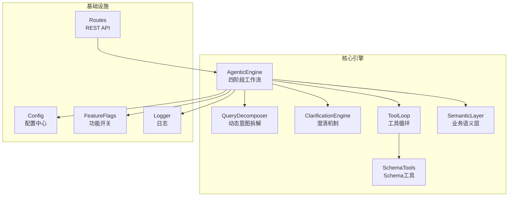
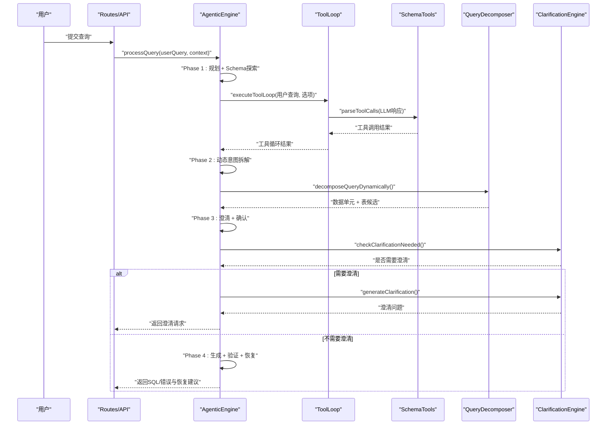
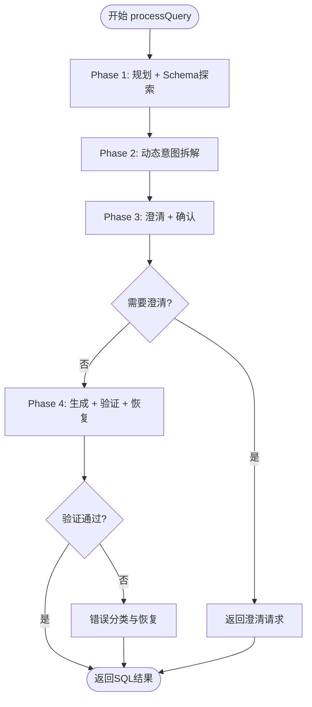
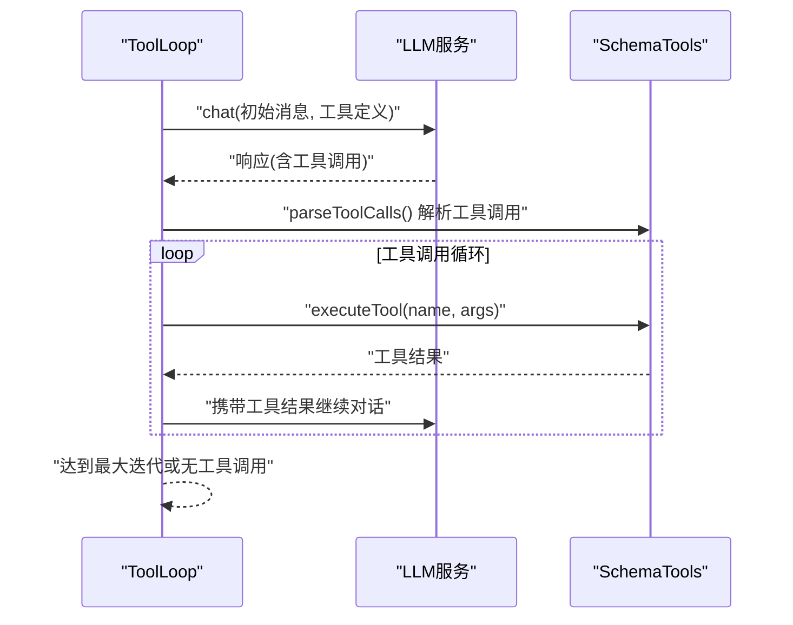
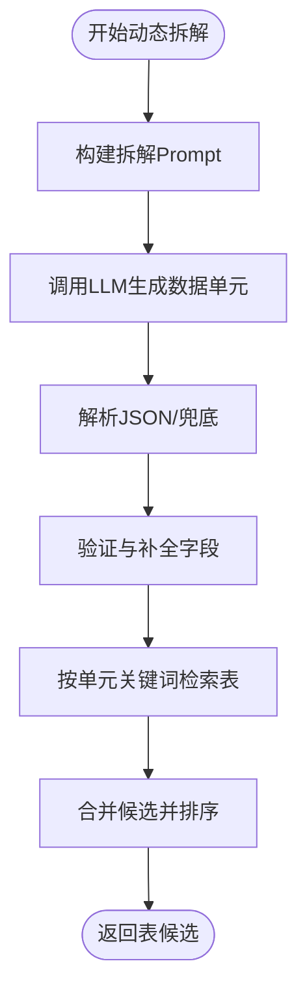
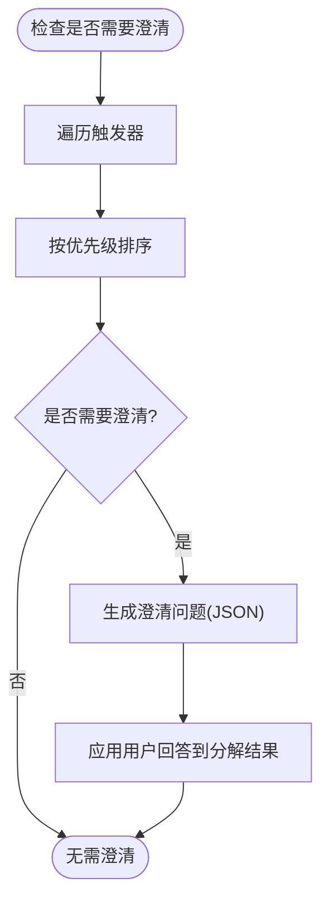
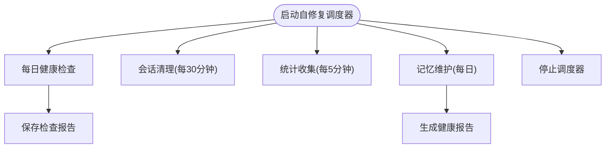
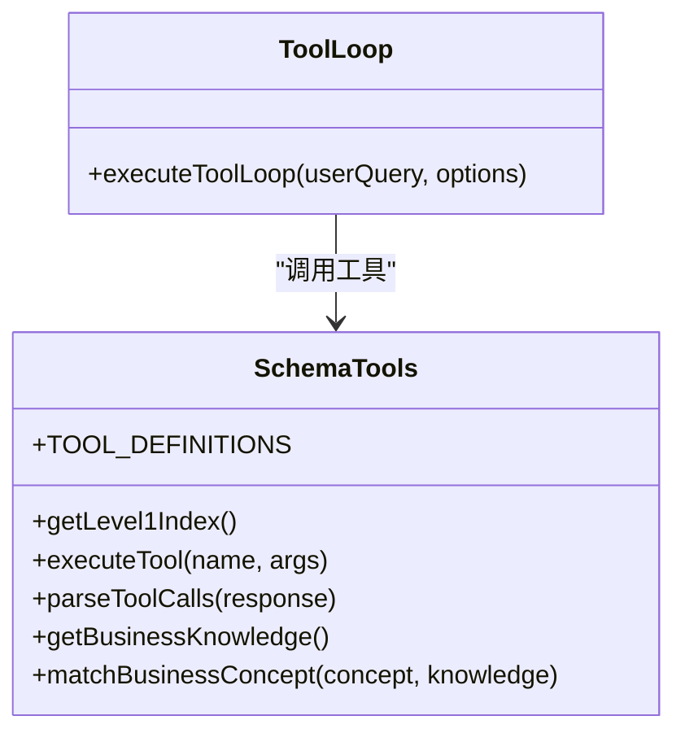
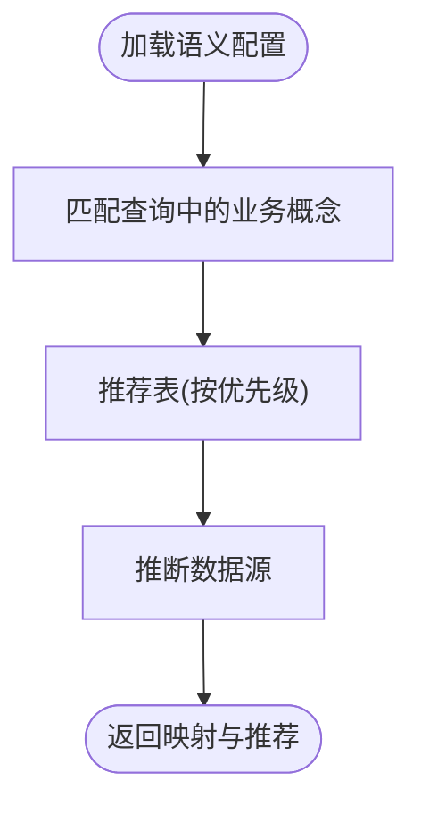
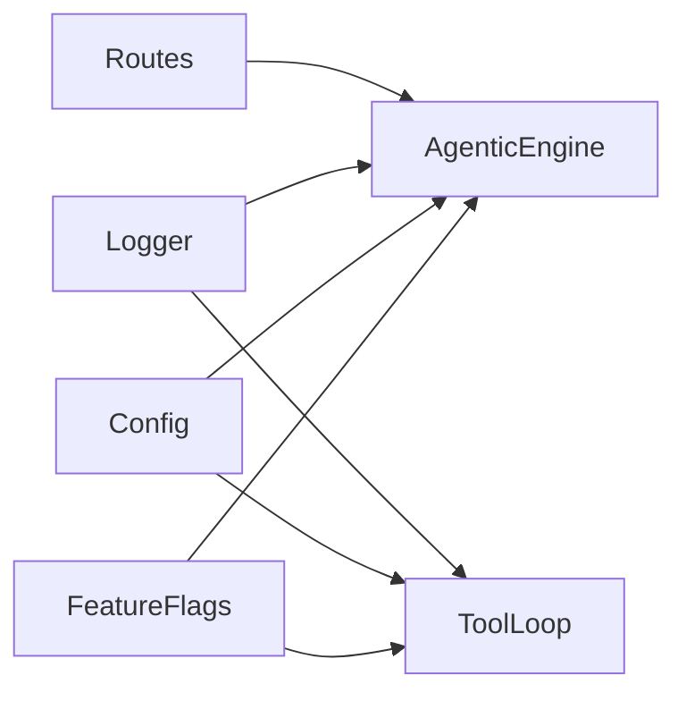

# 代理工作流引擎

<cite>
**本文引用的文件**
- [agenticEngine.js](file://backend/src/core/agenticEngine.js)
- [toolLoop.js](file://backend/src/core/toolLoop.js)
- [queryDecomposer.js](file://backend/src/core/queryDecomposer.js)
- [clarificationEngine.js](file://backend/src/core/clarificationEngine.js)
- [selfRepair.js](file://backend/src/core/selfRepair.js)
- [schemaTools.js](file://backend/src/core/schemaTools.js)
- [semanticLayer.js](file://backend/src/core/semanticLayer.js)
- [config.js](file://backend/src/core/config.js)
- [feature-flags.js](file://backend/config/feature-flags.js)
- [logger.js](file://backend/src/utils/logger.js)
- [routes.js](file://backend/src/core/routes.js)
- [package.json](file://backend/package.json)
</cite>

## 目录
1. [简介](#简介)
2. [项目结构](#项目结构)
3. [核心组件](#核心组件)
4. [架构总览](#架构总览)
5. [详细组件分析](#详细组件分析)
6. [依赖关系分析](#依赖关系分析)
7. [性能考量](#性能考量)
8. [故障排查指南](#故障排查指南)
9. [结论](#结论)
10. [附录](#附录)

## 简介
本技术文档面向“代理工作流引擎”，系统性阐述四阶段推理流程与工具循环机制的设计与实现。引擎通过“规划-探索-拆解-澄清-生成-验证-恢复”的闭环，显著提升查询准确性与成功率。文档重点覆盖：
- 四阶段推理流程：规划、工具增强的Schema探索、动态意图拆解、澄清与确认、生成、验证与恢复
- 工具循环机制：LLM驱动的工具调用循环，按需探索Schema，避免一次性传递全部Schema带来的成本与噪声
- 多阶段推理如何提升准确率：通过数据单元拆解、表候选合并、置信度驱动的澄清与恢复
- 工具循环的调度策略与资源管理：最大迭代次数、超时控制、消息历史管理
- 具体代码示例与使用模式：通过文件路径与行号定位实现位置，便于开发者快速定位与扩展

## 项目结构
后端采用模块化分层设计，核心模块位于 backend/src/core，工具与基础设施位于 backend/src/utils，前端位于 frontend。核心模块职责清晰，耦合度低，便于功能开关与演进。

图表来源
- [agenticEngine.js:1-653](file://backend/src/core/agenticEngine.js#L1-L653)
- [toolLoop.js:1-527](file://backend/src/core/toolLoop.js#L1-L527)
- [queryDecomposer.js:1-406](file://backend/src/core/queryDecomposer.js#L1-L406)
- [clarificationEngine.js:1-489](file://backend/src/core/clarificationEngine.js#L1-L489)
- [schemaTools.js:1-632](file://backend/src/core/schemaTools.js#L1-L632)
- [semanticLayer.js:1-532](file://backend/src/core/semanticLayer.js#L1-L532)
- [config.js:1-398](file://backend/src/core/config.js#L1-L398)
- [feature-flags.js:1-249](file://backend/config/feature-flags.js#L1-L249)
- [logger.js:1-442](file://backend/src/utils/logger.js#L1-L442)
- [routes.js:1-1037](file://backend/src/core/routes.js#L1-L1037)

章节来源
- [package.json:1-28](file://backend/package.json#L1-L28)

## 核心组件
- AgenticEngine：四阶段工作流的编排者，串联规划、Schema探索、意图拆解、澄清、SQL生成、验证与恢复
- ToolLoop：LLM工具循环执行器，支持多轮工具调用与消息历史管理
- QueryDecomposer：将复杂查询动态拆解为数据单元，按单元检索表并合并候选
- ClarificationEngine：基于置信度与场景触发器生成澄清问题，支持应用用户回答
- SelfRepair：系统自修复与定时任务调度，保障运行稳定性
- SchemaTools：LLM可用的Schema探索工具集合（search_tables、describe_table、search_knowledge、peek_table）
- SemanticLayer：业务语义层，将业务概念映射到物理表/字段
- Config/FeatureFlags/Logger/Routes：配置、功能开关、日志与API路由支撑

章节来源
- [agenticEngine.js:52-178](file://backend/src/core/agenticEngine.js#L52-L178)
- [toolLoop.js:57-185](file://backend/src/core/toolLoop.js#L57-L185)
- [queryDecomposer.js:38-70](file://backend/src/core/queryDecomposer.js#L38-L70)
- [clarificationEngine.js:196-232](file://backend/src/core/clarificationEngine.js#L196-L232)
- [selfRepair.js:60-125](file://backend/src/core/selfRepair.js#L60-L125)
- [schemaTools.js:40-124](file://backend/src/core/schemaTools.js#L40-L124)
- [semanticLayer.js:48-73](file://backend/src/core/semanticLayer.js#L48-L73)
- [config.js:16-398](file://backend/src/core/config.js#L16-L398)
- [feature-flags.js:16-249](file://backend/config/feature-flags.js#L16-L249)
- [logger.js:54-442](file://backend/src/utils/logger.js#L54-L442)
- [routes.js:35-94](file://backend/src/core/routes.js#L35-L94)

## 架构总览
四阶段工作流以AgenticEngine为核心，结合工具循环与语义层，形成Plan → Act → Observe的循环，配合验证与恢复机制，提升成功率与鲁棒性。

图表来源
- [agenticEngine.js:68-178](file://backend/src/core/agenticEngine.js#L68-L178)
- [toolLoop.js:57-185](file://backend/src/core/toolLoop.js#L57-L185)
- [queryDecomposer.js:38-70](file://backend/src/core/queryDecomposer.js#L38-L70)
- [clarificationEngine.js:196-272](file://backend/src/core/clarificationEngine.js#L196-L272)

## 详细组件分析

### 组件A：代理引擎（AgenticEngine）
- 四阶段流程编排：规划、Schema探索、动态意图拆解、澄清、SQL生成、验证与恢复
- 特征开关集成：通过功能开关决定是否启用工具循环、动态拆解、澄清引擎、Agentic工作流等
- 进度回调：在各阶段发送进度事件，便于前端展示
- 错误分类与恢复：根据错误类型（表不存在、语法错误）进行针对性修复或建议

图表来源
- [agenticEngine.js:68-178](file://backend/src/core/agenticEngine.js#L68-L178)
- [agenticEngine.js:345-621](file://backend/src/core/agenticEngine.js#L345-L621)

章节来源
- [agenticEngine.js:52-178](file://backend/src/core/agenticEngine.js#L52-L178)
- [agenticEngine.js:345-621](file://backend/src/core/agenticEngine.js#L345-L621)

### 组件B：工具循环（ToolLoop）
- 工具循环核心：构建初始消息（含系统提示与历史），调用LLM，解析工具调用，执行工具，将结果注入消息历史，直至无工具调用或达到最大迭代次数
- 超时与迭代限制：防止无限循环与长时间阻塞
- 意图识别与SQL生成：提供专用Prompt与解析逻辑，支持从响应中抽取JSON或SQL片段

图表来源
- [toolLoop.js:57-185](file://backend/src/core/toolLoop.js#L57-L185)
- [schemaTools.js:585-602](file://backend/src/core/schemaTools.js#L585-L602)

章节来源
- [toolLoop.js:57-185](file://backend/src/core/toolLoop.js#L57-L185)
- [schemaTools.js:40-124](file://backend/src/core/schemaTools.js#L40-L124)

### 组件C：查询分解器（QueryDecomposer）
- 动态拆解：将复杂查询拆解为数据单元，每个单元独立检索相关表，支持时间范围、指标、行为序列等多样化单元类型
- 表候选合并：按覆盖率与频率计算综合分数，优先推荐跨单元覆盖度高的表
- 关键词提取与搜索：从单元描述、指标、行为中提取关键词，提升表检索精度

图表来源
- [queryDecomposer.js:38-70](file://backend/src/core/queryDecomposer.js#L38-L70)
- [queryDecomposer.js:259-302](file://backend/src/core/queryDecomposer.js#L259-L302)
- [queryDecomposer.js:352-386](file://backend/src/core/queryDecomposer.js#L352-L386)

章节来源
- [queryDecomposer.js:24-202](file://backend/src/core/queryDecomposer.js#L24-L202)
- [queryDecomposer.js:259-302](file://backend/src/core/queryDecomposer.js#L259-L302)

### 组件D：澄清引擎（ClarificationEngine）
- 触发器体系：覆盖“无匹配表”“表歧义”“聚合来源不确定”“时间粒度不明确”“低置信度”等场景，按优先级排序
- 澄清问题生成：基于触发器与数据单元、表候选生成结构化问题与默认选项
- 应用澄清结果：根据澄清类型更新分解结果（表偏好、指标来源、时间粒度）

图表来源
- [clarificationEngine.js:196-232](file://backend/src/core/clarificationEngine.js#L196-L232)
- [clarificationEngine.js:246-272](file://backend/src/core/clarificationEngine.js#L246-L272)
- [clarificationEngine.js:388-426](file://backend/src/core/clarificationEngine.js#L388-L426)

章节来源
- [clarificationEngine.js:18-182](file://backend/src/core/clarificationEngine.js#L18-L182)
- [clarificationEngine.js:196-272](file://backend/src/core/clarificationEngine.js#L196-L272)
- [clarificationEngine.js:388-426](file://backend/src/core/clarificationEngine.js#L388-L426)

### 组件E：自修复机制（SelfRepair）
- 定时任务：每日健康检查、会话清理、统计收集、记忆维护
- 健康检查：数据库连接、向量数据库、查询统计、慢查询、活跃连接、系统资源
- 记忆维护：压缩与清理过期记忆，生成健康报告

图表来源
- [selfRepair.js:60-125](file://backend/src/core/selfRepair.js#L60-L125)
- [selfRepair.js:169-310](file://backend/src/core/selfRepair.js#L169-L310)
- [selfRepair.js:341-373](file://backend/src/core/selfRepair.js#L341-L373)
- [selfRepair.js:383-415](file://backend/src/core/selfRepair.js#L383-L415)

章节来源
- [selfRepair.js:60-125](file://backend/src/core/selfRepair.js#L60-L125)
- [selfRepair.js:169-310](file://backend/src/core/selfRepair.js#L169-L310)
- [selfRepair.js:341-415](file://backend/src/core/selfRepair.js#L341-L415)

### 组件F：Schema工具层（SchemaTools）
- 工具定义：search_tables、describe_table、search_knowledge、peek_table
- Level 1索引：表名+业务注释，用于初步筛选
- 业务概念匹配：对“老平台”“新平台”“充值”等概念进行映射

图表来源
- [schemaTools.js:40-124](file://backend/src/core/schemaTools.js#L40-L124)
- [schemaTools.js:565-602](file://backend/src/core/schemaTools.js#L565-L602)
- [toolLoop.js:57-185](file://backend/src/core/toolLoop.js#L57-L185)

章节来源
- [schemaTools.js:22-173](file://backend/src/core/schemaTools.js#L22-L173)
- [schemaTools.js:40-124](file://backend/src/core/schemaTools.js#L40-L124)

### 组件G：业务语义层（SemanticLayer）
- 概念匹配：对“老平台”“新平台”“注册/充值/登录”等业务概念进行匹配与映射
- 表推荐：基于匹配到的概念推荐主表、平台表、游戏表
- 数据源映射：推断数据源（如new_tzpingtaiold/new_tzpingtai）

图表来源
- [semanticLayer.js:48-73](file://backend/src/core/semanticLayer.js#L48-L73)
- [semanticLayer.js:134-167](file://backend/src/core/semanticLayer.js#L134-L167)
- [semanticLayer.js:238-306](file://backend/src/core/semanticLayer.js#L238-L306)
- [semanticLayer.js:367-386](file://backend/src/core/semanticLayer.js#L367-L386)

章节来源
- [semanticLayer.js:48-115](file://backend/src/core/semanticLayer.js#L48-L115)
- [semanticLayer.js:134-306](file://backend/src/core/semanticLayer.js#L134-L306)

## 依赖关系分析
- 功能开关：feature-flags.js集中控制各Phase开关，AgenticEngine与ToolLoop按开关选择执行路径
- 配置中心：config.js提供LLM、数据库、安全、日志、Schema、长期记忆等配置
- 日志：logger.js统一输出，支持trace、debug、info、warn、error与追踪会话
- API路由：routes.js提供健康检查、Schema查询、会话管理、偏好与评估接口

图表来源
- [feature-flags.js:16-96](file://backend/config/feature-flags.js#L16-L96)
- [config.js:16-398](file://backend/src/core/config.js#L16-L398)
- [logger.js:54-442](file://backend/src/utils/logger.js#L54-L442)
- [routes.js:35-94](file://backend/src/core/routes.js#L35-L94)

章节来源
- [feature-flags.js:16-200](file://backend/config/feature-flags.js#L16-L200)
- [config.js:16-398](file://backend/src/core/config.js#L16-L398)
- [logger.js:54-442](file://backend/src/utils/logger.js#L54-L442)
- [routes.js:35-94](file://backend/src/core/routes.js#L35-L94)

## 性能考量
- 工具循环限制：最大迭代次数与超时，避免LLM陷入死循环或长时间阻塞
- 表候选合并：覆盖率与频率双权重，减少不必要的JOIN与冗余扫描
- 日志级别与追踪：按需开启trace/debug，避免过度日志影响性能
- 配置阈值：查询超时、最大行数、禁止关键字等安全阈值，防止资源滥用
- 定时任务：统计收集与会话清理按固定周期执行，避免实时路径上的开销

## 故障排查指南
- 健康检查：通过/routes/health与/routes/health/detail检查数据库、Schema、SSE连接状态
- 日志追踪：使用logger.startTrace/traceStep/endTrace记录关键步骤耗时与状态
- 自修复：关注selfRepair的每日检查报告与慢查询阈值，及时发现系统瓶颈
- SQL验证：验证阶段包含基本语法、安全关键字与表存在性检查，失败时查看checks与错误汇总
- 恢复策略：根据错误类型（表不存在、语法错误）采取替换表或请求LLM修正

章节来源
- [routes.js:72-137](file://backend/src/core/routes.js#L72-L137)
- [logger.js:322-408](file://backend/src/utils/logger.js#L322-L408)
- [selfRepair.js:169-310](file://backend/src/core/selfRepair.js#L169-L310)
- [agenticEngine.js:440-497](file://backend/src/core/agenticEngine.js#L440-L497)
- [agenticEngine.js:518-613](file://backend/src/core/agenticEngine.js#L518-L613)

## 结论
代理工作流引擎通过“规划-工具探索-动态拆解-澄清-生成-验证-恢复”的闭环，显著提升了复杂查询的准确率与成功率。工具循环机制按需探索Schema，避免一次性传递全部Schema带来的成本与噪声；多阶段推理与置信度驱动的澄清与恢复进一步增强了系统的鲁棒性。借助功能开关与配置中心，系统具备良好的可演进性与可控性。

## 附录
- 使用模式与示例（代码路径）
  - 四阶段流程入口：[agenticEngine.js:68-178](file://backend/src/core/agenticEngine.js#L68-L178)
  - 工具循环执行：[toolLoop.js:57-185](file://backend/src/core/toolLoop.js#L57-L185)
  - 动态意图拆解：[queryDecomposer.js:38-70](file://backend/src/core/queryDecomposer.js#L38-L70)
  - 表候选合并：[queryDecomposer.js:352-386](file://backend/src/core/queryDecomposer.js#L352-L386)
  - 澄清触发与生成：[clarificationEngine.js:196-272](file://backend/src/core/clarificationEngine.js#L196-L272)
  - 自修复调度：[selfRepair.js:60-125](file://backend/src/core/selfRepair.js#L60-L125)
  - Schema工具定义：[schemaTools.js:40-124](file://backend/src/core/schemaTools.js#L40-L124)
  - 业务语义层加载：[semanticLayer.js:48-73](file://backend/src/core/semanticLayer.js#L48-L73)
  - 配置中心：[config.js:16-398](file://backend/src/core/config.js#L16-L398)
  - 功能开关：[feature-flags.js:16-200](file://backend/config/feature-flags.js#L16-L200)
  - 日志追踪：[logger.js:322-408](file://backend/src/utils/logger.js#L322-L408)
  - API路由：[routes.js:72-137](file://backend/src/core/routes.js#L72-L137)