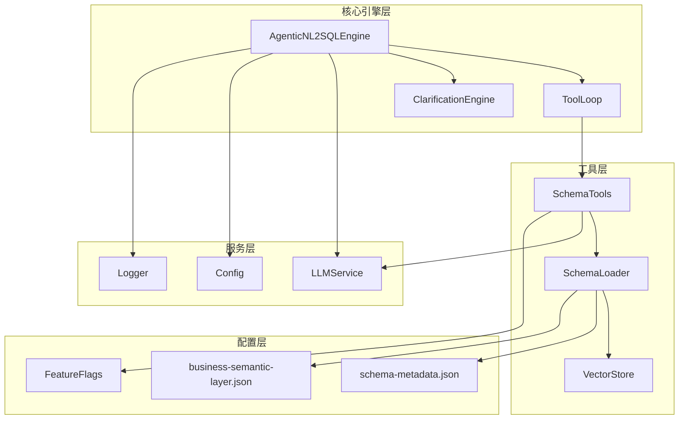
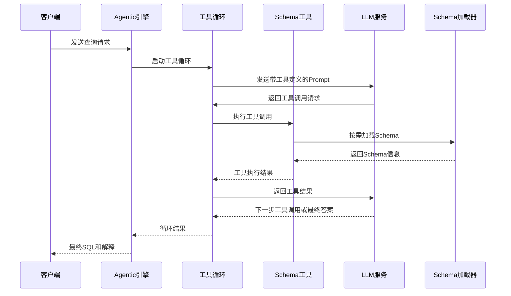
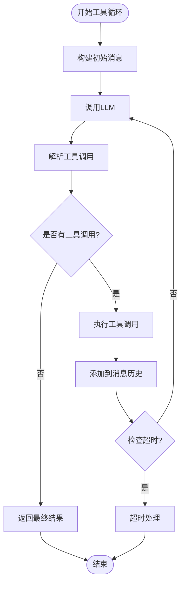
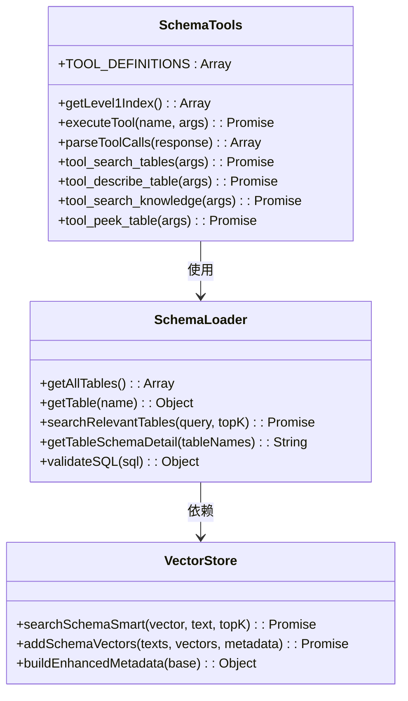
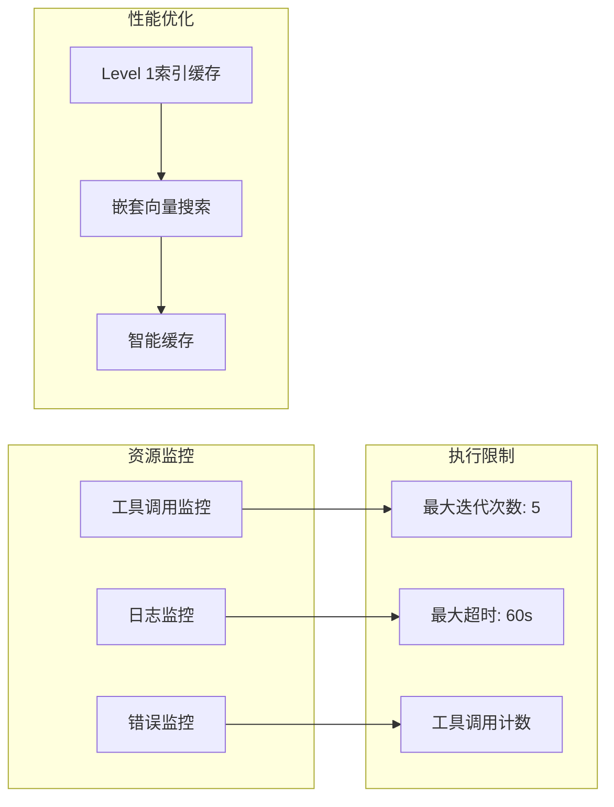
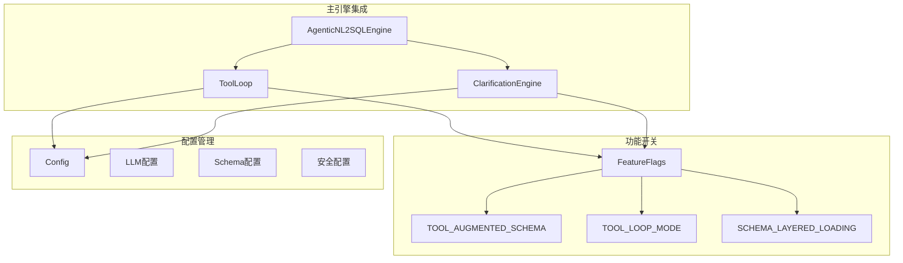
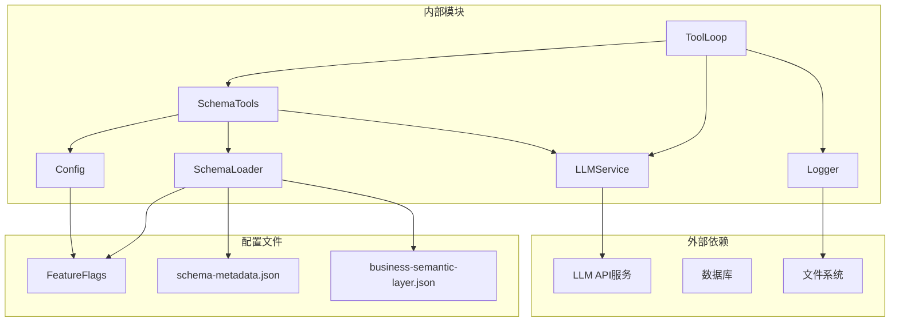
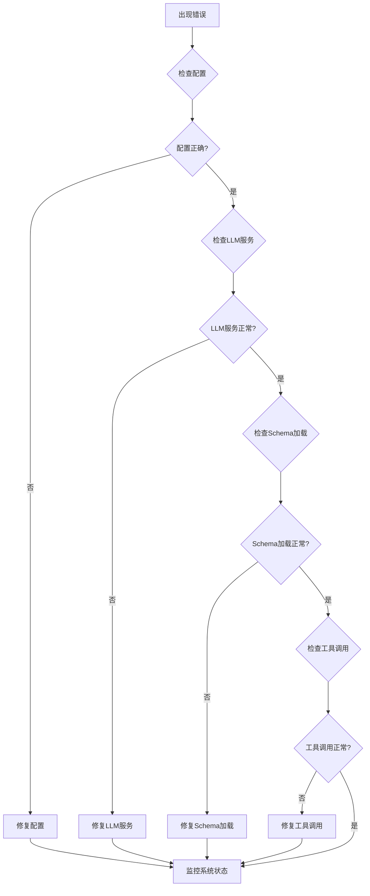

# 工具循环调度机制

<cite>
**本文档引用的文件**
- [toolLoop.js](file://backend/src/core/toolLoop.js)
- [agenticEngine.js](file://backend/src/core/agenticEngine.js)
- [schemaTools.js](file://backend/src/core/schemaTools.js)
- [schemaLoader.js](file://backend/src/core/schemaLoader.js)
- [llmService.js](file://backend/src/core/llmService.js)
- [config.js](file://backend/src/core/config.js)
- [logger.js](file://backend/src/utils/logger.js)
- [feature-flags.js](file://backend/config/feature-flags.js)
- [clarificationEngine.js](file://backend/src/core/clarificationEngine.js)
- [vectorStore.js](file://backend/src/memory/vectorStore.js)
- [schema-metadata.json](file://backend/config/schema-metadata.json)
- [business-semantic-layer.json](file://backend/config/business-semantic-layer.json)
</cite>

## 目录
1. [简介](#简介)
2. [项目结构](#项目结构)
3. [核心组件](#核心组件)
4. [架构概览](#架构概览)
5. [详细组件分析](#详细组件分析)
6. [依赖关系分析](#依赖关系分析)
7. [性能考量](#性能考量)
8. [故障排查指南](#故障排查指南)
9. [结论](#结论)
10. [附录](#附录)

## 简介

工具循环调度机制是代理工作流引擎的核心组成部分，实现了基于LLM工具调用的自动化Schema探索和SQL生成流程。该机制通过"按需索取"的方式，避免了传统NL2SQL系统中一次性传输大量Schema信息的开销，显著提升了系统的可扩展性和响应效率。

该机制采用四阶段工作流：Schema探索、意图识别、SQL生成和验证恢复。在每个阶段中，工具循环都能根据上下文动态调整策略，实现智能化的资源管理和执行监控。

## 项目结构

NL2SQL项目的工具循环调度机制分布在多个核心模块中，形成了清晰的分层架构：

**图表来源**
- [agenticEngine.js:1-653](file://backend/src/core/agenticEngine.js#L1-L653)
- [toolLoop.js:1-527](file://backend/src/core/toolLoop.js#L1-L527)
- [schemaTools.js:1-632](file://backend/src/core/schemaTools.js#L1-L632)

**章节来源**
- [agenticEngine.js:1-653](file://backend/src/core/agenticEngine.js#L1-L653)
- [toolLoop.js:1-527](file://backend/src/core/toolLoop.js#L1-L527)
- [schemaTools.js:1-632](file://backend/src/core/schemaTools.js#L1-L632)

## 核心组件

### 工具循环处理器

工具循环处理器是整个机制的核心，负责管理LLM与Schema工具之间的交互循环。其主要职责包括：

- **消息构建**：根据上下文构建初始Prompt和系统提示词
- **工具调用解析**：解析LLM返回的工具调用请求
- **工具执行**：协调Schema工具的执行
- **循环控制**：管理工具调用的迭代次数和超时

### Schema工具层

Schema工具层提供了LLM可调用的Schema探索工具，实现了"按需索取"的智能Schema加载机制：

- **search_tables**：根据关键词搜索相关表
- **describe_table**：获取指定表的详细字段信息
- **search_knowledge**：查询业务概念的定义和映射
- **peek_table**：查看表的结构预览

### Agentic引擎

Agentic引擎整合了四个阶段的工作流，实现了多步推理和自我修正能力：

- **规划阶段**：制定查询执行策略
- **Schema发现**：使用工具循环探索数据库结构
- **意图分解**：动态拆解查询意图
- **生成验证**：生成SQL并进行安全验证

**章节来源**
- [toolLoop.js:41-185](file://backend/src/core/toolLoop.js#L41-L185)
- [schemaTools.js:36-124](file://backend/src/core/schemaTools.js#L36-L124)
- [agenticEngine.js:52-178](file://backend/src/core/agenticEngine.js#L52-L178)

## 架构概览

工具循环调度机制采用了分层架构设计，确保了系统的可扩展性和可维护性：

**图表来源**
- [agenticEngine.js:68-178](file://backend/src/core/agenticEngine.js#L68-L178)
- [toolLoop.js:57-185](file://backend/src/core/toolLoop.js#L57-L185)
- [schemaTools.js:565-577](file://backend/src/core/schemaTools.js#L565-L577)

## 详细组件分析

### 工具循环调度算法

工具循环调度算法实现了智能的迭代控制和资源管理：

**图表来源**
- [toolLoop.js:80-185](file://backend/src/core/toolLoop.js#L80-L185)

#### 调度策略特点

1. **最大迭代限制**：防止无限循环，确保系统稳定性
2. **超时控制**：防止长时间占用资源
3. **工具调用解析**：支持批量工具调用的有序执行
4. **错误恢复**：提供完善的错误处理和恢复机制

### Schema探索机制

Schema探索机制实现了智能的按需加载策略：

**图表来源**
- [schemaTools.js:1-632](file://backend/src/core/schemaTools.js#L1-L632)
- [schemaLoader.js:1-800](file://backend/src/core/schemaLoader.js#L1-L800)
- [vectorStore.js:1-800](file://backend/src/memory/vectorStore.js#L1-L800)

#### 探索策略

1. **Level 1索引缓存**：提供快速的初步表筛选
2. **语义搜索**：基于向量相似度的智能表匹配
3. **业务概念映射**：将自然语言概念映射到具体表结构
4. **按需加载**：仅在需要时加载详细的Schema信息

### 资源管理机制

资源管理机制确保了系统在高负载下的稳定运行：

**图表来源**
- [toolLoop.js:26-36](file://backend/src/core/toolLoop.js#L26-L36)
- [schemaTools.js:25-31](file://backend/src/core/schemaTools.js#L25-L31)
- [vectorStore.js:452-538](file://backend/src/memory/vectorStore.js#L452-L538)

#### 监控指标

1. **工具调用统计**：记录每次工具调用的详细信息
2. **执行时间监控**：跟踪每个阶段的执行耗时
3. **错误率统计**：监控工具调用的成功率
4. **资源使用情况**：跟踪内存和CPU使用情况

### 集成与扩展

工具循环机制与主引擎的集成采用了松耦合的设计：

**图表来源**
- [agenticEngine.js:23-29](file://backend/src/core/agenticEngine.js#L23-L29)
- [feature-flags.js:16-96](file://backend/config/feature-flags.js#L16-L96)
- [config.js:16-398](file://backend/src/core/config.js#L16-L398)

**章节来源**
- [toolLoop.js:1-527](file://backend/src/core/toolLoop.js#L1-L527)
- [schemaTools.js:1-632](file://backend/src/core/schemaTools.js#L1-L632)
- [agenticEngine.js:1-653](file://backend/src/core/agenticEngine.js#L1-L653)

## 依赖关系分析

工具循环调度机制的依赖关系体现了清晰的分层架构：

**图表来源**
- [toolLoop.js:16-21](file://backend/src/core/toolLoop.js#L16-L21)
- [schemaTools.js:17-20](file://backend/src/core/schemaTools.js#L17-L20)
- [schemaLoader.js:15-27](file://backend/src/core/schemaLoader.js#L15-L27)

### 模块耦合度

1. **低耦合设计**：各模块间通过明确定义的接口交互
2. **可替换性**：LLM服务和存储后端可以灵活替换
3. **向后兼容**：配置变更不影响核心功能

**章节来源**
- [toolLoop.js:1-527](file://backend/src/core/toolLoop.js#L1-L527)
- [schemaTools.js:1-632](file://backend/src/core/schemaTools.js#L1-L632)
- [schemaLoader.js:1-800](file://backend/src/core/schemaLoader.js#L1-L800)

## 性能考量

工具循环调度机制在设计时充分考虑了性能优化：

### 缓存策略

1. **Level 1索引缓存**：缓存表的基本信息，减少Schema加载开销
2. **向量存储缓存**：利用LanceDB实现高效的语义搜索
3. **工具调用结果缓存**：避免重复的工具调用

### 并发控制

1. **最大并发限制**：通过配置控制同时进行的工具调用数量
2. **超时机制**：防止长时间阻塞影响系统响应
3. **资源回收**：及时释放不再使用的资源

### 优化建议

1. **批量工具调用**：合并多个相关的工具调用减少往返次数
2. **智能预加载**：基于历史数据预测可能需要的Schema信息
3. **增量更新**：仅更新发生变化的Schema信息

## 故障排查指南

### 常见问题诊断

### 调试技巧

1. **启用详细日志**：通过配置调整日志级别获取更多调试信息
2. **监控工具调用**：分析工具调用的耗时和成功率
3. **性能基准测试**：定期测试系统在不同负载下的表现

**章节来源**
- [logger.js:26-44](file://backend/src/utils/logger.js#L26-L44)
- [config.js:195-213](file://backend/src/core/config.js#L195-L213)
- [toolLoop.js:176-184](file://backend/src/core/toolLoop.js#L176-L184)

## 结论

工具循环调度机制通过智能化的资源管理和执行监控，实现了高效、稳定的NL2SQL转换流程。该机制的主要优势包括：

1. **智能资源管理**：按需加载Schema信息，避免资源浪费
2. **强大的扩展性**：支持自定义工具和配置
3. **完善的监控体系**：提供全面的执行状态跟踪
4. **灵活的集成方式**：与主引擎无缝集成

该机制为开发者提供了清晰的扩展路径，可以根据具体需求定制工具、调整配置参数，并实施针对性的性能优化策略。

## 附录

### 配置参数说明

| 参数名称 | 类型 | 默认值 | 描述 |
|---------|------|--------|------|
| MAX_TOOL_ITERATIONS | Number | 5 | 工具循环的最大迭代次数 |
| TOOL_LOOP_TIMEOUT | Number | 60000 | 工具循环超时时间（毫秒） |
| LLM_API_BASE | String | https://api.openai.com/v1 | LLM API基础URL |
| LLM_MODEL | String | gpt-4 | 默认使用的模型名称 |
| SCHEMA_CACHE_EXPIRE_TIME | Number | 3600000 | Schema缓存过期时间 |

### 扩展指导

1. **自定义工具集成**：通过TOOL_DEFINITIONS添加新的工具定义
2. **配置参数调整**：根据实际需求调整超时和迭代限制
3. **监控指标扩展**：添加新的监控指标以适应特定场景
4. **性能优化策略**：实施缓存策略和并发控制优化

**章节来源**
- [config.js:26-130](file://backend/src/core/config.js#L26-L130)
- [schemaTools.js:40-124](file://backend/src/core/schemaTools.js#L40-L124)
- [toolLoop.js:26-36](file://backend/src/core/toolLoop.js#L26-L36)