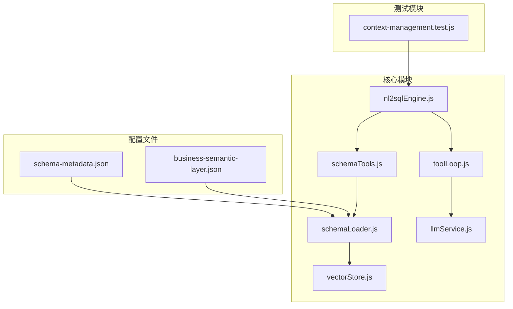
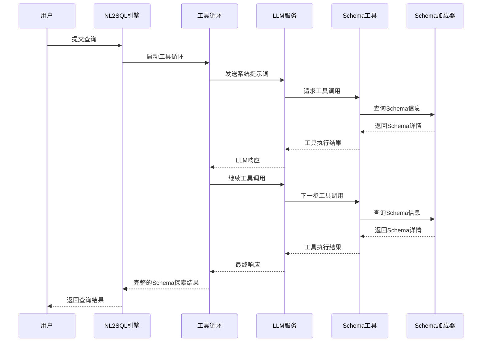
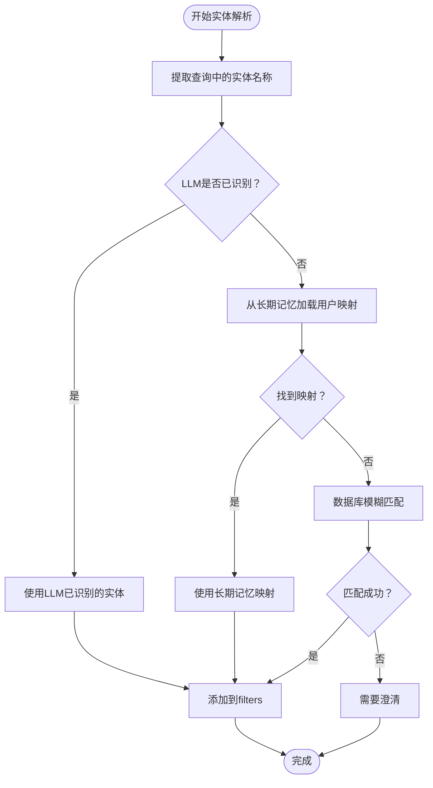
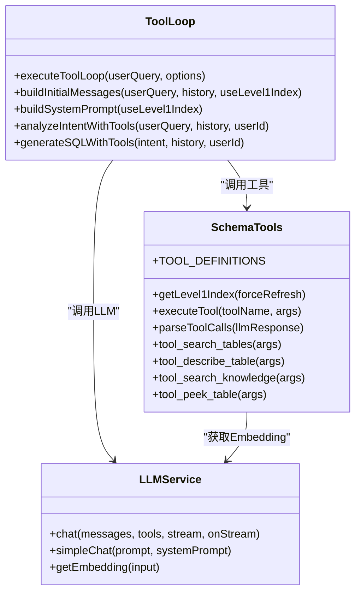
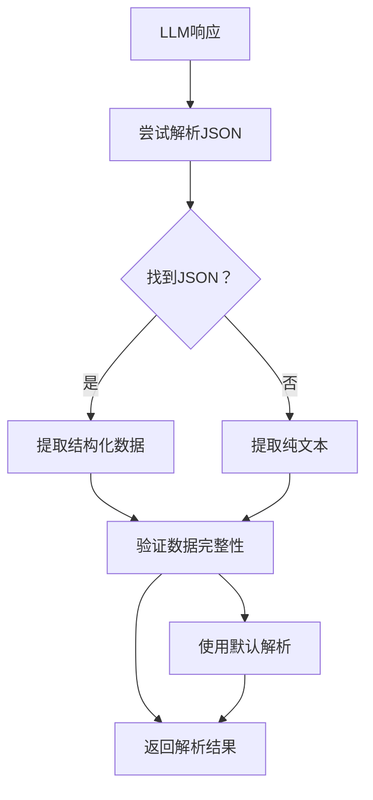
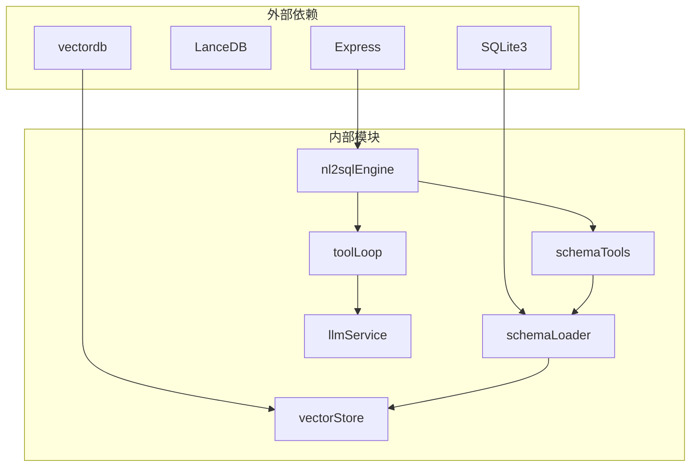

# 阶段一：规划与Schema发现

<cite>
**本文档引用的文件**
- [nl2sqlEngine.js](file://backend/src/core/nl2sqlEngine.js)
- [schemaTools.js](file://backend/src/core/schemaTools.js)
- [toolLoop.js](file://backend/src/core/toolLoop.js)
- [schemaLoader.js](file://backend/src/core/schemaLoader.js)
- [llmService.js](file://backend/src/core/llmService.js)
- [queryDecomposer.js](file://backend/src/core/queryDecomposer.js)
- [schema-metadata.json](file://backend/config/schema-metadata.json)
- [business-semantic-layer.json](file://backend/config/business-semantic-layer.json)
- [vectorStore.js](file://backend/src/memory/vectorStore.js)
- [context-management.test.js](file://backend/test/context-management.test.js)
</cite>

## 目录
1. [简介](#简介)
2. [项目结构](#项目结构)
3. [核心组件](#核心组件)
4. [架构概览](#架构概览)
5. [详细组件分析](#详细组件分析)
6. [依赖关系分析](#依赖关系分析)
7. [性能考量](#性能考量)
8. [故障排除指南](#故障排除指南)
9. [结论](#结论)

## 简介

阶段一的代理工作流引擎专注于规划阶段的查询分析和执行计划制定过程。该阶段实现了两个核心功能：

1. **规划阶段的查询分析**：包括实体识别、筛选条件分析、聚合计算需求识别等
2. **Schema发现阶段**：利用工具增强的Schema探索机制，实现按需索取的Schema探索

该系统采用工具增强的Schema发现方法，通过LLM与数据库Schema工具的交互，实现智能化的表和字段探索，相比传统的Schema发现方法具有更高的灵活性和准确性。

## 项目结构

**图表来源**
- [nl2sqlEngine.js:1-800](file://backend/src/core/nl2sqlEngine.js#L1-L800)
- [schemaTools.js:1-632](file://backend/src/core/schemaTools.js#L1-L632)
- [toolLoop.js:1-527](file://backend/src/core/toolLoop.js#L1-L527)

**章节来源**
- [nl2sqlEngine.js:1-800](file://backend/src/core/nl2sqlEngine.js#L1-L800)
- [schemaTools.js:1-632](file://backend/src/core/schemaTools.js#L1-L632)
- [toolLoop.js:1-527](file://backend/src/core/toolLoop.js#L1-L527)

## 核心组件

### 1. NL2SQL核心引擎

NL2SQL核心引擎负责整个自然语言到SQL转换流程的协调和管理。它集成了多个子模块，包括实体解析、意图识别、SQL生成等功能。

**主要功能特性：**
- 意图识别和澄清机制
- 实体解析和映射
- SQL生成和验证
- 错误处理和恢复

### 2. Schema工具层

Schema工具层提供了LLM可调用的Schema探索工具，实现"按需索取"而非"一次性灌输"的Schema探索策略。

**核心工具：**
- `search_tables(keyword)` - 根据关键词搜索相关表
- `describe_table(tableName)` - 获取指定表的详细字段信息
- `search_knowledge(concept)` - 查询业务概念的定义和映射
- `peek_table(tableName, limit)` - 查看表的前N行样例数据

### 3. 工具循环处理器

工具循环处理器实现了LLM的工具调用循环机制，确保Schema探索过程的自动化和智能化。

**工作流程：**
1. 构建初始Prompt（包含Level 1索引和工具定义）
2. 调用LLM
3. 解析LLM的工具调用请求
4. 执行工具调用
5. 将结果返回给LLM
6. 重复直到LLM不再调用工具

## 架构概览

**图表来源**
- [toolLoop.js:41-185](file://backend/src/core/toolLoop.js#L41-L185)
- [schemaTools.js:548-602](file://backend/src/core/schemaTools.js#L548-L602)

## 详细组件分析

### 规划阶段的查询分析

#### 实体识别与解析

规划阶段的核心是准确识别用户查询中的实体，并将其映射到数据库中的具体值。

**图表来源**
- [nl2sqlEngine.js:393-572](file://backend/src/core/nl2sqlEngine.js#L393-L572)

#### 筛选条件分析

系统能够智能识别和解析各种筛选条件，包括时间范围、业务术语、实体映射等。

**筛选条件类型：**
- 时间范围筛选：注册时间、登录时间等
- 业务术语筛选：老平台、新平台等
- 实体筛选：游戏ID、渠道ID等
- 聚合条件：累计充值、总消费等

#### 聚合计算需求识别

系统能够识别查询中的聚合计算需求，包括SUM、COUNT、AVG等聚合函数的应用场景。

**聚合场景：**
- 累计充值金额计算
- 用户数统计
- 平均消费金额
- 最大/最小值分析

**章节来源**
- [nl2sqlEngine.js:244-572](file://backend/src/core/nl2sqlEngine.js#L244-L572)

### Schema发现阶段的工具增强机制

#### Level 1索引机制

Level 1索引是Schema发现的基础，仅包含表名和业务注释，用于初步筛选。

**Level 1索引特点：**
- 极简结构：仅包含表名、中文描述
- 缓存机制：默认缓存1小时
- 快速访问：支持快速表名检索

#### 工具循环执行策略

工具循环实现了智能的Schema探索策略，通过LLM的工具调用实现按需探索。

**图表来源**
- [toolLoop.js:511-527](file://backend/src/core/toolLoop.js#L511-L527)
- [schemaTools.js:608-632](file://backend/src/core/schemaTools.js#L608-L632)

#### 业务知识库集成

系统集成了业务知识库，能够理解和解析业务术语，如"老平台"、"新平台"、"累计充值"等。

**知识库覆盖的业务概念：**
- 平台相关：老平台、新平台
- 充值相关：累计充值、充值
- 注册相关：注册
- 登录相关：登录
- 聊天相关：聊天
- 角色相关：创角

**章节来源**
- [schemaTools.js:395-542](file://backend/src/core/schemaTools.js#L395-L542)
- [toolLoop.js:296-344](file://backend/src/core/toolLoop.js#L296-L344)

### JSON响应解析机制

系统实现了完善的JSON响应解析机制，支持从LLM响应中提取结构化数据。

**图表来源**
- [toolLoop.js:352-386](file://backend/src/core/toolLoop.js#L352-L386)

**默认计划回退策略：**

当JSON解析失败时，系统采用以下回退策略：

1. **文本解析**：从响应中提取SQL语句
2. **基本意图**：返回包含基本查询信息的意图对象
3. **置信度降级**：将置信度设置为较低值
4. **错误记录**：记录解析失败的日志信息

**章节来源**
- [toolLoop.js:478-505](file://backend/src/core/toolLoop.js#L478-L505)

### 传统Schema发现方法对比

| 特性 | 传统方法 | 工具增强方法 |
|------|----------|-------------|
| **Schema加载** | 一次性加载所有Schema | 按需加载，减少内存占用 |
| **探索方式** | 预设固定流程 | LLM驱动的智能探索 |
| **交互模式** | 单向信息传递 | 双向工具调用循环 |
| **灵活性** | 固定模板 | 动态适配不同查询 |
| **准确性** | 依赖预设规则 | 基于语义理解的匹配 |
| **性能** | 内存占用高 | 按需计算，高效 |

**章节来源**
- [schemaLoader.js:562-709](file://backend/src/core/schemaLoader.js#L562-L709)
- [schemaTools.js:225-256](file://backend/src/core/schemaTools.js#L225-L256)

## 依赖关系分析

**图表来源**
- [package.json:10-20](file://backend/package.json#L10-L20)

**章节来源**
- [package.json:1-28](file://backend/package.json#L1-L28)

## 性能考量

### 1. 缓存策略

系统采用了多层次的缓存策略来优化性能：

- **Level 1索引缓存**：默认缓存1小时
- **Schema向量缓存**：基于LanceDB的向量存储
- **工具调用缓存**：避免重复的工具调用

### 2. Token预算管理

为了控制LLM调用成本，系统实现了Token预算管理：

- **上下文预算**：动态计算可用Token数量
- **历史裁剪**：自动裁剪过长的历史记录
- **摘要机制**：对长对话进行摘要处理

### 3. 并发控制

系统通过以下机制控制并发：

- **最大迭代次数**：防止无限循环
- **超时控制**：60秒超时保护
- **重试机制**：自动重试失败的请求

## 故障排除指南

### 常见问题及解决方案

#### 1. LLM响应解析失败

**症状：** JSON解析错误，返回基本意图

**解决方案：**
- 检查LLM响应格式
- 验证JSON结构完整性
- 使用默认解析策略

#### 2. Schema探索超时

**症状：** 工具循环超时，返回部分结果

**解决方案：**
- 增加超时时间配置
- 优化工具调用顺序
- 检查网络连接稳定性

#### 3. 实体解析失败

**症状：** 无法将用户输入映射到实体

**解决方案：**
- 检查长期记忆数据
- 验证数据库连接
- 使用模糊匹配兜底

#### 4. Token预算不足

**症状：** 上下文过长，触发预算警告

**解决方案：**
- 实施历史裁剪
- 使用对话摘要
- 调整预算阈值

**章节来源**
- [context-management.test.js:43-133](file://backend/test/context-management.test.js#L43-L133)

## 结论

阶段一的代理工作流引擎成功实现了规划阶段的查询分析和Schema发现功能。通过工具增强的Schema探索机制，系统能够在保证准确性的同时，提供高效的查询处理能力。

**主要成就：**
1. **智能化实体解析**：支持多种实体类型的识别和映射
2. **灵活的Schema探索**：按需索取的工具调用机制
3. **完善的错误处理**：多层回退策略确保系统稳定性
4. **性能优化**：缓存、预算管理和并发控制机制

**未来发展方向：**
1. **增强的语义理解**：改进业务概念识别能力
2. **智能优化建议**：为用户提供查询优化建议
3. **多模态支持**：支持图片、语音等多模态输入
4. **实时性能监控**：提供系统性能和使用情况监控

该阶段为后续的动态意图分解、澄清确认和生成验证阶段奠定了坚实的基础，形成了完整的代理工作流体系。