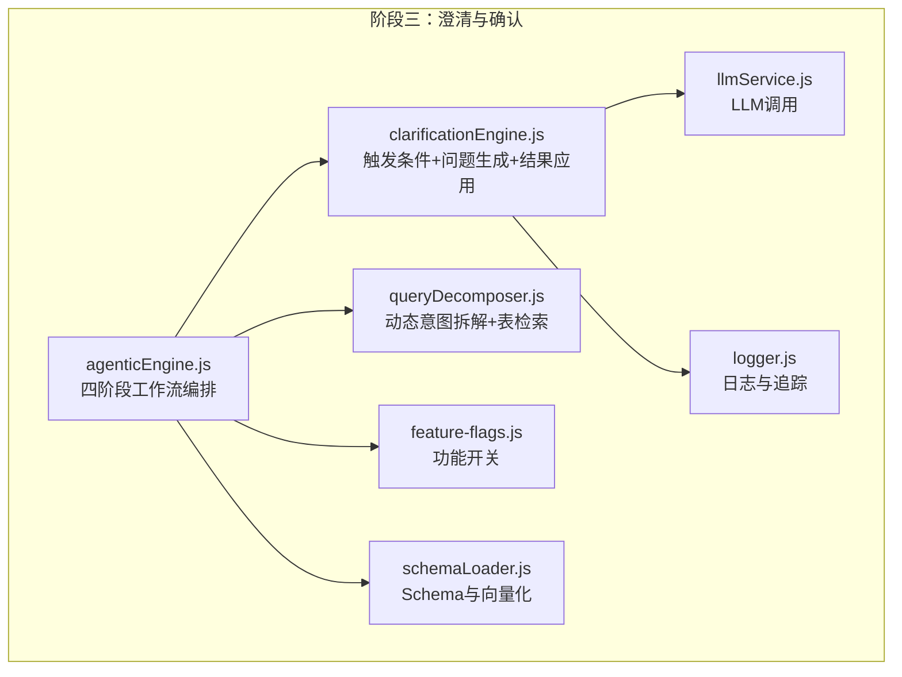
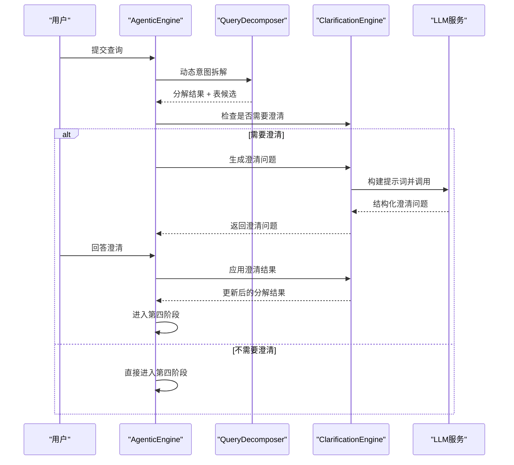
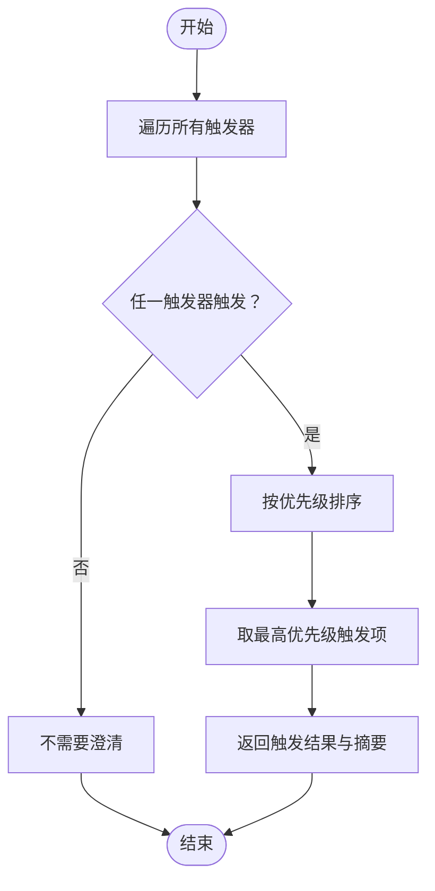
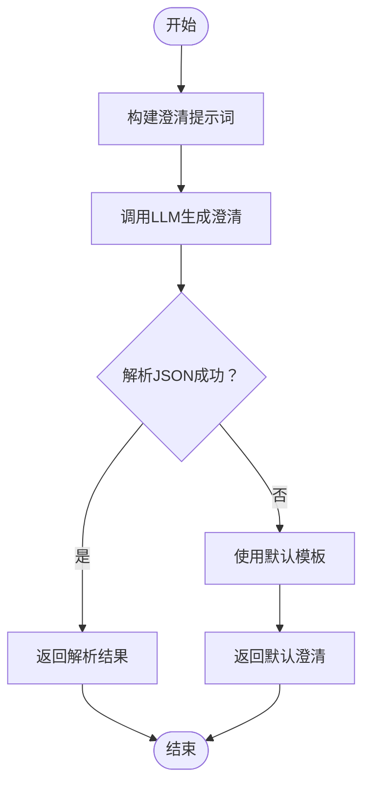
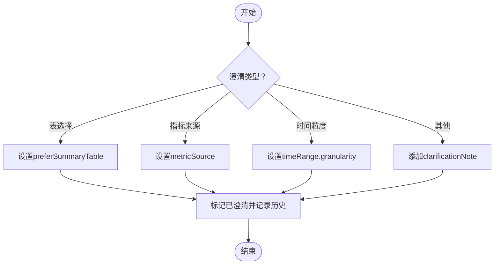
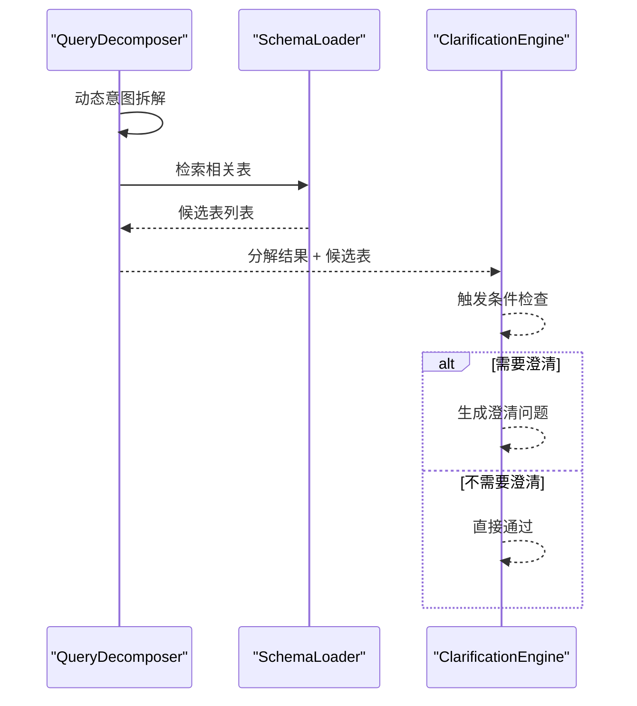
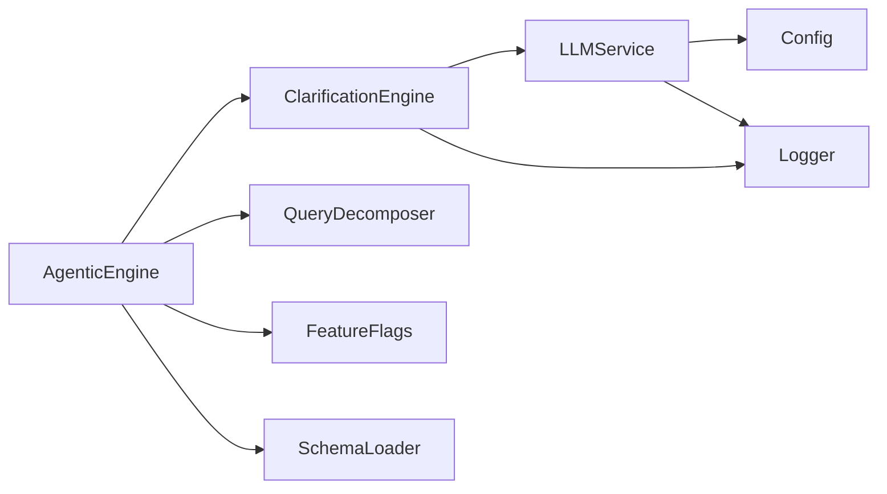

# 阶段三：澄清与确认

<cite>
**本文引用的文件**
- [clarificationEngine.js](file://backend/src/core/clarificationEngine.js)
- [agenticEngine.js](file://backend/src/core/agenticEngine.js)
- [queryDecomposer.js](file://backend/src/core/queryDecomposer.js)
- [nl2sqlEngine.js](file://backend/src/core/nl2sqlEngine.js)
- [feature-flags.js](file://backend/config/feature-flags.js)
- [llmService.js](file://backend/src/core/llmService.js)
- [logger.js](file://backend/src/utils/logger.js)
- [schemaLoader.js](file://backend/src/core/schemaLoader.js)
</cite>

## 目录
1. [简介](#简介)
2. [项目结构](#项目结构)
3. [核心组件](#核心组件)
4. [架构总览](#架构总览)
5. [详细组件分析](#详细组件分析)
6. [依赖关系分析](#依赖关系分析)
7. [性能考量](#性能考量)
8. [故障排查指南](#故障排查指南)
9. [结论](#结论)
10. [附录](#附录)

## 简介
本阶段聚焦“澄清与确认”机制，旨在在查询意图拆解与表检索后，当系统检测到不确定性（如数据单元无匹配表、同类型多候选表、聚合指标来源不明确、时间粒度不明确、置信度过低）时，主动生成友好且结构化的澄清问题，并将用户回答转化为可执行的分解结果变更，从而提升后续SQL生成的准确性与稳定性。该机制通过“触发条件判断—置信度评估—澄清问题生成—用户交互—澄清结果应用”的闭环，实现可控的不确定性处理与用户体验优化。

## 项目结构
- 后端核心模块：
  - 澄清引擎：负责触发条件判断、问题生成与结果应用
  - 代理引擎：整合前三阶段，驱动澄清流程
  - 查询分解器：将复杂查询拆解为数据需求单元并检索表候选
  - 功能开关：控制澄清引擎的启用与行为
  - LLM服务：提供统一的LLM调用能力
  - 日志工具：提供结构化日志与追踪能力
  - Schema加载：提供表结构与向量化能力

**图表来源**
- [clarificationEngine.js:1-489](file://backend/src/core/clarificationEngine.js#L1-L489)
- [agenticEngine.js:1-653](file://backend/src/core/agenticEngine.js#L1-L653)
- [queryDecomposer.js:1-406](file://backend/src/core/queryDecomposer.js#L1-L406)
- [feature-flags.js:1-249](file://backend/config/feature-flags.js#L1-L249)
- [llmService.js:1-477](file://backend/src/core/llmService.js#L1-L477)
- [logger.js:1-442](file://backend/src/utils/logger.js#L1-L442)
- [schemaLoader.js:1-200](file://backend/src/core/schemaLoader.js#L1-L200)

**章节来源**
- [agenticEngine.js:1-653](file://backend/src/core/agenticEngine.js#L1-L653)
- [clarificationEngine.js:1-489](file://backend/src/core/clarificationEngine.js#L1-L489)
- [queryDecomposer.js:1-406](file://backend/src/core/queryDecomposer.js#L1-L406)
- [feature-flags.js:1-249](file://backend/config/feature-flags.js#L1-L249)
- [llmService.js:1-477](file://backend/src/core/llmService.js#L1-L477)
- [logger.js:1-442](file://backend/src/utils/logger.js#L1-L442)
- [schemaLoader.js:1-200](file://backend/src/core/schemaLoader.js#L1-L200)

## 核心组件
- 澄清触发器集合：定义五类触发条件（无匹配表、表歧义、聚合来源不确定、时间粒度不确定、置信度过低），每类包含检查函数、优先级、严重程度与消息模板
- 澄清检查器：遍历触发器，按优先级返回最高优先级触发项，避免一次性抛出过多问题
- 澄清问题生成器：基于分解结果与候选表构建提示词，调用LLM生成结构化澄清问题，包含问题文本、选项与默认推荐
- 澄清结果应用器：根据澄清类型将用户回答映射为分解结果的结构化变更（如偏好、指标来源、时间粒度），并记录历史

**章节来源**
- [clarificationEngine.js:26-182](file://backend/src/core/clarificationEngine.js#L26-L182)
- [clarificationEngine.js:196-232](file://backend/src/core/clarificationEngine.js#L196-L232)
- [clarificationEngine.js:246-272](file://backend/src/core/clarificationEngine.js#L246-L272)
- [clarificationEngine.js:377-426](file://backend/src/core/clarificationEngine.js#L377-L426)

## 架构总览
阶段三在代理引擎的四阶段工作流中处于第三阶段，其职责是在第二阶段“动态意图拆解”之后，基于分解结果与表候选进行不确定性评估，决定是否需要澄清。若需要，则生成澄清问题并等待用户回答；若不需要，则进入第四阶段“生成+验证+恢复”。

**图表来源**
- [agenticEngine.js:298-336](file://backend/src/core/agenticEngine.js#L298-L336)
- [clarificationEngine.js:246-272](file://backend/src/core/clarificationEngine.js#L246-L272)
- [llmService.js:318-356](file://backend/src/core/llmService.js#L318-L356)

**章节来源**
- [agenticEngine.js:298-336](file://backend/src/core/agenticEngine.js#L298-L336)
- [clarificationEngine.js:246-272](file://backend/src/core/clarificationEngine.js#L246-L272)
- [llmService.js:318-356](file://backend/src/core/llmService.js#L318-L356)

## 详细组件分析

### 澄清触发器与置信度评估
- 触发条件：
  - 无匹配表：当数据单元无法匹配到任何候选表时触发
  - 表歧义：同类型数据单元匹配到多个表时触发
  - 聚合来源不确定：同时存在原始表与汇总表时触发
  - 时间粒度不确定：时间单元缺少粒度信息时触发
  - 置信度过低：置信度低于阈值时触发
- 严重程度与优先级：不同触发器具有不同优先级与严重程度，系统仅返回最高优先级触发项，避免一次性抛出过多问题
- 置信度阈值：默认阈值为0.6，低于阈值即触发低置信度场景

**图表来源**
- [clarificationEngine.js:196-232](file://backend/src/core/clarificationEngine.js#L196-L232)

**章节来源**
- [clarificationEngine.js:26-182](file://backend/src/core/clarificationEngine.js#L26-L182)
- [clarificationEngine.js:196-232](file://backend/src/core/clarificationEngine.js#L196-L232)

### 澄清问题生成算法
- 提示词构建：将分解结果中的数据单元与候选表摘要化，结合触发原因与详细信息，生成结构化提示词
- LLM调用：通过简单聊天接口调用LLM，期望返回JSON格式的澄清问题（问题文本、选项、默认推荐、类型与解释）
- 响应解析：尝试提取JSON片段，失败时回退到默认模板
- 默认模板：针对不同触发器提供默认问题与选项，保证在异常情况下仍能返回可用澄清

**图表来源**
- [clarificationEngine.js:277-312](file://backend/src/core/clarificationEngine.js#L277-L312)
- [clarificationEngine.js:317-328](file://backend/src/core/clarificationEngine.js#L317-L328)
- [clarificationEngine.js:333-374](file://backend/src/core/clarificationEngine.js#L333-L374)

**章节来源**
- [clarificationEngine.js:277-312](file://backend/src/core/clarificationEngine.js#L277-L312)
- [clarificationEngine.js:317-328](file://backend/src/core/clarificationEngine.js#L317-L328)
- [clarificationEngine.js:333-374](file://backend/src/core/clarificationEngine.js#L333-L374)

### 澄清结果应用机制
- 类型分支：
  - 表选择：根据用户回答设置偏好（是否偏好汇总表）
  - 指标来源：设置指标来源（实时/汇总/自动）
  - 时间粒度：为所有时间单元设置粒度（天/周/月/自动）
  - 通用澄清：将用户回答作为备注保存
- 历史记录：记录问题、答案与时间戳，便于审计与回溯
- 标记与传播：标记已澄清，便于后续阶段使用

**图表来源**
- [clarificationEngine.js:388-426](file://backend/src/core/clarificationEngine.js#L388-L426)
- [clarificationEngine.js:431-471](file://backend/src/core/clarificationEngine.js#L431-L471)

**章节来源**
- [clarificationEngine.js:388-426](file://backend/src/core/clarificationEngine.js#L388-L426)
- [clarificationEngine.js:431-471](file://backend/src/core/clarificationEngine.js#L431-L471)

### 与查询分解与表检索的协作
- 分解阶段：将复杂查询拆解为数据需求单元，形成结构化分解结果
- 表检索：基于数据单元检索候选表，形成候选表列表
- 澄清阶段：在上述基础上进行不确定性评估，必要时生成澄清问题

**图表来源**
- [queryDecomposer.js:259-302](file://backend/src/core/queryDecomposer.js#L259-L302)
- [clarificationEngine.js:196-232](file://backend/src/core/clarificationEngine.js#L196-L232)

**章节来源**
- [queryDecomposer.js:259-302](file://backend/src/core/queryDecomposer.js#L259-L302)
- [schemaLoader.js:1-200](file://backend/src/core/schemaLoader.js#L1-L200)

### 与代理引擎的集成
- 代理引擎在第三阶段调用澄清检查器，依据功能开关决定是否生成澄清问题
- 若需要澄清，返回澄清问题给上层；若不需要，直接进入第四阶段
- 代理引擎提供进度回调与追踪日志，便于前端展示与调试

**章节来源**
- [agenticEngine.js:298-336](file://backend/src/core/agenticEngine.js#L298-L336)
- [feature-flags.js:59-63](file://backend/config/feature-flags.js#L59-L63)

## 依赖关系分析
- 澄清引擎依赖：
  - LLM服务：用于生成澄清问题
  - 日志工具：记录调试与追踪信息
- 代理引擎依赖：
  - 查询分解器：提供分解结果与候选表
  - 澄清引擎：提供澄清检查与问题生成
  - 功能开关：控制澄清引擎启用
  - Schema加载：提供Schema信息（用于验证与提示）
- LLM服务依赖：
  - 配置模块：提供模型与API参数
  - 日志工具：记录请求与响应详情

**图表来源**
- [clarificationEngine.js:14-16](file://backend/src/core/clarificationEngine.js#L14-L16)
- [agenticEngine.js:26-29](file://backend/src/core/agenticEngine.js#L26-L29)
- [llmService.js:22-24](file://backend/src/core/llmService.js#L22-L24)
- [logger.js:23-24](file://backend/src/utils/logger.js#L23-L24)

**章节来源**
- [clarificationEngine.js:14-16](file://backend/src/core/clarificationEngine.js#L14-L16)
- [agenticEngine.js:26-29](file://backend/src/core/agenticEngine.js#L26-L29)
- [llmService.js:22-24](file://backend/src/core/llmService.js#L22-L24)
- [logger.js:23-24](file://backend/src/utils/logger.js#L23-L24)

## 性能考量
- 触发器检查：线性扫描触发器集合，时间复杂度O(N)，N为触发器数量（当前约5）
- 候选表合并：基于覆盖率与频率的评分与排序，时间复杂度O(M)，M为候选表数量
- LLM调用：每次澄清问题生成一次API调用，建议开启重试与超时控制
- 日志与追踪：结构化日志与追踪会带来一定开销，建议在生产环境按需调整日志级别

[本节为通用性能讨论，不直接分析具体文件]

## 故障排查指南
- 澄清问题生成失败：
  - 现象：生成澄清问题时抛出异常或返回默认问题
  - 排查：检查LLM服务可用性、提示词构建是否完整、JSON解析是否成功
  - 参考路径：[clarificationEngine.js:266-271](file://backend/src/core/clarificationEngine.js#L266-L271)
- 置信度过低：
  - 现象：系统频繁触发低置信度场景
  - 排查：检查分解质量、候选表覆盖度、提示词完整性
  - 参考路径：[clarificationEngine.js:168-181](file://backend/src/core/clarificationEngine.js#L168-L181)
- 功能开关未生效：
  - 现象：澄清引擎未启用
  - 排查：检查环境变量与功能开关状态
  - 参考路径：[feature-flags.js:59-63](file://backend/config/feature-flags.js#L59-L63)
- 日志与追踪：
  - 建议：使用日志工具的追踪方法记录关键步骤，便于定位问题
  - 参考路径：[logger.js:322-408](file://backend/src/utils/logger.js#L322-L408)

**章节来源**
- [clarificationEngine.js:266-271](file://backend/src/core/clarificationEngine.js#L266-L271)
- [clarificationEngine.js:168-181](file://backend/src/core/clarificationEngine.js#L168-L181)
- [feature-flags.js:59-63](file://backend/config/feature-flags.js#L59-L63)
- [logger.js:322-408](file://backend/src/utils/logger.js#L322-L408)

## 结论
阶段三的澄清与确认机制通过明确的触发条件、结构化的提示词设计与可执行的结果应用，有效降低了查询意图拆解与表检索阶段的不确定性，提升了SQL生成的准确性与用户体验。配合代理引擎的四阶段工作流与功能开关控制，系统具备良好的可扩展性与可控性。建议在实际部署中结合业务场景调整置信度阈值与触发器优先级，并持续优化提示词与默认模板，以进一步提升澄清效果。

[本节为总结性内容，不直接分析具体文件]

## 附录

### 触发条件与优先级对照
- 无匹配表：高优先级，高严重程度
- 表歧义：中优先级，中严重程度
- 聚合来源不确定：中优先级，低严重程度
- 时间粒度不确定：低优先级，低严重程度
- 置信度过低：高优先级，低严重程度（低于0.4为高）

**章节来源**
- [clarificationEngine.js:26-182](file://backend/src/core/clarificationEngine.js#L26-L182)

### 置信度阈值与触发条件配置
- 置信度阈值：0.6（低于此值触发低置信度）
- 触发条件配置：可在触发器检查函数中调整阈值与严重程度
- 功能开关：通过功能开关控制澄清引擎启用

**章节来源**
- [clarificationEngine.js:168-181](file://backend/src/core/clarificationEngine.js#L168-L181)
- [feature-flags.js:59-63](file://backend/config/feature-flags.js#L59-L63)

### 代码示例路径（不含具体代码内容）
- 澄清触发器检查实现：[clarificationEngine.js:196-232](file://backend/src/core/clarificationEngine.js#L196-L232)
- 澄清问题生成提示词构建：[clarificationEngine.js:277-312](file://backend/src/core/clarificationEngine.js#L277-L312)
- 澄清问题默认模板：[clarificationEngine.js:333-374](file://backend/src/core/clarificationEngine.js#L333-L374)
- 澄清结果应用逻辑：[clarificationEngine.js:388-426](file://backend/src/core/clarificationEngine.js#L388-L426)
- 代理引擎第三阶段集成：[agenticEngine.js:298-336](file://backend/src/core/agenticEngine.js#L298-L336)
- LLM服务简单聊天接口：[llmService.js:318-356](file://backend/src/core/llmService.js#L318-L356)
- 日志与追踪工具：[logger.js:322-408](file://backend/src/utils/logger.js#L322-L408)