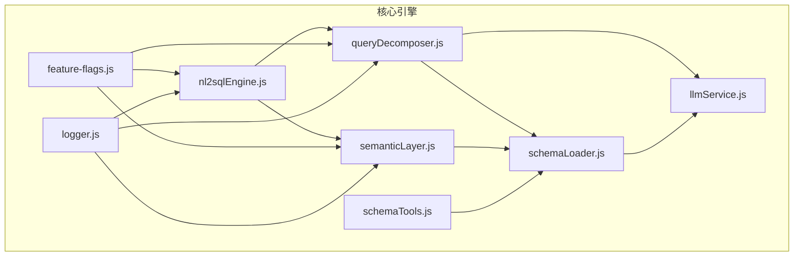
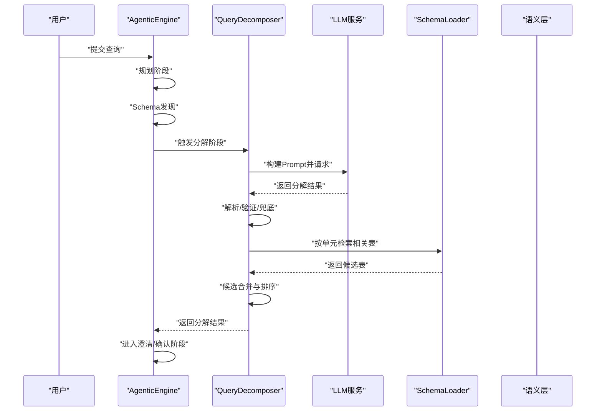
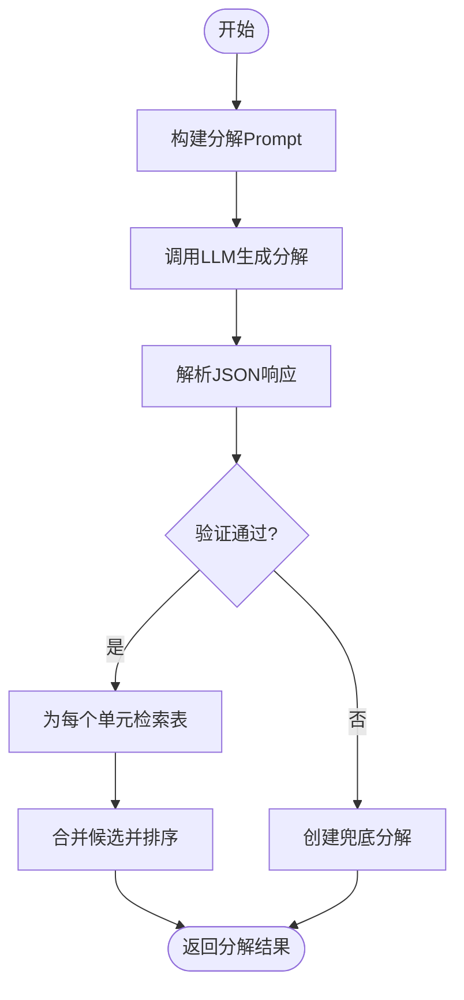
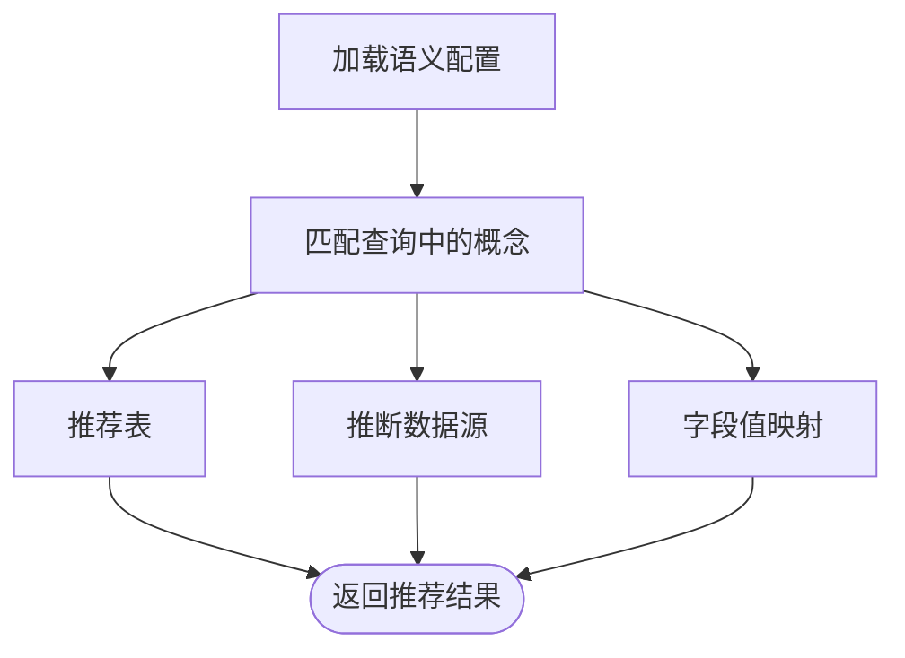
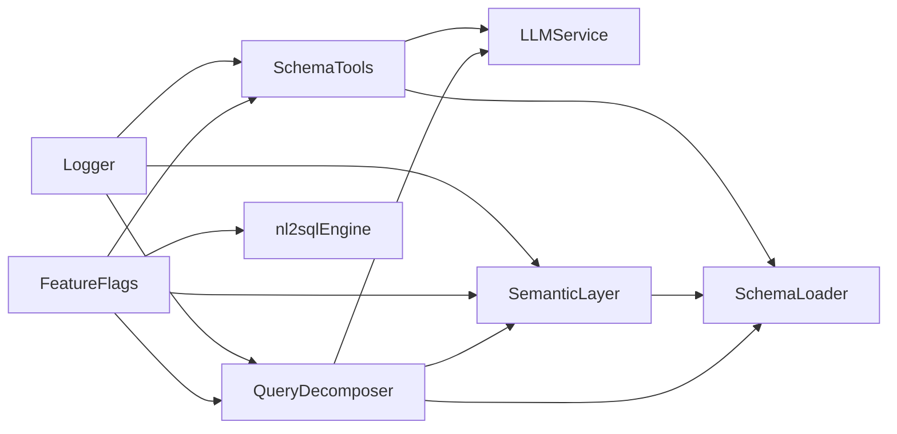

# 阶段二：动态意图分解

<cite>
**本文档引用的文件**
- [queryDecomposer.js](file://backend/src/core/queryDecomposer.js)
- [nl2sqlEngine.js](file://backend/src/core/nl2sqlEngine.js)
- [semanticLayer.js](file://backend/src/core/semanticLayer.js)
- [feature-flags.js](file://backend/config/feature-flags.js)
- [schemaTools.js](file://backend/src/core/schemaTools.js)
- [schemaLoader.js](file://backend/src/core/schemaLoader.js)
- [llmService.js](file://backend/src/core/llmService.js)
- [business-semantic-layer.json](file://backend/config/business-semantic-layer.json)
- [logger.js](file://backend/src/utils/logger.js)
- [context-management.test.js](file://backend/test/context-management.test.js)
- [package.json](file://backend/package.json)
</cite>

## 目录
1. [简介](#简介)
2. [项目结构](#项目结构)
3. [核心组件](#核心组件)
4. [架构总览](#架构总览)
5. [详细组件分析](#详细组件分析)
6. [依赖关系分析](#依赖关系分析)
7. [性能考量](#性能考量)
8. [故障排查指南](#故障排查指南)
9. [结论](#结论)
10. [附录](#附录)

## 简介
本阶段文档聚焦“动态意图分解”（Phase 2: Dynamic Intent Decomposition），目标是将复杂自然语言查询拆解为可独立检索的“数据需求单元”（Data Units），不预设固定子意图类型，使系统能够灵活适配任意复杂查询。核心能力包括：
- 查询语义分析与实体识别
- 数据需求单元提取与描述
- 复杂度评估与风险提示
- 基于单元的表检索与候选合并
- 与后续阶段（澄清、确认、执行）的接口设计
- 功能开关控制与渐进式上线

## 项目结构
后端采用模块化分层设计，核心模块如下：
- 核心引擎：nl2sqlEngine.js（主流程编排）
- 动态分解：queryDecomposer.js（查询拆解与表检索）
- 业务语义层：semanticLayer.js（业务概念映射与表推荐）
- Schema工具：schemaTools.js（工具化Schema探索）
- Schema加载：schemaLoader.js（Schema元数据与向量化）
- LLM服务：llmService.js（LLM调用与Embedding）
- 功能开关：feature-flags.js（Phase级功能控制）
- 日志：logger.js（统一日志与追踪）

图表来源
- [nl2sqlEngine.js:35-58](file://backend/src/core/nl2sqlEngine.js#L35-L58)
- [queryDecomposer.js:14-18](file://backend/src/core/queryDecomposer.js#L14-L18)
- [semanticLayer.js:14-17](file://backend/src/core/semanticLayer.js#L14-L17)
- [schemaTools.js:17-19](file://backend/src/core/schemaTools.js#L17-L19)
- [schemaLoader.js:16-26](file://backend/src/core/schemaLoader.js#L16-L26)
- [llmService.js:15-24](file://backend/src/core/llmService.js#L15-L24)
- [feature-flags.js:16-96](file://backend/config/feature-flags.js#L16-L96)
- [logger.js:16-23](file://backend/src/utils/logger.js#L16-L23)

章节来源
- [package.json:10-20](file://backend/package.json#L10-L20)

## 核心组件
- 动态意图分解器：负责将复杂查询拆解为数据需求单元，构建分解Prompt，解析LLM输出，验证与兜底。
- 业务语义层：将业务概念映射到物理表/字段，支持别名识别与模糊匹配，提供表推荐。
- Schema工具层：提供工具化Schema探索（search_tables/describe_table/search_knowledge/peek_table）。
- Schema加载器：加载Schema元数据，构建映射，向量化表级表征，支持语义检索与关键词匹配。
- LLM服务：封装HTTP请求、重试机制、Embedding获取、工具定义辅助。
- 功能开关：集中控制各Phase功能，支持渐进式启用与紧急回滚。
- 日志工具：统一日志格式、文件轮转、执行流程追踪。

章节来源
- [queryDecomposer.js:24-70](file://backend/src/core/queryDecomposer.js#L24-L70)
- [semanticLayer.js:128-167](file://backend/src/core/semanticLayer.js#L128-L167)
- [schemaTools.js:40-124](file://backend/src/core/schemaTools.js#L40-L124)
- [schemaLoader.js:69-122](file://backend/src/core/schemaLoader.js#L69-L122)
- [llmService.js:222-308](file://backend/src/core/llmService.js#L222-L308)
- [feature-flags.js:16-96](file://backend/config/feature-flags.js#L16-L96)
- [logger.js:54-85](file://backend/src/utils/logger.js#L54-L85)

## 架构总览
动态意图分解在Agentic工作流中作为第二阶段，与Schema探索、澄清确认、多步推理共同构成完整的NL2SQL管线。其核心流程：
- Agentic引擎触发分解阶段
- 分解器构建Prompt并调用LLM
- 解析并验证分解结果
- 基于数据单元检索相关表
- 合并候选并排序
- 将分解结果传递给后续阶段

图表来源
- [nl2sqlEngine.js:95-108](file://backend/src/core/agenticEngine.js#L95-L108)
- [queryDecomposer.js:38-70](file://backend/src/core/queryDecomposer.js#L38-L70)
- [schemaLoader.js:562-652](file://backend/src/core/schemaLoader.js#L562-L652)

## 详细组件分析

### 动态意图分解器（QueryDecomposer）
职责与流程：
- 动态拆解复杂查询为数据需求单元
- 构建分解Prompt并调用LLM
- 解析JSON响应，验证与兜底
- 基于单元关键词检索相关表
- 合并候选并排序

关键函数与职责：
- decomposeQueryDynamically：主入口，构建Prompt、调LLM、解析、验证、兜底
- buildDecompositionPrompt：构建包含分析要求、常见单元类型、业务关键词参考的Prompt
- parseDecomposition：从LLM响应中提取JSON并填充默认字段
- validateDecomposition：确保必要字段存在并补全单元ID/类型/关键词
- createFallbackDecomposition：失败时返回整体查询单元
- extractKeywords：提取中文词、英文词、数字作为关键词
- retrieveTablesByDataUnits：为每个单元构建搜索文本并检索表
- buildUnitSearchQuery：拼接关键词、描述、指标、行为类型
- mergeTableCandidates：覆盖率与频率双权重评分，合并候选表

图表来源
- [queryDecomposer.js:38-70](file://backend/src/core/queryDecomposer.js#L38-L70)
- [queryDecomposer.js:152-175](file://backend/src/core/queryDecomposer.js#L152-L175)
- [queryDecomposer.js:183-202](file://backend/src/core/queryDecomposer.js#L183-L202)
- [queryDecomposer.js:259-302](file://backend/src/core/queryDecomposer.js#L259-L302)
- [queryDecomposer.js:352-386](file://backend/src/core/queryDecomposer.js#L352-L386)

章节来源
- [queryDecomposer.js:24-70](file://backend/src/core/queryDecomposer.js#L24-L70)
- [queryDecomposer.js:79-143](file://backend/src/core/queryDecomposer.js#L79-L143)
- [queryDecomposer.js:152-175](file://backend/src/core/queryDecomposer.js#L152-L175)
- [queryDecomposer.js:183-202](file://backend/src/core/queryDecomposer.js#L183-L202)
- [queryDecomposer.js:210-227](file://backend/src/core/queryDecomposer.js#L210-L227)
- [queryDecomposer.js:235-246](file://backend/src/core/queryDecomposer.js#L235-L246)
- [queryDecomposer.js:259-302](file://backend/src/core/queryDecomposer.js#L259-L302)
- [queryDecomposer.js:310-334](file://backend/src/core/queryDecomposer.js#L310-L334)
- [queryDecomposer.js:352-386](file://backend/src/core/queryDecomposer.js#L352-L386)

### 业务语义层（SemanticLayer）
职责与流程：
- 加载业务语义配置（概念、查询模式、字段映射、数据源映射）
- 匹配查询中的业务概念，识别别名与模糊匹配
- 推荐表（基于概念映射）
- 推断数据源（如“老平台”、“新平台”）
- 字段值映射（如game_id别名）

关键函数与职责：
- load/loadBuiltinConfig：加载/内置配置
- matchConcepts/matchSingleConcept：概念匹配与评分
- recommendTables：基于匹配概念推荐表并排序
- inferDatasource：根据查询推断数据源
- getFieldValueMapping/parseGameId：字段值映射与game_id解析
- matchQueryPattern：查询模式匹配

图表来源
- [semanticLayer.js:48-73](file://backend/src/core/semanticLayer.js#L48-L73)
- [semanticLayer.js:134-167](file://backend/src/core/semanticLayer.js#L134-L167)
- [semanticLayer.js:238-306](file://backend/src/core/semanticLayer.js#L238-L306)
- [semanticLayer.js:367-386](file://backend/src/core/semanticLayer.js#L367-L386)
- [semanticLayer.js:399-464](file://backend/src/core/semanticLayer.js#L399-L464)

章节来源
- [semanticLayer.js:48-73](file://backend/src/core/semanticLayer.js#L48-L73)
- [semanticLayer.js:134-167](file://backend/src/core/semanticLayer.js#L134-L167)
- [semanticLayer.js:238-306](file://backend/src/core/semanticLayer.js#L238-L306)
- [semanticLayer.js:367-386](file://backend/src/core/semanticLayer.js#L367-L386)
- [semanticLayer.js:399-464](file://backend/src/core/semanticLayer.js#L399-L464)
- [business-semantic-layer.json:1-189](file://backend/config/business-semantic-layer.json#L1-L189)

### Schema工具层（SchemaTools）
职责与流程：
- 定义工具：search_tables/describe_table/search_knowledge/peek_table
- 提供Level 1索引（表名+业务注释）用于初步筛选
- 工具执行与解析（parseToolCalls）
- 业务知识库匹配（matchBusinessConcept）

章节来源
- [schemaTools.js:40-124](file://backend/src/core/schemaTools.js#L40-L124)
- [schemaTools.js:136-173](file://backend/src/core/schemaTools.js#L136-L173)
- [schemaTools.js:225-256](file://backend/src/core/schemaTools.js#L225-L256)
- [schemaTools.js:315-337](file://backend/src/core/schemaTools.js#L315-L337)
- [schemaTools.js:490-542](file://backend/src/core/schemaTools.js#L490-L542)

### Schema加载器（SchemaLoader）
职责与流程：
- 加载Schema配置文件，构建表/字段映射
- 向量化表级表征（增量更新），支持智能搜索
- 搜索相关表（语义检索+关键词匹配+上下文增强）
- SQL验证（禁止关键字、白名单表）

章节来源
- [schemaLoader.js:69-122](file://backend/src/core/schemaLoader.js#L69-L122)
- [schemaLoader.js:161-189](file://backend/src/core/schemaLoader.js#L161-L189)
- [schemaLoader.js:201-276](file://backend/src/core/schemaLoader.js#L201-L276)
- [schemaLoader.js:291-331](file://backend/src/core/schemaLoader.js#L291-L331)
- [schemaLoader.js:562-652](file://backend/src/core/schemaLoader.js#L562-L652)
- [schemaLoader.js:722-758](file://backend/src/core/schemaLoader.js#L722-L758)

### LLM服务（LLMService）
职责与流程：
- HTTP POST封装与重试机制
- chat/simpleChat：聊天请求与简单单轮对话
- getEmbedding：获取Embedding向量
- 工具定义辅助（createToolDefinition）

章节来源
- [llmService.js:41-152](file://backend/src/core/llmService.js#L41-L152)
- [llmService.js:222-308](file://backend/src/core/llmService.js#L222-L308)
- [llmService.js:318-356](file://backend/src/core/llmService.js#L318-L356)
- [llmService.js:369-424](file://backend/src/core/llmService.js#L369-L424)

### 功能开关（FeatureFlags）
职责与流程：
- 集中控制各Phase功能（工具化Schema探索、动态意图拆解、业务语义层、澄清机制、Agentic引擎、自我修正）
- 支持全局启用/禁用、按开关查询、打印状态
- 与引擎集成，决定工作流走向

章节来源
- [feature-flags.js:16-96](file://backend/config/feature-flags.js#L16-L96)
- [feature-flags.js:108-121](file://backend/config/feature-flags.js#L108-L121)
- [feature-flags.js:177-200](file://backend/config/feature-flags.js#L177-L200)
- [feature-flags.js:209-229](file://backend/config/feature-flags.js#L209-L229)

## 依赖关系分析
- QueryDecomposer依赖LLM服务、SchemaLoader、语义层、日志工具
- 语义层依赖SchemaLoader与配置文件
- SchemaTools依赖SchemaLoader与LLM服务
- LLM服务依赖配置与日志
- 功能开关贯穿各模块，控制Phase级功能

图表来源
- [queryDecomposer.js:14-18](file://backend/src/core/queryDecomposer.js#L14-L18)
- [semanticLayer.js:14-17](file://backend/src/core/semanticLayer.js#L14-L17)
- [schemaTools.js:17-19](file://backend/src/core/schemaTools.js#L17-L19)
- [schemaLoader.js:16-26](file://backend/src/core/schemaLoader.js#L16-L26)
- [llmService.js:15-24](file://backend/src/core/llmService.js#L15-L24)
- [feature-flags.js:16-96](file://backend/config/feature-flags.js#L16-L96)
- [logger.js:16-23](file://backend/src/utils/logger.js#L16-L23)

章节来源
- [nl2sqlEngine.js:35-58](file://backend/src/core/nl2sqlEngine.js#L35-L58)
- [queryDecomposer.js:14-18](file://backend/src/core/queryDecomposer.js#L14-L18)
- [semanticLayer.js:14-17](file://backend/src/core/semanticLayer.js#L14-L17)
- [schemaTools.js:17-19](file://backend/src/core/schemaTools.js#L17-L19)
- [schemaLoader.js:16-26](file://backend/src/core/schemaLoader.js#L16-L26)
- [llmService.js:15-24](file://backend/src/core/llmService.js#L15-L24)
- [feature-flags.js:16-96](file://backend/config/feature-flags.js#L16-L96)
- [logger.js:16-23](file://backend/src/utils/logger.js#L16-L23)

## 性能考量
- 向量化与智能搜索：SchemaLoader对表级表征进行向量化，支持智能搜索与重排序，减少无效表扫描。
- 候选合并策略：覆盖率与频率双权重评分，兼顾Join友好与检索置信度。
- 关键词匹配回退：当向量检索失败时，使用关键词匹配保证可用性。
- LLM重试与超时：LLMService提供重试机制与超时控制，提升稳定性。
- 日志与追踪：统一日志格式与执行追踪，便于性能监控与问题定位。

章节来源
- [schemaLoader.js:201-276](file://backend/src/core/schemaLoader.js#L201-L276)
- [schemaLoader.js:562-652](file://backend/src/core/schemaLoader.js#L562-L652)
- [queryDecomposer.js:352-386](file://backend/src/core/queryDecomposer.js#L352-L386)
- [llmService.js:167-195](file://backend/src/core/llmService.js#L167-L195)
- [logger.js:233-251](file://backend/src/utils/logger.js#L233-L251)

## 故障排查指南
常见问题与处理：
- LLM响应解析失败：分解器会捕获错误并返回兜底分解，确保流程不中断。
- 向量检索失败：SchemaLoader回退到关键词匹配，保证基本可用。
- 功能开关未生效：检查feature-flags配置与环境变量，确认开关状态。
- 日志追踪：使用logger.startTrace/traceStep/endTrace记录关键步骤，便于定位问题。

章节来源
- [queryDecomposer.js:64-70](file://backend/src/core/queryDecomposer.js#L64-L70)
- [schemaLoader.js:644-652](file://backend/src/core/schemaLoader.js#L644-L652)
- [feature-flags.js:209-229](file://backend/config/feature-flags.js#L209-L229)
- [logger.js:322-408](file://backend/src/utils/logger.js#L322-L408)

## 结论
动态意图分解通过“不预设类型”的数据单元拆解，结合业务语义层与Schema工具，实现了对复杂查询的灵活适配。配合功能开关与日志追踪，系统具备良好的可演进性与可观测性。下一阶段（澄清机制）将在此基础上进一步完善查询质量与执行成功率。

## 附录

### 动态分解与静态分解的区别与优势
- 动态分解：不预设子意图类型，由LLM动态确定单元类型，适应任意复杂查询，灵活性高。
- 静态分解：预设固定类型（如基础属性筛选、时间范围筛选、聚合指标等），实现简单但约束性强。
- 优势：动态分解在面对复合查询、跨表需求、行为序列等场景更具鲁棒性；通过候选合并策略平衡Join友好与检索置信度。

章节来源
- [queryDecomposer.js:24-31](file://backend/src/core/queryDecomposer.js#L24-L31)
- [queryDecomposer.js:98-103](file://backend/src/core/queryDecomposer.js#L98-L103)
- [queryDecomposer.js:352-386](file://backend/src/core/queryDecomposer.js#L352-L386)

### 分解结果的数据结构设计
- 基本字段：originalQuery、thought、primaryEntity、estimatedComplexity、requiresJoin、potentialRisks
- 数据单元：id、type、description、keywords、filters、timeRange、metric、operator、value、behavior、outputFields
- 候选表：tableCandidates（表名、units、score）、recommendedTables

章节来源
- [queryDecomposer.js:159-167](file://backend/src/core/queryDecomposer.js#L159-L167)
- [queryDecomposer.js:211-226](file://backend/src/core/queryDecomposer.js#L211-L226)
- [queryDecomposer.js:297-301](file://backend/src/core/queryDecomposer.js#L297-L301)

### 复杂度估计算法
- 估计复杂度：low/medium/high（由LLM输出）
- 候选合并评分：覆盖率分数（覆盖的数据单元比例）×0.6 + 频率分数（被检索到的次数）×0.4
- 综合分数排序，保留Top-5候选表

章节来源
- [queryDecomposer.js:164-165](file://backend/src/core/queryDecomposer.js#L164-L165)
- [queryDecomposer.js:354-372](file://backend/src/core/queryDecomposer.js#L354-L372)

### 与后续阶段的接口设计
- 与Agentic引擎：分解完成后返回分解结果，引擎继续Schema发现与澄清阶段
- 与Schema发现：基于分解结果检索表，支持工具循环模式
- 与澄清机制：若requiresJoin为true或存在潜在风险，进入澄清阶段

章节来源
- [nl2sqlEngine.js:95-108](file://backend/src/core/agenticEngine.js#L95-L108)
- [nl2sqlEngine.js:271-285](file://backend/src/core/agenticEngine.js#L271-L285)
- [queryDecomposer.js:166-167](file://backend/src/core/queryDecomposer.js#L166-L167)
- [queryDecomposer.js:297-301](file://backend/src/core/queryDecomposer.js#L297-L301)

### 代码示例路径（实现细节）
- 动态拆解主流程：[decomposeQueryDynamically:38-70](file://backend/src/core/queryDecomposer.js#L38-L70)
- 构建分解Prompt：[buildDecompositionPrompt:79-143](file://backend/src/core/queryDecomposer.js#L79-L143)
- 解析与验证：[parseDecomposition:152-175](file://backend/src/core/queryDecomposer.js#L152-L175)、[validateDecomposition:183-202](file://backend/src/core/queryDecomposer.js#L183-L202)
- 兜底策略：[createFallbackDecomposition:210-227](file://backend/src/core/queryDecomposer.js#L210-L227)
- 关键词提取：[extractKeywords:235-246](file://backend/src/core/queryDecomposer.js#L235-L246)
- 表检索与合并：[retrieveTablesByDataUnits:259-302](file://backend/src/core/queryDecomposer.js#L259-L302)、[mergeTableCandidates:352-386](file://backend/src/core/queryDecomposer.js#L352-L386)
- 业务语义层匹配：[matchConcepts:134-167](file://backend/src/core/semanticLayer.js#L134-L167)、[recommendTables:238-306](file://backend/src/core/semanticLayer.js#L238-L306)
- Schema向量化与检索：[vectorizeSchema:201-276](file://backend/src/core/schemaLoader.js#L201-L276)、[searchRelevantTables:562-652](file://backend/src/core/schemaLoader.js#L562-L652)
- LLM调用与重试：[chat:222-308](file://backend/src/core/llmService.js#L222-L308)、[withRetry:167-195](file://backend/src/core/llmService.js#L167-L195)
- 功能开关控制：[isEnabled/getAllFlags:108-141](file://backend/config/feature-flags.js#L108-L141)、[getEnabledPhases:177-200](file://backend/config/feature-flags.js#L177-L200)
- 日志追踪：[startTrace/traceStep/endTrace:322-408](file://backend/src/utils/logger.js#L322-L408)