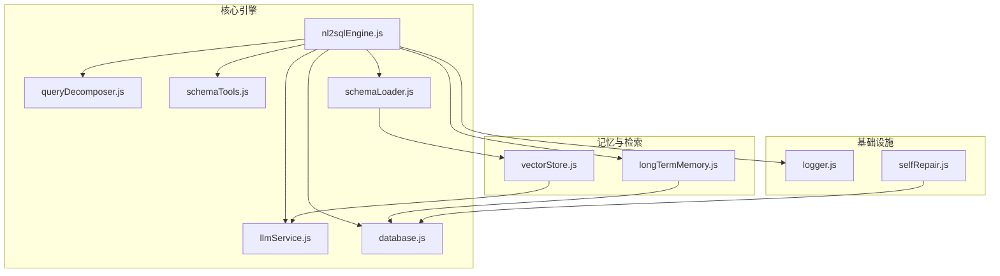
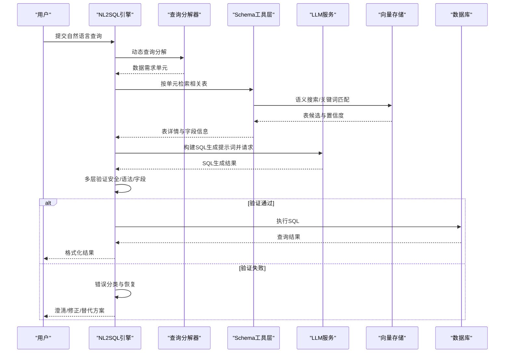
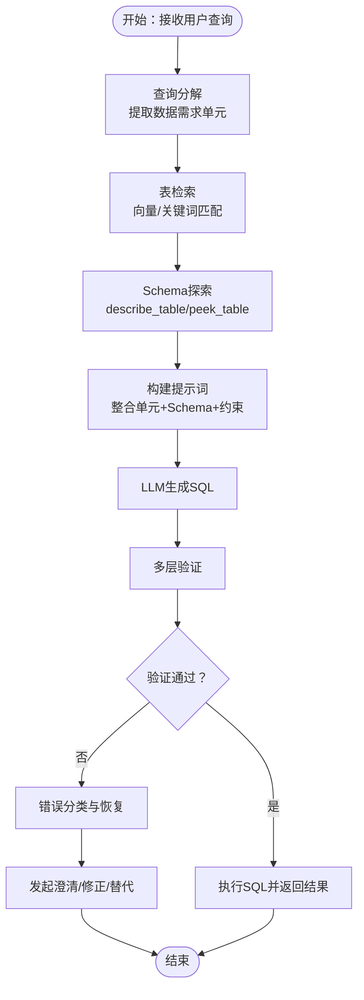
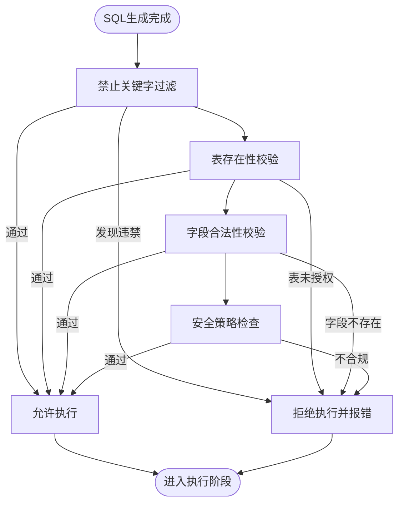
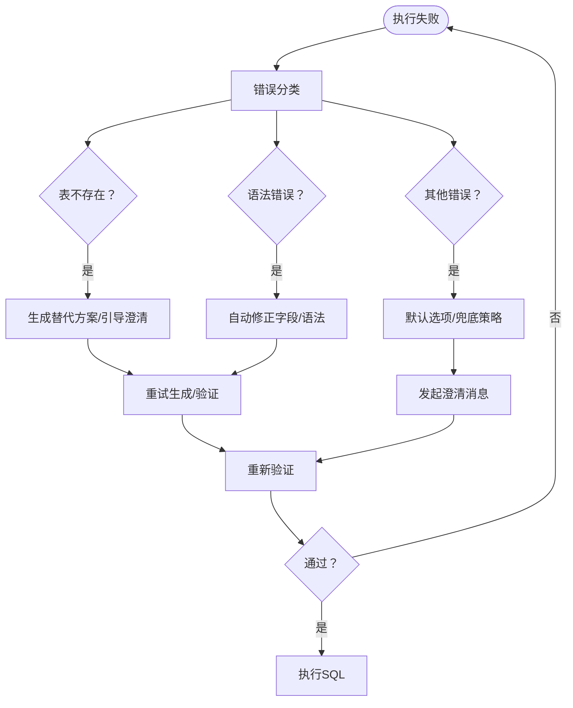
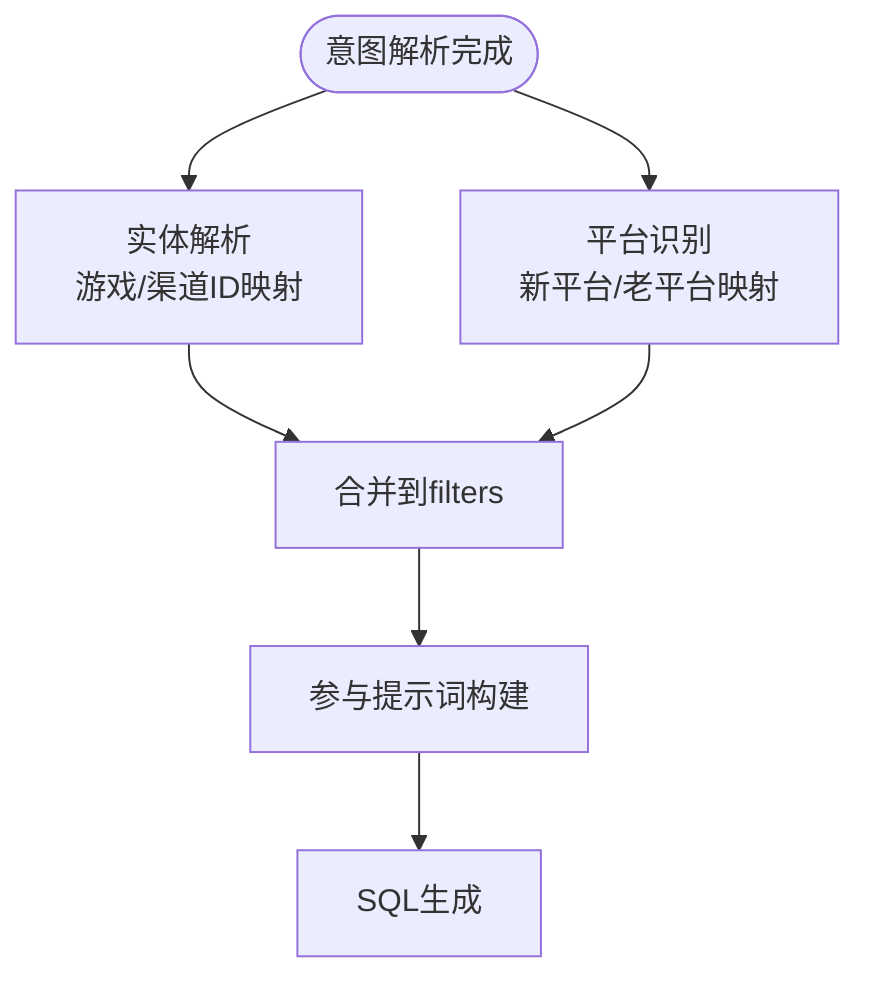
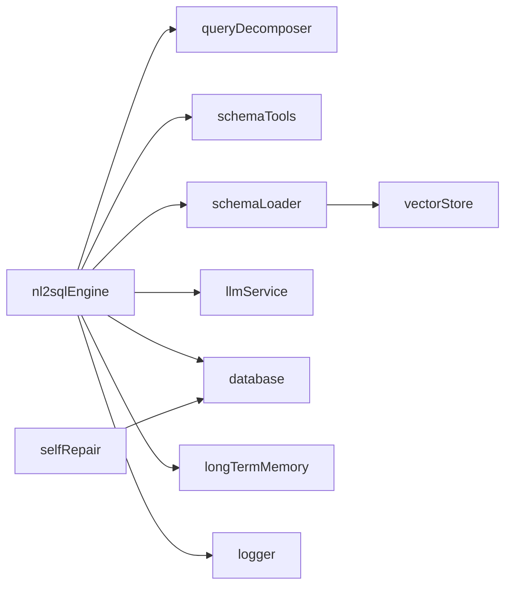

# 阶段四：生成、验证与恢复

<cite>
**本文档引用的文件**
- [nl2sqlEngine.js](file://backend/src/core/nl2sqlEngine.js)
- [queryDecomposer.js](file://backend/src/core/queryDecomposer.js)
- [schemaTools.js](file://backend/src/core/schemaTools.js)
- [schemaLoader.js](file://backend/src/core/schemaLoader.js)
- [llmService.js](file://backend/src/core/llmService.js)
- [database.js](file://backend/src/core/database.js)
- [longTermMemory.js](file://backend/src/memory/longTermMemory.js)
- [vectorStore.js](file://backend/src/memory/vectorStore.js)
- [logger.js](file://backend/src/utils/logger.js)
- [selfRepair.js](file://backend/src/core/selfRepair.js)
</cite>

## 目录
1. [简介](#简介)
2. [项目结构](#项目结构)
3. [核心组件](#核心组件)
4. [架构总览](#架构总览)
5. [详细组件分析](#详细组件分析)
6. [依赖关系分析](#依赖关系分析)
7. [性能考量](#性能考量)
8. [故障排查指南](#故障排查指南)
9. [结论](#结论)

## 简介
本阶段聚焦于代理工作流引擎的“生成、验证与恢复”闭环：  
- 生成阶段：基于查询分解结果与Schema详情，构建高质量SQL生成提示词，结合MySQL语法约束与字段匹配，输出可执行SQL。  
- 验证阶段：实施多层次安全与合规检查，包括禁止关键字过滤、表存在性校验、字段合法性验证等。  
- 恢复阶段：对错误进行分类与分级，执行针对性恢复策略，如表不存在的替代方案生成、语法错误的自动修正、以及通用错误的兜底处理。

## 项目结构
后端采用模块化分层设计，核心围绕NL2SQL引擎展开，配合Schema探索、向量检索、长期记忆与数据库持久化：

**图表来源**
- [nl2sqlEngine.js](file://backend/src/core/nl2sqlEngine.js)
- [queryDecomposer.js](file://backend/src/core/queryDecomposer.js)
- [schemaTools.js](file://backend/src/core/schemaTools.js)
- [schemaLoader.js](file://backend/src/core/schemaLoader.js)
- [llmService.js](file://backend/src/core/llmService.js)
- [database.js](file://backend/src/core/database.js)
- [longTermMemory.js](file://backend/src/memory/longTermMemory.js)
- [vectorStore.js](file://backend/src/memory/vectorStore.js)
- [logger.js](file://backend/src/utils/logger.js)
- [selfRepair.js](file://backend/src/core/selfRepair.js)

**章节来源**
- [nl2sqlEngine.js](file://backend/src/core/nl2sqlEngine.js)
- [queryDecomposer.js](file://backend/src/core/queryDecomposer.js)
- [schemaTools.js](file://backend/src/core/schemaTools.js)
- [schemaLoader.js](file://backend/src/core/schemaLoader.js)
- [llmService.js](file://backend/src/core/llmService.js)
- [database.js](file://backend/src/core/database.js)
- [longTermMemory.js](file://backend/src/memory/longTermMemory.js)
- [vectorStore.js](file://backend/src/memory/vectorStore.js)
- [logger.js](file://backend/src/utils/logger.js)
- [selfRepair.js](file://backend/src/core/selfRepair.js)

## 核心组件
- NL2SQL核心引擎：负责意图识别、澄清、SQL生成、验证与结果格式化，贯穿生成-验证-恢复全流程。  
- 查询分解器：将复杂查询拆分为数据需求单元，驱动表检索与Schema探索。  
- Schema工具层：提供按需Schema探索工具（搜索表、描述表、业务概念查询、表样例预览）。  
- Schema加载器：加载与缓存Schema元数据，提供SQL安全验证与Schema摘要。  
- LLM服务：封装HTTP请求、重试机制与流式响应，支撑提示词构建与工具调用。  
- 数据库与长期记忆：持久化会话、查询历史与用户偏好，支持别名学习与模式提取。  
- 向量存储：基于LanceDB的语义检索，支撑Schema与查询历史的相似度搜索。  
- 日志与自修复：统一日志与定时自检、会话清理、内存维护，保障系统健康。

**章节来源**
- [nl2sqlEngine.js](file://backend/src/core/nl2sqlEngine.js)
- [queryDecomposer.js](file://backend/src/core/queryDecomposer.js)
- [schemaTools.js](file://backend/src/core/schemaTools.js)
- [schemaLoader.js](file://backend/src/core/schemaLoader.js)
- [llmService.js](file://backend/src/core/llmService.js)
- [database.js](file://backend/src/core/database.js)
- [longTermMemory.js](file://backend/src/memory/longTermMemory.js)
- [vectorStore.js](file://backend/src/memory/vectorStore.js)
- [logger.js](file://backend/src/utils/logger.js)
- [selfRepair.js](file://backend/src/core/selfRepair.js)

## 架构总览
阶段四的生成-验证-恢复闭环如下：

**图表来源**
- [nl2sqlEngine.js](file://backend/src/core/nl2sqlEngine.js)
- [queryDecomposer.js](file://backend/src/core/queryDecomposer.js)
- [schemaTools.js](file://backend/src/core/schemaTools.js)
- [schemaLoader.js](file://backend/src/core/schemaLoader.js)
- [llmService.js](file://backend/src/core/llmService.js)
- [vectorStore.js](file://backend/src/memory/vectorStore.js)
- [database.js](file://backend/src/core/database.js)

## 详细组件分析

### 生成阶段：提示词构建与SQL生成
- 查询分解：将复杂查询拆分为数据需求单元，提取关键词、筛选条件、时间范围与输出字段，形成可独立检索的单元集合。  
- 表检索与Schema探索：基于单元关键词，结合向量检索与关键词匹配，返回表候选并排序；通过Schema工具层获取表详情与字段映射。  
- 提示词构建：整合分解单元、表结构、字段映射、业务术语与MySQL语法约束，生成面向LLM的结构化提示词，确保字段匹配与查询需求映射准确。  
- SQL生成：调用LLM服务生成SQL，结合Schema摘要与表详情，确保语法与字段合法性。

**图表来源**
- [queryDecomposer.js](file://backend/src/core/queryDecomposer.js)
- [schemaTools.js](file://backend/src/core/schemaTools.js)
- [schemaLoader.js](file://backend/src/core/schemaLoader.js)
- [llmService.js](file://backend/src/core/llmService.js)
- [nl2sqlEngine.js](file://backend/src/core/nl2sqlEngine.js)

**章节来源**
- [queryDecomposer.js](file://backend/src/core/queryDecomposer.js)
- [schemaTools.js](file://backend/src/core/schemaTools.js)
- [schemaLoader.js](file://backend/src/core/schemaLoader.js)
- [llmService.js](file://backend/src/core/llmService.js)
- [nl2sqlEngine.js](file://backend/src/core/nl2sqlEngine.js)

### 验证阶段：多层次检查机制
- 禁止关键字过滤：扫描SQL中的敏感/禁止操作关键字，阻断高风险操作。  
- 表存在性验证：在白名单配置下，校验SQL中出现的表是否受授权访问。  
- 字段合法性验证：结合Schema元数据，确保引用字段存在于目标表中。  
- 语法与安全：通过LLM生成的SQL遵循MySQL语法约束，结合Schema约束减少无效字段引用。

**图表来源**
- [schemaLoader.js](file://backend/src/core/schemaLoader.js)
- [nl2sqlEngine.js](file://backend/src/core/nl2sqlEngine.js)

**章节来源**
- [schemaLoader.js](file://backend/src/core/schemaLoader.js)
- [nl2sqlEngine.js](file://backend/src/core/nl2sqlEngine.js)

### 恢复阶段：错误分类与智能恢复
- 错误分类：将执行错误按“表不存在”、“语法错误”、“通用错误”等类别划分，分别采取不同恢复策略。  
- 表不存在：基于业务关键词与平台识别，生成替代表方案或引导用户提供更精确的表名。  
- 语法错误：结合MySQL语法约束与字段匹配，自动修正常见拼写与字段引用错误。  
- 通用错误：通过澄清消息与默认选项提取，引导用户确认默认参数或提供更多信息。

**图表来源**
- [nl2sqlEngine.js](file://backend/src/core/nl2sqlEngine.js)
- [longTermMemory.js](file://backend/src/memory/longTermMemory.js)
- [database.js](file://backend/src/core/database.js)

**章节来源**
- [nl2sqlEngine.js](file://backend/src/core/nl2sqlEngine.js)
- [longTermMemory.js](file://backend/src/memory/longTermMemory.js)
- [database.js](file://backend/src/core/database.js)

### 实体解析与平台识别（辅助生成与恢复）
- 实体解析：从用户输入中识别游戏、渠道等实体，支持模糊匹配与长期记忆学习，提升实体映射准确性。  
- 平台识别：基于用户术语与学习到的映射，将“新平台/老平台”映射到具体数据源标识，减少歧义。

**图表来源**
- [nl2sqlEngine.js](file://backend/src/core/nl2sqlEngine.js)

**章节来源**
- [nl2sqlEngine.js](file://backend/src/core/nl2sqlEngine.js)

## 依赖关系分析
- 引擎对分解器与Schema工具层的依赖：生成阶段依赖分解器提供的数据单元与工具层提供的Schema信息。  
- LLM服务与向量存储：提示词构建与表检索依赖LLM与向量存储的协同。  
- 数据库与长期记忆：验证阶段依赖Schema元数据，恢复阶段依赖用户偏好与历史模式。  
- 日志与自修复：贯穿全链路，保障可观测性与系统健康。

**图表来源**
- [nl2sqlEngine.js](file://backend/src/core/nl2sqlEngine.js)
- [queryDecomposer.js](file://backend/src/core/queryDecomposer.js)
- [schemaTools.js](file://backend/src/core/schemaTools.js)
- [schemaLoader.js](file://backend/src/core/schemaLoader.js)
- [llmService.js](file://backend/src/core/llmService.js)
- [vectorStore.js](file://backend/src/memory/vectorStore.js)
- [database.js](file://backend/src/core/database.js)
- [longTermMemory.js](file://backend/src/memory/longTermMemory.js)
- [logger.js](file://backend/src/utils/logger.js)
- [selfRepair.js](file://backend/src/core/selfRepair.js)

**章节来源**
- [nl2sqlEngine.js](file://backend/src/core/nl2sqlEngine.js)
- [queryDecomposer.js](file://backend/src/core/queryDecomposer.js)
- [schemaTools.js](file://backend/src/core/schemaTools.js)
- [schemaLoader.js](file://backend/src/core/schemaLoader.js)
- [llmService.js](file://backend/src/core/llmService.js)
- [vectorStore.js](file://backend/src/memory/vectorStore.js)
- [database.js](file://backend/src/core/database.js)
- [longTermMemory.js](file://backend/src/memory/longTermMemory.js)
- [logger.js](file://backend/src/utils/logger.js)
- [selfRepair.js](file://backend/src/core/selfRepair.js)

## 性能考量
- 向量检索与缓存：Schema向量采用表级表征与增量更新，减少Embedding调用次数；向量存储支持智能搜索与过滤，降低无关表干扰。  
- 查询分解与表候选合并：通过覆盖率与频率分数综合排序，优先返回Join友好与高置信度表，减少无效尝试。  
- LLM调用优化：提示词构建严格遵循Schema与业务约束，减少无效重试；重试机制与超时控制保障稳定性。  
- 数据库与索引：SQLite表建立复合索引，加速偏好查询与历史检索；事务封装保证一致性。  
- 日志与自修复：定时任务与统计收集避免对主线程影响，异常情况快速隔离与恢复。

[本节为通用指导，不直接分析具体文件]

## 故障排查指南
- LLM API异常：检查API密钥、超时与重试配置，查看日志中请求与响应详情。  
- 向量存储不可用：确认LanceDB路径与权限，检查初始化状态与表存在性。  
- SQL验证失败：核对禁止关键字与表白名单配置，确认字段是否存在于目标表。  
- 长期记忆学习失败：检查用户偏好存储与JSON解析，确认阈值与筛选逻辑。  
- 自修复任务异常：查看定时任务状态与系统日志，确认慢查询与内存使用阈值。

**章节来源**
- [logger.js](file://backend/src/utils/logger.js)
- [selfRepair.js](file://backend/src/core/selfRepair.js)
- [database.js](file://backend/src/core/database.js)
- [vectorStore.js](file://backend/src/memory/vectorStore.js)
- [schemaLoader.js](file://backend/src/core/schemaLoader.js)

## 结论
阶段四通过“生成-验证-恢复”的闭环设计，实现了从复杂查询到可执行SQL的稳健转换。借助查询分解、Schema探索与向量检索，生成阶段具备高精度与高鲁棒性；多层次验证确保安全与合规；智能恢复策略显著提升用户体验与成功率。建议持续优化提示词构建与向量检索策略，强化异常场景的自动化恢复能力，并通过自修复机制保障系统长期稳定运行。