# 核心引擎

<cite>
**本文引用的文件**
- [nl2sqlEngine.js](file://backend/src/core/nl2sqlEngine.js)
- [agenticEngine.js](file://backend/src/core/agenticEngine.js)
- [toolLoop.js](file://backend/src/core/toolLoop.js)
- [llmService.js](file://backend/src/core/llmService.js)
- [schemaTools.js](file://backend/src/core/schemaTools.js)
- [schemaLoader.js](file://backend/src/core/schemaLoader.js)
- [clarificationEngine.js](file://backend/src/core/clarificationEngine.js)
- [queryDecomposer.js](file://backend/src/core/queryDecomposer.js)
- [selfRepair.js](file://backend/src/core/selfRepair.js)
- [semanticLayer.js](file://backend/src/core/semanticLayer.js)
- [routes.js](file://backend/src/core/routes.js)
- [app.js](file://backend/src/app.js)
- [package.json](file://backend/package.json)
</cite>

## 目录
1. [简介](#简介)
2. [项目结构](#项目结构)
3. [核心组件](#核心组件)
4. [架构总览](#架构总览)
5. [详细组件分析](#详细组件分析)
6. [依赖分析](#依赖分析)
7. [性能考量](#性能考量)
8. [故障排查指南](#故障排查指南)
9. [结论](#结论)
10. [附录](#附录)

## 简介
本技术文档面向NL2SQL核心引擎，系统阐述从自然语言到SQL的完整转换链路，涵盖意图识别、Schema探索、查询分解、澄清与确认、SQL生成、验证与恢复、以及多阶段推理与工具循环机制。文档还解释LLM服务集成方式、API调用策略、错误处理、性能优化与扩展性设计，并提供使用模式与代码示例路径，帮助开发者深入理解与高效实现。

## 项目结构
后端采用模块化分层组织，核心引擎位于 backend/src/core，围绕“意图-表-SQL”三段式流程构建，配合工具循环与语义层增强，形成可扩展的多阶段推理体系。

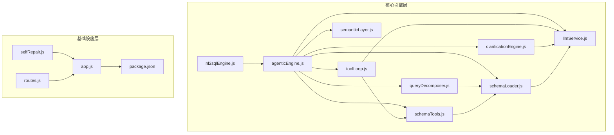

**图表来源**
- [app.js:97-188](file://backend/src/app.js#L97-L188)
- [routes.js:36-80](file://backend/src/core/routes.js#L36-L80)
- [agenticEngine.js:52-178](file://backend/src/core/agenticEngine.js#L52-L178)
- [toolLoop.js:57-185](file://backend/src/core/toolLoop.js#L57-L185)
- [queryDecomposer.js:38-70](file://backend/src/core/queryDecomposer.js#L38-L70)
- [clarificationEngine.js:196-232](file://backend/src/core/clarificationEngine.js#L196-L232)
- [schemaTools.js:40-124](file://backend/src/core/schemaTools.js#L40-L124)
- [schemaLoader.js:69-122](file://backend/src/core/schemaLoader.js#L69-L122)
- [llmService.js:222-308](file://backend/src/core/llmService.js#L222-L308)
- [semanticLayer.js:48-73](file://backend/src/core/semanticLayer.js#L48-L73)
- [selfRepair.js:60-125](file://backend/src/core/selfRepair.js#L60-L125)

**章节来源**
- [app.js:97-188](file://backend/src/app.js#L97-L188)
- [routes.js:36-80](file://backend/src/core/routes.js#L36-L80)

## 核心组件
- 多阶段推理引擎（AgenticEngine）：整合规划、Schema探索、意图分解、澄清确认、SQL生成、验证与恢复，形成Plan → Act → Observe循环。
- 工具循环（ToolLoop）：以工具调用驱动Schema探索，LLM按需索取而非一次性灌输，降低上下文成本。
- 查询分解器（QueryDecomposer）：将复杂查询动态拆解为数据需求单元，独立检索相关表。
- 澄清引擎（ClarificationEngine）：在置信度不足或歧义场景触发，生成友好澄清问题并应用用户回答。
- Schema工具层（SchemaTools）：提供search_tables、describe_table、search_knowledge、peek_table等工具定义与执行。
- Schema加载器（SchemaLoader）：加载与缓存Schema元数据，支持语义检索与向量化。
- LLM服务（LLMService）：封装HTTP调用、重试、流式响应与工具调用，统一API接入。
- 业务语义层（SemanticLayer）：建立业务概念到物理表/字段映射，解决“老平台”、“累计充值”等语义识别问题。
- 自修复（SelfRepair）：定时健康检查、会话清理、统计收集与记忆维护，保障系统稳定性。
- 路由与入口（Routes/App）：提供REST API与服务启动流程。

**章节来源**
- [agenticEngine.js:52-178](file://backend/src/core/agenticEngine.js#L52-L178)
- [toolLoop.js:57-185](file://backend/src/core/toolLoop.js#L57-L185)
- [queryDecomposer.js:38-70](file://backend/src/core/queryDecomposer.js#L38-L70)
- [clarificationEngine.js:196-232](file://backend/src/core/clarificationEngine.js#L196-L232)
- [schemaTools.js:40-124](file://backend/src/core/schemaTools.js#L40-L124)
- [schemaLoader.js:69-122](file://backend/src/core/schemaLoader.js#L69-L122)
- [llmService.js:222-308](file://backend/src/core/llmService.js#L222-L308)
- [semanticLayer.js:48-73](file://backend/src/core/semanticLayer.js#L48-L73)
- [selfRepair.js:60-125](file://backend/src/core/selfRepair.js#L60-L125)
- [routes.js:36-80](file://backend/src/core/routes.js#L36-L80)
- [app.js:97-188](file://backend/src/app.js#L97-L188)

## 架构总览
核心引擎采用“工具驱动的Schema探索 + 多阶段推理”的混合架构。LLM通过工具循环按需获取Schema信息，结合业务语义层与长期记忆，完成意图识别、查询分解、表检索、澄清与SQL生成，并在生成后进行安全与语法验证，必要时进入恢复阶段。

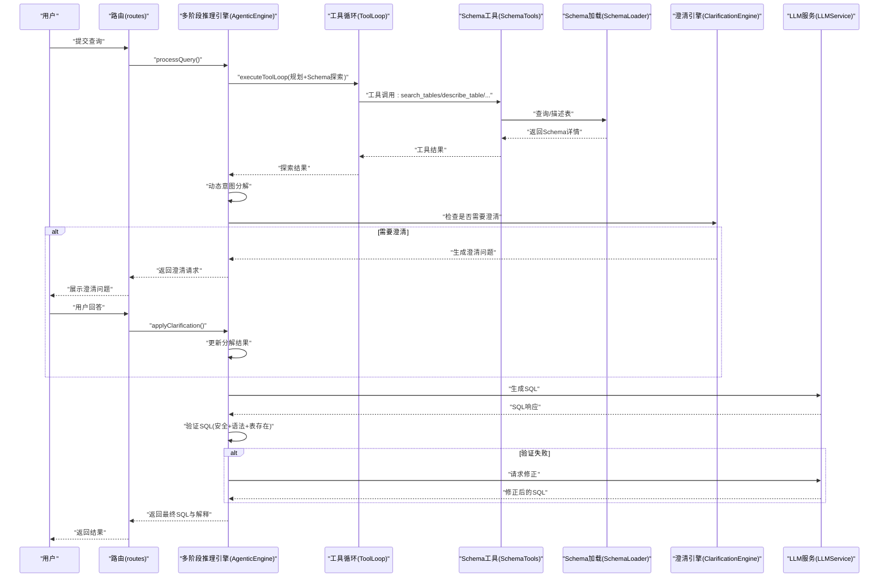

**图表来源**
- [agenticEngine.js:68-178](file://backend/src/core/agenticEngine.js#L68-L178)
- [toolLoop.js:57-185](file://backend/src/core/toolLoop.js#L57-L185)
- [schemaTools.js:565-577](file://backend/src/core/schemaTools.js#L565-L577)
- [schemaLoader.js:562-652](file://backend/src/core/schemaLoader.js#L562-L652)
- [clarificationEngine.js:246-272](file://backend/src/core/clarificationEngine.js#L246-L272)
- [llmService.js:222-308](file://backend/src/core/llmService.js#L222-L308)

## 详细组件分析

### 多阶段推理引擎（AgenticEngine）
- 角色与职责：整合前三阶段（规划+Schema探索、动态意图分解、澄清确认），并在第四阶段执行SQL生成、验证与恢复。
- 关键流程：
  - 规划阶段：基于用户查询制定执行计划（实体、筛选、聚合、风险）。
  - Schema探索：使用工具循环按需探索表结构，支持Level 1索引与工具探索。
  - 动态意图分解：将复杂查询拆解为数据需求单元，独立检索相关表。
  - 澄清阶段：基于置信度与歧义检测触发澄清，生成问题并应用用户回答。
  - 生成与验证：构建SQL生成Prompt，解析响应，执行安全与语法检查。
  - 恢复阶段：分类错误（表不存在、语法错误），自动尝试替代表或请求修正。
- 错误分类与恢复：
  - 表不存在：搜索替代表，返回建议。
  - 语法错误：请求LLM修正，返回修正后的SQL。
- 进度回调：提供阶段进度通知，便于前端SSE流式展示。

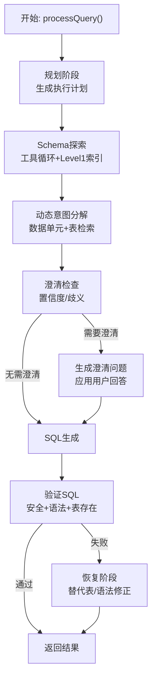

**图表来源**
- [agenticEngine.js:68-178](file://backend/src/core/agenticEngine.js#L68-L178)
- [agenticEngine.js:345-497](file://backend/src/core/agenticEngine.js#L345-L497)
- [agenticEngine.js:518-613](file://backend/src/core/agenticEngine.js#L518-L613)

**章节来源**
- [agenticEngine.js:52-178](file://backend/src/core/agenticEngine.js#L52-L178)
- [agenticEngine.js:345-621](file://backend/src/core/agenticEngine.js#L345-L621)

### 工具循环（ToolLoop）
- 角色与职责：将LLM的工具调用循环化，按需探索Schema，避免一次性传输大量上下文。
- 核心能力：
  - 构建系统提示词与初始消息（含Level 1索引）。
  - 解析LLM工具调用请求，执行工具（search_tables、describe_table、search_knowledge、peek_table）。
  - 记录工具调用日志，支持最大迭代次数与超时控制。
  - 提供意图识别与SQL生成的工具增强版本。
- 与SchemaTools协作：解析工具调用、执行工具、组装消息历史。

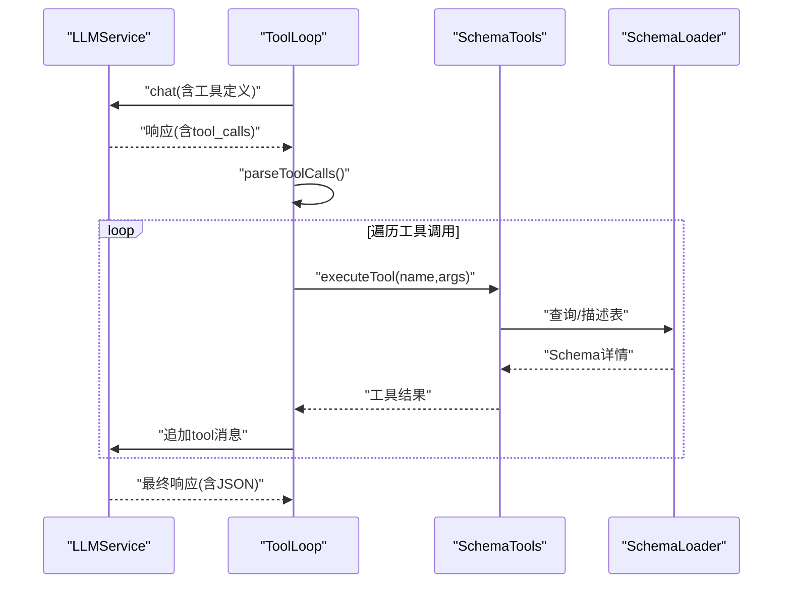

**图表来源**
- [toolLoop.js:57-185](file://backend/src/core/toolLoop.js#L57-L185)
- [schemaTools.js:565-577](file://backend/src/core/schemaTools.js#L565-L577)
- [schemaLoader.js:562-652](file://backend/src/core/schemaLoader.js#L562-L652)

**章节来源**
- [toolLoop.js:57-185](file://backend/src/core/toolLoop.js#L57-L185)
- [schemaTools.js:40-124](file://backend/src/core/schemaTools.js#L40-L124)

### 查询分解器（QueryDecomposer）
- 角色与职责：将复杂查询拆解为数据需求单元，每个单元独立检索相关表，支持动态类型与关键词抽取。
- 关键流程：
  - 构建分解Prompt，调用LLM生成JSON结构。
  - 解析与验证分解结果，补全缺失字段。
  - 基于单元关键词构建搜索查询，调用SchemaLoader检索表候选。
  - 合并候选并排序，输出推荐表集合。

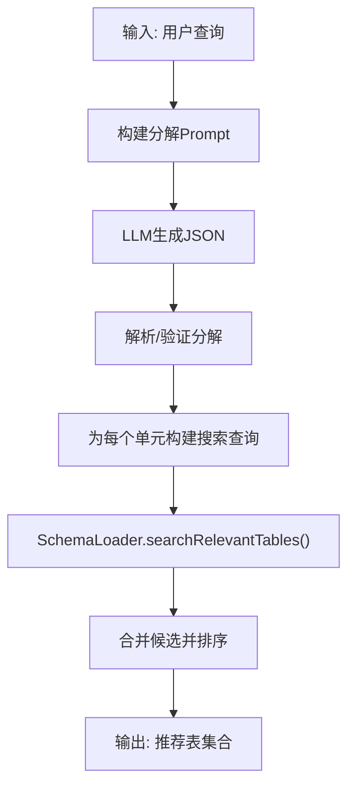

**图表来源**
- [queryDecomposer.js:38-70](file://backend/src/core/queryDecomposer.js#L38-L70)
- [queryDecomposer.js:259-302](file://backend/src/core/queryDecomposer.js#L259-L302)
- [schemaLoader.js:562-652](file://backend/src/core/schemaLoader.js#L562-L652)

**章节来源**
- [queryDecomposer.js:38-227](file://backend/src/core/queryDecomposer.js#L38-L227)
- [queryDecomposer.js:259-386](file://backend/src/core/queryDecomposer.js#L259-L386)

### 澄清引擎（ClarificationEngine）
- 触发条件：数据单元无匹配表、表选择歧义、聚合指标来源不明确、时间粒度不明确、置信度过低。
- 生成策略：基于触发器构建澄清Prompt，生成问题、选项与默认推荐。
- 应用机制：根据澄清类型更新分解结果（表偏好、指标来源、时间粒度），并记录澄清历史。

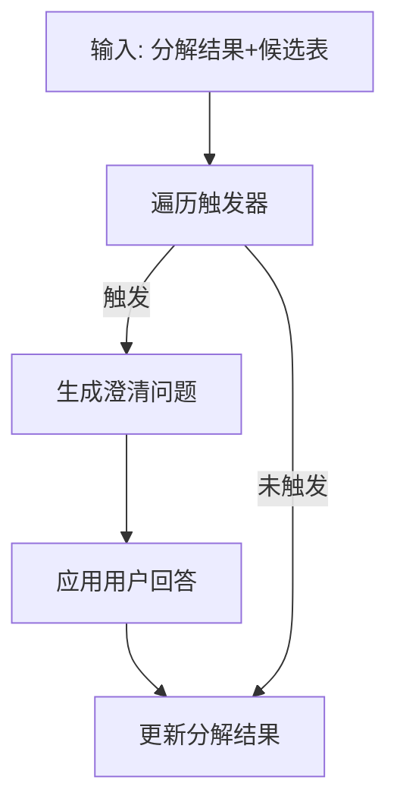

**图表来源**
- [clarificationEngine.js:196-232](file://backend/src/core/clarificationEngine.js#L196-L232)
- [clarificationEngine.js:246-374](file://backend/src/core/clarificationEngine.js#L246-L374)
- [clarificationEngine.js:388-471](file://backend/src/core/clarificationEngine.js#L388-L471)

**章节来源**
- [clarificationEngine.js:196-471](file://backend/src/core/clarificationEngine.js#L196-L471)

### Schema工具层（SchemaTools）
- 工具定义：search_tables、describe_table、search_knowledge、peek_table，均采用OpenAI Function Calling格式。
- 执行与解析：解析LLM工具调用，执行对应工具，返回结构化结果。
- Level 1索引：缓存表名+业务注释，用于初步筛选与系统提示词。

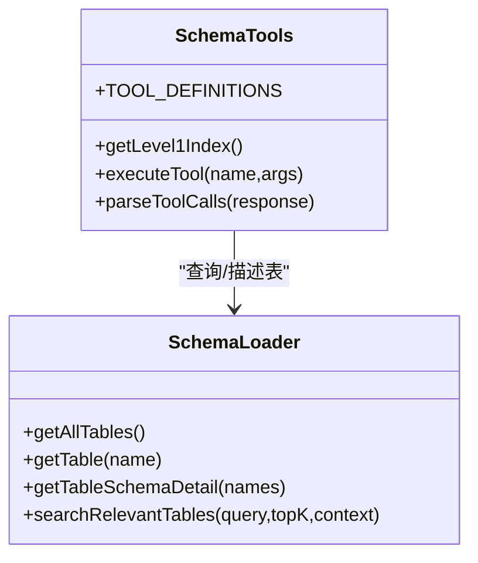

**图表来源**
- [schemaTools.js:40-124](file://backend/src/core/schemaTools.js#L40-L124)
- [schemaTools.js:565-602](file://backend/src/core/schemaTools.js#L565-L602)
- [schemaLoader.js:432-800](file://backend/src/core/schemaLoader.js#L432-L800)

**章节来源**
- [schemaTools.js:40-631](file://backend/src/core/schemaTools.js#L40-L631)

### Schema加载器（SchemaLoader）
- 加载与校验：从JSON配置文件加载Schema，构建表/字段映射，缓存以提升性能。
- 向量化：将表级表征向量化并存储，支持智能搜索与重排序。
- 搜索增强：结合上下文（datasource、game_id）与语义检索，优先匹配目标数据库表。
- 安全校验：验证SQL关键字与白名单表，确保生成SQL安全。

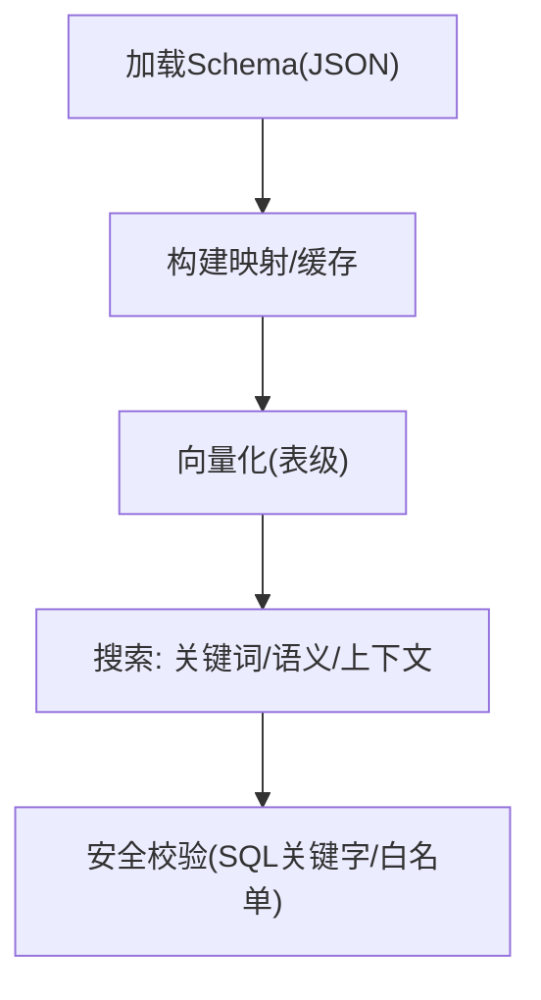

**图表来源**
- [schemaLoader.js:69-122](file://backend/src/core/schemaLoader.js#L69-L122)
- [schemaLoader.js:201-276](file://backend/src/core/schemaLoader.js#L201-L276)
- [schemaLoader.js:562-652](file://backend/src/core/schemaLoader.js#L562-L652)
- [schemaLoader.js:722-758](file://backend/src/core/schemaLoader.js#L722-L758)

**章节来源**
- [schemaLoader.js:69-800](file://backend/src/core/schemaLoader.js#L69-L800)

### LLM服务（LLMService）
- 能力范围：聊天（支持流式）、单轮对话、Embedding获取、工具定义辅助。
- 重试与超时：withRetry包装，支持最大重试次数与延迟。
- 工具调用：支持tools与tool_choice，解析tool_calls并执行。
- 日志与追踪：记录请求/响应、耗时、使用量，便于调试与监控。

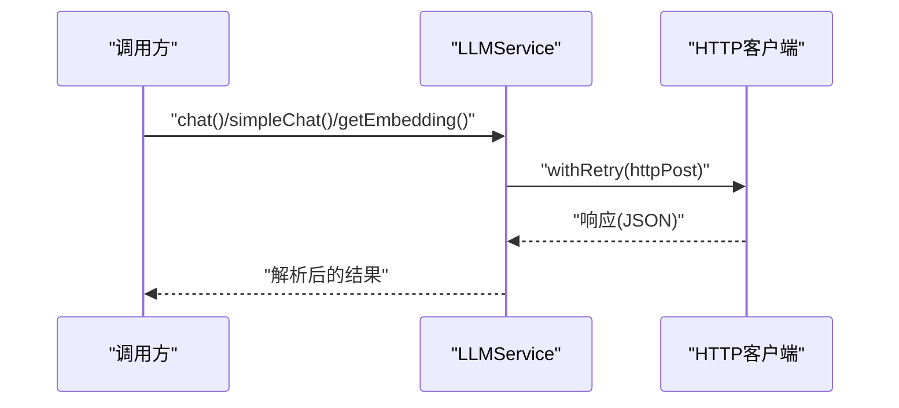

**图表来源**
- [llmService.js:222-308](file://backend/src/core/llmService.js#L222-L308)
- [llmService.js:167-195](file://backend/src/core/llmService.js#L167-L195)
- [llmService.js:41-152](file://backend/src/core/llmService.js#L41-L152)

**章节来源**
- [llmService.js:222-477](file://backend/src/core/llmService.js#L222-L477)

### 业务语义层（SemanticLayer）
- 概念匹配：支持精确/别名/模糊匹配，返回匹配分数与原因。
- 表推荐：基于匹配到的概念推荐表，考虑优先级与匹配类型。
- 数据源映射：根据查询推断数据源（如“老平台/新平台”）。
- 字段值映射：解析用户术语到字段值的映射（如game_id）。

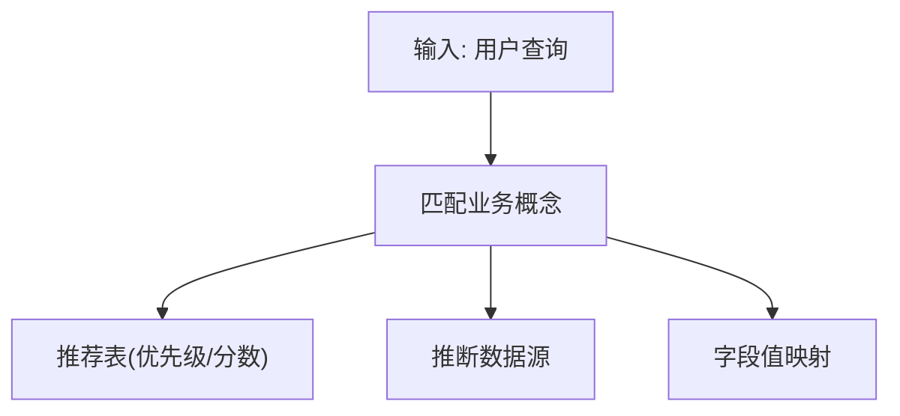

**图表来源**
- [semanticLayer.js:134-167](file://backend/src/core/semanticLayer.js#L134-L167)
- [semanticLayer.js:238-306](file://backend/src/core/semanticLayer.js#L238-L306)
- [semanticLayer.js:367-386](file://backend/src/core/semanticLayer.js#L367-L386)
- [semanticLayer.js:441-464](file://backend/src/core/semanticLayer.js#L441-L464)

**章节来源**
- [semanticLayer.js:48-532](file://backend/src/core/semanticLayer.js#L48-L532)

### 自修复（SelfRepair）
- 定时任务：每日自检、会话清理、统计收集、记忆维护。
- 自检内容：数据库连接、向量数据库、查询统计、活跃连接、系统资源。
- 记忆维护：压缩与清理过期记忆，生成健康报告。

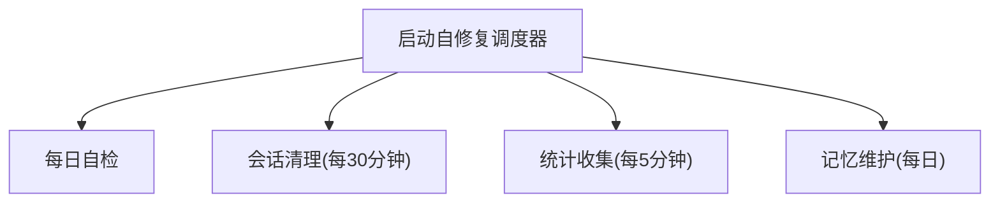

**图表来源**
- [selfRepair.js:60-125](file://backend/src/core/selfRepair.js#L60-L125)
- [selfRepair.js:169-310](file://backend/src/core/selfRepair.js#L169-L310)
- [selfRepair.js:341-373](file://backend/src/core/selfRepair.js#L341-L373)
- [selfRepair.js:383-415](file://backend/src/core/selfRepair.js#L383-L415)

**章节来源**
- [selfRepair.js:60-489](file://backend/src/core/selfRepair.js#L60-L489)

### 路由与入口（Routes/App）
- 路由：健康检查、Schema查询、会话管理、查询历史、用户偏好、评估统计等REST接口。
- 入口：服务启动、模块初始化（数据库、向量库、Schema、语义层、自修复）、优雅关闭。

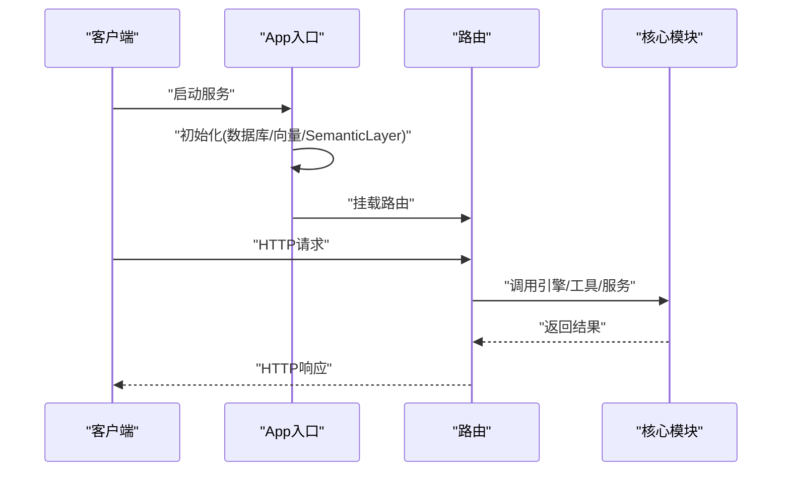

**图表来源**
- [app.js:97-188](file://backend/src/app.js#L97-L188)
- [routes.js:72-137](file://backend/src/core/routes.js#L72-L137)

**章节来源**
- [routes.js:36-800](file://backend/src/core/routes.js#L36-L800)
- [app.js:97-260](file://backend/src/app.js#L97-L260)

## 依赖分析
- 模块耦合：
  - AgenticEngine高度依赖ToolLoop、QueryDecomposer、ClarificationEngine、SchemaTools、SchemaLoader、LLMService、SemanticLayer。
  - ToolLoop依赖SchemaTools与LLMService。
  - QueryDecomposer依赖SchemaLoader与LLMService。
  - ClarificationEngine依赖LLMService。
  - SchemaTools依赖SchemaLoader。
  - SchemaLoader依赖LLMService与VectorStore。
- 外部依赖：
  - Express、SQLite3、vectordb、node-cron等。
- 配置与功能开关：通过feature-flags.js控制工具循环、动态意图分解、澄清引擎等功能开关。

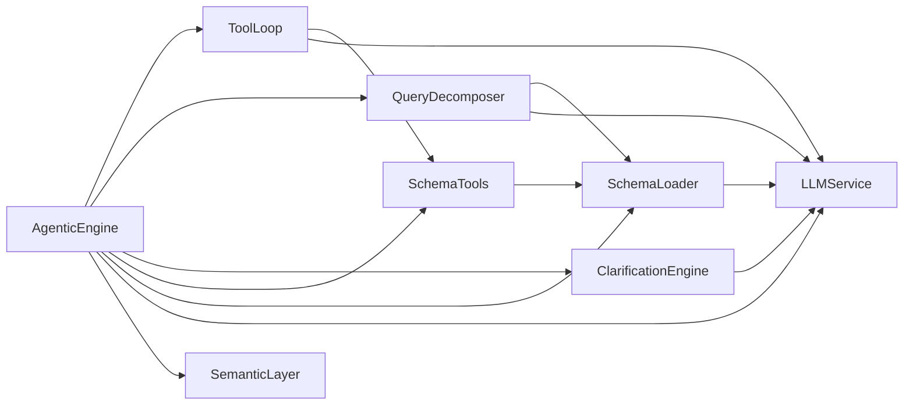

**图表来源**
- [agenticEngine.js:52-178](file://backend/src/core/agenticEngine.js#L52-L178)
- [toolLoop.js:57-185](file://backend/src/core/toolLoop.js#L57-L185)
- [queryDecomposer.js:38-70](file://backend/src/core/queryDecomposer.js#L38-L70)
- [clarificationEngine.js:196-232](file://backend/src/core/clarificationEngine.js#L196-L232)
- [schemaTools.js:40-124](file://backend/src/core/schemaTools.js#L40-L124)
- [schemaLoader.js:69-122](file://backend/src/core/schemaLoader.js#L69-L122)
- [llmService.js:222-308](file://backend/src/core/llmService.js#L222-L308)
- [semanticLayer.js:48-73](file://backend/src/core/semanticLayer.js#L48-L73)

**章节来源**
- [package.json:10-27](file://backend/package.json#L10-L27)

## 性能考量
- 上下文控制：工具循环按需索取Schema，避免一次性传输大量上下文，降低LLM成本与延迟。
- 缓存策略：SchemaLoader对Level 1索引与表映射进行缓存，支持过期时间控制。
- 向量化检索：表级向量化与智能搜索，结合上下文增强（datasource、game_id），提升召回质量与速度。
- 并发与队列：长期记忆存储采用队列异步化，避免阻塞主流程。
- 超时与重试：LLMService统一重试与超时控制，减少外部依赖波动影响。
- 数据库优化：SQLite连接池与索引使用，SchemaLoader缓存与映射加速查询。

[本节为通用性能讨论，无需列出具体文件来源]

## 故障排查指南
- LLM调用失败：
  - 检查API密钥、超时与重试配置；查看日志中的错误码与响应体。
  - 参考路径：[llmService.js:278-308](file://backend/src/core/llmService.js#L278-L308)
- 工具循环异常：
  - 检查工具定义与解析；确认工具执行结果与消息历史拼接。
  - 参考路径：[toolLoop.js:86-185](file://backend/src/core/toolLoop.js#L86-L185)
- 表检索不准确：
  - 检查SchemaLoader的关键词匹配与语义搜索；确认上下文增强（datasource、game_id）。
  - 参考路径：[schemaLoader.js:562-652](file://backend/src/core/schemaLoader.js#L562-L652)
- SQL验证失败：
  - 检查禁止关键字与白名单表；核对表存在性与字段合法性。
  - 参考路径：[schemaLoader.js:722-758](file://backend/src/core/schemaLoader.js#L722-L758)
- 澄清问题未触发或触发过多：
  - 调整触发器阈值与优先级；优化Prompt以提升置信度。
  - 参考路径：[clarificationEngine.js:196-232](file://backend/src/core/clarificationEngine.js#L196-L232)
- 自修复任务未执行：
  - 检查定时任务配置与日志；确认组件状态。
  - 参考路径：[selfRepair.js:60-125](file://backend/src/core/selfRepair.js#L60-L125)

**章节来源**
- [llmService.js:278-308](file://backend/src/core/llmService.js#L278-L308)
- [toolLoop.js:86-185](file://backend/src/core/toolLoop.js#L86-L185)
- [schemaLoader.js:562-652](file://backend/src/core/schemaLoader.js#L562-L652)
- [schemaLoader.js:722-758](file://backend/src/core/schemaLoader.js#L722-L758)
- [clarificationEngine.js:196-232](file://backend/src/core/clarificationEngine.js#L196-L232)
- [selfRepair.js:60-125](file://backend/src/core/selfRepair.js#L60-L125)

## 结论
NL2SQL核心引擎通过“工具驱动的Schema探索 + 多阶段推理”，实现了从自然语言到SQL的稳健转换。借助业务语义层、长期记忆与自修复机制，系统在准确性、可维护性与可扩展性方面具备良好表现。开发者可基于本文档的架构与组件说明，快速集成与扩展引擎能力。

[本节为总结性内容，无需列出具体文件来源]

## 附录
- 使用模式与示例路径：
  - 多阶段推理入口：[agenticEngine.js:68-178](file://backend/src/core/agenticEngine.js#L68-L178)
  - 工具循环执行：[toolLoop.js:57-185](file://backend/src/core/toolLoop.js#L57-L185)
  - 查询分解：[queryDecomposer.js:38-70](file://backend/src/core/queryDecomposer.js#L38-L70)
  - 澄清触发与应用：[clarificationEngine.js:196-272](file://backend/src/core/clarificationEngine.js#L196-L272)
  - SQL验证与恢复：[agenticEngine.js:440-613](file://backend/src/core/agenticEngine.js#L440-L613)
  - LLM服务调用：[llmService.js:222-308](file://backend/src/core/llmService.js#L222-L308)
  - Schema加载与检索：[schemaLoader.js:69-122](file://backend/src/core/schemaLoader.js#L69-L122)
  - 业务语义层：[semanticLayer.js:48-73](file://backend/src/core/semanticLayer.js#L48-L73)
  - 自修复调度：[selfRepair.js:60-125](file://backend/src/core/selfRepair.js#L60-L125)
  - REST路由与启动：[routes.js:36-80](file://backend/src/core/routes.js#L36-L80), [app.js:97-188](file://backend/src/app.js#L97-L188)

**章节来源**
- [agenticEngine.js:68-621](file://backend/src/core/agenticEngine.js#L68-L621)
- [toolLoop.js:57-185](file://backend/src/core/toolLoop.js#L57-L185)
- [queryDecomposer.js:38-386](file://backend/src/core/queryDecomposer.js#L38-L386)
- [clarificationEngine.js:196-471](file://backend/src/core/clarificationEngine.js#L196-L471)
- [schemaLoader.js:69-800](file://backend/src/core/schemaLoader.js#L69-L800)
- [semanticLayer.js:48-532](file://backend/src/core/semanticLayer.js#L48-L532)
- [selfRepair.js:60-489](file://backend/src/core/selfRepair.js#L60-L489)
- [routes.js:36-800](file://backend/src/core/routes.js#L36-L800)
- [app.js:97-260](file://backend/src/app.js#L97-L260)
- [llmService.js:222-477](file://backend/src/core/llmService.js#L222-L477)