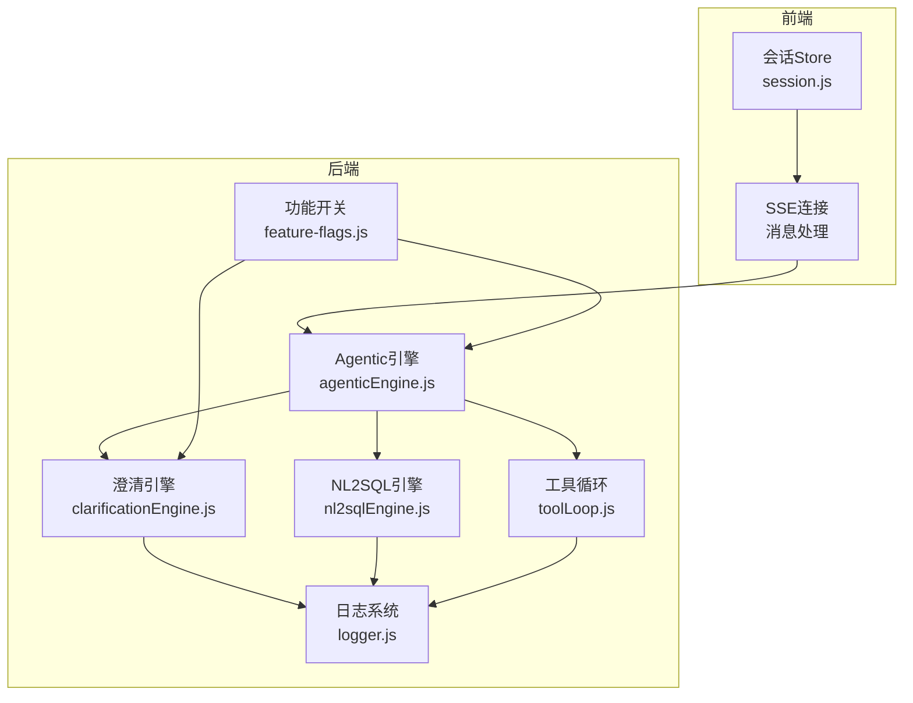
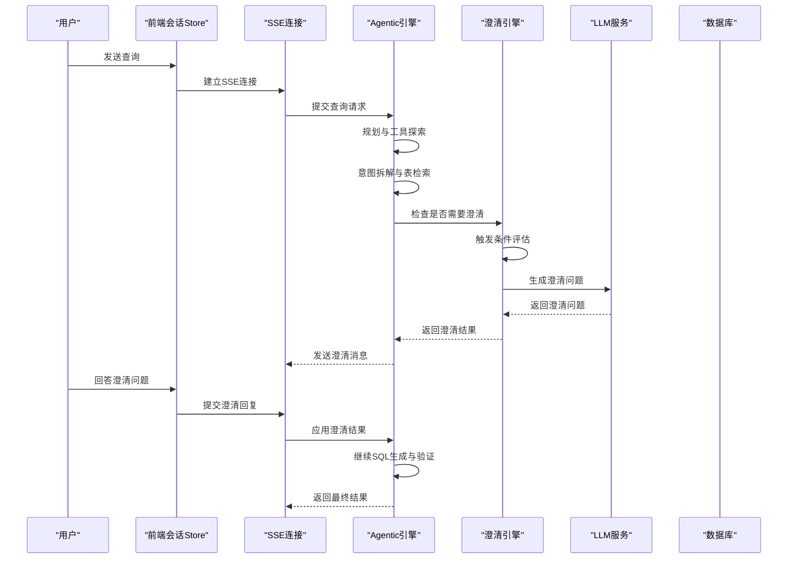
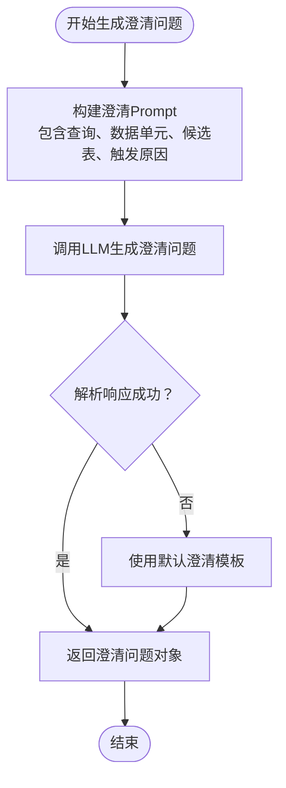
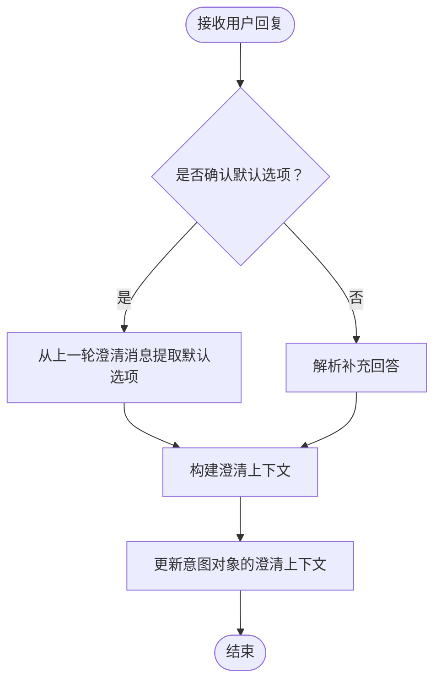
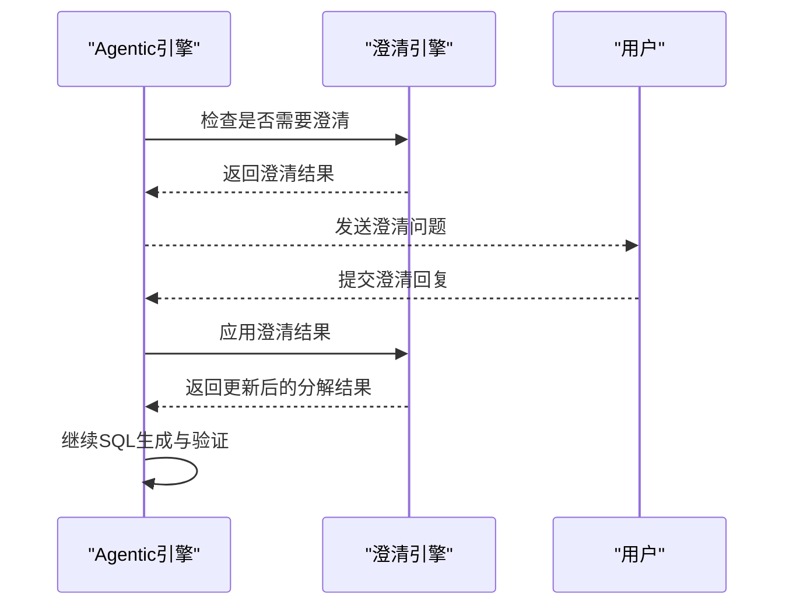
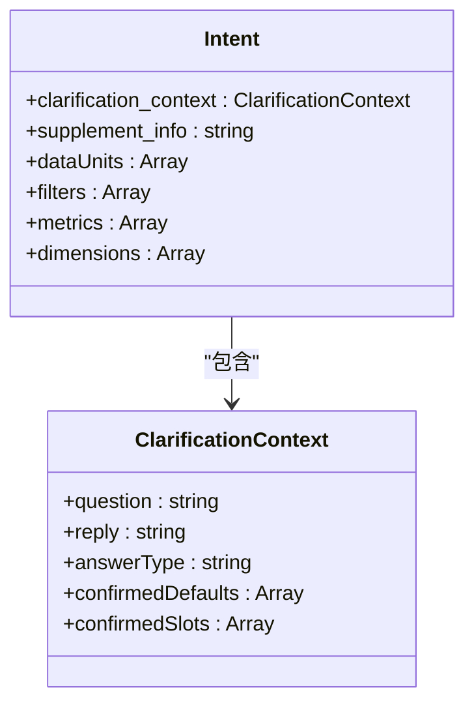
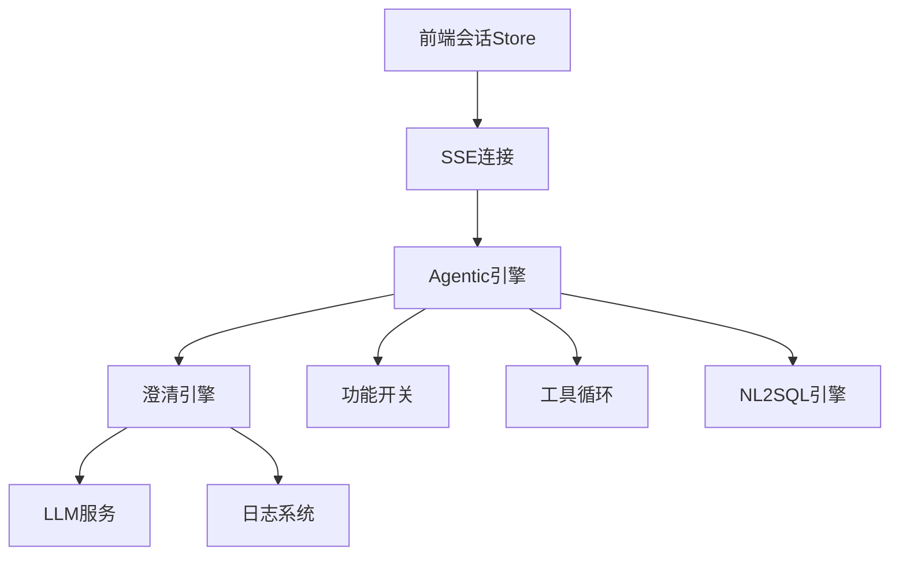

# 澄清机制

<cite>
**本文引用的文件**
- [clarificationEngine.js](file://backend/src/core/clarificationEngine.js)
- [agenticEngine.js](file://backend/src/core/agenticEngine.js)
- [nl2sqlEngine.js](file://backend/src/core/nl2sqlEngine.js)
- [toolLoop.js](file://backend/src/core/toolLoop.js)
- [feature-flags.js](file://backend/config/feature-flags.js)
- [logger.js](file://backend/src/utils/logger.js)
- [session.js](file://frontend/src/stores/session.js)
</cite>

## 目录
1. [简介](#简介)
2. [项目结构](#项目结构)
3. [核心组件](#核心组件)
4. [架构概览](#架构概览)
5. [详细组件分析](#详细组件分析)
6. [依赖关系分析](#依赖关系分析)
7. [性能考虑](#性能考虑)
8. [故障排查指南](#故障排查指南)
9. [结论](#结论)

## 简介
本技术文档深入解析NL2SQL系统中的澄清机制，重点阐述当用户查询信息不足时的主动澄清策略与实现方法。文档涵盖澄清触发条件、澄清问题生成、用户回复解析、默认选项提取、澄清上下文维护与传递、积极澄清与被动澄清的区别与应用场景，并提供具体的代码示例路径与使用模式，帮助开发者深入理解并高效实现澄清功能。

## 项目结构
NL2SQL系统采用分阶段的Agent工作流，澄清机制位于第三阶段（Phase 3: Clarification）。前端通过SSE接收后端的澄清消息，前端Store负责维护会话状态与消息历史，后端通过Agentic引擎协调各阶段流程并在需要时调用澄清引擎生成澄清问题。

图表来源
- [agenticEngine.js:1-653](file://backend/src/core/agenticEngine.js#L1-L653)
- [clarificationEngine.js:1-489](file://backend/src/core/clarificationEngine.js#L1-L489)
- [nl2sqlEngine.js:1-2652](file://backend/src/core/nl2sqlEngine.js#L1-L2652)
- [toolLoop.js:1-527](file://backend/src/core/toolLoop.js#L1-L527)
- [feature-flags.js:1-249](file://backend/config/feature-flags.js#L1-L249)
- [logger.js:1-442](file://backend/src/utils/logger.js#L1-L442)
- [session.js:1-400](file://frontend/src/stores/session.js#L1-L400)

章节来源
- [agenticEngine.js:1-653](file://backend/src/core/agenticEngine.js#L1-L653)
- [feature-flags.js:1-249](file://backend/config/feature-flags.js#L1-L249)

## 核心组件
- 澄清触发器（CLARIFICATION_TRIGGERS）：定义五种触发澄清的场景，包括数据单元无匹配表、表选择歧义、聚合指标来源不明确、时间粒度不明确、置信度过低。
- 澄清引擎（ClarificationEngine）：负责检查是否需要澄清、生成澄清问题、解析用户回复并应用澄清结果。
- Agentic引擎（AgenticNL2SQLEngine）：在第四阶段工作流中集成澄清机制，协调各阶段并处理澄清结果。
- NL2SQL引擎（nl2sqlEngine.js）：提供澄清上下文解析与默认选项提取能力，支持积极澄清与被动澄清。
- 功能开关（feature-flags.js）：控制澄清引擎的启用状态与相关行为。
- 日志系统（logger.js）：记录澄清过程中的关键信息，便于调试与追踪。
- 前端会话Store（session.js）：维护会话状态、消息历史与SSE连接，处理澄清消息的展示与交互。

章节来源
- [clarificationEngine.js:1-489](file://backend/src/core/clarificationEngine.js#L1-L489)
- [agenticEngine.js:1-653](file://backend/src/core/agenticEngine.js#L1-L653)
- [nl2sqlEngine.js:709-814](file://backend/src/core/nl2sqlEngine.js#L709-L814)
- [feature-flags.js:56-63](file://backend/config/feature-flags.js#L56-L63)
- [logger.js:1-442](file://backend/src/utils/logger.js#L1-L442)
- [session.js:1-400](file://frontend/src/stores/session.js#L1-L400)

## 架构概览
澄清机制在Agentic工作流中扮演关键角色，贯穿“规划-工具探索-意图拆解-澄清确认-SQL生成-验证-恢复”的完整链路。当Agentic引擎在第二阶段完成后，会调用澄清引擎检查是否需要澄清；若需要，则生成澄清问题并通过SSE返回给前端；前端Store接收澄清消息并等待用户回复；用户回复后，前端将回复发送至后端，后端通过Agentic引擎应用澄清结果并继续后续流程。

图表来源
- [agenticEngine.js:298-336](file://backend/src/core/agenticEngine.js#L298-L336)
- [clarificationEngine.js:246-272](file://backend/src/core/clarificationEngine.js#L246-L272)
- [session.js:268-278](file://frontend/src/stores/session.js#L268-L278)

## 详细组件分析

### 澄清触发器与触发条件
澄清触发器定义了五种触发场景，每种场景都有对应的检查函数、严重程度、优先级与消息模板：
- 数据单元无匹配表：当查询分解中的数据单元无法匹配到任何候选表时触发。
- 表选择歧义：当同类型数据单元匹配到多个表时触发。
- 聚合指标来源不明确：当同一指标同时存在于原始表与汇总表时触发。
- 时间粒度不明确：当时间单元的时间范围缺少粒度信息时触发。
- 置信度过低：当整体置信度低于阈值时触发。

触发器检查函数会综合查询分解结果、候选表列表与置信度，返回是否触发、严重程度与详细信息。随后按优先级排序，仅返回最高优先级的触发，避免一次性提出过多问题。

章节来源
- [clarificationEngine.js:26-182](file://backend/src/core/clarificationEngine.js#L26-L182)
- [clarificationEngine.js:196-232](file://backend/src/core/clarificationEngine.js#L196-L232)

### 澄清问题生成
澄清引擎通过构建包含原始查询、数据需求单元、候选表与触发原因的Prompt，调用LLM生成澄清问题。生成的澄清问题包含问题文本、选项列表、默认推荐、澄清类型与解释。若生成失败，将回退到默认澄清模板。

图表来源
- [clarificationEngine.js:246-272](file://backend/src/core/clarificationEngine.js#L246-L272)
- [clarificationEngine.js:277-312](file://backend/src/core/clarificationEngine.js#L277-L312)
- [clarificationEngine.js:317-328](file://backend/src/core/clarificationEngine.js#L317-L328)
- [clarificationEngine.js:333-374](file://backend/src/core/clarificationEngine.js#L333-L374)

章节来源
- [clarificationEngine.js:246-374](file://backend/src/core/clarificationEngine.js#L246-L374)

### 用户回复解析与默认选项提取
NL2SQL引擎提供积极澄清与被动澄清两种模式：
- 积极澄清：当用户明确确认默认选项时，系统会从上一轮澄清消息中提取默认选项并将其纳入当前意图的澄清上下文中。
- 被动澄清：当用户针对上一轮澄清提供补充回答时，系统会解析回答并更新澄清上下文。

默认选项提取支持两种方式：
- 结构化默认选项：优先使用消息元数据中的结构化默认选项列表。
- 文本解析默认选项：回退到从澄清消息文本中解析（兼容旧数据）。

图表来源
- [nl2sqlEngine.js:775-814](file://backend/src/core/nl2sqlEngine.js#L775-L814)
- [nl2sqlEngine.js:737-773](file://backend/src/core/nl2sqlEngine.js#L737-L773)

章节来源
- [nl2sqlEngine.js:709-814](file://backend/src/core/nl2sqlEngine.js#L709-L814)

### 澄清结果应用与上下文维护
Agentic引擎在第三阶段调用澄清引擎，若需要澄清则返回澄清问题；若不需要澄清则继续进入第四阶段。当用户提交澄清回复后，Agentic引擎调用澄清引擎应用澄清结果，更新分解结果并维护澄清历史。

图表来源
- [agenticEngine.js:298-336](file://backend/src/core/agenticEngine.js#L298-L336)
- [agenticEngine.js:618-620](file://backend/src/core/agenticEngine.js#L618-L620)
- [clarificationEngine.js:388-426](file://backend/src/core/clarificationEngine.js#L388-L426)

章节来源
- [agenticEngine.js:298-336](file://backend/src/core/agenticEngine.js#L298-L336)
- [agenticEngine.js:618-620](file://backend/src/core/agenticEngine.js#L618-L620)
- [clarificationEngine.js:388-426](file://backend/src/core/clarificationEngine.js#L388-L426)

### 澄清上下文的维护与传递
澄清上下文包含上一轮澄清问题、用户回复、回答类型（确认默认或补充）、确认的默认选项与确认的槽位信息。这些信息被注入到意图对象的澄清上下文中，供后续阶段使用。

图表来源
- [nl2sqlEngine.js:805-811](file://backend/src/core/nl2sqlEngine.js#L805-L811)

章节来源
- [nl2sqlEngine.js:775-814](file://backend/src/core/nl2sqlEngine.js#L775-L814)

### 积极澄清与被动澄清的区别与应用场景
- 积极澄清：适用于用户明确确认默认选项的场景，系统自动沿用上一轮澄清中的默认选项，减少用户输入负担。
- 被动澄清：适用于用户针对上一轮澄清提供补充信息的场景，系统解析补充回答并更新澄清上下文，确保后续SQL生成的准确性。

章节来源
- [nl2sqlEngine.js:775-814](file://backend/src/core/nl2sqlEngine.js#L775-L814)

## 依赖关系分析
澄清机制依赖多个核心模块与外部服务：
- LLM服务：用于生成澄清问题与解析用户回复。
- Schema工具与加载器：提供候选表与Schema信息，支撑澄清触发与问题生成。
- 功能开关：控制澄清引擎的启用状态与相关行为。
- 日志系统：记录澄清过程中的关键信息，便于调试与追踪。
- 前端SSE：负责与前端通信，传递澄清消息与接收用户回复。

图表来源
- [clarificationEngine.js:14-15](file://backend/src/core/clarificationEngine.js#L14-L15)
- [agenticEngine.js:20-29](file://backend/src/core/agenticEngine.js#L20-L29)
- [feature-flags.js:56-63](file://backend/config/feature-flags.js#L56-L63)
- [logger.js:1-442](file://backend/src/utils/logger.js#L1-L442)
- [session.js:1-400](file://frontend/src/stores/session.js#L1-L400)

章节来源
- [clarificationEngine.js:1-489](file://backend/src/core/clarificationEngine.js#L1-L489)
- [agenticEngine.js:1-653](file://backend/src/core/agenticEngine.js#L1-L653)
- [feature-flags.js:1-249](file://backend/config/feature-flags.js#L1-L249)
- [logger.js:1-442](file://backend/src/utils/logger.js#L1-L442)
- [session.js:1-400](file://frontend/src/stores/session.js#L1-L400)

## 性能考虑
- 触发器评估：通过优先级排序与仅返回最高优先级触发，避免一次性提出过多问题，提升用户体验。
- Prompt优化：澄清问题生成时仅包含必要的查询分析结果与候选表信息，减少Token消耗与响应延迟。
- 回退机制：当LLM解析失败时，使用默认澄清模板保证系统稳定性。
- 功能开关：通过功能开关控制澄清引擎的启用状态，便于在不同环境下灵活调整。

## 故障排查指南
- 澄清问题生成失败：检查LLM服务是否正常、Prompt构建是否正确、日志系统是否记录错误信息。
- 用户回复解析异常：确认前端SSE连接是否正常、消息类型是否正确、NL2SQL引擎的澄清上下文解析逻辑是否按预期工作。
- 澄清上下文丢失：检查Agentic引擎是否正确调用澄清引擎应用澄清结果、意图对象的澄清上下文是否被正确更新。
- 功能开关未生效：确认功能开关配置是否正确、环境变量是否设置、Agentic引擎是否按预期启用澄清引擎。

章节来源
- [logger.js:299-309](file://backend/src/utils/logger.js#L299-L309)
- [session.js:268-278](file://frontend/src/stores/session.js#L268-L278)
- [agenticEngine.js:316-328](file://backend/src/core/agenticEngine.js#L316-L328)

## 结论
NL2SQL系统的澄清机制通过五种触发场景、LLM驱动的澄清问题生成、积极与被动澄清的智能解析以及完善的上下文维护，有效提升了查询理解的准确性与用户体验。开发者可通过功能开关灵活启用澄清功能，并利用日志系统与前端SSE进行调试与监控，确保澄清流程的稳定运行。