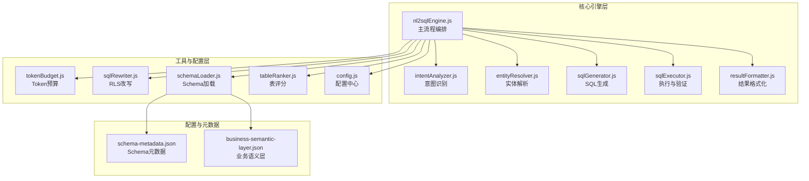
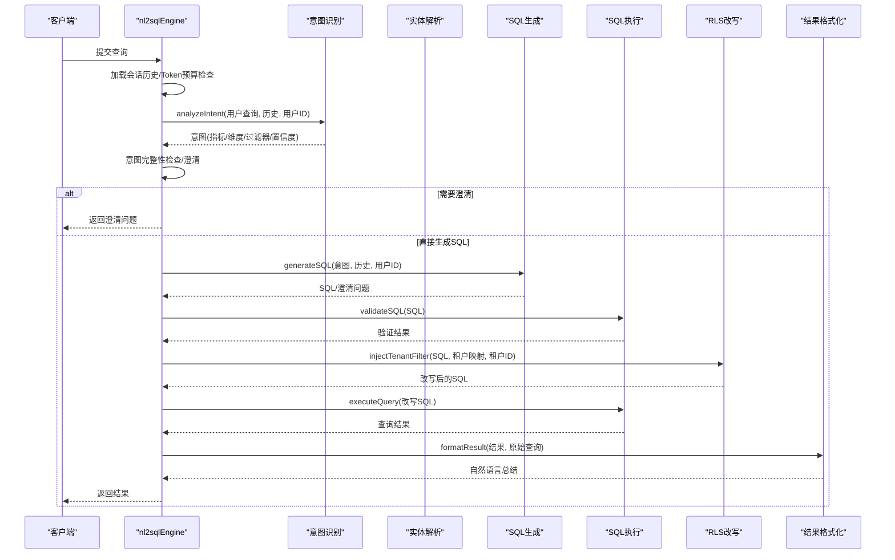
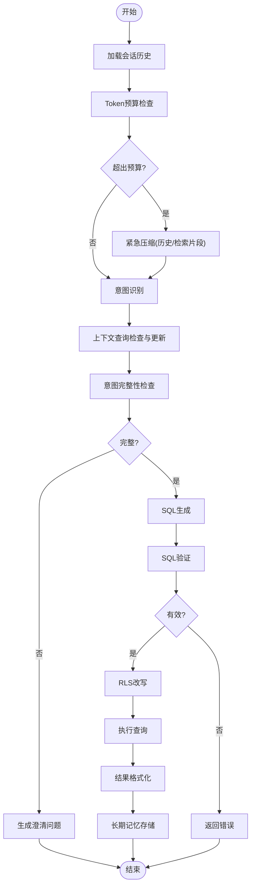
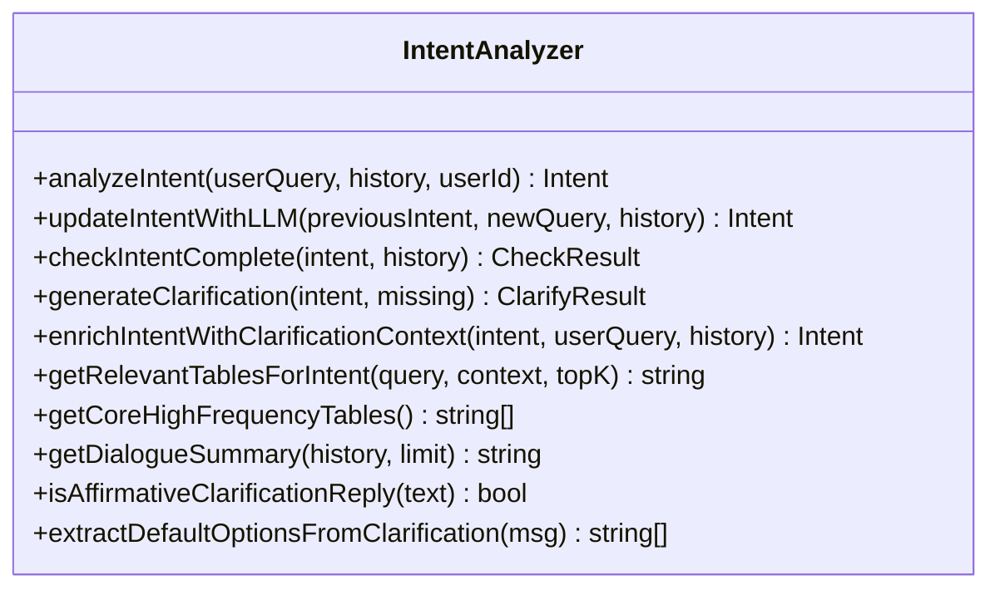
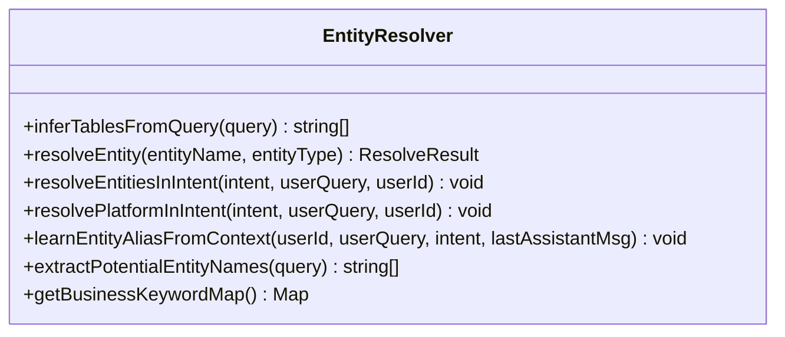
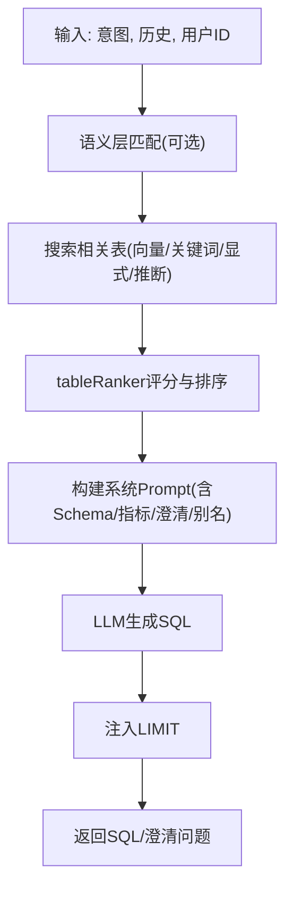
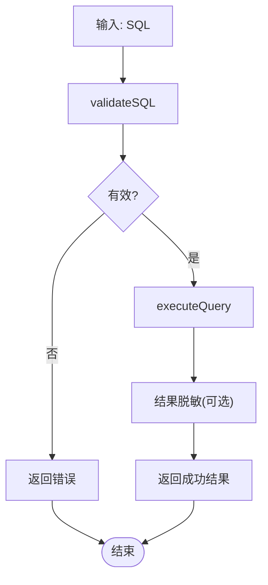
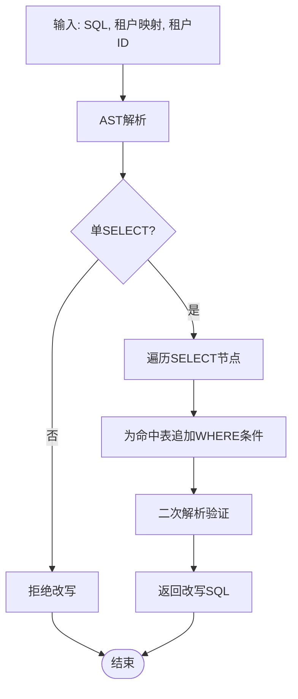
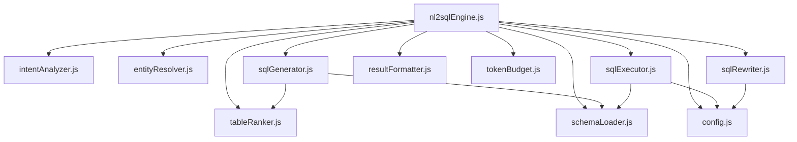

# NL2SQL 核心引擎

<cite>
**本文档引用的文件**
- [nl2sqlEngine.js](file://backend/src/core/nl2sqlEngine.js)
- [intentAnalyzer.js](file://backend/src/core/intentAnalyzer.js)
- [entityResolver.js](file://backend/src/core/entityResolver.js)
- [sqlGenerator.js](file://backend/src/core/sqlGenerator.js)
- [sqlExecutor.js](file://backend/src/core/sqlExecutor.js)
- [resultFormatter.js](file://backend/src/core/resultFormatter.js)
- [sqlRewriter.js](file://backend/src/utils/sqlRewriter.js)
- [schemaLoader.js](file://backend/src/core/schemaLoader.js)
- [tableRanker.js](file://backend/src/core/tableRanker.js)
- [tokenBudget.js](file://backend/src/utils/tokenBudget.js)
- [config.js](file://backend/src/core/config.js)
- [schema-metadata.json](file://backend/config/schema-metadata.json)
- [business-semantic-layer.json](file://backend/config/business-semantic-layer.json)
- [package.json](file://backend/package.json)
</cite>

## 目录
1. [简介](#简介)
2. [项目结构](#项目结构)
3. [核心组件](#核心组件)
4. [架构概览](#架构概览)
5. [详细组件分析](#详细组件分析)
6. [依赖分析](#依赖分析)
7. [性能考虑](#性能考虑)
8. [故障排查指南](#故障排查指南)
9. [结论](#结论)
10. [附录](#附录)

## 简介
NL2SQL 核心引擎是一个基于自然语言理解与机器学习的 SQL 自动生成系统，采用四阶段处理机制：意图识别、Schema 检索、SQL 生成、验证执行与结果格式化。本文档深入解析 nl2sqlEngine.js 的主流程编排，涵盖九个关键步骤、模块职责与协作关系、错误处理策略、性能优化技巧与调试方法，面向有经验的开发者提供完整的技术实现细节。

## 项目结构
后端采用模块化分层架构，核心模块位于 backend/src/core，工具与配置位于 backend/src/utils 与 backend/config。主要目录与文件：
- backend/src/core：核心引擎与子模块（nl2sqlEngine.js、intentAnalyzer.js、entityResolver.js、sqlGenerator.js、sqlExecutor.js、resultFormatter.js、schemaLoader.js、tableRanker.js 等）
- backend/src/utils：通用工具（tokenBudget.js、sqlRewriter.js、maskResult.js 等）
- backend/config：配置与元数据（schema-metadata.json、business-semantic-layer.json、feature-flags.js 等）
- backend/src/memory：长期记忆与向量存储（longTermMemory.js、vectorStore.js 等）

**图表来源**
- [nl2sqlEngine.js:1-756](file://backend/src/core/nl2sqlEngine.js#L1-L756)
- [intentAnalyzer.js:1-757](file://backend/src/core/intentAnalyzer.js#L1-L757)
- [entityResolver.js:1-459](file://backend/src/core/entityResolver.js#L1-L459)
- [sqlGenerator.js:1-485](file://backend/src/core/sqlGenerator.js#L1-L485)
- [sqlExecutor.js:1-175](file://backend/src/core/sqlExecutor.js#L1-L175)
- [resultFormatter.js:1-44](file://backend/src/core/resultFormatter.js#L1-L44)
- [tokenBudget.js:1-435](file://backend/src/utils/tokenBudget.js#L1-L435)
- [sqlRewriter.js:1-232](file://backend/src/utils/sqlRewriter.js#L1-L232)
- [schemaLoader.js:1-800](file://backend/src/core/schemaLoader.js#L1-L800)
- [tableRanker.js:1-280](file://backend/src/core/tableRanker.js#L1-L280)
- [config.js:1-439](file://backend/src/core/config.js#L1-L439)
- [schema-metadata.json:1-200](file://backend/config/schema-metadata.json#L1-L200)
- [business-semantic-layer.json:1-189](file://backend/config/business-semantic-layer.json#L1-L189)

**章节来源**
- [package.json:1-36](file://backend/package.json#L1-L36)

## 核心组件
- nl2sqlEngine.js：主流程编排，负责九个关键步骤的调度与错误处理，串联意图识别、实体解析、SQL 生成、执行验证、结果格式化与长期记忆存储。
- intentAnalyzer.js：意图识别与澄清，融合上下文与长期记忆，生成结构化意图并进行完整性检查。
- entityResolver.js：实体解析与平台识别，支持从查询中提取游戏/渠道等实体映射，学习用户别名。
- sqlGenerator.js：SQL 生成与表候选融合，基于意图构建 Prompt，调用 LLM 生成 SQL，并注入 LIMIT。
- sqlExecutor.js：SQL 验证与执行，白名单校验、安全限制、结果脱敏与行数截断。
- resultFormatter.js：结果格式化，将结构化查询结果转换为自然语言总结。
- schemaLoader.js：Schema 元数据加载与检索，支持向量化与关键词混合检索。
- tableRanker.js：统一表候选评分与排序，融合向量、语义、关键词、显式与推断信号。
- tokenBudget.js：Token 预算管理，上下文估算、超限压缩与建议。
- sqlRewriter.js：RLS 行级权限改写，基于 AST 在 WHERE 子句追加租户过滤条件。
- config.js：集中配置管理，包含 LLM、数据库、安全、会话、日志、评估等配置。

**章节来源**
- [nl2sqlEngine.js:111-734](file://backend/src/core/nl2sqlEngine.js#L111-L734)
- [intentAnalyzer.js:173-468](file://backend/src/core/intentAnalyzer.js#L173-L468)
- [entityResolver.js:67-341](file://backend/src/core/entityResolver.js#L67-L341)
- [sqlGenerator.js:84-479](file://backend/src/core/sqlGenerator.js#L84-L479)
- [sqlExecutor.js:34-169](file://backend/src/core/sqlExecutor.js#L34-L169)
- [resultFormatter.js:12-39](file://backend/src/core/resultFormatter.js#L12-L39)
- [schemaLoader.js:75-800](file://backend/src/core/schemaLoader.js#L75-L800)
- [tableRanker.js:244-270](file://backend/src/core/tableRanker.js#L244-L270)
- [tokenBudget.js:115-372](file://backend/src/utils/tokenBudget.js#L115-L372)
- [sqlRewriter.js:40-127](file://backend/src/utils/sqlRewriter.js#L40-L127)
- [config.js:20-439](file://backend/src/core/config.js#L20-L439)

## 架构概览
NL2SQL 核心引擎采用“编排层 + 子模块”的解耦设计，编排层负责流程控制与错误处理，子模块专注单一能力，通过清晰的接口契约协作。系统支持：
- 意图识别与澄清：结合上下文与长期记忆，动态生成澄清问题。
- Schema 检索与表评分：向量检索 + 语义层 + 关键词 + 显式 + 推断信号融合。
- SQL 生成与安全：LLM 生成 + LIMIT 注入 + 白名单校验。
- RLS 改写与执行：AST 解析 + WHERE 追加 + 结果脱敏。
- 结果格式化与长期记忆：自然语言总结 + 用户偏好学习。

**图表来源**
- [nl2sqlEngine.js:157-734](file://backend/src/core/nl2sqlEngine.js#L157-L734)
- [intentAnalyzer.js:396-468](file://backend/src/core/intentAnalyzer.js#L396-L468)
- [sqlGenerator.js:454-479](file://backend/src/core/sqlGenerator.js#L454-L479)
- [sqlExecutor.js:72-169](file://backend/src/core/sqlExecutor.js#L72-L169)
- [sqlRewriter.js:40-127](file://backend/src/utils/sqlRewriter.js#L40-L127)
- [resultFormatter.js:12-39](file://backend/src/core/resultFormatter.js#L12-L39)

## 详细组件分析

### 主流程编排（processQuery）
nl2sqlEngine.js 的 processQuery 是核心编排入口，包含九个关键步骤：
1) 加载会话历史与用户上下文
2) Token 预算检查与紧急压缩
3) 意图识别（融合上下文与长期记忆）
4) 上下文查询智能更新与澄清上下文融合
5) 意图完整性检查与澄清生成
6) SQL 生成（含部分回答校验）
7) SQL 验证与 RLS 改写
8) 查询执行与结果脱敏
9) 结果格式化与长期记忆存储

**图表来源**
- [nl2sqlEngine.js:157-734](file://backend/src/core/nl2sqlEngine.js#L157-L734)

**章节来源**
- [nl2sqlEngine.js:121-734](file://backend/src/core/nl2sqlEngine.js#L121-L734)

### 意图识别模块（intentAnalyzer.js）
职责：
- 从用户自然语言查询识别意图（时间范围、指标、维度、过滤器、置信度）
- 上下文理解：结合对话历史与长期记忆理解当前轮
- 意图完整性检查 + 澄清问题生成

关键能力：
- 相关表动态检索：向量检索 + 高频核心表回退
- 对话摘要与澄清辅助：肯定回答识别、默认选项提取
- 意图合并与更新：基于上一轮澄清与用户补充回答进行意图融合
- 澄清生成：结构化槽位与默认选项

**图表来源**
- [intentAnalyzer.js:173-756](file://backend/src/core/intentAnalyzer.js#L173-L756)

**章节来源**
- [intentAnalyzer.js:173-756](file://backend/src/core/intentAnalyzer.js#L173-L756)

### 实体解析模块（entityResolver.js）
职责：
- 业务关键词到表的映射（inferTablesFromQuery）
- 实体名称到 ID 的映射（resolveEntity）
- 意图内实体解析（resolveEntitiesInIntent，含长期记忆 + DB 模糊匹配 + 歧义澄清）
- 平台术语识别（resolvePlatformInIntent：新/老平台 → datasource）
- 上下文别名学习（learnEntityAliasFromContext）

**图表来源**
- [entityResolver.js:43-459](file://backend/src/core/entityResolver.js#L43-L459)

**章节来源**
- [entityResolver.js:67-341](file://backend/src/core/entityResolver.js#L67-L341)

### SQL 生成模块（sqlGenerator.js）
职责：
- 根据意图构建 Prompt 并调用 LLM 生成 SQL
- 候选表信号融合（向量 / 语义 / 关键词 / 显式 / 推断）由 tableRanker 统一打分
- LIMIT 强制注入（调用 sqlLimit.ensureLimit）
- Schema 业务映射提示（帮助 LLM 理解业务术语与表/字段的对应）

关键流程：
- 业务语义层匹配（可选）
- 表候选检索 + tableRanker 统一打分
- 构建系统 Prompt（包含 Schema、指标定义、澄清信息、字段别名）
- LLM 生成 SQL，必要时返回 needClarification

**图表来源**
- [sqlGenerator.js:84-479](file://backend/src/core/sqlGenerator.js#L84-L479)
- [tableRanker.js:244-270](file://backend/src/core/tableRanker.js#L244-L270)

**章节来源**
- [sqlGenerator.js:84-479](file://backend/src/core/sqlGenerator.js#L84-L479)

### SQL 执行与验证（sqlExecutor.js）
职责：
- validateSQL：安全性校验（白名单 + SELECT/WITH 前缀 + LIMIT 必须存在）
- executeQuery：连接 SR 业务库执行 SQL，返回统一结构
- 结果脱敏：基于配置规则对敏感字段进行脱敏处理

**图表来源**
- [sqlExecutor.js:34-169](file://backend/src/core/sqlExecutor.js#L34-L169)

**章节来源**
- [sqlExecutor.js:34-169](file://backend/src/core/sqlExecutor.js#L34-L169)

### 结果格式化（resultFormatter.js）
职责：
- 将 executeQuery 返回的结构化结果转换为自然语言总结
- 失败路径返回简短错误文本；成功路径调 LLM 生成关键数据点 + 趋势 + 异常描述

**章节来源**
- [resultFormatter.js:12-39](file://backend/src/core/resultFormatter.js#L12-L39)

### RLS 改写（sqlRewriter.js）
职责：
- 在 SQL 已通过 validateSQL 后、真实执行前，基于 AST 遍历
- 对命中 tableTenantMap 的表在 WHERE 里追加 `<alias>.<tenantCol> = <tenantId>`
- 设计约束：解析失败/AST 结构无法识别 → 全部 refused:true，中止执行

**图表来源**
- [sqlRewriter.js:40-127](file://backend/src/utils/sqlRewriter.js#L40-L127)

**章节来源**
- [sqlRewriter.js:40-127](file://backend/src/utils/sqlRewriter.js#L40-L127)

### Schema 加载与检索（schemaLoader.js）
职责：
- 加载和管理数据表的 Schema 信息，包括表结构、字段、关系、预定义指标与维度
- 提供 Schema 查询与匹配接口，支持向量化与关键词混合检索
- 验证 SQL 语句的表和字段

关键能力：
- 向量检索：基于表级表征与语义搜索
- 关键词匹配：简单高效的关键词匹配回退
- 平台类型推断：根据 game_id 推断新/老平台

**章节来源**
- [schemaLoader.js:75-800](file://backend/src/core/schemaLoader.js#L75-L800)

### 表候选统一评分（tableRanker.js）
职责：
- 融合 4 类信号：向量检索、业务语义层、关键词命中、显式/推断表名
- 归一化 + 核心表保护 + 上限截断（默认 8）
- 选择策略：核心表优先保留，其余补足

**章节来源**
- [tableRanker.js:244-270](file://backend/src/core/tableRanker.js#L244-L270)

### Token 预算管理（tokenBudget.js）
职责：
- 上下文 Token 估算与预算控制
- 超限压缩策略：历史对话裁剪、检索片段压缩
- 建议生成与状态摘要

**章节来源**
- [tokenBudget.js:115-372](file://backend/src/utils/tokenBudget.js#L115-L372)

## 依赖分析
模块间依赖关系与耦合度：
- 编排层（nl2sqlEngine.js）依赖所有子模块，耦合度高但职责清晰
- 子模块内部低耦合，通过接口契约交互
- 工具模块（tokenBudget.js、sqlRewriter.js）与核心模块松耦合
- 配置模块（config.js）集中管理，被广泛使用

**图表来源**
- [nl2sqlEngine.js:32-37](file://backend/src/core/nl2sqlEngine.js#L32-L37)
- [sqlGenerator.js:15-23](file://backend/src/core/sqlGenerator.js#L15-L23)
- [sqlExecutor.js:15-19](file://backend/src/core/sqlExecutor.js#L15-L19)
- [sqlRewriter.js:15-20](file://backend/src/utils/sqlRewriter.js#L15-L20)
- [schemaLoader.js:15-26](file://backend/src/core/schemaLoader.js#L15-L26)
- [tableRanker.js:25-26](file://backend/src/core/tableRanker.js#L25-L26)
- [config.js:14](file://backend/src/core/config.js#L14)

**章节来源**
- [nl2sqlEngine.js:32-37](file://backend/src/core/nl2sqlEngine.js#L32-L37)

## 性能考虑
- Token 预算控制：通过 tokenBudget.js 估算与压缩，避免上下文超限导致的性能下降
- 向量检索优化：schemaLoader.js 使用表级向量与智能搜索，减少无效检索
- 表候选评分：tableRanker.js 统一评分与核心表保护，降低不必要的 JOIN
- 结果脱敏与截断：sqlExecutor.js 控制返回行数与脱敏，避免内存压力
- 配置化开关：config.js 提供大量开关（如 RESULT_MASKING、RLS_ENABLED），按需启用
- 异步长期记忆：longTermMemory.js 使用队列异步存储，不影响主流程

[本节为通用指导，无需具体文件分析]

## 故障排查指南
常见错误与处理：
- NL2SQLError：统一错误封装，包含类型、详情与恢复性标记
- SQL 验证失败：validateSQL 返回具体原因（前缀/关键字/白名单/LIMIT）
- RLS 改写拒绝：injectTenantFilter 返回拒绝原因，中止执行
- 执行错误：executeQuery 返回错误码与堆栈，便于定位
- 长期记忆失败：longTermMemory.js 捕获异常并记录，不影响主流程

调试建议：
- 启用详细日志：config.js 中 LOG_LEVEL 调整为 debug/trace
- 使用 DryRun：config.js 中 security.dryRun 仅生成 SQL 不执行
- 检查 Token 预算：tokenBudget.js 输出预算状态与建议
- 核对配置：确保 LLM_API_KEY、SR_DATABASE_URL、ALLOWED_TABLES 等配置正确

**章节来源**
- [nl2sqlEngine.js:54-105](file://backend/src/core/nl2sqlEngine.js#L54-L105)
- [sqlExecutor.js:94-169](file://backend/src/core/sqlExecutor.js#L94-L169)
- [sqlRewriter.js:40-127](file://backend/src/utils/sqlRewriter.js#L40-L127)
- [config.js:407-439](file://backend/src/core/config.js#L407-L439)

## 结论
NL2SQL 核心引擎通过清晰的模块划分与编排层设计，实现了从自然语言到 SQL 的稳健转换。四阶段处理机制与九步主流程确保了意图理解、Schema 检索、SQL 生成、验证执行与结果格式化的完整性。配套的 Token 预算、RLS 改写、结果脱敏与长期记忆机制进一步提升了系统的安全性、可扩展性与用户体验。面向生产环境，建议结合配置开关与监控指标持续优化性能与稳定性。

[本节为总结，无需具体文件分析]

## 附录
- 配置项概览：LLM API、Embedding、数据库连接、安全策略、会话管理、日志级别、评估开关等
- Schema 元数据：表结构、字段定义、关系、指标与维度
- 业务语义层：概念映射、查询模式与字段映射

**章节来源**
- [config.js:64-439](file://backend/src/core/config.js#L64-L439)
- [schema-metadata.json:1-200](file://backend/config/schema-metadata.json#L1-L200)
- [business-semantic-layer.json:1-189](file://backend/config/business-semantic-layer.json#L1-L189)