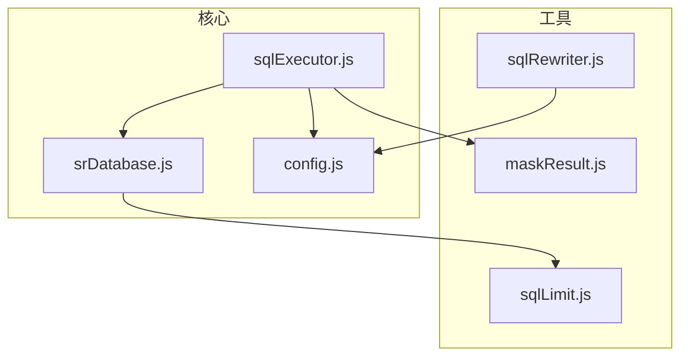
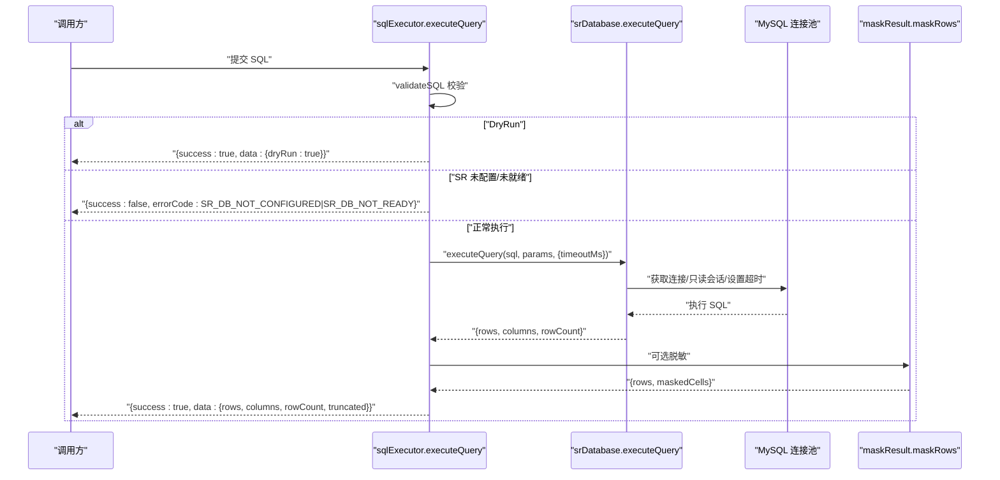
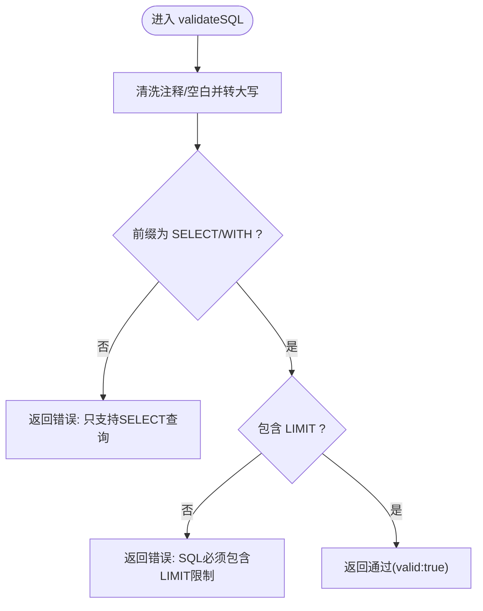
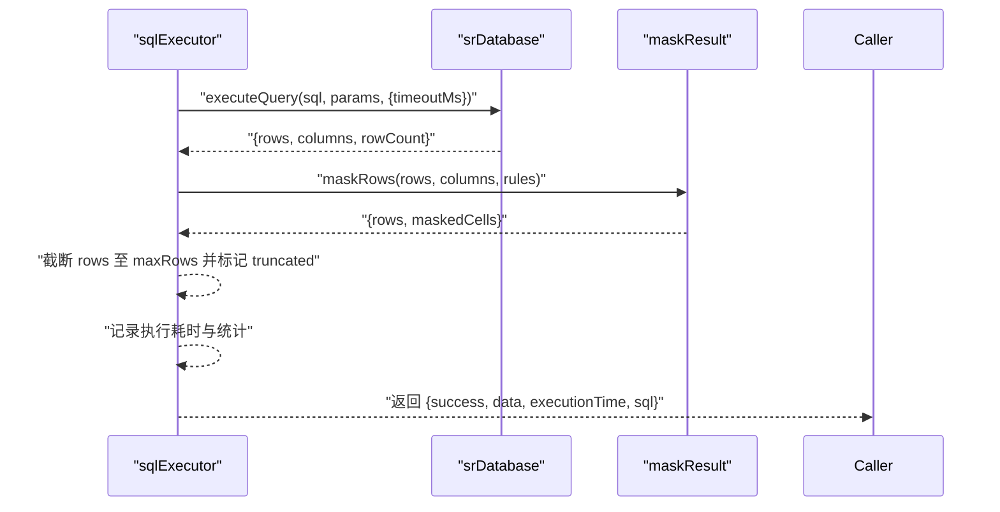
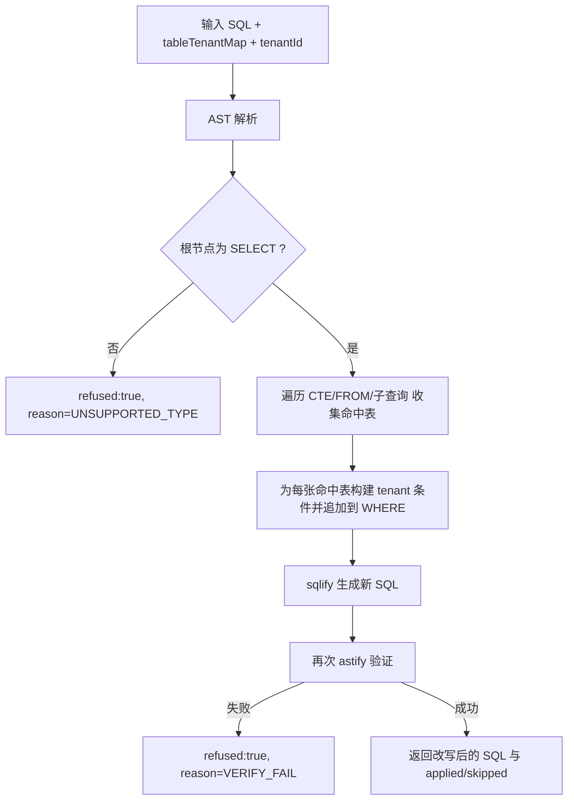
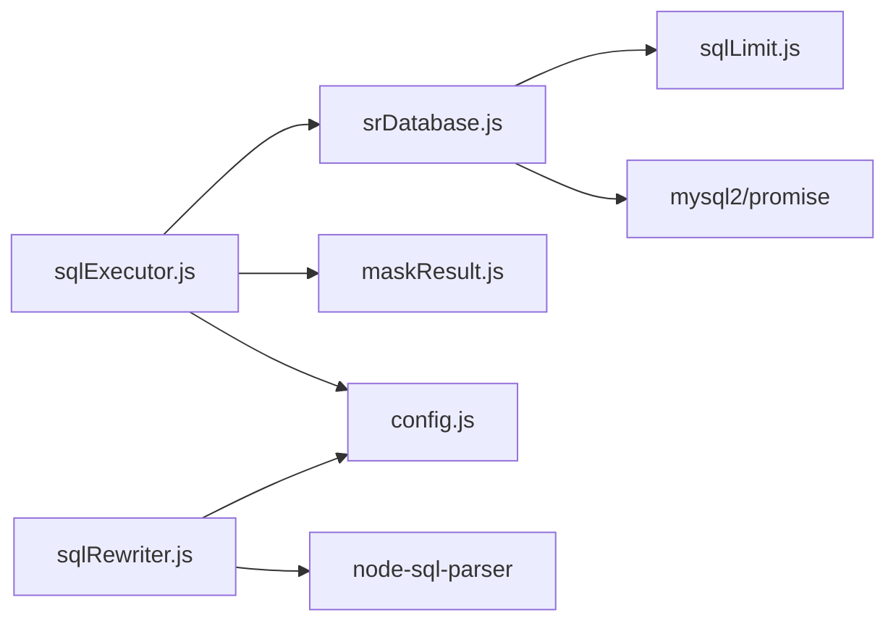

# SQL 执行器

<cite>
**本文引用的文件**
- [sqlExecutor.js](file://backend/src/core/sqlExecutor.js)
- [sqlRewriter.js](file://backend/src/utils/sqlRewriter.js)
- [srDatabase.js](file://backend/src/core/srDatabase.js)
- [sqlLimit.js](file://backend/src/utils/sqlLimit.js)
- [maskResult.js](file://backend/src/utils/maskResult.js)
- [config.js](file://backend/src/core/config.js)
- [test-sqlRewriter.js](file://backend/test/phase3/test-sqlRewriter.js)
- [test-sqlExecutor-exports.js](file://backend/test/phase4/test-sqlExecutor-exports.js)
- [test-executeQuery.js](file://backend/test/phase1/test-executeQuery.js)
- [schema-metadata.json](file://backend/config/schema-metadata.json)
</cite>

## 目录
1. [简介](#简介)
2. [项目结构](#项目结构)
3. [核心组件](#核心组件)
4. [架构总览](#架构总览)
5. [详细组件分析](#详细组件分析)
6. [依赖关系分析](#依赖关系分析)
7. [性能考量](#性能考量)
8. [故障排查指南](#故障排查指南)
9. [结论](#结论)
10. [附录](#附录)

## 简介
本文件为 SQL 执行器模块的技术文档，聚焦以下目标：
- 深入解析 sqlExecutor.js 的 SQL 验证与执行流程，包括安全检查、连接管理、超时控制、错误码与回退机制。
- 深入解析 sqlRewriter.js 的 SQL 重写器，实现行级权限控制（RLS），包括租户过滤条件注入、表级权限验证与动态安全策略。
- 提供执行结果格式化、错误码定义与回退机制说明，并给出典型执行场景的示例路径与最佳实践。

## 项目结构
本模块位于后端工程 backend/src/core 与 backend/src/utils 下，围绕“验证 → 改写 → 执行”的解耦流程组织：
- 核心执行器：sqlExecutor.js
- 数据库执行层：srDatabase.js（MySQL 连接池封装）
- SQL 改写器：sqlRewriter.js（基于 AST 的租户过滤注入）
- 辅助工具：sqlLimit.js（外层 LIMIT 注入/校验）、maskResult.js（结果脱敏）
- 配置中心：config.js（集中管理安全、RLS、数据库与脱敏策略）

图表来源
- [sqlExecutor.js:1-175](file://backend/src/core/sqlExecutor.js#L1-L175)
- [srDatabase.js:1-156](file://backend/src/core/srDatabase.js#L1-L156)
- [sqlRewriter.js:1-232](file://backend/src/utils/sqlRewriter.js#L1-L232)
- [sqlLimit.js:1-37](file://backend/src/utils/sqlLimit.js#L1-L37)
- [maskResult.js:1-198](file://backend/src/utils/maskResult.js#L1-L198)
- [config.js:1-439](file://backend/src/core/config.js#L1-L439)

章节来源
- [sqlExecutor.js:1-175](file://backend/src/core/sqlExecutor.js#L1-L175)
- [srDatabase.js:1-156](file://backend/src/core/srDatabase.js#L1-L156)
- [sqlRewriter.js:1-232](file://backend/src/utils/sqlRewriter.js#L1-L232)
- [sqlLimit.js:1-37](file://backend/src/utils/sqlLimit.js#L1-L37)
- [maskResult.js:1-198](file://backend/src/utils/maskResult.js#L1-L198)
- [config.js:1-439](file://backend/src/core/config.js#L1-L439)

## 核心组件
- SQL 验证器（validateSQL）
  - 基于白名单与关键字过滤，确保仅允许 SELECT/WITH 且必须包含 LIMIT。
  - 清洗注释与空白后进行前缀与 LIMIT 校验。
- SQL 执行器（executeQuery）
  - DryRun 模式、SR 数据源未配置/未就绪、执行异常的统一错误码。
  - 通过 srDatabase 执行查询，应用行数上限与“截断”标记。
  - 可选结果脱敏（基于配置与特征开关）。
- SQL 重写器（injectTenantFilter）
  - 基于 AST 遍历，对命中表注入租户过滤条件（WHERE 追加）。
  - 支持单表、JOIN、UNION、CTE、FROM 子查询等复杂结构。
  - 解析失败/改写失败一律拒绝（refused:true），保证“安全不依赖对齐”。
- 数据库执行层（srDatabase）
  - 基于 mysql2/promise 的连接池，只读会话 + 超时控制。
  - 执行前在外层补全 LIMIT，避免大结果集回传。
- 结果脱敏（maskResult）
  - 规则驱动，列名大小写不敏感，支持对象行与数组行。
- 配置中心（config）
  - 安全策略、RLS、数据库连接、脱敏规则、DryRun 等集中管理。

章节来源
- [sqlExecutor.js:34-66](file://backend/src/core/sqlExecutor.js#L34-L66)
- [sqlExecutor.js:72-169](file://backend/src/core/sqlExecutor.js#L72-L169)
- [sqlRewriter.js:40-127](file://backend/src/utils/sqlRewriter.js#L40-L127)
- [srDatabase.js:95-127](file://backend/src/core/srDatabase.js#L95-L127)
- [maskResult.js:131-184](file://backend/src/utils/maskResult.js#L131-L184)
- [config.js:122-211](file://backend/src/core/config.js#L122-L211)

## 架构总览
SQL 执行器遵循“验证 → 改写 → 执行”的解耦设计：
- 验证阶段：validateSQL 保证 SQL 类型与 LIMIT 存在，结合白名单与关键字过滤。
- 改写阶段：sqlRewriter 基于 AST 对命中表注入租户过滤条件，严格拒绝解析/改写失败。
- 执行阶段：srDatabase 以只读会话 + 超时控制执行 SQL，返回标准化结构；sqlExecutor 进行行数截断与可选脱敏。

图表来源
- [sqlExecutor.js:72-169](file://backend/src/core/sqlExecutor.js#L72-L169)
- [srDatabase.js:95-127](file://backend/src/core/srDatabase.js#L95-L127)
- [maskResult.js:131-184](file://backend/src/utils/maskResult.js#L131-L184)

## 详细组件分析

### SQL 验证器（validateSQL）
- 安全检查机制
  - 调用 schemaLoader.validateSQL 进行白名单与结构校验（具体白名单由 schemaLoader 实现决定）。
  - 清洗注释与空白后，仅允许 SELECT/WITH 前缀。
  - 强制要求 SQL 包含 LIMIT（忽略末尾分号与空白）。
- 关键路径
  - 清洗与前缀判断：[sqlExecutor.js:41-56](file://backend/src/core/sqlExecutor.js#L41-L56)
  - LIMIT 校验：[sqlExecutor.js:58-65](file://backend/src/core/sqlExecutor.js#L58-L65)

图表来源
- [sqlExecutor.js:34-66](file://backend/src/core/sqlExecutor.js#L34-L66)

章节来源
- [sqlExecutor.js:34-66](file://backend/src/core/sqlExecutor.js#L34-L66)

### SQL 执行器（executeQuery）
- 执行流程
  - DryRun 检查：若开启，直接返回空结果并标记 dryRun。
  - SR 数据源检查：未配置或未就绪返回对应错误码。
  - 执行查询：通过 srDatabase.executeQuery 获取 rows/columns/rowCount。
  - 行数限制与截断：根据配置 maxRows 截断并标记 truncated。
  - 结果脱敏：在特征开关与配置允许下，对敏感字段进行脱敏。
  - 性能监控：记录执行耗时与脱敏统计。
  - 错误处理：捕获异常并返回统一结构，包含 errorCode。
- 错误码
  - DRY_RUN：DryRun 模式。
  - SR_DB_NOT_CONFIGURED：SR 数据源 URL 未配置。
  - SR_DB_NOT_READY：连接池未就绪。
  - SR_EXEC_ERROR：执行异常（未指定具体 code 时默认）。
- 关键路径
  - DryRun 分支：[sqlExecutor.js:77-92](file://backend/src/core/sqlExecutor.js#L77-L92)
  - SR 未配置/未就绪分支：[sqlExecutor.js:94-112](file://backend/src/core/sqlExecutor.js#L94-L112)
  - 执行与脱敏：[sqlExecutor.js:114-135](file://backend/src/core/sqlExecutor.js#L114-L135)
  - 统一返回与错误处理：[sqlExecutor.js:137-168](file://backend/src/core/sqlExecutor.js#L137-L168)

图表来源
- [sqlExecutor.js:72-169](file://backend/src/core/sqlExecutor.js#L72-L169)
- [srDatabase.js:95-127](file://backend/src/core/srDatabase.js#L95-L127)
- [maskResult.js:131-184](file://backend/src/utils/maskResult.js#L131-L184)

章节来源
- [sqlExecutor.js:72-169](file://backend/src/core/sqlExecutor.js#L72-L169)

### SQL 重写器（injectTenantFilter）
- 设计约束
  - 解析失败/改写失败一律 refused:true，拒绝上游执行。
  - 覆盖范围：单表 SELECT、JOIN、UNION/INTERSECT/EXCEPT、CTE、FROM 子查询。
  - 不覆盖 INSERT/UPDATE/DELETE（这些已被 validateSQL 的白名单拦截）。
  - 仅在 WHERE 追加租户条件，不改写 ON 条件。
- AST 遍历与注入
  - 解析 SQL 为 AST，限定根节点为 select。
  - 遍历 CTE、FROM、子查询，收集命中表并注入 tenant 条件。
  - 改写后再次解析验证，确保改写后的 SQL 仍可被解析。
- 关键路径
  - 注入租户过滤条件：[sqlRewriter.js:40-127](file://backend/src/utils/sqlRewriter.js#L40-L127)
  - AST 遍历与 WHERE 追加：[sqlRewriter.js:136-180](file://backend/src/utils/sqlRewriter.js#L136-L180)
  - 条件构建：[sqlRewriter.js:185-200](file://backend/src/utils/sqlRewriter.js#L185-L200)
  - 环境映射解析：[sqlRewriter.js:218-226](file://backend/src/utils/sqlRewriter.js#L218-L226)

图表来源
- [sqlRewriter.js:40-127](file://backend/src/utils/sqlRewriter.js#L40-L127)
- [sqlRewriter.js:136-180](file://backend/src/utils/sqlRewriter.js#L136-L180)

章节来源
- [sqlRewriter.js:1-232](file://backend/src/utils/sqlRewriter.js#L1-L232)

### 数据库执行层（srDatabase）
- 连接池与只读保护
  - 基于 mysql2/promise 创建连接池，懒加载依赖。
  - 每次取连接后设置 SESSION TRANSACTION READ ONLY，确保只读。
- 超时控制
  - 通过 SESSION MAX_EXECUTION_TIME 与 query timeout 双重兜底。
- 外层 LIMIT 补全
  - 若 SQL 未包含外层 LIMIT，则在执行前按 maxRows 注入 LIMIT，避免大结果集回传。
- 关键路径
  - 初始化与探活：[srDatabase.js:42-86](file://backend/src/core/srDatabase.js#L42-L86)
  - 执行查询与只读/超时设置：[srDatabase.js:95-127](file://backend/src/core/srDatabase.js#L95-L127)
  - 外层 LIMIT 注入：[srDatabase.js:104-110](file://backend/src/core/srDatabase.js#L104-L110)

章节来源
- [srDatabase.js:1-156](file://backend/src/core/srDatabase.js#L1-L156)
- [sqlLimit.js:16-34](file://backend/src/utils/sqlLimit.js#L16-L34)

### 结果脱敏（maskResult）
- 规则驱动
  - 支持 mid_4、domain_only、head_tail、redact、first_1、last_4、length_stars 等规则。
  - 列名大小写不敏感，null/undefined 值透传。
- 输入形态
  - 支持对象行与数组行，配合 columns 数组或对象数组。
- 关键路径
  - 规则实现与映射：[maskResult.js:83-91](file://backend/src/utils/maskResult.js#L83-L91)
  - 脱敏主入口：[maskResult.js:131-184](file://backend/src/utils/maskResult.js#L131-L184)

章节来源
- [maskResult.js:1-198](file://backend/src/utils/maskResult.js#L1-L198)

### 配置中心（config）
- 安全与 RLSS
  - forbiddenKeywords：禁止关键字白名单（如 UPDATE/DELETE/DROP 等）。
  - rls.enabled 与 rls.tableTenantMap：RLS 开关与表到租户列映射。
  - masking.enabled 与 masking.rules：结果脱敏开关与规则。
  - dryRun：开发调试用的只生成 SQL 不执行。
- 数据库与超时
  - srDatabase.url/enabled/queryTimeoutMs/maxRows/pool：数据库连接与执行限制。
- 关键路径
  - RLS 环境解析与映射：[config.js:207-210](file://backend/src/core/config.js#L207-L210)
  - 安全与脱敏配置：[config.js:153-211](file://backend/src/core/config.js#L153-L211)

章节来源
- [config.js:1-439](file://backend/src/core/config.js#L1-439)

## 依赖关系分析
- 模块耦合
  - sqlExecutor 依赖 srDatabase、maskResult、config、schemaLoader（白名单校验）。
  - srDatabase 依赖 sqlLimit（外层 LIMIT 注入）。
  - sqlRewriter 依赖 node-sql-parser（AST 解析）与 config（RLS 映射）。
- 外部依赖
  - mysql2/promise：MySQL 连接池。
  - node-sql-parser：SQL AST 解析与重写。
- 循环依赖规避
  - 通过延迟 require 与功能拆分，避免直接循环依赖。

图表来源
- [sqlExecutor.js:15-28](file://backend/src/core/sqlExecutor.js#L15-L28)
- [srDatabase.js:25-35](file://backend/src/core/srDatabase.js#L25-L35)
- [sqlRewriter.js:15-20](file://backend/src/utils/sqlRewriter.js#L15-L20)

章节来源
- [sqlExecutor.js:15-28](file://backend/src/core/sqlExecutor.js#L15-L28)
- [srDatabase.js:25-35](file://backend/src/core/srDatabase.js#L25-L35)
- [sqlRewriter.js:15-20](file://backend/src/utils/sqlRewriter.js#L15-L20)

## 性能考量
- 外层 LIMIT 控制
  - srDatabase 在执行前补全 LIMIT，避免大结果集回传，降低网络与内存压力。
- 只读会话与超时
  - 只读会话避免写操作风险；MAX_EXECUTION_TIME + query timeout 双重兜底，防止慢查询拖垮系统。
- 行数截断
  - sqlExecutor 根据 maxRows 截断并标记 truncated，避免前端渲染与传输负担。
- 脱敏成本
  - maskResult 采用规则映射与预计算，避免重复扫描；仅在启用开关时执行。

章节来源
- [srDatabase.js:104-110](file://backend/src/core/srDatabase.js#L104-L110)
- [srDatabase.js:114-117](file://backend/src/core/srDatabase.js#L114-L117)
- [sqlExecutor.js:118-120](file://backend/src/core/sqlExecutor.js#L118-L120)
- [maskResult.js:131-184](file://backend/src/utils/maskResult.js#L131-L184)

## 故障排查指南
- DryRun 模式
  - 现象：executeQuery 返回空结果并标记 dryRun。
  - 排查：检查 config.security.dryRun 是否为 true。
  - 参考：[sqlExecutor.js:77-92](file://backend/src/core/sqlExecutor.js#L77-L92)
- SR 数据源未配置
  - 现象：返回 SR_DB_NOT_CONFIGURED。
  - 排查：确认 SR_DATABASE_URL 是否设置，SR_DB_ENABLED 是否为 true。
  - 参考：[sqlExecutor.js:94-103](file://backend/src/core/sqlExecutor.js#L94-L103)
- SR 数据源未就绪
  - 现象：返回 SR_DB_NOT_READY。
  - 排查：查看 srDatabase 初始化日志，确认连接池创建与探活成功。
  - 参考：[sqlExecutor.js:104-112](file://backend/src/core/sqlExecutor.js#L104-L112)
- 执行异常
  - 现象：返回 SR_EXEC_ERROR（或具体 error.code）。
  - 排查：查看数据库连接、SQL 语法、权限与超时设置。
  - 参考：[sqlExecutor.js:159-168](file://backend/src/core/sqlExecutor.js#L159-L168)
- RLS 改写失败
  - 现象：injectTenantFilter 返回 refused:true。
  - 排查：确认 SQL 是否为 SELECT，解析器是否可用，tenantId 是否有效，映射表是否正确。
  - 参考：[sqlRewriter.js:43-58](file://backend/src/utils/sqlRewriter.js#L43-L58)，[sqlRewriter.js:78-83](file://backend/src/utils/sqlRewriter.js#L78-L83)

章节来源
- [sqlExecutor.js:77-168](file://backend/src/core/sqlExecutor.js#L77-L168)
- [srDatabase.js:42-86](file://backend/src/core/srDatabase.js#L42-L86)
- [sqlRewriter.js:43-83](file://backend/src/utils/sqlRewriter.js#L43-L83)

## 结论
SQL 执行器模块通过“验证 → 改写 → 执行”的清晰边界，实现了安全、可控与高性能的 SQL 执行能力：
- validateSQL 与白名单/关键字过滤确保 SQL 类型与结构安全。
- injectTenantFilter 基于 AST 的租户过滤注入，覆盖复杂 SQL 结构，拒绝解析/改写失败，保障安全不依赖对齐。
- srDatabase 提供只读会话与超时控制，配合外层 LIMIT 防止大结果集回传。
- sqlExecutor 统一错误码、行数截断与可选脱敏，形成一致的执行体验。

## 附录

### 执行结果格式化
- 成功返回
  - success: true
  - data: { columns, rows, rowCount, truncated[, dryRun] }
  - executionTime: number（毫秒）
  - sql: string
- 失败返回
  - success: false
  - error: string
  - errorCode: 枚举（DRY_RUN/SR_DB_NOT_CONFIGURED/SR_DB_NOT_READY/SR_EXEC_ERROR）
  - executionTime: number（毫秒）
  - sql: string

章节来源
- [sqlExecutor.js:147-157](file://backend/src/core/sqlExecutor.js#L147-L157)

### 错误码定义
- DRY_RUN：DryRun 模式
- SR_DB_NOT_CONFIGURED：SR 数据源未配置
- SR_DB_NOT_READY：SR 数据源连接池未就绪
- SR_EXEC_ERROR：执行异常（未指定具体 code 时默认）

章节来源
- [sqlExecutor.js:77-103](file://backend/src/core/sqlExecutor.js#L77-L103)
- [sqlExecutor.js:159-168](file://backend/src/core/sqlExecutor.js#L159-L168)

### 回退机制
- RLS 改写失败时拒绝执行（refused:true），避免静默跳过。
- SR 数据源未配置/未就绪时返回错误码，调用方可据此进行回退策略（如切换到替代数据源或提示用户）。

章节来源
- [sqlRewriter.js:78-83](file://backend/src/utils/sqlRewriter.js#L78-L83)
- [sqlExecutor.js:94-112](file://backend/src/core/sqlExecutor.js#L94-L112)

### 示例场景与参考路径
- 成功查询（DryRun）
  - 参考：[test-executeQuery.js:30-40](file://backend/test/phase1/test-executeQuery.js#L30-L40)
- 未配置 SR 数据源
  - 参考：[test-executeQuery.js:41-47](file://backend/test/phase1/test-executeQuery.js#L41-L47)
- validateSQL 合法/非法分支
  - 参考：[test-sqlExecutor-exports.js:25-47](file://backend/test/phase4/test-sqlExecutor-exports.js#L25-L47)
- RLS 改写覆盖多种 SQL 结构
  - 参考：[test-sqlRewriter.js:40-107](file://backend/test/phase3/test-sqlRewriter.js#L40-L107)
- RLS 改写失败与大小写不敏感
  - 参考：[test-sqlRewriter.js:126-146](file://backend/test/phase3/test-sqlRewriter.js#L126-L146)，[test-sqlRewriter.js:163-169](file://backend/test/phase3/test-sqlRewriter.js#L163-L169)

### 安全最佳实践
- 始终启用 validateSQL 与白名单/关键字过滤。
- 显式配置 RLS 映射与租户 ID，避免空映射导致放行。
- 使用外层 LIMIT 与 maxRows 控制结果规模。
- 在开发环境启用 DryRun 进行 SQL 验证，生产环境谨慎开启脱敏。
- 监控 SR 数据源连接池状态与执行耗时，及时发现异常。

章节来源
- [config.js:153-211](file://backend/src/core/config.js#L153-L211)
- [sqlExecutor.js:34-66](file://backend/src/core/sqlExecutor.js#L34-L66)
- [sqlRewriter.js:40-127](file://backend/src/utils/sqlRewriter.js#L40-L127)
- [srDatabase.js:104-110](file://backend/src/core/srDatabase.js#L104-L110)