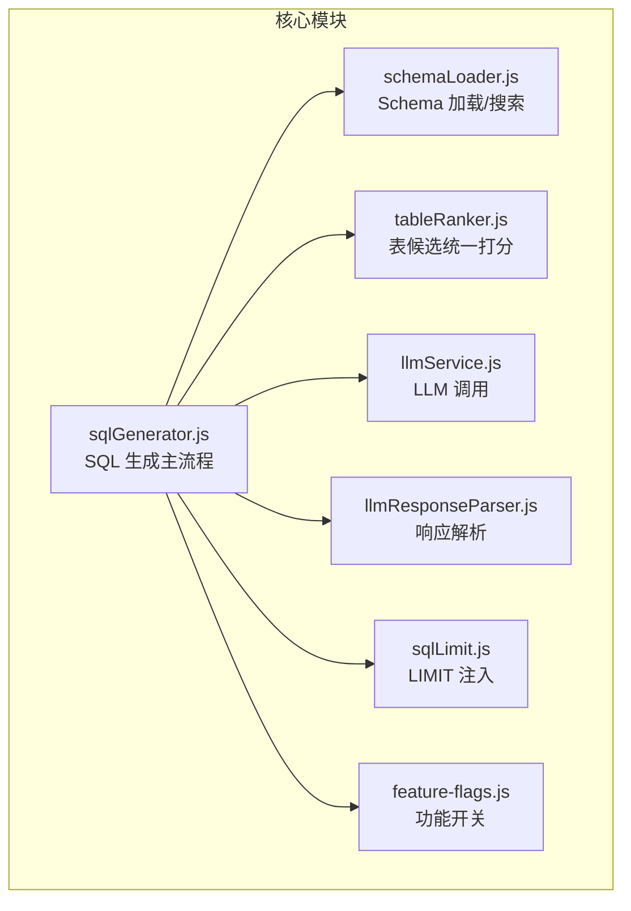
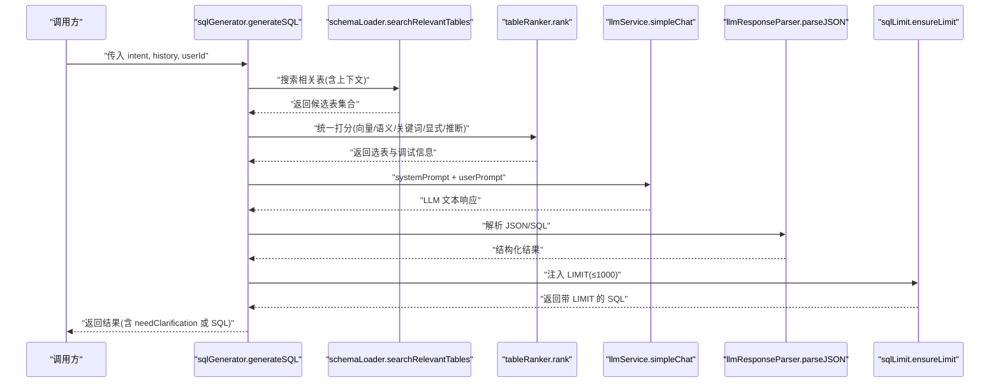
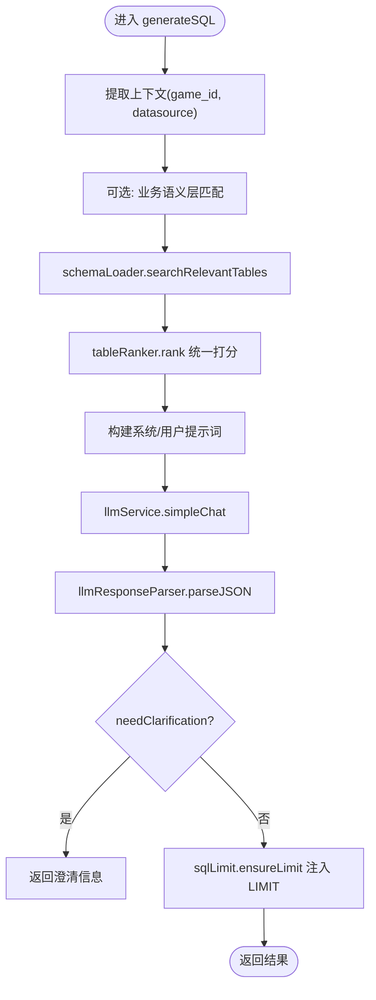
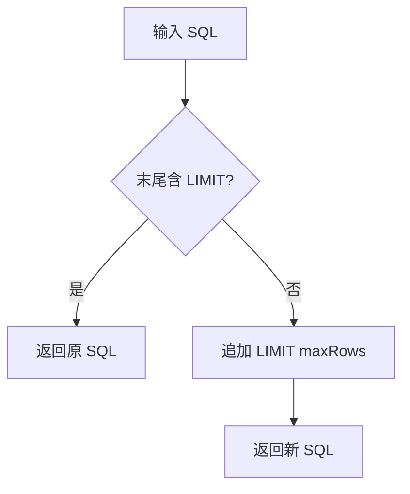
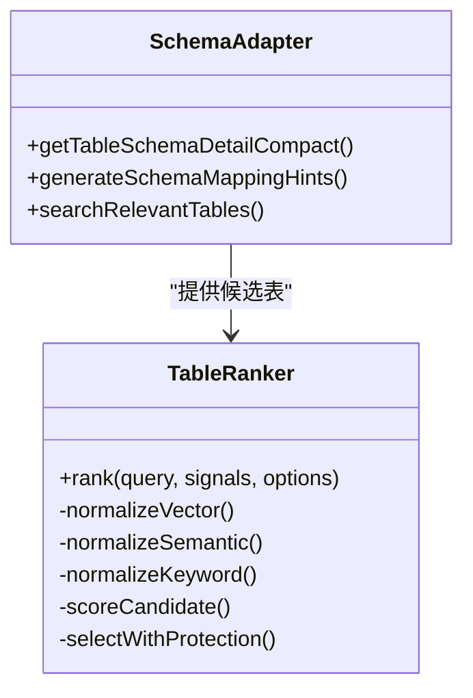
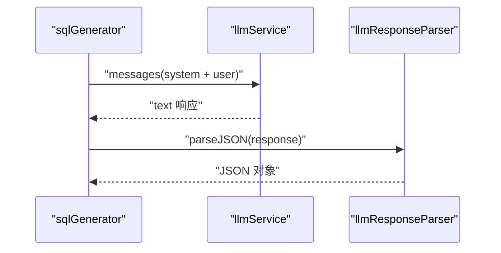
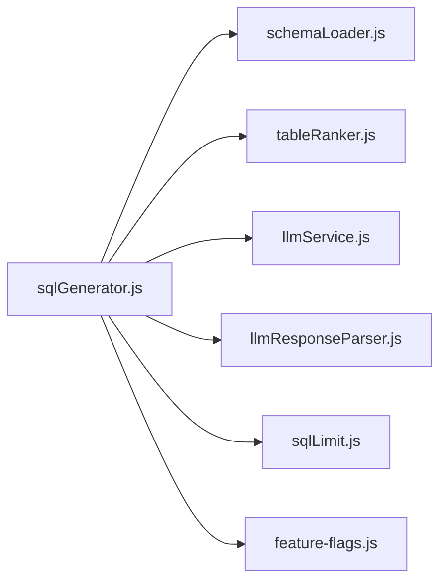

# SQL 生成器

<cite>
**本文档引用的文件**
- [sqlGenerator.js](file://backend/src/core/sqlGenerator.js)
- [sqlLimit.js](file://backend/src/utils/sqlLimit.js)
- [llmService.js](file://backend/src/core/llmService.js)
- [schemaLoader.js](file://backend/src/core/schemaLoader.js)
- [tableRanker.js](file://backend/src/core/tableRanker.js)
- [llmResponseParser.js](file://backend/src/utils/llmResponseParser.js)
- [feature-flags.js](file://backend/config/feature-flags.js)
- [test-limit-injection.js](file://backend/test/phase2/test-limit-injection.js)
- [test-sqlGenerator-exports.js](file://backend/test/phase4/test-sqlGenerator-exports.js)
</cite>

## 目录
1. [简介](#简介)
2. [项目结构](#项目结构)
3. [核心组件](#核心组件)
4. [架构总览](#架构总览)
5. [详细组件分析](#详细组件分析)
6. [依赖分析](#依赖分析)
7. [性能考虑](#性能考虑)
8. [故障排查指南](#故障排查指南)
9. [结论](#结论)
10. [附录](#附录)

## 简介
本文件为 SQL 生成器模块的技术文档，聚焦 backend/src/core/sqlGenerator.js 的核心职责与实现细节，涵盖 Prompt 构建、LLM SQL 生成、LIMIT 注入与安全校验、Schema 适配与表候选融合、以及质量控制与错误恢复策略。文档还提供不同复杂度查询的处理示例与提示工程最佳实践，帮助开发者高效定位问题并优化系统稳定性。

## 项目结构
SQL 生成器位于后端核心模块，围绕意图解析后的自然语言查询，通过系统提示词与用户提示词驱动 LLM 生成 SQL，并在生成后进行 LIMIT 注入与安全校验，最终返回结构化结果。



**图表来源**
- [sqlGenerator.js:83-479](file://backend/src/core/sqlGenerator.js#L83-L479)
- [schemaLoader.js:571-679](file://backend/src/core/schemaLoader.js#L571-L679)
- [tableRanker.js:244-270](file://backend/src/core/tableRanker.js#L244-L270)
- [llmService.js:332-370](file://backend/src/core/llmService.js#L332-L370)
- [llmResponseParser.js:24-59](file://backend/src/utils/llmResponseParser.js#L24-L59)
- [sqlLimit.js:22-34](file://backend/src/utils/sqlLimit.js#L22-L34)
- [feature-flags.js:16-141](file://backend/config/feature-flags.js#L16-L141)

**章节来源**
- [sqlGenerator.js:1-485](file://backend/src/core/sqlGenerator.js#L1-L485)
- [schemaLoader.js:1-800](file://backend/src/core/schemaLoader.js#L1-L800)
- [tableRanker.js:1-280](file://backend/src/core/tableRanker.js#L1-L280)
- [llmService.js:1-491](file://backend/src/core/llmService.js#L1-L491)
- [llmResponseParser.js:1-146](file://backend/src/utils/llmResponseParser.js#L1-L146)
- [sqlLimit.js:1-37](file://backend/src/utils/sqlLimit.js#L1-L37)
- [feature-flags.js:1-294](file://backend/config/feature-flags.js#L1-L294)

## 核心组件
- SQL 生成主流程：负责构建系统提示词与用户提示词、调用 LLM、解析响应、注入 LIMIT、安全校验与错误处理。
- Schema 适配：加载与检索表结构，生成紧凑 Schema 摘要与业务映射提示。
- 表候选融合：统一向量检索、语义层、关键词、显式与推断信号，进行归一化与截断选择。
- LLM 服务：封装 HTTP 请求、重试机制、流式与非流式响应。
- 响应解析：从 LLM 文本中稳定提取 JSON/SQL。
- LIMIT 注入：确保每条 SQL 带有外层 LIMIT，防止大数据集查询。
- 功能开关：通过 feature-flags 控制语义层、统一打分器等特性。

**章节来源**
- [sqlGenerator.js:83-479](file://backend/src/core/sqlGenerator.js#L83-L479)
- [schemaLoader.js:571-679](file://backend/src/core/schemaLoader.js#L571-L679)
- [tableRanker.js:244-270](file://backend/src/core/tableRanker.js#L244-L270)
- [llmService.js:332-370](file://backend/src/core/llmService.js#L332-L370)
- [llmResponseParser.js:24-59](file://backend/src/utils/llmResponseParser.js#L24-L59)
- [sqlLimit.js:22-34](file://backend/src/utils/sqlLimit.js#L22-L34)
- [feature-flags.js:16-141](file://backend/config/feature-flags.js#L16-L141)

## 架构总览
SQL 生成器的端到端流程如下：



**图表来源**
- [sqlGenerator.js:83-479](file://backend/src/core/sqlGenerator.js#L83-L479)
- [schemaLoader.js:571-679](file://backend/src/core/schemaLoader.js#L571-L679)
- [tableRanker.js:244-270](file://backend/src/core/tableRanker.js#L244-L270)
- [llmService.js:332-370](file://backend/src/core/llmService.js#L332-L370)
- [llmResponseParser.js:24-59](file://backend/src/utils/llmResponseParser.js#L24-L59)
- [sqlLimit.js:22-34](file://backend/src/utils/sqlLimit.js#L22-L34)

## 详细组件分析

### 1) generateSQL 方法工作流程
- 输入：intent（包含原始查询、指标、filters 等）、历史澄清记录、用户 ID。
- 输出：结构化结果，包含 needClarification 或 SQL。
- 关键步骤：
  - 提取上下文（game_id、datasource）。
  - 可选：业务语义层匹配与推荐表。
  - 表候选检索：schemaLoader.searchRelevantTables，支持向量/关键词/显式/推断融合。
  - 统一打分：tableRanker.rank，核心表保护与上限截断。
  - 生成 Schema 摘要与业务映射提示。
  - 构建系统提示词与用户提示词，调用 LLM。
  - 解析响应：parseJSON；若 needClarification，直接返回；否则注入 LIMIT。
  - 返回结果并记录日志。



**图表来源**
- [sqlGenerator.js:83-479](file://backend/src/core/sqlGenerator.js#L83-L479)
- [schemaLoader.js:571-679](file://backend/src/core/schemaLoader.js#L571-L679)
- [tableRanker.js:244-270](file://backend/src/core/tableRanker.js#L244-L270)
- [llmService.js:332-370](file://backend/src/core/llmService.js#L332-L370)
- [llmResponseParser.js:24-59](file://backend/src/utils/llmResponseParser.js#L24-L59)
- [sqlLimit.js:22-34](file://backend/src/utils/sqlLimit.js#L22-L34)

**章节来源**
- [sqlGenerator.js:83-479](file://backend/src/core/sqlGenerator.js#L83-L479)

### 2) Prompt 构建策略
- 系统提示词包含：
  - 可用表结构摘要（schemaLoader.getTableSchemaDetailCompact）。
  - 业务映射提示（generateSchemaMappingHints）。
  - 语义层映射信息（可选）。
  - 预定义指标说明。
  - 历史澄清与用户别名信息（可选）。
  - 严格规则：禁止 DML、必须 LIMIT、禁止 SELECT *、JOIN 策略、日期口径标准、智能推理规则、严格约束与示例。
- 用户提示词：将 intent 以 JSON 字符串形式放入，要求 LLM 只返回 JSON。

```mermaid
classDiagram
class PromptBuilder {
+buildSystemPrompt()
+buildUserPrompt(intent)
+mergeContext()
+addSemanticLayerInfo()
+addMetricsInfo()
+addClarifiedInfo()
+addFieldAliasesInfo()
+addRules()
}
PromptBuilder --> SchemaLoader : "获取 Schema 摘要"
PromptBuilder --> SemanticLayer : "可选 : 语义层映射"
PromptBuilder --> Metrics : "预定义指标"
PromptBuilder --> Clarification : "历史澄清"
PromptBuilder --> Aliases : "用户字段别名"
```

**图表来源**
- [sqlGenerator.js:302-446](file://backend/src/core/sqlGenerator.js#L302-L446)
- [schemaLoader.js:571-679](file://backend/src/core/schemaLoader.js#L571-L679)

**章节来源**
- [sqlGenerator.js:302-446](file://backend/src/core/sqlGenerator.js#L302-L446)

### 3) LIMIT 注入机制
- 目标：确保每条 SQL 带有外层 LIMIT，最大 1000，防止大数据集查询。
- 实现：
  - hasOuterLimit：仅匹配 SQL 末尾的 LIMIT，忽略子查询内部 LIMIT。
  - ensureLimit：未带 LIMIT 时追加 LIMIT maxRows；已带则原样返回。
- 测试覆盖：正反例、子查询、分号与空白处理、边界条件。



**图表来源**
- [sqlLimit.js:16-34](file://backend/src/utils/sqlLimit.js#L16-L34)
- [test-limit-injection.js:21-80](file://backend/test/phase2/test-limit-injection.js#L21-L80)

**章节来源**
- [sqlLimit.js:1-37](file://backend/src/utils/sqlLimit.js#L1-L37)
- [test-limit-injection.js:1-88](file://backend/test/phase2/test-limit-injection.js#L1-L88)

### 4) Schema 适配与表候选融合
- Schema 适配：
  - schemaLoader.searchRelevantTables：支持向量检索与关键词回退，结合上下文（game_id、datasource）增强查询。
  - generateSchemaMappingHints：基于表名关键词生成业务映射提示（注册/登录/订单/聊天）。
- 表候选融合：
  - tableRanker.rank：融合向量分、语义层、关键词、显式与推断信号，归一化到 0-100，核心表保护 +30，推断加成 +15，上限 8。
  - feature-flags 控制是否启用统一打分器（默认启用）。



**图表来源**
- [schemaLoader.js:571-679](file://backend/src/core/schemaLoader.js#L571-L679)
- [sqlGenerator.js:51-78](file://backend/src/core/sqlGenerator.js#L51-L78)
- [tableRanker.js:244-270](file://backend/src/core/tableRanker.js#L244-L270)
- [feature-flags.js:118-125](file://backend/config/feature-flags.js#L118-L125)

**章节来源**
- [schemaLoader.js:571-679](file://backend/src/core/schemaLoader.js#L571-L679)
- [sqlGenerator.js:51-78](file://backend/src/core/sqlGenerator.js#L51-L78)
- [tableRanker.js:1-280](file://backend/src/core/tableRanker.js#L1-L280)
- [feature-flags.js:118-125](file://backend/config/feature-flags.js#L118-L125)

### 5) LLM SQL 生成与解析
- LLM 调用：llmService.simpleChat，构造 system + user 消息，调用 chat/completions。
- 响应解析：llmResponseParser.parseJSON，支持直接 JSON、代码块与最外层花括号提取。
- 错误处理：捕获 LLM 调用异常并抛出统一错误。



**图表来源**
- [llmService.js:332-370](file://backend/src/core/llmService.js#L332-L370)
- [llmResponseParser.js:24-59](file://backend/src/utils/llmResponseParser.js#L24-L59)

**章节来源**
- [llmService.js:332-370](file://backend/src/core/llmService.js#L332-L370)
- [llmResponseParser.js:24-59](file://backend/src/utils/llmResponseParser.js#L24-L59)

### 6) 安全检查与质量控制
- 严格规则：
  - 禁止 DML、必须 LIMIT、禁止 SELECT *、JOIN 策略、日期口径标准。
  - 严格约束：禁止猜测 game_id、time_range、status 值；指标冲突必须按公式计算；空结果预防；filters 最高优先级。
- 生成质量：
  - few-shot 示例覆盖澄清、指标切换、上下文理解。
  - 智能推理规则：表/字段/多表关联推断。
- 错误恢复：
  - needClarification：缺失信息时返回澄清问题与建议选项。
  - LIMIT 注入：统一兜底，避免无界查询。
  - 单测覆盖：sqlGenerator 导出契约与 generateSchemaMappingHints 分支。

**章节来源**
- [sqlGenerator.js:302-446](file://backend/src/core/sqlGenerator.js#L302-L446)
- [test-sqlGenerator-exports.js:16-52](file://backend/test/phase4/test-sqlGenerator-exports.js#L16-L52)

### 7) 典型查询处理示例（路径指引）
- 简单筛选：WHERE 条件直接来自 intent.filters，JOIN 策略默认 LEFT JOIN。
- 聚合查询：SUM/COUNT/HAVING 依据预定义指标与业务映射提示生成。
- 联表查询：基于表关系与字段推断，使用 LEFT JOIN 防止基础数据丢失。
- 复杂条件组合：金字塔筛选原则（基础人群→聚合过滤→行为判定）与 EXISTS/NOT EXISTS 结构。
- 日期口径：提供标准函数映射（CURDATE、YEARWEEK、DATE_SUB 等）。

**章节来源**
- [sqlGenerator.js:302-446](file://backend/src/core/sqlGenerator.js#L302-L446)

### 8) 提示工程最佳实践与调试技巧
- 提示工程：
  - 明确规则与示例，减少 LLM 推断偏差。
  - 将 filters 作为最高优先级约束写入系统提示词。
  - 使用 few-shot 示例引导复杂逻辑（澄清、指标切换、上下文理解）。
- 调试技巧：
  - 启用 LOG_PROMPT_FULL=true 查看完整 Prompt 摘要。
  - 检查表候选与打分调试信息，定位表选择问题。
  - 使用单测验证 LIMIT 注入与 generateSchemaMappingHints 行为。
  - 关注 needClarification 返回，补充缺失槽位。

**章节来源**
- [llmService.js:224-260](file://backend/src/core/llmService.js#L224-L260)
- [test-limit-injection.js:21-80](file://backend/test/phase2/test-limit-injection.js#L21-L80)
- [test-sqlGenerator-exports.js:20-48](file://backend/test/phase4/test-sqlGenerator-exports.js#L20-L48)

## 依赖分析
SQL 生成器模块的耦合关系如下：



**图表来源**
- [sqlGenerator.js:15-41](file://backend/src/core/sqlGenerator.js#L15-L41)
- [feature-flags.js:32-41](file://backend/config/feature-flags.js#L32-L41)

**章节来源**
- [sqlGenerator.js:15-41](file://backend/src/core/sqlGenerator.js#L15-L41)
- [feature-flags.js:32-41](file://backend/config/feature-flags.js#L32-L41)

## 性能考虑
- 向量检索与关键词回退：在向量存储不可用时自动回退，保证可用性。
- 统一打分器：融合多源信号并截断，避免过度候选导致 LLM 负担。
- Prompt 构建：仅包含必要上下文与规则，控制 token 使用。
- 重试机制：LLM API 调用具备指数退避与最大重试次数，提升稳定性。

[本节为通用指导，无需特定文件来源]

## 故障排查指南
- LLM 响应解析失败：
  - 检查 parseJSON 的三种策略是否覆盖（直接 JSON、代码块、最外层花括号）。
  - 查看 llmService 的响应摘要与长度，确认是否被代理截断。
- LIMIT 注入未生效：
  - 确认 hasOuterLimit 的匹配逻辑（仅末尾 LIMIT 生效）。
  - 检查 ensureLimit 的 maxRows 配置与输入 SQL。
- 表候选不准确：
  - 检查 feature-flags 的 UNIFIED_RANKER 开关。
  - 核对向量检索与关键词匹配结果，关注核心表保护与显式表置顶逻辑。
- needClarification 频繁出现：
  - 检查 intent.filters 与历史澄清记录，确保关键槽位（game_id、time_range）已填充。
  - 评估 few-shot 示例与规则提示是否足够清晰。

**章节来源**
- [llmResponseParser.js:24-59](file://backend/src/utils/llmResponseParser.js#L24-L59)
- [llmService.js:100-133](file://backend/src/core/llmService.js#L100-L133)
- [sqlLimit.js:16-34](file://backend/src/utils/sqlLimit.js#L16-L34)
- [tableRanker.js:244-270](file://backend/src/core/tableRanker.js#L244-L270)
- [sqlGenerator.js:302-446](file://backend/src/core/sqlGenerator.js#L302-L446)

## 结论
SQL 生成器通过严谨的 Prompt 构建、统一的表候选融合、严格的 LIMIT 注入与安全规则，实现了从自然语言到结构化 SQL 的稳健转换。配合完善的错误恢复与单测覆盖，能够在复杂业务场景下保持高质量与高可靠性。建议在生产环境中持续监控表候选质量、LLM 响应稳定性与 LIMIT 注入效果，并根据业务反馈迭代提示词与规则。

[本节为总结性内容，无需特定文件来源]

## 附录
- 单测清单：
  - LIMIT 注入：test-limit-injection.js
  - sqlGenerator 导出与 generateSchemaMappingHints：test-sqlGenerator-exports.js

**章节来源**
- [test-limit-injection.js:1-88](file://backend/test/phase2/test-limit-injection.js#L1-L88)
- [test-sqlGenerator-exports.js:1-53](file://backend/test/phase4/test-sqlGenerator-exports.js#L1-L53)