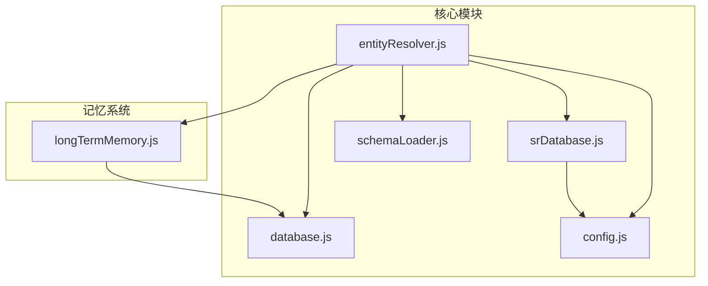
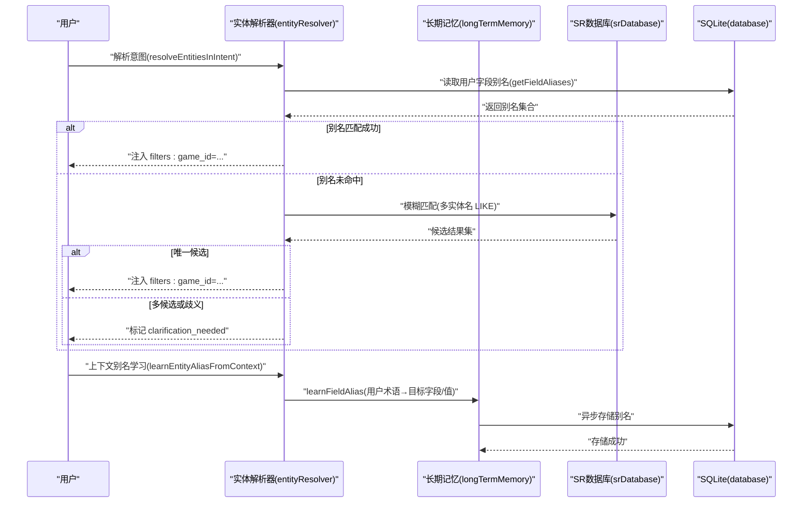
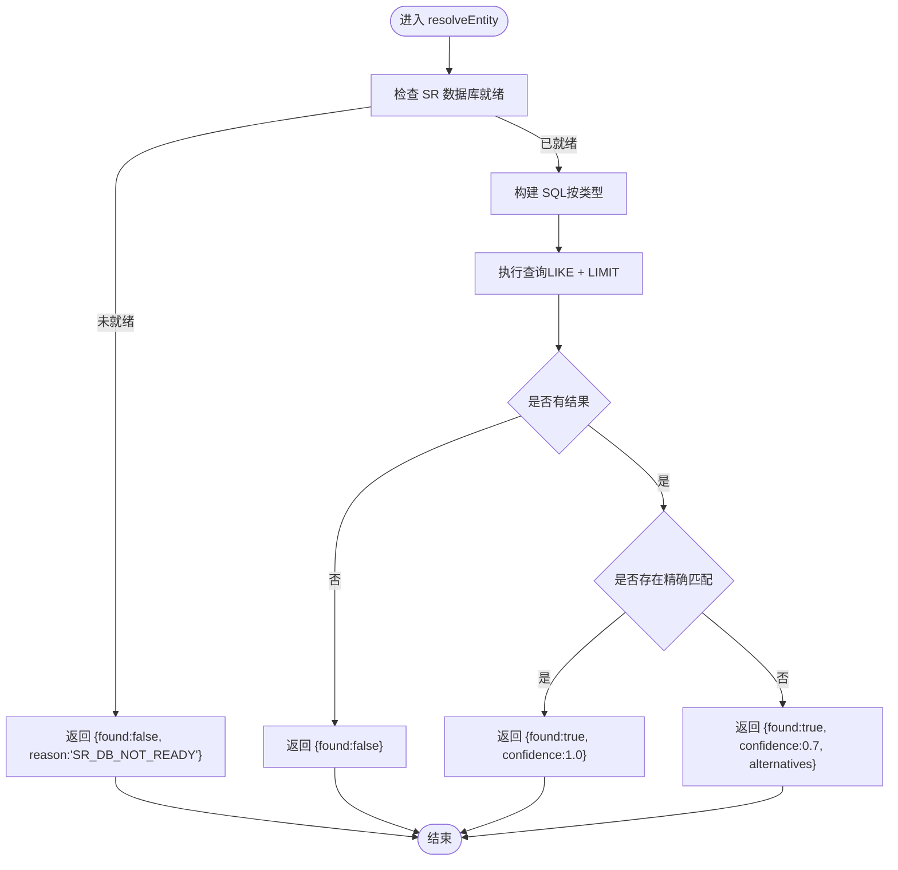
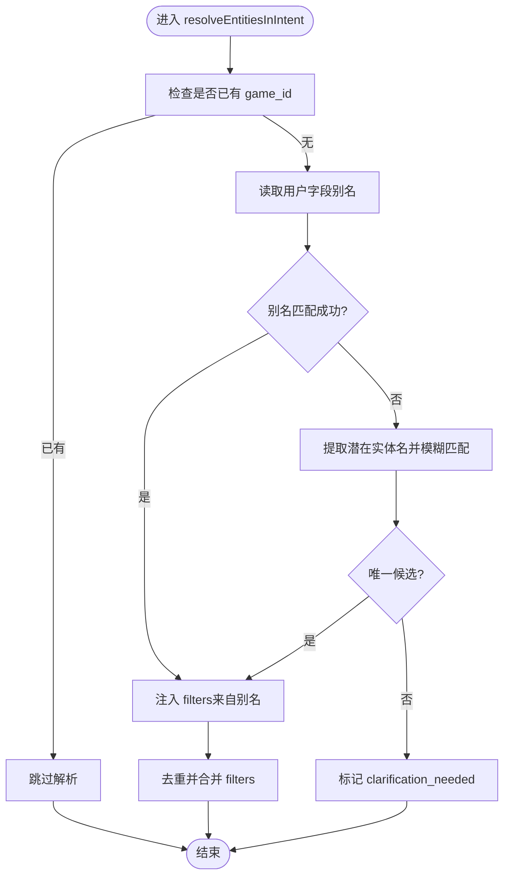
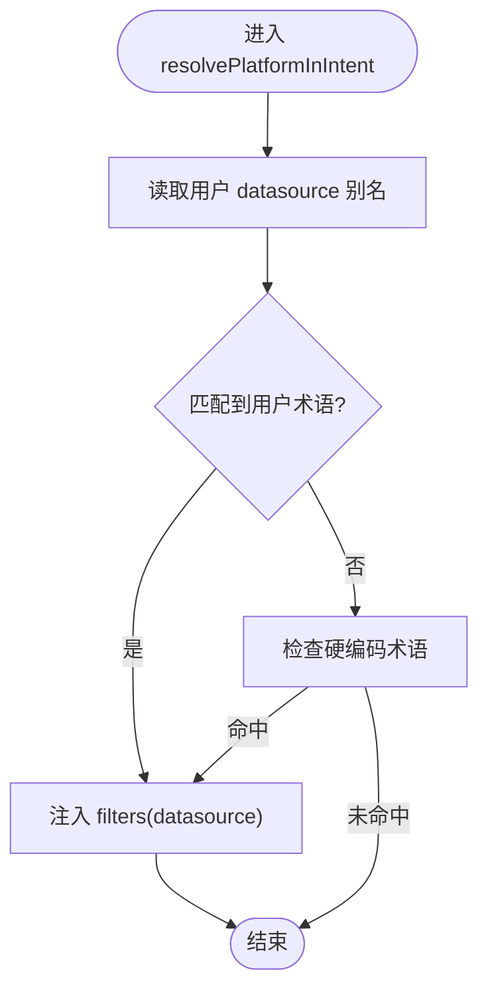
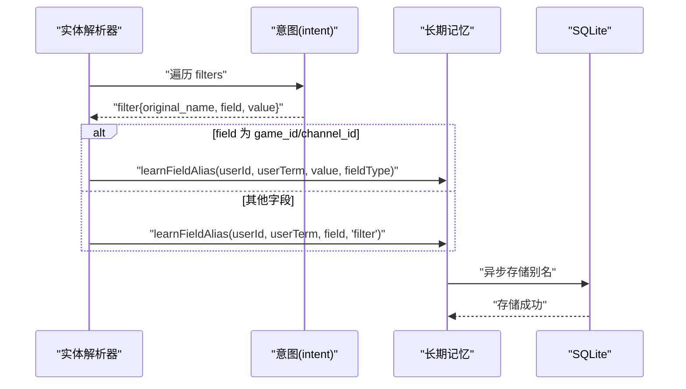
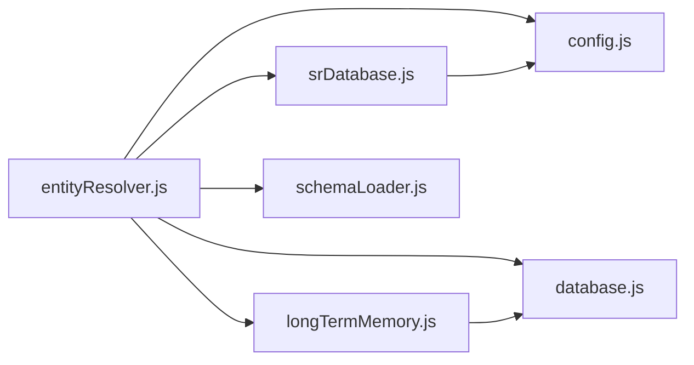

# 实体解析器

<cite>
**本文引用的文件**
- [entityResolver.js](file://backend/src/core/entityResolver.js)
- [longTermMemory.js](file://backend/src/memory/longTermMemory.js)
- [srDatabase.js](file://backend/src/core/srDatabase.js)
- [schemaLoader.js](file://backend/src/core/schemaLoader.js)
- [database.js](file://backend/src/core/database.js)
- [config.js](file://backend/src/core/config.js)
- [test-entityResolver-exports.js](file://backend/test/phase4/test-entityResolver-exports.js)
- [test-entity-resolve.js](file://backend/test/phase1/test-entity-resolve.js)
</cite>

## 目录
1. [简介](#简介)
2. [项目结构](#项目结构)
3. [核心组件](#核心组件)
4. [架构总览](#架构总览)
5. [详细组件分析](#详细组件分析)
6. [依赖关系分析](#依赖关系分析)
7. [性能考量](#性能考量)
8. [故障排查指南](#故障排查指南)
9. [结论](#结论)
10. [附录](#附录)

## 简介
本技术文档聚焦于实体解析器模块（Phase 4 · 任务 A.2），系统性解析 entityResolver.js 的核心能力与实现细节，涵盖：
- 实体 ID 映射：resolveEntity 方法如何将“游戏名/渠道名”等实体名称映射为具体 ID
- 平台识别：resolvePlatformInIntent 如何从用户查询中识别“新平台/老平台”并映射到数据源标识
- 别名学习：learnEntityAliasFromContext 如何通过长期记忆系统学习用户习惯用法
- 意图内实体解析：resolveEntitiesInIntent 如何结合长期记忆与模糊匹配，解决歧义并触发澄清
- 缓存策略：业务关键词映射的初始化与缓存
- 错误处理与降级：SR 数据库未就绪时的优雅降级
- 性能优化：查询限制、只读会话、超时控制、批量学习与异步存储

## 项目结构
实体解析器位于后端核心模块中，与长期记忆、SR 数据库、Schema 加载器、SQLite 数据库以及配置模块紧密协作。

图表来源
- [entityResolver.js:1-459](file://backend/src/core/entityResolver.js#L1-L459)
- [srDatabase.js:1-156](file://backend/src/core/srDatabase.js#L1-L156)
- [longTermMemory.js:1-1168](file://backend/src/memory/longTermMemory.js#L1-L1168)
- [schemaLoader.js:1-800](file://backend/src/core/schemaLoader.js#L1-L800)
- [database.js:1-200](file://backend/src/core/database.js#L1-L200)
- [config.js:1-439](file://backend/src/core/config.js#L1-L439)

章节来源
- [entityResolver.js:1-459](file://backend/src/core/entityResolver.js#L1-L459)

## 核心组件
- 实体 ID 映射：resolveEntity
- 意图内实体解析：resolveEntitiesInIntent
- 平台术语识别：resolvePlatformInIntent
- 上下文别名学习：learnEntityAliasFromContext
- 业务关键词映射：inferTablesFromQuery + getBusinessKeywordMap
- 实体名称提取：extractPotentialEntityNames

章节来源
- [entityResolver.js:67-111](file://backend/src/core/entityResolver.js#L67-L111)
- [entityResolver.js:187-341](file://backend/src/core/entityResolver.js#L187-L341)
- [entityResolver.js:382-448](file://backend/src/core/entityResolver.js#L382-L448)
- [entityResolver.js:121-177](file://backend/src/core/entityResolver.js#L121-L177)
- [entityResolver.js:43-58](file://backend/src/core/entityResolver.js#L43-L58)
- [entityResolver.js:346-373](file://backend/src/core/entityResolver.js#L346-L373)

## 架构总览
实体解析器在 NL2SQL 流程中承担“意图增强”的职责：在 LLM 已识别的 filters 基础上，进一步解析实体名称为具体 ID，并学习用户习惯用法以提升后续解析质量。

图表来源
- [entityResolver.js:187-341](file://backend/src/core/entityResolver.js#L187-L341)
- [entityResolver.js:121-177](file://backend/src/core/entityResolver.js#L121-L177)
- [longTermMemory.js:773-853](file://backend/src/memory/longTermMemory.js#L773-L853)
- [database.js:156-186](file://backend/src/core/database.js#L156-L186)
- [srDatabase.js:95-127](file://backend/src/core/srDatabase.js#L95-L127)

## 详细组件分析

### 实体 ID 映射：resolveEntity
- 输入：实体名称、实体类型（game/channel）
- 流程：
  - 检查 SR 数据库是否就绪，未就绪则返回降级结果
  - 根据类型选择对应表的 LIKE 查询，限制返回数量
  - 若存在精确匹配，返回高置信度结果
  - 若存在模糊匹配，返回首个候选并标注置信度与备选列表
  - 异常捕获并返回错误信息
- 输出：found、id、name、confidence、alternatives 或 error

图表来源
- [entityResolver.js:67-111](file://backend/src/core/entityResolver.js#L67-L111)

章节来源
- [entityResolver.js:67-111](file://backend/src/core/entityResolver.js#L67-L111)

### 意图内实体解析：resolveEntitiesInIntent
- 目标：在 LLM 已识别 filters 的基础上，补充缺失的实体 ID
- 优先级：
  1) 长期记忆：从 SQLite 的 user_preferences 中读取用户字段别名，匹配用户查询中的术语
  2) SR 数据库：提取潜在实体名，进行模糊匹配，处理唯一/歧义场景
- 歧义处理：当同一术语对应多个候选时，向 intent.clarification_needed 注入 ambiguous_entity，触发澄清
- 去重：避免重复注入相同 game_id

图表来源
- [entityResolver.js:187-341](file://backend/src/core/entityResolver.js#L187-L341)

章节来源
- [entityResolver.js:187-341](file://backend/src/core/entityResolver.js#L187-L341)

### 平台术语识别：resolvePlatformInIntent
- 优先：长期记忆中用户对“数据源标识”的映射
- 回退：硬编码映射“老平台/new_tzpingtaiold”，“新平台/new_tzpingtai”
- 注入：若未存在 datasource，则向 intent.filters 注入

图表来源
- [entityResolver.js:382-448](file://backend/src/core/entityResolver.js#L382-L448)

章节来源
- [entityResolver.js:382-448](file://backend/src/core/entityResolver.js#L382-L448)

### 上下文别名学习：learnEntityAliasFromContext
- 触发：当 intent.filters 中包含 original_name、field、value 时
- 逻辑：
  - 若 field 为 game_id/channel_id，直接学习用户术语→目标值（如 game_id=30）
  - 否则学习用户术语→schema 字段（如“营收”→“income_amount”）
- 学习入口：longTermMemory.learnFieldAlias，异步持久化至 SQLite

图表来源
- [entityResolver.js:121-177](file://backend/src/core/entityResolver.js#L121-L177)
- [longTermMemory.js:773-853](file://backend/src/memory/longTermMemory.js#L773-L853)

章节来源
- [entityResolver.js:121-177](file://backend/src/core/entityResolver.js#L121-L177)
- [longTermMemory.js:773-853](file://backend/src/memory/longTermMemory.js#L773-L853)

### 业务关键词映射与实体名称提取
- 业务关键词映射：初始化时从 schemaLoader 获取映射，缓存于内存，用于 inferTablesFromQuery
- 实体名称提取：从查询中抽取中文、英文、引号包裹的潜在实体名，去重后参与模糊匹配

章节来源
- [entityResolver.js:24-41](file://backend/src/core/entityResolver.js#L24-L41)
- [entityResolver.js:43-58](file://backend/src/core/entityResolver.js#L43-L58)
- [entityResolver.js:346-373](file://backend/src/core/entityResolver.js#L346-L373)

## 依赖关系分析
- 外部依赖
  - SR 数据库：mysql2/promise 连接池，只读会话 + 超时控制
  - SQLite：用户偏好、查询历史等持久化
  - 配置：SR 数据库连接、查询超时、最大返回行数、长期记忆阈值等
- 内部依赖
  - schemaLoader：提供业务关键词映射与表级向量检索（用于表推断）
  - longTermMemory：字段别名学习与存储、用户偏好检索
  - database：用户偏好读取与写入

图表来源
- [entityResolver.js:12-16](file://backend/src/core/entityResolver.js#L12-L16)
- [srDatabase.js:15-17](file://backend/src/core/srDatabase.js#L15-L17)
- [longTermMemory.js:17-22](file://backend/src/memory/longTermMemory.js#L17-L22)
- [database.js:13-19](file://backend/src/core/database.js#L13-L19)
- [schemaLoader.js:15-26](file://backend/src/core/schemaLoader.js#L15-L26)
- [config.js:122-143](file://backend/src/core/config.js#L122-L143)

章节来源
- [entityResolver.js:12-16](file://backend/src/core/entityResolver.js#L12-L16)
- [srDatabase.js:15-17](file://backend/src/core/srDatabase.js#L15-L17)
- [longTermMemory.js:17-22](file://backend/src/memory/longTermMemory.js#L17-L22)
- [database.js:13-19](file://backend/src/core/database.js#L13-L19)
- [schemaLoader.js:15-26](file://backend/src/core/schemaLoader.js#L15-L26)
- [config.js:122-143](file://backend/src/core/config.js#L122-L143)

## 性能考量
- SR 数据库查询限制
  - 每次查询强制注入 LIMIT，避免大结果集回传
  - 只读会话 + MAX_EXECUTION_TIME 双重兜底，防止慢查询
- 连接池与超时
  - 连接池大小、获取超时、空闲超时可配置
  - 查询超时可按环境变量调整
- 长期记忆异步存储
  - 学习到的偏好通过队列异步落库，避免阻塞主流程
- 缓存策略
  - 业务关键词映射初始化后缓存，减少重复加载
  - Schema 向量可增量更新，降低向量化成本

章节来源
- [srDatabase.js:95-127](file://backend/src/core/srDatabase.js#L95-L127)
- [srDatabase.js:42-86](file://backend/src/core/srDatabase.js#L42-L86)
- [longTermMemory.js:399-414](file://backend/src/memory/longTermMemory.js#L399-L414)
- [entityResolver.js:24-41](file://backend/src/core/entityResolver.js#L24-L41)
- [schemaLoader.js:210-285](file://backend/src/core/schemaLoader.js#L210-L285)

## 故障排查指南
- SR 数据库未就绪
  - 现象：resolveEntity 返回 {found:false, reason:'SR_DB_NOT_READY'}
  - 排查：确认 SR_DATABASE_URL、SR_DB_ENABLED、mysql2 模块是否可用
- 查询异常
  - 现象：resolveEntity 返回 {found:false, error: "..."}
  - 排查：检查 SQL 语法、参数绑定、连接池状态
- 别名学习失败
  - 现象：learnEntityAliasFromContext 学习失败日志
  - 排查：确认 intent.filters 结构、用户 ID、字段类型
- 模糊匹配歧义
  - 现象：resolveEntitiesInIntent 标记 clarification_needed
  - 处理：引导用户提供更明确的实体名称或选择候选

章节来源
- [entityResolver.js:70-73](file://backend/src/core/entityResolver.js#L70-L73)
- [entityResolver.js:107-110](file://backend/src/core/entityResolver.js#L107-L110)
- [entityResolver.js:292-305](file://backend/src/core/entityResolver.js#L292-L305)
- [test-entity-resolve.js:35-38](file://backend/test/phase1/test-entity-resolve.js#L35-L38)

## 结论
实体解析器通过“长期记忆 + SR 数据库 + 硬编码映射”的三层策略，实现了对实体名称的稳健解析与平台术语识别。其设计强调：
- 优雅降级：SR 数据库不可用时仍可工作
- 异步学习：别名学习不阻塞主流程
- 模糊匹配与歧义处理：在保证准确性的前提下提升覆盖率
- 性能保障：查询限制、只读会话、超时控制与缓存策略协同

## 附录

### API 导出契约与行为验证
- 导出函数清单：learnEntityAliasFromContext、extractPotentialEntityNames、getBusinessKeywordMap、inferTablesFromQuery、resolveEntity、resolveEntitiesInIntent、resolvePlatformInIntent
- 行为验证要点：
  - inferTablesFromQuery 对空串/空值返回空数组
  - extractPotentialEntityNames 支持中文、英文、引号包裹实体名
  - resolveEntity 在 SR 数据库未就绪时返回降级结果

章节来源
- [test-entityResolver-exports.js:16-28](file://backend/test/phase4/test-entityResolver-exports.js#L16-L28)
- [test-entityResolver-exports.js:33-40](file://backend/test/phase4/test-entityResolver-exports.js#L33-L40)
- [test-entityResolver-exports.js:49-56](file://backend/test/phase4/test-entityResolver-exports.js#L49-L56)
- [test-entityResolver-exports.js:62-71](file://backend/test/phase4/test-entityResolver-exports.js#L62-L71)