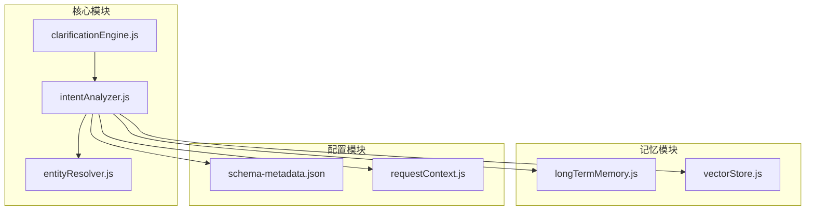
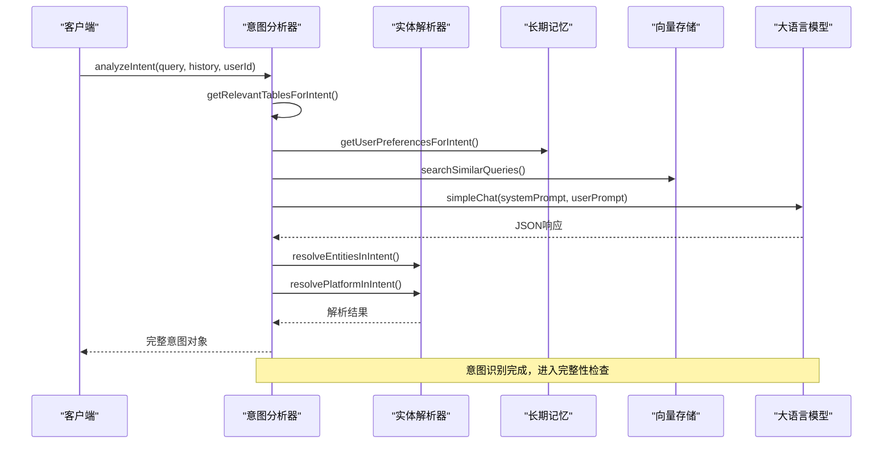
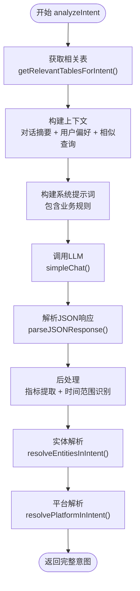
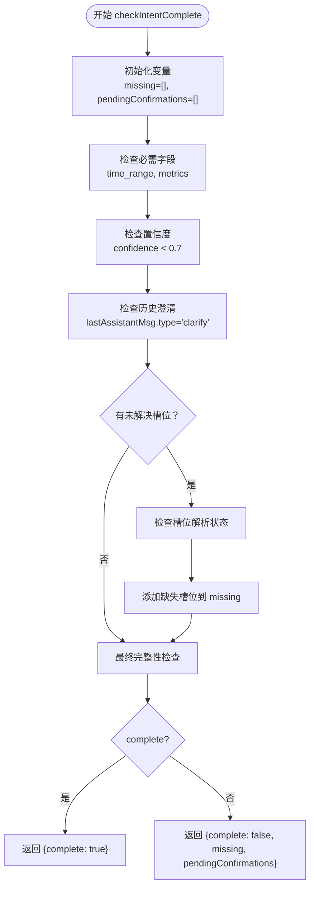
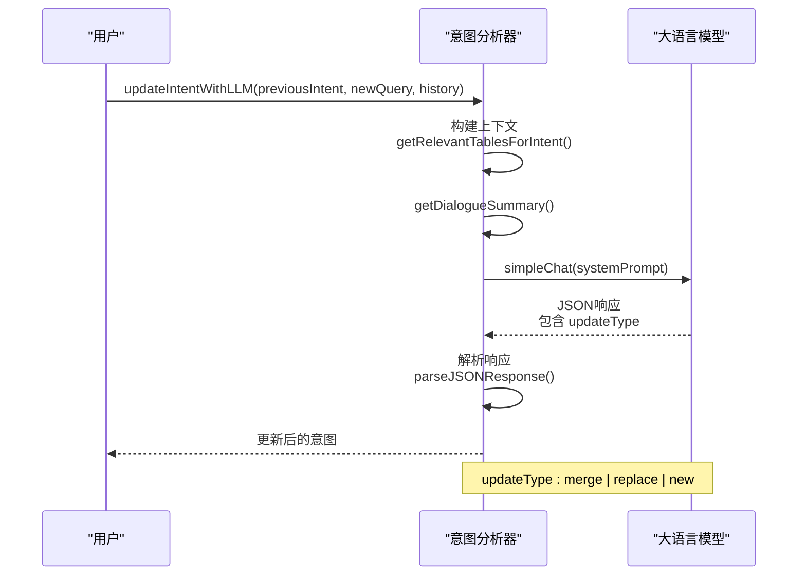
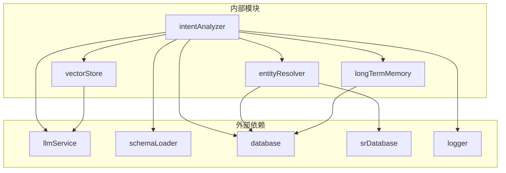
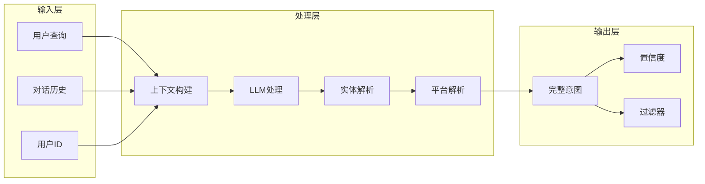

# 意图分析器

<cite>
**本文档引用的文件**
- [intentAnalyzer.js](file://backend/src/core/intentAnalyzer.js)
- [clarificationEngine.js](file://backend/src/core/clarificationEngine.js)
- [entityResolver.js](file://backend/src/core/entityResolver.js)
- [longTermMemory.js](file://backend/src/memory/longTermMemory.js)
- [vectorStore.js](file://backend/src/memory/vectorStore.js)
- [requestContext.js](file://backend/src/core/requestContext.js)
- [test-intentAnalyzer-exports.js](file://backend/test/phase4/test-intentAnalyzer-exports.js)
- [schema-metadata.json](file://backend/config/schema-metadata.json)
</cite>

## 目录
1. [简介](#简介)
2. [项目结构](#项目结构)
3. [核心组件](#核心组件)
4. [架构概览](#架构概览)
5. [详细组件分析](#详细组件分析)
6. [依赖关系分析](#依赖关系分析)
7. [性能考虑](#性能考虑)
8. [故障排查指南](#故障排查指南)
9. [结论](#结论)
10. [附录](#附录)

## 简介
意图分析器是 NL2SQL 系统的核心模块之一，负责将用户的自然语言查询转换为结构化的查询意图。该模块实现了以下关键能力：
- 查询意图识别：从自然语言中提取时间范围、指标、维度、过滤器等关键信息
- 上下文融合：结合对话历史和长期记忆理解当前查询
- 澄清需求检测：识别缺失信息和待确认项
- 意图完整性检查：验证意图的完整性和置信度
- 上下文查询意图更新：基于用户的新输入更新现有意图

## 项目结构
意图分析器模块位于后端核心目录中，与实体解析、长期记忆、向量存储等模块协同工作：

**图表来源**
- [intentAnalyzer.js:1-757](file://backend/src/core/intentAnalyzer.js#L1-L757)
- [entityResolver.js:1-459](file://backend/src/core/entityResolver.js#L1-L459)
- [clarificationEngine.js:1-559](file://backend/src/core/clarificationEngine.js#L1-L559)

**章节来源**
- [intentAnalyzer.js:1-757](file://backend/src/core/intentAnalyzer.js#L1-L757)

## 核心组件
意图分析器模块包含以下核心组件：

### 1. 意图识别组件
- analyzeIntent：主入口方法，负责完整的意图分析流程
- getRelevantTablesForIntent：基于查询相关性的表检索
- getCoreHighFrequencyTables：核心高频表列表

### 2. 上下文处理组件
- getDialogueSummary：对话摘要生成
- enrichIntentWithClarificationContext：澄清上下文增强
- isAffirmativeClarificationReply：确认回复识别

### 3. 意图完整性检查组件
- checkIntentComplete：完整性检查
- generateClarification：澄清问题生成

### 4. 意图更新组件
- updateIntentWithLLM：LLM驱动的意图更新
- mergeIntent：手动意图合并

**章节来源**
- [intentAnalyzer.js:170-468](file://backend/src/core/intentAnalyzer.js#L170-L468)
- [intentAnalyzer.js:510-603](file://backend/src/core/intentAnalyzer.js#L510-L603)
- [intentAnalyzer.js:609-742](file://backend/src/core/intentAnalyzer.js#L609-L742)

## 架构概览
意图分析器采用分层架构设计，各组件职责清晰：

**图表来源**
- [intentAnalyzer.js:173-468](file://backend/src/core/intentAnalyzer.js#L173-L468)
- [entityResolver.js:187-341](file://backend/src/core/entityResolver.js#L187-L341)

## 详细组件分析

### analyzeIntent 方法工作流程
analyzeIntent 是意图分析的核心方法，实现了完整的意图识别流程：

#### 1. 表相关性检索
- 使用向量检索获取与查询最相关的表
- 回退到核心高频表列表
- 支持上下文感知的表检索

#### 2. 上下文构建
- 生成最近对话摘要
- 加载用户长期偏好
- 检索相似历史查询

#### 3. LLM意图识别
- 构建系统提示词，包含业务规则和约束
- 调用LLM进行意图识别
- 解析JSON响应并进行后处理

#### 4. 实体解析
- 解析游戏实体映射
- 解析平台术语
- 识别业务关键词

**图表来源**
- [intentAnalyzer.js:173-468](file://backend/src/core/intentAnalyzer.js#L173-L468)

**章节来源**
- [intentAnalyzer.js:170-468](file://backend/src/core/intentAnalyzer.js#L170-L468)

### checkIntentComplete 方法
checkIntentComplete 负责检测意图的完整性，确保所有必需字段都已填充：

#### 关键检查点
- 必需字段验证：time_range 和 metrics
- 置信度检查：confidence < 0.7 视为缺失
- 待确认项检查：基于历史澄清记录
- 上下文确认：用户确认默认选项的情况

**图表来源**
- [intentAnalyzer.js:609-683](file://backend/src/core/intentAnalyzer.js#L609-L683)

**章节来源**
- [intentAnalyzer.js:609-683](file://backend/src/core/intentAnalyzer.js#L609-L683)

### generateClarification 方法
generateClarification 生成针对性的澄清问题，帮助用户补充缺失信息：

#### 生成逻辑
- 基于缺失信息类型生成问题
- 识别需要用户确认的具体槽位
- 提供候选选项和默认值
- 返回结构化的澄清信息

**章节来源**
- [intentAnalyzer.js:685-742](file://backend/src/core/intentAnalyzer.js#L685-L742)

### updateIntentWithLLM 方法
updateIntentWithLLM 实现了基于LLM的上下文查询意图更新机制：

#### 更新策略
- 分析用户的新输入和历史上下文
- 识别是补充信息、修改需求还是全新查询
- 根据更新类型返回相应的意图状态
- 支持回退到手动合并策略

**图表来源**
- [intentAnalyzer.js:510-603](file://backend/src/core/intentAnalyzer.js#L510-L603)

**章节来源**
- [intentAnalyzer.js:510-603](file://backend/src/core/intentAnalyzer.js#L510-L603)

## 依赖关系分析

### 模块间依赖关系
意图分析器模块依赖多个核心模块：

**图表来源**
- [intentAnalyzer.js:13-24](file://backend/src/core/intentAnalyzer.js#L13-L24)
- [entityResolver.js:12-16](file://backend/src/core/entityResolver.js#L12-L16)

### 数据流分析
意图分析器的数据流呈现典型的"输入-处理-输出"模式：

**图表来源**
- [intentAnalyzer.js:173-468](file://backend/src/core/intentAnalyzer.js#L173-L468)

**章节来源**
- [intentAnalyzer.js:13-24](file://backend/src/core/intentAnalyzer.js#L13-L24)

## 性能考虑
意图分析器在设计时充分考虑了性能优化：

### 1. 异步处理
- 所有外部调用（LLM、数据库、向量存储）都采用异步模式
- 使用 Promise.all 并行处理多个异步操作
- 错误处理采用 try-catch 机制，避免阻塞主线程

### 2. 缓存策略
- 核心高频表列表缓存，避免重复计算
- 用户偏好信息缓存，减少数据库查询
- 向量检索结果缓存，提高响应速度

### 3. 内存管理
- 对大型对象进行及时清理
- 使用流式处理避免内存峰值
- 日志级别控制，减少不必要的日志开销

### 4. 网络优化
- LLM调用采用批量处理
- 向量存储查询使用索引优化
- 数据库查询使用连接池

## 故障排查指南

### 常见问题及解决方案

#### 1. LLM响应解析失败
**症状**：意图分析返回错误格式
**原因**：LLM响应不符合JSON格式
**解决方案**：
- 检查系统提示词的格式要求
- 验证 parseJSONResponse 函数
- 查看日志中的错误信息

#### 2. 实体解析失败
**症状**：游戏名称无法映射到ID
**原因**：SR数据库不可用或映射不存在
**解决方案**：
- 检查 srDatabase 连接状态
- 验证游戏列表数据
- 检查用户长期记忆中的别名映射

#### 3. 向量检索失败
**症状**：相关表检索返回空结果
**原因**：向量数据库未初始化或配置错误
**解决方案**：
- 检查 LanceDB 初始化状态
- 验证向量维度配置
- 确认向量数据已正确加载

#### 4. 置信度过低
**症状**：意图完整性检查返回缺失信息
**原因**：查询过于模糊或上下文不完整
**解决方案**：
- 生成澄清问题引导用户提供更多信息
- 检查历史对话的连贯性
- 优化系统提示词的约束条件

**章节来源**
- [intentAnalyzer.js:460-467](file://backend/src/core/intentAnalyzer.js#L460-L467)

## 结论
意图分析器模块通过精心设计的架构和算法，实现了高效的自然语言到SQL查询的转换。其核心优势包括：

1. **多模态信息融合**：结合LLM理解、长期记忆、向量检索等多种信息源
2. **上下文感知**：能够理解复杂的对话历史和用户偏好
3. **智能澄清机制**：自动识别缺失信息并生成针对性的澄清问题
4. **高性能设计**：采用异步处理和缓存策略，确保系统响应速度

该模块为NL2SQL系统的智能化查询提供了坚实的基础，能够有效提升用户体验和查询准确性。

## 附录

### 使用示例
以下是一些典型查询场景的处理示例：

#### 简单查询场景
- 输入："查昨天的收入"
- 输出：包含 time_range、metrics 的完整意图
- 特点：无需澄清，置信度较高

#### 复杂查询场景  
- 输入："查上个月的活跃用户，按渠道分组"
- 输出：包含 time_range、metrics、dimensions、filters
- 特点：需要解析多个维度和过滤条件

#### 上下文相关查询
- 输入："那上个月呢？"
- 输出：基于历史查询的上下文理解
- 特点：isContextualQuery 标记为 true

### 最佳实践建议
1. **提示词优化**：持续改进系统提示词，提高意图识别准确性
2. **用户反馈**：收集用户对澄清问题的反馈，优化问题生成策略
3. **性能监控**：建立完善的性能监控体系，及时发现和解决问题
4. **错误处理**：完善错误处理机制，确保系统稳定性