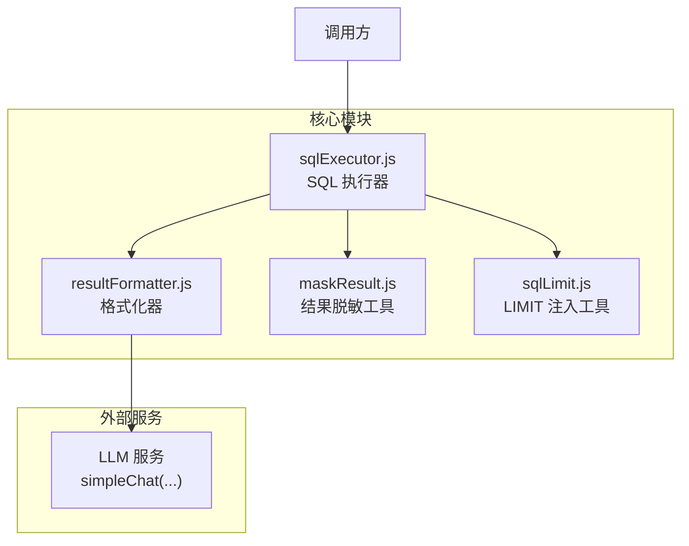
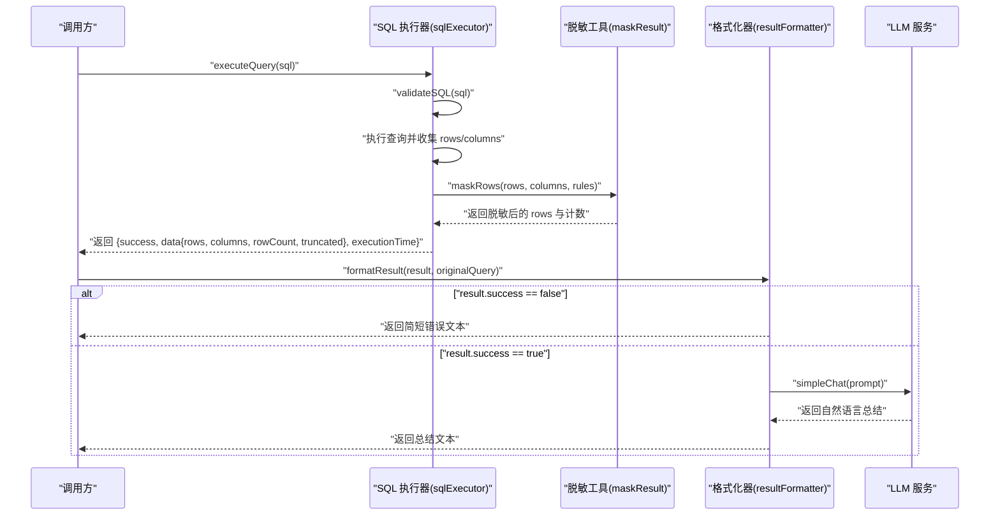
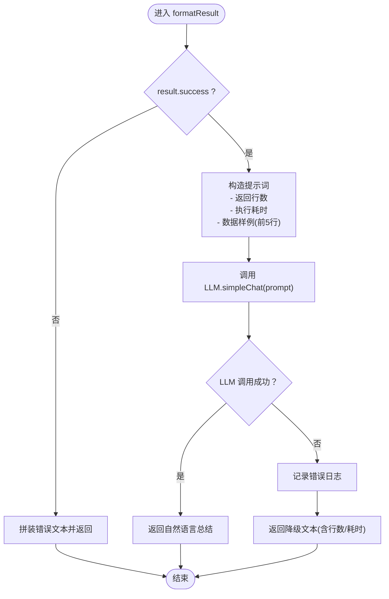
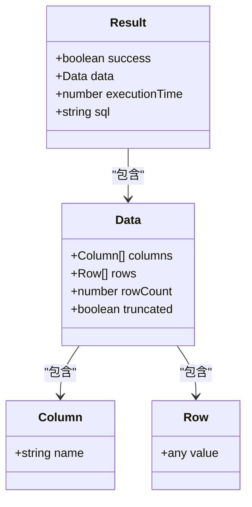
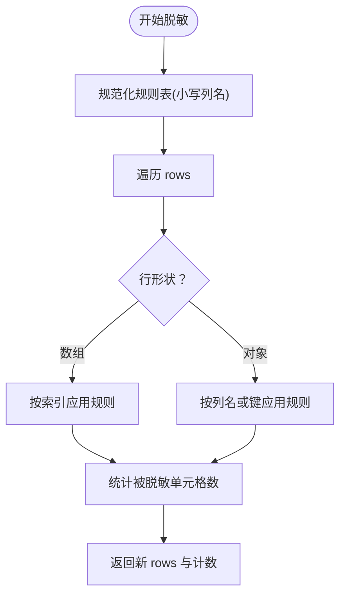
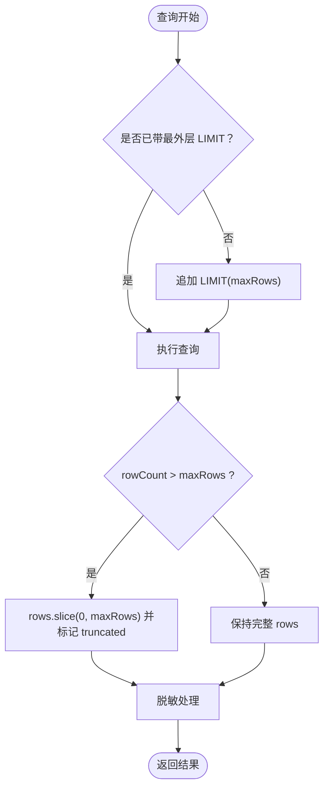
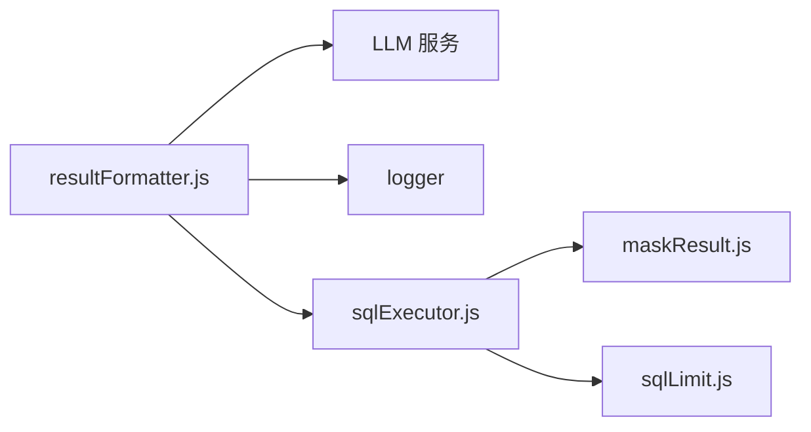

# 结果格式化器

<cite>
**本文引用的文件**
- [resultFormatter.js](file://backend/src/core/resultFormatter.js)
- [test-resultFormatter-exports.js](file://backend/test/phase4/test-resultFormatter-exports.js)
- [sqlExecutor.js](file://backend/src/core/sqlExecutor.js)
- [maskResult.js](file://backend/src/utils/maskResult.js)
- [sqlLimit.js](file://backend/src/utils/sqlLimit.js)
- [README.md（Phase 4 测试）](file://backend/test/phase4/README.md)
- [complex-queries.json](file://backend/test/phase2/fixtures/complex-queries.json)
</cite>

## 目录
1. [简介](#简介)
2. [项目结构](#项目结构)
3. [核心组件](#核心组件)
4. [架构总览](#架构总览)
5. [详细组件分析](#详细组件分析)
6. [依赖关系分析](#依赖关系分析)
7. [性能考虑](#性能考虑)
8. [故障排查指南](#故障排查指南)
9. [结论](#结论)
10. [附录](#附录)

## 简介
本文件为“结果格式化器”模块的技术文档，聚焦于 backend/src/core/resultFormatter.js 的职责与实现，涵盖以下主题：
- 查询结果整理与自然语言总结
- 失败路径与异常降级策略
- 与 SQL 执行器、脱敏工具、LLM 服务的协作关系
- 不同类型查询结果的格式化策略（数值统计、表格数据、趋势分析）
- 结果脱敏机制、数据采样策略与性能优化技巧
- 面向开发者的用户体验设计原则与实现细节

## 项目结构
结果格式化器位于后端核心模块目录，与 SQL 执行器、脱敏工具、LLM 服务共同构成 NL2SQL 的“结果呈现层”。其典型调用链如下：
- SQL 执行器负责安全校验、执行与采样，并在开启时进行结果脱敏
- 结果格式化器接收统一的结果对象，生成自然语言总结
- 若 LLM 不可用或报错，则进行降级输出

**图示来源**
- [resultFormatter.js:12-39](file://backend/src/core/resultFormatter.js#L12-L39)
- [sqlExecutor.js:72-169](file://backend/src/core/sqlExecutor.js#L72-L169)
- [maskResult.js:131-184](file://backend/src/utils/maskResult.js#L131-L184)
- [sqlLimit.js:16-34](file://backend/src/utils/sqlLimit.js#L16-L34)

**章节来源**
- [resultFormatter.js:1-44](file://backend/src/core/resultFormatter.js#L1-L44)
- [sqlExecutor.js:1-175](file://backend/src/core/sqlExecutor.js#L1-L175)
- [maskResult.js:1-198](file://backend/src/utils/maskResult.js#L1-L198)
- [sqlLimit.js:1-37](file://backend/src/utils/sqlLimit.js#L1-L37)

## 核心组件
- 结果格式化器（resultFormatter.js）
  - 职责：将 SQL 执行器返回的结构化结果转换为自然语言总结；失败路径直接返回简短错误文本；成功路径构造提示词并调用 LLM 生成关键数据点、趋势与异常描述。
  - 关键方法：formatResult(result, originalQuery)
- SQL 执行器（sqlExecutor.js）
  - 职责：验证 SQL 安全性、执行查询、行数限制与截断标记、结果脱敏、统一返回结构。
  - 关键方法：validateSQL(sql)、executeQuery(sql)
- 结果脱敏工具（maskResult.js）
  - 职责：基于列名规则对敏感字段进行脱敏，支持多种规则（如 mid_4、domain_only、head_tail、redact、first_1、last_4、length_stars），返回新数组与被脱敏单元格计数。
- LIMIT 注入工具（sqlLimit.js）
  - 职责：判断 SQL 是否已带最外层 LIMIT，若无则追加 LIMIT，避免超大数据集风险。

**章节来源**
- [resultFormatter.js:12-39](file://backend/src/core/resultFormatter.js#L12-L39)
- [sqlExecutor.js:34-66](file://backend/src/core/sqlExecutor.js#L34-L66)
- [sqlExecutor.js:114-157](file://backend/src/core/sqlExecutor.js#L114-L157)
- [maskResult.js:83-91](file://backend/src/utils/maskResult.js#L83-L91)
- [maskResult.js:131-184](file://backend/src/utils/maskResult.js#L131-L184)
- [sqlLimit.js:16-34](file://backend/src/utils/sqlLimit.js#L16-L34)

## 架构总览
下图展示了从 SQL 执行到自然语言总结的整体流程，以及各模块之间的交互关系。

**图示来源**
- [sqlExecutor.js:72-169](file://backend/src/core/sqlExecutor.js#L72-L169)
- [maskResult.js:131-184](file://backend/src/utils/maskResult.js#L131-L184)
- [resultFormatter.js:12-39](file://backend/src/core/resultFormatter.js#L12-L39)

## 详细组件分析

### formatResult 方法工作流程
- 输入：统一结果对象（包含 success、data、executionTime 等）与原始查询语句
- 失败路径：当 result.success 为 false 时，直接拼装错误文本返回，不调用 LLM
- 成功路径：构造提示词，包含返回行数、执行耗时与数据样例（最多前 5 行），调用 LLM 的 simpleChat 生成自然语言总结
- 异常降级：若 LLM 调用失败，记录错误日志并返回“查询完成”的降级文本（包含行数与耗时）

**图示来源**
- [resultFormatter.js:12-39](file://backend/src/core/resultFormatter.js#L12-L39)

**章节来源**
- [resultFormatter.js:12-39](file://backend/src/core/resultFormatter.js#L12-L39)
- [test-resultFormatter-exports.js:21-43](file://backend/test/phase4/test-resultFormatter-exports.js#L21-L43)

### 数据结构化与格式转换
- 统一结果结构：包含 success、data（columns、rows、rowCount、truncated）、executionTime、sql 等字段
- 数据样例：格式化器使用 rows.slice(0, 5) 提供前 5 行作为样例，避免大结果集导致提示词过长
- 列定义：columns 支持字符串数组或 {name} 对象数组，便于脱敏与后续可视化建议

**图示来源**
- [sqlExecutor.js:147-157](file://backend/src/core/sqlExecutor.js#L147-L157)

**章节来源**
- [sqlExecutor.js:147-157](file://backend/src/core/sqlExecutor.js#L147-L157)
- [resultFormatter.js:17-30](file://backend/src/core/resultFormatter.js#L17-L30)

### 可视化建议与自然语言描述生成
- 提示词结构：包含原始查询、返回行数、执行耗时与数据样例，要求 LLM 输出关键数据点、趋势/异常与是否需要进一步分析
- 生成策略：通过明确的指令约束，确保总结简洁友好，覆盖数值统计、趋势识别与异常检测等维度
- 降级策略：若 LLM 不可用，回退到“查询完成 + 行数 + 耗时”的基础信息，保证最小可用体验

**章节来源**
- [resultFormatter.js:17-30](file://backend/src/core/resultFormatter.js#L17-L30)
- [resultFormatter.js:35-38](file://backend/src/core/resultFormatter.js#L35-L38)

### 不同类型查询结果的格式化策略
- 数值统计类：强调关键指标与对比，突出最大/最小值、平均值、占比等
- 表格数据类：提供前若干行样例，标注列名与数据类型，便于用户快速理解
- 趋势分析类：识别时间序列或分组趋势，标注周期性、上升/下降等特征
- 复杂分析类：结合聚合与明细，给出分组维度与排序依据，必要时建议进一步拆分维度

（以上策略基于提示词约束与 LLM 的生成能力，具体实现由 LLM 服务决定）

**章节来源**
- [resultFormatter.js:17-30](file://backend/src/core/resultFormatter.js#L17-L30)

### 结果脱敏机制
- 规则驱动：基于配置中的列名到规则映射，列名大小写不敏感
- 支持两种行形状：对象 {col: val} 与数组 [val1, val2, ...]（配合 columns 顺序）
- 纯函数与不可变：返回新数组，不修改输入；null/undefined/非字符串值透传
- 规则集合：mid_4、domain_only、head_tail、redact、first_1、last_4、length_stars
- 采样与截断：SQL 执行器先进行行数限制与截断标记，再进行脱敏，避免超大数据集带来的性能问题

**图示来源**
- [maskResult.js:102-111](file://backend/src/utils/maskResult.js#L102-L111)
- [maskResult.js:131-184](file://backend/src/utils/maskResult.js#L131-L184)

**章节来源**
- [maskResult.js:102-111](file://backend/src/utils/maskResult.js#L102-L111)
- [maskResult.js:131-184](file://backend/src/utils/maskResult.js#L131-L184)
- [sqlExecutor.js:122-135](file://backend/src/core/sqlExecutor.js#L122-L135)

### 数据采样策略与性能优化
- 行数限制：SQL 执行器根据配置的最大行数进行截断，并设置 truncated 标记
- 数据样例：格式化器仅取前 5 行作为样例，降低提示词长度与 LLM 负担
- LIMIT 注入：若 SQL 未带最外层 LIMIT，自动追加 LIMIT，避免超大数据集风险
- 日志与监控：记录执行耗时、返回行数、截断与脱敏单元格数量，便于性能分析与告警

**图示来源**
- [sqlLimit.js:16-34](file://backend/src/utils/sqlLimit.js#L16-L34)
- [sqlExecutor.js:118-121](file://backend/src/core/sqlExecutor.js#L118-L121)
- [sqlExecutor.js:122-135](file://backend/src/core/sqlExecutor.js#L122-L135)
- [resultFormatter.js:22-23](file://backend/src/core/resultFormatter.js#L22-L23)

**章节来源**
- [sqlLimit.js:16-34](file://backend/src/utils/sqlLimit.js#L16-L34)
- [sqlExecutor.js:118-121](file://backend/src/core/sqlExecutor.js#L118-L121)
- [sqlExecutor.js:122-135](file://backend/src/core/sqlExecutor.js#L122-L135)
- [resultFormatter.js:22-23](file://backend/src/core/resultFormatter.js#L22-L23)

### 具体示例与用法指引
- 失败路径示例：当 result.success 为 false 时，格式化器直接返回包含错误信息的字符串，不调用 LLM
- 成功路径示例：构造包含返回行数、执行耗时与数据样例的提示词，调用 LLM 生成总结
- 复杂查询参考：可在复杂查询测试集中观察不同场景下的 SQL 生成与执行行为，从而理解格式化器面对的典型结果形态

**章节来源**
- [test-resultFormatter-exports.js:21-43](file://backend/test/phase4/test-resultFormatter-exports.js#L21-L43)
- [complex-queries.json:1-82](file://backend/test/phase2/fixtures/complex-queries.json#L1-L82)

## 依赖关系分析
- 内聚性：格式化器专注于“将结构化结果转为自然语言”，内聚度高
- 耦合性：与 LLM 服务存在运行时耦合；与 SQL 执行器通过统一结果结构耦合；与脱敏工具通过 rows/columns 耦合
- 外部依赖：LLM 服务（simpleChat）、日志服务（logger）
- 循环依赖：未发现循环依赖

**图示来源**
- [resultFormatter.js:9-10](file://backend/src/core/resultFormatter.js#L9-L10)
- [sqlExecutor.js:19-28](file://backend/src/core/sqlExecutor.js#L19-L28)

**章节来源**
- [resultFormatter.js:9-10](file://backend/src/core/resultFormatter.js#L9-L10)
- [sqlExecutor.js:19-28](file://backend/src/core/sqlExecutor.js#L19-L28)

## 性能考虑
- 控制提示词长度：仅输出前 5 行样例，避免 LLM 上下文溢出
- 限制返回行数：执行器侧设置 maxRows 并截断，减少网络传输与前端渲染压力
- 异常降级：LLM 失败时快速返回基础信息，避免长时间等待
- 日志可观测性：记录执行耗时、返回行数、截断与脱敏情况，便于定位性能瓶颈

[本节为通用指导，无需特定文件来源]

## 故障排查指南
- LLM 调用失败
  - 现象：格式化器捕获异常并记录日志，返回降级文本（包含行数与耗时）
  - 排查：检查 LLM 服务可用性、网络连通性与密钥配置
- SQL 未带 LIMIT
  - 现象：执行器检测到并自动追加 LIMIT，避免超大数据集
  - 排查：确认 sqlLimit 工具生效；检查配置项 maxRows 设置
- 脱敏未生效
  - 现象：敏感字段未被替换
  - 排查：确认 RESULT_MASKING 功能开关开启、security.masking.rules 配置正确且列名大小写不敏感匹配
- 复杂查询结果过大
  - 现象：格式化器样例仍可能较大
  - 排查：适当降低 maxRows 或在 SQL 层面增加过滤条件

**章节来源**
- [resultFormatter.js:35-38](file://backend/src/core/resultFormatter.js#L35-L38)
- [sqlLimit.js:29-33](file://backend/src/utils/sqlLimit.js#L29-L33)
- [sqlExecutor.js:122-135](file://backend/src/core/sqlExecutor.js#L122-L135)

## 结论
结果格式化器通过“失败路径直返 + 成功路径 LLM 总结 + 异常降级”的设计，在保证稳定性的同时提升了用户体验。它与 SQL 执行器、脱敏工具和 LIMIT 注入工具形成清晰的职责边界，配合日志与监控，能够有效支撑复杂查询场景下的结果呈现与性能优化。

[本节为总结性内容，无需特定文件来源]

## 附录
- 测试运行方式与覆盖矩阵参见 Phase 4 测试说明
- 复杂查询用例可参考复杂查询测试集，了解多维过滤、行为序列与聚合+明细三类场景

**章节来源**
- [README.md（Phase 4 测试）:5-19](file://backend/test/phase4/README.md#L5-L19)
- [README.md（Phase 4 测试）:21-36](file://backend/test/phase4/README.md#L21-L36)
- [complex-queries.json:1-82](file://backend/test/phase2/fixtures/complex-queries.json#L1-L82)