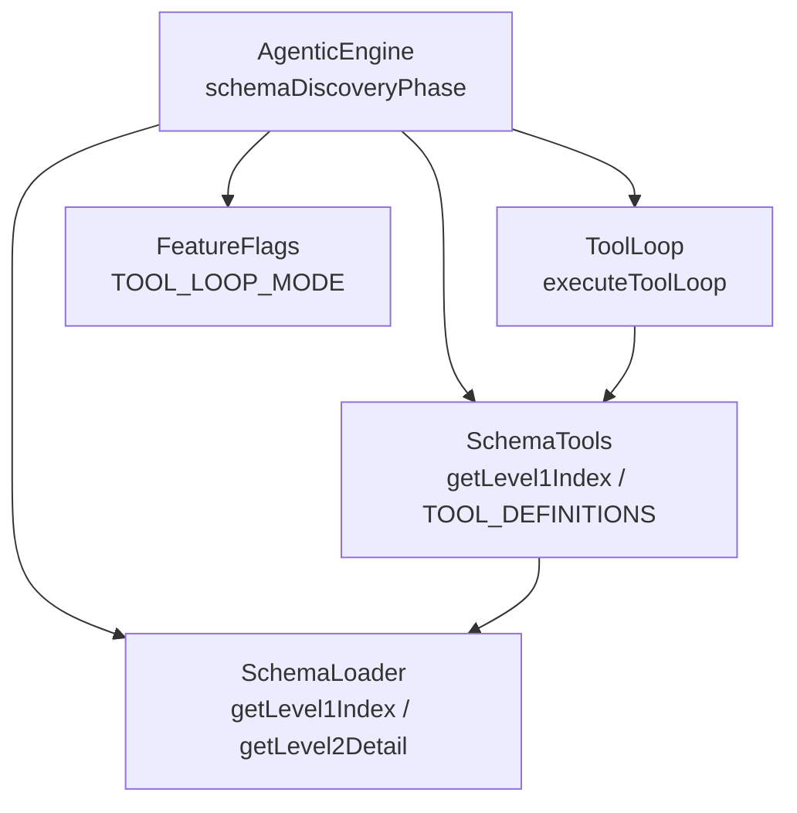
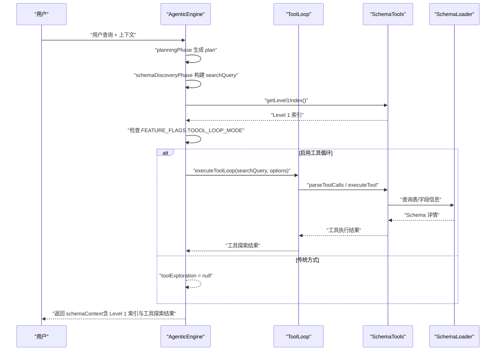
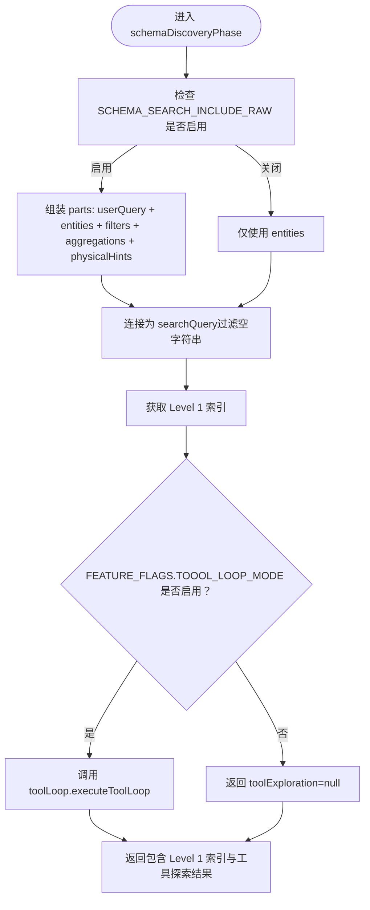
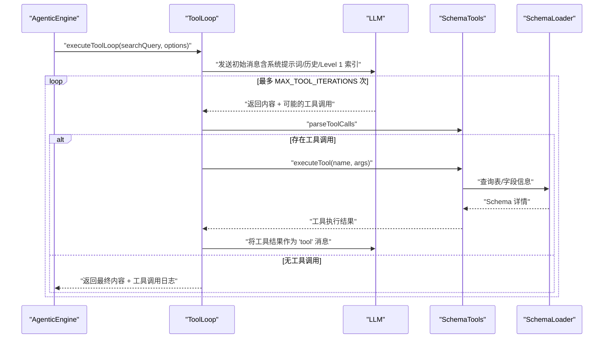
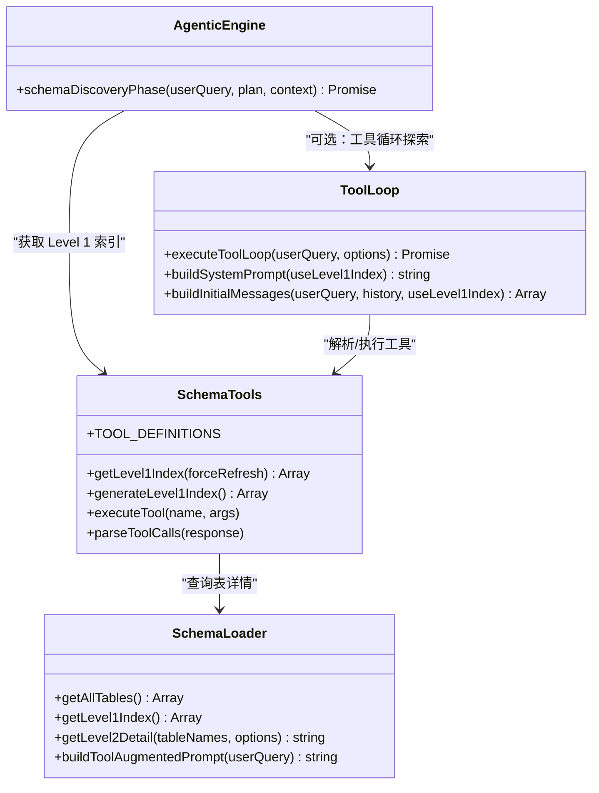
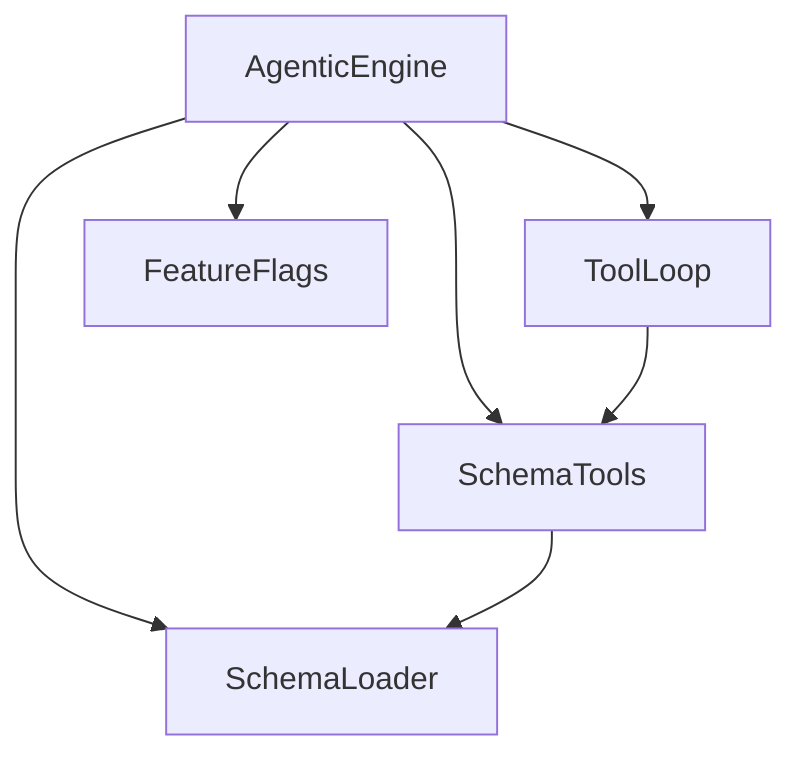

# Schema 发现阶段（Tool-Augmented Schema Discovery）

<cite>
**本文档引用的文件**
- [agenticEngine.js](file://backend/src/core/agenticEngine.js)
- [schemaTools.js](file://backend/src/core/schemaTools.js)
- [toolLoop.js](file://backend/src/core/toolLoop.js)
- [schemaLoader.js](file://backend/src/core/schemaLoader.js)
- [feature-flags.js](file://backend/config/feature-flags.js)
- [schema-discovery-searchquery.test.js](file://backend/test/phase3/schema-discovery-searchquery.test.js)
</cite>

## 目录
1. [简介](#简介)
2. [项目结构](#项目结构)
3. [核心组件](#核心组件)
4. [架构概览](#架构概览)
5. [详细组件分析](#详细组件分析)
6. [依赖关系分析](#依赖关系分析)
7. [性能考量](#性能考量)
8. [故障排查指南](#故障排查指南)
9. [结论](#结论)

## 简介
本文档聚焦于 NL2SQL 系统中 Phase 1 的 Schema 发现阶段，深入解析 agenticEngine.js 中的 schemaDiscoveryPhase 函数实现。该阶段的核心目标是：
- 将用户查询、实体列表、筛选条件、聚合信息与物理提示（如 typeid、int_keyN 等）整合为搜索查询；
- 基于配置决定采用工具循环探索（Tool Loop）还是传统方式；
- 在工具循环模式下，利用历史记录、用户 ID 与 Level 1 索引进行主动探索；
- 为后续阶段提供可靠的表候选与 Schema 详情。

## 项目结构
与 Schema 发现阶段直接相关的模块与文件如下：
- 核心引擎：agenticEngine.js（包含 schemaDiscoveryPhase）
- 工具层：schemaTools.js（Level 1 索引、工具定义与执行）
- 工具循环：toolLoop.js（多轮工具调用循环）
- Schema 加载：schemaLoader.js（Level 1/Level 2 索引与表详情）
- 功能开关：feature-flags.js（控制 TOOL_LOOP_MODE 等特性）
- 单元测试：schema-discovery-searchquery.test.js（覆盖搜索查询构建与回退逻辑）

图表来源
- [agenticEngine.js:287-349](file://backend/src/core/agenticEngine.js#L287-L349)
- [schemaTools.js:136-173](file://backend/src/core/schemaTools.js#L136-L173)
- [toolLoop.js:75-203](file://backend/src/core/toolLoop.js#L75-L203)
- [schemaLoader.js:1070-1104](file://backend/src/core/schemaLoader.js#L1070-L1104)
- [feature-flags.js:37-37](file://backend/config/feature-flags.js#L37-L37)

章节来源
- [agenticEngine.js:287-349](file://backend/src/core/agenticEngine.js#L287-L349)
- [schemaTools.js:136-173](file://backend/src/core/schemaTools.js#L136-L173)
- [toolLoop.js:75-203](file://backend/src/core/toolLoop.js#L75-L203)
- [schemaLoader.js:1070-1104](file://backend/src/core/schemaLoader.js#L1070-L1104)
- [feature-flags.js:37-37](file://backend/config/feature-flags.js#L37-L37)

## 核心组件
- schemaDiscoveryPhase：负责构建搜索查询、获取 Level 1 索引，并根据配置决定是否进入工具循环探索。
- schemaTools：提供 Level 1 索引生成与缓存、工具定义与执行能力。
- toolLoop：实现 LLM 的工具调用循环，支持多轮工具交互。
- schemaLoader：提供 Level 1/Level 2 索引与表详情查询。
- feature-flags：集中管理 TOOL_LOOP_MODE 等功能开关。

章节来源
- [agenticEngine.js:287-349](file://backend/src/core/agenticEngine.js#L287-L349)
- [schemaTools.js:136-173](file://backend/src/core/schemaTools.js#L136-L173)
- [toolLoop.js:75-203](file://backend/src/core/toolLoop.js#L75-L203)
- [schemaLoader.js:1070-1104](file://backend/src/core/schemaLoader.js#L1070-L1104)
- [feature-flags.js:37-37](file://backend/config/feature-flags.js#L37-L37)

## 架构概览
Schema 发现阶段的总体流程：
1. 规划阶段（planningPhase）输出 plan，包含 entities、filters、aggregations、physicalHints 等；
2. schemaDiscoveryPhase 将 userQuery 与 plan 组合成 searchQuery；
3. 获取 Level 1 索引；
4. 若启用 TOOL_LOOP_MODE，则通过 toolLoop.executeToolLoop 主动探索；
5. 返回包含 Level 1 索引与工具探索结果的上下文，供后续阶段使用。

图表来源
- [agenticEngine.js:287-349](file://backend/src/core/agenticEngine.js#L287-L349)
- [toolLoop.js:75-203](file://backend/src/core/toolLoop.js#L75-L203)
- [schemaTools.js:565-602](file://backend/src/core/schemaTools.js#L565-L602)
- [schemaLoader.js:1070-1104](file://backend/src/core/schemaLoader.js#L1070-L1104)

章节来源
- [agenticEngine.js:287-349](file://backend/src/core/agenticEngine.js#L287-L349)
- [toolLoop.js:75-203](file://backend/src/core/toolLoop.js#L75-L203)
- [schemaTools.js:565-602](file://backend/src/core/schemaTools.js#L565-L602)
- [schemaLoader.js:1070-1104](file://backend/src/core/schemaLoader.js#L1070-L1104)

## 详细组件分析

### 搜索查询构建（searchQuery 组装）
schemaDiscoveryPhase 的核心职责之一是将多源信息整合为 searchQuery，确保物理提示（如 typeid、int_keyN）不丢失：
- 默认启用：searchQuery = userQuery + entities + filters(field=value) + aggregations + physicalHints
- 关闭 SCHEMA_SEARCH_INCLUDE_RAW：回退为仅 entities
- 兼容老签名：当第一个参数为 plan 对象时，自动降级处理

图表来源
- [agenticEngine.js:287-349](file://backend/src/core/agenticEngine.js#L287-L349)

章节来源
- [agenticEngine.js:287-349](file://backend/src/core/agenticEngine.js#L287-L349)

### 工具循环探索（Tool Loop）
在启用 TOOL_LOOP_MODE 时，schemaDiscoveryPhase 通过 toolLoop.executeToolLoop 进行主动探索：
- 构建初始消息（系统提示词 + 最近历史 + 当前查询），可选附带 Level 1 索引；
- LLM 可多次请求工具调用（最多 MAX_TOOL_ITERATIONS 次，超时上限 TOOL_LOOP_TIMEOUT）；
- schemaTools.parseToolCalls 解析 LLM 的工具调用请求，schemaTools.executeTool 执行工具；
- 将工具结果以 "tool" 角色消息加入历史，驱动下一轮 LLM 推理；
- 返回最终内容、迭代次数、工具调用日志与耗时。

图表来源
- [toolLoop.js:75-203](file://backend/src/core/toolLoop.js#L75-L203)
- [schemaTools.js:565-602](file://backend/src/core/schemaTools.js#L565-L602)
- [schemaLoader.js:1070-1104](file://backend/src/core/schemaLoader.js#L1070-L1104)

章节来源
- [toolLoop.js:75-203](file://backend/src/core/toolLoop.js#L75-L203)
- [schemaTools.js:565-602](file://backend/src/core/schemaTools.js#L565-L602)
- [schemaLoader.js:1070-1104](file://backend/src/core/schemaLoader.js#L1070-L1104)

### Level 1 索引获取机制
- schemaTools.getLevel1Index 与 schemaLoader.getLevel1Index 提供 Level 1 索引（表名、中文名、简要描述等），并支持缓存与失效时间控制；
- toolLoop.buildSystemPrompt 可在系统提示词中注入 Level 1 索引，帮助 LLM 快速定位候选表；
- schemaDiscoveryPhase 返回的 schemaContext 同时包含 Level 1 索引与工具探索结果，供后续阶段使用。

图表来源
- [schemaTools.js:136-173](file://backend/src/core/schemaTools.js#L136-L173)
- [schemaLoader.js:1070-1104](file://backend/src/core/schemaLoader.js#L1070-L1104)
- [toolLoop.js:250-311](file://backend/src/core/toolLoop.js#L250-L311)
- [agenticEngine.js:287-349](file://backend/src/core/agenticEngine.js#L287-L349)

章节来源
- [schemaTools.js:136-173](file://backend/src/core/schemaTools.js#L136-L173)
- [schemaLoader.js:1070-1104](file://backend/src/core/schemaLoader.js#L1070-L1104)
- [toolLoop.js:250-311](file://backend/src/core/toolLoop.js#L250-L311)
- [agenticEngine.js:287-349](file://backend/src/core/agenticEngine.js#L287-L349)

### 历史记录、用户 ID 与 Level 1 索引的使用
- 历史记录：toolLoop.buildInitialMessages 会将最近若干轮历史消息加入初始消息数组，提升上下文连贯性；
- 用户 ID：在工具循环选项中透传 userId，可用于审计与个性化；
- Level 1 索引：在系统提示词中注入 Level 1 索引，减少一次性全量 Schema 的传输与解析成本。

章节来源
- [toolLoop.js:213-242](file://backend/src/core/toolLoop.js#L213-L242)
- [toolLoop.js:250-311](file://backend/src/core/toolLoop.js#L250-L311)
- [agenticEngine.js:332-336](file://backend/src/core/agenticEngine.js#L332-L336)

### 回退机制与兼容性
- SCHEMA_SEARCH_INCLUDE_RAW=false：回退到仅 entities 的搜索查询；
- 老签名兼容：当第一个参数为 plan 对象时，自动降级处理；
- TOOL_LOOP_MODE 关闭：不调用工具循环，toolExploration 返回 null；
- 计划对象缺字段兜底：保证空数组等边界场景不抛异常。

章节来源
- [schema-discovery-searchquery.test.js:82-106](file://backend/test/phase3/schema-discovery-searchquery.test.js#L82-L106)
- [schema-discovery-searchquery.test.js:108-125](file://backend/test/phase3/schema-discovery-searchquery.test.js#L108-L125)
- [schema-discovery-searchquery.test.js:144-166](file://backend/test/phase3/schema-discovery-searchquery.test.js#L144-L166)
- [agenticEngine.js:290-296](file://backend/src/core/agenticEngine.js#L290-L296)
- [agenticEngine.js:322-325](file://backend/src/core/agenticEngine.js#L322-L325)

## 依赖关系分析
- AgenticEngine 依赖：
  - schemaTools.getLevel1Index：提供 Level 1 索引；
  - toolLoop.executeToolLoop：在启用 TOOL_LOOP_MODE 时进行工具循环；
  - feature-flags.isEnabled('TOOL_LOOP_MODE')：控制是否启用工具循环；
  - schemaLoader.getLevel2Detail：在后续阶段按需加载 Level 2 详情。
- SchemaTools 依赖：
  - schemaLoader：查询表/字段信息；
  - 配置：缓存过期时间等。
- ToolLoop 依赖：
  - schemaTools.TOOL_DEFINITIONS：工具定义；
  - schemaTools.parseToolCalls / executeTool：工具解析与执行；
  - llmService：与 LLM 通信。

图表来源
- [agenticEngine.js:287-349](file://backend/src/core/agenticEngine.js#L287-L349)
- [schemaTools.js:136-173](file://backend/src/core/schemaTools.js#L136-L173)
- [toolLoop.js:75-203](file://backend/src/core/toolLoop.js#L75-L203)
- [feature-flags.js:37-37](file://backend/config/feature-flags.js#L37-L37)
- [schemaLoader.js:1070-1104](file://backend/src/core/schemaLoader.js#L1070-L1104)

章节来源
- [agenticEngine.js:287-349](file://backend/src/core/agenticEngine.js#L287-L349)
- [schemaTools.js:136-173](file://backend/src/core/schemaTools.js#L136-L173)
- [toolLoop.js:75-203](file://backend/src/core/toolLoop.js#L75-L203)
- [feature-flags.js:37-37](file://backend/config/feature-flags.js#L37-L37)
- [schemaLoader.js:1070-1104](file://backend/src/core/schemaLoader.js#L1070-L1104)

## 性能考量
- Level 1 索引缓存：schemaTools.getLevel1Index 与 schemaLoader.getLevel1Index 均提供缓存与过期控制，降低重复构建成本；
- 工具循环限制：MAX_TOOL_ITERATIONS 与 TOOL_LOOP_TIMEOUT 防止无限循环与长时间占用；
- Prompt 精简：仅在需要时加载 Level 2 详情，避免一次性传输大量 Schema 文本；
- 历史消息裁剪：toolLoop.buildInitialMessages 仅保留最近若干轮历史，减少上下文开销。

章节来源
- [schemaTools.js:154-173](file://backend/src/core/schemaTools.js#L154-L173)
- [schemaLoader.js:1070-1104](file://backend/src/core/schemaLoader.js#L1070-L1104)
- [toolLoop.js:48-53](file://backend/src/core/toolLoop.js#L48-L53)
- [toolLoop.js:213-242](file://backend/src/core/toolLoop.js#L213-L242)

## 故障排查指南
- 工具循环未触发
  - 检查 FEATURE_FLAGS.TOOOL_LOOP_MODE 是否开启；
  - 确认环境变量 FF_TOOL_LOOP_MODE；
  - 参考单测：关闭 TOOL_LOOP_MODE 时，不调用 executeToolLoop，toolExploration 为 null。
- searchQuery 构建异常
  - 确认 SCHEMA_SEARCH_INCLUDE_RAW 是否关闭（回退仅 entities）；
  - 检查 plan 的 entities/filters/aggregations/physicalHints 是否存在；
  - 参考单测：老签名兼容与缺字段兜底。
- Level 1 索引为空
  - 确认 schema 已加载且缓存有效；
  - 检查缓存过期时间配置。
- 工具循环超时或迭代过多
  - 调整 MAX_TOOL_ITERATIONS 与 TOOL_LOOP_TIMEOUT；
  - 检查工具调用频率与 LLM 响应稳定性。

章节来源
- [schema-discovery-searchquery.test.js:144-166](file://backend/test/phase3/schema-discovery-searchquery.test.js#L144-L166)
- [feature-flags.js:37-37](file://backend/config/feature-flags.js#L37-L37)
- [toolLoop.js:48-53](file://backend/src/core/toolLoop.js#L48-L53)
- [schemaTools.js:154-173](file://backend/src/core/schemaTools.js#L154-L173)

## 结论
schemaDiscoveryPhase 通过“搜索查询构建 + Level 1 索引 + 工具循环探索”的组合，实现了对用户查询的高效 Schema 发现。其关键优势在于：
- 将物理提示与上下文信息纳入搜索查询，避免关键字段在检索阶段丢失；
- 基于配置灵活选择工具循环或传统方式，兼顾性能与准确性；
- 在工具循环中利用历史记录与 Level 1 索引，提升探索效率与成功率。