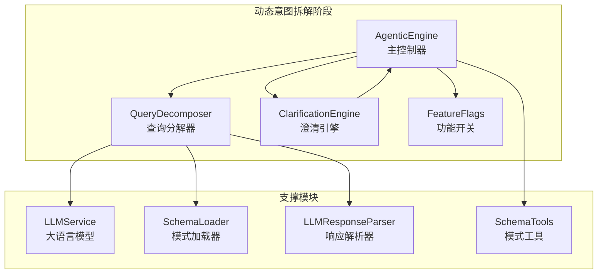
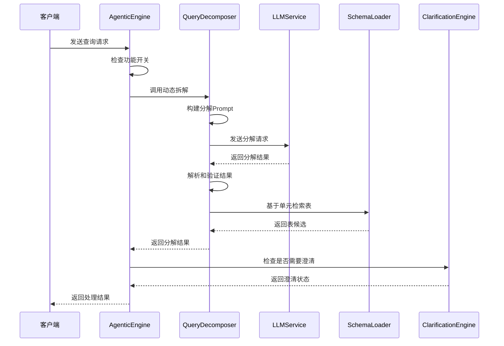
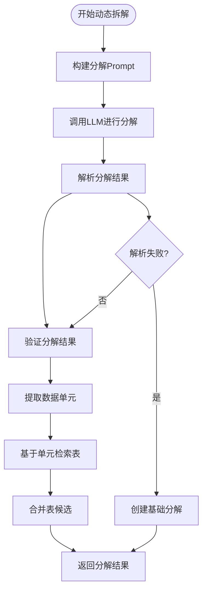
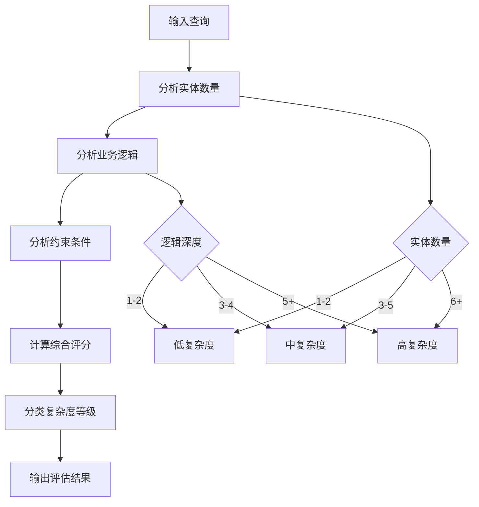
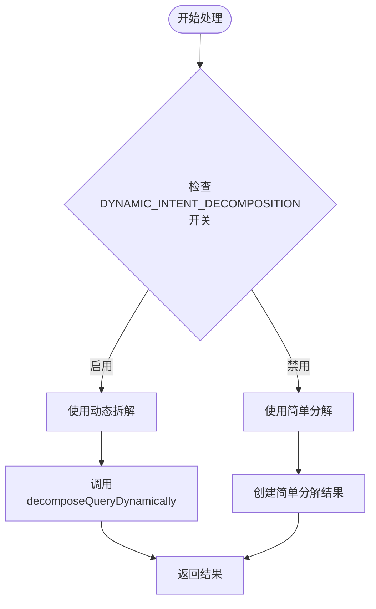
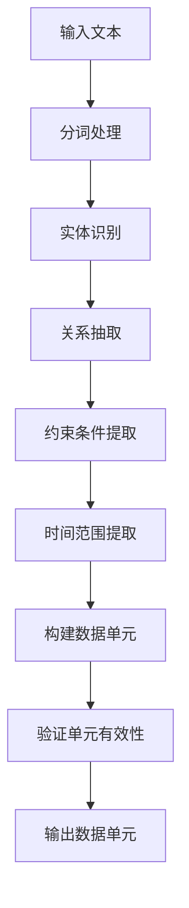
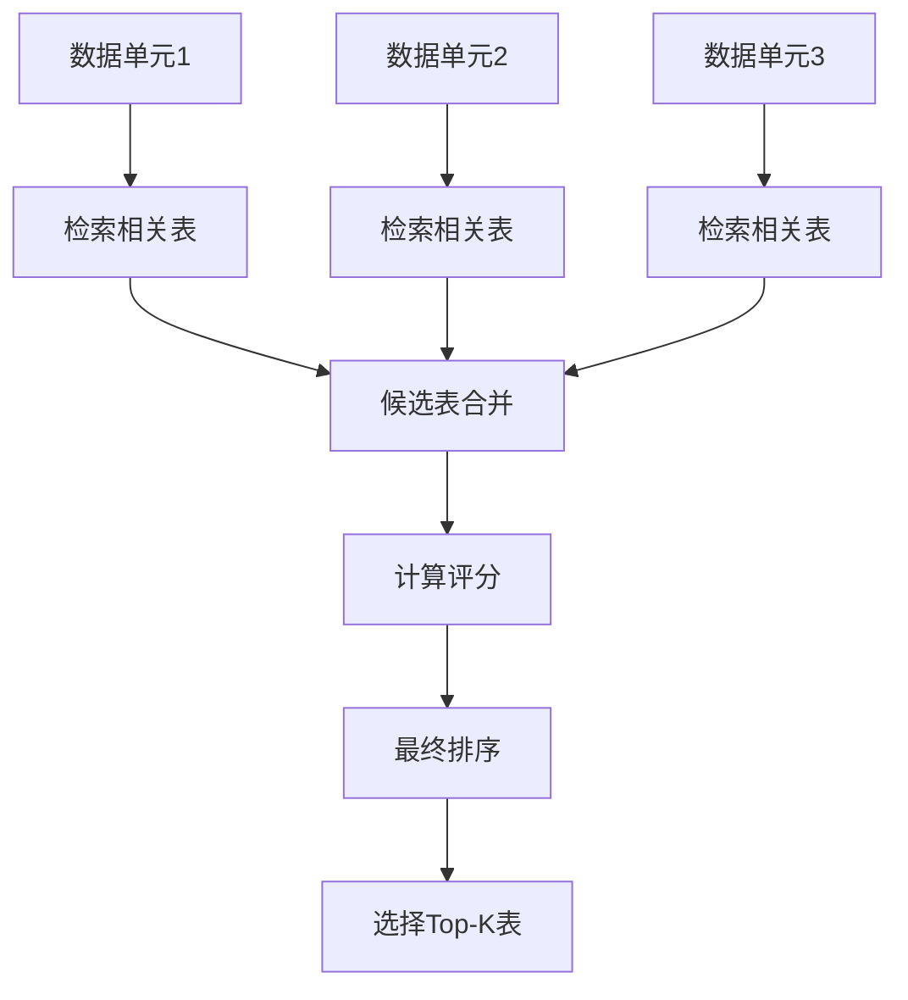
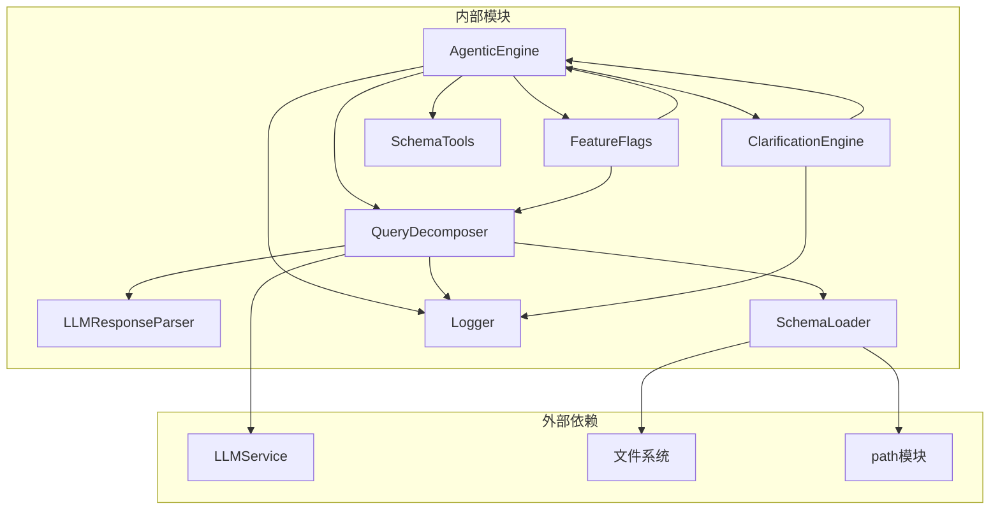

# 动态意图拆解阶段（Dynamic Intent Decomposition）

<cite>
**本文档引用的文件**
- [agenticEngine.js](file://backend/src/core/agenticEngine.js)
- [queryDecomposer.js](file://backend/src/core/queryDecomposer.js)
- [feature-flags.js](file://backend/config/feature-flags.js)
- [clarificationEngine.js](file://backend/src/core/clarificationEngine.js)
- [llmResponseParser.js](file://backend/src/utils/llmResponseParser.js)
- [schemaLoader.js](file://backend/src/core/schemaLoader.js)
</cite>

## 目录
1. [简介](#简介)
2. [项目结构](#项目结构)
3. [核心组件](#核心组件)
4. [架构概览](#架构概览)
5. [详细组件分析](#详细组件分析)
6. [依赖分析](#依赖分析)
7. [性能考虑](#性能考虑)
8. [故障排除指南](#故障排除指南)
9. [结论](#结论)

## 简介
动态意图拆解阶段是NL2SQL系统第四阶段工作流中的关键环节，负责将复杂的自然语言查询转换为结构化的数据需求单元。该阶段通过智能算法识别查询中的关键数据单元、实体关系和业务逻辑，为后续的SQL生成提供精确的数据需求。

本阶段的核心目标包括：
- 动态识别查询中的数据实体和业务逻辑
- 将复杂查询拆解为可独立处理的数据需求单元
- 为每个数据单元建立精确的表检索策略
- 提供结构化的数据需求描述，支持后续SQL生成

## 项目结构
NL2SQL系统的动态意图拆解功能分布在多个核心模块中，形成了清晰的分层架构：

**图表来源**
- [agenticEngine.js:355-379](file://backend/src/core/agenticEngine.js#L355-L379)
- [queryDecomposer.js:41-73](file://backend/src/core/queryDecomposer.js#L41-L73)

**章节来源**
- [agenticEngine.js:1-100](file://backend/src/core/agenticEngine.js#L1-L100)
- [queryDecomposer.js:1-50](file://backend/src/core/queryDecomposer.js#L1-L50)

## 核心组件
动态意图拆解阶段由多个相互协作的组件构成，每个组件都有明确的职责分工：

### 主控制器 - AgenticEngine
AgenticEngine作为整个工作流的协调者，负责：
- 调度动态意图拆解流程
- 管理功能开关控制
- 协调各模块间的交互
- 处理异常和回退机制

### 查询分解器 - QueryDecomposer
QueryDecomposer是动态拆解的核心实现，具备以下能力：
- 动态构建分解Prompt
- 调用LLM进行智能分解
- 验证和规范化分解结果
- 基于数据单元检索相关表

### 功能开关系统
通过集中式的功能开关控制系统，实现了：
- 动态意图拆解功能的启用/禁用
- 渐进式功能发布和回滚
- 系统行为的灵活控制

**章节来源**
- [agenticEngine.js:355-379](file://backend/src/core/agenticEngine.js#L355-L379)
- [queryDecomposer.js:27-73](file://backend/src/core/queryDecomposer.js#L27-L73)
- [feature-flags.js:43-47](file://backend/config/feature-flags.js#L43-L47)

## 架构概览
动态意图拆解阶段采用分层架构设计，确保了系统的可扩展性和可维护性：

**图表来源**
- [agenticEngine.js:95-125](file://backend/src/core/agenticEngine.js#L95-L125)
- [queryDecomposer.js:41-73](file://backend/src/core/queryDecomposer.js#L41-L73)

## 详细组件分析

### 动态拆解算法实现
动态拆解算法是整个阶段的核心，采用了先进的自然语言处理技术：

#### 算法流程

**图表来源**
- [queryDecomposer.js:41-73](file://backend/src/core/queryDecomposer.js#L41-L73)
- [queryDecomposer.js:155-174](file://backend/src/core/queryDecomposer.js#L155-L174)

#### 数据单元结构定义
每个数据单元都具有标准化的结构，包含以下关键字段：

| 字段名 | 类型 | 描述 | 示例 |
|--------|------|------|------|
| id | string | 唯一标识符 | "unit_1" |
| type | string | 单元类型 | "基础属性筛选" |
| description | string | 详细描述 | "游戏ID为67的玩家" |
| keywords | string[] | 关键词列表 | ["game_id", "玩家"] |
| filters | object[] | 筛选条件 | [{"field": "game_id", "operator": "=", "value": "67"}] |
| timeRange | object | 时间范围 | {"start": "2024-01-01", "end": "2024-01-31"} |
| metric | string | 指标名称 | "累计充值" |
| operator | string | 比较操作符 | ">=" |
| value | string | 比较值 | "1000" |
| behavior | object | 行为模式 | {"type": "登录行为", "date": "2024-01-01"} |
| outputFields | string[] | 输出字段 | ["player_id", "username"] |

#### 类型分类体系
数据单元按照业务逻辑分为多个类型类别：

**基础筛选类型**
- 基础属性筛选：game_id、平台、渠道等维度筛选
- 时间范围筛选：注册时间、登录时间等时间条件
- 聚合指标筛选：累计充值、总消费等聚合条件

**高级分析类型**
- 行为序列筛选：特定日期的行为模式
- 输出字段需求：需要返回的字段列表
- 复杂业务逻辑：多步骤的业务流程

**章节来源**
- [queryDecomposer.js:114-145](file://backend/src/core/queryDecomposer.js#L114-L145)
- [queryDecomposer.js:192-201](file://backend/src/core/queryDecomposer.js#L192-L201)

### 复杂度评估机制
系统实现了多层次的复杂度评估机制：

#### 评估维度
1. **查询长度评估**：基于查询文本的字符长度和词汇数量
2. **实体复杂度**：识别和处理的数据实体数量和类型
3. **业务逻辑复杂度**：涉及的业务规则和约束条件
4. **表关联复杂度**：需要连接的表数量和关系复杂度

#### 评估算法

**图表来源**
- [queryDecomposer.js:162-167](file://backend/src/core/queryDecomposer.js#L162-L167)

**章节来源**
- [queryDecomposer.js:162-167](file://backend/src/core/queryDecomposer.js#L162-L167)

### 功能开关决策机制
系统通过功能开关控制动态拆解的启用与否：

#### 决策流程

**图表来源**
- [agenticEngine.js:362-364](file://backend/src/core/agenticEngine.js#L362-L364)

#### 开关配置
- **DYNAMIC_INTENT_DECOMPOSITION**: 控制动态拆解功能的启用
- **UNIFIED_RANKER**: 控制表候选排序的统一机制
- **CLARIFICATION_ENGINE**: 控制澄清引擎的启用

**章节来源**
- [agenticEngine.js:362-364](file://backend/src/core/agenticEngine.js#L362-L364)
- [feature-flags.js:43-47](file://backend/config/feature-flags.js#L43-L47)

### 数据单元提取和识别
系统采用多模态的方法识别和提取数据单元：

#### 关键数据单元识别
1. **实体识别**：通过命名实体识别技术识别查询中的业务实体
2. **关系抽取**：分析实体间的关系和依赖关系
3. **约束条件提取**：识别筛选条件和业务规则
4. **时间范围识别**：提取时间相关的约束条件

#### 提取算法

**图表来源**
- [queryDecomposer.js:234-245](file://backend/src/core/queryDecomposer.js#L234-L245)

**章节来源**
- [queryDecomposer.js:234-245](file://backend/src/core/queryDecomposer.js#L234-L245)

### 表检索和候选合并
基于数据单元的表检索采用多阶段策略：

#### 检索策略
1. **关键词匹配**：基于数据单元的关键词进行表匹配
2. **语义相似度**：使用向量相似度计算表的相关性
3. **业务规则**：结合业务语义层进行智能匹配
4. **联合排序**：综合多种因素进行最终排序

#### 合并算法

**图表来源**
- [queryDecomposer.js:258-302](file://backend/src/core/queryDecomposer.js#L258-L302)

**章节来源**
- [queryDecomposer.js:258-302](file://backend/src/core/queryDecomposer.js#L258-L302)

## 依赖分析
动态意图拆解阶段的依赖关系体现了清晰的模块化设计：

**图表来源**
- [agenticEngine.js:20-29](file://backend/src/core/agenticEngine.js#L20-L29)
- [queryDecomposer.js:14-21](file://backend/src/core/queryDecomposer.js#L14-L21)

### 关键依赖关系
1. **LLMService依赖**：用于智能分解和澄清问题生成
2. **SchemaLoader依赖**：提供表结构信息和检索能力
3. **FeatureFlags依赖**：控制功能行为和系统配置
4. **LLMResponseParser依赖**：标准化LLM响应解析

**章节来源**
- [agenticEngine.js:20-29](file://backend/src/core/agenticEngine.js#L20-L29)
- [queryDecomposer.js:14-21](file://backend/src/core/queryDecomposer.js#L14-L21)

## 性能考虑
动态意图拆解阶段在设计时充分考虑了性能优化：

### 时间复杂度分析
- **动态拆解算法**：O(n × m)，其中n为查询长度，m为实体数量
- **表检索算法**：O(k × log N)，其中k为候选表数量，N为总表数
- **复杂度评估**：O(n + m)

### 空间复杂度分析
- **数据单元存储**：O(u)，其中u为单元数量
- **表候选缓存**：O(c)，其中c为候选表数量
- **中间结果缓存**：O(r)，其中r为中间结果数量

### 优化策略
1. **缓存机制**：对频繁使用的查询结果进行缓存
2. **增量更新**：只更新变化的部分，避免全量重算
3. **并行处理**：利用多核CPU并行处理多个数据单元
4. **内存管理**：及时释放不再使用的中间结果

## 故障排除指南
动态意图拆解阶段可能遇到的问题及解决方案：

### 常见问题类型

#### LLM响应解析失败
**症状**：分解结果解析失败，返回基础分解
**原因**：LLM响应格式不符合预期
**解决方案**：
1. 检查LLM响应格式
2. 验证JSON解析器配置
3. 查看日志获取详细错误信息

#### 表检索不准确
**症状**：返回的表候选与实际需求不符
**原因**：关键词匹配不准确或业务语义理解偏差
**解决方案**：
1. 优化关键词提取算法
2. 增强业务语义理解能力
3. 调整表候选评分权重

#### 复杂度评估偏差
**症状**：复杂度评估与实际处理难度不符
**原因**：评估算法过于简化或过于复杂
**解决方案**：
1. 调整评估权重系数
2. 增加更多评估维度
3. 引入机器学习模型优化

**章节来源**
- [queryDecomposer.js:67-72](file://backend/src/core/queryDecomposer.js#L67-L72)
- [queryDecomposer.js:168-174](file://backend/src/core/queryDecomposer.js#L168-L174)

## 结论
动态意图拆解阶段通过智能化的算法设计和模块化架构，成功实现了复杂查询的结构化处理。该阶段不仅提高了NL2SQL系统的准确性，还为后续的SQL生成提供了精确的数据需求。

### 主要优势
1. **智能分解**：能够理解复杂的业务逻辑和约束条件
2. **灵活配置**：通过功能开关实现渐进式功能发布
3. **高效检索**：基于数据单元的精准表检索机制
4. **可扩展性**：模块化设计支持功能的灵活扩展

### 未来发展方向
1. **增强语义理解**：提升对复杂业务逻辑的理解能力
2. **优化性能**：进一步减少处理延迟和资源消耗
3. **改进准确性**：通过机器学习提升分解和检索的准确性
4. **扩展应用场景**：支持更多类型的查询和业务场景

该阶段的成功实施为NL2SQL系统的整体性能提升奠定了坚实基础，为用户提供更加准确和高效的自然语言查询服务。