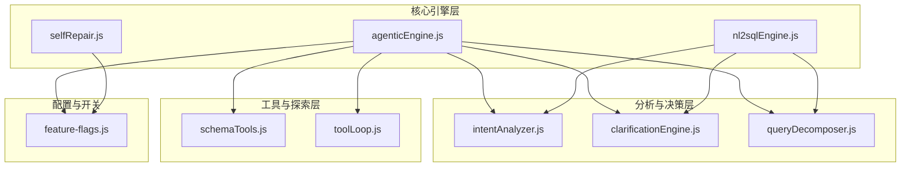
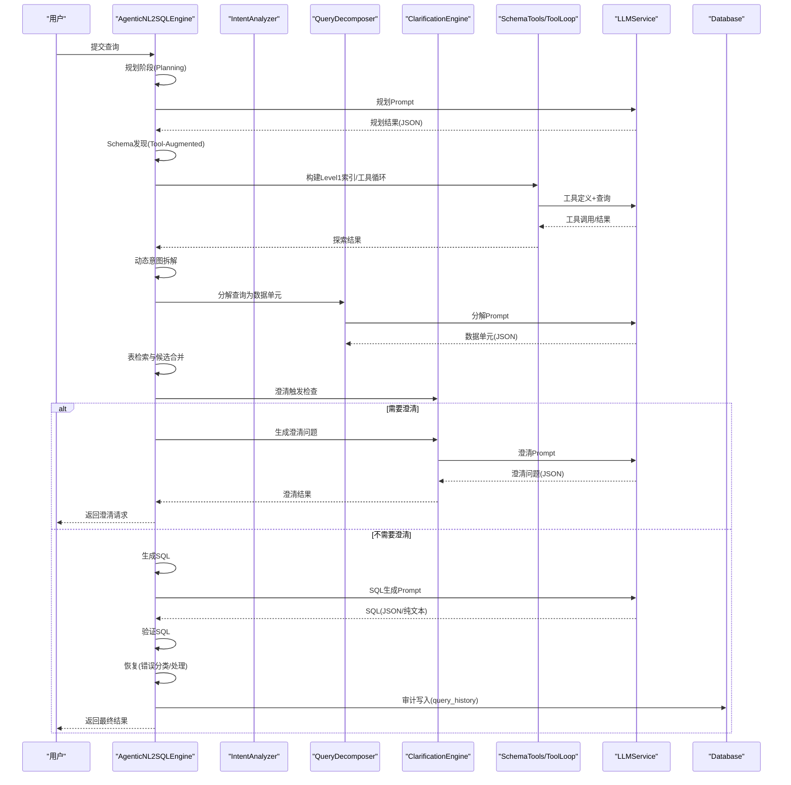
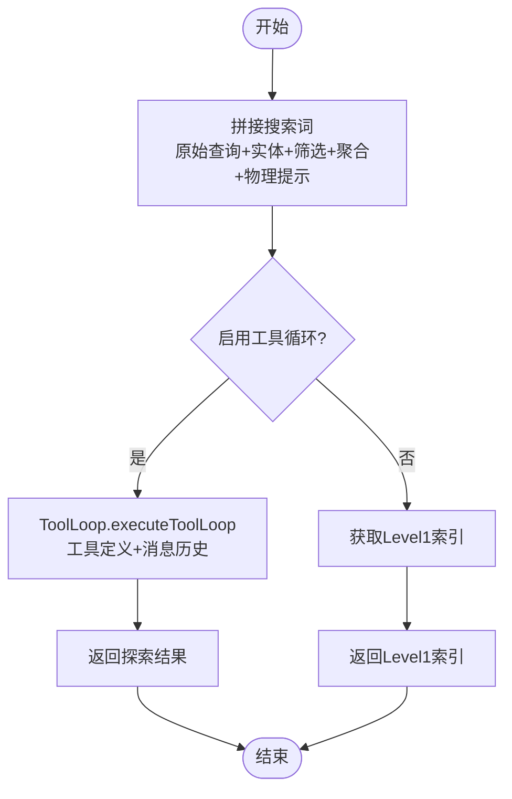
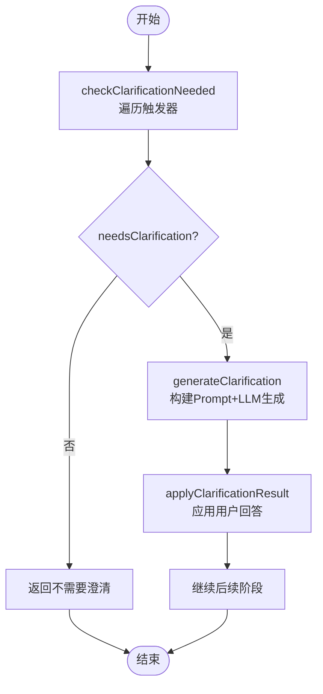
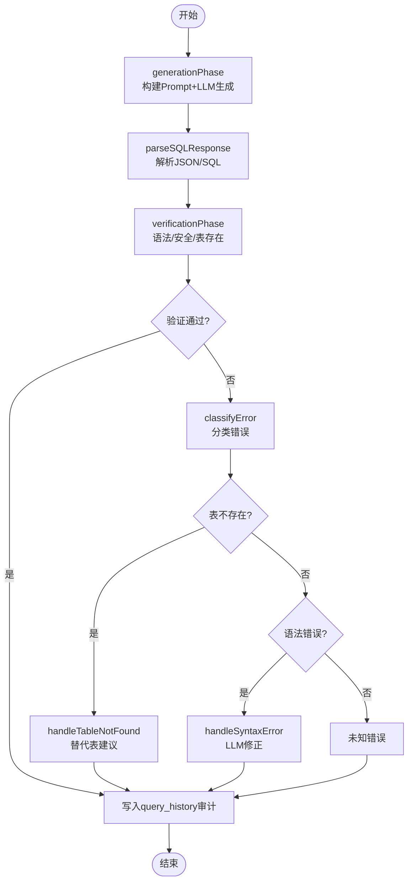
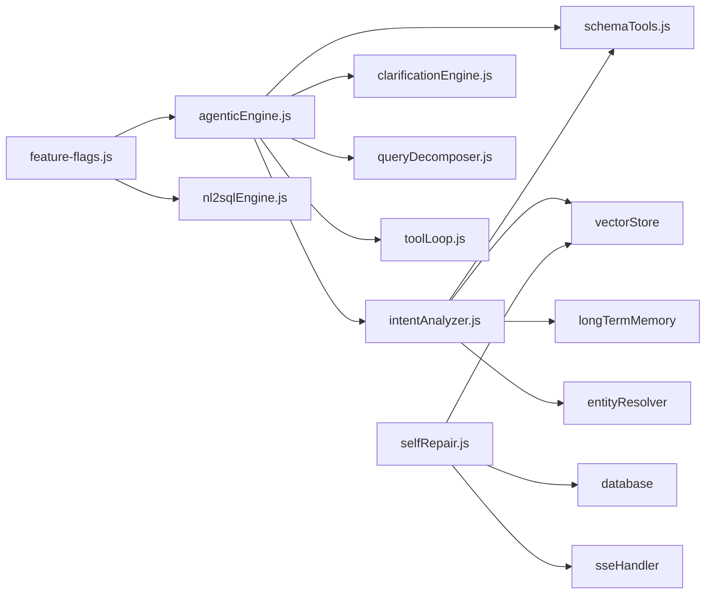

# 四阶段工作流程

<cite>
**本文引用的文件**
- [agenticEngine.js](file://backend/src/core/agenticEngine.js)
- [clarificationEngine.js](file://backend/src/core/clarificationEngine.js)
- [intentAnalyzer.js](file://backend/src/core/intentAnalyzer.js)
- [schemaTools.js](file://backend/src/core/schemaTools.js)
- [toolLoop.js](file://backend/src/core/toolLoop.js)
- [queryDecomposer.js](file://backend/src/core/queryDecomposer.js)
- [nl2sqlEngine.js](file://backend/src/core/nl2sqlEngine.js)
- [selfRepair.js](file://backend/src/core/selfRepair.js)
- [feature-flags.js](file://backend/config/feature-flags.js)
- [README.md](file://backend/test/phase4/README.md)
</cite>

## 目录
1. [简介](#简介)
2. [项目结构](#项目结构)
3. [核心组件](#核心组件)
4. [架构总览](#架构总览)
5. [详细组件分析](#详细组件分析)
6. [依赖关系分析](#依赖关系分析)
7. [性能考量](#性能考量)
8. [故障排查指南](#故障排查指南)
9. [结论](#结论)
10. [附录](#附录)

## 简介
本文围绕四阶段工作流程，系统性解析 agenticEngine.js 中的 Phase 1-4 渐进式功能增强机制，涵盖规划阶段（Planning）、Schema 发现阶段（Tool-Augmented Schema Discovery）、动态意图拆解阶段（Dynamic Intent Decomposition）、澄清确认阶段（Clarification + Confirmation）和生成验证恢复阶段（Generation + Verification + Recovery）。文档从设计原理、实现细节、数据流、处理逻辑、相互关系、状态管理与错误恢复等方面进行深入剖析，并提供可操作的使用模式与扩展建议，帮助开发者快速理解与二次开发。

## 项目结构
本项目采用“按功能域分层 + 按阶段划分”的组织方式：
- 核心引擎层：agenticEngine.js、nl2sqlEngine.js、selfRepair.js
- 分析与决策层：intentAnalyzer.js、clarificationEngine.js、queryDecomposer.js
- 工具与探索层：schemaTools.js、toolLoop.js
- 配置与开关：feature-flags.js
- 测试与回归：backend/test/phaseX/README.md

图表来源
- [agenticEngine.js:1-200](file://backend/src/core/agenticEngine.js#L1-L200)
- [nl2sqlEngine.js:1-200](file://backend/src/core/nl2sqlEngine.js#L1-L200)
- [feature-flags.js:16-141](file://backend/config/feature-flags.js#L16-L141)

章节来源
- [agenticEngine.js:1-200](file://backend/src/core/agenticEngine.js#L1-L200)
- [nl2sqlEngine.js:1-200](file://backend/src/core/nl2sqlEngine.js#L1-L200)
- [feature-flags.js:16-141](file://backend/config/feature-flags.js#L16-L141)

## 核心组件
- AgenticNL2SQLEngine：四阶段工作流的主控引擎，串联规划、Schema 发现、动态拆解、澄清确认、生成验证恢复。
- ClarificationEngine：触发与生成澄清问题，应用用户回答，驱动意图细化。
- IntentAnalyzer：意图识别、上下文融合、长期记忆、澄清生成与完整性检查。
- QueryDecomposer：将复杂查询动态拆解为数据需求单元，并基于单元检索候选表。
- SchemaTools + ToolLoop：提供工具化Schema探索能力，支持LLM按需调用工具。
- nl2sqlEngine：Phase 4 的另一条路径（非Agentic），同样包含意图识别、澄清、SQL生成、验证、RLS改写、执行、格式化与审计。
- SelfRepair：系统自修复与健康检查，包含定时任务、错误统计与建议、死信队列处理等。

章节来源
- [agenticEngine.js:54-215](file://backend/src/core/agenticEngine.js#L54-L215)
- [clarificationEngine.js:196-232](file://backend/src/core/clarificationEngine.js#L196-L232)
- [intentAnalyzer.js:173-468](file://backend/src/core/intentAnalyzer.js#L173-L468)
- [queryDecomposer.js:41-73](file://backend/src/core/queryDecomposer.js#L41-L73)
- [schemaTools.js:40-124](file://backend/src/core/schemaTools.js#L40-L124)
- [toolLoop.js:75-203](file://backend/src/core/toolLoop.js#L75-L203)
- [nl2sqlEngine.js:121-734](file://backend/src/core/nl2sqlEngine.js#L121-L734)
- [selfRepair.js:65-183](file://backend/src/core/selfRepair.js#L65-L183)

## 架构总览
四阶段工作流以“Plan → Act → Observe”循环为核心，通过工具化Schema探索与动态意图拆解提升鲁棒性，通过澄清确认降低歧义，通过生成-验证-恢复闭环保证质量与可恢复性。

图表来源
- [agenticEngine.js:70-215](file://backend/src/core/agenticEngine.js#L70-L215)
- [intentAnalyzer.js:258-404](file://backend/src/core/intentAnalyzer.js#L258-L404)
- [queryDecomposer.js:41-73](file://backend/src/core/queryDecomposer.js#L41-L73)
- [clarificationEngine.js:196-272](file://backend/src/core/clarificationEngine.js#L196-L272)
- [schemaTools.js:565-602](file://backend/src/core/schemaTools.js#L565-L602)
- [toolLoop.js:75-203](file://backend/src/core/toolLoop.js#L75-L203)

## 详细组件分析

### 规划阶段（Planning）
- 输入：用户查询
- 输出：规划结果（实体、筛选、聚合、风险、物理提示、复杂度估计）
- 处理逻辑：
  - 构造规划Prompt，要求输出JSON，包含实体、筛选、聚合、风险、物理提示、复杂度估计。
  - 调用LLMService.simpleChat获取响应，尝试提取JSON片段并解析。
  - 解析失败时返回默认规划，确保下游健壮性。
- 关键点：
  - 物理提示（physicalHints）用于后续Schema搜索避免丢失typeid/int_key*等token。
  - 复杂度估计用于后续阶段的资源与策略选择。

章节来源
- [agenticEngine.js:228-278](file://backend/src/core/agenticEngine.js#L228-L278)

### Schema 发现阶段（Tool-Augmented Schema Discovery）
- 输入：用户查询、规划结果、上下文
- 输出：Schema上下文（Level1索引、工具探索结果）
- 处理逻辑：
  - 根据配置决定是否将原始查询与规划中的实体、筛选、聚合、物理提示拼接为搜索词。
  - 若开启工具循环模式，调用ToolLoop.executeToolLoop进行多轮工具调用，LLM按需搜索表、描述表、查询业务知识、预览表结构。
  - 否则返回Level1索引与空的工具探索结果。
- 关键点：
  - 支持SCHEMA_SEARCH_INCLUDE_RAW开关控制是否包含原始查询与物理提示。
  - 兼容旧签名（第一个参数为规划对象）。

图表来源
- [agenticEngine.js:287-349](file://backend/src/core/agenticEngine.js#L287-L349)
- [toolLoop.js:75-203](file://backend/src/core/toolLoop.js#L75-L203)
- [schemaTools.js:40-124](file://backend/src/core/schemaTools.js#L40-L124)

章节来源
- [agenticEngine.js:287-349](file://backend/src/core/agenticEngine.js#L287-L349)
- [toolLoop.js:75-203](file://backend/src/core/toolLoop.js#L75-L203)
- [schemaTools.js:136-173](file://backend/src/core/schemaTools.js#L136-L173)

### 动态意图拆解阶段（Dynamic Intent Decomposition）
- 输入：用户查询、上下文
- 输出：分解结果（主实体、数据单元、复杂度、是否需要Join、潜在风险）
- 处理逻辑：
  - 构建分解Prompt，要求LLM输出JSON，包含思考过程、主实体、数据单元列表（含类型、描述、关键词、筛选、时间范围、指标、行为、输出字段）。
  - 解析失败时回退到基础分解（整体查询单元）。
  - 基于数据单元检索候选表，合并候选并按覆盖率与频率打分，使用tableRanker进行统一裁剪与保护。
- 关键点：
  - 数据单元类型动态确定，适配任意复杂查询。
  - 通过mergeTableCandidates与tableRanker统一裁剪，cap=8，避免硬截断。

章节来源
- [agenticEngine.js:358-379](file://backend/src/core/agenticEngine.js#L358-L379)
- [queryDecomposer.js:41-73](file://backend/src/core/queryDecomposer.js#L41-L73)
- [queryDecomposer.js:258-302](file://backend/src/core/queryDecomposer.js#L258-L302)
- [queryDecomposer.js:352-413](file://backend/src/core/queryDecomposer.js#L352-L413)

### 澄清确认阶段（Clarification + Confirmation）
- 输入：分解结果、表候选
- 输出：是否需要澄清、澄清问题、触发原因
- 处理逻辑：
  - 检查是否需要澄清（多触发器：无匹配表、表歧义、聚合来源不确定、时间粒度不确定、低置信度）。
  - 若需要澄清，生成澄清问题（支持选项与默认推荐），并记录触发原因。
  - 用户回答后，应用澄清结果（覆盖表偏好、指标来源、时间粒度、从回答中抽取物理过滤与字段）。
- 关键点：
  - 仅返回最高优先级触发，避免一次问太多问题。
  - 支持“确认默认”场景，减少重复追问。

图表来源
- [clarificationEngine.js:196-232](file://backend/src/core/clarificationEngine.js#L196-L232)
- [clarificationEngine.js:246-272](file://backend/src/core/clarificationEngine.js#L246-L272)
- [clarificationEngine.js:388-428](file://backend/src/core/clarificationEngine.js#L388-L428)
- [clarificationEngine.js:494-540](file://backend/src/core/clarificationEngine.js#L494-L540)

章节来源
- [clarificationEngine.js:196-232](file://backend/src/core/clarificationEngine.js#L196-L232)
- [clarificationEngine.js:246-272](file://backend/src/core/clarificationEngine.js#L246-L272)
- [clarificationEngine.js:388-428](file://backend/src/core/clarificationEngine.js#L388-L428)
- [clarificationEngine.js:494-540](file://backend/src/core/clarificationEngine.js#L494-L540)

### 生成验证恢复阶段（Generation + Verification + Recovery）
- 输入：分解结果、表候选、Schema上下文、上下文
- 输出：SQL、解释、验证结果、恢复策略
- 处理逻辑：
  - 生成SQL：优先使用推荐表，否则回退到schemaLoader搜索；构建Prompt注入当前时间、最近对话、澄清记录、数据单元；解析LLM响应，提取JSON或SQL。
  - 验证SQL：基本语法检查（SELECT/FROM）、安全关键字过滤、表存在性检查，汇总错误。
  - 恢复：根据错误类型分类（表不存在、语法错误），分别处理（替代表建议、请求LLM修正）。
  - 审计：成功路径写入query_history，避免双写。
- 关键点：
  - Prompt注入策略支持开关回退（PROMPT_INJECT_NOW）。
  - 错误分类与恢复策略可扩展。

图表来源
- [agenticEngine.js:432-595](file://backend/src/core/agenticEngine.js#L432-L595)
- [agenticEngine.js:678-773](file://backend/src/core/agenticEngine.js#L678-L773)
- [agenticEngine.js:171-200](file://backend/src/core/agenticEngine.js#L171-L200)

章节来源
- [agenticEngine.js:432-595](file://backend/src/core/agenticEngine.js#L432-L595)
- [agenticEngine.js:678-773](file://backend/src/core/agenticEngine.js#L678-L773)
- [agenticEngine.js:171-200](file://backend/src/core/agenticEngine.js#L171-L200)

### 与 Phase 4（传统路径）的关系
- nl2sqlEngine.js 提供了另一条四阶段路径，包含意图识别、澄清、SQL生成、验证、RLS改写、执行、格式化与审计。
- 两者共享相同的阶段划分与错误恢复理念，但Agentic路径在Schema探索与动态拆解上更强调工具化与数据单元化。

章节来源
- [nl2sqlEngine.js:121-734](file://backend/src/core/nl2sqlEngine.js#L121-L734)

## 依赖关系分析
- 功能开关：feature-flags.js 控制各阶段特性开关，如工具循环、动态拆解、澄清引擎、Agentic引擎、统一表候选排序等。
- 组件耦合：
  - AgenticEngine 依赖 IntentAnalyzer、ClarificationEngine、QueryDecomposer、SchemaTools、ToolLoop。
  - IntentAnalyzer 依赖 schemaLoader、vectorStore、longTermMemory、entityResolver。
  - SelfRepair 依赖定时任务、数据库、向量存储、SSE处理器。
- 外部依赖：LLMService、数据库、向量存储、日志与安全组件。

图表来源
- [feature-flags.js:16-141](file://backend/config/feature-flags.js#L16-L141)
- [agenticEngine.js:20-31](file://backend/src/core/agenticEngine.js#L20-L31)
- [nl2sqlEngine.js:20-37](file://backend/src/core/nl2sqlEngine.js#L20-L37)
- [selfRepair.js:15-26](file://backend/src/core/selfRepair.js#L15-L26)

章节来源
- [feature-flags.js:16-141](file://backend/config/feature-flags.js#L16-L141)
- [agenticEngine.js:20-31](file://backend/src/core/agenticEngine.js#L20-L31)
- [nl2sqlEngine.js:20-37](file://backend/src/core/nl2sqlEngine.js#L20-L37)
- [selfRepair.js:15-26](file://backend/src/core/selfRepair.js#L15-L26)

## 性能考量
- 工具循环限制：最大迭代次数与超时，防止LLM陷入工具调用循环。
- 表候选裁剪：统一使用tableRanker进行打分与裁剪，cap=8，避免硬截断带来的信息损失。
- Prompt注入：通过开关控制注入当前时间、最近对话、澄清记录与数据单元，平衡上下文与Token预算。
- 审计与日志：成功路径独立写入query_history，避免失败路径重复写入导致的双写开销。

章节来源
- [toolLoop.js:48-53](file://backend/src/core/toolLoop.js#L48-L53)
- [queryDecomposer.js:378-413](file://backend/src/core/queryDecomposer.js#L378-L413)
- [agenticEngine.js:482-534](file://backend/src/core/agenticEngine.js#L482-L534)
- [agenticEngine.js:171-200](file://backend/src/core/agenticEngine.js#L171-L200)

## 故障排查指南
- 功能开关检查：通过feature-flags.js检查各开关状态，确认是否启用工具循环、动态拆解、澄清引擎、Agentic引擎等。
- 日志与审计：关注AgenticEngine与SelfRepair的日志输出，定位Schema探索失败、澄清问题生成失败、SQL验证失败、RLS改写失败等问题。
- 死信队列：SelfRepair提供死信队列扫描与告警，必要时进行人工审阅与处理。
- 回归测试：参考Phase 4测试README，确保关键导出契约与模块行为稳定。

章节来源
- [feature-flags.js:153-206](file://backend/config/feature-flags.js#L153-L206)
- [selfRepair.js:597-618](file://backend/src/core/selfRepair.js#L597-L618)
- [README.md:1-51](file://backend/test/phase4/README.md#L1-L51)

## 结论
四阶段工作流通过“规划-探索-拆解-澄清-生成-验证-恢复”的闭环，显著提升了复杂查询的鲁棒性与可解释性。AgenticEngine在Schema探索与动态拆解上的工具化与数据单元化设计，配合ClarificationEngine的触发与应用机制，使系统能够应对歧义、缺失信息与复杂业务场景。通过完善的错误分类与恢复策略、审计与自修复机制，系统在生产环境中具备良好的可维护性与可扩展性。

## 附录
- 使用模式建议：
  - 在复杂查询场景启用动态意图拆解与工具循环模式，提升表检索准确性。
  - 在歧义较高或置信度较低时启用澄清引擎，减少后续生成失败。
  - 在生产环境启用统一表候选排序与RLS改写，确保性能与安全。
- 扩展方法：
  - 新增触发器：在ClarificationEngine中扩展触发器配置与生成逻辑。
  - 新增工具：在SchemaTools中扩展工具定义与执行器，并在ToolLoop中启用。
  - 新增恢复策略：在AgenticEngine的recoveryPhase中扩展错误分类与处理逻辑。