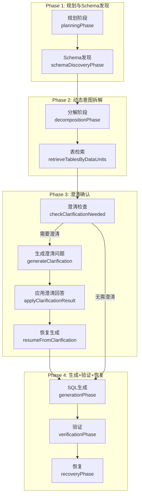
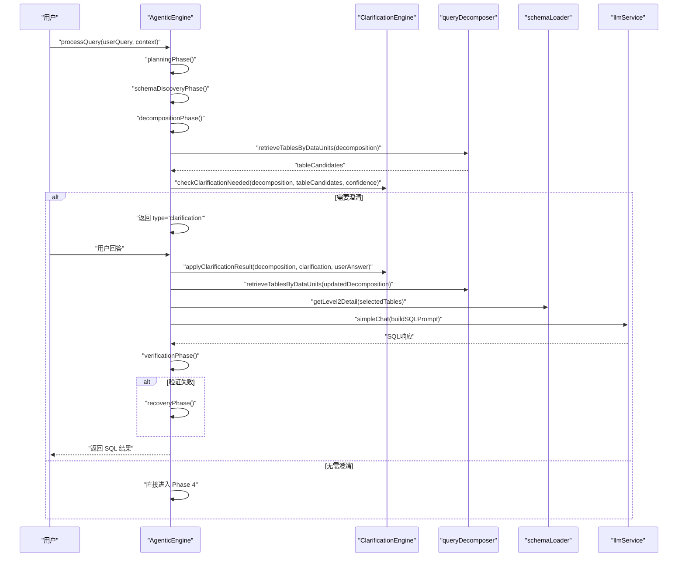
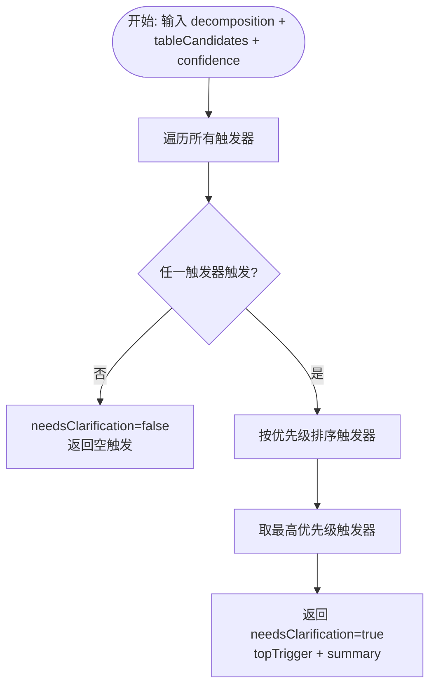
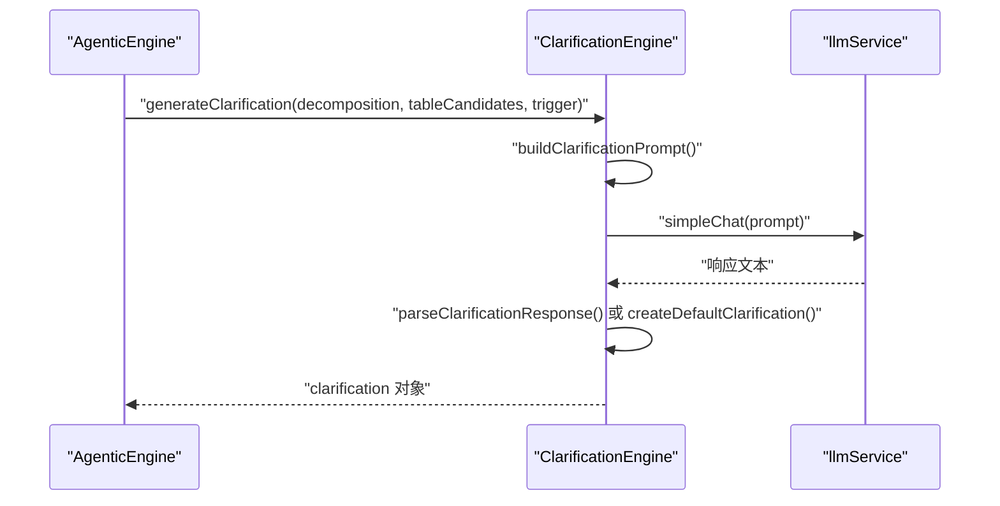
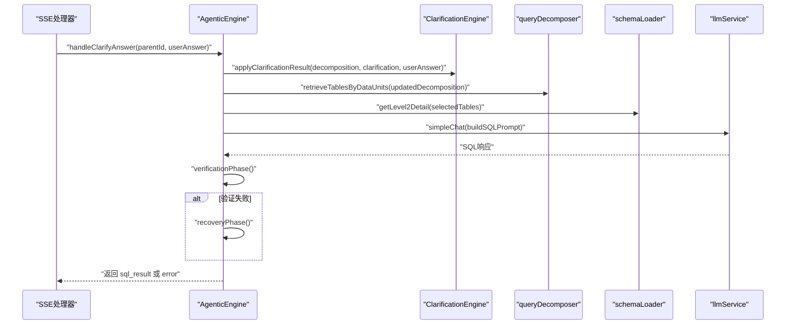
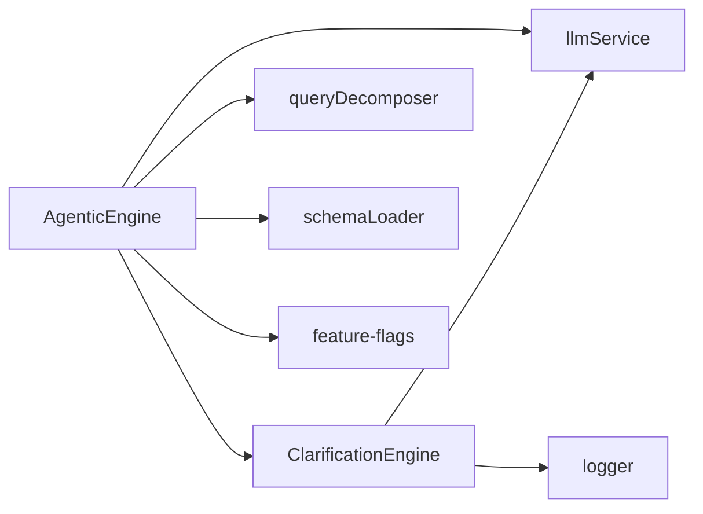

# 澄清确认阶段（Clarification + Confirmation）

<cite>
**本文档引用的文件**
- [agenticEngine.js](file://backend/src/core/agenticEngine.js)
- [clarificationEngine.js](file://backend/src/core/clarificationEngine.js)
- [feature-flags.js](file://backend/config/feature-flags.js)
- [clarification-apply.test.js](file://backend/test/phase3/clarification-apply.test.js)
- [clarification-resume.test.js](file://backend/test/phase3/clarification-resume.test.js)
- [sse-clarify-answer-route.test.js](file://backend/test/phase3/sse-clarify-answer-route.test.js)
</cite>

## 目录
1. [简介](#简介)
2. [项目结构](#项目结构)
3. [核心组件](#核心组件)
4. [架构概览](#架构概览)
5. [详细组件分析](#详细组件分析)
6. [依赖关系分析](#依赖关系分析)
7. [性能考量](#性能考量)
8. [故障排查指南](#故障排查指南)
9. [结论](#结论)
10. [附录](#附录)

## 简介
本文件聚焦“澄清确认阶段”（Phase 3），系统化解析 agenticEngine.js 中的 clarificationPhase 函数实现，涵盖：
- 澄清需求检查与触发条件
- 基于分解结果与表候选列表的判断逻辑
- 澄清触发因素与置信度阈值
- 澄清引擎启用机制与问题生成流程
- 批次 B 新增的“澄清回答恢复生成”能力（resumeFromClarification）
- 与第一轮查询的关联、prompt 注入与重新生成流程

## 项目结构
澄清确认阶段位于四阶段工作流的第三阶段，紧随动态意图拆解之后，负责在置信度不足或存在歧义时生成澄清问题，并在用户回答后恢复生成流程。

图表来源
- [agenticEngine.js:85-125](file://backend/src/core/agenticEngine.js#L85-L125)
- [agenticEngine.js:388-423](file://backend/src/core/agenticEngine.js#L388-L423)
- [agenticEngine.js:803-929](file://backend/src/core/agenticEngine.js#L803-L929)

章节来源
- [agenticEngine.js:85-125](file://backend/src/core/agenticEngine.js#L85-L125)
- [agenticEngine.js:388-423](file://backend/src/core/agenticEngine.js#L388-L423)

## 核心组件
- 澄清检查器（checkClarificationNeeded）：根据分解结果、表候选列表与置信度，判定是否需要澄清，并返回最高优先级触发因素。
- 澄清生成器（generateClarification）：基于触发因素生成友好的澄清问题，包含问题文本、选项与类型。
- 澄清应用器（applyClarificationResult）：将用户回答写回到分解结果，支持多种澄清类型（表选择、指标来源、时间粒度、通用）。
- 恢复生成器（resumeFromClarification）：批次 B 新增，从澄清回答恢复生成，沿用 generation → verification → recovery 流程，确保 prompt 注入与历史上下文完整。

章节来源
- [clarificationEngine.js:196-232](file://backend/src/core/clarificationEngine.js#L196-L232)
- [clarificationEngine.js:246-272](file://backend/src/core/clarificationEngine.js#L246-L272)
- [clarificationEngine.js:388-428](file://backend/src/core/clarificationEngine.js#L388-L428)
- [agenticEngine.js:803-929](file://backend/src/core/agenticEngine.js#L803-L929)

## 架构概览
澄清确认阶段在 agenticEngine 中的调用链如下：

图表来源
- [agenticEngine.js:70-215](file://backend/src/core/agenticEngine.js#L70-L215)
- [agenticEngine.js:388-423](file://backend/src/core/agenticEngine.js#L388-L423)
- [agenticEngine.js:803-929](file://backend/src/core/agenticEngine.js#L803-L929)

## 详细组件分析

### 澄清检查与触发条件
- 触发器集合（CLARIFICATION_TRIGGERS）包含五类场景：
  - 未覆盖的数据单元（uncovered_data_unit）
  - 表选择歧义（table_ambiguity）
  - 聚合指标来源不明确（aggregation_source_uncertain）
  - 时间粒度不明确（time_granularity_uncertain）
  - 置信度过低（low_confidence）
- checkClarificationNeeded 的默认置信度阈值为 0.8；当传入置信度低于 0.6 时，low_confidence 触发并标记为 HIGH/MEDIUM 严重级别。
- 返回值包含 needsClarification、topTrigger、summary 等，便于上层决策。

图表来源
- [clarificationEngine.js:196-232](file://backend/src/core/clarificationEngine.js#L196-L232)

章节来源
- [clarificationEngine.js:26-182](file://backend/src/core/clarificationEngine.js#L26-L182)
- [clarificationEngine.js:196-232](file://backend/src/core/clarificationEngine.js#L196-L232)

### 澄清问题生成机制
- generateClarification 基于触发器构建澄清 Prompt，调用 LLM 生成 JSON 格式的澄清问题，包含 question、options、defaultOption、clarificationType、explanation。
- 若 LLM 解析失败，回退到 createDefaultClarification，保证可用性。

图表来源
- [clarificationEngine.js:246-272](file://backend/src/core/clarificationEngine.js#L246-L272)
- [clarificationEngine.js:277-312](file://backend/src/core/clarificationEngine.js#L277-L312)
- [clarificationEngine.js:317-374](file://backend/src/core/clarificationEngine.js#L317-L374)

章节来源
- [clarificationEngine.js:246-374](file://backend/src/core/clarificationEngine.js#L246-L374)

### 澄清回答应用与恢复生成
- applyClarificationResult 根据 clarificationType 应用不同策略：
  - table_selection：设置 preferSummaryTable
  - metric_source：设置 metricSource
  - time_granularity：更新所有时间单元的 granularity
  - general：批次 B 新增的 applyUncoveredDataUnit，从用户回答中抽取 field=value 与物理字段名，写回 dataUnits 的 filters、outputFields、keywords，并追加 description
- resumeFromClarification 是批次 B 的核心：应用澄清回答后，直接走 generation → verification → recovery 流程，确保 prompt 注入与历史上下文完整，避免第二轮脱离原需求。

图表来源
- [agenticEngine.js:803-929](file://backend/src/core/agenticEngine.js#L803-L929)
- [clarificationEngine.js:388-540](file://backend/src/core/clarificationEngine.js#L388-L540)

章节来源
- [agenticEngine.js:803-929](file://backend/src/core/agenticEngine.js#L803-L929)
- [clarificationEngine.js:388-540](file://backend/src/core/clarificationEngine.js#L388-L540)

### 澄清引擎启用机制与特征开关
- 功能开关 CLARIFICATION_ENGINE 控制是否启用澄清引擎。
- feature-flags.js 提供 isEnabled('CLARIFICATION_ENGINE') 以统一检查开关状态。

章节来源
- [feature-flags.js](file://backend/config/feature-flags.js#L63)
- [feature-flags.js:153-166](file://backend/config/feature-flags.js#L153-L166)

### 置信度阈值与触发因素
- 默认置信度阈值：checkClarificationNeeded 默认传入 0.8；low_confidence 的阈值为 0.6。
- 触发因素优先级：按 priority 排序，仅返回最高优先级触发，避免一次性问太多问题。
- 严重级别：置信度低于 0.4 时标记为 HIGH，否则为 MEDIUM。

章节来源
- [agenticEngine.js](file://backend/src/core/agenticEngine.js#L395)
- [clarificationEngine.js:169-181](file://backend/src/core/clarificationEngine.js#L169-L181)
- [clarificationEngine.js](file://backend/src/core/clarificationEngine.js#L216)

### 批次 B：澄清回答恢复生成
- 目标：将第一轮 originalQuery + decomposition + 用户澄清回答合并后重新生成 SQL，避免第二轮 query 脱离原需求。
- 关键点：
  - 不再跑 planning / schemaDiscovery / decomposition / clarification 阶段
  - 直接用上一轮已落库的 decomposition，在其上打补丁（applyClarificationResult）
  - context.history 由 SSE 处理器组装后传入，自动带上原始 query + 用户回答，配合批次 A 的 buildSQLPrompt 将对话上下文与澄清记录注入 prompt
- 恢复流程：generation → verification → recovery；若 recovery 未产出合法 SQL 且原 SQL 基本语法完整，则降级为“可用 + 警告”。

章节来源
- [agenticEngine.js:783-802](file://backend/src/core/agenticEngine.js#L783-L802)
- [agenticEngine.js:803-929](file://backend/src/core/agenticEngine.js#L803-L929)
- [clarification-resume.test.js:66-142](file://backend/test/phase3/clarification-resume.test.js#L66-L142)

## 依赖关系分析
- AgenticEngine 依赖：
  - clarificationEngine：check、generate、apply
  - queryDecomposer：表检索
  - schemaLoader：表详情与存在性检查
  - llmService：生成 SQL 与澄清问题
  - featureFlags：功能开关
- ClarificationEngine 依赖：
  - llmService：生成澄清问题
  - logger：日志

图表来源
- [agenticEngine.js:20-29](file://backend/src/core/agenticEngine.js#L20-L29)
- [clarificationEngine.js:14-16](file://backend/src/core/clarificationEngine.js#L14-L16)

章节来源
- [agenticEngine.js:20-29](file://backend/src/core/agenticEngine.js#L20-L29)
- [clarificationEngine.js:14-16](file://backend/src/core/clarificationEngine.js#L14-L16)

## 性能考量
- 澄清检查与生成均为轻量级调用，主要成本在 LLM 调用与表检索。
- 批次 B 的恢复生成避免重复规划与 Schema 发现，减少往返开销。
- 建议：
  - 控制澄清问题数量（仅最高优先级触发）
  - 合理设置置信度阈值，避免过度澄清
  - 在恢复生成中利用历史上下文注入，提高 prompt 效果

## 故障排查指南
- 澄清问题生成失败：
  - 检查 LLM 响应是否为 JSON 格式，必要时回退到默认模板
  - 查看日志中“解析失败”的提示
- 澄清回答应用异常：
  - 确认 clarificationType 与用户回答内容匹配
  - 检查 applyUncoveredDataUnit 是否正确抽取 field=value 与物理字段
- 恢复生成验证失败：
  - 查看 verificationPhase 的失败检查项（基本语法、安全、表存在性）
  - 若 recovery 分类为 UNKNOWN，考虑降级保留原 SQL 并附加警告

章节来源
- [clarificationEngine.js:266-271](file://backend/src/core/clarificationEngine.js#L266-L271)
- [clarificationEngine.js:494-540](file://backend/src/core/clarificationEngine.js#L494-L540)
- [agenticEngine.js:600-657](file://backend/src/core/agenticEngine.js#L600-L657)
- [agenticEngine.js:871-889](file://backend/src/core/agenticEngine.js#L871-L889)

## 结论
澄清确认阶段通过“触发条件 + 置信度阈值 + 问题生成 + 回答应用 + 恢复生成”的闭环，显著提升了复杂查询的准确性与鲁棒性。批次 B 的恢复生成进一步强化了“从澄清回答到 SQL”的端到端一致性，确保用户输入被完整保留并注入到后续 prompt 中，从而提升最终 SQL 的质量与可解释性。

## 附录

### 代码示例路径（不含具体代码内容）
- 澄清检查逻辑
  - [checkClarificationNeeded:196-232](file://backend/src/core/clarificationEngine.js#L196-L232)
- 问题生成模板
  - [buildClarificationPrompt:277-312](file://backend/src/core/clarificationEngine.js#L277-L312)
  - [createDefaultClarification:333-374](file://backend/src/core/clarificationEngine.js#L333-L374)
- 恢复生成机制
  - [resumeFromClarification:803-929](file://backend/src/core/agenticEngine.js#L803-L929)
  - [applyClarificationResult:388-428](file://backend/src/core/clarificationEngine.js#L388-L428)
  - [applyUncoveredDataUnit:494-540](file://backend/src/core/clarificationEngine.js#L494-L540)
- 单元测试参考
  - [clarification-apply.test.js:20-150](file://backend/test/phase3/clarification-apply.test.js#L20-L150)
  - [clarification-resume.test.js:66-240](file://backend/test/phase3/clarification-resume.test.js#L66-L240)
  - [sse-clarify-answer-route.test.js:74-246](file://backend/test/phase3/sse-clarify-answer-route.test.js#L74-L246)