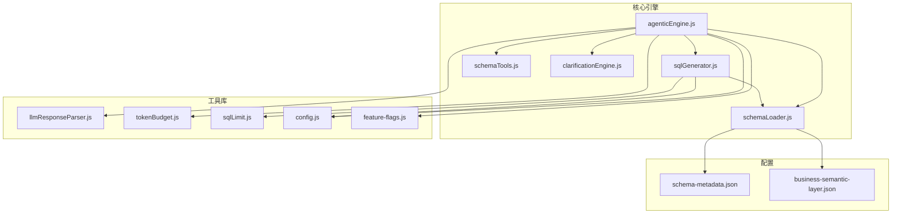
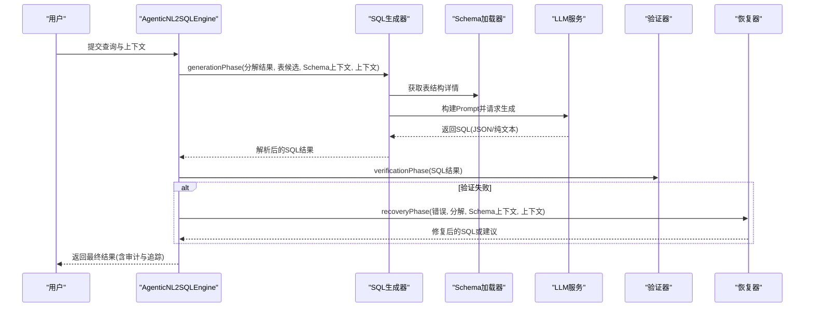
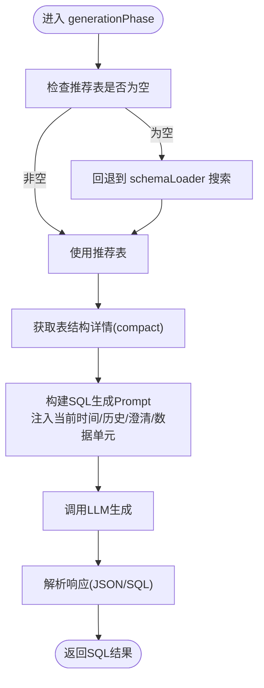
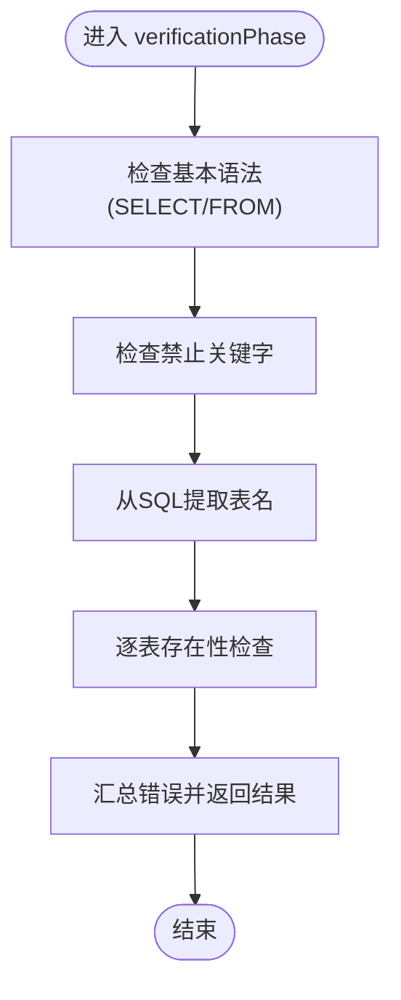
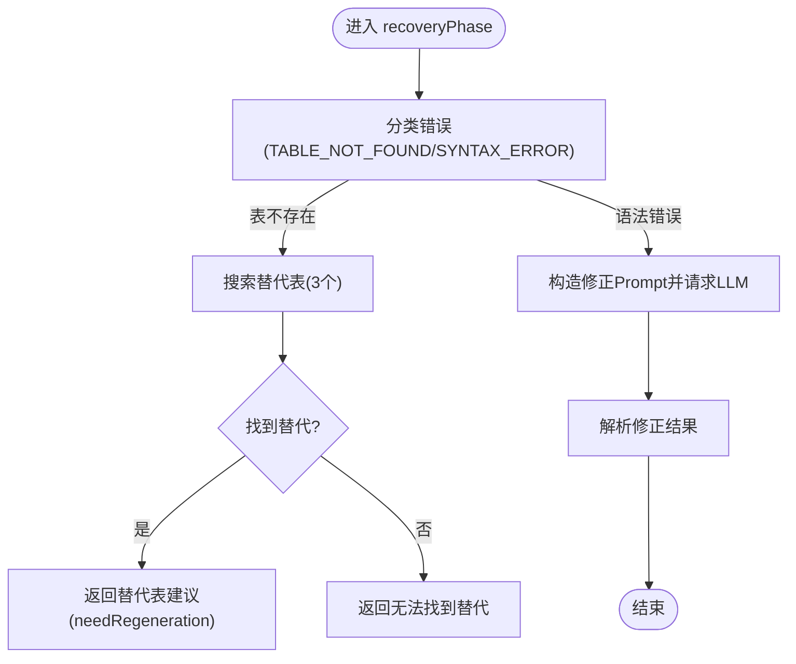
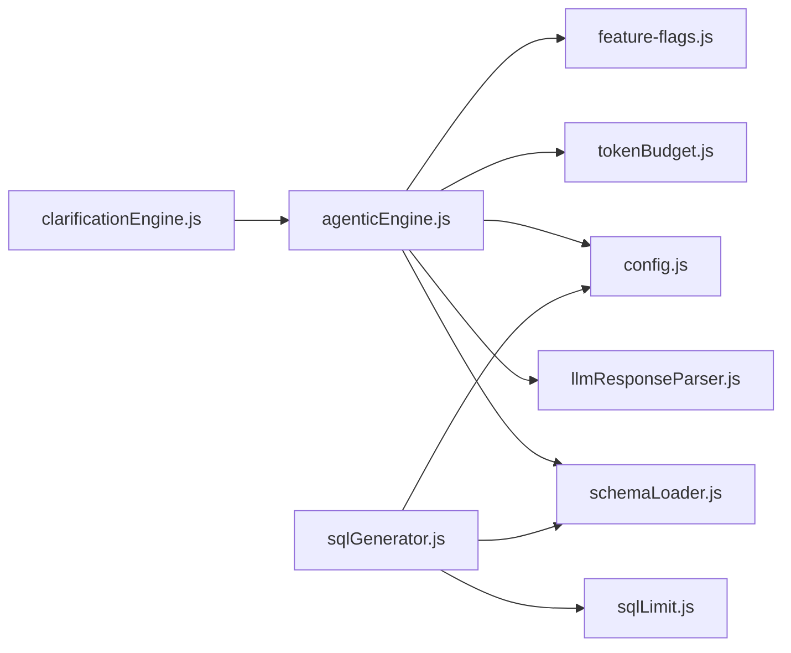

# 生成验证恢复阶段（Generation + Verification + Recovery）

<cite>
**本文引用的文件**
- [agenticEngine.js](file://backend/src/core/agenticEngine.js)
- [sqlGenerator.js](file://backend/src/core/sqlGenerator.js)
- [schemaLoader.js](file://backend/src/core/schemaLoader.js)
- [schemaTools.js](file://backend/src/core/schemaTools.js)
- [clarificationEngine.js](file://backend/src/core/clarificationEngine.js)
- [llmResponseParser.js](file://backend/src/utils/llmResponseParser.js)
- [tokenBudget.js](file://backend/src/utils/tokenBudget.js)
- [sqlLimit.js](file://backend/src/utils/sqlLimit.js)
- [config.js](file://backend/src/core/config.js)
- [feature-flags.js](file://backend/config/feature-flags.js)
- [schema-metadata.json](file://backend/config/schema-metadata.json)
- [business-semantic-layer.json](file://backend/config/business-semantic-layer.json)
</cite>

## 目录
1. [简介](#简介)
2. [项目结构](#项目结构)
3. [核心组件](#核心组件)
4. [架构总览](#架构总览)
5. [详细组件分析](#详细组件分析)
6. [依赖关系分析](#依赖关系分析)
7. [性能考量](#性能考量)
8. [故障排查指南](#故障排查指南)
9. [结论](#结论)
10. [附录](#附录)

## 简介
本技术文档聚焦于 NL2SQL 系统在 Phase 4（多步推理与自我修正）中的“生成 + 验证 + 恢复”三阶段工作流，围绕 agenticEngine.js 的 generationPhase、verificationPhase、recoveryPhase 展开，系统性阐述：
- 如何基于分解结果与 Schema 详情构建 SQL 生成提示词（含当前时间注入、对话历史裁剪、澄清记录合并、数据单元结构化）
- 验证阶段的多重检查机制（基本语法、禁止关键字、表存在性）
- 恢复阶段的错误分类与处理策略（表不存在的替代表推荐、语法错误的自动修正）
- 提供代码路径引用与可视化图示，帮助读者快速定位实现位置与调用关系

## 项目结构
本项目采用分层模块化设计，核心引擎位于 backend/src/core，工具与配置位于 backend/src/utils 与 backend/config。与本专题密切相关的模块包括：
- 核心引擎：agenticEngine.js、sqlGenerator.js、schemaLoader.js、schemaTools.js、clarificationEngine.js
- 工具库：llmResponseParser.js、tokenBudget.js、sqlLimit.js、config.js、feature-flags.js
- 配置：schema-metadata.json、business-semantic-layer.json

图表来源
- [agenticEngine.js:1-994](file://backend/src/core/agenticEngine.js#L1-L994)
- [sqlGenerator.js:1-485](file://backend/src/core/sqlGenerator.js#L1-L485)
- [schemaLoader.js:1-1261](file://backend/src/core/schemaLoader.js#L1-L1261)
- [schemaTools.js:1-632](file://backend/src/core/schemaTools.js#L1-L632)
- [clarificationEngine.js:1-559](file://backend/src/core/clarificationEngine.js#L1-L559)
- [llmResponseParser.js:1-146](file://backend/src/utils/llmResponseParser.js#L1-L146)
- [tokenBudget.js:1-435](file://backend/src/utils/tokenBudget.js#L1-L435)
- [sqlLimit.js:1-37](file://backend/src/utils/sqlLimit.js#L1-L37)
- [config.js:1-439](file://backend/src/core/config.js#L1-L439)
- [feature-flags.js:1-294](file://backend/config/feature-flags.js#L1-L294)
- [schema-metadata.json:1-200](file://backend/config/schema-metadata.json#L1-L200)
- [business-semantic-layer.json:1-189](file://backend/config/business-semantic-layer.json#L1-L189)

章节来源
- [agenticEngine.js:1-994](file://backend/src/core/agenticEngine.js#L1-L994)
- [sqlGenerator.js:1-485](file://backend/src/core/sqlGenerator.js#L1-L485)
- [schemaLoader.js:1-1261](file://backend/src/core/schemaLoader.js#L1-L1261)
- [schemaTools.js:1-632](file://backend/src/core/schemaTools.js#L1-L632)
- [clarificationEngine.js:1-559](file://backend/src/core/clarificationEngine.js#L1-L559)
- [llmResponseParser.js:1-146](file://backend/src/utils/llmResponseParser.js#L1-L146)
- [tokenBudget.js:1-435](file://backend/src/utils/tokenBudget.js#L1-L435)
- [sqlLimit.js:1-37](file://backend/src/utils/sqlLimit.js#L1-L37)
- [config.js:1-439](file://backend/src/core/config.js#L1-L439)
- [feature-flags.js:1-294](file://backend/config/feature-flags.js#L1-L294)
- [schema-metadata.json:1-200](file://backend/config/schema-metadata.json#L1-L200)
- [business-semantic-layer.json:1-189](file://backend/config/business-semantic-layer.json#L1-L189)

## 核心组件
- AgenticNL2SQLEngine：四阶段工作流的编排器，负责调用规划、Schema 发现、分解、澄清、生成、验证与恢复，并记录审计与追踪日志。
- SQL 生成器：基于意图与 Schema 详情生成 SQL，负责 LIMIT 强制注入与安全校验。
- Schema 加载器：提供表/字段元数据、表存在性校验、向量化检索与智能搜索。
- 澄清引擎：在置信度不足时触发澄清，生成友好问题并应用用户回答。
- LLM 响应解析器：统一解析 JSON 与 SQL，提升生成稳定性。
- Token 预算：控制上下文长度，避免 LLM 上下文溢出。
- 配置与功能开关：集中管理 LLM、数据库、安全、上下文与功能开关。

章节来源
- [agenticEngine.js:54-215](file://backend/src/core/agenticEngine.js#L54-L215)
- [sqlGenerator.js:84-479](file://backend/src/core/sqlGenerator.js#L84-L479)
- [schemaLoader.js:75-800](file://backend/src/core/schemaLoader.js#L75-L800)
- [clarificationEngine.js:196-272](file://backend/src/core/clarificationEngine.js#L196-L272)
- [llmResponseParser.js:24-146](file://backend/src/utils/llmResponseParser.js#L24-L146)
- [tokenBudget.js:115-181](file://backend/src/utils/tokenBudget.js#L115-L181)
- [config.js:20-439](file://backend/src/core/config.js#L20-L439)
- [feature-flags.js:16-294](file://backend/config/feature-flags.js#L16-L294)

## 架构总览
四阶段工作流（Agentic）从“规划 + 工具增强的 Schema 发现”到“动态意图拆解 + 澄清确认”，再到“生成 + 验证 + 恢复”。其中 Phase 4 的生成、验证与恢复形成闭环，确保在失败时能够自动修复或引导用户。

图表来源
- [agenticEngine.js:132-156](file://backend/src/core/agenticEngine.js#L132-L156)
- [agenticEngine.js:432-472](file://backend/src/core/agenticEngine.js#L432-L472)
- [agenticEngine.js:600-657](file://backend/src/core/agenticEngine.js#L600-L657)
- [agenticEngine.js:678-773](file://backend/src/core/agenticEngine.js#L678-L773)
- [sqlGenerator.js:84-479](file://backend/src/core/sqlGenerator.js#L84-L479)
- [schemaLoader.js:571-679](file://backend/src/core/schemaLoader.js#L571-L679)

## 详细组件分析

### 生成阶段（generationPhase）
- 表候选选择与回退：优先使用 queryDecomposer 的推荐表，若为空则回退到 schemaLoader 的搜索结果。
- Schema 详情获取：调用 schemaLoader.getLevel2Detail(compact=true) 获取结构化表定义。
- Prompt 构建：buildSQLPrompt 注入当前时间、最近对话历史、澄清记录、数据单元结构化，以及可用表结构。
- LLM 调用与解析：simpleChat 请求生成，parseSQLResponse 统一解析 JSON/SQL，失败时返回错误。
- 输出：包含 SQL、解释与所选表集合。

图表来源
- [agenticEngine.js:432-472](file://backend/src/core/agenticEngine.js#L432-L472)
- [agenticEngine.js:482-534](file://backend/src/core/agenticEngine.js#L482-L534)
- [agenticEngine.js:567-595](file://backend/src/core/agenticEngine.js#L567-L595)
- [schemaLoader.js:571-679](file://backend/src/core/schemaLoader.js#L571-L679)

章节来源
- [agenticEngine.js:432-472](file://backend/src/core/agenticEngine.js#L432-L472)
- [agenticEngine.js:482-534](file://backend/src/core/agenticEngine.js#L482-L534)
- [agenticEngine.js:567-595](file://backend/src/core/agenticEngine.js#L567-L595)
- [schemaLoader.js:571-679](file://backend/src/core/schemaLoader.js#L571-L679)

提示词构建要点（基于代码路径）
- 当前时间注入：[agenticEngine.js:487](file://backend/src/core/agenticEngine.js#L487)
- 对话历史裁剪：[tokenBudget.js:227-253](file://backend/src/utils/tokenBudget.js#L227-L253)
- 澄清记录合并：[agenticEngine.js:498-501](file://backend/src/core/agenticEngine.js#L498-L501)
- 数据单元结构化：[agenticEngine.js:503-505](file://backend/src/core/agenticEngine.js#L503-L505)
- 回退 Prompt（PROMPT_INJECT_NOW=false）：[agenticEngine.js:539-562](file://backend/src/core/agenticEngine.js#L539-L562)

SQL 解析逻辑（基于代码路径）
- 统一解析器：[llmResponseParser.js:24-146](file://backend/src/utils/llmResponseParser.js#L24-L146)
- 直接提取 SQL：[agenticEngine.js:579-588](file://backend/src/core/agenticEngine.js#L579-L588)

### 验证阶段（verificationPhase）
- 基本语法检查：要求包含 SELECT 与 FROM。
- 禁止关键字过滤：DROP/DELETE/UPDATE/INSERT/ALTER/TRUNCATE 等。
- 表存在性验证：从 SQL 中提取表名，调用 schemaLoader.tableExists 进行存在性检查。
- 错误汇总：将失败检查项汇总为可读错误信息。

图表来源
- [agenticEngine.js:600-657](file://backend/src/core/agenticEngine.js#L600-L657)
- [agenticEngine.js:662-665](file://backend/src/core/agenticEngine.js#L662-L665)
- [schemaLoader.js:75-800](file://backend/src/core/schemaLoader.js#L75-L800)

章节来源
- [agenticEngine.js:600-657](file://backend/src/core/agenticEngine.js#L600-L657)
- [agenticEngine.js:662-665](file://backend/src/core/agenticEngine.js#L662-L665)
- [schemaLoader.js:75-800](file://backend/src/core/schemaLoader.js#L75-L800)

### 恢复阶段（recoveryPhase）
- 错误分类：根据错误信息匹配“表不存在”或“语法错误”。
- 表不存在处理：从错误中提取缺失表名，调用 schemaLoader.searchRelevantTables 返回替代表，返回 needsRegeneration 与替代表列表。
- 语法错误处理：构造修正 Prompt，请求 LLM 生成修正后的 SQL，再次解析返回。

图表来源
- [agenticEngine.js:678-773](file://backend/src/core/agenticEngine.js#L678-L773)
- [agenticEngine.js:703-715](file://backend/src/core/agenticEngine.js#L703-L715)
- [agenticEngine.js:720-746](file://backend/src/core/agenticEngine.js#L720-L746)
- [agenticEngine.js:751-773](file://backend/src/core/agenticEngine.js#L751-L773)

章节来源
- [agenticEngine.js:678-773](file://backend/src/core/agenticEngine.js#L678-L773)
- [agenticEngine.js:703-715](file://backend/src/core/agenticEngine.js#L703-L715)
- [agenticEngine.js:720-746](file://backend/src/core/agenticEngine.js#L720-L746)
- [agenticEngine.js:751-773](file://backend/src/core/agenticEngine.js#L751-L773)

### 与 SQL 生成器的关系
- sqlGenerator.js 负责在 Phase 2/3 中的 SQL 生成，强调“业务语义层 + 表候选统一打分 + LIMIT 强制注入 + 安全校验”。
- agenticEngine.js 的 generationPhase 更关注“提示词构建与解析”，并在验证/恢复阶段提供更强的错误分类与自动修复能力。

章节来源
- [sqlGenerator.js:84-479](file://backend/src/core/sqlGenerator.js#L84-L479)
- [agenticEngine.js:432-472](file://backend/src/core/agenticEngine.js#L432-L472)

## 依赖关系分析
- Agentic 引擎依赖 schemaLoader 进行表存在性与结构查询；依赖 llmResponseParser 统一解析；依赖 tokenBudget 控制上下文长度；依赖 config/feature-flags 控制行为。
- SQL 生成器依赖 schemaLoader 的表/字段元数据与向量化检索，依赖 sqlLimit 强制注入 LIMIT，依赖 config 的安全阈值。
- 澄清引擎与 Agentic 引擎协同，先触发澄清，再在恢复阶段将澄清结果回写到分解结果中，形成闭环。

图表来源
- [agenticEngine.js:19-31](file://backend/src/core/agenticEngine.js#L19-L31)
- [sqlGenerator.js:15-24](file://backend/src/core/sqlGenerator.js#L15-L24)
- [schemaLoader.js:15-27](file://backend/src/core/schemaLoader.js#L15-L27)
- [llmResponseParser.js:9](file://backend/src/utils/llmResponseParser.js#L9)
- [tokenBudget.js:12-14](file://backend/src/utils/tokenBudget.js#L12-L14)
- [sqlLimit.js:12-14](file://backend/src/utils/sqlLimit.js#L12-L14)
- [config.js:12-20](file://backend/src/core/config.js#L12-L20)
- [feature-flags.js:16-166](file://backend/config/feature-flags.js#L16-L166)
- [clarificationEngine.js:14](file://backend/src/core/clarificationEngine.js#L14)

章节来源
- [agenticEngine.js:19-31](file://backend/src/core/agenticEngine.js#L19-L31)
- [sqlGenerator.js:15-24](file://backend/src/core/sqlGenerator.js#L15-L24)
- [schemaLoader.js:15-27](file://backend/src/core/schemaLoader.js#L15-L27)
- [llmResponseParser.js:9](file://backend/src/utils/llmResponseParser.js#L9)
- [tokenBudget.js:12-14](file://backend/src/utils/tokenBudget.js#L12-L14)
- [sqlLimit.js:12-14](file://backend/src/utils/sqlLimit.js#L12-L14)
- [config.js:12-20](file://backend/src/core/config.js#L12-L20)
- [feature-flags.js:16-166](file://backend/config/feature-flags.js#L16-L166)
- [clarificationEngine.js:14](file://backend/src/core/clarificationEngine.js#L14)

## 性能考量
- 上下文预算控制：tokenBudget 估算与裁剪历史，避免 LLM 上下文溢出，保障稳定性。
- LIMIT 强制注入：sqlLimit 确保 SQL 带 LIMIT，避免超大数据集返回。
- 向量化检索：schemaLoader 的向量化表级表征与智能搜索，提升表候选质量与速度。
- 配置化阈值：config 中的安全阈值、超时与行数限制，统一收敛风险面。

章节来源
- [tokenBudget.js:115-181](file://backend/src/utils/tokenBudget.js#L115-L181)
- [tokenBudget.js:227-253](file://backend/src/utils/tokenBudget.js#L227-L253)
- [sqlLimit.js:16-34](file://backend/src/utils/sqlLimit.js#L16-L34)
- [schemaLoader.js:210-285](file://backend/src/core/schemaLoader.js#L210-L285)
- [config.js:153-211](file://backend/src/core/config.js#L153-L211)

## 故障排查指南
- 生成失败：检查 generationPhase 的错误返回与 parseSQLResponse 的解析策略。
- 验证失败：核对 verificationPhase 的三项检查（语法、关键字、表存在），查看汇总错误信息。
- 恢复失败：确认错误分类是否命中（表不存在/语法错误），检查替代表搜索与修正 Prompt。
- 审计与追踪：Agentic 引擎在成功路径写入 query_history，便于事后审计。

章节来源
- [agenticEngine.js:466-471](file://backend/src/core/agenticEngine.js#L466-L471)
- [agenticEngine.js:600-657](file://backend/src/core/agenticEngine.js#L600-L657)
- [agenticEngine.js:678-773](file://backend/src/core/agenticEngine.js#L678-L773)
- [agenticEngine.js:173-200](file://backend/src/core/agenticEngine.js#L173-L200)

## 结论
本文系统梳理了 NL2SQL 在 Phase 4 的“生成 + 验证 + 恢复”工作流，重点解析了 agenticEngine.js 的三阶段实现与关键提示词构建策略，明确了验证与恢复的分类与处理机制。通过统一的解析器、预算控制与安全阈值，系统在保证稳健性的同时提升了自动化修复能力。建议在生产环境中结合 feature-flags 与 config 进行精细化开关与阈值调整，持续优化用户体验与系统稳定性。

## 附录
- 代码路径示例（仅列出路径，不展示具体代码内容）
  - 生成阶段入口与提示词构建：[agenticEngine.js:432-534](file://backend/src/core/agenticEngine.js#L432-L534)
  - SQL 解析与回退策略：[agenticEngine.js:567-595](file://backend/src/core/agenticEngine.js#L567-L595)
  - 验证阶段三重检查：[agenticEngine.js:600-657](file://backend/src/core/agenticEngine.js#L600-L657)
  - 恢复阶段错误分类与处理：[agenticEngine.js:678-773](file://backend/src/core/agenticEngine.js#L678-L773)
  - 表存在性校验与回退：[schemaLoader.js:571-679](file://backend/src/core/schemaLoader.js#L571-L679)
  - 统一响应解析器：[llmResponseParser.js:24-146](file://backend/src/utils/llmResponseParser.js#L24-L146)
  - 上下文裁剪与预算控制：[tokenBudget.js:227-253](file://backend/src/utils/tokenBudget.js#L227-L253)
  - LIMIT 强制注入：[sqlLimit.js:22-34](file://backend/src/utils/sqlLimit.js#L22-L34)
  - 安全配置与阈值：[config.js:153-211](file://backend/src/core/config.js#L153-L211)
  - 功能开关与启用阶段：[feature-flags.js:16-294](file://backend/config/feature-flags.js#L16-L294)
  - Schema 元数据与业务语义层：[schema-metadata.json:1-200](file://backend/config/schema-metadata.json#L1-L200), [business-semantic-layer.json:1-189](file://backend/config/business-semantic-layer.json#L1-L189)