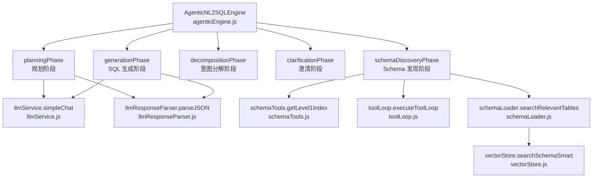
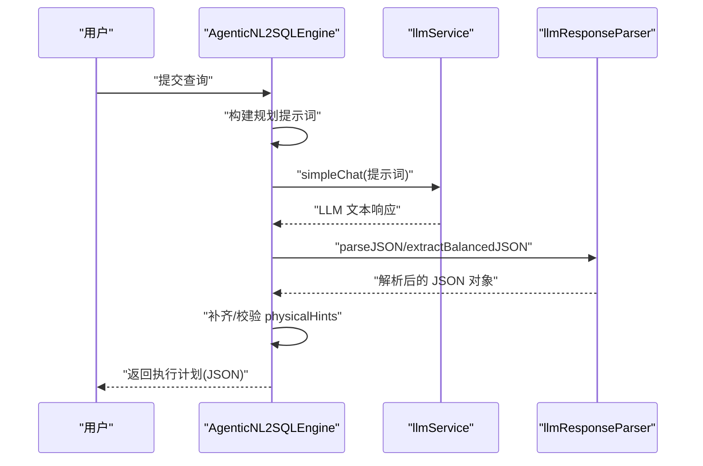
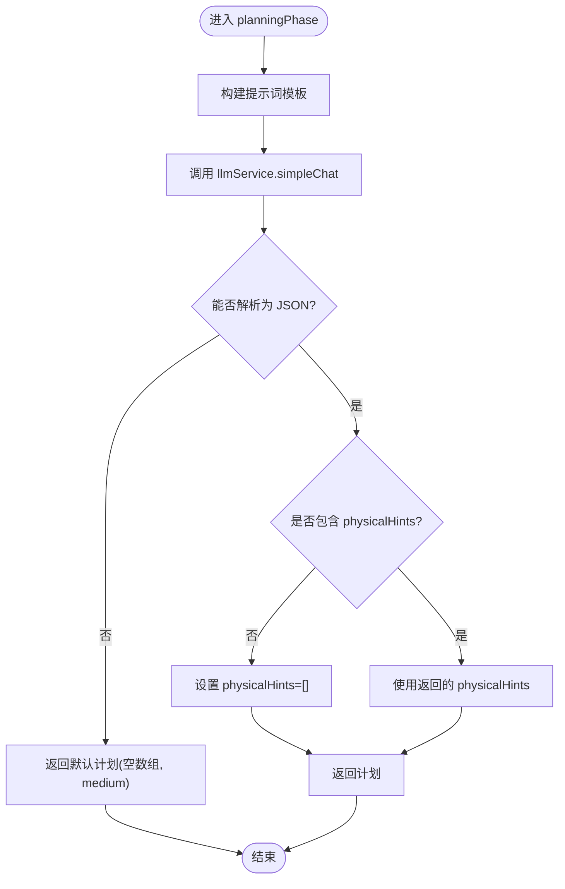
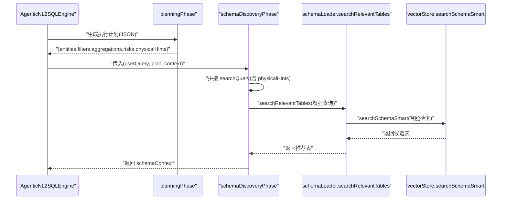
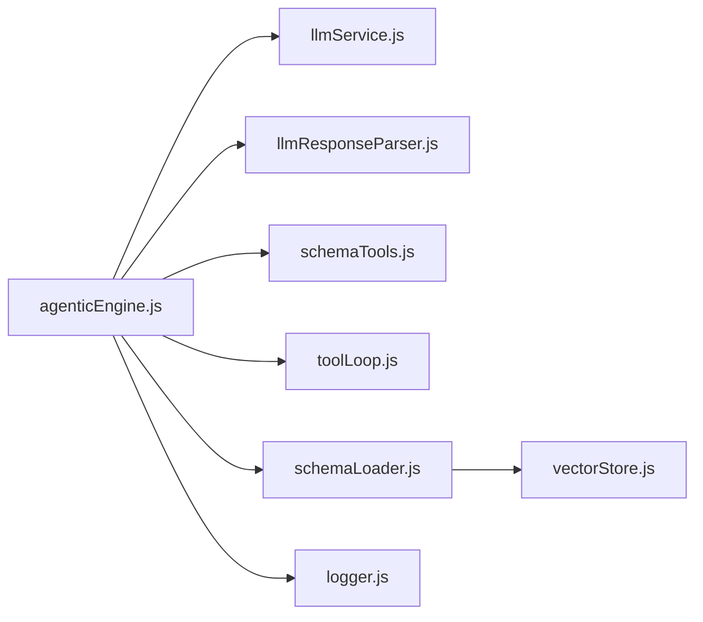

# 规划阶段（Planning）

<cite>
**本文引用的文件**
- [agenticEngine.js](file://backend/src/core/agenticEngine.js)
- [llmService.js](file://backend/src/core/llmService.js)
- [llmResponseParser.js](file://backend/src/utils/llmResponseParser.js)
- [schemaTools.js](file://backend/src/core/schemaTools.js)
- [schemaLoader.js](file://backend/src/core/schemaLoader.js)
- [vectorStore.js](file://backend/src/memory/vectorStore.js)
- [logger.js](file://backend/src/utils/logger.js)
- [toolLoop.js](file://backend/src/core/toolLoop.js)
- [schema-discovery-searchquery.test.js](file://backend/test/phase3/schema-discovery-searchquery.test.js)
</cite>

## 目录
1. [简介](#简介)
2. [项目结构](#项目结构)
3. [核心组件](#核心组件)
4. [架构总览](#架构总览)
5. [详细组件分析](#详细组件分析)
6. [依赖关系分析](#依赖关系分析)
7. [性能考量](#性能考量)
8. [故障排查指南](#故障排查指南)
9. [结论](#结论)

## 简介
本文件聚焦于 NL2SQL 四阶段工作流中的“规划阶段（Planning）”，系统性解析 agenticEngine.js 中的 planningPhase 函数实现，涵盖以下要点：
- 用户查询接收与提示词模板设计
- LLM 服务调用与 JSON 结果解析
- 执行计划制定（实体、筛选、聚合、风险）
- 物理字段识别与 physicalHints 机制
- 与向量检索阶段的衔接与信息保留策略
- 错误处理与兜底策略

## 项目结构
规划阶段位于后端核心模块 backend/src/core 下，主要涉及以下文件：
- agenticEngine.js：四阶段引擎入口与各阶段实现
- llmService.js：LLM 通信与重试机制
- llmResponseParser.js：统一 JSON/SQL 解析器
- schemaTools.js：Schema 探索工具与 Level 1 索引
- schemaLoader.js：Schema 加载与向量检索
- vectorStore.js：LanceDB 向量存储与智能检索
- logger.js：统一日志记录
- toolLoop.js：工具循环（Schema 探索）
- schema-discovery-searchquery.test.js：验证 physicalHints 与 searchQuery 组装的测试

图表来源
- [agenticEngine.js:228-278](file://backend/src/core/agenticEngine.js#L228-L278)
- [agenticEngine.js:287-349](file://backend/src/core/agenticEngine.js#L287-L349)
- [agenticEngine.js:432-472](file://backend/src/core/agenticEngine.js#L432-L472)
- [llmService.js:332-370](file://backend/src/core/llmService.js#L332-L370)
- [llmResponseParser.js:24-59](file://backend/src/utils/llmResponseParser.js#L24-L59)
- [schemaTools.js:136-173](file://backend/src/core/schemaTools.js#L136-L173)
- [toolLoop.js:75-203](file://backend/src/core/toolLoop.js#L75-L203)
- [schemaLoader.js:571-679](file://backend/src/core/schemaLoader.js#L571-L679)
- [vectorStore.js:454-578](file://backend/src/memory/vectorStore.js#L454-L578)

章节来源
- [agenticEngine.js:228-278](file://backend/src/core/agenticEngine.js#L228-L278)
- [agenticEngine.js:287-349](file://backend/src/core/agenticEngine.js#L287-L349)
- [agenticEngine.js:432-472](file://backend/src/core/agenticEngine.js#L432-L472)

## 核心组件
- 规划阶段（planningPhase）：接收用户查询，构造提示词，调用 LLM 生成 JSON 执行计划；包含 physicalHints 字段收集与兜底。
- Schema 发现阶段（schemaDiscoveryPhase）：基于规划结果与环境开关，拼接 searchQuery，驱动向量检索或工具循环。
- LLM 服务（llmService）：提供 simpleChat 与 chat，封装 HTTP 请求、重试与日志。
- 统一响应解析（llmResponseParser）：从 LLM 文本中提取 JSON/SQL，提供稳健解析策略。
- Schema 工具（schemaTools）：提供 Level 1 索引与工具定义，支撑工具循环。
- 向量检索（vectorStore）：智能搜索与表级表征，支持平台/游戏域与数据源类型过滤。
- 日志（logger）：统一日志记录，便于追踪与排障。

章节来源
- [agenticEngine.js:228-278](file://backend/src/core/agenticEngine.js#L228-L278)
- [agenticEngine.js:287-349](file://backend/src/core/agenticEngine.js#L287-L349)
- [llmService.js:332-370](file://backend/src/core/llmService.js#L332-L370)
- [llmResponseParser.js:24-59](file://backend/src/utils/llmResponseParser.js#L24-L59)
- [schemaTools.js:136-173](file://backend/src/core/schemaTools.js#L136-L173)
- [vectorStore.js:454-578](file://backend/src/memory/vectorStore.js#L454-L578)

## 架构总览
规划阶段是四阶段工作流的第一步，其目标是：
- 从自然语言查询中抽取“需要查询的数据实体”、“筛选条件”、“聚合/计算”、“潜在风险点”
- 识别“物理字段/编码”（如 typeid、int_keyN、game_id 等），形成 physicalHints
- 以 JSON 形式输出，供后续 Schema 发现与 SQL 生成阶段使用

图表来源
- [agenticEngine.js:228-278](file://backend/src/core/agenticEngine.js#L228-L278)
- [llmService.js:332-370](file://backend/src/core/llmService.js#L332-L370)
- [llmResponseParser.js:24-59](file://backend/src/utils/llmResponseParser.js#L24-L59)

## 详细组件分析

### 规划阶段（planningPhase）实现
- 输入：用户查询、上下文
- 输出：JSON 执行计划（entities/filters/aggregations/risks/physicalHints/estimatedComplexity）
- 关键点：
  - 提示词模板包含五项要求：实体、筛选、聚合、风险、物理字段/编码
  - LLM 返回 JSON，采用“提取最外层花括号”的稳健策略
  - 若 LLM 未返回 physicalHints，则兜底为空数组，保证下游健壮性
  - 解析失败时返回默认计划（空数组 + medium 复杂度）

图表来源
- [agenticEngine.js:228-278](file://backend/src/core/agenticEngine.js#L228-L278)

章节来源
- [agenticEngine.js:228-278](file://backend/src/core/agenticEngine.js#L228-L278)

### physicalHints 字段与实现原理
- 目标：在向量检索阶段保留“物理字段/编码”信息，避免 typeid、int_keyN、game_id 等 token 在检索时丢失
- 机制：
  - 规划阶段显式要求 LLM 输出 physicalHints
  - Schema 发现阶段根据开关 SCHEMA_SEARCH_INCLUDE_RAW 组装 searchQuery，将 userQuery + entities + filters + aggregations + physicalHints 拼接
  - 向量检索使用增强后的 searchQuery，提升检索精度
- 兜底策略：若 LLM 未返回 physicalHints，引擎将其置为空数组，保证下游逻辑稳定

图表来源
- [agenticEngine.js:287-349](file://backend/src/core/agenticEngine.js#L287-L349)
- [schemaLoader.js:571-679](file://backend/src/core/schemaLoader.js#L571-L679)
- [vectorStore.js:454-578](file://backend/src/memory/vectorStore.js#L454-L578)

章节来源
- [agenticEngine.js:287-349](file://backend/src/core/agenticEngine.js#L287-L349)
- [schemaLoader.js:571-679](file://backend/src/core/schemaLoader.js#L571-L679)
- [vectorStore.js:454-578](file://backend/src/memory/vectorStore.js#L454-L578)
- [schema-discovery-searchquery.test.js:52-106](file://backend/test/phase3/schema-discovery-searchquery.test.js#L52-L106)

### Schema 发现阶段（schemaDiscoveryPhase）与检索增强
- 功能：
  - 根据开关 SCHEMA_SEARCH_INCLUDE_RAW 决定是否将 userQuery、filters、aggregations、physicalHints 合入 searchQuery
  - 若开启工具循环（TOOL_LOOP_MODE），调用 toolLoop.executeToolLoop 进行工具探索
  - 生成 Level 1 索引，用于后续检索
- 兼容性：
  - 支持老签名 schemaDiscoveryPhase(plan, context)，当第一个参数为对象时自动降级
- 错误处理：
  - 若工具循环未启用，返回 toolExploration=null

章节来源
- [agenticEngine.js:287-349](file://backend/src/core/agenticEngine.js#L287-L349)
- [toolLoop.js:75-203](file://backend/src/core/toolLoop.js#L75-L203)
- [schemaTools.js:136-173](file://backend/src/core/schemaTools.js#L136-L173)

### LLM 服务与响应解析
- llmService.simpleChat：发送单轮提示词，返回 LLM 文本
- llmResponseParser.parseJSON：提供三种解析策略（直接解析、代码块提取、花括号提取），提升鲁棒性
- 规划阶段使用 parseJSON 提取 JSON，若失败则返回默认计划

章节来源
- [llmService.js:332-370](file://backend/src/core/llmService.js#L332-L370)
- [llmResponseParser.js:24-59](file://backend/src/utils/llmResponseParser.js#L24-L59)
- [agenticEngine.js:228-278](file://backend/src/core/agenticEngine.js#L228-L278)

### SQL 生成阶段（与规划阶段衔接）
- 规划阶段完成后，进入分解、澄清、生成、验证、恢复阶段
- 生成阶段会将规划阶段的 entities/filters/aggregations/physicalHints 等信息注入 SQL Prompt，确保生成的 SQL 保留物理约束

章节来源
- [agenticEngine.js:432-472](file://backend/src/core/agenticEngine.js#L432-L472)

## 依赖关系分析
- planningPhase 依赖 llmService.simpleChat 与 llmResponseParser.parseJSON
- schemaDiscoveryPhase 依赖 schemaTools.getLevel1Index、toolLoop.executeToolLoop 与 schemaLoader.searchRelevantTables
- schemaLoader.searchRelevantTables 依赖 vectorStore.searchSchemaSmart 进行智能检索
- logger 用于全流程日志记录

图表来源
- [agenticEngine.js:228-278](file://backend/src/core/agenticEngine.js#L228-L278)
- [agenticEngine.js:287-349](file://backend/src/core/agenticEngine.js#L287-L349)
- [agenticEngine.js:432-472](file://backend/src/core/agenticEngine.js#L432-L472)
- [llmService.js:332-370](file://backend/src/core/llmService.js#L332-L370)
- [llmResponseParser.js:24-59](file://backend/src/utils/llmResponseParser.js#L24-L59)
- [schemaTools.js:136-173](file://backend/src/core/schemaTools.js#L136-L173)
- [toolLoop.js:75-203](file://backend/src/core/toolLoop.js#L75-L203)
- [schemaLoader.js:571-679](file://backend/src/core/schemaLoader.js#L571-L679)
- [vectorStore.js:454-578](file://backend/src/memory/vectorStore.js#L454-L578)
- [logger.js:276-322](file://backend/src/utils/logger.js#L276-L322)

章节来源
- [agenticEngine.js:228-278](file://backend/src/core/agenticEngine.js#L228-L278)
- [agenticEngine.js:287-349](file://backend/src/core/agenticEngine.js#L287-L349)
- [agenticEngine.js:432-472](file://backend/src/core/agenticEngine.js#L432-L472)

## 性能考量
- 规划阶段 JSON 解析采用稳健策略，减少解析失败导致的重试成本
- 向量检索使用智能搜索与域/数据源过滤，降低无关表干扰
- 工具循环最大迭代次数与超时控制，避免长时间阻塞
- 日志级别与追踪机制，便于定位性能瓶颈

## 故障排查指南
- 规划阶段解析失败
  - 现象：返回默认计划（空数组 + medium）
  - 排查：检查 LLM 返回内容是否包含 JSON；确认提示词模板是否被正确注入
  - 参考
    - [agenticEngine.js:228-278](file://backend/src/core/agenticEngine.js#L228-L278)
    - [llmResponseParser.js:24-59](file://backend/src/utils/llmResponseParser.js#L24-L59)
- physicalHints 丢失
  - 现象：向量检索召回不准确
  - 排查：确认 SCHEMA_SEARCH_INCLUDE_RAW 是否为 false；检查测试用例对 searchQuery 的断言
  - 参考
    - [agenticEngine.js:287-349](file://backend/src/core/agenticEngine.js#L287-L349)
    - [schema-discovery-searchquery.test.js:52-106](file://backend/test/phase3/schema-discovery-searchquery.test.js#L52-L106)
- 工具循环未执行
  - 现象：schemaDiscoveryPhase 返回 toolExploration=null
  - 排查：确认 TOOL_LOOP_MODE 是否开启；feature-flags 缓存是否生效
  - 参考
    - [agenticEngine.js:287-349](file://backend/src/core/agenticEngine.js#L287-L349)
    - [toolLoop.js:75-203](file://backend/src/core/toolLoop.js#L75-L203)

章节来源
- [agenticEngine.js:228-278](file://backend/src/core/agenticEngine.js#L228-L278)
- [agenticEngine.js:287-349](file://backend/src/core/agenticEngine.js#L287-L349)
- [llmResponseParser.js:24-59](file://backend/src/utils/llmResponseParser.js#L24-L59)
- [schema-discovery-searchquery.test.js:52-106](file://backend/test/phase3/schema-discovery-searchquery.test.js#L52-L106)
- [toolLoop.js:75-203](file://backend/src/core/toolLoop.js#L75-L203)

## 结论
规划阶段通过稳健的提示词设计与 JSON 解析策略，实现了对用户查询的结构化理解，并引入 physicalHints 机制，确保物理字段/编码在后续向量检索中得到保留。配合智能检索与工具循环，规划阶段为后续各阶段提供了高质量的执行计划与上下文信息，显著提升了 NL2SQL 的准确性与鲁棒性。