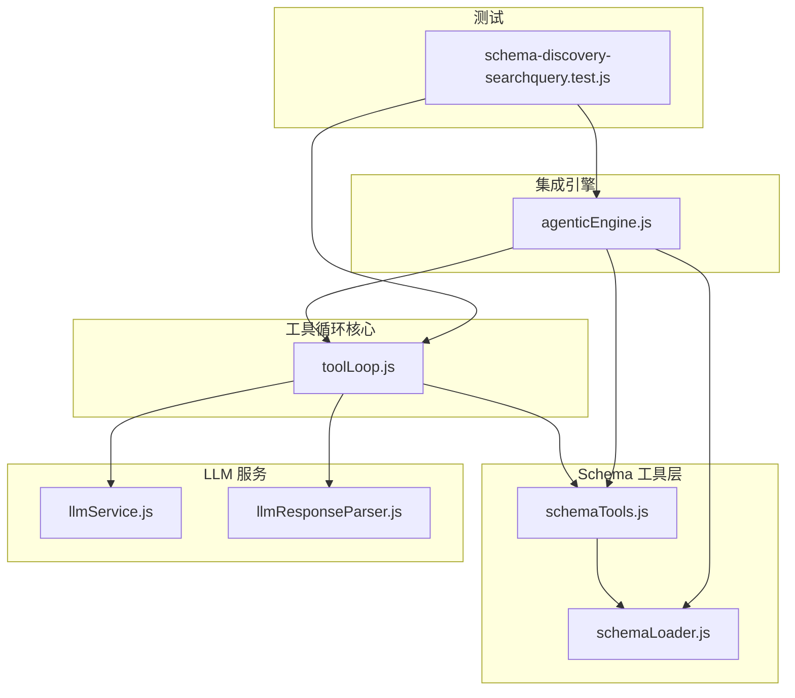
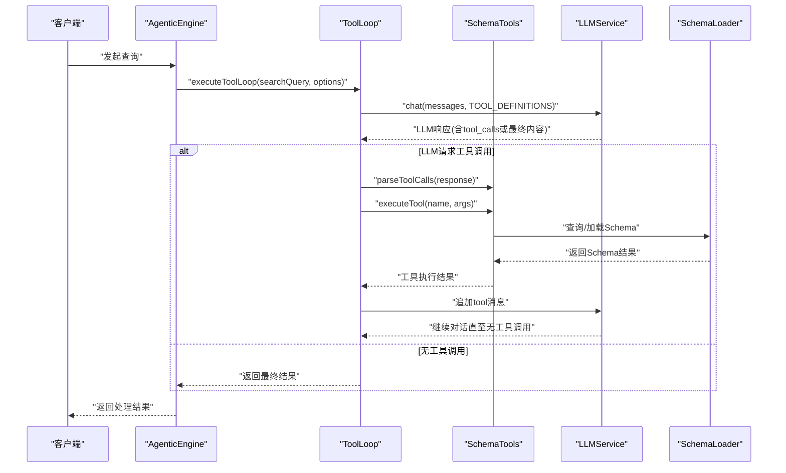
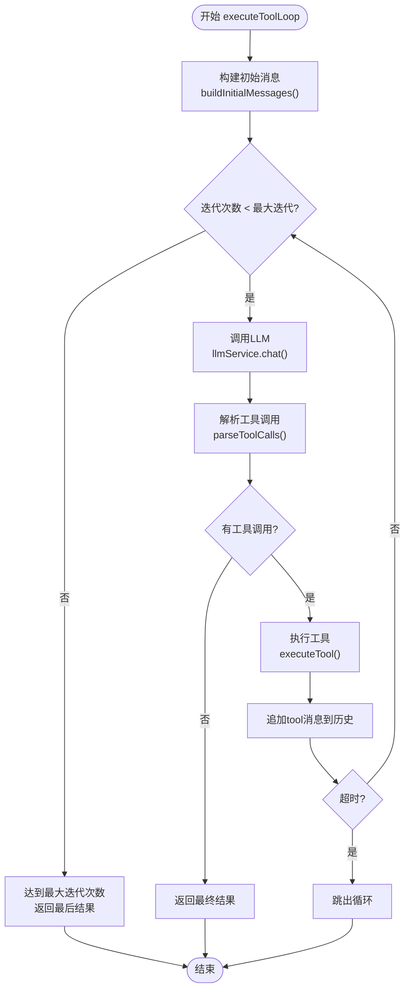
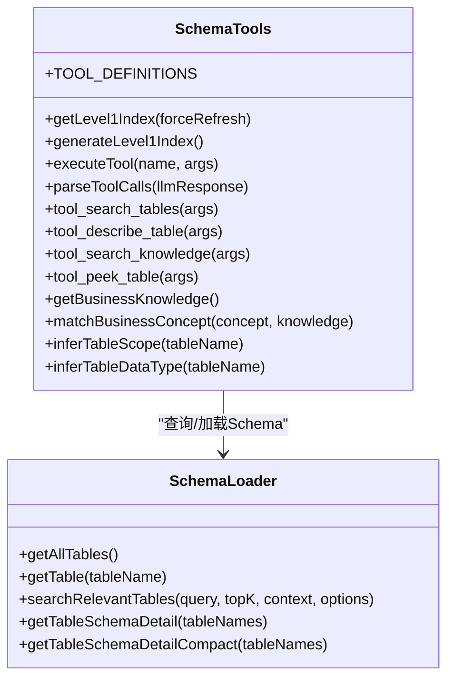
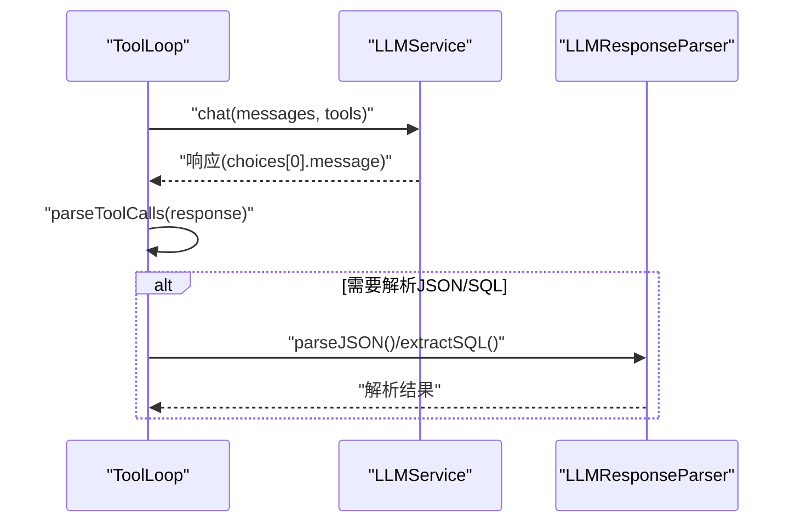
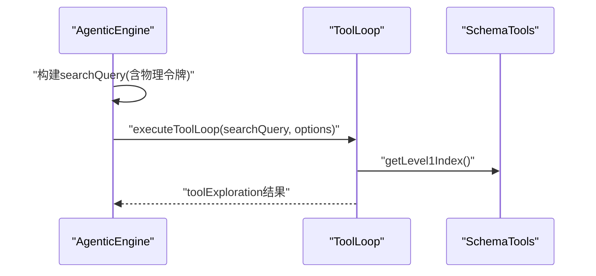
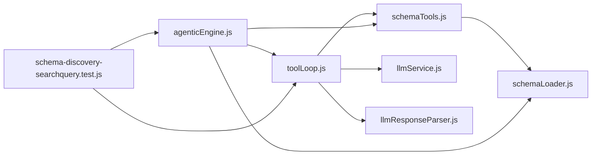

# 工具循环机制

<cite>
**本文引用的文件**
- [toolLoop.js](file://backend/src/core/toolLoop.js)
- [schemaTools.js](file://backend/src/core/schemaTools.js)
- [schemaLoader.js](file://backend/src/core/schemaLoader.js)
- [llmService.js](file://backend/src/core/llmService.js)
- [llmResponseParser.js](file://backend/src/utils/llmResponseParser.js)
- [agenticEngine.js](file://backend/src/core/agenticEngine.js)
- [schema-discovery-searchquery.test.js](file://backend/test/phase3/schema-discovery-searchquery.test.js)
</cite>

## 目录
1. [简介](#简介)
2. [项目结构](#项目结构)
3. [核心组件](#核心组件)
4. [架构总览](#架构总览)
5. [详细组件分析](#详细组件分析)
6. [依赖关系分析](#依赖关系分析)
7. [性能考量](#性能考量)
8. [故障排查指南](#故障排查指南)
9. [结论](#结论)
10. [附录](#附录)

## 简介
本文件系统性阐述工具循环机制（Tool Loop）在 NL2SQL 系统中的设计与实现，重点围绕 toolLoop.js 如何驱动 LLM 主动探索 Schema 的工具调用循环，涵盖工具定义、循环控制、状态管理、错误处理、与 Schema 发现阶段的集成方式，以及如何通过工具循环提升查询理解与 Schema 探索的准确性。文档同时提供序列图、类图与流程图，帮助开发者快速理解与扩展工具循环能力。

## 项目结构
工具循环机制主要分布在以下模块：
- 工具循环核心：toolLoop.js
- Schema 工具层：schemaTools.js
- LLM 服务：llmService.js
- LLM 响应解析：llmResponseParser.js
- Schema 加载与检索：schemaLoader.js
- 集成引擎：agenticEngine.js
- 测试用例：schema-discovery-searchquery.test.js

图表来源
- [toolLoop.js:1-539](file://backend/src/core/toolLoop.js#L1-L539)
- [schemaTools.js:1-632](file://backend/src/core/schemaTools.js#L1-L632)
- [schemaLoader.js:1-800](file://backend/src/core/schemaLoader.js#L1-L800)
- [llmService.js:1-491](file://backend/src/core/llmService.js#L1-L491)
- [llmResponseParser.js:1-146](file://backend/src/utils/llmResponseParser.js#L1-L146)
- [agenticEngine.js:1-994](file://backend/src/core/agenticEngine.js#L1-L994)
- [schema-discovery-searchquery.test.js:1-178](file://backend/test/phase3/schema-discovery-searchquery.test.js#L1-L178)

章节来源
- [toolLoop.js:1-539](file://backend/src/core/toolLoop.js#L1-L539)
- [schemaTools.js:1-632](file://backend/src/core/schemaTools.js#L1-L632)
- [schemaLoader.js:1-800](file://backend/src/core/schemaLoader.js#L1-L800)
- [llmService.js:1-491](file://backend/src/core/llmService.js#L1-L491)
- [llmResponseParser.js:1-146](file://backend/src/utils/llmResponseParser.js#L1-L146)
- [agenticEngine.js:1-994](file://backend/src/core/agenticEngine.js#L1-L994)
- [schema-discovery-searchquery.test.js:1-178](file://backend/test/phase3/schema-discovery-searchquery.test.js#L1-L178)

## 核心组件
- 工具循环处理器（executeToolLoop）：实现 LLM 工具调用循环，构建初始 Prompt、调用 LLM、解析工具调用、执行工具、记录日志与超时控制。
- Schema 工具层（schemaTools）：定义工具清单（TOOL_DEFINITIONS）、实现工具执行（search_tables/describe_table/search_knowledge/peek_table）、解析 LLM 工具调用请求、管理 Level 1 索引缓存。
- LLM 服务（llmService）：封装 HTTP 请求、重试机制、流式响应、工具调用支持。
- LLM 响应解析（llmResponseParser）：统一从 LLM 文本中提取 JSON 与 SQL 的解析器。
- 集成引擎（agenticEngine）：在四阶段工作流中调用工具循环进行 Schema 发现，并与澄清、生成、验证、恢复阶段衔接。

章节来源
- [toolLoop.js:59-203](file://backend/src/core/toolLoop.js#L59-L203)
- [schemaTools.js:40-124](file://backend/src/core/schemaTools.js#L40-L124)
- [schemaTools.js:565-602](file://backend/src/core/schemaTools.js#L565-L602)
- [llmService.js:224-322](file://backend/src/core/llmService.js#L224-L322)
- [llmResponseParser.js:24-59](file://backend/src/utils/llmResponseParser.js#L24-L59)
- [agenticEngine.js:332-349](file://backend/src/core/agenticEngine.js#L332-L349)

## 架构总览
工具循环在系统中的位置与交互如下：

图表来源
- [agenticEngine.js:332-349](file://backend/src/core/agenticEngine.js#L332-L349)
- [toolLoop.js:104-133](file://backend/src/core/toolLoop.js#L104-L133)
- [schemaTools.js:585-602](file://backend/src/core/schemaTools.js#L585-L602)
- [schemaTools.js:565-577](file://backend/src/core/schemaTools.js#L565-L577)
- [schemaLoader.js:571-679](file://backend/src/core/schemaLoader.js#L571-L679)

## 详细组件分析

### 工具循环处理器（toolLoop.js）
- 核心职责
  - 构建初始消息（系统提示词 + 历史 + 当前查询）
  - 调用 LLM 并解析工具调用
  - 执行工具并记录调用日志
  - 控制最大迭代次数与超时
  - 返回最终结果与统计信息
- 关键配置
  - MAX_TOOL_ITERATIONS：最大迭代次数（防无限循环）
  - TOOL_LOOP_TIMEOUT：循环超时时间
- 状态管理
  - messages：消息历史（system/user/assistant/tool）
  - toolCallLog：记录每次工具调用（迭代、id、name、args、result）
  - iteration：当前迭代次数
  - lastResponse：最后一次 LLM 响应
- 错误处理
  - 捕获异常并返回结构化错误对象
  - 记录工具调用日志与耗时
- 输出格式
  - success：是否成功
  - content：LLM 最终内容
  - iterations：迭代次数
  - toolCalls：工具调用日志
  - duration：总耗时
  - warning：达到最大迭代次数的警告

图表来源
- [toolLoop.js:75-203](file://backend/src/core/toolLoop.js#L75-L203)
- [toolLoop.js:104-177](file://backend/src/core/toolLoop.js#L104-L177)
- [toolLoop.js:116-133](file://backend/src/core/toolLoop.js#L116-L133)

章节来源
- [toolLoop.js:59-203](file://backend/src/core/toolLoop.js#L59-L203)
- [toolLoop.js:213-242](file://backend/src/core/toolLoop.js#L213-L242)
- [toolLoop.js:250-311](file://backend/src/core/toolLoop.js#L250-L311)

### Schema 工具层（schemaTools.js）
- 工具定义（TOOL_DEFINITIONS）
  - search_tables：按关键词搜索相关表
  - describe_table：获取表的详细字段信息
  - search_knowledge：查询业务概念映射
  - peek_table：查看表结构预览（安全考虑不返回实际数据）
- 工具实现
  - tool_search_tables：调用 schemaLoader.searchRelevantTables
  - tool_describe_table：获取表定义与结构详情
  - tool_search_knowledge：匹配业务概念并返回映射
  - tool_peek_table：返回字段结构预览
- 工具调度与解析
  - executeTool：根据工具名分发到具体实现
  - parseToolCalls：解析 LLM 响应中的工具调用
- Level 1 索引
  - getLevel1Index：带缓存的表级索引（描述、域标签、数据类型）
  - inferTableScope/inferTableDataType：推断表域与数据类型

图表来源
- [schemaTools.js:40-124](file://backend/src/core/schemaTools.js#L40-L124)
- [schemaTools.js:565-602](file://backend/src/core/schemaTools.js#L565-L602)
- [schemaTools.js:225-393](file://backend/src/core/schemaTools.js#L225-L393)
- [schemaLoader.js:441-473](file://backend/src/core/schemaLoader.js#L441-L473)
- [schemaLoader.js:571-679](file://backend/src/core/schemaLoader.js#L571-L679)

章节来源
- [schemaTools.js:40-124](file://backend/src/core/schemaTools.js#L40-L124)
- [schemaTools.js:225-393](file://backend/src/core/schemaTools.js#L225-L393)
- [schemaTools.js:565-602](file://backend/src/core/schemaTools.js#L565-L602)
- [schemaLoader.js:571-679](file://backend/src/core/schemaLoader.js#L571-L679)

### LLM 服务与响应解析
- LLM 服务（llmService.js）
  - chat：支持工具定义、流式响应、重试与超时
  - simpleChat：单轮对话封装
  - getEmbedding：获取向量
- 响应解析（llmResponseParser.js）
  - parseJSON：三种策略提取 JSON
  - extractSQL：从响应中提取 SQL

图表来源
- [llmService.js:224-322](file://backend/src/core/llmService.js#L224-L322)
- [llmResponseParser.js:24-59](file://backend/src/utils/llmResponseParser.js#L24-L59)
- [toolLoop.js:116-116](file://backend/src/core/toolLoop.js#L116-L116)

章节来源
- [llmService.js:224-322](file://backend/src/core/llmService.js#L224-L322)
- [llmResponseParser.js:24-59](file://backend/src/utils/llmResponseParser.js#L24-L59)

### 与 Schema 发现阶段的集成
- AgenticEngine 在 Schema 发现阶段调用工具循环：
  - 根据计划与上下文构建 searchQuery（包含实体、过滤条件、聚合、物理令牌）
  - 条件开启 TOOL_LOOP_MODE 时，调用 toolLoop.executeToolLoop
  - 返回 toolExploration 供后续阶段使用
- 测试覆盖：
  - 验证 searchQuery 合并 userQuery、entities、filters、aggregations、physicalHints
  - 验证关闭 TOOL_LOOP_MODE 时不调用工具循环

图表来源
- [agenticEngine.js:287-349](file://backend/src/core/agenticEngine.js#L287-L349)
- [schema-discovery-searchquery.test.js:54-106](file://backend/test/phase3/schema-discovery-searchquery.test.js#L54-L106)
- [schema-discovery-searchquery.test.js:148-166](file://backend/test/phase3/schema-discovery-searchquery.test.js#L148-L166)

章节来源
- [agenticEngine.js:287-349](file://backend/src/core/agenticEngine.js#L287-L349)
- [schema-discovery-searchquery.test.js:54-106](file://backend/test/phase3/schema-discovery-searchquery.test.js#L54-L106)
- [schema-discovery-searchquery.test.js:148-166](file://backend/test/phase3/schema-discovery-searchquery.test.js#L148-L166)

## 依赖关系分析
- 工具循环依赖
  - llmService：提供 LLM 调用能力与工具定义支持
  - schemaTools：提供工具定义、工具执行与工具调用解析
  - llmResponseParser：统一解析 JSON/SQL
  - schemaLoader：提供 Schema 查询与加载
- 集成依赖
  - AgenticEngine：在 Schema 发现阶段调用工具循环
  - 测试：验证工具循环在不同配置下的行为

图表来源
- [toolLoop.js:16-21](file://backend/src/core/toolLoop.js#L16-L21)
- [schemaTools.js:17-19](file://backend/src/core/schemaTools.js#L17-L19)
- [llmService.js:22-26](file://backend/src/core/llmService.js#L22-L26)
- [llmResponseParser.js:9](file://backend/src/utils/llmResponseParser.js#L9)
- [schemaLoader.js:15-26](file://backend/src/core/schemaLoader.js#L15-L26)
- [agenticEngine.js:20-31](file://backend/src/core/agenticEngine.js#L20-L31)
- [schema-discovery-searchquery.test.js:22-28](file://backend/test/phase3/schema-discovery-searchquery.test.js#L22-L28)

章节来源
- [toolLoop.js:16-21](file://backend/src/core/toolLoop.js#L16-L21)
- [schemaTools.js:17-19](file://backend/src/core/schemaTools.js#L17-L19)
- [llmService.js:22-26](file://backend/src/core/llmService.js#L22-L26)
- [llmResponseParser.js:9](file://backend/src/utils/llmResponseParser.js#L9)
- [schemaLoader.js:15-26](file://backend/src/core/schemaLoader.js#L15-L26)
- [agenticEngine.js:20-31](file://backend/src/core/agenticEngine.js#L20-L31)
- [schema-discovery-searchquery.test.js:22-28](file://backend/test/phase3/schema-discovery-searchquery.test.js#L22-L28)

## 性能考量
- 迭代上限与超时
  - MAX_TOOL_ITERATIONS 与 TOOL_LOOP_TIMEOUT 防止无限循环与长时间占用
- Level 1 索引缓存
  - schemaTools.getLevel1Index 带缓存，减少重复生成开销
- 日志脱敏
  - sanitizeToolArgs 对长参数进行摘要，避免日志膨胀
- LLM 调用优化
  - llmService.withRetry 与合理超时配置，提升稳定性
- 向量化与检索
  - schemaLoader.vectorizeSchema 与 searchRelevantTables 的向量检索，提升表匹配效率

章节来源
- [toolLoop.js:48-53](file://backend/src/core/toolLoop.js#L48-L53)
- [schemaTools.js:154-173](file://backend/src/core/schemaTools.js#L154-L173)
- [toolLoop.js:27-38](file://backend/src/core/toolLoop.js#L27-L38)
- [llmService.js:169-197](file://backend/src/core/llmService.js#L169-L197)
- [schemaLoader.js:210-285](file://backend/src/core/schemaLoader.js#L210-L285)
- [schemaLoader.js:571-679](file://backend/src/core/schemaLoader.js#L571-L679)

## 故障排查指南
- 工具循环未触发
  - 检查 FEATURE_FLAG TOOL_LOOP_MODE 是否开启
  - 确认 searchQuery 构建是否包含物理令牌
- 工具调用失败
  - 查看 toolCallLog 中的错误信息
  - 检查 schemaTools.executeTool 的可用工具列表
- LLM 响应解析失败
  - 使用 llmResponseParser 的 parseJSON/extractSQL
  - 检查响应格式是否包含 JSON/SQL 片段
- 超时或迭代过多
  - 调整 TOOL_LOOP_TIMEOUT 与 MAX_TOOL_ITERATIONS
  - 优化工具调用顺序，减少不必要的工具调用

章节来源
- [schema-discovery-searchquery.test.js:148-166](file://backend/test/phase3/schema-discovery-searchquery.test.js#L148-L166)
- [toolLoop.js:194-202](file://backend/src/core/toolLoop.js#L194-L202)
- [schemaTools.js:565-577](file://backend/src/core/schemaTools.js#L565-L577)
- [llmResponseParser.js:24-59](file://backend/src/utils/llmResponseParser.js#L24-L59)

## 结论
工具循环机制通过“工具定义 + LLM 主动探索 + 工具执行 + 结果反馈”的闭环，显著提升了 NL2SQL 系统在 Schema 发现阶段的准确性与鲁棒性。其与 AgenticEngine 的集成确保了查询理解、Schema 探索、SQL 生成与验证的连贯工作流。通过合理的配置、缓存与错误处理，工具循环能够在复杂查询场景中稳定运行并持续优化用户体验。

## 附录
- 使用模式与最佳实践
  - 在 Schema 发现阶段启用 TOOL_LOOP_MODE，结合物理令牌构建 searchQuery
  - 合理设置 MAX_TOOL_ITERATIONS 与 TOOL_LOOP_TIMEOUT，避免资源浪费
  - 使用 Level 1 索引缓存与向量检索，提升工具调用效率
  - 通过 toolCallLog 追踪工具调用轨迹，便于诊断与优化