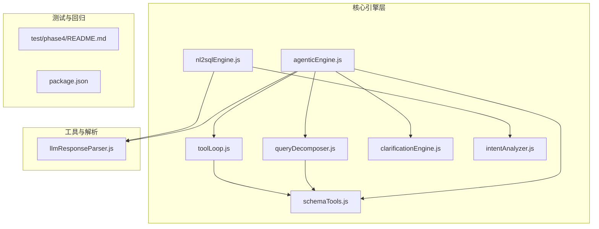
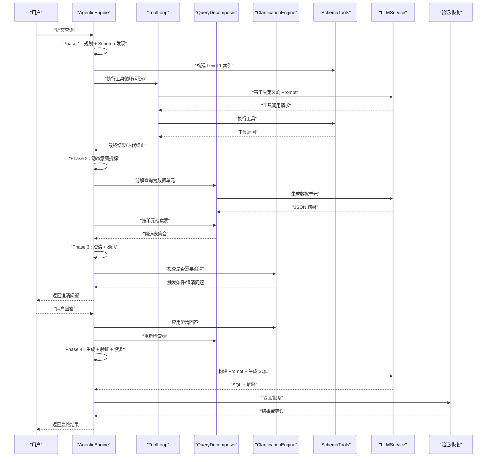
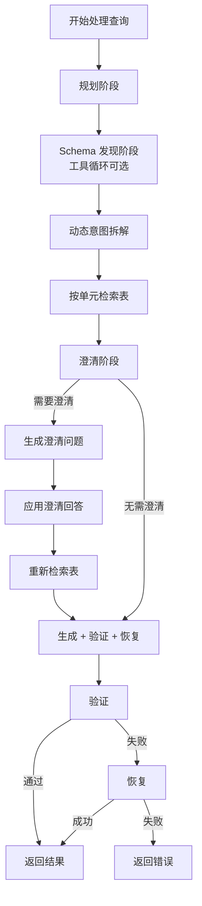
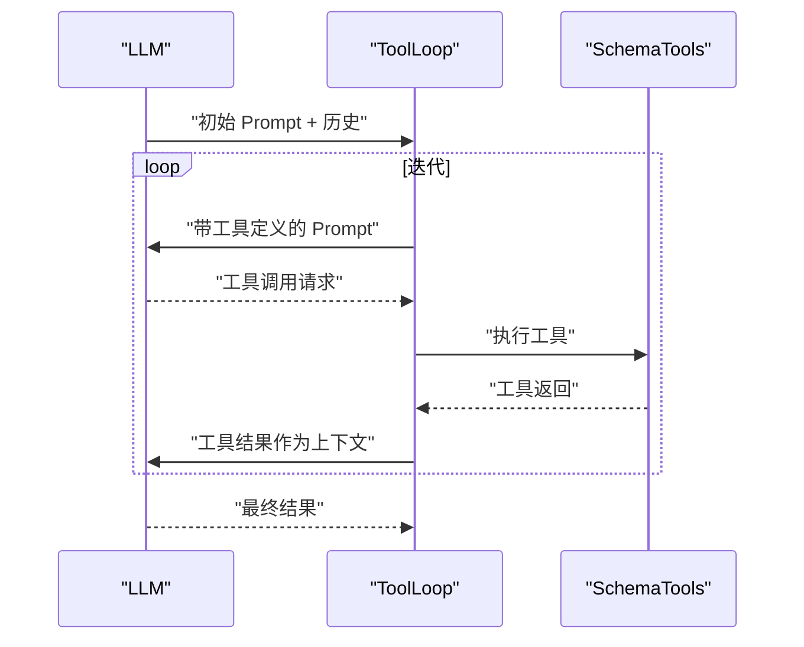
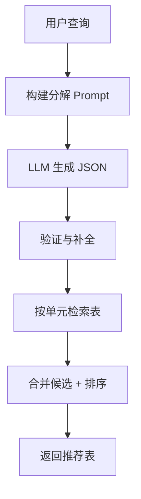
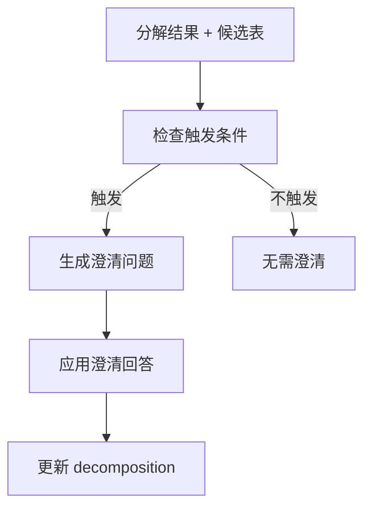
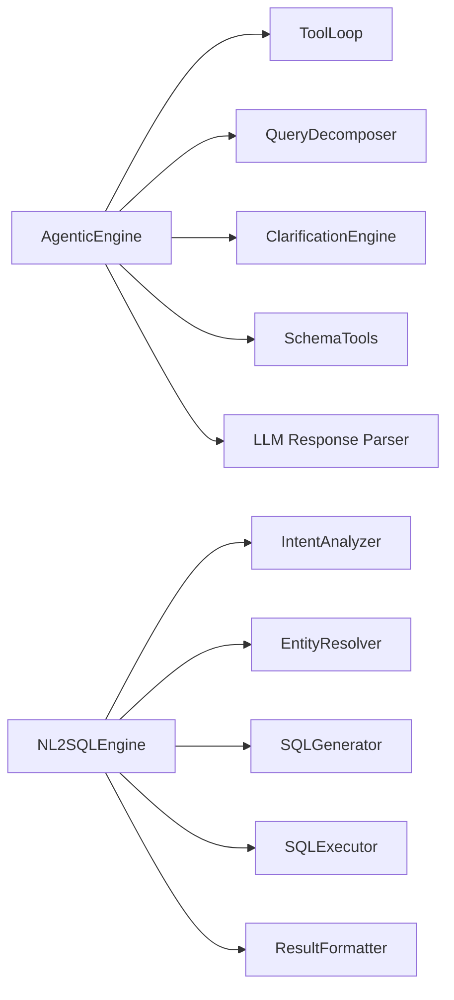

# 智能代理引擎

<cite>
**本文引用的文件**
- [agenticEngine.js](file://backend/src/core/agenticEngine.js)
- [toolLoop.js](file://backend/src/core/toolLoop.js)
- [clarificationEngine.js](file://backend/src/core/clarificationEngine.js)
- [intentAnalyzer.js](file://backend/src/core/intentAnalyzer.js)
- [queryDecomposer.js](file://backend/src/core/queryDecomposer.js)
- [schemaTools.js](file://backend/src/core/schemaTools.js)
- [nl2sqlEngine.js](file://backend/src/core/nl2sqlEngine.js)
- [llmResponseParser.js](file://backend/src/utils/llmResponseParser.js)
- [README.md](file://backend/test/phase4/README.md)
- [package.json](file://backend/package.json)
</cite>

## 目录
1. [简介](#简介)
2. [项目结构](#项目结构)
3. [核心组件](#核心组件)
4. [架构总览](#架构总览)
5. [详细组件分析](#详细组件分析)
6. [依赖分析](#依赖分析)
7. [性能考量](#性能考量)
8. [故障排查指南](#故障排查指南)
9. [结论](#结论)
10. [附录](#附录)

## 简介
本技术文档面向智能代理引擎（Agentic NL2SQL）的实现与扩展，聚焦 Phase 1–4 渐进式增强机制，系统阐述工具循环、动态意图拆解、澄清引擎等高级能力的工作流与实现原理。文档旨在帮助开发者快速理解引擎的控制流、状态管理、错误恢复与审计写入，并提供可操作的使用模式与扩展建议。

## 项目结构
后端采用“按职责分层 + 按阶段划分”的组织方式：
- 核心引擎层：agenticEngine.js、nl2sqlEngine.js、toolLoop.js、queryDecomposer.js、clarificationEngine.js、intentAnalyzer.js、schemaTools.js
- 工具与解析：llmResponseParser.js
- 测试与回归：test/phase1–phase4 目录下的测试脚本与说明
- 配置与运行：package.json、feature-flags.js、schema-metadata.json 等

图表来源
- [agenticEngine.js:1-994](file://backend/src/core/agenticEngine.js#L1-L994)
- [nl2sqlEngine.js:1-756](file://backend/src/core/nl2sqlEngine.js#L1-L756)
- [toolLoop.js:1-539](file://backend/src/core/toolLoop.js#L1-L539)
- [queryDecomposer.js:1-436](file://backend/src/core/queryDecomposer.js#L1-L436)
- [clarificationEngine.js:1-559](file://backend/src/core/clarificationEngine.js#L1-L559)
- [intentAnalyzer.js:1-757](file://backend/src/core/intentAnalyzer.js#L1-L757)
- [schemaTools.js:1-632](file://backend/src/core/schemaTools.js#L1-L632)
- [llmResponseParser.js:1-146](file://backend/src/utils/llmResponseParser.js#L1-L146)
- [README.md:1-51](file://backend/test/phase4/README.md#L1-L51)
- [package.json:1-36](file://backend/package.json#L1-L36)

章节来源
- [agenticEngine.js:1-994](file://backend/src/core/agenticEngine.js#L1-L994)
- [nl2sqlEngine.js:1-756](file://backend/src/core/nl2sqlEngine.js#L1-L756)
- [toolLoop.js:1-539](file://backend/src/core/toolLoop.js#L1-L539)
- [queryDecomposer.js:1-436](file://backend/src/core/queryDecomposer.js#L1-L436)
- [clarificationEngine.js:1-559](file://backend/src/core/clarificationEngine.js#L1-L559)
- [intentAnalyzer.js:1-757](file://backend/src/core/intentAnalyzer.js#L1-L757)
- [schemaTools.js:1-632](file://backend/src/core/schemaTools.js#L1-L632)
- [llmResponseParser.js:1-146](file://backend/src/utils/llmResponseParser.js#L1-L146)
- [README.md:1-51](file://backend/test/phase4/README.md#L1-L51)
- [package.json:1-36](file://backend/package.json#L1-L36)

## 核心组件
- 智能代理引擎（Agentic NL2SQL）：统一编排四阶段工作流，实现 Plan → Act → Observe 循环与自我修正。
- 工具循环（Tool Loop）：LLM 主动探索 Schema，按需调用 search_tables/describe_table/search_knowledge/peek_table。
- 查询分解器（Query Decomposer）：将复杂查询拆解为数据需求单元，独立检索相关表并合并候选。
- 澄清引擎（Clarification Engine）：基于置信度与触发条件生成澄清问题，支持多种澄清类型与答案回填。
- 意图分析器（Intent Analyzer）：融合上下文与长期记忆，进行意图识别、完整性检查与澄清生成。
- Schema 工具层（Schema Tools）：提供 Level 1 索引与工具定义，支撑工具循环与 Schema 发现。
- LLM 响应解析器（LLM Response Parser）：统一 JSON/SQL 提取策略，提升稳定性与一致性。

章节来源
- [agenticEngine.js:54-215](file://backend/src/core/agenticEngine.js#L54-L215)
- [toolLoop.js:75-203](file://backend/src/core/toolLoop.js#L75-L203)
- [queryDecomposer.js:41-73](file://backend/src/core/queryDecomposer.js#L41-L73)
- [clarificationEngine.js:196-232](file://backend/src/core/clarificationEngine.js#L196-L232)
- [intentAnalyzer.js:173-468](file://backend/src/core/intentAnalyzer.js#L173-L468)
- [schemaTools.js:40-124](file://backend/src/core/schemaTools.js#L40-L124)
- [llmResponseParser.js:24-143](file://backend/src/utils/llmResponseParser.js#L24-L143)

## 架构总览
智能代理引擎以“渐进式增强”为核心思想，将 Phase 1–4 的能力有机整合，形成闭环的 Plan → Act → Observe → Recovery 流程。引擎通过工具循环主动探索 Schema，借助动态意图拆解与澄清引擎处理不确定性，最终在 Generation → Verification → Recovery 阶段确保输出质量与鲁棒性。

图表来源
- [agenticEngine.js:70-215](file://backend/src/core/agenticEngine.js#L70-L215)
- [toolLoop.js:75-203](file://backend/src/core/toolLoop.js#L75-L203)
- [queryDecomposer.js:41-73](file://backend/src/core/queryDecomposer.js#L41-L73)
- [clarificationEngine.js:196-272](file://backend/src/core/clarificationEngine.js#L196-L272)
- [schemaTools.js:40-124](file://backend/src/core/schemaTools.js#L40-L124)

## 详细组件分析

### 智能代理引擎（Agentic NL2SQL）
- 四阶段工作流
  - Phase 1：规划 + 工具增强的 Schema 发现
  - Phase 2：动态意图拆解
  - Phase 3：澄清 + 确认
  - Phase 4：生成 + 验证 + 恢复
- 控制流与状态管理
  - 进度回调：sendProgress(step, message) 用于 SSE/前端反馈
  - 追踪日志：traceLog 记录各阶段结果，便于审计与回溯
  - 审计写入：成功路径独立写入 query_history，避免双写
- 错误恢复
  - 分类错误：TABLE_NOT_FOUND、SYNTAX_ERROR 等
  - 自动恢复：表不存在时建议替代表；语法错误时请求 LLM 修正
- 批次 B 恢复生成
  - resumeFromClarification：基于澄清回答回填 decomposition，直接走 generation → verification → recovery

图表来源
- [agenticEngine.js:70-215](file://backend/src/core/agenticEngine.js#L70-L215)
- [agenticEngine.js:803-929](file://backend/src/core/agenticEngine.js#L803-L929)

章节来源
- [agenticEngine.js:54-215](file://backend/src/core/agenticEngine.js#L54-L215)
- [agenticEngine.js:803-929](file://backend/src/core/agenticEngine.js#L803-L929)

### 工具循环（Tool Loop）
- 核心能力
  - LLM 主动调用工具：search_tables、describe_table、search_knowledge、peek_table
  - 循环终止：当 LLM 不再请求工具调用时结束
  - 超时与迭代限制：MAX_TOOL_ITERATIONS、TOOL_LOOP_TIMEOUT
- 系统提示词
  - 带 Level 1 索引时展示可用表列表，引导探索
- 响应解析
  - parseToolCalls 解析 OpenAI 格式的 tool_calls
  - executeTool 调用具体工具并返回结构化结果

图表来源
- [toolLoop.js:75-203](file://backend/src/core/toolLoop.js#L75-L203)
- [schemaTools.js:551-602](file://backend/src/core/schemaTools.js#L551-L602)

章节来源
- [toolLoop.js:75-203](file://backend/src/core/toolLoop.js#L75-L203)
- [schemaTools.js:40-124](file://backend/src/core/schemaTools.js#L40-L124)
- [schemaTools.js:551-602](file://backend/src/core/schemaTools.js#L551-L602)

### 查询分解器（Query Decomposer）
- 动态拆解
  - 将复杂查询拆解为数据需求单元（Data Units），每单元独立检索相关表
  - 支持关键词、时间范围、指标、行为序列、输出字段等多维描述
- 表检索与合并
  - 按单元构建搜索文本，调用 schemaLoader.searchRelevantTables
  - 合并候选：覆盖率分数 × 0.6 + 频率分数 × 0.4，结合 tableRanker 统一裁剪
- 回退策略
  - JSON 解析失败时返回基础分解（整体查询）

图表来源
- [queryDecomposer.js:41-73](file://backend/src/core/queryDecomposer.js#L41-L73)
- [queryDecomposer.js:258-302](file://backend/src/core/queryDecomposer.js#L258-L302)
- [queryDecomposer.js:352-413](file://backend/src/core/queryDecomposer.js#L352-L413)

章节来源
- [queryDecomposer.js:41-73](file://backend/src/core/queryDecomposer.js#L41-L73)
- [queryDecomposer.js:258-302](file://backend/src/core/queryDecomposer.js#L258-L302)
- [queryDecomposer.js:352-413](file://backend/src/core/queryDecomposer.js#L352-L413)

### 澄清引擎（Clarification Engine）
- 触发条件
  - 未覆盖数据单元、表选择歧义、聚合指标来源不明确、时间粒度不明确、置信度过低
- 生成澄清
  - 基于触发条件生成问题，支持选项与默认推荐
- 应用澄清
  - 支持多种澄清类型：表选择、指标来源、时间粒度、通用澄清
  - 批次 B：从用户回答中抽取物理 filter 与字段名，回写到 dataUnit，保证下一轮生成可见

图表来源
- [clarificationEngine.js:196-232](file://backend/src/core/clarificationEngine.js#L196-L232)
- [clarificationEngine.js:246-272](file://backend/src/core/clarificationEngine.js#L246-L272)
- [clarificationEngine.js:388-428](file://backend/src/core/clarificationEngine.js#L388-L428)
- [clarificationEngine.js:494-540](file://backend/src/core/clarificationEngine.js#L494-L540)

章节来源
- [clarificationEngine.js:196-232](file://backend/src/core/clarificationEngine.js#L196-L232)
- [clarificationEngine.js:246-272](file://backend/src/core/clarificationEngine.js#L246-L272)
- [clarificationEngine.js:388-428](file://backend/src/core/clarificationEngine.js#L388-L428)
- [clarificationEngine.js:494-540](file://backend/src/core/clarificationEngine.js#L494-L540)

### 意图分析器（Intent Analyzer）
- 融合上下文与长期记忆，识别 time_range、metrics、dimensions、filters、sort、limit、confidence
- 意图完整性检查与澄清生成，支持默认选项与确认快捷回复
- 与 NL2SQL 引擎协同：在 Phase 4 中承担意图识别、澄清与上下文合并职责

章节来源
- [intentAnalyzer.js:173-468](file://backend/src/core/intentAnalyzer.js#L173-L468)
- [intentAnalyzer.js:609-742](file://backend/src/core/intentAnalyzer.js#L609-L742)

### Schema 工具层（Schema Tools）
- Level 1 索引：表名、中文描述、域标签、数据类型
- 工具定义：search_tables、describe_table、search_knowledge、peek_table
- 工具执行：封装 schemaLoader 的检索与描述能力，返回结构化结果

章节来源
- [schemaTools.js:136-173](file://backend/src/core/schemaTools.js#L136-L173)
- [schemaTools.js:40-124](file://backend/src/core/schemaTools.js#L40-L124)
- [schemaTools.js:225-393](file://backend/src/core/schemaTools.js#L225-L393)

### LLM 响应解析器（LLM Response Parser）
- 统一 JSON/SQL 提取策略：直接解析 → 代码块 → 平衡花括号提取
- 提升跨模块稳定性，减少重复实现

章节来源
- [llmResponseParser.js:24-143](file://backend/src/utils/llmResponseParser.js#L24-L143)

## 依赖分析
- 模块耦合
  - AgenticEngine 依赖 toolLoop、queryDecomposer、clarificationEngine、schemaTools、llmResponseParser
  - NL2SQL 引擎在 Phase 4 中拆分为 intentAnalyzer、entityResolver、sqlGenerator、sqlExecutor、resultFormatter
- 外部依赖
  - mysql2、sqlite3、node-sql-parser、vectordb 等
- 特性开关
  - feature-flags.js 控制 TOOL_LOOP_MODE、DYNAMIC_INTENT_DECOMPOSITION、CLARIFICATION_ENGINE、UNIFIED_RANKER 等

图表来源
- [agenticEngine.js:20-31](file://backend/src/core/agenticEngine.js#L20-L31)
- [nl2sqlEngine.js:32-37](file://backend/src/core/nl2sqlEngine.js#L32-L37)

章节来源
- [agenticEngine.js:20-31](file://backend/src/core/agenticEngine.js#L20-L31)
- [nl2sqlEngine.js:32-37](file://backend/src/core/nl2sqlEngine.js#L32-L37)
- [package.json:16-28](file://backend/package.json#L16-L28)

## 性能考量
- 工具循环迭代限制与超时：防止无限循环与长时间阻塞
- 表候选合并策略：覆盖率与频率的加权评分，结合 tableRanker 统一裁剪，避免过度检索
- Prompt 注入与历史压缩：通过 tokenBudget 控制上下文规模，必要时触发压缩
- 审计与日志：traceLog 与 query_history 写入，兼顾可观测性与性能

## 故障排查指南
- 规划阶段失败
  - 现象：规划 JSON 解析失败，使用默认计划
  - 处理：检查 LLM 输出格式与 llmResponseParser 策略
- Schema 发现失败
  - 现象：工具循环异常或超时
  - 处理：检查 TOOL_LOOP_MODE 开关、工具定义与 schemaTools 执行器
- 查询分解失败
  - 现象：JSON 解析失败，返回基础分解
  - 处理：检查 LLM 输出与 parseJSON 策略
- 澄清问题生成失败
  - 现象：生成澄清问题异常，返回默认模板
  - 处理：检查 clarificationEngine 的触发条件与模板映射
- SQL 验证失败
  - 现象：基本语法/安全检查/表存在性失败
  - 处理：分类错误并尝试恢复；必要时回退到原 SQL + 警告
- 审计写入失败
  - 现象：query_history 写入异常
  - 处理：记录警告并继续返回结果，避免影响主流程

章节来源
- [agenticEngine.js:253-278](file://backend/src/core/agenticEngine.js#L253-L278)
- [toolLoop.js:194-202](file://backend/src/core/toolLoop.js#L194-L202)
- [queryDecomposer.js:155-174](file://backend/src/core/queryDecomposer.js#L155-L174)
- [clarificationEngine.js:266-272](file://backend/src/core/clarificationEngine.js#L266-L272)
- [agenticEngine.js:600-657](file://backend/src/core/agenticEngine.js#L600-L657)
- [agenticEngine.js:173-200](file://backend/src/core/agenticEngine.js#L173-L200)

## 结论
智能代理引擎通过“渐进式增强”的四阶段工作流，实现了从工具驱动的 Schema 探索、动态意图拆解、智能澄清到稳健生成与恢复的完整闭环。其设计强调模块化、可扩展与高鲁棒性，既满足复杂查询场景的需求，又为后续演进（如记忆系统、自修复能力）预留空间。建议在生产环境中配合 feature-flags 与审计日志，持续优化工具循环与表候选策略，以进一步提升准确性与性能。

## 附录
- 测试与回归
  - Phase 4 回归测试覆盖模块导出契约、错误恢复、内存队列等关键路径
  - 运行方式：npm run test:phase4 或 npm test（含外部依赖）
- 使用模式
  - 工具循环：在需要 LLM 主动探索 Schema 时启用 TOOL_LOOP_MODE
  - 动态拆解：启用 DYNAMIC_INTENT_DECOMPOSITION 以适配复杂查询
  - 澄清引擎：通过 CLARIFICATION_ENGINE 控制澄清能力
  - 表候选：通过 UNIFIED_RANKER 使用 tableRanker 统一裁剪

章节来源
- [README.md:1-51](file://backend/test/phase4/README.md#L1-L51)
- [package.json:6-14](file://backend/package.json#L6-L14)