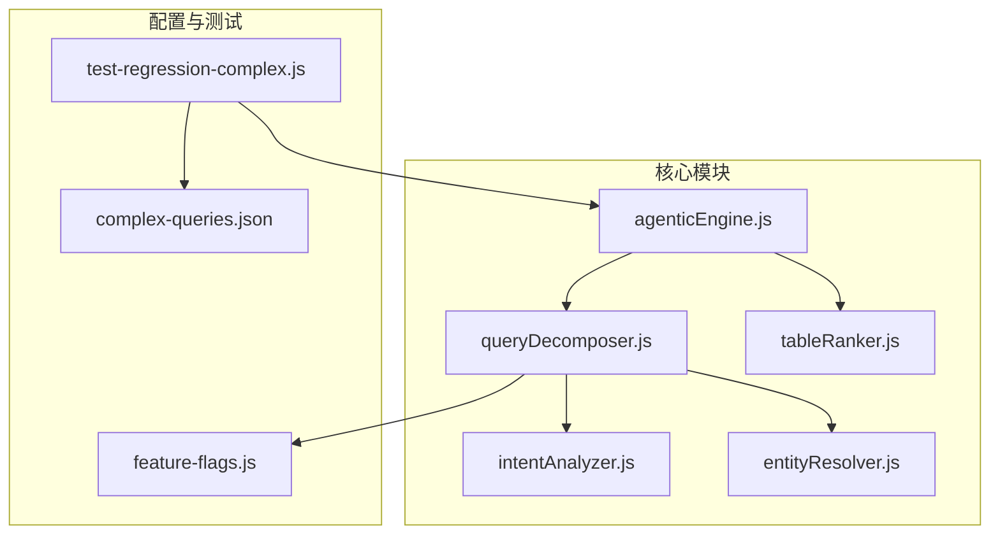
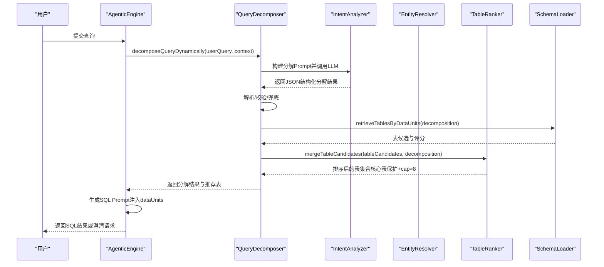
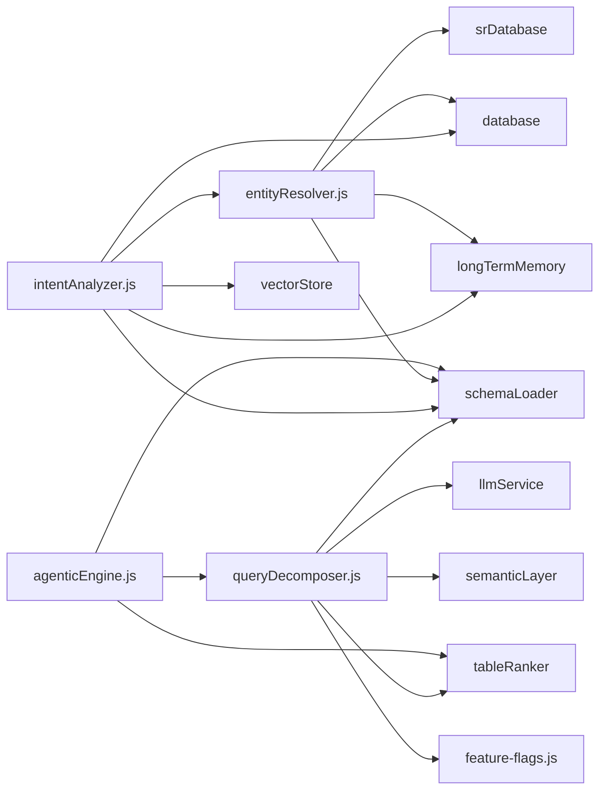

# 查询分解器

<cite>
**本文引用的文件**
- [queryDecomposer.js](file://backend/src/core/queryDecomposer.js)
- [tableRanker.js](file://backend/src/core/tableRanker.js)
- [intentAnalyzer.js](file://backend/src/core/intentAnalyzer.js)
- [entityResolver.js](file://backend/src/core/entityResolver.js)
- [agenticEngine.js](file://backend/src/core/agenticEngine.js)
- [feature-flags.js](file://backend/config/feature-flags.js)
- [complex-queries.json](file://backend/test/phase2/fixtures/complex-queries.json)
- [test-regression-complex.js](file://backend/test/phase2/test-regression-complex.js)
</cite>

## 目录
1. [简介](#简介)
2. [项目结构](#项目结构)
3. [核心组件](#核心组件)
4. [架构概览](#架构概览)
5. [详细组件分析](#详细组件分析)
6. [依赖分析](#依赖分析)
7. [性能考虑](#性能考虑)
8. [故障排查指南](#故障排查指南)
9. [结论](#结论)
10. [附录](#附录)

## 简介
本技术文档围绕“查询分解器”展开，系统性解析 queryDecomposer.js 如何将复杂自然语言查询动态拆解为“数据需求单元”，并在此基础上完成表检索与排序，为后续 SQL 生成提供高质量的表候选集合。文档涵盖：
- 查询理解与意图分类
- 数据单元提取与结构化表示
- 复杂度评估与处理策略
- 动态意图拆解的工作原理
- 与表排序器的协作关系
- 与意图分析、实体解析的集成路径
- 性能与稳定性保障机制
- 使用模式与扩展建议

## 项目结构
查询分解器位于后端核心模块目录，与意图分析、实体解析、表排序器、引擎编排等模块协同工作，形成“动态意图拆解 → 表检索 → 统一排序 → SQL 生成”的闭环。

图表来源
- [queryDecomposer.js:1-436](file://backend/src/core/queryDecomposer.js#L1-L436)
- [tableRanker.js:1-280](file://backend/src/core/tableRanker.js#L1-L280)
- [intentAnalyzer.js:1-757](file://backend/src/core/intentAnalyzer.js#L1-L757)
- [entityResolver.js:1-459](file://backend/src/core/entityResolver.js#L1-L459)
- [agenticEngine.js:350-549](file://backend/src/core/agenticEngine.js#L350-L549)
- [feature-flags.js:16-141](file://backend/config/feature-flags.js#L16-L141)
- [complex-queries.json:1-82](file://backend/test/phase2/fixtures/complex-queries.json#L1-L82)
- [test-regression-complex.js:1-119](file://backend/test/phase2/test-regression-complex.js#L1-L119)

章节来源
- [queryDecomposer.js:1-436](file://backend/src/core/queryDecomposer.js#L1-L436)
- [agenticEngine.js:350-549](file://backend/src/core/agenticEngine.js#L350-L549)

## 核心组件
- 查询分解器（queryDecomposer.js）
  - 动态意图拆解：将复杂查询拆分为“数据需求单元”，不预设固定类型，支持基础属性、时间范围、聚合指标、行为序列、输出字段等多样化单元。
  - 表检索：基于每个数据单元构建搜索文本，调用 schemaLoader 检索相关表，统计候选表及其覆盖度与频率，输出 Top-N 候选。
  - 统一排序：通过 tableRanker 进行融合打分（向量/语义/关键词/核心表加成），并进行核心表保护与上限截断。
  - 复杂度评估：估算查询复杂度（低/中/高），并标注是否需要 Join。
- 表排序器（tableRanker.js）
  - 融合多源信号：向量检索、业务语义层、关键词命中、显式表名、推断表名。
  - 归一化与加权：向量分、语义层优先级与分数、关键词累计次数归一化。
  - 核心表保护与上限截断：核心表优先保留，其余名额按分数补齐，总数不超过 cap（默认 8）。
- 意图分析（intentAnalyzer.js）
  - 识别时间范围、维度、指标、筛选条件、排序与限制，结合对话历史与长期记忆，生成结构化意图。
- 实体解析（entityResolver.js）
  - 业务关键词映射、实体名称到 ID 的映射、平台术语识别、上下文别名学习，增强意图的可执行性。

章节来源
- [queryDecomposer.js:27-73](file://backend/src/core/queryDecomposer.js#L27-L73)
- [queryDecomposer.js:258-302](file://backend/src/core/queryDecomposer.js#L258-L302)
- [queryDecomposer.js:352-413](file://backend/src/core/queryDecomposer.js#L352-L413)
- [tableRanker.js:244-270](file://backend/src/core/tableRanker.js#L244-L270)
- [intentAnalyzer.js:173-468](file://backend/src/core/intentAnalyzer.js#L173-L468)
- [entityResolver.js:43-58](file://backend/src/core/entityResolver.js#L43-L58)

## 架构概览
查询分解器在“代理引擎（Agentic Engine）”的第二阶段（Phase 2）执行，与表排序器紧密协作，最终为 SQL 生成阶段提供高质量的表候选集合。

图表来源
- [agenticEngine.js:358-379](file://backend/src/core/agenticEngine.js#L358-L379)
- [agenticEngine.js:102-104](file://backend/src/core/agenticEngine.js#L102-L104)
- [queryDecomposer.js:41-73](file://backend/src/core/queryDecomposer.js#L41-L73)
- [queryDecomposer.js:258-302](file://backend/src/core/queryDecomposer.js#L258-L302)
- [queryDecomposer.js:352-413](file://backend/src/core/queryDecomposer.js#L352-L413)
- [tableRanker.js:244-270](file://backend/src/core/tableRanker.js#L244-L270)

## 详细组件分析

### 查询理解与意图分类
- 动态拆解流程
  - 构建分解 Prompt：包含业务关键词参考、常见单元类型、输出格式约束，引导 LLM 产出结构化 JSON。
  - LLM 调用与解析：通过统一的 JSON 解析器提取 thought、primaryEntity、dataUnits、estimatedComplexity、requiresJoin、potentialRisks 等字段。
  - 结果校验与兜底：若解析失败或异常，创建基础分解（整体查询单元），并记录潜在风险。
- 数据单元结构
  - 每个单元包含：id、type、description、keywords、filters（字段、操作符、值）、timeRange（start、end、field）、metric、operator、value、behavior（type、date、condition）、outputFields。
  - 通过关键词、描述、指标、行为类型等多维度构建单元搜索文本，提升表检索的准确性。

章节来源
- [queryDecomposer.js:82-146](file://backend/src/core/queryDecomposer.js#L82-L146)
- [queryDecomposer.js:155-174](file://backend/src/core/queryDecomposer.js#L155-L174)
- [queryDecomposer.js:182-201](file://backend/src/core/queryDecomposer.js#L182-L201)
- [queryDecomposer.js:209-226](file://backend/src/core/queryDecomposer.js#L209-L226)

### 数据单元提取与表检索
- 搜索文本构建
  - 将 keywords、description、metric、behavior.type 等拼接为搜索查询，提升向量检索或关键词匹配的召回质量。
- 表候选统计
  - 为每个数据单元调用 schemaLoader.searchRelevantTables，统计候选表的覆盖单元数、检索频次，计算覆盖率与频率得分，综合排序。
- 推荐表输出
  - 默认推荐 Top-8 表名，作为后续 SQL 生成的输入。

章节来源
- [queryDecomposer.js:310-334](file://backend/src/core/queryDecomposer.js#L310-L334)
- [queryDecomposer.js:258-302](file://backend/src/core/queryDecomposer.js#L258-L302)

### 复杂度评估与处理策略
- 评估维度
  - estimatedComplexity：低/中/高，来源于 LLM 对查询的综合判断。
  - requiresJoin：是否需要 Join，辅助后续 SQL 生成策略。
  - potentialRisks：潜在歧义或风险点，指导澄清与兜底。
- 处理策略
  - 高复杂度查询：优先通过行为序列、聚合+明细等单元拆分，降低单次 SQL 生成难度。
  - 需要 Join：在表排序阶段通过核心表保护与上限截断，确保关键表优先被选中。

章节来源
- [queryDecomposer.js:114-145](file://backend/src/core/queryDecomposer.js#L114-L145)
- [queryDecomposer.js:160-167](file://backend/src/core/queryDecomposer.js#L160-L167)
- [queryDecomposer.js:352-413](file://backend/src/core/queryDecomposer.js#L352-L413)

### 与表排序器的协作关系
- 融合打分
  - 向量检索（priorityScore）、业务语义层（priority 与 score）、关键词命中计数、显式表名、推断表名。
- 归一化与加权
  - 向量分、语义层分、关键词分分别归一化到 0-100，按权重组合得到基础分。
  - 核心表加成（+30）、推断表加成（+15），最终得分上限≈145。
- 核心表保护与上限
  - 核心表优先保留，剩余名额按分数补齐，总数不超过 cap（默认 8）。
  - 若核心表为空且存在显式表名，显式表名置顶兜底。

章节来源
- [tableRanker.js:28-41](file://backend/src/core/tableRanker.js#L28-L41)
- [tableRanker.js:153-188](file://backend/src/core/tableRanker.js#L153-L188)
- [tableRanker.js:193-213](file://backend/src/core/tableRanker.js#L193-L213)
- [tableRanker.js:244-270](file://backend/src/core/tableRanker.js#L244-L270)

### 与意图分析、实体解析的集成
- 意图分析（intentAnalyzer）
  - 识别时间范围、维度、指标、筛选条件、排序与限制，结合对话历史与长期记忆，生成结构化意图。
  - 实体解析（entityResolver）
    - 业务关键词映射（inferTablesFromQuery）：从查询中推断可能涉及的表。
    - 实体名称到 ID 的映射：优先使用长期记忆，其次模糊匹配数据库 SR 库，必要时生成澄清。
    - 平台术语识别：将“新平台/老平台”映射到数据源标识。
- 查询分解器的作用
  - 在 Agentic Engine 的 Phase 2 中，调用 queryDecomposer.decomposeQueryDynamically，获得结构化 dataUnits。
  - 基于分解结果检索表，交由 tableRanker 统一排序，最终为 SQL 生成阶段提供高质量表候选。

章节来源
- [intentAnalyzer.js:173-468](file://backend/src/core/intentAnalyzer.js#L173-L468)
- [entityResolver.js:43-58](file://backend/src/core/entityResolver.js#L43-L58)
- [entityResolver.js:187-341](file://backend/src/core/entityResolver.js#L187-L341)
- [entityResolver.js:382-448](file://backend/src/core/entityResolver.js#L382-L448)
- [agenticEngine.js:358-379](file://backend/src/core/agenticEngine.js#L358-L379)
- [agenticEngine.js:102-104](file://backend/src/core/agenticEngine.js#L102-L104)

### 复杂查询用例与回归测试
- 用例类别
  - 多维过滤：如“最近7天渠道 channelA、游戏 tzqingmu 的充值订单数和付费人数”
  - 行为序列：如“昨天注册并在当天完成首充的用户数”、“最近30天注册后次日登录的留存数”
  - 聚合+明细：如“本月充值金额 top10 用户的首充金额、渠道”
- 测试目标
  - 断言 tablesCalled（必须包含/最大数量/核心表数量）与 SQL 关键词（必需/禁止）。
  - 在 DRY_RUN 模式下验证选表与 SQL 关键词，在 LIVE 模式下验证结果行数。

章节来源
- [complex-queries.json:1-82](file://backend/test/phase2/fixtures/complex-queries.json#L1-L82)
- [test-regression-complex.js:33-50](file://backend/test/phase2/test-regression-complex.js#L33-L50)
- [test-regression-complex.js:79-101](file://backend/test/phase2/test-regression-complex.js#L79-L101)

## 依赖分析
- 模块耦合
  - queryDecomposer 依赖 llmService、schemaLoader、semanticLayer、logger、config、tableRanker、featureFlags、safeLog。
  - tableRanker 依赖 featureFlags、tableScope（核心表判定）。
  - intentAnalyzer 依赖 schemaLoader、database、longTermMemory、vectorStore、entityResolver。
  - entityResolver 依赖 schemaLoader、database、srDatabase、longTermMemory。
  - agenticEngine 依赖 queryDecomposer、clarificationEngine、schemaLoader、tableRanker。
- 外部依赖
  - LLM API（用于意图拆解与 SQL 生成 Prompt 构建）
  - 向量检索服务（用于 schemaLoader.searchRelevantTables）
  - SR 数据库（用于实体解析）

图表来源
- [queryDecomposer.js:14-21](file://backend/src/core/queryDecomposer.js#L14-L21)
- [tableRanker.js:25-26](file://backend/src/core/tableRanker.js#L25-L26)
- [intentAnalyzer.js:13-20](file://backend/src/core/intentAnalyzer.js#L13-L20)
- [entityResolver.js:12-16](file://backend/src/core/entityResolver.js#L12-L16)
- [agenticEngine.js:33-37](file://backend/src/core/agenticEngine.js#L33-L37)

章节来源
- [queryDecomposer.js:14-21](file://backend/src/core/queryDecomposer.js#L14-L21)
- [tableRanker.js:25-26](file://backend/src/core/tableRanker.js#L25-L26)
- [intentAnalyzer.js:13-20](file://backend/src/core/intentAnalyzer.js#L13-L20)
- [entityResolver.js:12-16](file://backend/src/core/entityResolver.js#L12-L16)
- [agenticEngine.js:33-37](file://backend/src/core/agenticEngine.js#L33-L37)

## 性能考虑
- 动态意图拆解
  - 通过 LLM 将复杂查询拆分为多个数据单元，减少单次 SQL 生成的复杂度，提高成功率与可解释性。
- 表检索与排序
  - 基于覆盖率与频率的综合评分，结合核心表保护与 cap 截断，平衡召回与精度。
  - 统一排序器（UNIFIED_RANKER）默认启用，避免硬截断（slice(0,5)），提升复杂查询的表选择质量。
- 兜底策略
  - 分解失败或 LLM 响应异常时，创建基础分解（整体查询单元），保证流程稳定。
  - SQL 生成阶段若推荐表为空，回退到 schemaLoader 兜底。

章节来源
- [queryDecomposer.js:378-402](file://backend/src/core/queryDecomposer.js#L378-L402)
- [queryDecomposer.js:43-73](file://backend/src/core/queryDecomposer.js#L43-L73)
- [agenticEngine.js:438-449](file://backend/src/core/agenticEngine.js#L438-L449)

## 故障排查指南
- 分解失败
  - 现象：JSON 解析失败或异常，导致返回基础分解。
  - 排查：检查 LLM 响应格式是否符合输出规范；确认业务关键词映射是否加载成功。
- 表候选为空
  - 现象：retrieveTablesByDataUnits 返回空推荐表。
  - 排查：确认 schemaLoader.searchRelevantTables 是否可用；检查 UNIFIED_RANKER 开关；必要时启用 DRY_RUN 模式验证选表与 SQL 关键词。
- 复杂度评估偏差
  - 现象：requiresJoin 与 estimatedComplexity 与预期不符。
  - 排查：检查 dataUnits 的类型与描述是否准确；确认行为序列与聚合单元是否合理拆分。
- 核心表保护失效
  - 现象：核心表未被优先保留。
  - 排查：确认 tableScope 的核心表定义；检查 UNIFIED_RANKER 开关；核对 cap 参数。

章节来源
- [queryDecomposer.js:155-174](file://backend/src/core/queryDecomposer.js#L155-L174)
- [queryDecomposer.js:258-302](file://backend/src/core/queryDecomposer.js#L258-L302)
- [tableRanker.js:244-270](file://backend/src/core/tableRanker.js#L244-L270)
- [feature-flags.js:119-125](file://backend/config/feature-flags.js#L119-L125)

## 结论
查询分解器通过“动态意图拆解 + 统一表排序”的组合，显著提升了复杂查询的可执行性与 SQL 生成的准确性。其关键价值在于：
- 将复杂自然语言查询转化为结构化的数据需求单元，降低后续 SQL 生成难度。
- 通过表排序器融合多源信号并进行核心表保护，确保关键表优先被选中。
- 与意图分析、实体解析、代理引擎无缝集成，形成端到端的 NL2SQL 工作流。

## 附录

### 使用模式与扩展建议
- 使用模式
  - 在 Agentic Engine 的 Phase 2 中启用 DYNAMIC_INTENT_DECOMPOSITION，调用 decomposeQueryDynamically 获取分解结果与 dataUnits。
  - 基于分解结果调用 retrieveTablesByDataUnits，交由 tableRanker 进行统一排序，得到推荐表集合。
  - 在 SQL 生成阶段，将分解结果注入 Prompt，提升生成质量。
- 扩展建议
  - 单元类型扩展：在 buildDecompositionPrompt 中增加更多单元类型示例，提升 LLM 的拆解能力。
  - 复杂度评估细化：引入更多特征（如字段数量、嵌套层级、Join 次数）丰富评估维度。
  - 澄清集成：在分解阶段加入潜在风险识别，驱动澄清引擎生成针对性问题。

章节来源
- [agenticEngine.js:358-379](file://backend/src/core/agenticEngine.js#L358-L379)
- [agenticEngine.js:102-104](file://backend/src/core/agenticEngine.js#L102-L104)
- [queryDecomposer.js:82-146](file://backend/src/core/queryDecomposer.js#L82-L146)
- [queryDecomposer.js:352-413](file://backend/src/core/queryDecomposer.js#L352-L413)