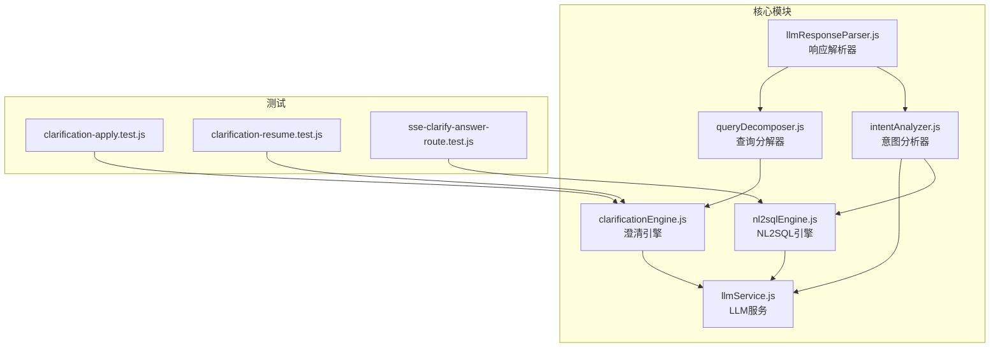
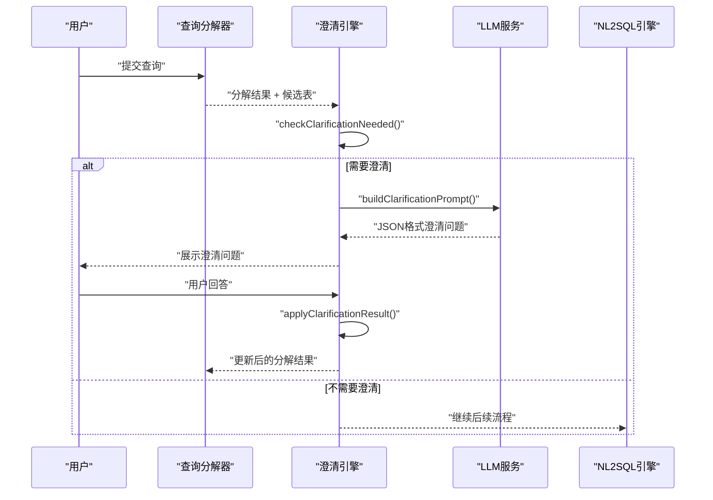
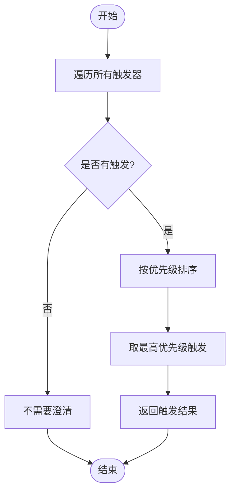
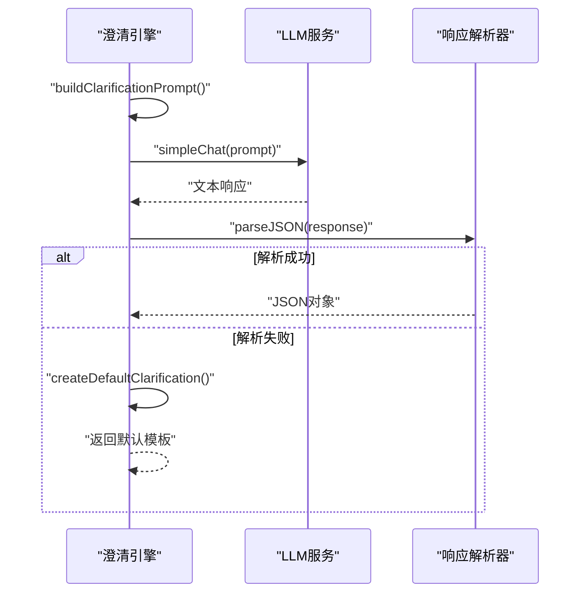
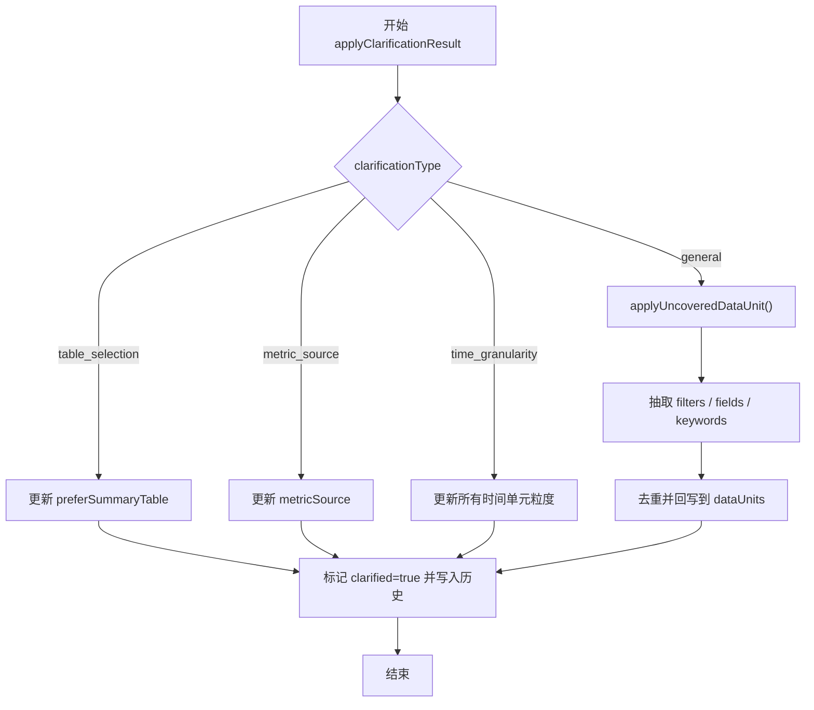
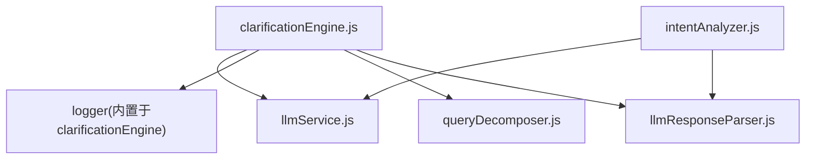

# 澄清引擎

<cite>
**本文档引用的文件**
- [clarificationEngine.js](file://backend/src/core/clarificationEngine.js)
- [queryDecomposer.js](file://backend/src/core/queryDecomposer.js)
- [intentAnalyzer.js](file://backend/src/core/intentAnalyzer.js)
- [nl2sqlEngine.js](file://backend/src/core/nl2sqlEngine.js)
- [llmResponseParser.js](file://backend/src/utils/llmResponseParser.js)
- [llmService.js](file://backend/src/core/llmService.js)
- [clarification-apply.test.js](file://backend/test/phase3/clarification-apply.test.js)
- [clarification-resume.test.js](file://backend/test/phase3/clarification-resume.test.js)
- [sse-clarify-answer-route.test.js](file://backend/test/phase3/sse-clarify-answer-route.test.js)
</cite>

## 目录
1. [简介](#简介)
2. [项目结构](#项目结构)
3. [核心组件](#核心组件)
4. [架构概览](#架构概览)
5. [详细组件分析](#详细组件分析)
6. [依赖分析](#依赖分析)
7. [性能考虑](#性能考虑)
8. [故障排查指南](#故障排查指南)
9. [结论](#结论)
10. [附录](#附录)

## 简介
本文件面向“澄清引擎”（Phase 3）的技术文档，聚焦 clarificationEngine.js 如何在查询意图不明确时进行识别、提问、回答处理与历史管理。澄清机制通过“触发条件检测 → 生成澄清问题 → 应用澄清回答 → 更新查询理解”的闭环，显著提升查询处理的成功率与准确性。本文将深入解析：
- 澄清触发条件与优先级策略
- 澄清问题生成与默认模板
- 用户回答抽取与回写规则
- 澄清历史管理与幂等性保障
- 与查询分解器、意图分析器的协作关系
- 典型使用模式与扩展建议

## 项目结构
澄清引擎位于后端核心模块目录，与查询分解器、意图分析器、NL2SQL引擎共同构成查询理解与执行的主干流程。测试文件覆盖澄清应用、恢复执行与SSE回答路由的关键场景。

图表来源
- [clarificationEngine.js:1-559](file://backend/src/core/clarificationEngine.js#L1-L559)
- [queryDecomposer.js:1-436](file://backend/src/core/queryDecomposer.js#L1-L436)
- [intentAnalyzer.js:1-757](file://backend/src/core/intentAnalyzer.js#L1-L757)
- [nl2sqlEngine.js:1-756](file://backend/src/core/nl2sqlEngine.js#L1-L756)
- [llmService.js:1-491](file://backend/src/core/llmService.js#L1-L491)
- [llmResponseParser.js:1-146](file://backend/src/utils/llmResponseParser.js#L1-L146)
- [clarification-apply.test.js:1-157](file://backend/test/phase3/clarification-apply.test.js#L1-L157)
- [clarification-resume.test.js:1-257](file://backend/test/phase3/clarification-resume.test.js#L1-L257)
- [sse-clarify-answer-route.test.js:1-261](file://backend/test/phase3/sse-clarify-answer-route.test.js#L1-L261)

章节来源
- [clarificationEngine.js:1-559](file://backend/src/core/clarificationEngine.js#L1-L559)
- [queryDecomposer.js:1-436](file://backend/src/core/queryDecomposer.js#L1-L436)
- [intentAnalyzer.js:1-757](file://backend/src/core/intentAnalyzer.js#L1-L757)
- [nl2sqlEngine.js:1-756](file://backend/src/core/nl2sqlEngine.js#L1-L756)

## 核心组件
- 澄清触发器配置：定义五类触发条件（无匹配表、表选择歧义、聚合指标来源不确定、时间粒度不确定、置信度过低），每类包含检查函数、优先级与消息模板。
- 澄清检测：遍历触发器，按优先级返回最高优先级触发，避免一次性抛出过多问题。
- 澄清问题生成：构建Prompt，调用LLM生成JSON格式的澄清问题，包含问题文本、选项、默认推荐、类型与解释。
- 澄清结果应用：根据澄清类型（表选择、指标来源、时间粒度、通用）分别更新分解结果；通用类型支持从用户回答中抽取字段与过滤条件，回写到对应数据单元。
- 历史管理：记录每次澄清问答的时间戳与内容，保证幂等性与可追溯性。

章节来源
- [clarificationEngine.js:26-182](file://backend/src/core/clarificationEngine.js#L26-L182)
- [clarificationEngine.js:196-232](file://backend/src/core/clarificationEngine.js#L196-L232)
- [clarificationEngine.js:246-272](file://backend/src/core/clarificationEngine.js#L246-L272)
- [clarificationEngine.js:277-312](file://backend/src/core/clarificationEngine.js#L277-L312)
- [clarificationEngine.js:388-428](file://backend/src/core/clarificationEngine.js#L388-L428)
- [clarificationEngine.js:494-540](file://backend/src/core/clarificationEngine.js#L494-L540)

## 架构概览
澄清引擎在查询处理流程中的位置如下：先由查询分解器产出数据单元与候选表，再由澄清引擎检测是否需要澄清；若需要，则生成澄清问题并等待用户回答；用户回答后，澄清引擎应用回答并更新分解结果，随后进入SQL生成与执行阶段。

图表来源
- [clarificationEngine.js:196-232](file://backend/src/core/clarificationEngine.js#L196-L232)
- [clarificationEngine.js:246-272](file://backend/src/core/clarificationEngine.js#L246-L272)
- [clarificationEngine.js:388-428](file://backend/src/core/clarificationEngine.js#L388-L428)
- [queryDecomposer.js:41-73](file://backend/src/core/queryDecomposer.js#L41-L73)
- [nl2sqlEngine.js:342-404](file://backend/src/core/nl2sqlEngine.js#L342-L404)

## 详细组件分析

### 澄清触发器与优先级
- 触发器类型与检查逻辑：
  - 无匹配表：当数据单元无法匹配到任何候选表时触发，高优先级。
  - 表选择歧义：同一类型数据匹配到多个表时触发，中优先级。
  - 聚合指标来源不确定：同时存在原始表与汇总表时触发，低优先级。
  - 时间粒度不确定：时间单元缺少粒度信息时触发，低优先级。
  - 置信度过低：整体置信度低于阈值时触发，优先级取决于阈值与实际置信度。
- 优先级排序：按优先级升序排列，仅返回最高优先级触发，避免一次性抛出过多问题。

图表来源
- [clarificationEngine.js:196-232](file://backend/src/core/clarificationEngine.js#L196-L232)

章节来源
- [clarificationEngine.js:26-182](file://backend/src/core/clarificationEngine.js#L26-L182)
- [clarificationEngine.js:196-232](file://backend/src/core/clarificationEngine.js#L196-L232)

### 澄清问题生成与默认模板
- Prompt构建：包含原始查询、数据需求、候选表、触发原因与详细信息，要求返回JSON格式的问题、选项、默认推荐、类型与解释。
- 响应解析：优先匹配JSON代码块，其次匹配最外层花括号包裹的JSON，最后抛出解析失败。
- 默认模板：针对不同触发类型提供默认问题与选项，确保在LLM失败时仍能返回可用的澄清问题。

图表来源
- [clarificationEngine.js:277-312](file://backend/src/core/clarificationEngine.js#L277-L312)
- [clarificationEngine.js:317-328](file://backend/src/core/clarificationEngine.js#L317-L328)
- [clarificationEngine.js:333-374](file://backend/src/core/clarificationEngine.js#L333-L374)
- [llmResponseParser.js:24-59](file://backend/src/utils/llmResponseParser.js#L24-L59)

章节来源
- [clarificationEngine.js:246-272](file://backend/src/core/clarificationEngine.js#L246-L272)
- [clarificationEngine.js:277-312](file://backend/src/core/clarificationEngine.js#L277-L312)
- [clarificationEngine.js:317-328](file://backend/src/core/clarificationEngine.js#L317-L328)
- [clarificationEngine.js:333-374](file://backend/src/core/clarificationEngine.js#L333-L374)
- [llmResponseParser.js:24-59](file://backend/src/utils/llmResponseParser.js#L24-L59)

### 用户回答处理与回写规则
- 通用类型（general）：从用户回答中抽取字段与过滤条件，回写到命中数据单元的 filters、outputFields、keywords，并追加 description；若未命中任何单元则回写到全部单元，避免遗漏。
- 幂等性：filters 去重基于 field 比较，outputFields 与 keywords 使用 Set 去重。
- 其他类型：表选择、指标来源、时间粒度分别更新 preferSummaryTable、metricSource 与 timeRange.granularity。

图表来源
- [clarificationEngine.js:388-428](file://backend/src/core/clarificationEngine.js#L388-L428)
- [clarificationEngine.js:433-440](file://backend/src/core/clarificationEngine.js#L433-L440)
- [clarificationEngine.js:445-453](file://backend/src/core/clarificationEngine.js#L445-L453)
- [clarificationEngine.js:458-473](file://backend/src/core/clarificationEngine.js#L458-L473)
- [clarificationEngine.js:494-540](file://backend/src/core/clarificationEngine.js#L494-L540)

章节来源
- [clarificationEngine.js:388-428](file://backend/src/core/clarificationEngine.js#L388-L428)
- [clarificationEngine.js:494-540](file://backend/src/core/clarificationEngine.js#L494-L540)

### 澄清历史管理与幂等性
- 历史记录：每次应用澄清结果都会在 decomposition.clarificationHistory 中追加一条记录，包含问题、答案与时间戳。
- 标记与状态：设置 clarified 标记，便于后续流程识别已澄清状态。
- 幂等性：filters 去重，outputFields 与 keywords 使用 Set 去重，避免重复写入。

章节来源
- [clarificationEngine.js:420-428](file://backend/src/core/clarificationEngine.js#L420-L428)
- [clarificationEngine.js:518-539](file://backend/src/core/clarificationEngine.js#L518-L539)

### 与查询分解器的协作关系
- 输入：澄清引擎接收查询分解器的分解结果与候选表列表，用于触发条件判断与问题生成。
- 输出：澄清引擎返回更新后的分解结果，包含 filters、outputFields、keywords 等字段的回写，以及 clarificationHistory 与 clarified 标记。
- 协作点：澄清触发条件之一为“无匹配表”，需要依赖候选表列表进行判断；另一触发条件为“表选择歧义”，需要依据候选表与数据单元的映射关系进行统计。

章节来源
- [clarificationEngine.js:31-55](file://backend/src/core/clarificationEngine.js#L31-L55)
- [clarificationEngine.js:57-94](file://backend/src/core/clarificationEngine.js#L57-L94)
- [queryDecomposer.js:258-302](file://backend/src/core/queryDecomposer.js#L258-L302)

### 与意图分析器的协作关系
- 意图分析器负责更高层的意图完整性检查与澄清生成，而澄清引擎专注于“查询分解阶段”的具体数据单元与表层面的澄清。
- 在 NL2SQL 引擎中，意图分析器的 checkIntentComplete 与 generateClarification 会在更高抽象层触发澄清；澄清引擎则在查询分解阶段提供更细粒度的澄清能力。
- 两者协同：意图分析器侧重“是否需要澄清”，澄清引擎侧重“如何澄清与如何应用”。

章节来源
- [intentAnalyzer.js:609-683](file://backend/src/core/intentAnalyzer.js#L609-L683)
- [intentAnalyzer.js:685-742](file://backend/src/core/intentAnalyzer.js#L685-L742)
- [nl2sqlEngine.js:342-404](file://backend/src/core/nl2sqlEngine.js#L342-L404)

### 使用模式与扩展建议
- 基础使用模式：
  - 调用 checkClarificationNeeded(decomposition, tableCandidates, confidence) 判断是否需要澄清。
  - 若需要，调用 generateClarification(decomposition, tableCandidates, trigger) 生成澄清问题。
  - 用户回答后，调用 applyClarificationResult(decomposition, clarification, userAnswer) 应用回答并更新分解结果。
- 扩展建议：
  - 新增触发器：在 CLARIFICATION_TRIGGERS 中添加新的触发条件，定义 check 函数与优先级。
  - 自定义澄清类型：在 applyClarificationResult 中新增 case 分支，处理新的 clarificationType。
  - 默认模板扩展：在 createDefaultClarification 中为新触发器提供默认问题与选项。
  - 历史记录增强：在 clarificationHistory 中记录更多上下文信息，便于审计与回溯。

章节来源
- [clarificationEngine.js:546-558](file://backend/src/core/clarificationEngine.js#L546-L558)
- [clarificationEngine.js:388-428](file://backend/src/core/clarificationEngine.js#L388-L428)
- [clarificationEngine.js:333-374](file://backend/src/core/clarificationEngine.js#L333-L374)

## 依赖分析
- 澄清引擎依赖：
  - llmService：用于生成澄清问题与解析响应。
  - logger：记录调试与错误信息。
- 与查询分解器的关系：
  - 依赖分解结果与候选表列表，用于触发条件判断与问题生成。
- 与意图分析器的关系：
  - 意图分析器负责更高层的澄清，澄清引擎负责查询分解阶段的澄清。
- 与响应解析器的关系：
  - 通过 llmResponseParser 统一解析 LLM 返回的 JSON，提升稳定性。

图表来源
- [clarificationEngine.js:14-16](file://backend/src/core/clarificationEngine.js#L14-L16)
- [queryDecomposer.js:14-21](file://backend/src/core/queryDecomposer.js#L14-L21)
- [intentAnalyzer.js:13-24](file://backend/src/core/intentAnalyzer.js#L13-L24)
- [llmResponseParser.js:9-10](file://backend/src/utils/llmResponseParser.js#L9-L10)

章节来源
- [clarificationEngine.js:14-16](file://backend/src/core/clarificationEngine.js#L14-L16)
- [queryDecomposer.js:14-21](file://backend/src/core/queryDecomposer.js#L14-L21)
- [intentAnalyzer.js:13-24](file://backend/src/core/intentAnalyzer.js#L13-L24)
- [llmResponseParser.js:9-10](file://backend/src/utils/llmResponseParser.js#L9-L10)

## 性能考虑
- LLM调用成本：澄清问题生成涉及一次LLM调用，建议在触发条件满足时才发起，避免不必要的调用。
- 响应解析开销：统一使用 llmResponseParser 的解析策略，减少重复实现带来的性能损耗。
- 去重与幂等：filters 去重与 Set 去重降低数据冗余，提高后续处理效率。
- 候选表数量：澄清触发条件之一依赖候选表列表，建议在查询分解阶段合理控制候选表数量，提升触发精度。

## 故障排查指南
- LLM响应解析失败：
  - 现象：生成澄清问题时解析失败，返回默认模板。
  - 排查：检查 LLM 返回格式是否符合 JSON 规范，确认 llmResponseParser 的解析策略是否匹配。
- 用户回答抽取失败：
  - 现象：applyUncoveredDataUnit 未正确抽取字段或过滤条件。
  - 排查：确认用户回答中是否包含字段与数值的匹配模式，检查 dataUnits 的 id 是否与触发详情中的 uncoveredUnits 匹配。
- 历史记录异常：
  - 现象：clarificationHistory 未正确写入或重复写入。
  - 排查：确认 applyClarificationResult 是否被调用，检查 filters 去重与 Set 去重逻辑。

章节来源
- [clarificationEngine.js:266-271](file://backend/src/core/clarificationEngine.js#L266-L271)
- [clarificationEngine.js:317-328](file://backend/src/core/clarificationEngine.js#L317-L328)
- [clarificationEngine.js:494-540](file://backend/src/core/clarificationEngine.js#L494-L540)
- [clarificationEngine.js:420-428](file://backend/src/core/clarificationEngine.js#L420-L428)

## 结论
澄清引擎通过“触发条件检测 → 生成澄清问题 → 应用澄清回答 → 历史管理”的闭环，有效提升了查询处理在歧义与不确定性场景下的成功率与准确性。其与查询分解器、意图分析器的协作关系清晰，既能在高层意图层面进行澄清，又能在底层数据单元层面进行精细化澄清。通过默认模板、幂等性与历史记录管理，澄清机制具备良好的健壮性与可追溯性。开发者可基于现有接口与测试用例，快速扩展新的触发条件与澄清类型。

## 附录
- 测试用例覆盖：
  - applyClarificationResult 基础用例与幂等性验证。
  - 澄清恢复执行端到端流程与 Prompt 注入验证。
  - SSE 澄清回答路由的全链路集成测试。

章节来源
- [clarification-apply.test.js:1-157](file://backend/test/phase3/clarification-apply.test.js#L1-L157)
- [clarification-resume.test.js:1-257](file://backend/test/phase3/clarification-resume.test.js#L1-L257)
- [sse-clarify-answer-route.test.js:1-261](file://backend/test/phase3/sse-clarify-answer-route.test.js#L1-L261)