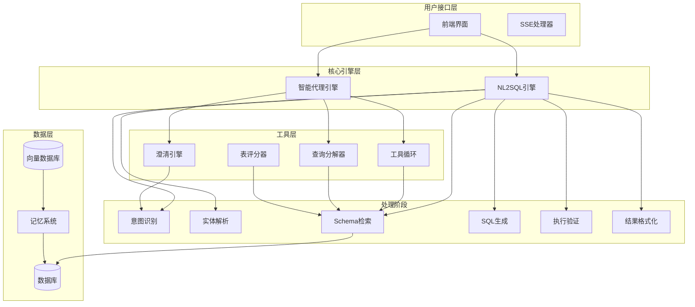
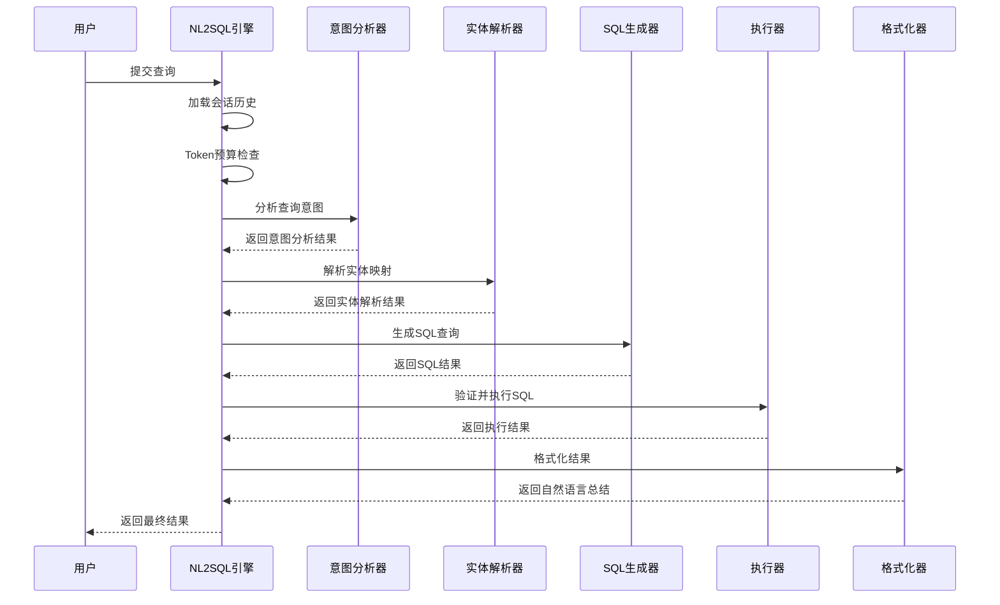
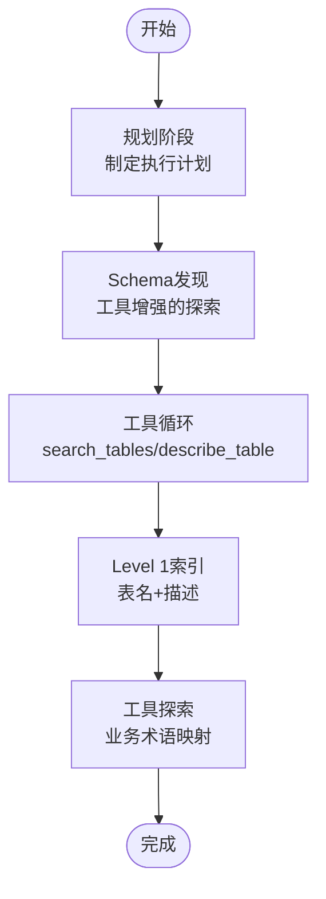
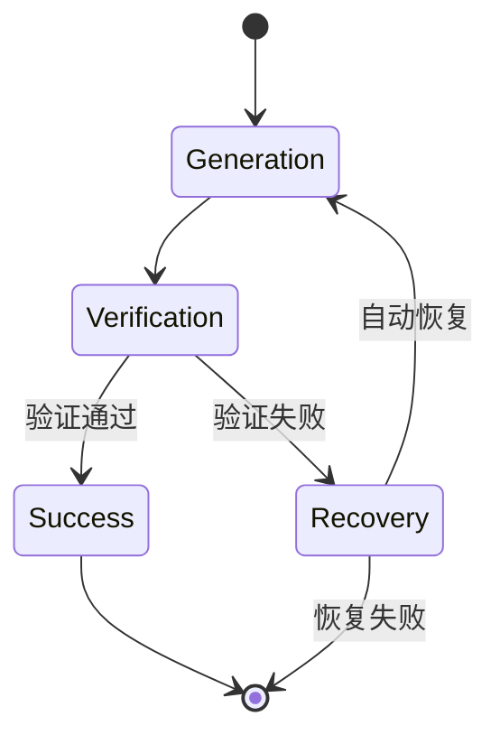
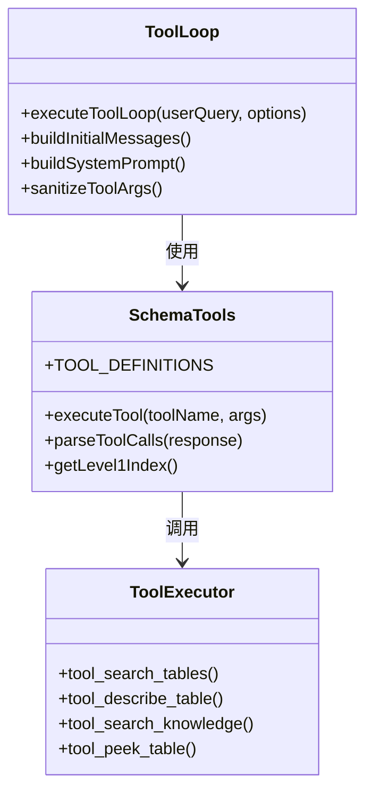
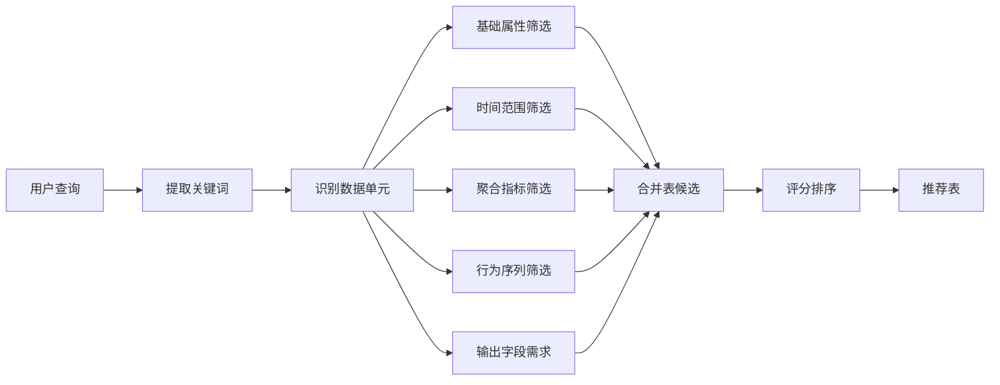
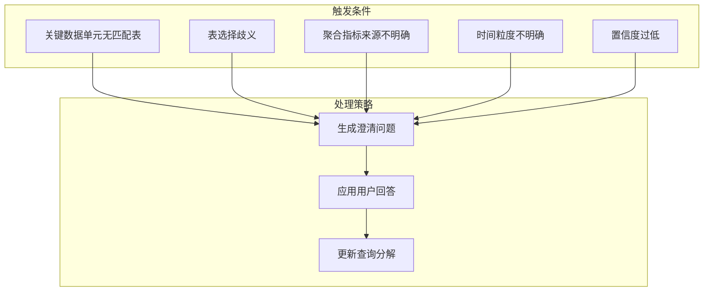
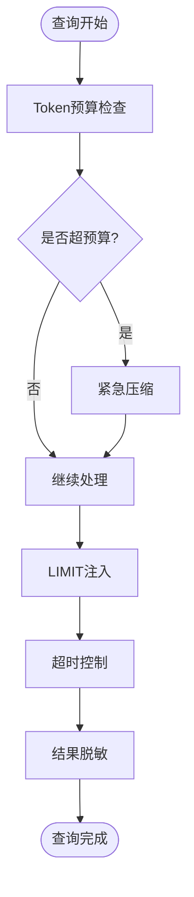
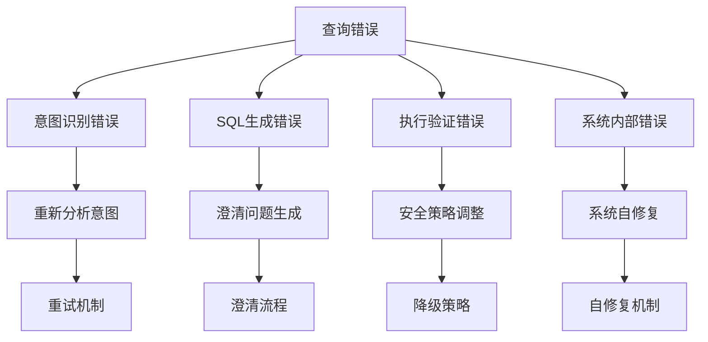

# 核心引擎模块

<cite>
**本文档引用的文件**
- [nl2sqlEngine.js](file://backend/src/core/nl2sqlEngine.js)
- [agenticEngine.js](file://backend/src/core/agenticEngine.js)
- [toolLoop.js](file://backend/src/core/toolLoop.js)
- [clarificationEngine.js](file://backend/src/core/clarificationEngine.js)
- [queryDecomposer.js](file://backend/src/core/queryDecomposer.js)
- [schemaTools.js](file://backend/src/core/schemaTools.js)
- [sqlGenerator.js](file://backend/src/core/sqlGenerator.js)
- [sqlExecutor.js](file://backend/src/core/sqlExecutor.js)
- [resultFormatter.js](file://backend/src/core/resultFormatter.js)
- [intentAnalyzer.js](file://backend/src/core/intentAnalyzer.js)
- [entityResolver.js](file://backend/src/core/entityResolver.js)
- [tableRanker.js](file://backend/src/core/tableRanker.js)
- [selfRepair.js](file://backend/src/core/selfRepair.js)
- [semanticLayer.js](file://backend/src/core/semanticLayer.js)
</cite>

## 目录
1. [项目概述](#项目概述)
2. [系统架构](#系统架构)
3. [核心组件详解](#核心组件详解)
4. [智能代理工作流](#智能代理工作流)
5. [工具循环机制](#工具循环机制)
6. [动态意图拆解](#动态意图拆解)
7. [澄清引擎](#澄清引擎)
8. [性能优化策略](#性能优化策略)
9. [错误处理与调试](#错误处理与调试)
10. [最佳实践指南](#最佳实践指南)

## 项目概述

NL2SQL 核心引擎模块是一个基于人工智能的自然语言到SQL查询转换系统，采用四阶段处理机制和智能代理工作流。该系统通过意图识别、Schema检索、SQL生成、验证执行和结果格式化五个核心阶段，实现了从自然语言查询到结构化SQL执行的完整自动化流程。

### 核心特性

- **多阶段处理机制**：将复杂的查询转换过程分解为五个清晰的处理阶段
- **智能代理工作流**：实现Plan → Act → Observe的循环机制
- **动态意图拆解**：根据查询内容动态分解为可独立检索的数据需求单元
- **工具循环机制**：支持LLM工具调用的循环执行
- **澄清引擎**：智能识别和处理查询中的不确定性因素
- **统一表评分系统**：融合多种信号源进行表候选评分和选择

## 系统架构

**图表来源**
- [nl2sqlEngine.js:111-734](file://backend/src/core/nl2sqlEngine.js#L111-L734)
- [agenticEngine.js:70-215](file://backend/src/core/agenticEngine.js#L70-L215)

## 核心组件详解

### NL2SQL引擎主流程

NL2SQL引擎作为核心编排器，实现了完整的四阶段处理机制：

**图表来源**
- [nl2sqlEngine.js:121-734](file://backend/src/core/nl2sqlEngine.js#L121-L734)

#### 阶段一：意图识别与上下文理解

意图识别模块负责从用户查询中提取关键信息：

- **时间范围识别**：支持相对和绝对时间格式
- **指标提取**：识别用户关注的业务指标
- **维度分析**：确定查询的分组维度
- **过滤条件**：提取筛选条件和约束
- **置信度评估**：量化意图理解的准确性

#### 阶段二：实体解析与映射

实体解析模块处理业务实体的识别和映射：

- **游戏ID解析**：将游戏名称映射到具体ID
- **渠道识别**：解析渠道相关信息
- **平台术语**：处理新平台/老平台等业务术语
- **别名学习**：从上下文中学习用户自定义映射

#### 阶段三：Schema检索与SQL生成

Schema检索模块实现智能表候选发现：

- **向量检索**：基于语义相似性的表匹配
- **关键词匹配**：基于关键词的精确匹配
- **业务语义层**：结合业务概念进行表推荐
- **统一评分**：融合多种信号源进行综合评分

#### 阶段四：验证执行与结果格式化

验证执行模块确保查询的安全性和正确性：

- **SQL验证**：检查语法和安全合规性
- **行级安全**：实施租户过滤和访问控制
- **执行优化**：限制查询结果数量和执行时间
- **结果格式化**：将技术结果转换为自然语言描述

**章节来源**
- [nl2sqlEngine.js:111-734](file://backend/src/core/nl2sqlEngine.js#L111-L734)
- [intentAnalyzer.js:173-468](file://backend/src/core/intentAnalyzer.js#L173-L468)
- [entityResolver.js:67-448](file://backend/src/core/entityResolver.js#L67-L448)
- [sqlGenerator.js:84-479](file://backend/src/core/sqlGenerator.js#L84-L479)
- [sqlExecutor.js:34-169](file://backend/src/core/sqlExecutor.js#L34-L169)
- [resultFormatter.js:12-43](file://backend/src/core/resultFormatter.js#L12-L43)

## 智能代理工作流

智能代理引擎实现了四阶段的多步骤推理和恢复机制：

### Phase 1: 规划与Schema发现

**图表来源**
- [agenticEngine.js:228-349](file://backend/src/core/agenticEngine.js#L228-L349)
- [toolLoop.js:75-203](file://backend/src/core/toolLoop.js#L75-L203)

### Phase 2: 动态意图拆解

查询分解器将复杂查询拆分为独立的数据需求单元：

- **动态拆解**：不预设固定类型，适应任意复杂查询
- **数据单元识别**：基础属性筛选、时间范围、聚合指标等
- **独立检索**：为每个数据单元独立检索相关表
- **合并策略**：基于覆盖率和频率的综合评分

### Phase 3: 澄清与确认

澄清引擎智能识别和处理查询中的不确定性：

- **触发条件检测**：无匹配表、表选择歧义、聚合来源不明确等
- **问题生成**：生成友好的澄清问题和选项
- **答案应用**：将用户回答应用到查询分解结果中

### Phase 4: 生成、验证与恢复

**图表来源**
- [agenticEngine.js:432-773](file://backend/src/core/agenticEngine.js#L432-L773)

**章节来源**
- [agenticEngine.js:54-215](file://backend/src/core/agenticEngine.js#L54-L215)
- [queryDecomposer.js:41-73](file://backend/src/core/queryDecomposer.js#L41-L73)
- [clarificationEngine.js:196-232](file://backend/src/core/clarificationEngine.js#L196-L232)

## 工具循环机制

工具循环机制实现了LLM与Schema探索工具的智能交互：

### 工具定义与执行

**图表来源**
- [toolLoop.js:75-203](file://backend/src/core/toolLoop.js#L75-L203)
- [schemaTools.js:40-124](file://backend/src/core/schemaTools.js#L40-L124)

### 工具循环流程

工具循环支持最多5次迭代，每次迭代包含以下步骤：

1. **LLM调用**：发送包含工具定义的消息
2. **工具调用解析**：解析LLM的工具调用请求
3. **工具执行**：执行解析到的工具调用
4. **结果反馈**：将工具执行结果返回给LLM
5. **循环控制**：重复直到LLM不再请求工具调用

**章节来源**
- [toolLoop.js:59-203](file://backend/src/core/toolLoop.js#L59-L203)
- [schemaTools.js:565-631](file://backend/src/core/schemaTools.js#L565-L631)

## 动态意图拆解

查询分解器实现了智能的动态意图拆解机制：

### 数据单元识别

**图表来源**
- [queryDecomposer.js:155-201](file://backend/src/core/queryDecomposer.js#L155-L201)
- [queryDecomposer.js:258-302](file://backend/src/core/queryDecomposer.js#L258-L302)

### 表候选合并策略

统一评分系统融合四种信号源：

- **向量检索结果**：基于语义相似性的表匹配
- **业务语义层推荐**：概念匹配得到的表推荐
- **关键词命中计数**：查询关键词与表的匹配程度
- **显式表名**：查询中直接提到的表名

**章节来源**
- [queryDecomposer.js:258-435](file://backend/src/core/queryDecomposer.js#L258-L435)
- [tableRanker.js:244-270](file://backend/src/core/tableRanker.js#L244-L270)

## 澄清引擎

澄清引擎实现了智能的查询不确定性处理机制：

### 澄清触发条件

**图表来源**
- [clarificationEngine.js:26-182](file://backend/src/core/clarificationEngine.js#L26-L182)

### 澄清问题生成

澄清引擎支持多种类型的澄清问题：

- **表选择澄清**：当存在多个可能的数据来源时
- **指标来源澄清**：当聚合指标可以使用不同数据源计算时  
- **时间粒度澄清**：当时间统计维度不明确时
- **通用澄清**：处理其他类型的不确定性

**章节来源**
- [clarificationEngine.js:196-428](file://backend/src/core/clarificationEngine.js#L196-L428)

## 性能优化策略

### Token预算管理

系统实现了智能的Token预算检查和压缩机制：

- **预算计算**：基于系统提示词、历史记录和检索片段计算总Token数
- **紧急压缩**：当超出预算时自动触发压缩策略
- **历史压缩**：长对话自动压缩以节省Token

### 查询优化

**图表来源**
- [nl2sqlEngine.js:214-252](file://backend/src/core/nl2sqlEngine.js#L214-L252)

### 缓存策略

- **Level 1索引缓存**：缓存表名和描述信息
- **查询向量缓存**：存储用户查询的向量表示
- **长期记忆缓存**：缓存用户偏好和别名映射

**章节来源**
- [nl2sqlEngine.js:214-252](file://backend/src/core/nl2sqlEngine.js#L214-L252)
- [schemaTools.js:154-173](file://backend/src/core/schemaTools.js#L154-L173)

## 错误处理与调试

### 错误分类与处理

系统实现了多层次的错误处理机制：

**图表来源**
- [nl2sqlEngine.js:54-105](file://backend/src/core/nl2sqlEngine.js#L54-L105)

### 自修复机制

系统具备自动监控和维护能力：

- **每日自检**：检查数据库连接、向量数据库、查询统计等
- **会话清理**：定期清理过期会话数据
- **记忆维护**：压缩和清理过期记忆
- **死信队列处理**：扫描和告警待处理的死信记录

**章节来源**
- [nl2sqlEngine.js:54-105](file://backend/src/core/nl2sqlEngine.js#L54-L105)
- [selfRepair.js:215-427](file://backend/src/core/selfRepair.js#L215-L427)

## 最佳实践指南

### 开发者使用模式

1. **模块导入**：通过模块导出接口使用核心功能
2. **错误处理**：捕获NL2SQLError异常并进行适当处理
3. **进度监控**：使用onProgress回调监控处理进度
4. **上下文传递**：正确传递用户ID和会话上下文

### 性能优化建议

1. **合理使用缓存**：充分利用Level 1索引和查询向量缓存
2. **控制查询复杂度**：避免过于复杂的查询，必要时进行拆分
3. **优化Token使用**：合理设计提示词，避免不必要的信息传递
4. **监控系统健康**：定期检查系统自检报告和错误统计

### 调试技巧

1. **日志分析**：利用详细的日志信息定位问题
2. **进度跟踪**：通过onProgress回调监控处理状态
3. **错误码分析**：根据错误码快速定位问题类型
4. **性能分析**：监控执行时间和资源使用情况

**章节来源**
- [nl2sqlEngine.js:740-755](file://backend/src/core/nl2sqlEngine.js#L740-L755)
- [selfRepair.js:65-183](file://backend/src/core/selfRepair.js#L65-L183)