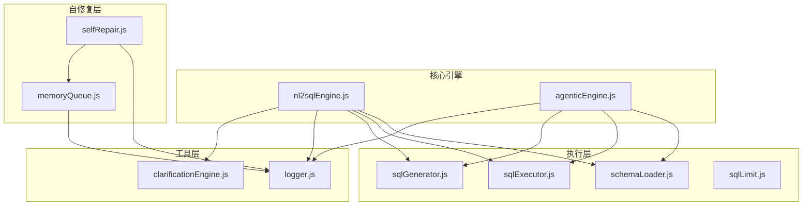
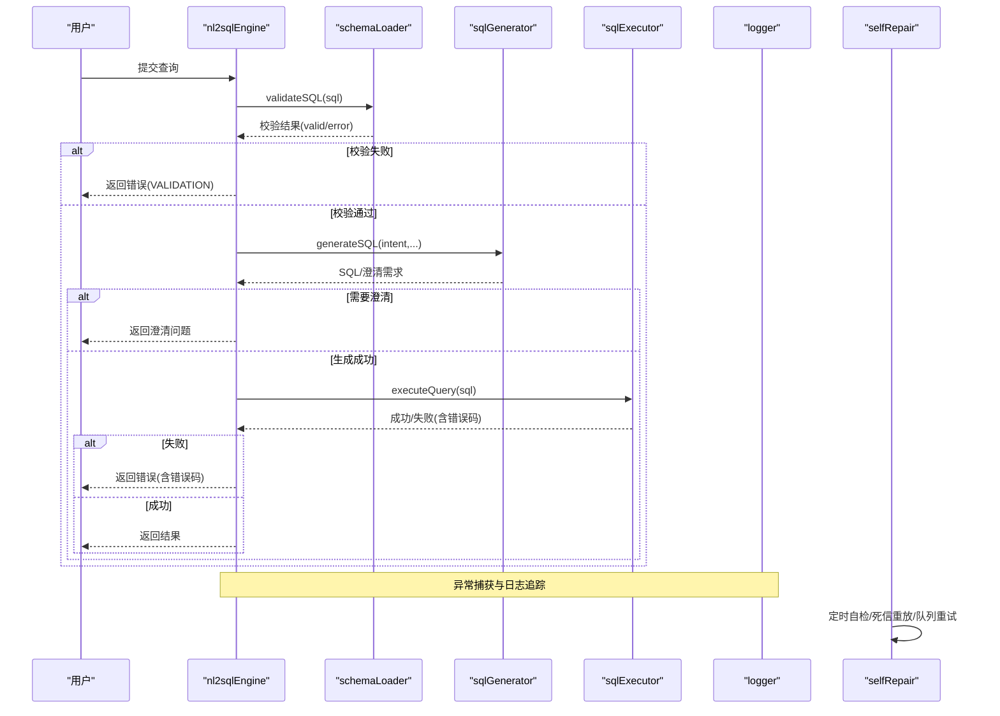
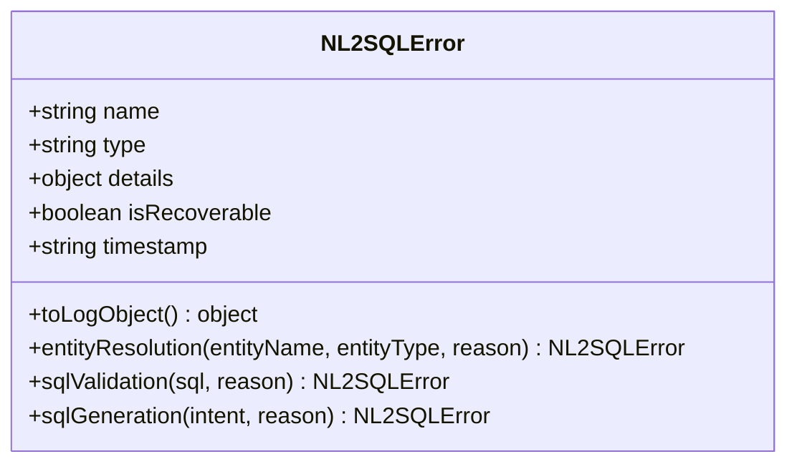
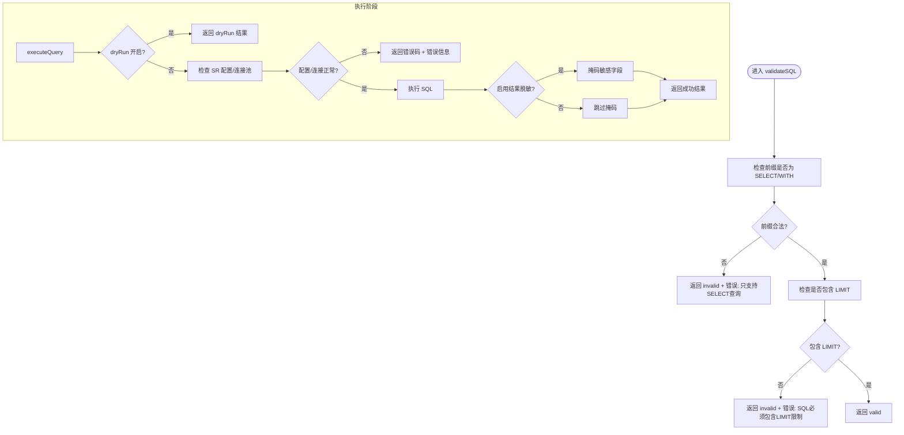
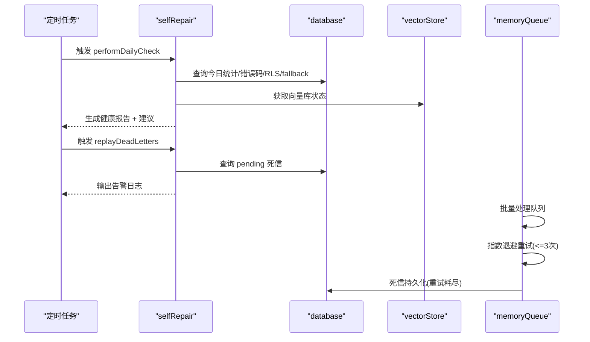
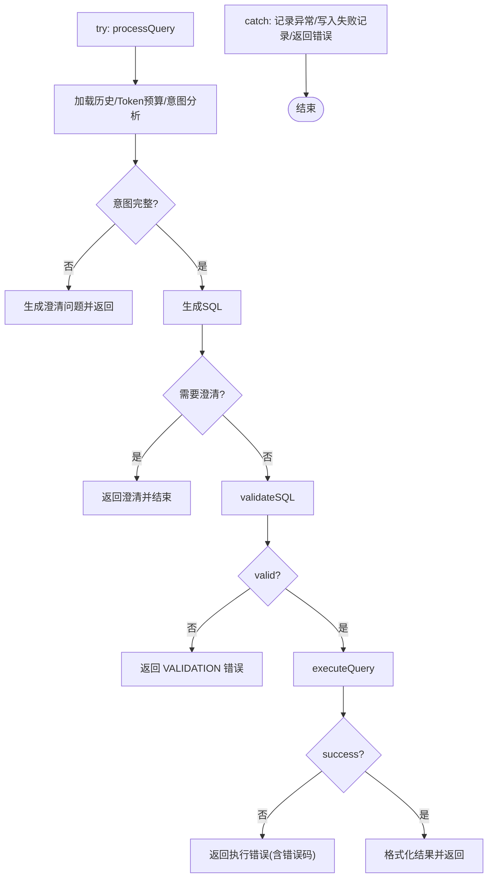
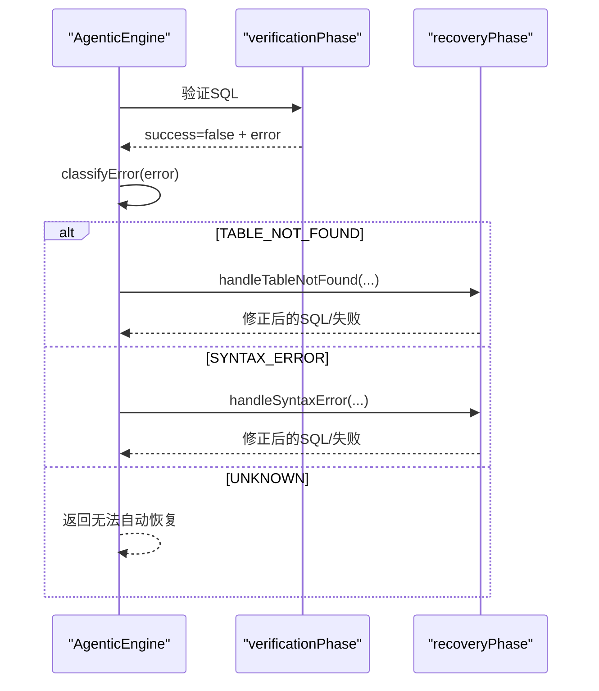
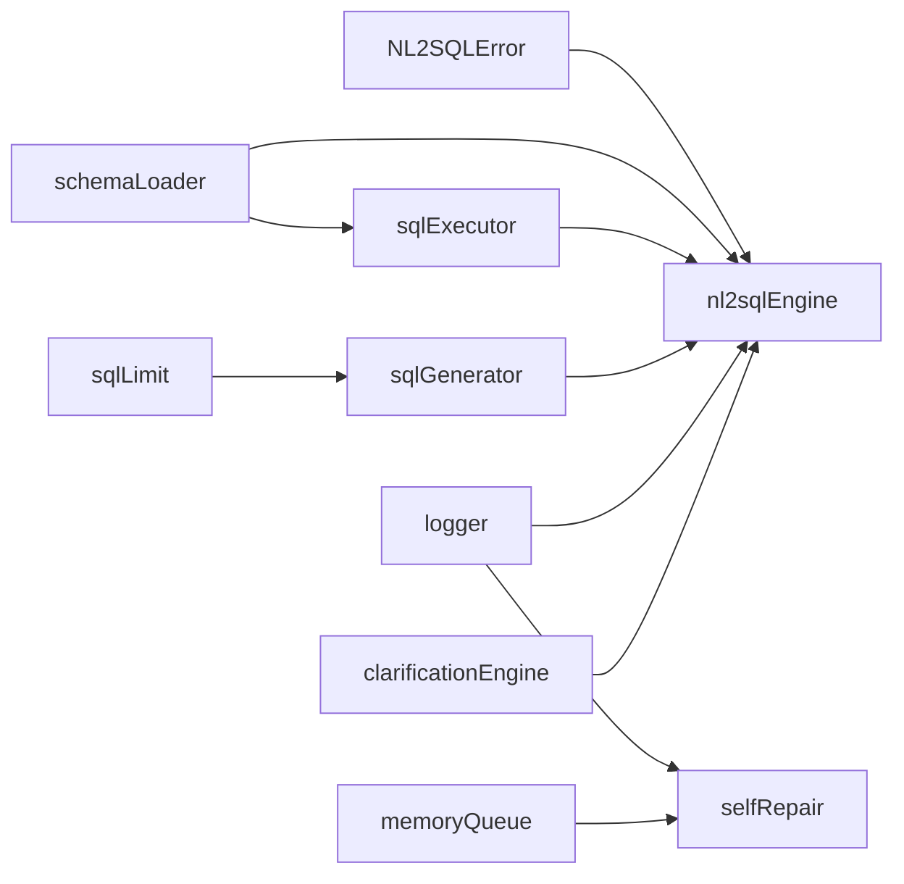

# 错误处理与恢复

<cite>
**本文引用的文件**
- [nl2sqlEngine.js](file://backend/src/core/nl2sqlEngine.js)
- [selfRepair.js](file://backend/src/core/selfRepair.js)
- [sqlExecutor.js](file://backend/src/core/sqlExecutor.js)
- [logger.js](file://backend/src/utils/logger.js)
- [schemaLoader.js](file://backend/src/core/schemaLoader.js)
- [sqlGenerator.js](file://backend/src/core/sqlGenerator.js)
- [memoryQueue.js](file://backend/src/memory/memoryQueue.js)
- [agenticEngine.js](file://backend/src/core/agenticEngine.js)
- [sqlLimit.js](file://backend/src/utils/sqlLimit.js)
- [clarificationEngine.js](file://backend/src/core/clarificationEngine.js)
</cite>

## 目录
1. [简介](#简介)
2. [项目结构](#项目结构)
3. [核心组件](#核心组件)
4. [架构总览](#架构总览)
5. [详细组件分析](#详细组件分析)
6. [依赖分析](#依赖分析)
7. [性能考量](#性能考量)
8. [故障排查指南](#故障排查指南)
9. [结论](#结论)

## 简介
本文聚焦 NL2SQL 核心引擎中的错误处理与恢复机制，系统梳理 NL2SQLError 类设计、错误分类与可恢复性标记，详解实体解析错误、SQL 验证错误、SQL 生成错误等处理策略，并深入阐述自修复机制（自检、死信重放、队列重试与降级）的实现原理与最佳实践，帮助开发者理解并扩展系统的健壮性与可维护性。

## 项目结构
NL2SQL 的错误处理与恢复分布在多个层次：
- 核心引擎层：统一错误类型定义与主流程编排，负责错误捕获与上报。
- 执行层：SQL 验证与执行，产出标准化错误码与结果。
- 工具层：日志追踪、SQL 限制注入、澄清引擎等辅助能力。
- 自修复层：定时任务、死信队列、队列重试与降级策略。

图表来源
- [nl2sqlEngine.js:1-756](file://backend/src/core/nl2sqlEngine.js#L1-L756)
- [agenticEngine.js:1-200](file://backend/src/core/agenticEngine.js#L1-L200)
- [schemaLoader.js:749-785](file://backend/src/core/schemaLoader.js#L749-L785)
- [sqlExecutor.js:34-169](file://backend/src/core/sqlExecutor.js#L34-L169)
- [sqlGenerator.js:84-479](file://backend/src/core/sqlGenerator.js#L84-L479)
- [sqlLimit.js:1-37](file://backend/src/utils/sqlLimit.js#L1-L37)
- [logger.js:276-448](file://backend/src/utils/logger.js#L276-L448)
- [clarificationEngine.js:196-200](file://backend/src/core/clarificationEngine.js#L196-L200)
- [selfRepair.js:215-427](file://backend/src/core/selfRepair.js#L215-L427)
- [memoryQueue.js:66-215](file://backend/src/memory/memoryQueue.js#L66-L215)

章节来源
- [nl2sqlEngine.js:1-756](file://backend/src/core/nl2sqlEngine.js#L1-L756)
- [agenticEngine.js:1-200](file://backend/src/core/agenticEngine.js#L1-L200)

## 核心组件
- NL2SQLError：统一错误类型定义，包含类型、详情、可恢复性标记与日志对象导出。
- SQL 验证与执行：安全白名单、前缀与 LIMIT 校验，标准化错误码与结果结构。
- 自修复机制：定时自检、死信重放、队列重试与降级。
- 日志追踪：流程级 trace 记录，便于定位错误根因。
- 澄清引擎：在 SQL 生成阶段主动触发澄清，降低后续验证失败概率。

章节来源
- [nl2sqlEngine.js:54-105](file://backend/src/core/nl2sqlEngine.js#L54-L105)
- [sqlExecutor.js:34-169](file://backend/src/core/sqlExecutor.js#L34-L169)
- [selfRepair.js:215-427](file://backend/src/core/selfRepair.js#L215-L427)
- [logger.js:276-448](file://backend/src/utils/logger.js#L276-L448)
- [clarificationEngine.js:196-200](file://backend/src/core/clarificationEngine.js#L196-L200)

## 架构总览
NL2SQL 的错误处理与恢复遵循“统一错误类型 + 分层验证 + 主动澄清 + 自修复”的设计思路。核心流程在引擎层捕获异常并生成统一错误对象，执行层提供安全校验与标准化错误码，自修复层通过定时任务与队列机制保障系统健康与可观测性。

图表来源
- [nl2sqlEngine.js:486-504](file://backend/src/core/nl2sqlEngine.js#L486-L504)
- [nl2sqlEngine.js:552-558](file://backend/src/core/nl2sqlEngine.js#L552-L558)
- [schemaLoader.js:749-785](file://backend/src/core/schemaLoader.js#L749-L785)
- [sqlExecutor.js:72-169](file://backend/src/core/sqlExecutor.js#L72-L169)
- [logger.js:276-448](file://backend/src/utils/logger.js#L276-L448)
- [selfRepair.js:215-427](file://backend/src/core/selfRepair.js#L215-L427)

## 详细组件分析

### NL2SQLError 类设计
- 设计目标：统一错误类型、携带可恢复性标记、便于日志与审计。
- 关键字段：
  - type：错误类型（如 ENTITY_RESOLUTION、VALIDATION、SQL_GENERATION）。
  - details：错误详情（实体名、原因、SQL、意图等）。
  - isRecoverable：是否可自动恢复（true/false）。
  - timestamp：错误发生时间。
  - toLogObject：导出结构化日志对象。
- 静态工厂方法：
  - entityResolution(entityName, entityType, reason)：实体解析错误，可恢复。
  - sqlValidation(sql, reason)：SQL 验证失败，不可恢复。
  - sqlGeneration(intent, reason)：SQL 生成失败，可恢复。

图表来源
- [nl2sqlEngine.js:54-105](file://backend/src/core/nl2sqlEngine.js#L54-L105)

章节来源
- [nl2sqlEngine.js:54-105](file://backend/src/core/nl2sqlEngine.js#L54-L105)

### SQL 验证与执行错误处理
- 验证规则：
  - 白名单与禁止关键字检查。
  - 仅允许 SELECT/WITH 前缀。
  - 必须包含 LIMIT（由 sqlLimit 确保）。
- 执行错误码：
  - DRY_RUN：DryRun 模式。
  - SR_DB_NOT_CONFIGURED：SR 数据源未配置。
  - SR_DB_NOT_READY：SR 数据源连接池未就绪。
  - SR_EXEC_ERROR：执行异常。
- 结果脱敏：可选开启，对敏感字段进行掩码处理。

图表来源
- [schemaLoader.js:749-785](file://backend/src/core/schemaLoader.js#L749-L785)
- [sqlExecutor.js:34-169](file://backend/src/core/sqlExecutor.js#L34-L169)
- [sqlLimit.js:16-34](file://backend/src/utils/sqlLimit.js#L16-L34)

章节来源
- [schemaLoader.js:749-785](file://backend/src/core/schemaLoader.js#L749-L785)
- [sqlExecutor.js:34-169](file://backend/src/core/sqlExecutor.js#L34-L169)
- [sqlLimit.js:16-34](file://backend/src/utils/sqlLimit.js#L16-L34)

### 自修复机制（定时任务与队列）
- 定时自检：每日执行，检查数据库连接、向量库、查询统计、失败率、慢查询阈值、RLS 生效情况、fallback 使用率、死信队列积压等，并生成可操作建议。
- 死信重放：周期扫描 memory_failed_queue 待处理记录，输出告警信息，便于人工审阅。
- 内存队列重试：指数退避（100ms → 400ms → 1600ms），最多 3 次；超限直接入死信，避免 OOM；提供队列指标（入队、成功、重试、死信、拒绝）。

图表来源
- [selfRepair.js:215-427](file://backend/src/core/selfRepair.js#L215-L427)
- [selfRepair.js:596-618](file://backend/src/core/selfRepair.js#L596-L618)
- [memoryQueue.js:107-215](file://backend/src/memory/memoryQueue.js#L107-L215)

章节来源
- [selfRepair.js:215-427](file://backend/src/core/selfRepair.js#L215-L427)
- [selfRepair.js:596-618](file://backend/src/core/selfRepair.js#L596-L618)
- [memoryQueue.js:107-215](file://backend/src/memory/memoryQueue.js#L107-L215)

### 主流程中的错误捕获与恢复
- 主流程在 try/catch 中捕获异常，记录 trace 并写入 query_history 失败记录，返回统一错误响应。
- SQL 验证失败时直接返回错误，不进入执行阶段。
- 执行阶段失败时写入失败记录并返回错误，包含错误码以便自修复分析。

图表来源
- [nl2sqlEngine.js:157-734](file://backend/src/core/nl2sqlEngine.js#L157-L734)
- [nl2sqlEngine.js:486-504](file://backend/src/core/nl2sqlEngine.js#L486-L504)
- [nl2sqlEngine.js:552-558](file://backend/src/core/nl2sqlEngine.js#L552-L558)

章节来源
- [nl2sqlEngine.js:157-734](file://backend/src/core/nl2sqlEngine.js#L157-L734)

### Agentic 引擎的错误恢复
- 分类错误：基于错误消息识别 TABLE_NOT_FOUND、SYNTAX_ERROR 等。
- 恢复策略：
  - TABLE_NOT_FOUND：尝试修正表名或切换数据源。
  - SYNTAX_ERROR：调整 SQL 结构或提示用户修正。
  - UNKNOWN：返回无法自动恢复的错误信息。
- 与主流程互补：Agentic 独立成功路径单独写入审计，失败路径由 SSE fallback 写入，避免重复审计。

图表来源
- [agenticEngine.js:679-730](file://backend/src/core/agenticEngine.js#L679-L730)

章节来源
- [agenticEngine.js:679-730](file://backend/src/core/agenticEngine.js#L679-L730)

### 澄清引擎与错误预防
- 澄清触发条件：数据单元无匹配表、表歧义、聚合来源不确定、时间粒度不明确、置信度过低。
- 通过生成友好问题与建议选项，降低后续验证失败概率，减少错误发生。

章节来源
- [clarificationEngine.js:196-200](file://backend/src/core/clarificationEngine.js#L196-L200)

## 依赖分析
- NL2SQLError 作为统一错误类型，被主流程与各子模块使用，确保日志与审计一致性。
- SQL 验证依赖 schemaLoader 的白名单与关键字检查；执行依赖 srDatabase 与 maskResult。
- 自修复依赖数据库与向量存储状态，提供健康报告与死信重放。
- 日志追踪贯穿全流程，traceStep 与 endTrace 提供细粒度可观测性。

图表来源
- [nl2sqlEngine.js:54-105](file://backend/src/core/nl2sqlEngine.js#L54-L105)
- [schemaLoader.js:749-785](file://backend/src/core/schemaLoader.js#L749-L785)
- [sqlExecutor.js:34-169](file://backend/src/core/sqlExecutor.js#L34-L169)
- [sqlGenerator.js:84-479](file://backend/src/core/sqlGenerator.js#L84-L479)
- [sqlLimit.js:16-34](file://backend/src/utils/sqlLimit.js#L16-L34)
- [logger.js:276-448](file://backend/src/utils/logger.js#L276-L448)
- [selfRepair.js:215-427](file://backend/src/core/selfRepair.js#L215-L427)
- [memoryQueue.js:107-215](file://backend/src/memory/memoryQueue.js#L107-L215)
- [clarificationEngine.js:196-200](file://backend/src/core/clarificationEngine.js#L196-L200)

章节来源
- [nl2sqlEngine.js:54-105](file://backend/src/core/nl2sqlEngine.js#L54-L105)

## 性能考量
- SQL 验证与执行均采用轻量级检查与标准化返回，避免额外开销。
- LIMIT 强制注入与行数限制，防止大数据集导致的性能问题。
- 自修复任务采用 Cron 调度，统计收集频率可控，避免高频 IO。
- 内存队列批处理与指数退避，平衡吞吐与稳定性。

## 故障排查指南
- 查看 trace 日志：通过 logger.startTrace/traceStep/endTrace 定位具体步骤与耗时。
- 错误码分析：结合 selfRepair.generateErrorRecommendations 与 query_history 的 error_code 字段，快速定位根因。
- 死信队列：使用 selfRepair.triggerDeadLetterReplay 扫描 pending 记录，结合 memoryQueue 指标定位异常。
- SQL 验证失败：检查白名单、禁止关键字、前缀与 LIMIT；必要时开启 DryRun 模式验证。
- 执行失败：检查 SR 数据源配置、连接池状态与超时设置；关注脱敏规则对结果的影响。

章节来源
- [logger.js:276-448](file://backend/src/utils/logger.js#L276-L448)
- [selfRepair.js:193-209](file://backend/src/core/selfRepair.js#L193-L209)
- [selfRepair.js:596-618](file://backend/src/core/selfRepair.js#L596-L618)
- [sqlExecutor.js:72-169](file://backend/src/core/sqlExecutor.js#L72-L169)
- [memoryQueue.js:254-260](file://backend/src/memory/memoryQueue.js#L254-L260)

## 结论
NL2SQL 的错误处理与恢复体系以 NL2SQLError 为核心，配合分层验证、主动澄清与自修复机制，实现了从“可观察性到可恢复性”的闭环。通过标准化错误码、结构化日志与定时自检，系统能够在复杂场景下保持稳定与可维护性。建议在扩展新功能时遵循统一错误类型与日志规范，持续完善自修复策略与队列治理，进一步提升系统韧性。