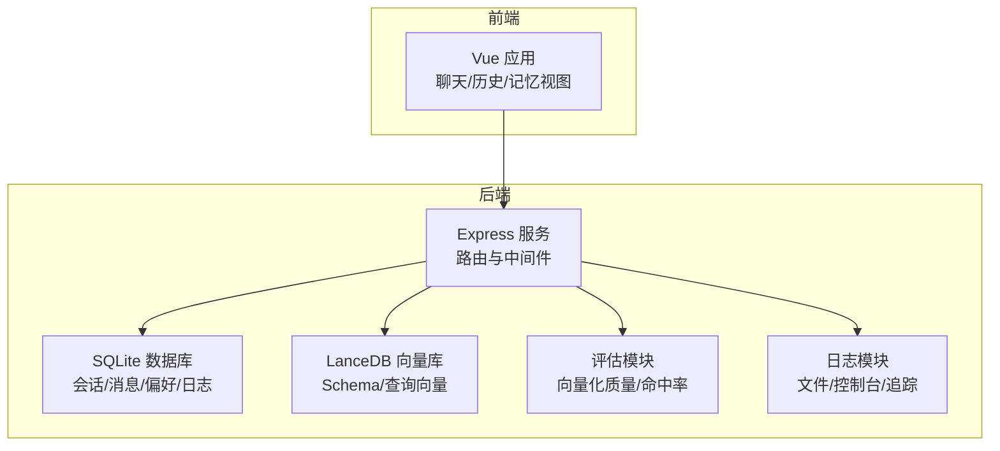
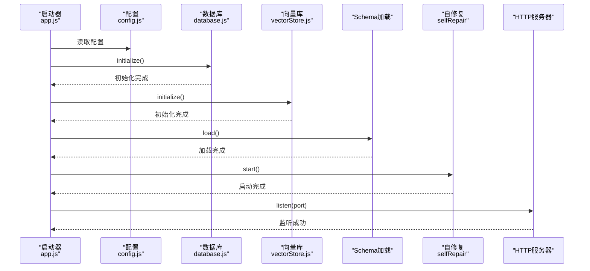
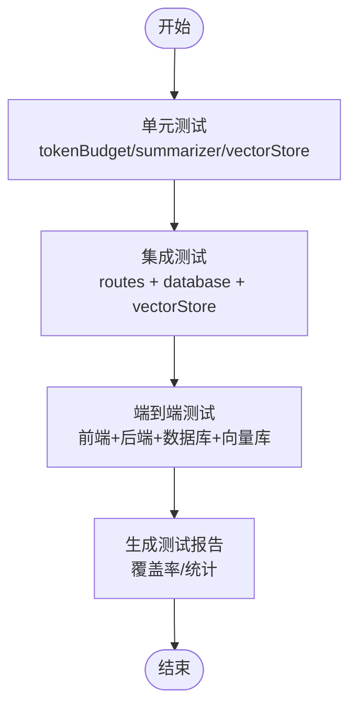
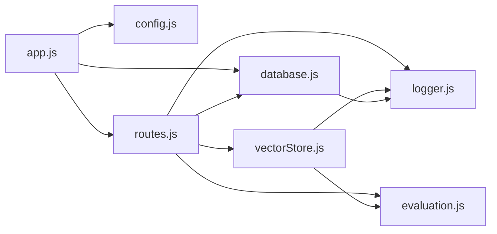

# 测试与部署

<cite>
**本文引用的文件**
- [backend/package.json](file://backend/package.json)
- [frontend/package.json](file://frontend/package.json)
- [backend/src/app.js](file://backend/src/app.js)
- [backend/src/core/config.js](file://backend/src/core/config.js)
- [backend/src/core/database.js](file://backend/src/core/database.js)
- [backend/src/core/routes.js](file://backend/src/core/routes.js)
- [backend/src/memory/vectorStore.js](file://backend/src/memory/vectorStore.js)
- [backend/src/utils/logger.js](file://backend/src/utils/logger.js)
- [backend/src/utils/evaluation.js](file://backend/src/utils/evaluation.js)
- [backend/src/utils/tokenBudget.js](file://backend/src/utils/tokenBudget.js)
- [backend/src/memory/summarizer.js](file://backend/src/memory/summarizer.js)
- [backend/src/memory/longTermMemory.js](file://backend/src/memory/longTermMemory.js)
- [backend/test/context-management.test.js](file://backend/test/context-management.test.js)
</cite>

## 目录
1. [简介](#简介)
2. [项目结构](#项目结构)
3. [核心组件](#核心组件)
4. [架构总览](#架构总览)
5. [详细组件分析](#详细组件分析)
6. [依赖分析](#依赖分析)
7. [性能考虑](#性能考虑)
8. [故障排除指南](#故障排除指南)
9. [结论](#结论)
10. [附录](#附录)

## 简介
本文件面向 NL2SQL 项目的测试与部署，围绕后端服务的测试策略与实施方法展开，覆盖单元测试、集成测试与端到端测试的组织与执行；阐述测试环境搭建、测试数据准备与自动化测试流程；提供开发、测试、生产三类环境的配置差异与部署指南；说明容器化部署、CI/CD 流水线与监控配置；给出性能测试、负载测试与压力测试方法；解释日志记录、错误追踪与故障排除策略；并提供升级、回滚与灾难恢复建议。

## 项目结构
NL2SQL 采用前后端分离架构：
- 后端（Node.js + Express）：提供 REST API、健康检查、Schema 管理、会话与偏好管理、评估统计、向量检索与长期记忆等能力。
- 前端（Vue 3 + Vite）：提供聊天界面、Schema 查看、历史与记忆管理等视图。
- 测试：后端提供上下文管理功能的测试脚本，覆盖 Token 预算、摘要与向量元数据增强等模块。

图表来源
- [backend/src/app.js:1-238](file://backend/src/app.js#L1-L238)
- [backend/src/core/routes.js:1-800](file://backend/src/core/routes.js#L1-L800)
- [backend/src/core/database.js:1-850](file://backend/src/core/database.js#L1-L850)
- [backend/src/memory/vectorStore.js:1-759](file://backend/src/memory/vectorStore.js#L1-L759)
- [backend/src/utils/logger.js:1-442](file://backend/src/utils/logger.js#L1-L442)
- [backend/src/utils/evaluation.js:1-488](file://backend/src/utils/evaluation.js#L1-L488)

章节来源
- [backend/src/app.js:1-238](file://backend/src/app.js#L1-L238)
- [backend/src/core/routes.js:1-800](file://backend/src/core/routes.js#L1-L800)
- [backend/src/core/database.js:1-850](file://backend/src/core/database.js#L1-L850)
- [backend/src/memory/vectorStore.js:1-759](file://backend/src/memory/vectorStore.js#L1-L759)
- [backend/src/utils/logger.js:1-442](file://backend/src/utils/logger.js#L1-L442)
- [backend/src/utils/evaluation.js:1-488](file://backend/src/utils/evaluation.js#L1-L488)

## 核心组件
- 配置中心：集中管理端口、LLM/Embedding、数据库、安全、日志、自修复、Schema、长期记忆、上下文管理、评估等配置，并在启动时校验必要项。
- 数据库：SQLite 管理会话、消息、查询历史、用户偏好与系统日志，提供事务、迁移与索引优化。
- 向量存储：LanceDB 存储 Schema 与查询向量，支持智能搜索与元数据增强。
- 上下文管理：Token 预算估算与压缩、对话摘要与缓存、历史裁剪。
- 评估模块：向量化质量评估（Schema/查询相似度）、运行时统计与命中率报告。
- 日志模块：统一日志输出、文件轮转、结构化日志与追踪（trace）。
- 路由与中间件：健康检查、Schema 查询、会话与偏好管理、评估接口、SSE 连接统计。

章节来源
- [backend/src/core/config.js:1-398](file://backend/src/core/config.js#L1-L398)
- [backend/src/core/database.js:1-850](file://backend/src/core/database.js#L1-L850)
- [backend/src/memory/vectorStore.js:1-759](file://backend/src/memory/vectorStore.js#L1-L759)
- [backend/src/utils/tokenBudget.js:1-435](file://backend/src/utils/tokenBudget.js#L1-L435)
- [backend/src/memory/summarizer.js:1-518](file://backend/src/memory/summarizer.js#L1-L518)
- [backend/src/utils/evaluation.js:1-488](file://backend/src/utils/evaluation.js#L1-L488)
- [backend/src/utils/logger.js:1-442](file://backend/src/utils/logger.js#L1-L442)
- [backend/src/core/routes.js:1-800](file://backend/src/core/routes.js#L1-L800)

## 架构总览
后端服务启动时加载配置、初始化数据库与向量库、加载 Schema 元数据、启动自修复调度器，然后监听端口提供 REST API 与 SSE。路由模块提供健康检查、Schema 查询、会话与偏好管理、评估统计等接口。

图表来源
- [backend/src/app.js:97-166](file://backend/src/app.js#L97-L166)
- [backend/src/core/config.js:1-398](file://backend/src/core/config.js#L1-L398)
- [backend/src/core/database.js:200-261](file://backend/src/core/database.js#L200-L261)
- [backend/src/memory/vectorStore.js:231-261](file://backend/src/memory/vectorStore.js#L231-L261)

章节来源
- [backend/src/app.js:97-166](file://backend/src/app.js#L97-L166)

## 详细组件分析

### 测试策略与实施
- 单元测试：针对上下文管理（Token 预算、摘要、向量元数据）进行模块级测试，覆盖估算、预算计算、历史裁剪、摘要缓存、重要性评分、查询类型分类与元数据增强。
- 集成测试：通过路由层发起 HTTP 请求，验证健康检查、Schema 查询、会话与偏好管理、评估统计等端到端流程。
- 端到端测试：结合前端交互，验证从聊天输入到 SQL 生成与结果返回的完整链路（建议在 CI 中使用真实数据库与向量库）。

章节来源
- [backend/test/context-management.test.js:1-321](file://backend/test/context-management.test.js#L1-L321)
- [backend/src/utils/tokenBudget.js:1-435](file://backend/src/utils/tokenBudget.js#L1-L435)
- [backend/src/memory/summarizer.js:1-518](file://backend/src/memory/summarizer.js#L1-L518)
- [backend/src/memory/vectorStore.js:1-759](file://backend/src/memory/vectorStore.js#L1-L759)
- [backend/src/core/routes.js:1-800](file://backend/src/core/routes.js#L1-L800)

### 测试环境搭建与自动化
- 环境变量：通过 .env 文件设置 NODE_ENV、LLM/Embedding、数据库路径、向量库路径、日志级别、评估开关等。
- 依赖安装：后端使用 Node.js 18+，依赖 express、vectordb、sqlite3、dotenv、cors、body-parser、uuid、dayjs、node-cron；前端使用 Vue 3、Element Plus、Pinia、Axios 等。
- 启动命令：后端 dev/start 脚本分别使用 nodemon 与 node；前端 dev/build/preview 脚本使用 Vite。
- 自动化：可在 CI 中执行测试脚本，收集覆盖率与日志，失败时退出码非零。

章节来源
- [backend/package.json:1-28](file://backend/package.json#L1-L28)
- [frontend/package.json:1-36](file://frontend/package.json#L1-L36)
- [backend/src/app.js:6-16](file://backend/src/app.js#L6-L16)

### 测试数据准备
- SQLite：首次启动自动创建 sessions.db 并初始化表结构与索引；迁移逻辑修复旧表结构。
- LanceDB：首次启动自动创建 schema_vectors 与 query_vectors 表；支持智能搜索与元数据增强。
- 评估数据：提供默认 Schema 测试集与查询相似度测试对，可通过评估接口触发。

章节来源
- [backend/src/core/database.js:39-189](file://backend/src/core/database.js#L39-L189)
- [backend/src/core/database.js:271-336](file://backend/src/core/database.js#L271-L336)
- [backend/src/memory/vectorStore.js:267-322](file://backend/src/memory/vectorStore.js#L267-L322)
- [backend/src/utils/evaluation.js:439-459](file://backend/src/utils/evaluation.js#L439-L459)

### 配置与环境差异
- 开发环境（development）：启用详细日志、可开启评估与跟踪统计；允许跨域（生产需收紧）。
- 测试环境：与开发类似，但数据库与向量库路径可独立配置；评估功能可按需开启。
- 生产环境（production）：精简日志、严格白名单、最大查询行数与超时限制、禁止危险 SQL 关键字、敏感字段脱敏。

章节来源
- [backend/src/core/config.js:33-49](file://backend/src/core/config.js#L33-L49)
- [backend/src/core/config.js:140-170](file://backend/src/core/config.js#L140-L170)
- [backend/src/core/config.js:342-354](file://backend/src/core/config.js#L342-L354)

### 部署指南
- 开发环境：本地启动后端与前端，确保 .env 配置正确；数据库与向量库目录自动创建。
- 测试环境：使用独立数据库与向量库路径，开启评估统计以便观测向量化质量与记忆命中率。
- 生产环境：容器化部署（见下节），启用生产日志级别与安全配置，限制跨域与危险操作。

章节来源
- [backend/src/app.js:108-158](file://backend/src/app.js#L108-L158)
- [backend/src/core/config.js:195-213](file://backend/src/core/config.js#L195-L213)
- [backend/src/core/config.js:140-170](file://backend/src/core/config.js#L140-L170)

### 容器化部署与 CI/CD
- 建议使用 Docker 将后端打包为镜像，挂载数据卷（SQLite 数据库与 LanceDB 向量库目录），设置环境变量与端口映射。
- CI/CD 流水线建议包含：代码检查、单元测试、集成测试、端到端测试、构建镜像、推送镜像、部署到测试/预发布环境、健康检查与灰度发布。
- 监控：结合健康检查接口与日志模块，采集 CPU/内存/磁盘使用、SSE 连接数、向量检索命中率与评估统计。

章节来源
- [backend/src/core/routes.js:56-137](file://backend/src/core/routes.js#L56-L137)
- [backend/src/utils/logger.js:1-442](file://backend/src/utils/logger.js#L1-L442)
- [backend/src/utils/evaluation.js:344-407](file://backend/src/utils/evaluation.js#L344-L407)

### 性能测试、负载测试与压力测试
- 性能测试：评估向量化质量（Schema/查询相似度）、长期记忆命中率统计；通过评估接口与统计报告观测。
- 负载测试：模拟多用户并发查询，监控响应时间、吞吐量、数据库与向量库的查询延迟。
- 压力测试：逐步提升并发与数据规模，观察服务稳定性、慢查询阈值、自修复调度器表现与日志告警。

章节来源
- [backend/src/utils/evaluation.js:158-266](file://backend/src/utils/evaluation.js#L158-L266)
- [backend/src/utils/evaluation.js:276-334](file://backend/src/utils/evaluation.js#L276-L334)
- [backend/src/core/config.js:222-231](file://backend/src/core/config.js#L222-L231)

### 日志记录、错误追踪与故障排除
- 日志：统一输出到控制台与文件，支持级别控制、文件轮转；提供 trace 追踪（开始/步骤/结束）。
- 错误追踪：未处理异常与 Promise 拒绝均被捕获并记录，触发优雅关闭。
- 故障排除：检查健康检查接口、数据库与向量库初始化状态、评估统计与慢查询日志、SSE 连接数与内存使用。

章节来源
- [backend/src/utils/logger.js:263-408](file://backend/src/utils/logger.js#L263-L408)
- [backend/src/app.js:220-230](file://backend/src/app.js#L220-L230)
- [backend/src/core/routes.js:56-137](file://backend/src/core/routes.js#L56-L137)

### 升级、回滚与灾难恢复
- 升级：先在测试环境验证，再灰度发布；数据库迁移逻辑保证表结构一致性。
- 回滚：回退到上一个稳定镜像；如需回滚数据库，使用备份文件恢复。
- 灾难恢复：定期备份 SQLite 数据库与 LanceDB 目录；健康检查与自修复调度器保障服务可用性。

章节来源
- [backend/src/core/database.js:271-336](file://backend/src/core/database.js#L271-L336)
- [backend/src/app.js:176-212](file://backend/src/app.js#L176-L212)

## 依赖分析
后端主要依赖包括：Express（Web 框架）、vectordb（LanceDB 客户端）、sqlite3（SQLite 驱动）、dotenv（环境变量）、cors/body-parser（中间件）、uuid/dayjs（工具）、node-cron（定时任务）。前端依赖 Vue 3、Element Plus、Pinia、Axios 等。

图表来源
- [backend/src/app.js:1-50](file://backend/src/app.js#L1-L50)
- [backend/src/core/routes.js:1-36](file://backend/src/core/routes.js#L1-L36)
- [backend/src/core/database.js:1-20](file://backend/src/core/database.js#L1-L20)
- [backend/src/memory/vectorStore.js:1-22](file://backend/src/memory/vectorStore.js#L1-L22)
- [backend/src/utils/logger.js:1-24](file://backend/src/utils/logger.js#L1-L24)
- [backend/src/utils/evaluation.js:1-14](file://backend/src/utils/evaluation.js#L1-L14)

章节来源
- [backend/package.json:10-26](file://backend/package.json#L10-L26)
- [frontend/package.json:11-34](file://frontend/package.json#L11-L34)

## 性能考虑
- Token 预算：估算与压缩历史、检索片段，避免上下文超限。
- 摘要与缓存：对长对话进行摘要与缓存，降低后续请求成本。
- 向量检索：智能搜索与元数据增强，提高检索质量与效率。
- 数据库与向量库：索引优化、事务与迁移、文件轮转与容量控制。

章节来源
- [backend/src/utils/tokenBudget.js:115-181](file://backend/src/utils/tokenBudget.js#L115-L181)
- [backend/src/memory/summarizer.js:264-331](file://backend/src/memory/summarizer.js#L264-L331)
- [backend/src/memory/vectorStore.js:450-536](file://backend/src/memory/vectorStore.js#L450-L536)
- [backend/src/core/database.js:39-189](file://backend/src/core/database.js#L39-L189)

## 故障排除指南
- 启动失败：检查 .env 配置（LLM API Key、SR 数据库 URL），查看日志与健康检查。
- 数据库问题：确认 sessions.db 是否创建与权限，索引是否存在，迁移是否成功。
- 向量库问题：确认 LanceDB 目录可写，表是否创建，智能搜索是否可用。
- 评估统计：确认评估开关与跟踪开关，查看统计报告与阈值。

章节来源
- [backend/src/core/config.js:366-388](file://backend/src/core/config.js#L366-L388)
- [backend/src/core/database.js:200-261](file://backend/src/core/database.js#L200-L261)
- [backend/src/memory/vectorStore.js:231-261](file://backend/src/memory/vectorStore.js#L231-L261)
- [backend/src/utils/evaluation.js:344-407](file://backend/src/utils/evaluation.js#L344-L407)

## 结论
本文给出了 NL2SQL 项目的测试与部署实践：以单元测试为基础、集成与端到端测试为补充，配合完善的配置与日志体系；通过容器化与 CI/CD 实现自动化交付；利用评估模块与监控保障性能与质量；并提供升级、回滚与灾难恢复策略，确保系统在开发、测试与生产环境中的稳定运行。

## 附录
- 测试用例清单（来自上下文管理测试）
  - Token 估算与批量估算
  - 上下文预算计算与状态判断
  - 历史裁剪（保留最近轮数）
  - 历史分割与摘要缓存管理
  - 重要性评分与查询类型分类
  - 增强元数据构建（时间戳、重要性、类型、复杂度、执行信息、意图摘要）

章节来源
- [backend/test/context-management.test.js:43-321](file://backend/test/context-management.test.js#L43-L321)