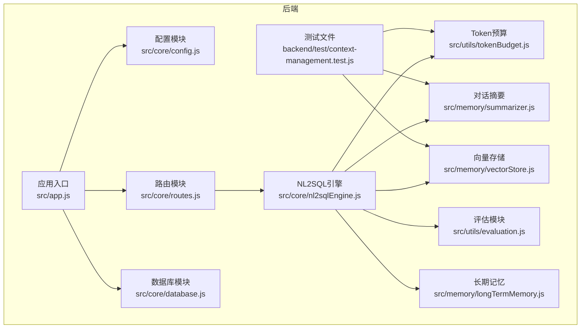
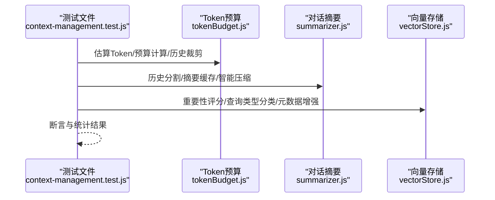
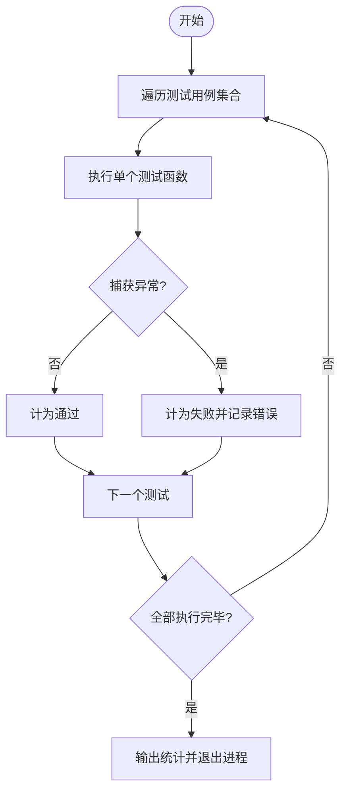
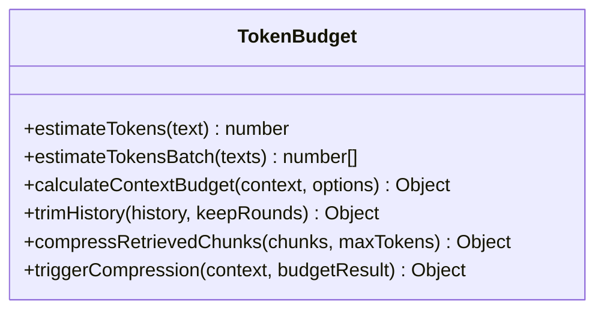
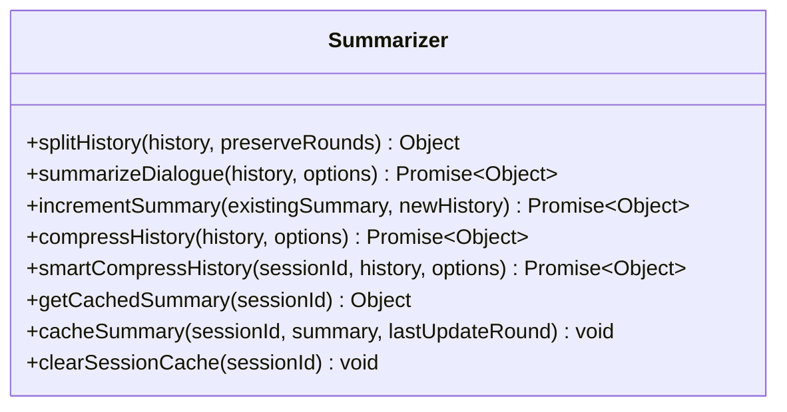
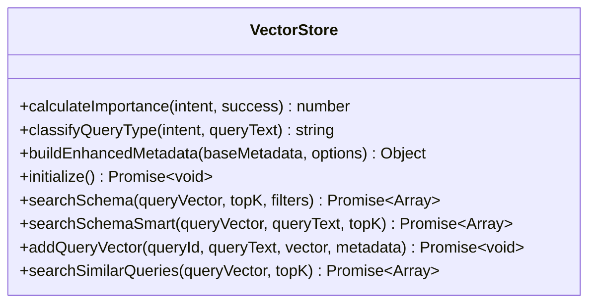
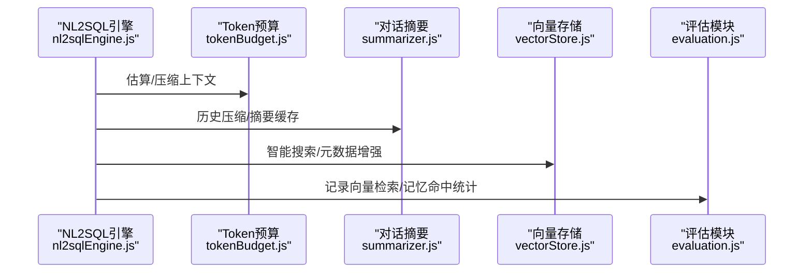
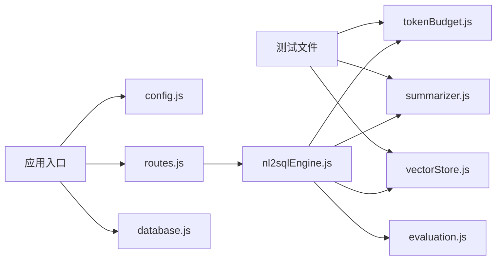

# 测试指南

<cite>
**本文引用的文件**
- [backend/package.json](file://backend/package.json)
- [backend/test/context-management.test.js](file://backend/test/context-management.test.js)
- [backend/src/app.js](file://backend/src/app.js)
- [backend/src/core/config.js](file://backend/src/core/config.js)
- [backend/src/core/routes.js](file://backend/src/core/routes.js)
- [backend/src/core/nl2sqlEngine.js](file://backend/src/core/nl2sqlEngine.js)
- [backend/src/core/database.js](file://backend/src/core/database.js)
- [backend/src/utils/tokenBudget.js](file://backend/src/utils/tokenBudget.js)
- [backend/src/utils/evaluation.js](file://backend/src/utils/evaluation.js)
- [backend/src/memory/summarizer.js](file://backend/src/memory/summarizer.js)
- [backend/src/memory/vectorStore.js](file://backend/src/memory/vectorStore.js)
- [backend/src/memory/longTermMemory.js](file://backend/src/memory/longTermMemory.js)
</cite>

## 目录
1. [简介](#简介)
2. [项目结构](#项目结构)
3. [核心组件](#核心组件)
4. [架构概览](#架构概览)
5. [详细组件分析](#详细组件分析)
6. [依赖分析](#依赖分析)
7. [性能考量](#性能考量)
8. [故障排查指南](#故障排查指南)
9. [结论](#结论)
10. [附录](#附录)

## 简介
本测试指南面向 NL2SQL 项目，系统阐述测试策略与实施方法，覆盖单元测试、集成测试与端到端测试的组织与执行。文档基于现有测试文件与核心模块，总结测试文件结构、测试用例编写规范、测试环境搭建步骤、测试运行方式、覆盖率要求、最佳实践以及常见问题解决方案，并提供测试用例编写与测试数据管理策略。

## 项目结构
后端采用模块化组织，核心模块包括配置、路由、数据库、上下文管理（Token 预算、对话摘要）、向量存储与评估等。测试集中在 backend/test 目录，当前包含上下文管理功能的测试文件。

**图表来源**
- [backend/src/app.js:1-238](file://backend/src/app.js#L1-L238)
- [backend/src/core/config.js:1-398](file://backend/src/core/config.js#L1-L398)
- [backend/src/core/routes.js:1-800](file://backend/src/core/routes.js#L1-L800)
- [backend/src/core/nl2sqlEngine.js:1-800](file://backend/src/core/nl2sqlEngine.js#L1-L800)
- [backend/src/utils/tokenBudget.js:1-435](file://backend/src/utils/tokenBudget.js#L1-L435)
- [backend/src/memory/summarizer.js:1-518](file://backend/src/memory/summarizer.js#L1-L518)
- [backend/src/memory/vectorStore.js:1-759](file://backend/src/memory/vectorStore.js#L1-L759)
- [backend/src/utils/evaluation.js:1-488](file://backend/src/utils/evaluation.js#L1-L488)
- [backend/src/memory/longTermMemory.js:1-200](file://backend/src/memory/longTermMemory.js#L1-L200)
- [backend/test/context-management.test.js:1-321](file://backend/test/context-management.test.js#L1-L321)

**章节来源**
- [backend/src/app.js:1-238](file://backend/src/app.js#L1-L238)
- [backend/src/core/config.js:1-398](file://backend/src/core/config.js#L1-L398)
- [backend/test/context-management.test.js:1-321](file://backend/test/context-management.test.js#L1-L321)

## 核心组件
- 配置模块：集中管理 LLM、数据库、向量库、安全、日志、自修复、Schema、长期记忆、上下文管理、评估等配置项，并提供配置校验。
- 路由模块：提供健康检查、Schema 查询、会话管理、查询历史、用户偏好、评估接口等 REST API。
- NL2SQL 引擎：意图识别、实体解析、SQL 生成与验证、结果格式化、澄清机制、上下文管理等。
- 上下文管理：Token 预算估算与压缩、对话历史摘要与缓存、向量存储元数据增强与查询类型分类。
- 评估模块：向量化质量评估（Schema、查询历史相似度）、运行时统计与命中率统计。
- 长期记忆：用户偏好抽取与存储（字段别名、查询模式、指标/维度偏好）。
- 数据库模块：SQLite 表结构定义与初始化。

**章节来源**
- [backend/src/core/config.js:1-398](file://backend/src/core/config.js#L1-L398)
- [backend/src/core/routes.js:1-800](file://backend/src/core/routes.js#L1-L800)
- [backend/src/core/nl2sqlEngine.js:1-800](file://backend/src/core/nl2sqlEngine.js#L1-L800)
- [backend/src/utils/tokenBudget.js:1-435](file://backend/src/utils/tokenBudget.js#L1-L435)
- [backend/src/memory/summarizer.js:1-518](file://backend/src/memory/summarizer.js#L1-L518)
- [backend/src/memory/vectorStore.js:1-759](file://backend/src/memory/vectorStore.js#L1-L759)
- [backend/src/utils/evaluation.js:1-488](file://backend/src/utils/evaluation.js#L1-L488)
- [backend/src/memory/longTermMemory.js:1-200](file://backend/src/memory/longTermMemory.js#L1-L200)
- [backend/src/core/database.js:1-200](file://backend/src/core/database.js#L1-L200)

## 架构概览
NL2SQL 服务启动后，加载配置、初始化数据库与向量库、加载 Schema 元数据、启动自修复调度器，然后监听 HTTP 端口提供 REST API。测试文件通过直接 require 核心模块进行单元测试，覆盖 Token 预算、对话摘要、向量存储元数据增强等功能。

**图表来源**
- [backend/test/context-management.test.js:1-321](file://backend/test/context-management.test.js#L1-L321)
- [backend/src/utils/tokenBudget.js:1-435](file://backend/src/utils/tokenBudget.js#L1-L435)
- [backend/src/memory/summarizer.js:1-518](file://backend/src/memory/summarizer.js#L1-L518)
- [backend/src/memory/vectorStore.js:1-759](file://backend/src/memory/vectorStore.js#L1-L759)

## 详细组件分析

### 测试文件结构与运行机制
- 测试文件采用自定义断言与同步/异步测试函数组织，包含 Token 估算、上下文预算、历史裁剪、历史分割、摘要缓存、重要性评分、查询类型分类、增强元数据等测试用例。
- 测试通过 process.exit 控制退出码，失败时返回非零退出码，便于 CI/CD 判断。

**图表来源**
- [backend/test/context-management.test.js:274-320](file://backend/test/context-management.test.js#L274-L320)

**章节来源**
- [backend/test/context-management.test.js:1-321](file://backend/test/context-management.test.js#L1-L321)

### Token 预算管理测试
- 覆盖点：空文本/空输入处理、英文/中文文本估算、批量估算、上下文预算计算（系统提示、历史、检索片段）、状态判断（警告/临界/超限）、历史裁剪、检索片段压缩、自动压缩策略。
- 断言策略：数值范围校验、布尔状态校验、结构完整性校验、建议生成合理性校验。

**图表来源**
- [backend/src/utils/tokenBudget.js:1-435](file://backend/src/utils/tokenBudget.js#L1-L435)

**章节来源**
- [backend/test/context-management.test.js:43-133](file://backend/test/context-management.test.js#L43-L133)
- [backend/src/utils/tokenBudget.js:1-435](file://backend/src/utils/tokenBudget.js#L1-L435)

### 对话摘要测试
- 覆盖点：历史分割（保留/摘要轮数）、摘要生成（LLM 调用）、增量更新、历史压缩、摘要缓存（内存缓存、过期清理、会话清理）、智能压缩（缓存命中与更新间隔）。
- 断言策略：消息数量一致性、摘要长度限制、缓存命中与过期、压缩前后 Token 数变化。

**图表来源**
- [backend/src/memory/summarizer.js:1-518](file://backend/src/memory/summarizer.js#L1-L518)

**章节来源**
- [backend/test/context-management.test.js:139-180](file://backend/test/context-management.test.js#L139-L180)
- [backend/src/memory/summarizer.js:1-518](file://backend/src/memory/summarizer.js#L1-L518)

### 向量存储元数据测试
- 覆盖点：重要性评分（意图复杂度、成功状态、置信度、上下文查询）、查询类型分类（定义/对比/趋势/澄清/跟进/新话题）、增强元数据构建（时间戳、复杂度、执行信息、意图摘要）。
- 断言策略：评分范围校验、类型分类准确性、元数据字段完整性。

**图表来源**
- [backend/src/memory/vectorStore.js:1-759](file://backend/src/memory/vectorStore.js#L1-L759)

**章节来源**
- [backend/test/context-management.test.js:186-268](file://backend/test/context-management.test.js#L186-L268)
- [backend/src/memory/vectorStore.js:1-759](file://backend/src/memory/vectorStore.js#L1-L759)

### NL2SQL 引擎与上下文管理交互
- NL2SQL 引擎依赖 Token 预算与对话摘要模块进行上下文控制，依赖向量存储模块进行语义检索与元数据增强，依赖评估模块进行运行时统计。
- 测试应关注意图识别、实体解析、澄清机制、SQL 生成与验证等流程中的上下文管理行为。

**图表来源**
- [backend/src/core/nl2sqlEngine.js:1-800](file://backend/src/core/nl2sqlEngine.js#L1-L800)
- [backend/src/utils/tokenBudget.js:1-435](file://backend/src/utils/tokenBudget.js#L1-L435)
- [backend/src/memory/summarizer.js:1-518](file://backend/src/memory/summarizer.js#L1-L518)
- [backend/src/memory/vectorStore.js:1-759](file://backend/src/memory/vectorStore.js#L1-L759)
- [backend/src/utils/evaluation.js:1-488](file://backend/src/utils/evaluation.js#L1-L488)

**章节来源**
- [backend/src/core/nl2sqlEngine.js:1-800](file://backend/src/core/nl2sqlEngine.js#L1-L800)
- [backend/src/utils/tokenBudget.js:1-435](file://backend/src/utils/tokenBudget.js#L1-L435)
- [backend/src/memory/summarizer.js:1-518](file://backend/src/memory/summarizer.js#L1-L518)
- [backend/src/memory/vectorStore.js:1-759](file://backend/src/memory/vectorStore.js#L1-L759)
- [backend/src/utils/evaluation.js:1-488](file://backend/src/utils/evaluation.js#L1-L488)

## 依赖分析
- 测试依赖：测试文件直接 require 核心模块，形成对 utils、memory、core、utils 等模块的直接依赖。
- 运行时依赖：应用启动时依赖配置、路由、数据库、向量存储、自修复等模块。
- 评估与统计：评估模块记录向量检索命中与距离分布、长期记忆命中率等统计，供运行时查询与重置。

**图表来源**
- [backend/test/context-management.test.js:10-12](file://backend/test/context-management.test.js#L10-L12)
- [backend/src/app.js:1-238](file://backend/src/app.js#L1-L238)
- [backend/src/core/config.js:1-398](file://backend/src/core/config.js#L1-L398)
- [backend/src/core/routes.js:1-800](file://backend/src/core/routes.js#L1-L800)
- [backend/src/core/nl2sqlEngine.js:1-800](file://backend/src/core/nl2sqlEngine.js#L1-L800)
- [backend/src/utils/tokenBudget.js:1-435](file://backend/src/utils/tokenBudget.js#L1-L435)
- [backend/src/memory/summarizer.js:1-518](file://backend/src/memory/summarizer.js#L1-L518)
- [backend/src/memory/vectorStore.js:1-759](file://backend/src/memory/vectorStore.js#L1-L759)
- [backend/src/utils/evaluation.js:1-488](file://backend/src/utils/evaluation.js#L1-L488)

**章节来源**
- [backend/test/context-management.test.js:10-12](file://backend/test/context-management.test.js#L10-L12)
- [backend/src/app.js:1-238](file://backend/src/app.js#L1-L238)

## 性能考量
- Token 预算与压缩：通过阈值控制与自动压缩策略，避免上下文超限导致的性能下降与错误。
- 对话摘要：对长历史进行压缩，减少 Token 使用，提升响应速度。
- 向量检索：智能搜索与元数据过滤，提高检索效率与准确性。
- 评估统计：运行时统计记录不影响主流程，但有助于持续优化系统性能。

[本节为通用指导，无需列出具体文件来源]

## 故障排查指南
- 配置校验：应用启动前进行配置校验，缺失必要配置会抛出错误，需检查 LLM API 密钥与 SR 数据库连接 URL。
- 日志级别：通过配置调整日志级别与输出目标，便于定位问题。
- 评估开关：评估功能需显式启用，可通过环境变量控制评估与统计记录。
- 数据库初始化：SQLite 初始化失败会记录错误，需检查数据库路径与权限。
- 向量库初始化：LanceDB 初始化失败不会阻止应用启动，但会影响语义搜索功能。

**章节来源**
- [backend/src/core/config.js:366-397](file://backend/src/core/config.js#L366-L397)
- [backend/src/app.js:103-165](file://backend/src/app.js#L103-L165)
- [backend/src/utils/evaluation.js:19-31](file://backend/src/utils/evaluation.js#L19-L31)

## 结论
当前测试以“上下文管理”为核心，覆盖 Token 预算、对话摘要与向量存储元数据增强三大模块。建议后续扩展测试范围，覆盖路由层 API、数据库 CRUD、NL2SQL 引擎关键流程、长期记忆抽取与存储、评估模块的自动化测试，并建立 CI/CD 中的覆盖率报告与回归测试机制。

[本节为总结性内容，无需列出具体文件来源]

## 附录

### 测试策略与实施方法
- 单元测试：针对独立函数与模块（Token 估算、预算计算、摘要生成、元数据增强）进行断言测试，确保边界条件与错误处理。
- 集成测试：围绕路由与核心模块交互（如意图识别与上下文管理），模拟真实请求场景，验证端到端流程。
- 端到端测试：通过 API 调用验证完整 NL2SQL 场景（输入自然语言，输出 SQL/结果），结合评估模块统计进行质量评估。

[本节为通用指导，无需列出具体文件来源]

### 测试环境搭建步骤
- 依赖安装：使用包管理器安装后端依赖，确保 Node.js 版本满足要求。
- 环境变量：根据配置模块定义设置 LLM、数据库、向量库、安全、日志、评估等环境变量。
- 数据目录：应用启动时会自动创建数据目录，确保写入权限。
- 测试数据：当前测试为模块级断言，无需外部测试数据；如需扩展 E2E 测试，准备少量示例数据与测试查询集。

**章节来源**
- [backend/package.json:1-28](file://backend/package.json#L1-L28)
- [backend/src/core/config.js:1-398](file://backend/src/core/config.js#L1-L398)
- [backend/src/app.js:105-113](file://backend/src/app.js#L105-L113)

### 测试运行方式
- 开发环境：直接运行测试文件，测试文件内部包含主函数与退出逻辑，失败时返回非零退出码。
- 生产环境：建议在 CI/CD 中集成测试执行，结合覆盖率与评估统计报告。

**章节来源**
- [backend/test/context-management.test.js:274-320](file://backend/test/context-management.test.js#L274-L320)

### 测试覆盖率要求
- 建议目标：核心模块（Token 预算、对话摘要、向量存储、评估、数据库）行覆盖率与分支覆盖率均达到 80% 以上。
- 覆盖率收集：可在 CI/CD 中集成覆盖率工具，生成 HTML 报告并与 PR 合并策略绑定。

[本节为通用指导，无需列出具体文件来源]

### 测试用例编写规范
- 命名规范：测试函数命名清晰表达被测功能与预期行为。
- 断言策略：优先断言关键数值范围、布尔状态、结构完整性与建议合理性。
- 异常处理：覆盖边界条件与异常路径，确保错误信息可读且可定位。
- 可维护性：测试用例尽量独立，避免相互依赖；必要时使用测试夹具与工厂函数。

[本节为通用指导，无需列出具体文件来源]

### 测试数据管理策略
- 模块级测试：使用内存数据与固定输入，避免外部依赖。
- E2E 测试：准备最小化示例数据与测试查询集，确保可重复性与隔离性。
- 评估数据：利用评估模块的默认测试集，支持自定义扩展。

**章节来源**
- [backend/src/utils/evaluation.js:439-459](file://backend/src/utils/evaluation.js#L439-L459)