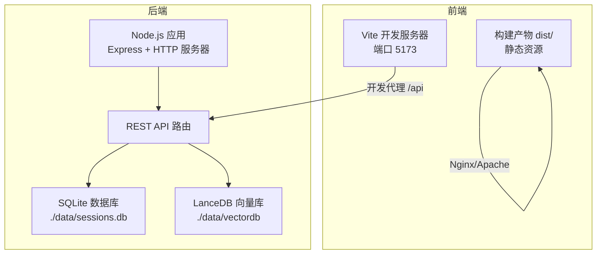
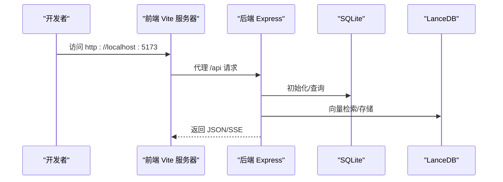
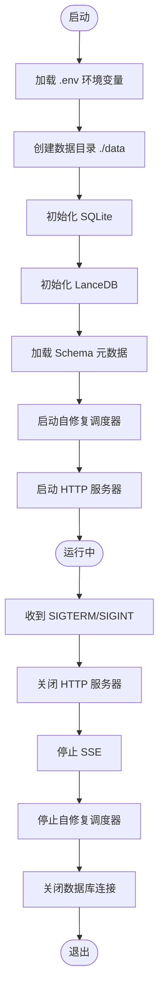

# 部署运维

<cite>
**本文引用的文件**
- [backend/package.json](file://backend/package.json)
- [frontend/package.json](file://frontend/package.json)
- [backend/src/app.js](file://backend/src/app.js)
- [backend/src/core/config.js](file://backend/src/core/config.js)
- [backend/src/core/database.js](file://backend/src/core/database.js)
- [backend/src/core/routes.js](file://backend/src/core/routes.js)
- [backend/src/memory/vectorStore.js](file://backend/src/memory/vectorStore.js)
- [backend/src/utils/logger.js](file://backend/src/utils/logger.js)
- [frontend/vite.config.js](file://frontend/vite.config.js)
- [backend/config/schema-metadata.example.json](file://backend/config/schema-metadata.example.json)
- [backend/test/context-management.test.js](file://backend/test/context-management.test.js)
</cite>

## 目录
1. [简介](#简介)
2. [项目结构](#项目结构)
3. [核心组件](#核心组件)
4. [架构总览](#架构总览)
5. [详细组件分析](#详细组件分析)
6. [依赖分析](#依赖分析)
7. [性能考虑](#性能考虑)
8. [故障排查指南](#故障排查指南)
9. [结论](#结论)
10. [附录](#附录)

## 简介
本文件面向 NL2SQL 项目的部署与运维团队，提供从开发到生产的全生命周期部署指南。内容涵盖：
- 开发、测试、生产三类环境的配置与部署流程
- 前后端分离部署架构（Node.js 后端 + Vue.js 前端）
- Docker 容器化与服务编排思路
- CI/CD 流水线设计（构建、测试、发布）
- 环境变量、数据库迁移与配置文件管理
- 监控、日志与错误追踪策略
- 性能优化、负载均衡与高可用方案
- 升级、回滚与灾难恢复建议

## 项目结构
NL2SQL 采用前后端分离架构：
- 后端：Node.js + Express，提供 REST API、SSE、Schema 管理、向量检索、日志与数据库管理
- 前端：Vue 3 + Vite，提供聊天界面、Schema 查看、历史记录、评估统计等
- 数据：SQLite 本地数据库 + LanceDB 向量数据库（本地文件）

图表来源
- [backend/src/app.js:1-238](file://backend/src/app.js#L1-L238)
- [backend/src/core/routes.js:1-137](file://backend/src/core/routes.js#L1-L137)
- [backend/src/core/database.js:195-261](file://backend/src/core/database.js#L195-L261)
- [backend/src/memory/vectorStore.js:231-261](file://backend/src/memory/vectorStore.js#L231-L261)
- [frontend/vite.config.js:18-35](file://frontend/vite.config.js#L18-L35)

章节来源
- [backend/src/app.js:1-238](file://backend/src/app.js#L1-L238)
- [frontend/vite.config.js:1-93](file://frontend/vite.config.js#L1-L93)

## 核心组件
- 应用入口与生命周期
  - 后端入口负责加载环境变量、初始化数据库与向量库、挂载路由、启动 HTTP 服务器，并处理优雅关闭
- 配置中心
  - 集中管理端口、LLM/Embedding、数据库、安全策略、日志、Schema、长期记忆、上下文管理、评估等配置
- 数据层
  - SQLite 会话与查询历史持久化；LanceDB 向量存储用于语义检索
- 路由与 API
  - 健康检查、Schema 查询、会话与消息管理、查询历史、偏好与评估接口
- 日志与监控
  - 统一日志模块，支持文件轮转、级别控制与事件派发
- 前端构建
  - Vite 开发服务器与代理；生产构建产物输出至 dist/

章节来源
- [backend/src/app.js:97-166](file://backend/src/app.js#L97-L166)
- [backend/src/core/config.js:16-398](file://backend/src/core/config.js#L16-L398)
- [backend/src/core/database.js:195-261](file://backend/src/core/database.js#L195-L261)
- [backend/src/memory/vectorStore.js:231-261](file://backend/src/memory/vectorStore.js#L231-L261)
- [backend/src/core/routes.js:60-137](file://backend/src/core/routes.js#L60-L137)
- [backend/src/utils/logger.js:54-442](file://backend/src/utils/logger.js#L54-L442)
- [frontend/vite.config.js:18-93](file://frontend/vite.config.js#L18-L93)

## 架构总览
后端通过 Express 提供 REST API 与 SSE，前端通过 Vite 开发服务器代理 API 请求，生产环境将前端构建产物部署到静态 Web 服务器。

图表来源
- [frontend/vite.config.js:24-35](file://frontend/vite.config.js#L24-L35)
- [backend/src/app.js:78-87](file://backend/src/app.js#L78-L87)
- [backend/src/core/database.js:200-261](file://backend/src/core/database.js#L200-L261)
- [backend/src/memory/vectorStore.js:231-261](file://backend/src/memory/vectorStore.js#L231-L261)

## 详细组件分析

### 后端应用与启动流程
- 环境变量加载与中间件配置（CORS、JSON 解析）
- 初始化数据目录、SQLite、LanceDB、Schema 加载、自修复调度器
- 启动 HTTP 服务器并监听端口
- 优雅关闭：关闭服务器、SSE、定时任务、数据库连接

图表来源
- [backend/src/app.js:97-166](file://backend/src/app.js#L97-L166)
- [backend/src/app.js:176-230](file://backend/src/app.js#L176-L230)

章节来源
- [backend/src/app.js:63-87](file://backend/src/app.js#L63-L87)
- [backend/src/app.js:97-166](file://backend/src/app.js#L97-L166)
- [backend/src/app.js:176-230](file://backend/src/app.js#L176-L230)

### 配置管理与环境变量
- 服务器端口、运行环境、LLM/Embedding、数据库路径、SR 数据源 URL、安全白名单、查询限制、日志级别与文件、自修复策略、Schema 缓存与重向量化开关、长期记忆与上下文管理、评估开关等
- 启动时校验必要配置（LLM API Key、SR 数据库 URL），并给出明确提示

章节来源
- [backend/src/core/config.js:16-398](file://backend/src/core/config.js#L16-L398)

### 数据库与迁移
- SQLite 表结构：sessions、messages、query_history、user_preferences、system_logs
- 外键约束启用、索引优化、迁移逻辑（如 user_preferences 表重建以移除 UNIQUE 约束）
- 事务封装、查询/插入/更新、批量迁移执行

章节来源
- [backend/src/core/database.js:39-189](file://backend/src/core/database.js#L39-L189)
- [backend/src/core/database.js:271-336](file://backend/src/core/database.js#L271-L336)
- [backend/src/core/database.js:431-445](file://backend/src/core/database.js#L431-L445)

### 向量存储与语义检索
- LanceDB 连接、schema_vectors 与 query_vectors 表初始化
- Schema 向量添加与搜索、智能搜索（基于查询意图与元数据过滤）
- 查询历史向量添加与相似查询搜索
- 统计与状态查询

章节来源
- [backend/src/memory/vectorStore.js:231-261](file://backend/src/memory/vectorStore.js#L231-L261)
- [backend/src/memory/vectorStore.js:336-435](file://backend/src/memory/vectorStore.js#L336-L435)
- [backend/src/memory/vectorStore.js:450-536](file://backend/src/memory/vectorStore.js#L450-L536)
- [backend/src/memory/vectorStore.js:551-618](file://backend/src/memory/vectorStore.js#L551-L618)

### API 路由与健康检查
- 健康检查（基础/详细）、Schema 查询、会话管理、查询历史、偏好与模板、评估统计
- 请求日志中间件、SSE 连接统计

章节来源
- [backend/src/core/routes.js:46-54](file://backend/src/core/routes.js#L46-L54)
- [backend/src/core/routes.js:72-137](file://backend/src/core/routes.js#L72-L137)
- [backend/src/core/routes.js:150-250](file://backend/src/core/routes.js#L150-L250)
- [backend/src/core/routes.js:266-398](file://backend/src/core/routes.js#L266-L398)
- [backend/src/core/routes.js:413-450](file://backend/src/core/routes.js#L413-L450)
- [backend/src/core/routes.js:553-760](file://backend/src/core/routes.js#L553-L760)

### 日志系统
- 多级别日志（trace/debug/info/warn/error）、控制台彩色输出、文件轮转、事件派发
- 执行流程追踪（trace/step/endTrace），支持上下文与耗时统计

章节来源
- [backend/src/utils/logger.js:54-442](file://backend/src/utils/logger.js#L54-L442)

### 前端构建与开发代理
- Vite 开发服务器端口 5173，自动打开浏览器
- 代理 /api 到后端 3000 端口，解决跨域
- 路径别名（@、@components、@views、@stores、@utils）
- CSS 预处理器（SCSS）与第三方库手动分包（Element Plus、ECharts、Vue 生态）

章节来源
- [frontend/vite.config.js:18-93](file://frontend/vite.config.js#L18-L93)

### Schema 元数据配置
- 示例 Schema 文件包含表、字段、关系、指标与维度定义
- 用于向量检索与查询意图识别

章节来源
- [backend/config/schema-metadata.example.json:1-328](file://backend/config/schema-metadata.example.json#L1-L328)

### 测试与上下文管理
- Token 预算估算、上下文预算计算、历史裁剪
- 对话摘要分割与缓存管理
- 向量元数据增强（重要性评分、查询类型、复杂度、执行信息）

章节来源
- [backend/test/context-management.test.js:43-133](file://backend/test/context-management.test.js#L43-L133)
- [backend/test/context-management.test.js:139-180](file://backend/test/context-management.test.js#L139-L180)
- [backend/test/context-management.test.js:186-268](file://backend/test/context-management.test.js#L186-L268)

## 依赖分析
- 后端依赖
  - Express、CORS、body-parser、dotenv、uuid、dayjs、node-cron、sqlite3、vectordb
- 前端依赖
  - Vue 3、Vue Router、Pinia、Element Plus、ECharts、Axios、marked、mermaid、highlight.js 等
- 开发依赖
  - nodemon（后端热重载）、Vite、@vitejs/plugin-vue、Sass 等

章节来源
- [backend/package.json:10-26](file://backend/package.json#L10-L26)
- [frontend/package.json:11-34](file://frontend/package.json#L11-L34)

## 性能考虑
- 向量检索性能
  - 合理设置 topK 与过滤条件，避免过度搜索
  - 智能搜索策略（基于查询意图与元数据）提升命中质量
- 数据库性能
  - SQLite 外键启用、索引优化（按 user_id、status、created_at 等）
  - 事务封装减少锁竞争
- 日志与监控
  - 日志级别与文件轮转，避免 IO 压力
  - 健康检查接口暴露内存使用与组件状态
- 前端性能
  - 第三方库手动分包，减少首屏体积
  - 生产构建关闭 source map

章节来源
- [backend/src/memory/vectorStore.js:378-435](file://backend/src/memory/vectorStore.js#L378-L435)
- [backend/src/core/database.js:228-257](file://backend/src/core/database.js#L228-L257)
- [backend/src/utils/logger.js:134-210](file://backend/src/utils/logger.js#L134-L210)
- [backend/src/core/routes.js:100-137](file://backend/src/core/routes.js#L100-L137)
- [frontend/vite.config.js:78-91](file://frontend/vite.config.js#L78-L91)

## 故障排查指南
- 启动失败
  - 检查 .env 必填项（LLM API Key、SR 数据库 URL）
  - 查看日志文件与控制台输出，定位初始化阶段错误
- 数据库问题
  - SQLite 表结构与索引是否创建成功；迁移是否执行
  - 外键约束是否启用；事务是否正确提交/回滚
- 向量库问题
  - LanceDB 是否初始化成功；表是否存在；向量维度是否匹配
- API 异常
  - 健康检查接口返回状态；SSE 连接数；路由日志
- 日志与追踪
  - 日志级别与文件轮转配置；trace/step/endTrace 使用定位流程问题

章节来源
- [backend/src/core/config.js:366-398](file://backend/src/core/config.js#L366-L398)
- [backend/src/core/database.js:228-257](file://backend/src/core/database.js#L228-L257)
- [backend/src/memory/vectorStore.js:231-261](file://backend/src/memory/vectorStore.js#L231-L261)
- [backend/src/core/routes.js:100-137](file://backend/src/core/routes.js#L100-L137)
- [backend/src/utils/logger.js:134-210](file://backend/src/utils/logger.js#L134-L210)

## 结论
NL2SQL 项目具备清晰的前后端分离架构与完善的配置、日志、数据库与向量存储体系。通过标准化的环境变量、健康检查与优雅关闭机制，可在开发、测试与生产环境中稳定运行。建议结合容器化与 CI/CD 实现自动化部署与可观测性增强。

## 附录

### 环境变量清单（后端）
- 服务器与运行环境
  - PORT：监听端口
  - NODE_ENV：运行环境（development/production）
- LLM 与 Embedding
  - LLM_API_BASE、LLM_API_KEY、LLM_MODEL、LLM_TIMEOUT、EMBEDDING_MODEL、EMBEDDING_TIMEOUT
- 数据库
  - DB_PATH：SQLite 文件路径
  - VECTOR_DB_PATH：LanceDB 目录路径
  - SR_DATABASE_URL：SR 数据源连接 URL
- 安全与查询限制
  - ALLOWED_TABLES：白名单（逗号分隔）
  - DRY_RUN：仅生成 SQL 不执行
  - MAX_QUERY_ROWS、QUERY_TIMEOUT
  - FORBIDDEN_KEYWORDS、SENSITIVE_FIELDS
- 会话与日志
  - LOG_LEVEL、LOG_FILE、LOG_CONSOLE、LOG_FILE_OUTPUT、LOG_MAX_SIZE、LOG_MAX_FILES
- 自修复与 Schema
  - SCHEMA_CONFIG_PATH、SCHEMA_REVECTORIZE
- 长期记忆与上下文管理
  - LTM_ENABLED、LTM_USE_LLM、ENABLE_TOKEN_BUDGET、ENABLE_SUMMARIZER、MAX_CONTEXT_TOKENS、RESERVED_OUTPUT_TOKENS、SUMMARIZER_* 等
- 评估
  - EVALUATION_ENABLED、EVALUATION_TRACK_STATS

章节来源
- [backend/src/core/config.js:16-398](file://backend/src/core/config.js#L16-L398)

### 健康检查与监控
- 健康检查接口
  - GET /api/health：基础状态
  - GET /api/health/detail：组件状态（数据库、LLM、Schema、SSE）
- SSE 连接统计
  - 通过 SSE 处理器获取连接数

章节来源
- [backend/src/core/routes.js:72-137](file://backend/src/core/routes.js#L72-L137)

### 前后端分离部署要点
- 后端
  - 使用 PM2 或 systemd 管理 Node.js 进程；监听 PORT；生产环境设置 NODE_ENV=production
  - Nginx/Apache 反向代理 /api 到后端 3000 端口
- 前端
  - 生产构建输出 dist/；静态服务器提供 dist/；Nginx 配置 gzip、缓存、HTTPS
  - 如需同源，后端 CORS 配置允许前端域名

章节来源
- [backend/src/app.js:63-87](file://backend/src/app.js#L63-L87)
- [frontend/vite.config.js:18-35](file://frontend/vite.config.js#L18-L35)

### Docker 容器化与编排（建议）
- 镜像构建
  - 基于 Node LTS 镜像构建后端；基于 Node LTS 镜像构建前端（Vite 生产构建）
  - 将 dist/ 作为静态资源挂载到 Nginx/Apache
- 容器编排
  - 使用 docker-compose 启动后端、数据库（SQLite 文件卷）、向量库目录卷
  - 前端静态资源由独立容器提供
- 服务发现与网络
  - 后端容器暴露 PORT；前端通过反向代理访问后端 /api
- 持久化
  - 映射 ./data/sessions.db 与 ./data/vectordb 至宿主机或卷

[本节为概念性方案，不直接映射具体源文件]

### CI/CD 流水线（建议）
- 触发条件
  - push 到 develop/test/prod 分支；合并 PR
- 步骤
  - 安装依赖（后端/前端）
  - 单元测试与集成测试（参考测试文件）
  - 代码质量扫描（ESLint/Prettier）
  - 构建后端镜像与前端静态产物
  - 推送镜像至私有仓库
  - 部署到测试/预发布/生产环境（结合容器编排）
- 缓存策略
  - npm/yarn 缓存；Vite 构建缓存

[本节为概念性方案，不直接映射具体源文件]

### 升级、回滚与灾难恢复
- 升级
  - 后端：滚动更新，优雅关闭；前端：蓝绿发布或时间窗口切换
- 回滚
  - 回滚到上一个镜像版本；回滚前端静态资源版本
- 灾难恢复
  - 备份 ./data/sessions.db 与 ./data/vectordb
  - 通过备份快速恢复数据库与向量库

[本节为概念性方案，不直接映射具体源文件]