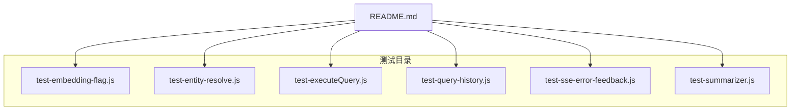
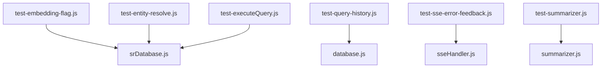
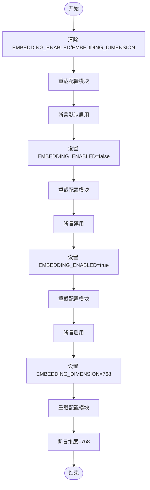
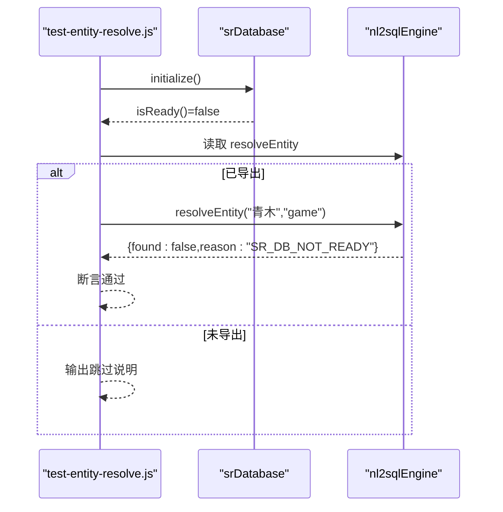
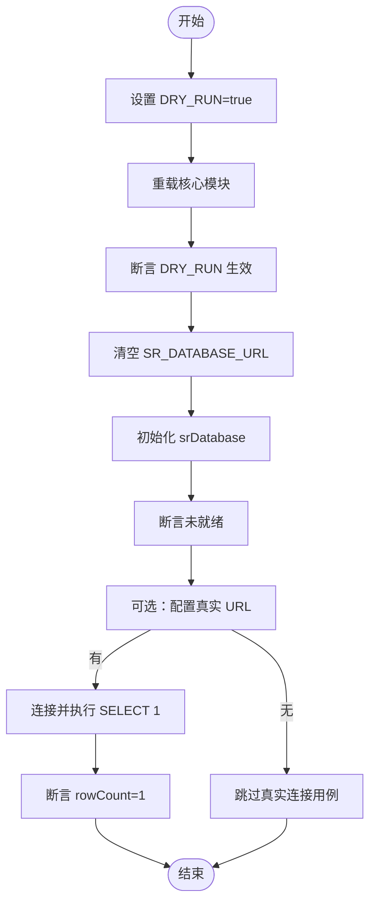
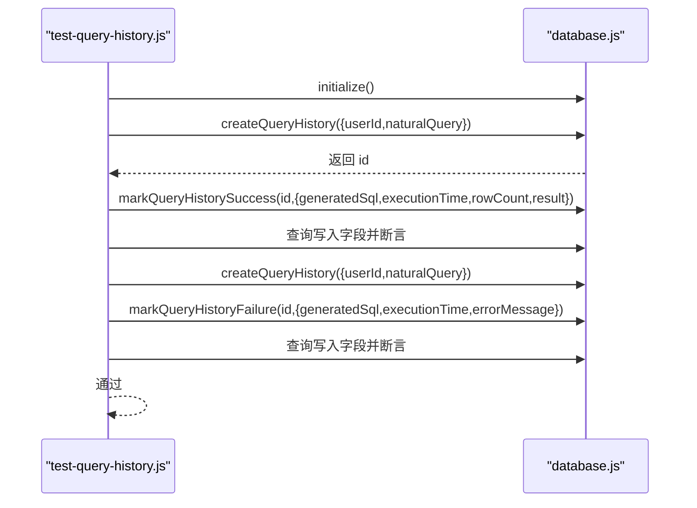
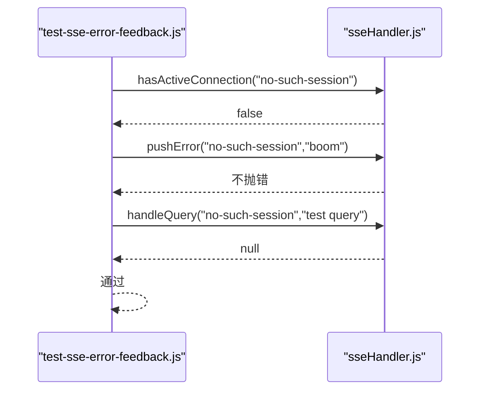
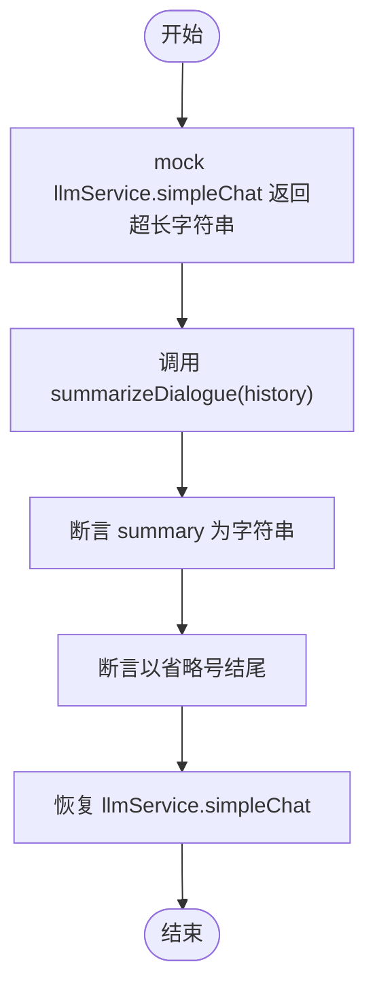
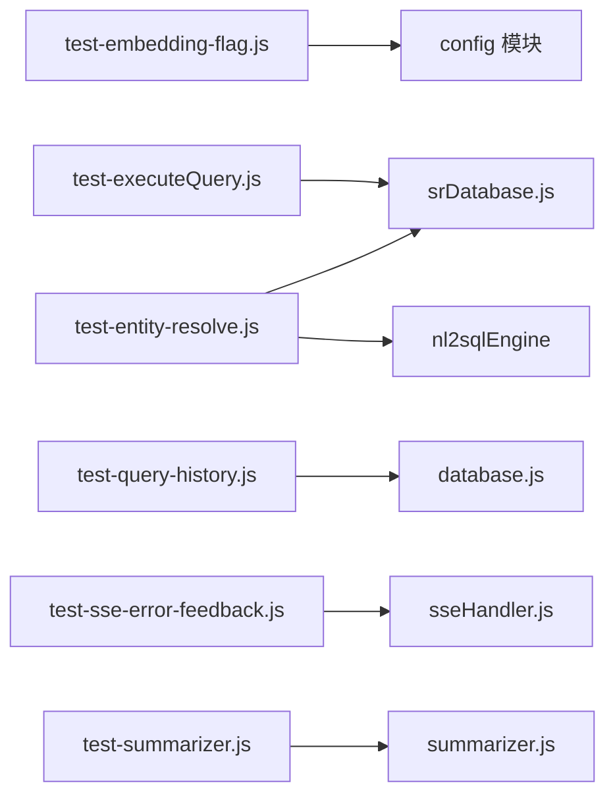

# Phase 1 测试

<cite>
**本文引用的文件**
- [backend/test/phase1/README.md](file://backend/test/phase1/README.md)
- [backend/test/phase1/test-embedding-flag.js](file://backend/test/phase1/test-embedding-flag.js)
- [backend/test/phase1/test-entity-resolve.js](file://backend/test/phase1/test-entity-resolve.js)
- [backend/test/phase1/test-executeQuery.js](file://backend/test/phase1/test-executeQuery.js)
- [backend/test/phase1/test-query-history.js](file://backend/test/phase1/test-query-history.js)
- [backend/test/phase1/test-sse-error-feedback.js](file://backend/test/phase1/test-sse-error-feedback.js)
- [backend/test/phase1/test-summarizer.js](file://backend/test/phase1/test-summarizer.js)
- [backend/src/core/srDatabase.js](file://backend/src/core/srDatabase.js)
- [backend/src/core/sseHandler.js](file://backend/src/core/sseHandler.js)
- [backend/src/memory/summarizer.js](file://backend/src/memory/summarizer.js)
- [backend/src/core/database.js](file://backend/src/core/database.js)
</cite>

## 目录
1. [简介](#简介)
2. [项目结构](#项目结构)
3. [核心组件](#核心组件)
4. [架构总览](#架构总览)
5. [详细组件分析](#详细组件分析)
6. [依赖关系分析](#依赖关系分析)
7. [性能考量](#性能考量)
8. [故障排查指南](#故障排查指南)
9. [结论](#结论)
10. [附录](#附录)

## 简介
本文件为 NL2SQL Phase 1 测试的完整技术文档，聚焦于最小回归测试集合，覆盖嵌入开关、实体解析、查询执行、查询历史、SSE 错误反馈与摘要器六大核心用例。文档从测试目标与策略出发，逐项说明设计思路、测试数据准备、预期结果验证与边界条件处理，并给出测试调试技巧与环境配置建议，帮助测试工程师高效执行 Phase 1 的回归验证。

## 项目结构
- 测试入口与说明位于 backend/test/phase1/README.md，列出六个测试脚本与其对应的任务与断言。
- 每个测试脚本独立运行，通过退出码表达通过/失败，便于 CI/CD 集成。
- 可选环境变量用于控制真实数据库连接与测试数据库路径，避免污染生产数据。

图表来源
- [backend/test/phase1/README.md:1-34](file://backend/test/phase1/README.md#L1-L34)
- [backend/test/phase1/test-embedding-flag.js:1-48](file://backend/test/phase1/test-embedding-flag.js#L1-L48)
- [backend/test/phase1/test-entity-resolve.js:1-46](file://backend/test/phase1/test-entity-resolve.js#L1-L46)
- [backend/test/phase1/test-executeQuery.js:1-72](file://backend/test/phase1/test-executeQuery.js#L1-L72)
- [backend/test/phase1/test-query-history.js:1-77](file://backend/test/phase1/test-query-history.js#L1-L77)
- [backend/test/phase1/test-sse-error-feedback.js:1-45](file://backend/test/phase1/test-sse-error-feedback.js#L1-L45)
- [backend/test/phase1/test-summarizer.js:1-41](file://backend/test/phase1/test-summarizer.js#L1-L41)

章节来源
- [backend/test/phase1/README.md:1-34](file://backend/test/phase1/README.md#L1-L34)

## 核心组件
- 执行层与安全开关：srDatabase 提供 SR 数据库连接池与只读执行能力，支持 DRY_RUN 与安全兜底。
- SSE 异步反馈：sseHandler 管理 SSE 连接、消息发送与错误链路，确保无连接时优雅降级。
- 查询历史持久化：database 提供 query_history 表的创建、写入与查询能力，支撑测试用例的落盘校验。
- 摘要器：summarizer 对长对话进行摘要与裁剪，修复 const→let 风险，保障超长摘要不抛异常。
- 实体解析：在 srDatabase 未就绪时，实体解析应返回明确原因而非抛出通用错误。

章节来源
- [backend/src/core/srDatabase.js:1-156](file://backend/src/core/srDatabase.js#L1-L156)
- [backend/src/core/sseHandler.js:1-200](file://backend/src/core/sseHandler.js#L1-L200)
- [backend/src/core/database.js:1-200](file://backend/src/core/database.js#L1-L200)
- [backend/src/memory/summarizer.js:1-200](file://backend/src/memory/summarizer.js#L1-L200)

## 架构总览
下图展示了 Phase 1 关键测试所涉及的模块交互与数据流：

图表来源
- [backend/test/phase1/test-embedding-flag.js:1-48](file://backend/test/phase1/test-embedding-flag.js#L1-L48)
- [backend/test/phase1/test-entity-resolve.js:1-46](file://backend/test/phase1/test-entity-resolve.js#L1-L46)
- [backend/test/phase1/test-executeQuery.js:1-72](file://backend/test/phase1/test-executeQuery.js#L1-L72)
- [backend/test/phase1/test-query-history.js:1-77](file://backend/test/phase1/test-query-history.js#L1-L77)
- [backend/test/phase1/test-sse-error-feedback.js:1-45](file://backend/test/phase1/test-sse-error-feedback.js#L1-L45)
- [backend/test/phase1/test-summarizer.js:1-41](file://backend/test/phase1/test-summarizer.js#L1-L41)
- [backend/src/core/srDatabase.js:1-156](file://backend/src/core/srDatabase.js#L1-L156)
- [backend/src/core/sseHandler.js:1-200](file://backend/src/core/sseHandler.js#L1-L200)
- [backend/src/core/database.js:1-200](file://backend/src/core/database.js#L1-L200)
- [backend/src/memory/summarizer.js:1-200](file://backend/src/memory/summarizer.js#L1-L200)

## 详细组件分析

### 嵌入标志测试（test-embedding-flag.js）
- 测试目标：验证 EMBEDDING_ENABLED 与 EMBEDDING_DIMENSION 能正确影响 config.embedding.enabled 与 dimension。
- 设计思路：
  - 通过动态重载配置模块，绕过 require 缓存，确保读取最新环境变量。
  - 分四类场景断言：默认启用、显式关闭、显式开启、维度覆盖。
- 测试数据准备：通过 process.env 设置不同组合的环境变量。
- 预期结果验证：断言 config.embedding.enabled 与 config.embedding.dimension 的最终值。
- 边界条件：未设置时采用默认值；字符串形式的布尔值与数值字符串均需正确解析。
- 通过方式：全部断言通过后退出码为 0。

图表来源
- [backend/test/phase1/test-embedding-flag.js:17-42](file://backend/test/phase1/test-embedding-flag.js#L17-L42)

章节来源
- [backend/test/phase1/test-embedding-flag.js:1-48](file://backend/test/phase1/test-embedding-flag.js#L1-L48)

### 实体解析测试（test-entity-resolve.js）
- 测试目标：当 srDatabase 未就绪时，resolveEntity 应返回明确原因，避免抛出通用错误。
- 设计思路：
  - 初始化 srDatabase 并断言其未就绪。
  - 若引擎内部导出了 resolveEntity，则直接调用断言；否则仅做静态行为说明（跳过直接调用断言）。
- 测试数据准备：通过环境变量关闭 SR_DB，确保连接池无法就绪。
- 预期结果验证：未就绪时返回 { found: false, reason: 'SR_DB_NOT_READY' }。
- 边界条件：引擎未导出 resolveEntity 时，脚本记录警告并跳过断言。
- 通过方式：断言通过或静态检查通过即视为通过。

图表来源
- [backend/test/phase1/test-entity-resolve.js:19-38](file://backend/test/phase1/test-entity-resolve.js#L19-L38)
- [backend/src/core/srDatabase.js:42-86](file://backend/src/core/srDatabase.js#L42-L86)

章节来源
- [backend/test/phase1/test-entity-resolve.js:1-46](file://backend/test/phase1/test-entity-resolve.js#L1-L46)

### 查询执行测试（test-executeQuery.js）
- 测试目标：覆盖 DRY_RUN 兜底、SR 数据库未配置、真实数据库连接与执行。
- 设计思路：
  - 清理 require 缓存，确保读取最新配置。
  - DRY_RUN=true 时验证安全开关生效（通过 config.security.dryRun 断言）。
  - 清空 SR 数据库 URL，验证 srDatabase 未就绪。
  - 可选：配置 SR_DATABASE_URL_TEST 后，连接并执行 SELECT 1。
- 测试数据准备：通过环境变量控制开关与 URL；使用独立测试库路径避免污染。
- 预期结果验证：未配置时 srDatabase 未就绪；真实连接时返回 rowCount=1。
- 边界条件：未设置 SR_DATABASE_URL_TEST 时跳过真实连接用例。
- 通过方式：所有断言通过后退出码为 0。

图表来源
- [backend/test/phase1/test-executeQuery.js:29-64](file://backend/test/phase1/test-executeQuery.js#L29-L64)
- [backend/src/core/srDatabase.js:42-86](file://backend/src/core/srDatabase.js#L42-L86)

章节来源
- [backend/test/phase1/test-executeQuery.js:1-72](file://backend/test/phase1/test-executeQuery.js#L1-L72)

### 查询历史测试（test-query-history.js）
- 测试目标：验证 query_history 的创建、成功标记与失败标记字段完整性。
- 设计思路：
  - 使用独立测试数据库（DB_PATH_TEST 或默认路径），避免污染正式数据。
  - createQueryHistory 返回自增 id；markQueryHistorySuccess 写入 status/sql/time/row_count/result；markQueryHistoryFailure 写入 status='failed' 与 error_message。
- 测试数据准备：构造两条记录，一条成功、一条失败。
- 预期结果验证：查询写入字段与断言一致。
- 边界条件：result 字段为 JSON，需解析后断言；失败用例断言错误信息包含特定关键字。
- 通过方式：所有断言通过后退出码为 0。

图表来源
- [backend/test/phase1/test-query-history.js:23-71](file://backend/test/phase1/test-query-history.js#L23-L71)
- [backend/src/core/database.js:94-150](file://backend/src/core/database.js#L94-L150)

章节来源
- [backend/test/phase1/test-query-history.js:1-77](file://backend/test/phase1/test-query-history.js#L1-L77)

### SSE 错误反馈测试（test-sse-error-feedback.js）
- 测试目标：验证无连接时 SSE 的三个关键行为：hasActiveConnection 返回 false、pushError 静默、handleQuery 返回 null。
- 设计思路：
  - 直接调用 sseHandler 的公开接口，传入不存在的会话 ID。
  - 断言无连接时的行为，确保不抛异常。
- 测试数据准备：使用任意不存在的会话 ID。
- 预期结果验证：hasActiveConnection(false)、pushError 不抛错、handleQuery 返回 null。
- 边界条件：所有断言均在无连接场景下进行。
- 通过方式：所有断言通过后退出码为 0。

图表来源
- [backend/test/phase1/test-sse-error-feedback.js:18-37](file://backend/test/phase1/test-sse-error-feedback.js#L18-L37)
- [backend/src/core/sseHandler.js:32-120](file://backend/src/core/sseHandler.js#L32-L120)

章节来源
- [backend/test/phase1/test-sse-error-feedback.js:1-45](file://backend/test/phase1/test-sse-error-feedback.js#L1-L45)

### 摘要器测试（test-summarizer.js）
- 测试目标：验证超长摘要进入裁剪分支不抛异常，并以省略号结尾。
- 设计思路：
  - 通过 mock llmService.simpleChat 返回超长字符串，模拟 LLM 输出过长的情况。
  - 调用 summarizer.summarizeDialogue，断言返回 success、summary 类型与结尾裁剪标记。
- 测试数据准备：构造 10 轮对话的历史数据。
- 预期结果验证：summary 为字符串且以省略号结尾；不抛异常。
- 边界条件：mock 恢复原函数，避免影响其他测试。
- 通过方式：断言通过后退出码为 0。

图表来源
- [backend/test/phase1/test-summarizer.js:15-36](file://backend/test/phase1/test-summarizer.js#L15-L36)
- [backend/src/memory/summarizer.js:109-185](file://backend/src/memory/summarizer.js#L109-L185)

章节来源
- [backend/test/phase1/test-summarizer.js:1-41](file://backend/test/phase1/test-summarizer.js#L1-L41)

## 依赖关系分析
- 测试脚本与核心模块的耦合度低，主要通过 require 与环境变量交互。
- srDatabase 与 database 作为外部依赖，分别负责 SR 数据库连接池与本地 SQLite 存储。
- sseHandler 与 summarizer 为独立功能模块，分别处理异步事件与对话摘要。

图表来源
- [backend/test/phase1/test-embedding-flag.js:11-15](file://backend/test/phase1/test-embedding-flag.js#L11-L15)
- [backend/test/phase1/test-entity-resolve.js:16-17](file://backend/test/phase1/test-entity-resolve.js#L16-L17)
- [backend/test/phase1/test-executeQuery.js:21-27](file://backend/test/phase1/test-executeQuery.js#L21-L27)
- [backend/test/phase1/test-query-history.js:21](file://backend/test/phase1/test-query-history.js#L21)
- [backend/test/phase1/test-sse-error-feedback.js:16](file://backend/test/phase1/test-sse-error-feedback.js#L16)
- [backend/test/phase1/test-summarizer.js:16-20](file://backend/test/phase1/test-summarizer.js#L16-L20)

章节来源
- [backend/test/phase1/README.md:5-12](file://backend/test/phase1/README.md#L5-L12)

## 性能考量
- DRY_RUN：在测试阶段避免真实数据库访问，降低延迟与资源消耗。
- 连接池懒加载：未配置或依赖缺失时仅告警，不影响应用启动，提升容错性。
- 只读执行与超时控制：通过事务只读与超时参数，防止长事务与慢查询影响系统稳定性。
- SQLite 轻量化：测试使用 SQLite，避免额外数据库部署成本。

## 故障排查指南
- 嵌入标志未生效
  - 检查是否正确删除并重载配置模块缓存。
  - 确认环境变量大小写与值格式（字符串形式的布尔值与数值）。
- 实体解析报错
  - 确认 SR 数据库 URL 未配置且 SR_DB_ENABLED=false。
  - 若 resolveEntity 未导出，脚本会跳过直接断言，属于预期行为。
- 查询执行失败
  - 检查 SR_DATABASE_URL 是否正确设置；未设置时应断言 srDatabase 未就绪。
  - 如需真实连接测试，设置 SR_DATABASE_URL_TEST 并确保权限与网络可达。
- 查询历史写入异常
  - 确认 DB_PATH_TEST 指向有效路径；失败时检查 SQLite 文件权限与磁盘空间。
  - 断言失败时检查 JSON 字段解析逻辑。
- SSE 无连接行为异常
  - 确认使用不存在的会话 ID 进行测试；断言应在无连接场景下成立。
- 摘要器抛异常
  - 检查 mock 是否正确恢复；确认超长字符串输入与裁剪逻辑。

章节来源
- [backend/test/phase1/test-embedding-flag.js:17-42](file://backend/test/phase1/test-embedding-flag.js#L17-L42)
- [backend/test/phase1/test-entity-resolve.js:19-38](file://backend/test/phase1/test-entity-resolve.js#L19-L38)
- [backend/test/phase1/test-executeQuery.js:29-64](file://backend/test/phase1/test-executeQuery.js#L29-L64)
- [backend/test/phase1/test-query-history.js:23-71](file://backend/test/phase1/test-query-history.js#L23-L71)
- [backend/test/phase1/test-sse-error-feedback.js:18-37](file://backend/test/phase1/test-sse-error-feedback.js#L18-L37)
- [backend/test/phase1/test-summarizer.js:15-36](file://backend/test/phase1/test-summarizer.js#L15-L36)

## 结论
Phase 1 测试围绕六大核心用例构建了稳健的回归矩阵，覆盖配置开关、数据库执行、事件流、历史持久化与摘要处理等关键路径。通过独立脚本与清晰的断言策略，能够快速定位问题并保障系统在最小功能集下的稳定性。建议在 CI 中固定执行顺序，结合可选环境变量进行真实数据库验证。

## 附录
- 运行方式
  - 在 backend 目录下依次执行各测试脚本，或根据需要并行执行（脚本彼此独立）。
- 可选环境变量
  - SR_DATABASE_URL_TEST：启用真实数据库连接测试。
  - DB_PATH_TEST：指定 SQLite 测试库路径，默认 backend/data/sessions.test.db。
- 相关模块参考
  - srDatabase：连接池初始化、只读执行与超时控制。
  - sseHandler：SSE 连接管理与错误链路。
  - database：SQLite 表结构与查询历史写入。
  - summarizer：对话摘要与裁剪逻辑。

章节来源
- [backend/test/phase1/README.md:14-34](file://backend/test/phase1/README.md#L14-L34)