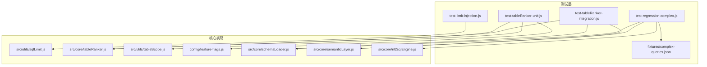
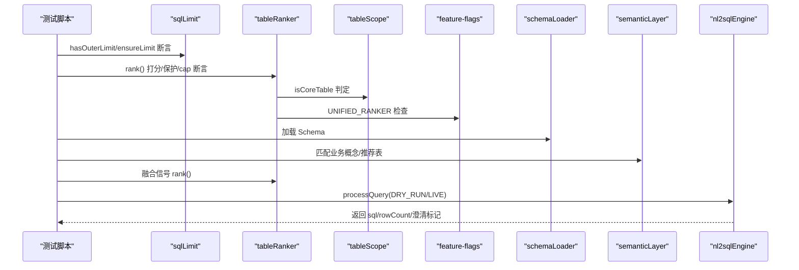
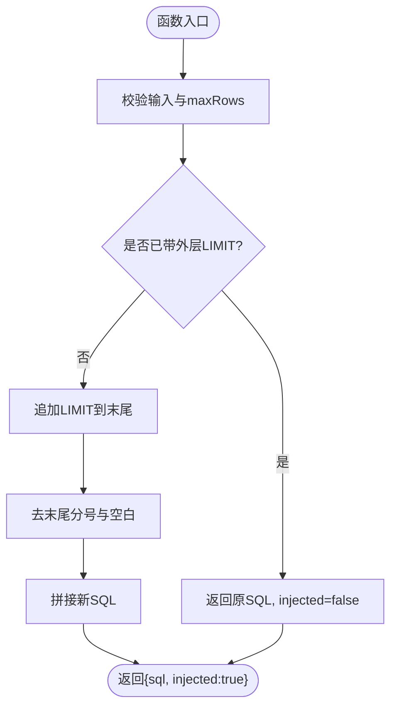
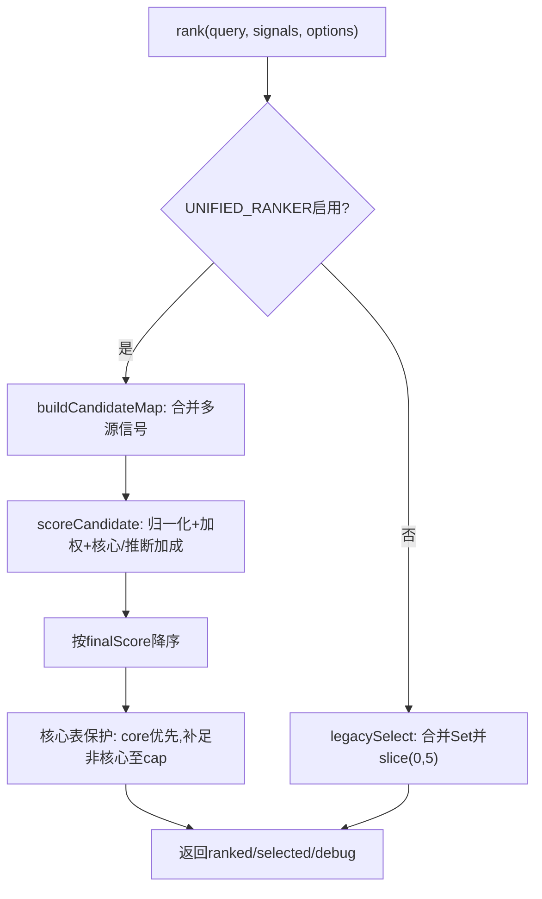
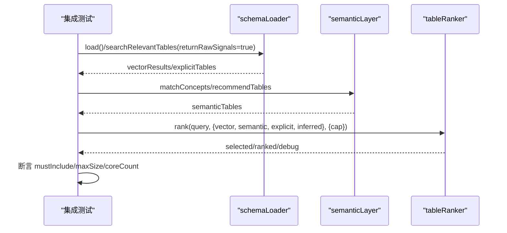
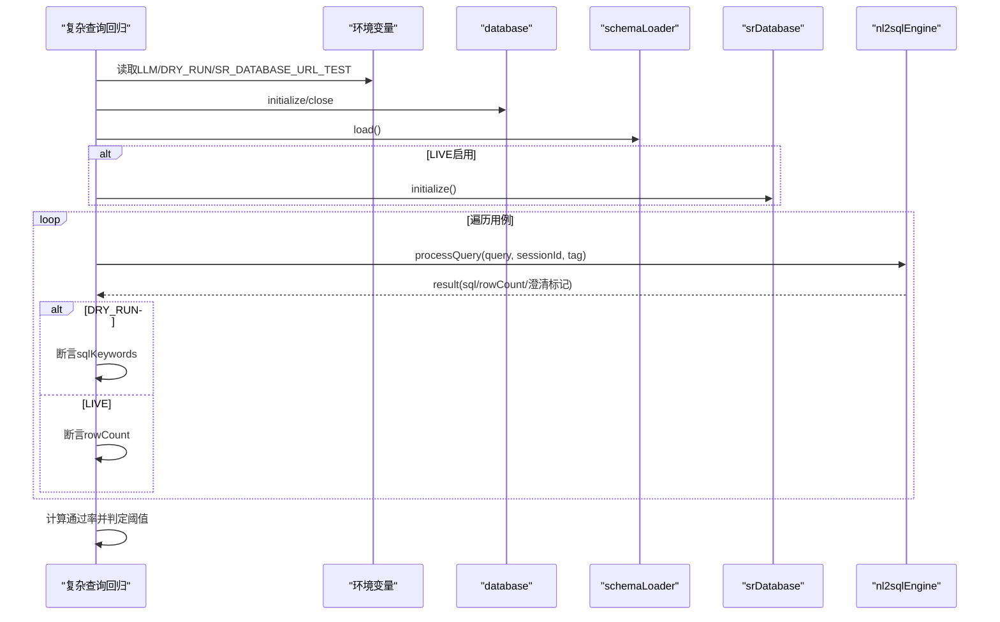
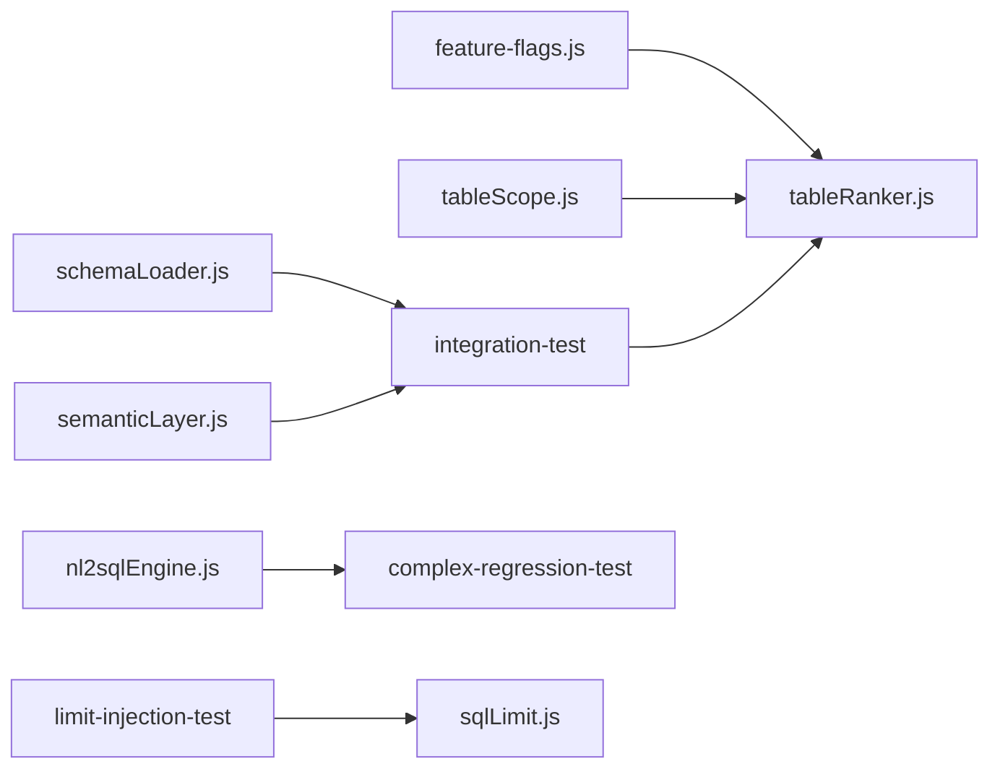

# Phase 2 测试

<cite>
**本文引用的文件**
- [backend/test/phase2/README.md](file://backend/test/phase2/README.md)
- [backend/test/phase2/test-limit-injection.js](file://backend/test/phase2/test-limit-injection.js)
- [backend/test/phase2/test-tableRanker-unit.js](file://backend/test/phase2/test-tableRanker-unit.js)
- [backend/test/phase2/test-tableRanker-integration.js](file://backend/test/phase2/test-tableRanker-integration.js)
- [backend/test/phase2/test-regression-complex.js](file://backend/test/phase2/test-regression-complex.js)
- [backend/test/phase2/fixtures/complex-queries.json](file://backend/test/phase2/fixtures/complex-queries.json)
- [backend/src/utils/sqlLimit.js](file://backend/src/utils/sqlLimit.js)
- [backend/src/core/tableRanker.js](file://backend/src/core/tableRanker.js)
- [backend/src/utils/tableScope.js](file://backend/src/utils/tableScope.js)
- [backend/config/feature-flags.js](file://backend/config/feature-flags.js)
- [backend/src/core/nl2sqlEngine.js](file://backend/src/core/nl2sqlEngine.js)
- [backend/src/core/schemaLoader.js](file://backend/src/core/schemaLoader.js)
- [backend/src/core/semanticLayer.js](file://backend/src/core/semanticLayer.js)
</cite>

## 目录
1. [简介](#简介)
2. [项目结构](#项目结构)
3. [核心组件](#核心组件)
4. [架构总览](#架构总览)
5. [详细组件分析](#详细组件分析)
6. [依赖分析](#依赖分析)
7. [性能考虑](#性能考虑)
8. [故障排查指南](#故障排查指南)
9. [结论](#结论)
10. [附录](#附录)

## 简介
本技术文档面向测试工程师，系统化梳理 NL2SQL Phase 2 的测试目标、测试策略与执行流程，覆盖以下关键测试类型：
- 限制注入测试：验证 SQL 外层 LIMIT 识别与注入能力，确保安全边界与性能控制。
- 回归测试：复杂查询端到端回归，验证 DRY_RUN/LIVE 模式下的选表与 SQL 关键词断言。
- 表排序器（tableRanker）集成测试与单元测试：分别验证选表流程与打分公式、核心表保护、特征标志回退等。
- 测试夹具与数据管理：复杂查询用例的准备、维护与多轮查询验证方法。

文档还提供执行指南、调试技巧与结果分析方法，帮助快速定位问题并保障 Phase 2 的质量门槛。

## 项目结构
Phase 2 测试位于 backend/test/phase2 目录，包含：
- README.md：测试概览、脚本清单、运行方式与验收门槛。
- 四个测试脚本：限制注入、表排序器单元/集成、复杂查询回归。
- fixtures/complex-queries.json：复杂查询回归用例集，包含三类场景与断言规则。
- 相关源码模块：sqlLimit、tableRanker、tableScope、feature-flags、schemaLoader、semanticLayer、nl2sqlEngine。

图表来源
- [backend/test/phase2/README.md:1-72](file://backend/test/phase2/README.md#L1-L72)
- [backend/test/phase2/test-limit-injection.js:1-88](file://backend/test/phase2/test-limit-injection.js#L1-L88)
- [backend/test/phase2/test-tableRanker-unit.js:1-175](file://backend/test/phase2/test-tableRanker-unit.js#L1-L175)
- [backend/test/phase2/test-tableRanker-integration.js:1-115](file://backend/test/phase2/test-tableRanker-integration.js#L1-L115)
- [backend/test/phase2/test-regression-complex.js:1-119](file://backend/test/phase2/test-regression-complex.js#L1-L119)
- [backend/test/phase2/fixtures/complex-queries.json:1-82](file://backend/test/phase2/fixtures/complex-queries.json#L1-L82)
- [backend/src/utils/sqlLimit.js:1-37](file://backend/src/utils/sqlLimit.js#L1-L37)
- [backend/src/core/tableRanker.js:1-280](file://backend/src/core/tableRanker.js#L1-L280)
- [backend/src/utils/tableScope.js:1-44](file://backend/src/utils/tableScope.js#L1-L44)
- [backend/config/feature-flags.js:115-125](file://backend/config/feature-flags.js#L115-L125)
- [backend/src/core/schemaLoader.js:1-200](file://backend/src/core/schemaLoader.js#L1-L200)
- [backend/src/core/semanticLayer.js:1-200](file://backend/src/core/semanticLayer.js#L1-L200)
- [backend/src/core/nl2sqlEngine.js:1-200](file://backend/src/core/nl2sqlEngine.js#L1-L200)

章节来源
- [backend/test/phase2/README.md:1-72](file://backend/test/phase2/README.md#L1-L72)

## 核心组件
- 限制注入工具（sqlLimit）：提供 hasOuterLimit 与 ensureLimit，确保 SQL 外层 LIMIT 识别与注入，避免子查询/列名误判。
- 表排序器（tableRanker）：统一融合向量、语义、关键词、显式/推断信号，进行归一化打分与核心表保护，cap=8 截断；支持 feature flag 回退。
- 表作用域（tableScope）：定义核心表判定规则，供排序器与其它模块复用。
- 功能开关（feature-flags）：UNIFIED_RANKER 控制排序器启用与否，便于紧急回退。
- 复杂查询夹具（complex-queries.json）：三类场景（多维过滤、行为序列、聚合+明细），含 tablesCalled 与 sqlKeywords 断言规则。
- 端到端引擎（nl2sqlEngine）：承载复杂查询回归的主流程编排，支持 DRY_RUN 与 LIVE 模式断言。

章节来源
- [backend/src/utils/sqlLimit.js:1-37](file://backend/src/utils/sqlLimit.js#L1-L37)
- [backend/src/core/tableRanker.js:1-280](file://backend/src/core/tableRanker.js#L1-L280)
- [backend/src/utils/tableScope.js:1-44](file://backend/src/utils/tableScope.js#L1-L44)
- [backend/config/feature-flags.js:115-125](file://backend/config/feature-flags.js#L115-L125)
- [backend/test/phase2/fixtures/complex-queries.json:1-82](file://backend/test/phase2/fixtures/complex-queries.json#L1-L82)
- [backend/src/core/nl2sqlEngine.js:1-200](file://backend/src/core/nl2sqlEngine.js#L1-L200)

## 架构总览
Phase 2 测试围绕“限制注入”“表排序器”“复杂查询回归”三条主线展开，形成从工具级到端到端的闭环验证。

图表来源
- [backend/test/phase2/test-limit-injection.js:1-88](file://backend/test/phase2/test-limit-injection.js#L1-L88)
- [backend/test/phase2/test-tableRanker-unit.js:1-175](file://backend/test/phase2/test-tableRanker-unit.js#L1-L175)
- [backend/test/phase2/test-tableRanker-integration.js:1-115](file://backend/test/phase2/test-tableRanker-integration.js#L1-L115)
- [backend/test/phase2/test-regression-complex.js:1-119](file://backend/test/phase2/test-regression-complex.js#L1-L119)
- [backend/src/utils/sqlLimit.js:1-37](file://backend/src/utils/sqlLimit.js#L1-L37)
- [backend/src/core/tableRanker.js:1-280](file://backend/src/core/tableRanker.js#L1-L280)
- [backend/src/utils/tableScope.js:1-44](file://backend/src/utils/tableScope.js#L1-L44)
- [backend/config/feature-flags.js:115-125](file://backend/config/feature-flags.js#L115-L125)
- [backend/src/core/schemaLoader.js:1-200](file://backend/src/core/schemaLoader.js#L1-L200)
- [backend/src/core/semanticLayer.js:1-200](file://backend/src/core/semanticLayer.js#L1-L200)
- [backend/src/core/nl2sqlEngine.js:1-200](file://backend/src/core/nl2sqlEngine.js#L1-L200)

## 详细组件分析

### 限制注入测试（test-limit-injection.js）
- 测试目标：验证 hasOuterLimit 对多种 LIMIT 尾形的识别与 ensureLimit 的注入行为，覆盖子查询、列名、空输入、maxRows≤0 等边界。
- 关键断言：
  - 正例：识别末尾 LIMIT n / LIMIT n,m / LIMIT n OFFSET m，忽略末尾分号与空白。
  - 反例：列值/列名包含 limit、仅子查询 LIMIT、聚合语句等不应识别为外层 LIMIT。
  - 注入：未带 LIMIT 时追加 LIMIT；已有 LIMIT 不重复注入；null/非法 maxRows 不注入。
- 复杂度与性能：正则匹配与字符串处理，线性复杂度，开销极低。

图表来源
- [backend/test/phase2/test-limit-injection.js:21-80](file://backend/test/phase2/test-limit-injection.js#L21-L80)
- [backend/src/utils/sqlLimit.js:16-34](file://backend/src/utils/sqlLimit.js#L16-L34)

章节来源
- [backend/test/phase2/test-limit-injection.js:1-88](file://backend/test/phase2/test-limit-injection.js#L1-L88)
- [backend/src/utils/sqlLimit.js:1-37](file://backend/src/utils/sqlLimit.js#L1-L37)

### 表排序器单元测试（test-tableRanker-unit.js）
- 测试目标：覆盖空信号、仅向量信号、核心表保护、语义层显著加分、explicit/inferred 加成、cap=8、feature flag 回退等场景。
- 关键断言：
  - 空信号 → selected/ranked 均为空。
  - 仅向量 → 排序与 priorityScore 一致。
  - 核心表低分高覆盖 cap=3 → 核心表必入选。
  - 语义层 priority=1 显著加分 → 语义表置顶。
  - explicit/inferred 命中 → 评分与 reasons 包含对应来源。
  - cap=8 上限生效。
  - FF_UNIFIED_RANKER=false → 回退 legacy（slice(0,5)）。
- 调试建议：通过删除/设置 FF_UNIFIED_RANKER 并 reload 模块，验证回退路径。

图表来源
- [backend/test/phase2/test-tableRanker-unit.js:41-166](file://backend/test/phase2/test-tableRanker-unit.js#L41-L166)
- [backend/src/core/tableRanker.js:244-270](file://backend/src/core/tableRanker.js#L244-L270)
- [backend/src/core/tableRanker.js:219-234](file://backend/src/core/tableRanker.js#L219-L234)

章节来源
- [backend/test/phase2/test-tableRanker-unit.js:1-175](file://backend/test/phase2/test-tableRanker-unit.js#L1-L175)
- [backend/src/core/tableRanker.js:1-280](file://backend/src/core/tableRanker.js#L1-L280)
- [backend/src/utils/tableScope.js:1-44](file://backend/src/utils/tableScope.js#L1-L44)
- [backend/config/feature-flags.js:115-125](file://backend/config/feature-flags.js#L115-L125)

### 表排序器集成测试（test-tableRanker-integration.js）
- 测试目标：针对复杂查询用例，直接调用 schemaLoader/semanticLayer/tableRanker，验证 mustInclude/mustIncludeAny/maxSize/coreTableCount。
- 关键流程：
  - 加载 Schema（向量未初始化时退到关键词路径）。
  - 调用 searchRelevantTables 获取向量/显式表信号，结合 semanticLayer 推荐表。
  - 调用 tableRanker.rank 融合信号，断言 selected 结果。
- 适用场景：不依赖 LLM，仅验证选表策略与核心表保护。

图表来源
- [backend/test/phase2/test-tableRanker-integration.js:70-102](file://backend/test/phase2/test-tableRanker-integration.js#L70-L102)
- [backend/src/core/schemaLoader.js:1-200](file://backend/src/core/schemaLoader.js#L1-L200)
- [backend/src/core/semanticLayer.js:1-200](file://backend/src/core/semanticLayer.js#L1-L200)
- [backend/src/core/tableRanker.js:1-280](file://backend/src/core/tableRanker.js#L1-L280)

章节来源
- [backend/test/phase2/test-tableRanker-integration.js:1-115](file://backend/test/phase2/test-tableRanker-integration.js#L1-L115)
- [backend/src/core/schemaLoader.js:1-200](file://backend/src/core/schemaLoader.js#L1-L200)
- [backend/src/core/semanticLayer.js:1-200](file://backend/src/core/semanticLayer.js#L1-L200)
- [backend/src/core/tableRanker.js:1-280](file://backend/src/core/tableRanker.js#L1-L280)

### 复杂查询回归测试（test-regression-complex.js）
- 测试目标：端到端验证复杂查询，DRY_RUN 模式断言 tablesCalled + sqlKeywords；LIVE 模式断言 rowCount。
- 关键流程：
  - 初始化 database/schemaLoader/srDatabase（如启用 LIVE）。
  - 遍历 fixtures.cases，调用 nl2sqlEngine.processQuery。
  - DRY_RUN：断言 sqlKeywords（required/requiredAny/forbidden）。
  - LIVE：断言 rowCount 存在。
  - 验收门槛：DRY_RUN 失败率 ≤ 20%（即通过率 ≥ 80%）。
- 环境要求：LLM_API_BASE/KEY/MODEL 必填；可选 SR_DATABASE_URL_TEST 启用 LIVE。

图表来源
- [backend/test/phase2/test-regression-complex.js:52-114](file://backend/test/phase2/test-regression-complex.js#L52-L114)
- [backend/src/core/nl2sqlEngine.js:121-200](file://backend/src/core/nl2sqlEngine.js#L121-L200)

章节来源
- [backend/test/phase2/test-regression-complex.js:1-119](file://backend/test/phase2/test-regression-complex.js#L1-L119)
- [backend/test/phase2/fixtures/complex-queries.json:1-82](file://backend/test/phase2/fixtures/complex-queries.json#L1-L82)
- [backend/src/core/nl2sqlEngine.js:1-200](file://backend/src/core/nl2sqlEngine.js#L1-L200)

## 依赖分析
- 组件耦合：
  - tableRanker 依赖 feature-flags 与 tableScope，核心表判定与开关控制清晰分离。
  - 集成测试依赖 schemaLoader/semanticLayer 提供信号，再由 tableRanker 统一打分。
  - 复杂查询回归依赖 nl2sqlEngine 主流程，DRY_RUN/LIVE 双模式断言。
- 外部依赖：
  - LLM API（DRY_RUN 模式必需）、可选 SR 数据库（LIVE 模式）。
  - 向量服务（可选，未启用时退到关键词路径）。

图表来源
- [backend/config/feature-flags.js:115-125](file://backend/config/feature-flags.js#L115-L125)
- [backend/src/core/tableRanker.js:1-280](file://backend/src/core/tableRanker.js#L1-L280)
- [backend/src/utils/tableScope.js:1-44](file://backend/src/utils/tableScope.js#L1-L44)
- [backend/src/core/schemaLoader.js:1-200](file://backend/src/core/schemaLoader.js#L1-L200)
- [backend/src/core/semanticLayer.js:1-200](file://backend/src/core/semanticLayer.js#L1-L200)
- [backend/test/phase2/test-tableRanker-integration.js:70-102](file://backend/test/phase2/test-tableRanker-integration.js#L70-L102)
- [backend/src/core/nl2sqlEngine.js:1-200](file://backend/src/core/nl2sqlEngine.js#L1-L200)
- [backend/test/phase2/test-regression-complex.js:52-114](file://backend/test/phase2/test-regression-complex.js#L52-L114)
- [backend/test/phase2/test-limit-injection.js:10-12](file://backend/test/phase2/test-limit-injection.js#L10-L12)
- [backend/src/utils/sqlLimit.js:1-37](file://backend/src/utils/sqlLimit.js#L1-L37)

章节来源
- [backend/test/phase2/README.md:10-16](file://backend/test/phase2/README.md#L10-L16)
- [backend/test/phase2/test-limit-injection.js:1-88](file://backend/test/phase2/test-limit-injection.js#L1-L88)
- [backend/test/phase2/test-tableRanker-unit.js:1-175](file://backend/test/phase2/test-tableRanker-unit.js#L1-L175)
- [backend/test/phase2/test-tableRanker-integration.js:1-115](file://backend/test/phase2/test-tableRanker-integration.js#L1-L115)
- [backend/test/phase2/test-regression-complex.js:1-119](file://backend/test/phase2/test-regression-complex.js#L1-L119)

## 性能考虑
- 限制注入：正则匹配与字符串处理，O(n) 时间复杂度，影响极小。
- 表排序器：候选表合并 O(n)，打分与排序 O(n log n)，cap=8 保证规模稳定。
- 集成测试：向量/关键词路径均走缓存，避免重复初始化成本。
- 端到端回归：DRY_RUN 模式不执行真实 SQL，仅断言选表与关键词，性能开销低。

## 故障排查指南
- 限制注入失败
  - 检查输入是否为字符串、maxRows 是否有效；确认 SQL 尾部分号与空白处理。
  - 参考路径：[backend/test/phase2/test-limit-injection.js:21-80](file://backend/test/phase2/test-limit-injection.js#L21-L80)
- 表排序器回退
  - 确认 FF_UNIFIED_RANKER 是否被设置为 false；通过 reload 模块验证 legacy 行为。
  - 参考路径：[backend/test/phase2/test-tableRanker-unit.js:153-166](file://backend/test/phase2/test-tableRanker-unit.js#L153-L166)
- 集成测试断言失败
  - 检查 schemaLoader 是否成功加载；向量未初始化时退到关键词路径，仍可验证。
  - 参考路径：[backend/test/phase2/test-tableRanker-integration.js:61-102](file://backend/test/phase2/test-tableRanker-integration.js#L61-L102)
- 复杂查询回归失败
  - DRY_RUN 模式下检查 sqlKeywords 断言；LIVE 模式下检查 rowCount。
  - 验收门槛：失败率 ≤ 20%。
  - 参考路径：[backend/test/phase2/test-regression-complex.js:107-114](file://backend/test/phase2/test-regression-complex.js#L107-L114)

章节来源
- [backend/test/phase2/test-limit-injection.js:1-88](file://backend/test/phase2/test-limit-injection.js#L1-L88)
- [backend/test/phase2/test-tableRanker-unit.js:153-166](file://backend/test/phase2/test-tableRanker-unit.js#L153-L166)
- [backend/test/phase2/test-tableRanker-integration.js:61-102](file://backend/test/phase2/test-tableRanker-integration.js#L61-L102)
- [backend/test/phase2/test-regression-complex.js:107-114](file://backend/test/phase2/test-regression-complex.js#L107-L114)

## 结论
Phase 2 测试体系以“限制注入”“表排序器”“复杂查询回归”为核心，形成从工具到端到端的完整验证闭环。通过明确的断言规则、可选的 LIVE 模式与严格的验收门槛，确保排序器替换、安全边界与复杂查询稳定性得到可靠保障。建议测试工程师按“冒烟→集成→端到端”的顺序推进，并结合 feature flag 与夹具管理提升回归效率与可维护性。

## 附录
- 运行指引
  - 冒烟测试（无外部依赖）：运行限制注入与表排序器单元测试。
  - 选表集成测试：准备 schema-metadata.json 与向量/关键词路径，运行集成测试。
  - 端到端回归：设置 LLM 环境变量，运行复杂查询回归；可选 LIVE 模式断言 rowCount。
- 验收门槛
  - 限制注入：全部通过（25/25）。
  - 表排序器单元：全部通过（18/18）。
  - 表排序器集成：全部用例 tablesCalled 断言通过。
  - 复杂查询回归：DRY_RUN 失败率 ≤ 20%（即通过率 ≥ 80%）。
- 复杂查询夹具
  - 三类场景：多维过滤、行为序列、聚合+明细。
  - 断言规则：mustInclude/mustIncludeAny/maxSize/coreTableCount 与 sqlKeywords（required/requiredAny/forbidden）。

章节来源
- [backend/test/phase2/README.md:17-72](file://backend/test/phase2/README.md#L17-L72)
- [backend/test/phase2/fixtures/complex-queries.json:1-82](file://backend/test/phase2/fixtures/complex-queries.json#L1-L82)