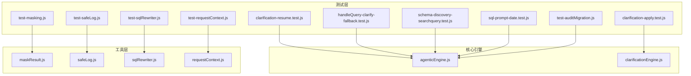
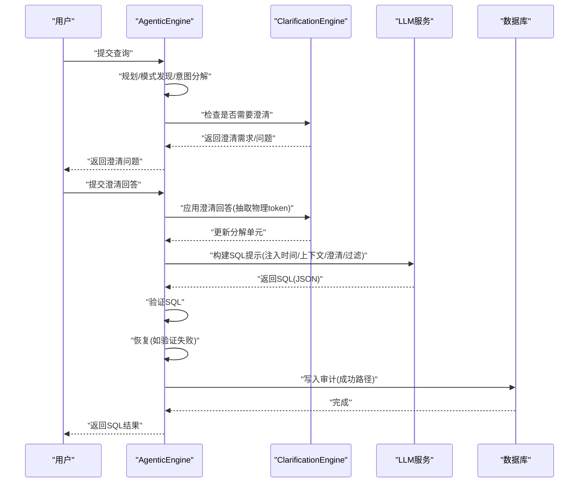
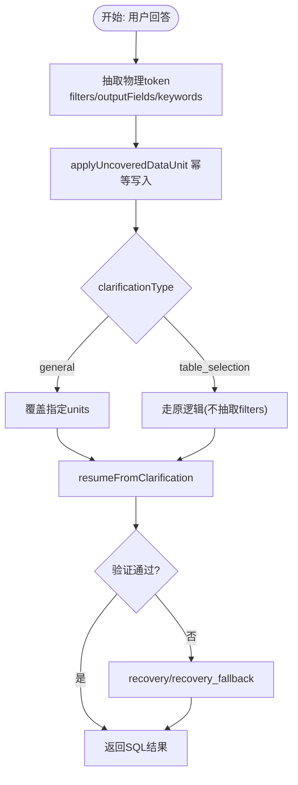
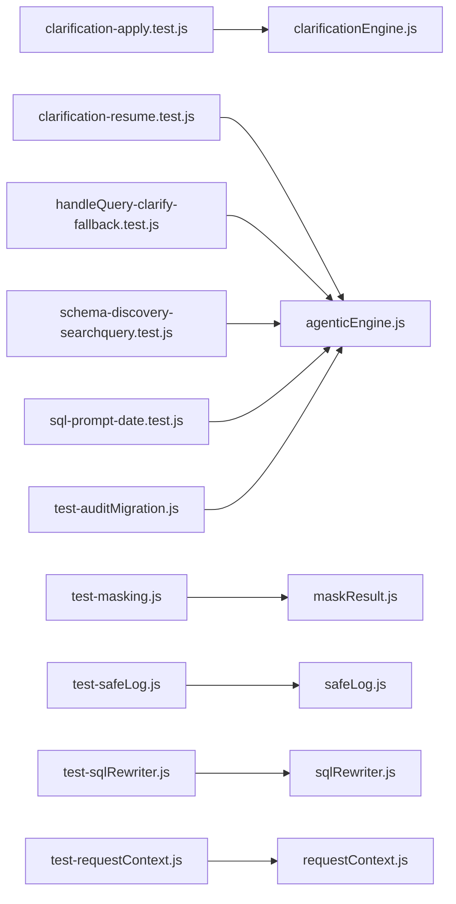

# Phase 3 测试

<cite>
**本文档引用的文件**
- [clarification-apply.test.js](file://backend/test/phase3/clarification-apply.test.js)
- [clarification-resume.test.js](file://backend/test/phase3/clarification-resume.test.js)
- [handleQuery-clarify-fallback.test.js](file://backend/test/phase3/handleQuery-clarify-fallback.test.js)
- [schema-discovery-searchquery.test.js](file://backend/test/phase3/schema-discovery-searchquery.test.js)
- [sql-prompt-date.test.js](file://backend/test/phase3/sql-prompt-date.test.js)
- [test-masking.js](file://backend/test/phase3/test-masking.js)
- [test-safeLog.js](file://backend/test/phase3/test-safeLog.js)
- [test-sqlRewriter.js](file://backend/test/phase3/test-sqlRewriter.js)
- [test-requestContext.js](file://backend/test/phase3/test-requestContext.js)
- [test-auditMigration.js](file://backend/test/phase3/test-auditMigration.js)
- [agenticEngine.js](file://backend/src/core/agenticEngine.js)
- [clarificationEngine.js](file://backend/src/core/clarificationEngine.js)
- [maskResult.js](file://backend/src/utils/maskResult.js)
- [safeLog.js](file://backend/src/utils/safeLog.js)
- [sqlRewriter.js](file://backend/src/utils/sqlRewriter.js)
- [requestContext.js](file://backend/src/core/requestContext.js)
</cite>

## 目录
1. [简介](#简介)
2. [项目结构](#项目结构)
3. [核心组件](#核心组件)
4. [架构概览](#架构概览)
5. [详细组件分析](#详细组件分析)
6. [依赖关系分析](#依赖关系分析)
7. [性能考虑](#性能考虑)
8. [故障排查指南](#故障排查指南)
9. [结论](#结论)
10. [附录](#附录)

## 简介
本文件为 NL2SQL Phase 3 测试的技术文档，聚焦于澄清机制、模式发现、SQL 提示、SSE 澄清路由、审计迁移、回退机制、结果遮罩、请求上下文、安全日志与 SQL 重写器等核心测试用例。文档提供面向测试工程师的完整执行指南与安全测试最佳实践，帮助快速定位问题、验证边界条件并确保系统在生产环境中的稳定性与安全性。

## 项目结构
- 后端测试位于 backend/test/phase3，包含针对 Phase 3 的专项测试脚本。
- 核心引擎与工具位于 backend/src，涵盖引擎主流程、澄清引擎、结果遮罩、安全日志、SQL 重写器与请求上下文等模块。

图表来源
- [agenticEngine.js:1-200](file://backend/src/core/agenticEngine.js#L1-L200)
- [clarificationEngine.js:1-200](file://backend/src/core/clarificationEngine.js#L1-L200)
- [maskResult.js:1-198](file://backend/src/utils/maskResult.js#L1-L198)
- [safeLog.js:1-71](file://backend/src/utils/safeLog.js#L1-L71)
- [sqlRewriter.js:1-200](file://backend/src/utils/sqlRewriter.js#L1-L200)
- [requestContext.js:1-134](file://backend/src/core/requestContext.js#L1-L134)

章节来源
- [agenticEngine.js:1-200](file://backend/src/core/agenticEngine.js#L1-L200)
- [clarificationEngine.js:1-200](file://backend/src/core/clarificationEngine.js#L1-L200)

## 核心组件
- 澄清引擎（clarificationEngine）：负责判定是否需要澄清、生成澄清问题以及应用用户回答。
- 聚集引擎（agenticEngine）：整合四阶段流程，包含规划、模式发现、意图分解、澄清确认与生成验证恢复。
- 结果遮罩（maskResult）：对查询结果进行规则化脱敏，保障敏感信息不以明文泄露。
- 安全日志（safeLog）：提供 Prompt 摘要与哈希，避免敏感日志输出。
- SQL 重写器（sqlRewriter）：在 SQL 验证后对命中表注入租户过滤条件，确保行级权限。
- 请求上下文（requestContext）：标准化提取与合并请求上下文，兼容多来源输入。
- 审计迁移（test-auditMigration）：验证 query_history 表的审计字段迁移与写入能力。

章节来源
- [clarificationEngine.js:1-200](file://backend/src/core/clarificationEngine.js#L1-L200)
- [agenticEngine.js:1-200](file://backend/src/core/agenticEngine.js#L1-L200)
- [maskResult.js:1-198](file://backend/src/utils/maskResult.js#L1-L198)
- [safeLog.js:1-71](file://backend/src/utils/safeLog.js#L1-L71)
- [sqlRewriter.js:1-200](file://backend/src/utils/sqlRewriter.js#L1-L200)
- [requestContext.js:1-134](file://backend/src/core/requestContext.js#L1-L134)

## 架构概览
Phase 3 测试覆盖的关键流程包括：
- 澄清应用与恢复：从用户回答中抽取物理 token 并回填到分解单元，支持幂等与健壮性。
- 模式发现扩展：将用户查询、实体、过滤条件、聚合与物理提示拼接为搜索查询，提升检索召回。
- SQL 提示注入：默认注入当前时间、对话上下文、澄清记录与过滤条件，支持开关回退。
- SSE 澄清路由兜底：在老前端未升级时，自动识别短查询并路由至澄清回答处理。
- 审计迁移：对历史表结构进行增量迁移，新增审计字段并建立索引。
- 回退机制：验证失败时触发恢复流程，支持降级保留与错误分类。
- 结果遮罩：对对象行与数组行进行规则化脱敏，保证不可变性与计数准确。
- 请求上下文：统一提取 header、query、body 与 IP，支持合并覆盖策略。
- 安全日志：提供 hash 与摘要，支持按需开启完整日志。
- SQL 重写器：对单表、JOIN、UNION、CTE、子查询注入租户过滤，拒绝非法类型并严格校验。

图表来源
- [agenticEngine.js:70-200](file://backend/src/core/agenticEngine.js#L70-L200)
- [clarificationEngine.js:188-200](file://backend/src/core/clarificationEngine.js#L188-L200)

## 详细组件分析

### 澄清机制测试（应用/恢复/回退）
- 测试目标
  - 应用澄清：从回答中抽取物理 token（如 typeid=1743、int_key5），写入 filters/outputFields/keywords/description，并标记 clarified 与写入历史。
  - 恢复澄清：端到端验证澄清后提示注入、SQL 含澄清内容、traceLog 包含 apply_clarification/table_retrieval/generation/verification。
  - 回退机制：验证失败后触发 recovery/recovery_fallback，支持降级保留与警告。
- 关键断言
  - applyUncoveredDataUnit：幂等写入、table_selection 分支不抽取 filters、健壮性不抛异常。
  - resumeFromClarification：提示含“当前时间/澄清记录”、SQL 含澄清 token、traceLog 阶段齐全；验证失败触发 recovery 或降级。
  - handleQuery 澄清兜底：短查询+完整父消息自动路由到 handleClarifyAnswer，开关与上下文保护生效。
- 边界条件
  - 空/缺失字段不抛异常；uncoveredUnits 为空时回写到全部 units；table_selection 分支不触发 uncovered 抽取。
- 执行建议
  - 使用独立测试文件逐项验证，关注提示注入开关与 traceLog 阶段。
  - 对恢复路径分别构造“验证失败”“原 SQL 基本语法完整”“完全无合法 SQL”三种场景。

图表来源
- [clarification-apply.test.js:1-157](file://backend/test/phase3/clarification-apply.test.js#L1-L157)
- [clarification-resume.test.js:1-257](file://backend/test/phase3/clarification-resume.test.js#L1-L257)
- [handleQuery-clarify-fallback.test.js:1-349](file://backend/test/phase3/handleQuery-clarify-fallback.test.js#L1-L349)

章节来源
- [clarification-apply.test.js:1-157](file://backend/test/phase3/clarification-apply.test.js#L1-L157)
- [clarification-resume.test.js:1-257](file://backend/test/phase3/clarification-resume.test.js#L1-L257)
- [handleQuery-clarify-fallback.test.js:1-349](file://backend/test/phase3/handleQuery-clarify-fallback.test.js#L1-L349)

### 模式发现搜索查询测试
- 测试目标
  - 默认启用时，searchQuery 含 userQuery、entities、filters(field=value)、aggregations、physicalHints。
  - 关闭 SCHEMA_SEARCH_INCLUDE_RAW 回退旧行为（仅 entities）。
  - 兼容老签名 schemaDiscoveryPhase(plan, context)，TOOL_LOOP_MODE 关闭时返回 toolExploration=null。
- 关键断言
  - 默认行为：包含 typeid=1743、int_key5、game_id=30、玩家、count、原文查询。
  - 关闭开关：不含物理 token 与原文，仅 entities。
  - 老签名：plan/entities/physicalHints 仍被拼接。
  - 健壮性：plan 缺字段不抛异常。
- 执行建议
  - 切换环境变量验证默认与回退行为；构造多种组合场景覆盖边界。

章节来源
- [schema-discovery-searchquery.test.js:1-178](file://backend/test/phase3/schema-discovery-searchquery.test.js#L1-L178)

### SQL 提示日期处理测试
- 测试目标
  - 默认注入当前年份与“当前时间”小节；context.history 最近 3 轮 user 消息注入；filters/timeRange 落 prompt；clarificationHistory 最近 5 条注入。
  - 关闭 PROMPT_INJECT_NOW 回退旧实现。
- 关键断言
  - 包含当前年份与“当前时间”小节；历史消息与澄清记录注入；filters 与时间范围落 prompt。
  - 关闭开关后不含“当前时间/对话上下文”，保留“查询需求”。
- 执行建议
  - 构造多轮历史与澄清记录，验证注入顺序与片段长度控制。

章节来源
- [sql-prompt-date.test.js:1-165](file://backend/test/phase3/sql-prompt-date.test.js#L1-L165)

### SSE 澄清路由测试
- 测试目标
  - 短查询（<30 字符）+ 最新 assistant 为 clarification + metadata 完整 → 自动路由 handleClarifyAnswer。
  - 长查询（≥30）、非 clarification、metadata 缺失、开关关闭、上下文 skipClarifyFallback=true → 不触发兜底。
  - 数据库异常降级不阻断主流程。
- 关键断言
  - 短查询触发 resumeFromClarification，参数包含 originalQuery 与 userAnswer。
  - 其他场景不触发兜底，走正常流程。
- 执行建议
  - 逐条开关与上下文条件验证，确保兜底保护与递归防护生效。

章节来源
- [handleQuery-clarify-fallback.test.js:1-349](file://backend/test/phase3/handleQuery-clarify-fallback.test.js#L1-L349)

### 审计迁移测试
- 测试目标
  - 新建空库直接创建表，包含 7 个审计列；旧 schema 初始化后迁移，新增列与索引。
  - 第二次迁移为幂等（no-op）；create/mark 接口写入 userRole/tenantId/requestSource/requestIp、errorCode、fallbackUsed、rlsApplied。
  - 历史行新列为 NULL；rlsApplied 空数组/null → 写 NULL。
- 关键断言
  - PRAGMA table_info 验证列存在；索引存在；历史行新列 NULL。
  - 写入成功后读取对应字段值。
- 执行建议
  - 使用临时 SQLite 文件，模拟旧 schema 初始化与迁移过程。

章节来源
- [test-auditMigration.js:1-250](file://backend/test/phase3/test-auditMigration.js#L1-L250)

### 回退机制测试
- 测试目标
  - 验证失败时触发 recovery/recovery_fallback；原 SQL 基本语法完整时降级保留并带警告；完全无合法 SQL 时返回 type='error'。
- 关键断言
  - traceLog 包含 recovery/recovery_fallback；降级保留原 SQL 并生成 verificationWarning；错误场景返回 error 类型。
- 执行建议
  - 构造不同验证失败场景（语法不完整、引用不存在表、完全无 SELECT）分别验证。

章节来源
- [clarification-resume.test.js:144-240](file://backend/test/phase3/clarification-resume.test.js#L144-L240)

### 结果遮罩测试
- 测试目标
  - 7 种规则：mid_4/domain_only/head_tail/redact/first_1/last_4/length_stars；null/undefined/非字符串透传；列名大小写不敏感；对象行与数组行；不可变性；maskedCells 计数正确；columns 为对象数组识别。
- 关键断言
  - 规则纯函数行为；对象行与数组行脱敏；列名大小写不敏感；输入不变；计数准确。
- 执行建议
  - 覆盖边界（短于阈值、空数组、null/undefined、columns 缺失但对象键存在）。

章节来源
- [test-masking.js:1-177](file://backend/test/phase3/test-masking.js#L1-L177)

### 请求上下文测试
- 测试目标
  - 4 个 header 全齐取值；缺失默认值；user_id 从 query/body 兜底；req.ip 透传/remoteAddress 兜底；header 值空白/空串处理；mergeIntoContext 语义。
- 关键断言
  - header 优先级：header > query > body；空白 header 视为空；数组 header 取首个；merge 不覆盖 undefined。
- 执行建议
  - 构造多场景请求对象，验证优先级与兜底逻辑。

章节来源
- [test-requestContext.js:1-134](file://backend/test/phase3/test-requestContext.js#L1-L134)

### 安全日志测试
- 测试目标
  - hashPrompt：空/非字符串返回固定标记；稳定输出；不同输入不同 hash。
  - summarizePrompt：短文本 head 覆盖全文；长文本 head/tail 精确截取；不包含中段敏感内容；hash 与 hashPrompt 一致。
  - isPromptFullLoggingEnabled：仅 LOG_PROMPT_FULL=true 生效。
- 关键断言
  - 稳定性与一致性；长度与截取边界；环境变量严格判断。
- 执行建议
  - 使用不同长度与敏感内容文本验证摘要边界。

章节来源
- [test-safeLog.js:1-104](file://backend/test/phase3/test-safeLog.js#L1-L104)

### SQL 重写器测试
- 测试目标
  - 单表/JOIN/UNION ALL/CTE/FROM 子查询注入租户过滤；alias 保留；unmapped 表原样；malformed SQL 拒绝；tenantId 空拒绝；parseTenantMapEnv 各种形式。
- 关键断言
  - 每段 SQL 均注入 tenant_id；括号配对；改写后可再次解析；拒绝非 SELECT 与解析失败。
- 执行建议
  - 构造复杂 SQL 形态，验证注入位置与 AST 遍历正确性。

章节来源
- [test-sqlRewriter.js:1-222](file://backend/test/phase3/test-sqlRewriter.js#L1-L222)

## 依赖关系分析
- 测试文件与核心模块的依赖关系如下：
  - clarification-apply.test.js 依赖 clarificationEngine。
  - clarification-resume.test.js 依赖 agenticEngine、llmService、schemaLoader、queryDecomposer、schemaTools。
  - handleQuery-clarify-fallback.test.js 依赖 agenticEngine、nl2sqlEngine、sseHandler、database。
  - schema-discovery-searchquery.test.js 依赖 agenticEngine、toolLoop、schemaTools。
  - sql-prompt-date.test.js 依赖 agenticEngine。
  - test-masking.js 依赖 maskResult。
  - test-safeLog.js 依赖 safeLog。
  - test-sqlRewriter.js 依赖 sqlRewriter。
  - test-requestContext.js 依赖 requestContext。
  - test-auditMigration.js 依赖 database。

图表来源
- [clarification-apply.test.js:1-157](file://backend/test/phase3/clarification-apply.test.js#L1-L157)
- [clarification-resume.test.js:1-257](file://backend/test/phase3/clarification-resume.test.js#L1-L257)
- [handleQuery-clarify-fallback.test.js:1-349](file://backend/test/phase3/handleQuery-clarify-fallback.test.js#L1-L349)
- [schema-discovery-searchquery.test.js:1-178](file://backend/test/phase3/schema-discovery-searchquery.test.js#L1-L178)
- [sql-prompt-date.test.js:1-165](file://backend/test/phase3/sql-prompt-date.test.js#L1-L165)
- [test-masking.js:1-177](file://backend/test/phase3/test-masking.js#L1-L177)
- [test-safeLog.js:1-104](file://backend/test/phase3/test-safeLog.js#L1-L104)
- [test-sqlRewriter.js:1-222](file://backend/test/phase3/test-sqlRewriter.js#L1-L222)
- [test-requestContext.js:1-134](file://backend/test/phase3/test-requestContext.js#L1-L134)
- [test-auditMigration.js:1-250](file://backend/test/phase3/test-auditMigration.js#L1-L250)

## 性能考虑
- 测试执行建议
  - 使用独立测试文件运行，避免全局状态污染；合理设置 NODE_ENV 与日志级别。
  - 对涉及外部依赖（LLM、数据库）的测试，采用最小化 mock 与内存数据库，减少 IO。
  - 对 SQL 重写器与提示注入测试，控制输入规模与复杂度，避免超长文本导致解析开销。
- 优化建议
  - 将频繁使用的工具函数（如 safeLog.summarizePrompt）缓存摘要结果，降低重复计算。
  - 在批量测试中复用 mock，减少重复初始化成本。

## 故障排查指南
- 澄清应用失败
  - 检查 applyUncoveredDataUnit 是否幂等写入；确认 clarificationType 分支逻辑；验证空/缺失字段健壮性。
- 模式发现召回不足
  - 确认 SCHEMA_SEARCH_INCLUDE_RAW 开关；检查 userQuery/entities/filters/aggregations/physicalHints 拼接。
- SQL 提示注入缺失
  - 校验 PROMPT_INJECT_NOW 开关；检查 context.history/cllarificationHistory/filters/timeRange 是否正确落 prompt。
- SSE 澄清兜底未触发
  - 核对短查询阈值、最新 assistant 类型、metadata 完整性、开关与 skip 参数。
- 审计写入异常
  - 检查迁移是否幂等；确认 create/mark 接口参数与历史行新列默认值。
- 结果遮罩误伤
  - 核对列名大小写与 columns 定义；确认输入不可变性与 maskedCells 计数。
- 请求上下文异常
  - 检查 header 优先级与兜底逻辑；验证 merge 语义。
- 安全日志泄漏风险
  - 确保仅使用摘要与 hash 输出；按需开启 LOG_PROMPT_FULL。
- SQL 重写失败
  - 检查 SQL 类型与解析器安装；确认 AST 遍历与改写后可再次解析。

章节来源
- [clarification-apply.test.js:115-141](file://backend/test/phase3/clarification-apply.test.js#L115-L141)
- [schema-discovery-searchquery.test.js:82-106](file://backend/test/phase3/schema-discovery-searchquery.test.js#L82-L106)
- [sql-prompt-date.test.js:115-130](file://backend/test/phase3/sql-prompt-date.test.js#L115-L130)
- [handleQuery-clarify-fallback.test.js:235-270](file://backend/test/phase3/handleQuery-clarify-fallback.test.js#L235-L270)
- [test-auditMigration.js:118-126](file://backend/test/phase3/test-auditMigration.js#L118-L126)
- [test-masking.js:160-171](file://backend/test/phase3/test-masking.js#L160-L171)
- [test-requestContext.js:88-109](file://backend/test/phase3/test-requestContext.js#L88-L109)
- [test-safeLog.js:77-98](file://backend/test/phase3/test-safeLog.js#L77-L98)
- [test-sqlRewriter.js:124-132](file://backend/test/phase3/test-sqlRewriter.js#L124-L132)

## 结论
Phase 3 测试围绕澄清、模式发现、提示注入、SSE 路由、审计迁移、回退、遮罩、上下文、安全日志与 SQL 重写等关键能力构建了系统化的验证矩阵。通过独立测试文件与清晰的断言策略，能够有效保障系统在复杂场景下的稳定性与安全性。建议在持续集成中定期运行上述测试，并结合生产监控与日志摘要机制，形成闭环的质量保障体系。

## 附录
- 测试执行命令示例
  - node backend/test/phase3/clarification-apply.test.js
  - node backend/test/phase3/clarification-resume.test.js
  - node backend/test/phase3/handleQuery-clarify-fallback.test.js
  - node backend/test/phase3/schema-discovery-searchquery.test.js
  - node backend/test/phase3/sql-prompt-date.test.js
  - node backend/test/phase3/test-masking.js
  - node backend/test/phase3/test-safeLog.js
  - node backend/test/phase3/test-sqlRewriter.js
  - node backend/test/phase3/test-requestContext.js
  - node backend/test/phase3/test-auditMigration.js
- 安全测试最佳实践
  - 始终使用摘要与哈希输出敏感内容；仅在必要时开启完整日志。
  - 对 SQL 重写器严格拒绝非法类型与解析失败；确保改写后可再次解析。
  - 对结果遮罩进行边界与不可变性验证；对列名大小写与 columns 定义保持兼容。
  - 对审计字段迁移进行幂等性与历史数据兼容性验证。