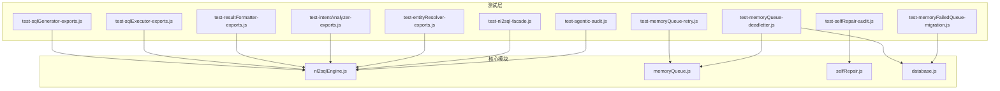
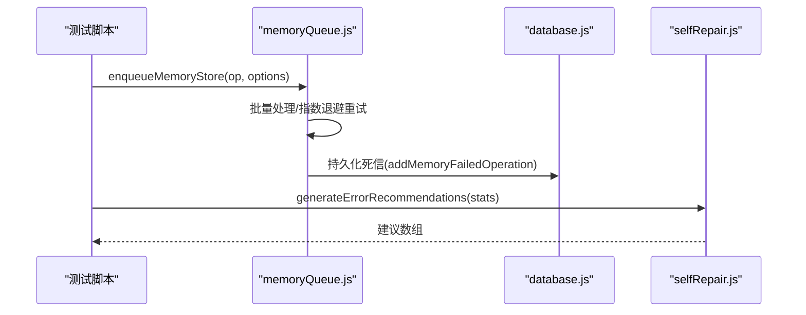
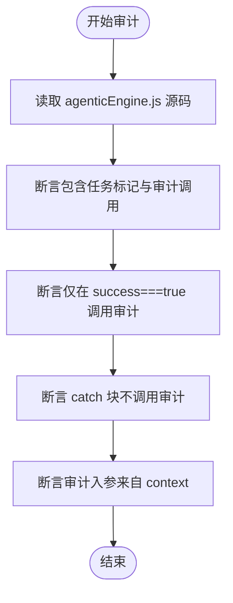
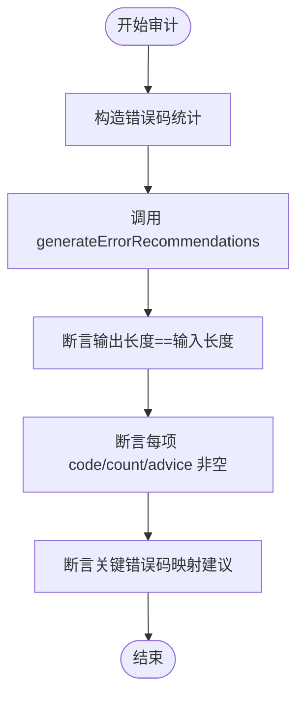
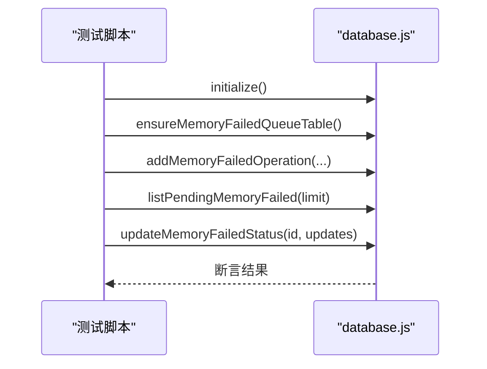
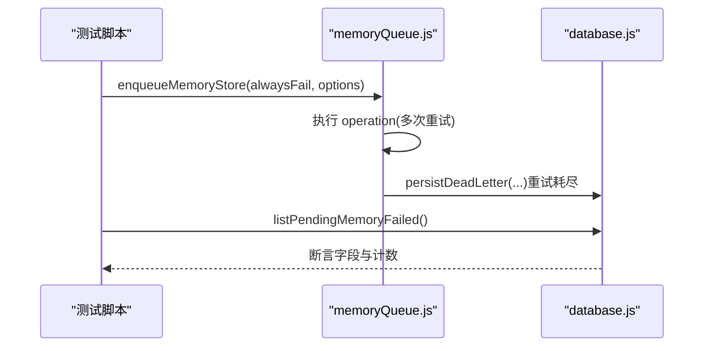
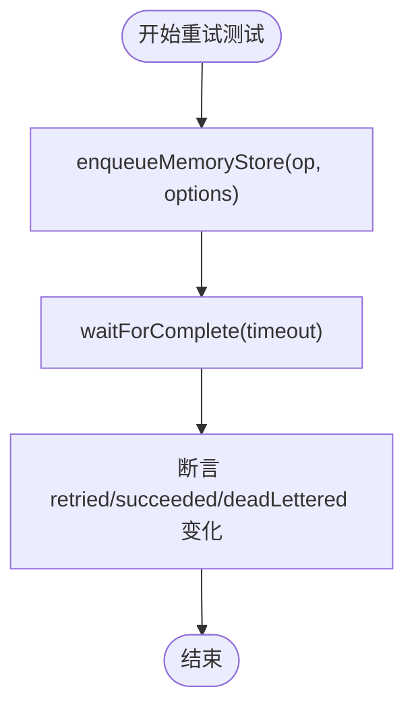
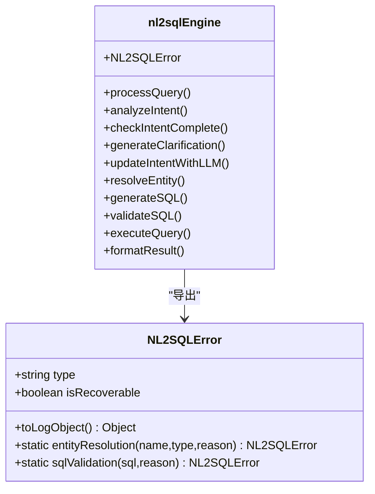
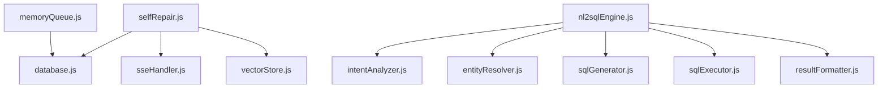

# Phase 4 测试

<cite>
**本文引用的文件**
- [README.md](file://backend/test/phase4/README.md)
- [test-agentic-audit.js](file://backend/test/phase4/test-agentic-audit.js)
- [test-selfRepair-audit.js](file://backend/test/phase4/test-selfRepair-audit.js)
- [test-memoryFailedQueue-migration.js](file://backend/test/phase4/test-memoryFailedQueue-migration.js)
- [test-memoryQueue-deadletter.js](file://backend/test/phase4/test-memoryQueue-deadletter.js)
- [test-memoryQueue-retry.js](file://backend/test/phase4/test-memoryQueue-retry.js)
- [test-nl2sql-facade.js](file://backend/test/phase4/test-nl2sql-facade.js)
- [test-entityResolver-exports.js](file://backend/test/phase4/test-entityResolver-exports.js)
- [test-intentAnalyzer-exports.js](file://backend/test/phase4/test-intentAnalyzer-exports.js)
- [test-resultFormatter-exports.js](file://backend/test/phase4/test-resultFormatter-exports.js)
- [test-sqlExecutor-exports.js](file://backend/test/phase4/test-sqlExecutor-exports.js)
- [test-sqlGenerator-exports.js](file://backend/test/phase4/test-sqlGenerator-exports.js)
- [nl2sqlEngine.js](file://backend/src/core/nl2sqlEngine.js)
- [memoryQueue.js](file://backend/src/memory/memoryQueue.js)
- [selfRepair.js](file://backend/src/core/selfRepair.js)
- [database.js](file://backend/src/core/database.js)
</cite>

## 目录
1. [简介](#简介)
2. [项目结构](#项目结构)
3. [核心组件](#核心组件)
4. [架构总览](#架构总览)
5. [详细组件分析](#详细组件分析)
6. [依赖关系分析](#依赖关系分析)
7. [性能考量](#性能考量)
8. [故障排查指南](#故障排查指南)
9. [结论](#结论)
10. [附录](#附录)

## 简介
本文件为 NL2SQL Phase 4 测试的完整技术文档，聚焦于架构治理与质量保障阶段的回归测试。文档围绕以下目标展开：
- 智能代理审计测试：验证 agenticEngine 的审计埋点在成功路径正确写入查询历史，避免双写。
- 实体解析器导出测试：验证导出契约与核心纯逻辑函数行为。
- 意图分析器导出测试：验证导出契约与纯逻辑函数行为。
- 内存队列迁移测试：验证 memory_failed_queue 表幂等迁移、辅助方法可用性与索引存在。
- 死信队列测试：验证内存队列失败重试耗尽后的死信持久化、计数与字段正确性。
- 重试机制测试：验证指数退避重试策略、等待完成与指标变化。
- NL2SQL 外观模式测试：冻结并验证 nl2sqlEngine 的导出契约一致性。
- 结果格式化器导出测试：验证失败路径与异常降级分支。
- 自我修复审计测试：验证 generateErrorRecommendations 的映射与建议生成。
- SQL 执行器导出测试：验证 validateSQL 分支与 executeQuery 降级分支。
- SQL 生成器导出测试：验证导出契约与 generateSchemaMappingHints 的多表组合提示。

## 项目结构
Phase 4 测试位于 backend/test/phase4 目录，包含独立的单测脚本与运行说明。各测试脚本覆盖不同模块的导出契约、纯逻辑行为与内存系统的可靠性保障。

图表来源
- [test-agentic-audit.js:1-60](file://backend/test/phase4/test-agentic-audit.js#L1-L60)
- [test-selfRepair-audit.js:1-74](file://backend/test/phase4/test-selfRepair-audit.js#L1-L74)
- [test-memoryFailedQueue-migration.js:1-127](file://backend/test/phase4/test-memoryFailedQueue-migration.js#L1-L127)
- [test-memoryQueue-deadletter.js:1-89](file://backend/test/phase4/test-memoryQueue-deadletter.js#L1-L89)
- [test-memoryQueue-retry.js:1-87](file://backend/test/phase4/test-memoryQueue-retry.js#L1-L87)
- [test-nl2sql-facade.js:1-92](file://backend/test/phase4/test-nl2sql-facade.js#L1-L92)
- [test-entityResolver-exports.js:1-76](file://backend/test/phase4/test-entityResolver-exports.js#L1-L76)
- [test-intentAnalyzer-exports.js:1-116](file://backend/test/phase4/test-intentAnalyzer-exports.js#L1-L116)
- [test-resultFormatter-exports.js:1-44](file://backend/test/phase4/test-resultFormatter-exports.js#L1-L44)
- [test-sqlExecutor-exports.js:1-66](file://backend/test/phase4/test-sqlExecutor-exports.js#L1-L66)
- [test-sqlGenerator-exports.js:1-53](file://backend/test/phase4/test-sqlGenerator-exports.js#L1-L53)
- [nl2sqlEngine.js:1-756](file://backend/src/core/nl2sqlEngine.js#L1-L756)
- [memoryQueue.js:1-293](file://backend/src/memory/memoryQueue.js#L1-L293)
- [selfRepair.js:1-641](file://backend/src/core/selfRepair.js#L1-L641)
- [database.js:1-800](file://backend/src/core/database.js#L1-L800)

章节来源
- [README.md:1-51](file://backend/test/phase4/README.md#L1-L51)

## 核心组件
- 智能代理审计：通过源码扫描验证 agenticEngine 成功路径写入 query_history 的审计段落存在且条件正确，避免在失败路径重复写入。
- 自我修复审计：验证 generateErrorRecommendations 对错误码的映射与建议生成，覆盖常见错误场景。
- 内存队列与死信：内存队列支持指数退避重试、批量处理、队列长度保护与死信持久化；数据库模块提供死信表的幂等迁移与辅助方法。
- 导出模块测试：对 intentAnalyzer、entityResolver、sqlGenerator、sqlExecutor、resultFormatter 的导出契约与纯逻辑进行验证。
- 外观模式测试：冻结 nl2sqlEngine 的导出符号表，确保拆分后不回归。

章节来源
- [test-agentic-audit.js:1-60](file://backend/test/phase4/test-agentic-audit.js#L1-L60)
- [test-selfRepair-audit.js:1-74](file://backend/test/phase4/test-selfRepair-audit.js#L1-L74)
- [test-memoryFailedQueue-migration.js:1-127](file://backend/test/phase4/test-memoryFailedQueue-migration.js#L1-L127)
- [test-memoryQueue-deadletter.js:1-89](file://backend/test/phase4/test-memoryQueue-deadletter.js#L1-L89)
- [test-memoryQueue-retry.js:1-87](file://backend/test/phase4/test-memoryQueue-retry.js#L1-L87)
- [test-nl2sql-facade.js:1-92](file://backend/test/phase4/test-nl2sql-facade.js#L1-L92)
- [test-entityResolver-exports.js:1-76](file://backend/test/phase4/test-entityResolver-exports.js#L1-L76)
- [test-intentAnalyzer-exports.js:1-116](file://backend/test/phase4/test-intentAnalyzer-exports.js#L1-L116)
- [test-resultFormatter-exports.js:1-44](file://backend/test/phase4/test-resultFormatter-exports.js#L1-L44)
- [test-sqlExecutor-exports.js:1-66](file://backend/test/phase4/test-sqlExecutor-exports.js#L1-L66)
- [test-sqlGenerator-exports.js:1-53](file://backend/test/phase4/test-sqlGenerator-exports.js#L1-L53)

## 架构总览
Phase 4 测试关注的核心交互如下：

图表来源
- [memoryQueue.js:1-293](file://backend/src/memory/memoryQueue.js#L1-L293)
- [database.js:1-800](file://backend/src/core/database.js#L1-L800)
- [selfRepair.js:1-641](file://backend/src/core/selfRepair.js#L1-L641)

## 详细组件分析

### 智能代理审计测试（agenticEngine 审计）
- 目标：验证 processQuery 成功路径写入 query_history，并避免在 catch 块中重复写入。
- 方法：读取源码并断言包含特定标记、调用 createQueryHistory/markQueryHistorySuccess、条件仅在 finalResult.success===true 时触发、审计字段透传。
- 关键断言：
  - 源码包含任务标记与审计调用。
  - 成功路径调用 createQueryHistory/markQueryHistorySuccess。
  - catch 块内不包含 createQueryHistory。
  - 审计入参来自 context（userRole、tenantId、requestSource、requestIp、rlsApplied）。

图表来源
- [test-agentic-audit.js:1-60](file://backend/test/phase4/test-agentic-audit.js#L1-L60)
- [nl2sqlEngine.js:140-585](file://backend/src/core/nl2sqlEngine.js#L140-L585)

章节来源
- [test-agentic-audit.js:1-60](file://backend/test/phase4/test-agentic-audit.js#L1-L60)
- [nl2sqlEngine.js:140-585](file://backend/src/core/nl2sqlEngine.js#L140-L585)

### 自我修复审计测试（generateErrorRecommendations）
- 目标：验证 generateErrorRecommendations 对错误码的映射与建议生成。
- 方法：构造多种错误码（含未知码）统计，断言输出数组长度、每项 code/count/advice 存在且非空。
- 关键断言：
  - 空数组/null 输入返回空数组。
  - 8 个错误码 → 8 条建议。
  - SR_DB_NOT_READY/SR_DB_NOT_CONFIGURED/RLS_REWRITE_FAILED/LLM_ERROR/UNKNOWN_CODE_XYZ 均有建议。
  - 建议内容包含相应关键字（如 SR_DATABASE_URL、SR_DB_ENABLED、sqlRewriter、LLM_API_KEY）。

图表来源
- [test-selfRepair-audit.js:1-74](file://backend/test/phase4/test-selfRepair-audit.js#L1-L74)
- [selfRepair.js:193-209](file://backend/src/core/selfRepair.js#L193-L209)

章节来源
- [test-selfRepair-audit.js:1-74](file://backend/test/phase4/test-selfRepair-audit.js#L1-L74)
- [selfRepair.js:193-209](file://backend/src/core/selfRepair.js#L193-L209)

### 内存队列迁移测试（memory_failed_queue）
- 目标：验证 memory_failed_queue 表幂等迁移、列与索引存在、辅助方法可用。
- 方法：设置临时 sqlite 路径，初始化数据库，断言表结构、索引、辅助方法（add/list/update）行为。
- 关键断言：
  - 幂等：二次迁移不变更列数。
  - 辅助方法：addMemoryFailedOperation 返回 lastID；listPendingMemoryFailed 返回 pending 记录；updateMemoryFailedStatus 更新 status/retry_count/last_error。
  - payload 透传与序列化正确。

图表来源
- [test-memoryFailedQueue-migration.js:1-127](file://backend/test/phase4/test-memoryFailedQueue-migration.js#L1-L127)
- [database.js:357-377](file://backend/src/core/database.js#L357-L377)

章节来源
- [test-memoryFailedQueue-migration.js:1-127](file://backend/test/phase4/test-memoryFailedQueue-migration.js#L1-L127)
- [database.js:357-377](file://backend/src/core/database.js#L357-L377)

### 死信队列测试（memoryQueue 死信持久化）
- 目标：验证内存队列失败重试耗尽后写入死信表、计数与字段正确。
- 方法：构造永远失败的 operation，等待完成，断言调用次数、耗时、指标变化与死信表字段。
- 关键断言：
  - 调用次数 = 1+MAX_RETRIES。
  - 总耗时 ≥ 期望指数退避之和。
  - deadLettered 递增，retried 至少增加 MAX_RETRIES，succeeded 不变。
  - 死信表字段：operation_type/user_id/last_error/retry_count/status/payload。

图表来源
- [test-memoryQueue-deadletter.js:1-89](file://backend/test/phase4/test-memoryQueue-deadletter.js#L1-L89)
- [memoryQueue.js:154-234](file://backend/src/memory/memoryQueue.js#L154-L234)
- [database.js:217-235](file://backend/src/core/database.js#L217-L235)

章节来源
- [test-memoryQueue-deadletter.js:1-89](file://backend/test/phase4/test-memoryQueue-deadletter.js#L1-L89)
- [memoryQueue.js:154-234](file://backend/src/memory/memoryQueue.js#L154-L234)
- [database.js:217-235](file://backend/src/core/database.js#L217-L235)

### 内存队列重试测试（指数退避）
- 目标：验证指数退避重试策略、等待完成与指标变化。
- 方法：构造前两次失败第三次成功的 operation，断言等待完成、耗时与指标变化；另验证一次成功场景。
- 关键断言：
  - 前两次失败第三次成功：retried 至少 +2，succeeded +1，deadLettered 不变。
  - 一次成功：retried 不变，succeeded +1。
  - 指数退避生效（100ms/400ms/1600ms）。

图表来源
- [test-memoryQueue-retry.js:1-87](file://backend/test/phase4/test-memoryQueue-retry.js#L1-L87)
- [memoryQueue.js:154-215](file://backend/src/memory/memoryQueue.js#L154-L215)

章节来源
- [test-memoryQueue-retry.js:1-87](file://backend/test/phase4/test-memoryQueue-retry.js#L1-L87)
- [memoryQueue.js:154-215](file://backend/src/memory/memoryQueue.js#L154-L215)

### NL2SQL 外观模式测试（导出契约冻结）
- 目标：冻结并验证 nl2sqlEngine 的导出符号表与契约一致性。
- 方法：断言导出函数集合与类型，验证 NL2SQLError 的行为与静态工厂方法。
- 关键断言：
  - 导出符号表与 Phase 3 一致。
  - 每个导出为函数（NL2SQLError 为类）。
  - NL2SQLError 继承 Error，包含 type/isRecoverable/details/toLogObject。
  - 子模块 require 连通性：analyzeIntent/resolveEntity/generateSQL/validateSQL/executeQuery/formatResult 与子模块引用一致。

图表来源
- [test-nl2sql-facade.js:1-92](file://backend/test/phase4/test-nl2sql-facade.js#L1-L92)
- [nl2sqlEngine.js:54-105](file://backend/src/core/nl2sqlEngine.js#L54-L105)
- [nl2sqlEngine.js:740-756](file://backend/src/core/nl2sqlEngine.js#L740-L756)

章节来源
- [test-nl2sql-facade.js:1-92](file://backend/test/phase4/test-nl2sql-facade.js#L1-L92)
- [nl2sqlEngine.js:54-105](file://backend/src/core/nl2sqlEngine.js#L54-L105)
- [nl2sqlEngine.js:740-756](file://backend/src/core/nl2sqlEngine.js#L740-L756)

### 实体解析器导出测试
- 目标：验证导出契约与核心纯逻辑函数行为。
- 方法：断言导出函数存在且为函数；验证 inferTablesFromQuery/extractPotentialEntityNames 的边界与行为；验证 resolveEntity 在 SR DB 未就绪时的降级。
- 关键断言：
  - 导出函数集合正确。
  - inferTablesFromQuery 对空输入返回空数组。
  - extractPotentialEntityNames 支持中文、英文小写化、引号内容提取。
  - resolveEntity 在 SR_DB 未就绪时 found=false 或 reason 为空。

章节来源
- [test-entityResolver-exports.js:1-76](file://backend/test/phase4/test-entityResolver-exports.js#L1-L76)

### 意图分析器导出测试
- 目标：验证导出契约与纯逻辑函数行为。
- 方法：断言导出函数存在且为函数；验证 checkIntentComplete 的多分支（完整/缺失/低置信度/历史 pending/confirm_default）；验证 isAffirmativeClarificationReply/getDialogueSummary/extractDefaultOptionsFromClarification。
- 关键断言：
  - 导出函数集合正确。
  - checkIntentComplete 对不同意图与历史场景断言 complete/pendingConfirmations。
  - isAffirmativeClarificationReply 对多种回复文本断言。
  - getDialogueSummary 生成含角色与类型标签的摘要。
  - extractDefaultOptionsFromClarification 支持结构化与文本解析。

章节来源
- [test-intentAnalyzer-exports.js:1-116](file://backend/test/phase4/test-intentAnalyzer-exports.js#L1-L116)

### 结果格式化器导出测试
- 目标：验证失败路径与异常降级分支。
- 方法：断言 formatResult 对失败结果的处理（不调 LLM），返回字符串且包含错误信息。
- 关键断言：
  - 返回字符串类型。
  - 包含“查询失败”与原始错误码。

章节来源
- [test-resultFormatter-exports.js:1-44](file://backend/test/phase4/test-resultFormatter-exports.js#L1-L44)

### SQL 执行器导出测试
- 目标：验证 validateSQL 分支与 executeQuery 降级分支。
- 方法：断言 validateSQL 对合法/非法/注释/空行等场景的行为；断言 executeQuery 在 SR 未配置时返回已知错误码枚举。
- 关键断言：
  - SELECT/WITH+LIMIT 合法；UPDATE/DELETE 被拒；无 LIMIT 被拒。
  - 注释与空白行不影响合法性。
  - executeQuery 返回对象且 errorCode 属于已知枚举。

章节来源
- [test-sqlExecutor-exports.js:1-66](file://backend/test/phase4/test-sqlExecutor-exports.js#L1-L66)

### SQL 生成器导出测试
- 目标：验证导出契约与 generateSchemaMappingHints 的多表组合提示。
- 方法：断言导出函数存在且为函数；验证 generateSchemaMappingHints 对单表/多表的提示命中。
- 关键断言：
  - 空表/未命中关键词 → 空串。
  - 单表命中关键词（如注册时间/COUNT(DISTINCT)/real_amount/SUM(…)/发言）。
  - 多表组合命中多组提示。

章节来源
- [test-sqlGenerator-exports.js:1-53](file://backend/test/phase4/test-sqlGenerator-exports.js#L1-L53)

## 依赖关系分析
- 模块耦合：
  - memoryQueue 依赖 database（可选）进行死信持久化；在测试环境 database 初始化失败时降级为日志告警。
  - selfRepair 依赖 database/sseHandler/vectorStore 进行健康扫描与死信重放。
  - nl2sqlEngine 作为外观模式，聚合 intentAnalyzer/entityResolver/sqlGenerator/sqlExecutor/resultFormatter。
- 外部依赖：
  - 临时 sqlite（DB_PATH 指向 os.tmpdir()/nl2sql-phase4-*.db），测试结束后自动清理。
  - 无 LLM 依赖，全部用例不调 LLM。
  - 无 SR DB 依赖，全部用例在 SR DB 未就绪时走降级分支。

图表来源
- [memoryQueue.js:15-20](file://backend/src/memory/memoryQueue.js#L15-L20)
- [selfRepair.js:16-26](file://backend/src/core/selfRepair.js#L16-L26)
- [nl2sqlEngine.js:33-37](file://backend/src/core/nl2sqlEngine.js#L33-L37)

章节来源
- [README.md:37-42](file://backend/test/phase4/README.md#L37-L42)
- [memoryQueue.js:15-20](file://backend/src/memory/memoryQueue.js#L15-L20)
- [selfRepair.js:16-26](file://backend/src/core/selfRepair.js#L16-L26)
- [nl2sqlEngine.js:33-37](file://backend/src/core/nl2sqlEngine.js#L33-L37)

## 性能考量
- 指数退避重试：BASE_BACKOFF_MS=100ms，BACKOFF_FACTOR=4，MAX_RETRIES=3，总最小等待时间约为 100+400+1600=2100ms。
- 批量处理：BATCH_SIZE=5，PROCESS_INTERVAL=100ms，提升吞吐同时控制并发。
- 队列长度保护：QUEUE_MAX_SIZE=1000，超限直接走死信，避免 OOM。
- 指标导出：getQueueMetrics 返回累计 enqueued/succeeded/retried/deadLettered/rejectedFull/lastErrorTime/lastError/queueSize/isProcessing，便于观测与告警。

章节来源
- [memoryQueue.js:32-47](file://backend/src/memory/memoryQueue.js#L32-L47)
- [memoryQueue.js:254-260](file://backend/src/memory/memoryQueue.js#L254-L260)

## 故障排查指南
- 死信队列堆积：
  - 观察 deadLettered 指标与 memory_failed_queue pending 数量。
  - 使用 triggerDeadLetterReplay 手动触发扫描并告警。
- 重试失败：
  - 检查 retried 与 lastError/lastErrorTime，确认退避是否生效。
  - 核对 operation 是否幂等，避免副作用导致重试异常。
- 导出契约回归：
  - 使用 test-nl2sql-facade.js 验证导出符号表与类型一致性。
- 审计字段缺失：
  - 确认 ensureQueryHistoryColumns 迁移是否成功，索引是否存在。
- 临时数据库问题：
  - 确认 DB_PATH 指向临时目录，测试结束后清理。

章节来源
- [test-memoryQueue-deadletter.js:58-62](file://backend/test/phase4/test-memoryQueue-deadletter.js#L58-L62)
- [test-selfRepair-audit.js:60-68](file://backend/test/phase4/test-selfRepair-audit.js#L60-L68)
- [memoryQueue.js:220-234](file://backend/src/memory/memoryQueue.js#L220-L234)
- [selfRepair.js:602-623](file://backend/src/core/selfRepair.js#L602-L623)
- [database.js:319-350](file://backend/src/core/database.js#L319-L350)

## 结论
Phase 4 测试通过模块级单测覆盖了智能代理审计、自我修复建议、内存队列重试与死信、导出模块契约与纯逻辑、以及外观模式契约冻结等关键领域。测试策略强调：
- 源码扫描与断言确保审计埋点正确性。
- 纯逻辑函数行为验证与边界条件覆盖。
- 内存系统的可靠性保障（幂等迁移、指数退避、死信持久化）。
- 导出契约冻结与子模块连通性验证。
- 临时数据库与降级分支的稳健性。

## 附录
- 运行方式与覆盖矩阵详见 README。
- 回滚指南：每个拆分后的新文件都可独立 git revert；nl2sqlEngine 的 exports 契约由 test-nl2sql-facade.js 保护。

章节来源
- [README.md:5-51](file://backend/test/phase4/README.md#L5-L51)