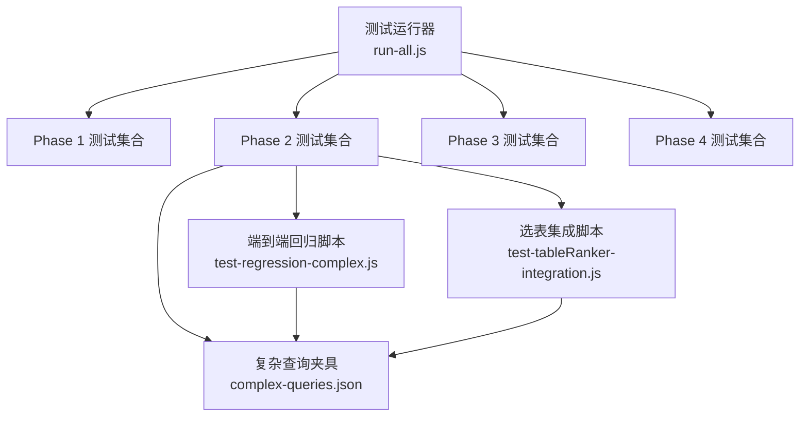
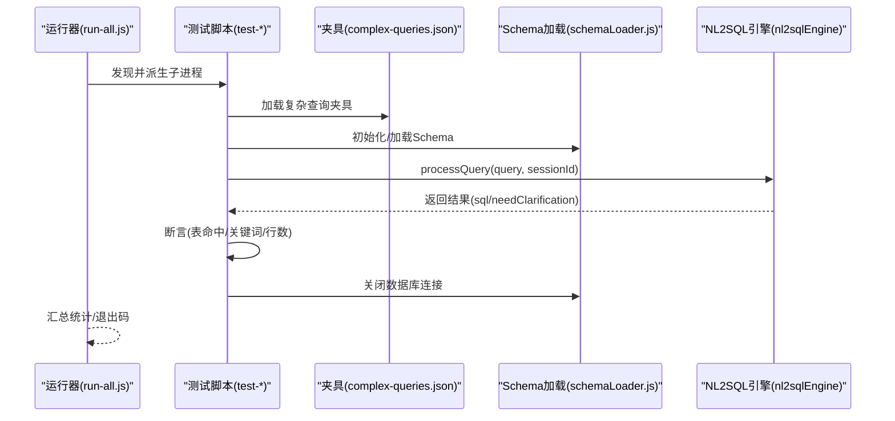
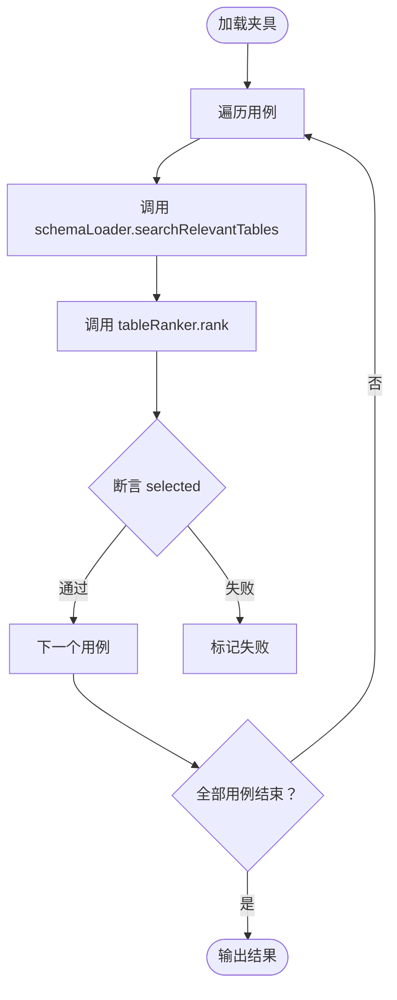
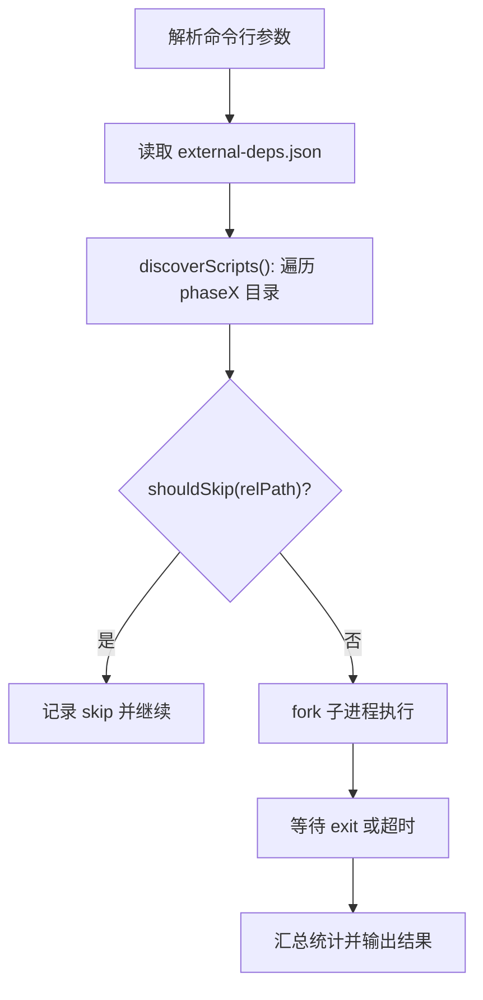
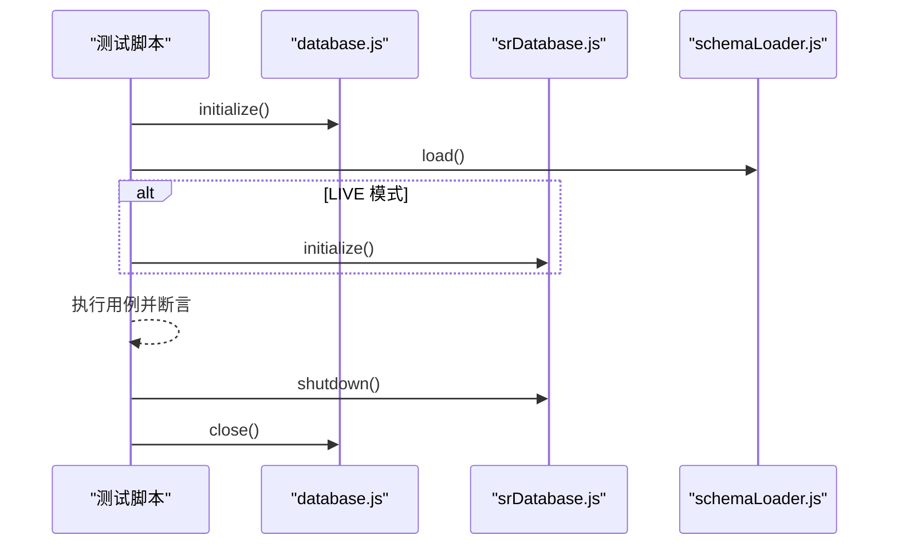
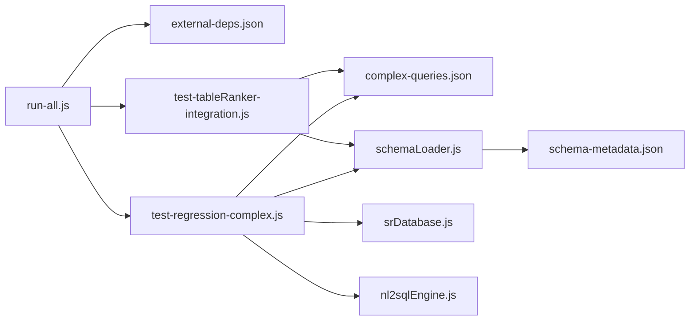

# 测试数据管理

<cite>
**本文引用的文件**
- [backend/test/run-all.js](file://backend/test/run-all.js)
- [backend/test/external-deps.json](file://backend/test/external-deps.json)
- [backend/test/phase1/README.md](file://backend/test/phase1/README.md)
- [backend/test/phase2/README.md](file://backend/test/phase2/README.md)
- [backend/test/phase2/fixtures/complex-queries.json](file://backend/test/phase2/fixtures/complex-queries.json)
- [backend/test/phase2/test-regression-complex.js](file://backend/test/phase2/test-regression-complex.js)
- [backend/test/phase2/test-tableRanker-integration.js](file://backend/test/phase2/test-tableRanker-integration.js)
- [backend/test/phase4/README.md](file://backend/test/phase4/README.md)
- [backend/config/schema-metadata.json](file://backend/config/schema-metadata.json)
- [backend/src/core/schemaLoader.js](file://backend/src/core/schemaLoader.js)
</cite>

## 目录
1. [简介](#简介)
2. [项目结构](#项目结构)
3. [核心组件](#核心组件)
4. [架构总览](#架构总览)
5. [详细组件分析](#详细组件分析)
6. [依赖分析](#依赖分析)
7. [性能考虑](#性能考虑)
8. [故障排查指南](#故障排查指南)
9. [结论](#结论)
10. [附录](#附录)

## 简介
本文件面向测试工程师，系统化梳理 NL2SQL 项目的测试数据管理现状与最佳实践，重点覆盖以下方面：
- 测试夹具的组织、创建与维护策略
- 复杂查询夹具的设计原则、边界条件与一致性保障
- 测试环境的数据准备与清理策略
- 跨测试用例的数据共享与标准化格式
- 测试数据的质量控制与有效性验证
- 基于现有实现的工具使用指南与改进建议

## 项目结构
NL2SQL 的测试体系采用“阶段化 + 夹具化”的组织方式：
- 测试入口与聚合器：通过统一的测试运行器批量发现并执行各阶段测试脚本，支持冒烟模式与按阶段筛选。
- 阶段化测试：Phase 1~4 各自聚焦不同质量目标，测试脚本按功能域划分，便于独立运行与回归。
- 夹具化设计：复杂查询回归使用 JSON 夹具集中描述查询语料、断言规则与期望行为，便于版本化与复用。

**图表来源**
- [backend/test/run-all.js:52-77](file://backend/test/run-all.js#L52-L77)
- [backend/test/phase2/test-regression-complex.js:25-25](file://backend/test/phase2/test-regression-complex.js#L25-L25)
- [backend/test/phase2/test-tableRanker-integration.js:20-20](file://backend/test/phase2/test-tableRanker-integration.js#L20-L20)
- [backend/test/phase2/fixtures/complex-queries.json:1-82](file://backend/test/phase2/fixtures/complex-queries.json#L1-L82)

**章节来源**
- [backend/test/run-all.js:1-181](file://backend/test/run-all.js#L1-L181)
- [backend/test/phase1/README.md:1-34](file://backend/test/phase1/README.md#L1-L34)
- [backend/test/phase2/README.md:1-72](file://backend/test/phase2/README.md#L1-L72)
- [backend/test/phase4/README.md:1-51](file://backend/test/phase4/README.md#L1-L51)

## 核心组件
- 测试运行器：负责发现脚本、按依赖黑白名单跳过、并发派生子进程执行、汇总统计与退出码控制。
- 外部依赖配置：通过 JSON 黑名单声明哪些脚本依赖 LLM 或 SR 数据库，支持冒烟模式自动跳过。
- 复杂查询夹具：集中定义查询语料、断言规则（表命中、SQL 关键词、结果断言模式）与分类标签。
- 选表集成测试：基于夹具驱动 schemaLoader + semanticLayer + tableRanker，断言选表行为。
- 端到端回归测试：在 DRY_RUN/LIVE 模式下执行 NL→SQL，断言关键词与（可选）行数。

**章节来源**
- [backend/test/run-all.js:27-50](file://backend/test/run-all.js#L27-L50)
- [backend/test/external-deps.json:1-11](file://backend/test/external-deps.json#L1-L11)
- [backend/test/phase2/fixtures/complex-queries.json:1-82](file://backend/test/phase2/fixtures/complex-queries.json#L1-L82)
- [backend/test/phase2/test-tableRanker-integration.js:30-50](file://backend/test/phase2/test-tableRanker-integration.js#L30-L50)
- [backend/test/phase2/test-regression-complex.js:33-50](file://backend/test/phase2/test-regression-complex.js#L33-L50)

## 架构总览
测试数据管理的总体流程如下：
- 运行器扫描各阶段目录，发现测试脚本。
- 根据外部依赖配置决定是否跳过脚本。
- 脚本加载夹具，按模式（DRY_RUN/LIVE）执行 NL2SQL 流程。
- 断言规则覆盖表命中、SQL 关键词、结果行数等。
- 测试结束后进行资源清理（关闭数据库连接）。

**图表来源**
- [backend/test/run-all.js:79-114](file://backend/test/run-all.js#L79-L114)
- [backend/test/phase2/test-regression-complex.js:52-101](file://backend/test/phase2/test-regression-complex.js#L52-L101)
- [backend/src/core/schemaLoader.js:75-131](file://backend/src/core/schemaLoader.js#L75-L131)

## 详细组件分析

### 复杂查询夹具设计与使用
- 设计原则
  - 结构化：以 JSON 描述查询、断言与分类，便于版本控制与评审。
  - 可扩展：支持 mustInclude/mustIncludeAny/maxSize/coreTableCount 等选表断言；支持 sqlKeywords 的 required/requiredAny/forbidden。
  - 可演进：resultAssertions 支持 DRY_RUN/LIVE 模式切换，便于逐步引入真实执行断言。
- 使用方法
  - 选表集成测试：直接读取夹具，调用 schemaLoader.searchRelevantTables 与 tableRanker.rank，断言 selected。
  - 端到端回归：读取夹具，调用 nl2sqlEngine.processQuery，断言 SQL 关键词与（可选）行数。
- 边界条件覆盖
  - mustIncludeAny：覆盖“任一满足”的场景（如注册+首充或注册+订单）。
  - requiredAny：覆盖“任一组件满足”的场景（如日期函数族）。
  - maxSize/coreTableCount：限制选表规模与核心表数量，防止过度 JOIN。
- 一致性保证
  - 通过固定查询文本与断言规则，确保不同运行环境下行为一致。
  - DRY_RUN 模式优先，LIVE 模式作为补充验证。

**图表来源**
- [backend/test/phase2/test-tableRanker-integration.js:73-102](file://backend/test/phase2/test-tableRanker-integration.js#L73-L102)
- [backend/test/phase2/fixtures/complex-queries.json:30-50](file://backend/test/phase2/fixtures/complex-queries.json#L30-L50)

**章节来源**
- [backend/test/phase2/fixtures/complex-queries.json:1-82](file://backend/test/phase2/fixtures/complex-queries.json#L1-L82)
- [backend/test/phase2/test-tableRanker-integration.js:30-50](file://backend/test/phase2/test-tableRanker-integration.js#L30-L50)
- [backend/test/phase2/test-regression-complex.js:33-50](file://backend/test/phase2/test-regression-complex.js#L33-L50)

### 测试运行器与依赖管理
- 脚本发现：按阶段目录递归发现 .js/.test.js，排除 fixtures/ 与 README。
- 依赖判定：根据 external-deps.json 判定是否需要 LLM 或 SR 数据库；支持 --smoke 跳过。
- 执行策略：fork 子进程，统一工作目录为 backend/，设置超时与退出码。
- 汇总统计：按 pass/fail/skip/timeout 统计，失败时输出最近日志片段。

**图表来源**
- [backend/test/run-all.js:21-50](file://backend/test/run-all.js#L21-L50)
- [backend/test/run-all.js:52-77](file://backend/test/run-all.js#L52-L77)
- [backend/test/run-all.js:79-114](file://backend/test/run-all.js#L79-L114)

**章节来源**
- [backend/test/run-all.js:1-181](file://backend/test/run-all.js#L1-L181)
- [backend/test/external-deps.json:1-11](file://backend/test/external-deps.json#L1-L11)

### 测试环境准备与清理
- 环境变量
  - LLM 相关：LLM_API_BASE、LLM_API_KEY、LLM_MODEL（端到端回归必需）。
  - SR 数据库：SR_DATABASE_URL_TEST（LIVE 模式启用），SR_DATABASE_URL、SR_DB_ENABLED（运行时注入）。
  - Schema：NODE_ENV=test，schema-metadata.json 路径由 schemaLoader 解析。
- 准备步骤
  - 初始化数据库连接与 schema 加载；在 LIVE 模式下初始化 SR 数据库连接池。
- 清理策略
  - 测试结束主动关闭 SR 数据库与普通数据库连接，避免资源泄漏。

**图表来源**
- [backend/test/phase2/test-regression-complex.js:64-77](file://backend/test/phase2/test-regression-complex.js#L64-L77)
- [backend/test/phase2/test-regression-complex.js:104-105](file://backend/test/phase2/test-regression-complex.js#L104-L105)
- [backend/src/core/schemaLoader.js:75-131](file://backend/src/core/schemaLoader.js#L75-L131)

**章节来源**
- [backend/test/phase2/README.md:36-46](file://backend/test/phase2/README.md#L36-L46)
- [backend/test/phase2/test-regression-complex.js:21-23](file://backend/test/phase2/test-regression-complex.js#L21-L23)
- [backend/test/phase2/test-regression-complex.js:64-77](file://backend/test/phase2/test-regression-complex.js#L64-L77)
- [backend/test/phase2/test-regression-complex.js:104-105](file://backend/test/phase2/test-regression-complex.js#L104-L105)

### 跨测试用例的数据共享与标准化
- 复杂查询夹具集中存放于 fixtures，供多个测试脚本共享，避免重复维护。
- 选表集成与端到端回归共享同一套夹具，确保断言口径一致。
- 标准化格式：统一的 JSON 结构，包含查询文本、断言规则与分类标签，便于评审与自动化校验。

**章节来源**
- [backend/test/phase2/test-tableRanker-integration.js:20-20](file://backend/test/phase2/test-tableRanker-integration.js#L20-L20)
- [backend/test/phase2/test-regression-complex.js:25-25](file://backend/test/phase2/test-regression-complex.js#L25-L25)
- [backend/test/phase2/fixtures/complex-queries.json:1-82](file://backend/test/phase2/fixtures/complex-queries.json#L1-L82)

### 测试数据质量控制与验证
- 数据完整性检查
  - 夹具字段校验：断言 mustInclude/mustIncludeAny/maxSize/coreTableCount 等规则。
  - SQL 关键词校验：required/requiredAny/forbidden 三类规则覆盖。
- 有效性验证
  - DRY_RUN 模式下通过关键词断言与选表断言评估 SQL 生成质量。
  - LIVE 模式下增加行数断言，进一步验证执行层面的有效性。
- 阈值与验收
  - 复杂查询回归在 DRY_RUN 下失败率 ≤ 20%（即通过率 ≥ 80%）。

**章节来源**
- [backend/test/phase2/test-tableRanker-integration.js:30-50](file://backend/test/phase2/test-tableRanker-integration.js#L30-L50)
- [backend/test/phase2/test-regression-complex.js:33-50](file://backend/test/phase2/test-regression-complex.js#L33-L50)
- [backend/test/phase2/README.md:48-56](file://backend/test/phase2/README.md#L48-L56)

## 依赖分析
- 运行器依赖
  - 外部依赖黑名单：决定脚本是否跳过。
  - 环境变量：LLM_API_KEY/LLM_API_BASE、SR_DATABASE_URL_TEST。
- 复杂查询夹具依赖
  - 选表集成：依赖 schema-loader 与 tableRanker。
  - 端到端回归：依赖 nl2sqlEngine、schemaLoader、srDatabase（LIVE 模式）。
- Schema 元数据依赖
  - schema-metadata.json 由 schemaLoader 加载，影响向量/关键词匹配路径与表选择。

**图表来源**
- [backend/test/run-all.js:27-50](file://backend/test/run-all.js#L27-L50)
- [backend/test/phase2/test-regression-complex.js:59-62](file://backend/test/phase2/test-regression-complex.js#L59-L62)
- [backend/test/phase2/test-tableRanker-integration.js:52-69](file://backend/test/phase2/test-tableRanker-integration.js#L52-L69)
- [backend/src/core/schemaLoader.js:75-131](file://backend/src/core/schemaLoader.js#L75-L131)
- [backend/config/schema-metadata.json:1-200](file://backend/config/schema-metadata.json#L1-L200)

**章节来源**
- [backend/test/external-deps.json:1-11](file://backend/test/external-deps.json#L1-L11)
- [backend/test/phase2/test-regression-complex.js:59-62](file://backend/test/phase2/test-regression-complex.js#L59-L62)
- [backend/test/phase2/test-tableRanker-integration.js:52-69](file://backend/test/phase2/test-tableRanker-integration.js#L52-L69)
- [backend/src/core/schemaLoader.js:75-131](file://backend/src/core/schemaLoader.js#L75-L131)

## 性能考虑
- 选表路径选择：当向量服务不可用时自动退化到关键词匹配路径，保证测试可用性。
- 资源释放：测试结束统一关闭数据库连接，避免长时间占用连接池。
- 执行并发：运行器使用 fork 并发执行，缩短整体测试时长；同时设置超时避免卡死。

**章节来源**
- [backend/test/phase2/test-tableRanker-integration.js:71-72](file://backend/test/phase2/test-tableRanker-integration.js#L71-L72)
- [backend/test/phase2/test-regression-complex.js:104-105](file://backend/test/phase2/test-regression-complex.js#L104-L105)
- [backend/test/run-all.js:94-97](file://backend/test/run-all.js#L94-L97)

## 故障排查指南
- 未设置 LLM 环境变量导致端到端回归跳过
  - 现象：脚本打印警告并退出。
  - 处理：补齐 LLM_API_BASE/KEY/MODEL 或使用冒烟模式跳过。
- SR 数据库未就绪导致真实执行失败
  - 现象：LIVE 模式下断言失败或连接异常。
  - 处理：设置 SR_DATABASE_URL_TEST 或改用 DRY_RUN 模式。
- 复杂查询断言失败
  - 现象：tablesCalled/sqlKeywords/resultAssertions 任一不满足。
  - 处理：核对夹具规则与实际 SQL，必要时放宽阈值或调整查询。
- 超时与退出码
  - 现象：子进程超时或非零退出码。
  - 处理：查看最近日志片段，定位阻塞点或异常堆栈。

**章节来源**
- [backend/test/phase2/test-regression-complex.js:53-57](file://backend/test/phase2/test-regression-complex.js#L53-L57)
- [backend/test/phase2/test-regression-complex.js:97-100](file://backend/test/phase2/test-regression-complex.js#L97-L100)
- [backend/test/run-all.js:131-151](file://backend/test/run-all.js#L131-L151)

## 结论
NL2SQL 的测试数据管理以“夹具化 + 阶段化 + 运行器”为核心，实现了复杂查询回归的高可维护性与可扩展性。通过统一的断言规则与环境配置，既能在 DRY_RUN 下快速验证 SQL 生成质量，又可在 LIVE 模式下进行端到端验证。建议后续在夹具版本控制、断言覆盖率与自动化校验方面持续增强，以进一步提升测试效率与稳定性。

## 附录
- 工具与命令
  - 全量测试：在根目录执行测试脚本或 npm 脚本。
  - 冒烟测试：添加 --smoke 参数跳过外部依赖脚本。
  - 指定阶段：添加 --phase=N 仅运行某阶段。
- 环境变量清单
  - LLM：LLM_API_BASE、LLM_API_KEY、LLM_MODEL
  - SR 数据库：SR_DATABASE_URL_TEST（LIVE 模式）、SR_DATABASE_URL、SR_DB_ENABLED
  - 其他：NODE_ENV=test、DB_PATH（临时 sqlite）

**章节来源**
- [backend/test/phase4/README.md:7-19](file://backend/test/phase4/README.md#L7-L19)
- [backend/test/phase2/README.md:36-46](file://backend/test/phase2/README.md#L36-L46)
- [backend/test/phase1/README.md:30-34](file://backend/test/phase1/README.md#L30-L34)